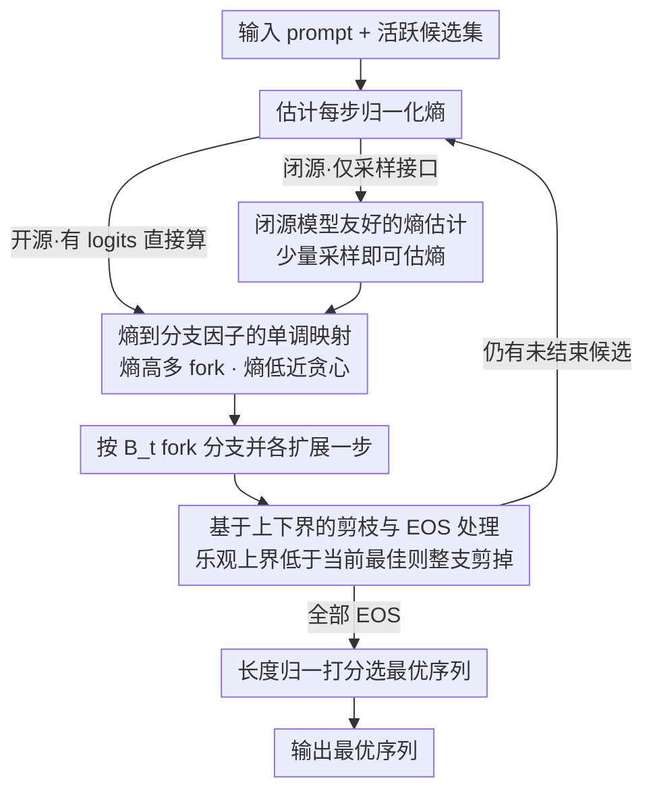

# Entropy-informed Decoding: Adaptive Information-Driven Branching

**会议**: ICML 2026  
**arXiv**: [2605.09745](https://arxiv.org/abs/2605.09745)  
**代码**: 无  
**领域**: LLM 解码 / 自适应推理 / 信息论  
**关键词**: 熵自适应, 分支因子, beam search, 推理时算力分配, regret bound

## 一句话总结
EDEN（Entropy-informed DEcodiNg）把每一步的束宽 $B_t$ 设成与归一化熵 $\bar H_t$ 单调正比——高熵 fork 多分支、低熵步骤近贪心——用更少的总扩展近似更宽的 beam search；理论上证明熵单调的分支因子在期望累计 regret 上严格优于任何固定束宽，且能给出 $\mathbb{E}[R_T] \leq G P_\max \sum_t \exp(-c m_t \Delta_\min^2)$ 的显式 regret 率。

## 研究背景与动机

**领域现状**：LLM 推理时解码大体分两条线：(1) 采样类（top-$k$、nucleus $p$、min-$p$、top-$H$）用随机性换多样性，但通常只走一条路径；(2) 搜索类（beam search、best-of-$n$、majority voting）显式展开多个候选再选优，但算力消耗与任务难度无关——简单题也照样跑满 $n$ 个分支。

**现有痛点**：采样类**探索过窄**，一次只承诺一条路径，遇到推理分叉容易被早期低概率 token 锁死；搜索类**探索均匀**，简单 token 和困难 token 给同样多的算力，浪费严重。已有 entropy 相关工作（Simonds 2025、Entropix、Top-$H$、HARP 等）要么只把熵当作触发开关（branch or not），要么用它做模型切换 / 采样阶段截断，从没有人**把熵直接连续映射到 beam 宽度**并给出理论保证。

**核心矛盾**：好的解码应该「该贪心就贪心、该展开就展开」，但现有方法把分支因子写死成超参，无法在生成过程中根据 token 难度自适应分配。

**本文目标**：(1) 设计一个可插拔、模型无关的搜索策略，让每步算力随模型自身不确定性变化；(2) 用 noisy-maximization 框架给出严格的 regret bound；(3) 对闭源模型也能用（仅 API 访问也能估熵）。

**切入角度**：把 next-token 选择视作 sub-Gaussian noise 下的 noisy maximization 问题——若估计预算 $m_t$ 与「步难度」匹配，单步出错概率呈指数下降；而 Shannon 熵 $H_t$ 既能刻画候选数量（perplexity $\text{PP}_t = e^{H_t}$）又能刻画 top-2 间隔 $\gamma = \log(p_1 / p_2)$。

**核心 idea**：把每步束宽设成 $B_t = \max(1, \lfloor B_\max \cdot \bar H_t \rfloor)$，$\bar H_t = H_t / \log |\mathcal{V}|$ 是归一化熵；高熵 fork 自动多 branch，低熵步骤自动退化成贪心。

## 方法详解

### 整体框架
EDEN 想解决的是 beam search「束宽写死、算力跟任务难度无关」的浪费问题，做法是把固定的束宽换成一个随每步不确定性变化的状态量。它维持一个活跃候选集，每展开一步就先看当前候选下一 token 分布有多「模糊」（用归一化熵度量），熵高就 fork 出更多分支、熵低就近乎贪心地只留一条，再配合一套乐观/悲观上下界把没希望的分支提前剪掉，最后按长度归一化的累积 log-prob 选出最优序列。整套流程纯推理时执行，不改任何模型参数；其中每步熵在开源模型上可由 logits 直接算，对只暴露采样接口的闭源模型也能用少量采样估出。

### 关键设计

**1. 熵到分支因子的单调映射：让每步算力随 token 难度自适应**

针对的痛点是固定束宽对简单 token 和困难 token 一视同仁。EDEN 用最朴素的分段线性映射把不确定性直接翻译成搜索预算：$B_t = f(H_t, B_\max) = \max(1, \lfloor B_\max \cdot \bar H_t \rfloor)$，其中 $\bar H_t = H_t / \log|\mathcal{V}|$ 是按词表大小归一化、落在 $[0,1]$ 的熵。当模型超有信心（$\bar H_t \to 0$）时分支数退化到 1，等同贪心；当分布极度模糊（$\bar H_t \to 1$）时扩展接近上限 $B_\max$。这个映射之所以合理，由两条引理撑着：Lemma 3.1 说高熵意味着 $\varepsilon$-typical 集大小至少 $(1-\varepsilon)\text{PP}^{1/\varepsilon}$（$\text{PP}_t = e^{H_t}$ 是 perplexity），即真正值得探的候选确实变多了；Lemma 3.2 说 top-2 的对数间隔满足 $\gamma \geq \log(e^{-H}/(1-e^{-H}))$，低熵时间隔大、一眼能选对，高熵时间隔小、容易选错。两条合起来正好说明「熵越大越该多花估计预算」，于是把束宽和熵正比挂钩在信息论上是站得住的。

**2. 基于上下界的剪枝与 EOS 处理：admissible 地砍掉无望分支**

beam search 的算力大头浪费在「注定赢不了」的候选上。EDEN 借 A* 的思路给每个尚未结束的候选估一对未来分数界：上界 $\bar S$ 假设剩余 token 概率全是 1（最乐观），下界 $\underline S$ 假设全是 $1/|\mathcal{V}|$（最悲观）。若某候选的乐观上界都低于当前最佳分 $S^*$，整支直接砍掉；否则用它的悲观下界去更新 $S^*$。已经吐出 EOS 的候选则把上下界都设成实际分数直接定档。因为上界是 admissible 的（永不低估真实最优），这套剪枝既能大幅省算力又保证不会误删真正的最优解。候选排序用长度归一的 $\text{Score}_\alpha = s(y_{1:t}) / t^\alpha$，避免短序列因累积 log-prob 天然偏高而占便宜。

**3. 闭源模型友好的熵估计：只给采样接口也能用**

EDEN 表面上需要 logits 才能算熵，这会把它限制在本地开源模型上。作者给出 sub-linear 样本复杂度上界破解这点：对只暴露采样、拿不到 logits 的闭源 API，把熵估到 $\epsilon$ 精度只需 $\tilde O(1/\epsilon^2)$ 次采样，远小于词表大小 $|\mathcal{V}|$。配合分桶估计，每步几十次采样就够估出 $\bar H_t$。这让 EDEN 不再是「必须有 logits」的本地优化，而是能直接武装到 ChatGPT、Claude 这类只给采样接口的封闭模型上——这是 search-based 解码里少见的不依赖 logits 的方案。

### 损失函数 / 训练策略
本工作不训练任何参数，理论核心是把 next-token 选择建模成 noisy maximization。每个候选 $i$ 的真实价值是 $V_t(i) = \log P(i | x_t) + \text{OPT}_{t+1}(i)$，而我们只能拿到估计器 $\hat V_t(i)$，其方差代理 $\sigma_t^2 = \delta^2 / m_t$ 随估计预算 $m_t$ 反比下降。Proposition 3.3 在 Lipschitz 连续假设下证明，要把单步选错概率压到 $\delta_t$ 以下所需的预算 $m_t \gtrsim \frac{1}{(\Delta_t^\text{eff})^2} \log(\text{PP}_t / \delta_t)$ 随 $H_t$ 单调上升——这正是「熵越高越该多分支」的定量版本。在此之上 Theorem 3.4 给出全局结论：只要熵在解码过程中有波动，熵单调的分支因子在期望累计 regret 上严格优于任何固定束宽，并给出显式率 $\mathbb{E}[R_T] \leq G P_\max \sum_t \exp(-c m_t \Delta_\min^2)$；实证上 Wang 2026、Cao 2026 已表明 LLM 生成熵确实波动很大，因此该前提通常成立。

## 实验关键数据

### 主实验

| 方法 | GSM8K ↑ | MATH500 ↑ | HumanEval ↑ | SciBench ↑ | Friedman Rank ↓ | EDEN > 该方法的后验概率 |
|------|---------|-----------|-------------|------------|-----------------|--------------------------|
| Greedy | 73.5% | 27.4% | 27.0% | 4.9% | 6.12 | 0.99 |
| Top-$k$ | 70.7% | 23.0% | 27.6% | 4.9% | 7.00 | 1.00 |
| Top-$p$ | 73.5% | 27.4% | 27.0% | 4.8% | 6.62 | 0.99 |
| Top-$H$ | 69.7% | 26.0% | 27.0% | 4.5% | 8.12 | 1.00 |
| Min-$p$ | 72.3% | 28.0% | 25.8% | 4.3% | 8.00 | 1.00 |
| Best-of-5 | 78.2% | 28.2% | 27.0% | 5.2% | 4.62 | 0.96 |
| Beam search (width 3) | — | — | — | — | — | 0.77 |
| **EDEN ($B_\max = 5$)** | **best avg** | — | — | — | **best** | — |

（Friedman 检验 $p = 0.012$，差异统计显著；Bayesian hierarchical 给 EDEN 75% 的「整体最佳」后验概率。）

### 消融实验

| 配置 | 关键发现 | 说明 |
|------|---------|------|
| EDEN (full) | 准确率最高、扩展次数最少 | 熵自适应分支 |
| 固定 beam width = 3/5/7 | 准确率持平或略低、扩展次数线性 | 验证「固定束宽浪费算力」 |
| 熵阈值二值触发 | 准确率介于 greedy 与 EDEN 之间 | 验证连续映射比 binary trigger 好 |
| 仅 API 闭源（限采样估熵） | 性能略降但仍优于 greedy | 验证 sub-linear 估熵的可行性 |

### 关键发现
- **EDEN 在 4 个 benchmark 上拿到最佳 Friedman rank**：Math、Code、Science 都覆盖，证明效益跨任务类型稳健，不是某一类任务的偶然。
- **比 beam search 用更少扩展达到相当或更好的准确率**：表 1 括号里的总扩展数比 width=3 beam 还少，验证了「近似更宽 beam」的承诺。
- **跨模型族鲁棒**：Llama-3.2-3B、Gemma3、IBM Granite、Mistral 上都看到改进（附录 B），说明熵作为信号在不同分布族里都靠谱。
- **Pareto 优势**：Bayesian 分析里 EDEN 对其他方法的 pairwise dominance 概率 ≥ 96%，对 beam search 也有 77%。
- **变方差越大越赚**：Theorem 3.4 的几何直觉是「熵越变化越多，自适应分配越有优势」——实证里推理 / 代码任务熵确实波动大，所以 EDEN 在这些任务上提升最显著。

## 亮点与洞察
- **理论 + 实证双轨**：一边用 noisy max + sub-Gaussian 的标准武器给出 regret 率，一边在 4 个任务 × 4 个模型上做 Bayesian 后验分析，论证结构非常完整。
- **「分支因子作为算力一阶变量」的视角**：解码社区长期把束宽当超参；本文显式把它升级为 step-wise 状态变量，给类似 speculative decoding、early exit 等推理时优化指出一条参数化思路。
- **API 友好性**：sub-linear 熵估计让 EDEN 在闭源模型上仍可用，这是社区里很少有的「不依赖 logits」的 search-based 解码方案，潜在部署面广。

## 局限与展望
- 只在 3B 量级模型 + 标准 benchmark 上评测；70B+ 大模型上熵分布更平、分支收益是否仍显著未知。
- $f(H, B_\max)$ 是分段线性，参数 $a=1, b=0$ 是默认值；论文未系统调优非线性映射形式，可能存在更优函数族。
- regret bound 的常数 $c$ 和 Lipschitz $\Lambda$ 在实际系统中难以测量，理论保证更多是「定性指南」而非「定量预算」。
- 实验里 $T = 400$ 的最大生成长度，对长文/agent 链路（数千 token）下 EDEN 的累计收益和算力曲线没有覆盖。
- 与 RL / process reward model 类自适应推理方法的正交结合尚未探索。

## 相关工作与启发
- **vs Entropix / Simonds**：他们用熵做模型切换 / CoT token 插入；EDEN 把熵连续映射到束宽，是更细粒度的算力分配。
- **vs Top-$H$ 解码（Potraghloo et al. 2026）**：Top-$H$ 用熵截断采样分布；EDEN 把熵用在「展开多少分支」这一维度，思路正交可叠加。
- **vs HARP**：HARP 用熵触发 transformer 额外计算；EDEN 在更高层的搜索算法上做自适应，可以与 HARP 这类底层修改同时部署。
- **vs Best-of-$n$ / Majority voting**：这些方法均匀分配预算到独立完整 rollouts；EDEN 按需 token 级分配，对推理链路里「关键 fork」的算力使用效率更高。

## 评分
- 新颖性: ⭐⭐⭐⭐ 把熵 → 束宽连续化并给出 regret 率，是该研究线的明确推进。
- 实验充分度: ⭐⭐⭐⭐ 4 任务 × 多模型族 + Bayesian 分析；缺大模型与长生成场景。
- 写作质量: ⭐⭐⭐⭐⭐ 引理-命题-定理链条清晰，把直觉与证明衔接得很好。
- 价值: ⭐⭐⭐⭐ 推理时算力优化是 LLM 部署的核心议题，EDEN 给出便宜且可解释的方案，落地潜力大。

<!-- RELATED:START -->

## 相关论文

- [\[ICML 2026\] Probability-Entropy Calibration: An Elastic Indicator for Adaptive Fine-tuning](probability-entropy_calibration_an_elastic_indicator_for_adaptive_fine-tuning.md)
- [\[ICML 2026\] Locally Coherent Parallel Decoding in Diffusion Language Models](locally_coherent_parallel_decoding_in_diffusion_language_models.md)
- [\[ICML 2026\] HE-SNR: Uncovering Latent Logic via Entropy for Guiding Mid-Training on SWE-bench](he-snr_uncovering_latent_logic_via_entropy_for_guiding_mid-training_on_swe-bench.md)
- [\[ACL 2026\] Learning Adaptive Parallel Execution for Efficient Code Localization](../../ACL2026/code_intelligence/learning_adaptive_parallel_execution_for_efficient_code_localization.md)
- [\[ACL 2026\] Static Program Slicing Using Language Models With Dataflow-Aware Pretraining and Constrained Decoding](../../ACL2026/code_intelligence/static_program_slicing_using_language_models_with_dataflow-aware_pretraining_and.md)

<!-- RELATED:END -->
