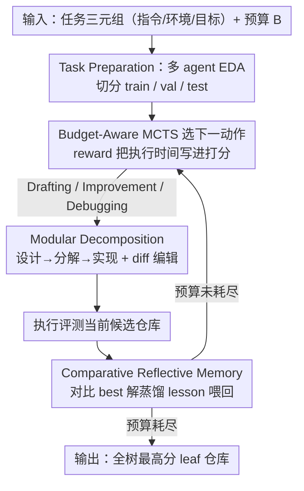

# MARS: Modular Agent with Reflective Search for Automated AI Research

**会议**: ICML 2026  
**arXiv**: [2602.02660](https://arxiv.org/abs/2602.02660)  
**代码**: https://github.com/jfc43/MARS (有)  
**领域**: LLM Agent / 自动化机器学习 (AutoML) / MLE Agent  
**关键词**: MLE-Bench, 模块化 Agent, Budget-Aware MCTS, Comparative Reflective Memory, Lesson Learning

## 一句话总结
MARS 把自动化 AI 研究重构成"在软件仓库空间中搜索最优解"的问题，用 **预算感知 MCTS + 模块化"设计-分解-实现"流水线 + 比较式反思记忆** 三根支柱，在 MLE-Bench 上拿到开源框架 SOTA，金牌率 31.1%（Gemini-3-Pro-Preview），并出现 63% 的跨分支课程迁移这种"Aha! moment"。

## 研究背景与动机

**领域现状**：LLM agent 在通用软件工程上已经很强（修 GitHub issue、写测试），最近一批工作（AIDE、AIRA、R&D-Agent、ML-Master、InternAgent 等）开始把它们用到自动化 AI 研究的核心瓶颈 —— Machine Learning Engineering (MLE) 任务上，并在 OpenAI 的 MLE-Bench（75 个 Kaggle 竞赛 × 24h × 1×A100）上比拼金/银/铜牌率。

**现有痛点**：作者总结现有 MLE agent 三个结构性缺陷：

- **忽略执行成本**：当前搜索（greedy、vanilla MCTS、evolutionary）只优化任务性能，不管 wall-clock。一个把准确率提 0.1%、把训练从 1h 拉到 10h 的方案在 24h 预算里是灾难，但标准 UCT 还是会偏向它。
- **monolithic 脚本脆弱**：现有 agent 多数生成一个大 Python 文件，token 上限挤压逻辑、改一处要重写全部、debug 定位困难，无法承载真实研究 repo 那种"数据-模型-训练循环"多模块耦合。
- **memory 解决不了 credit assignment**：实验结果变好时，到底是哪一行代码改动起的作用？Reflexion/MemGPT 这类 verbal reflection 或轨迹缓存只能"记住做过什么"，无法定位因果。

**核心矛盾**：MLE ≠ 通用编程。前者是"昂贵评估 + 不透明归因 + 高架构复杂度"的概率性长程任务，需要的是**带预算的策略式搜索**而不是更聪明的单脚本生成器。

**本文目标**：设计一个 agent scaffolding，同时回答三个子问题 ——（1）怎么在搜索时显式 trade-off 性能与成本；（2）怎么让 agent 产出 repo-level 而非脚本的解；（3）怎么把"成功 vs 失败"的差异蒸馏成可迁移的因果经验。

**切入角度**：把 MLE 形式化为 $s^* = \arg\max_s \mathcal{O}(s, \mathcal{E})$ s.t. $\text{Cost}(s) \le B$，将解空间从"所有可能 Python 程序"重新定义为"所有可能模块化仓库 $s_n = \langle \{\mathcal{M}_j\}_{j=1}^{l}, \pi_{\text{main}}\rangle$"，让搜索、记忆、奖励函数都围绕这个 repo-level 表示设计。

**核心 idea**：用 **预算感知 MCTS** 在 repo 空间内搜索，用 **Design-Decompose-Implement** 替代单脚本生成，用 **比较式反思记忆**（对比当前解和 best-known 解的 diff）解决 credit assignment —— 三者协同形成 long-horizon "Aha! moment"。

## 方法详解

### 整体框架
MARS 要解决的是"在 24h wall-clock 预算内，把一个 MLE 任务做到金牌水平"，它的做法是把这件事重述成一个带约束的搜索问题：输入是任务三元组 $\mathcal{P} = (\mathcal{I}, \mathcal{E}, \mathcal{O})$（指令 / 环境 / 目标）和预算 $B$，要找的是在 $B$ 内最大化目标 $\mathcal{O}$ 的一份模块化仓库 $s_n = \langle \{\mathcal{M}_j\}_{j=1}^{l}, \pi_{\text{main}}\rangle$。

整个系统是一个迭代 loop。开局先做一次 Task Preparation：多 agent 提取任务元数据、做探索性数据分析（EDA）生成报告指导后续特征工程，并切好 train/val/test。之后进入 MARS Loop —— 在一棵 MCTS 树上反复地"决定下一步动作、生成或修改仓库、从执行结果蒸馏经验喂回去"，每个树节点就是一份候选仓库，可执行的扩展动作有三种：在 root 处从零写新解的 **Drafting**、在 valid 节点上改模块的 **Improvement**、在 buggy 节点上修 runtime error 的 **Debugging**（最多 $N_d=10$ 次 debug 循环）。预算耗尽后输出全树 score 最高的 leaf 对应的仓库。下面三个关键设计分别对应这个 loop 的"怎么写代码（Modular Decomposition）、怎么记经验（Comparative Reflective Memory）、怎么选下一步（Budget-Aware MCTS）"。

### 关键设计

**1. Modular Decomposition：把"吐一个大脚本"换成"先架构再拆模块逐个验证"**

现有 MLE agent 普遍让 LLM 一口气生成一个大 Python 文件，结果是 token output 上限挤压逻辑、改一处要重写全部、debug 时只能全脚本扫描。MARS 把代码生成拆成三个串行的专门 agent：*Idea Generation Agent* 先用自然语言写出完整方案 plan；*Modular Agent* 把 plan 拆成若干独立功能模块 $\{\mathcal{M}_j\}$（如 `dataset.py`、`model.py`、`engine.py`、`losses.py`、`utils.py`、`config.py`）；*Coding Agent* 顺序实现每个 $\mathcal{M}_j$，每写完一个就跑独立的 validation 脚本验证，最后由主控逻辑 $\pi_{\text{main}}$ 把各模块编排成端到端 pipeline。后续修改不重写整个仓库，而是用 **Diff-Based Editing**：以标准 diff 格式指定"目标文件 + 待替换 block + 新代码"，一次 LLM 推理就能原子地完成多文件更新。

这样设计同时绕开了 token 上限、把注意力收缩到小逻辑单元上降低 context 噪声、让 validated 模块可缓存复用、也把 debug 定位到单文件。它带来的不是"把同一份代码拆成多文件"这种表面变化：Table 4 显示开启 modular 后平均 LOC 从 474.8 涨到 1103.9、文件数从 1.0 涨到 6.7，说明 agent 真的在架构层面产出了更复杂、更结构化的方案。

**2. Comparative Reflective Memory：用 diff 对比隔离因果，而不是记轨迹**

实验指标变好时到底是哪一行改动起的作用？Reflexion、MemGPT 以及 AIDE/AIRA 的轨迹缓存这类 verbal reflection 只能"记住做过什么"，agent 容易从噪声 log 里 over-generalize，解决不了 credit assignment。MARS 的做法是对**成功**的 valid 解走两步蒸馏：*Empirical Analysis Agent* 先从执行日志抽出客观发现（如 metric 变化趋势）；*Lesson Distillation Agent* 再做**比较式反思**，把当前解和"已知最佳解"做 code-level diff，输出含三要素的 lesson —— 被隔离出的因果改动、比较影响分析、可用于未来迭代的泛化规则。这一步等价于 agent 自己做了一次 ablation 实验，把"算法改动"从噪声 log 里干净地切出来。对**失败**的 buggy 解则另起一路，专门 agent 分析 buggy code + error log + 已应用的 fix，产出"fix 是否生效 + 故障逻辑 + 如何提前识别同类错误"的 debugging lesson。

所有 lesson 进入一个由 Review Agent 用 LLM 推理过滤冗余的 pool，agent 工作时只保留最近 $K_m = 30$ 条进 context，且被强制在使用时显式 cite 引用了哪一条（让行为可审计）。这套机制的效果可以量化：lesson-utilization rate 达 65.8%，更关键的是 **lesson-transfer rate 63.0%** —— 即被使用的 lesson 里有 63% 来自不同的 tree 分支。这个数字是论文所谓 "Aha! moment" 的硬证据，说明 agent 在把经验当全局知识库跨分支迁移，而不是局部贪心。

**3. Budget-Aware MCTS：把执行时间写进 reward，系统性偏向"快且好"**

MLE 有 24h 的硬约束，但 vanilla MCTS 的 UCT 只优化任务指标，会把预算耗在"提 0.1% 准确率却把训练从 1h 拉到 10h"这种灾难性方案上。MARS 在 reward 里显式编码执行成本：节点 $v$ 的性能 $M(v)$ 先在已探索节点集合上做全局归一化 $G(v) = (M(v) - M_{\min}) / (M_{\max} - M_{\min})$，再乘上一个时间惩罚项得到效率感知 reward

$$R(v) = G(v) \cdot \left[\frac{t(v)}{L(v)}\right]^{w},$$

其中 $t(v)$ 是实际执行时间、$L(v)$ 是时间上限、$w$ 是负惩罚权重（默认 $w = -0.07$）。直觉很简单：两个解 accuracy 相同时，跑得快的 $t/L$ 比值更小，乘上负指数后 reward 更高，于是搜索被引导去剪掉低效轨迹。节点扩展规则也按 MLE 定制 —— buggy 节点直接标记 fully-expanded（不再扩 sibling，只走最多 $N_d=10$ 步的 debug loop），valid 节点扩到 $N_i = 2$ 个 improvement child 后封口，而 root 在"连续 $n_s$ 个 valid 节点都没改进 best 解"时重新激活、允许新 Drafting，形成"探索 ↔ 重启"的自适应机制。

惩罚权重 $w=-0.07$ 是消融出来的甜蜜点：$w=0$ 退化成 vanilla MCTS 性能明显下降，$w=-0.15$ 又会让搜索偏向 trivial 的快节点。最终 budget-awareness 把 effective solution rate 从 16.1% 提到 19.5%，相当于在 24h 预算下多探索约 20% 的有效解。

### 损失函数 / 训练策略
MARS 是无训练的 scaffolding（用预训练 LLM 做 backbone，主要试了 Gemini-2.5-Pro 与 Gemini-3-Pro-Preview），所有"学习"都发生在 inference 阶段的 MCTS + lesson pool 演化。关键超参：$K_m=30$（memory 最大 lesson 数）、$N_d=10$（debug 上限）、$N_i=2$（valid 节点 improvement 分支因子）、$w=-0.07$（reward 惩罚权重）；MLE-Bench 默认 24h × 1×A100（MARS+ 扩到 2 棵并行树 × 2×H100 × 48 vCPU）。

## 实验关键数据

### 主实验：MLE-Bench 75 任务、3 次独立运行均值±SEM（%）

| Agent | Model | Above Median | Bronze | Silver | Gold | Any Medal |
|--------|------|------|------|------|------|------|
| AIDE | Gemini-3-Pro-Prev | 48.0 | 4.9 | 11.1 | 16.4 | 32.4 |
| AIRA-dojo | Gemini-3-Pro-Prev | 55.6 | 5.8 | 8.0 | 24.0 | 37.8 |
| ML-Master 2.0 (leaderboard) | Deepseek-V3.2-Speciale | 63.1 | 11.1 | 25.8 | 19.6 | 56.4 |
| **MARS** | Gemini-3-Pro-Prev | **65.8** | 9.3 | 15.6 | **31.1** | 56.0 |
| **MARS+** (2×H100) | Gemini-3-Pro-Prev | **74.2** | 12.4 | 16.4 | **33.8** | **62.7** |

在受控（同 LLM、同环境）对比下，MARS 全面碾压 AIDE / AIRA-dojo（Any Medal 56.0 vs 37.8 / 32.4）；对官方 leaderboard，MARS 在更少资源下拿到所有方法中最高的 Gold 31.1%，MARS+ 在所有 metric 上同时刷新。按难度切分（Table 3），MARS Gemini-3-Pro-Prev 在 Lite / Medium / High 三个 split 上 Any Medal 分别 74.2 / 52.6 / 37.8，全面优于 AIRA-dojo 的 56.1 / 29.8 / 31.1。

### 消融实验（MLE-Bench Lite，22 个竞赛）

| 配置 | 关键发现 | 说明 |
|------|---------|------|
| Full MARS | baseline | 三模块全开 |
| w/o Modular Decomposition | 显著下降 | 验证模块化对降低 context 噪声、提升 testability 的作用；LOC 从 1103.9 跌到 474.8，文件数从 6.7 跌到 1.0 |
| w/o Memory（彻底去掉） | drastic drop | 没有 lesson pool 时 agent 几乎学不到任何东西 |
| Memory 但只用 Empirical Analysis（去掉 comparative delta） | 比 full 差但优于无 memory | 证明"对比 best-known 的 diff 分析"是 lesson 质量的核心 |
| Greedy Search | 显著差 | 贪心只盯当前最好 val metric，缺少探索 |
| Vanilla MCTS（$w=0$） | 中等 | 有 MCTS 探索但无预算意识 |
| Budget-Aware MCTS（$w=-0.07$，默认） | 最优 | effective solution rate 19.5% vs vanilla 16.1% |
| $w=-0.15$（更狠的惩罚） | 退化 | 过度偏向快但弱的节点 |

### 关键发现
- **Comparative memory 是核心贡献**：去掉 comparative 只留 empirical analysis 就掉点，说明 lesson 的价值来自"code-level diff 隔离因果改动"，而不是简单总结日志。
- **Lesson 真的会跨分支迁移**：lesson-transfer rate 63%，配合 Figure 1 在 iMet-2020-FGVC7 上从轻量 ResNet 一路演化到 model ensemble 拿银牌的轨迹，是"Aha! moment"的定量+定性证据。
- **Budget-awareness 是剪枝启发式**：相同 accuracy 时 reward 偏向快节点，effective solution rate 提 3.4 个点，等价于在 24h 预算下多探索 ~20% 有效解。
- **Modular 让 agent 写真复杂代码**：开了 Modular 之后 LOC 翻倍、文件数 ×6.7，说明这不是"把同样代码拆文件"，而是 agent 真正在架构层面思考。
- **scaling 还能继续**：MARS+ 双树并行 + 更大算力把 Above Median 从 65.8 推到 74.2，说明 MCTS 框架天然可并行。

## 亮点与洞察
- **把 MLE 重新定义为 "search over modular repositories"**：这是范式转换。之前所有 agent 都在"搜索更好的脚本"，MARS 直接把搜索单元抬到了仓库级，配套的 modular decomposition + diff-based edit 让这个抽象在工程上可行。这个抽象可以直接迁移到 SWE-Bench、RepoCoder 这类 repo-level 任务。
- **Comparative reflection 等价于"agent 自己做 ablation"**：人类做 ML 研究本来就靠 ablation 隔离因果，MARS 把这个动作内化进 memory pipeline。这个套路可以直接搬到任何"长程 + 多 trial + 指标可比"的 agent 任务（科学实验、超参搜索、prompt 优化）。
- **Budget 进 reward 是被低估的简单 trick**：$R = G \cdot (t/L)^w$ 只多一个超参，但把 vanilla MCTS 变成预算感知，effective solution rate +3.4 个点。任何带 wall-clock 的 LLM agent 搜索（tool-use、web research）都该抄。
- **Lesson cite 强制可解释**：要求 agent 在用 lesson 时显式 cite 是哪一条，让 agent 行为可审计、可调试，这种"强制溯源"是工程上很务实的设计。
- **跨分支迁移 63% 是真实 emergent 行为**：不是 sequence-level reflexion，而是把 lesson 当全局知识库跨分支调用 —— 这个数字本身就是 MCTS + memory 协同的有力证据。

## 局限与展望
- **作者承认的局限**：MLE-Bench 只覆盖 75 个 Kaggle-like 任务，benchmark 的多样性有限；真实科研还需要假设生成、文献阅读、跨论文复现等能力，本文没覆盖。
- **强依赖大 LLM**：实验全在 Gemini-2.5-Pro / Gemini-3-Pro-Preview 上跑，开源小模型能不能撑住三个 agent 串行（Idea / Modular / Coding）+ 反思 + lesson distill，需要专门验证。Lesson distill 本身就是高 reasoning 负载。
- **MCTS 树宽固定**：$N_i = 2$、$N_d = 10$ 是手动调的，没做自适应；任务难度差异大时这种固定分支因子可能浪费预算或剪得太狠。
- **lesson pool $K_m=30$ 是上限而非检索**：单纯 LRU 截断，没用 embedding-based retrieval，跨任务 lesson 复用（meta-MLE agent）几乎没探索。
- **缺少 cost vs quality 的 Pareto 曲线**：论文只报最终 metric，没系统画出"算 1h / 6h / 24h 各拿到什么金银铜分布"，这对工业部署其实更重要。
- **可改进方向**：把 lesson pool 升级为 RAG-style 带 embedding 的长期记忆，跨任务共享 lesson；把 Modular Decomposition 的 module 接口标准化做成可复用 zoo；把 $w$ 做成 task-aware 自适应；把 search 扩到 multi-agent 协作（多树共享 lesson pool）。

## 相关工作与启发
- **vs AIDE (Jiang et al., 2025)**: AIDE 是 greedy search 单脚本 agent，"记所有 design/score/note"。MARS 把它的"greedy + monolithic + 全量 memory"三件全换掉（MCTS + modular + comparative memory），同 LLM 下 Any Medal 从 32.4 拉到 56.0（Gemini-3）。
- **vs AIRA-dojo (Toledo et al., 2026)**: AIRA 用 scoped memory + 单脚本。MARS 多了模块化和预算感知，同 Gemini-3 下 Gold 从 24.0 提到 31.1。
- **vs R&D-Agent (Yang et al., 2025) / ML-Master 2.0 (Zhu et al., 2026)**: 这俩 leaderboard 强者都有更复杂的协作/层级记忆但仍单脚本无预算意识。MARS 在更少资源下拿到更高 Gold（31.1 vs ML-Master 2.0 的 19.6），证明"模块化 + 预算"比单纯堆 memory 更有效。
- **vs Reflexion (Shinn et al., 2023)**: Reflexion 是 verbal self-reflection，binary success/failure。MARS 的 comparative reflection 做 code-level diff，蒸馏的是因果规则而不是"上次错了"，这是质的飞跃。
- **vs vanilla MCTS / Evolutionary search (Liu et al., 2025b; Team et al., 2025)**: 这些只优化 task metric。MARS 把执行成本写进 reward function，相当于把 MLE-Bench 的 24h 约束变成搜索的硬性 prior。
- **可迁移启发**：(1) "把任务搜索单元抬到 repo-level" 适用于所有长程编程 agent；(2) comparative diff-based memory 适用于所有"多 trial 可比指标"任务；(3) cost-aware reward 适用于所有带 budget 的 LLM agent search。

## 评分
- 新颖性: ⭐⭐⭐⭐ 三大支柱单独看都有前作雏形（MCTS、modular code、reflection），但"把三者围绕 cost-constrained repo-level search 一致地组合起来"且每个支柱都做了 MLE 专属定制，是有原创性的系统级贡献。
- 实验充分度: ⭐⭐⭐⭐⭐ 在 MLE-Bench 全 75 任务 × 3 次 run × 多 LLM × 多 baseline 对照，并提供受控环境 vs leaderboard 双视角，含模块化 / 记忆 / 搜索策略 / 惩罚权重四项消融，外加 lesson-transfer rate 等定量指标。
- 写作质量: ⭐⭐⭐⭐ Figure 2 的整体框架图清晰，公式简洁，三模块层次分明；Related Work 的 Table 1 直接对比每个 agent 在 modular / budget / memory 三轴上的取舍，定位非常明确。
- 价值: ⭐⭐⭐⭐⭐ MLE-Bench 开源 SOTA + 完整 prompt 与代码开源（github.com/jfc43/MARS），三大设计可单独抽取迁移到其他 long-horizon agent 任务，对工业自动化 AI 研究是 baseline-setter。

<!-- RELATED:START -->

## 相关论文

- [\[ACL 2026\] RExBench: Can coding agents autonomously implement AI research extensions?](../../ACL2026/code_intelligence/rexbench_can_coding_agents_autonomously_implement_ai_research_extensions.md)
- [\[ACL 2026\] MARS2: Scaling Multi-Agent Tree Search via Reinforcement Learning for Code Generation](../../ACL2026/code_intelligence/mars2_scaling_multi-agent_tree_search_via_reinforcement_learning_for_code_genera.md)
- [\[NeurIPS 2025\] MLR-Bench: Evaluating AI Agents on Open-Ended Machine Learning Research](../../NeurIPS2025/code_intelligence/mlr-bench_evaluating_ai_agents_on_open-ended_machine_learning_research.md)
- [\[NeurIPS 2025\] Automated Multi-Agent Workflows for RTL Design](../../NeurIPS2025/code_intelligence/automated_multi-agent_workflows_for_rtl_design.md)
- [\[ICML 2026\] Physics Is All You Need? A Case Study in Physicist-Supervised AI Development of Scientific Software](physics_is_all_you_need_a_case_study_in_physicist-supervised_ai_development_of_s.md)

<!-- RELATED:END -->
