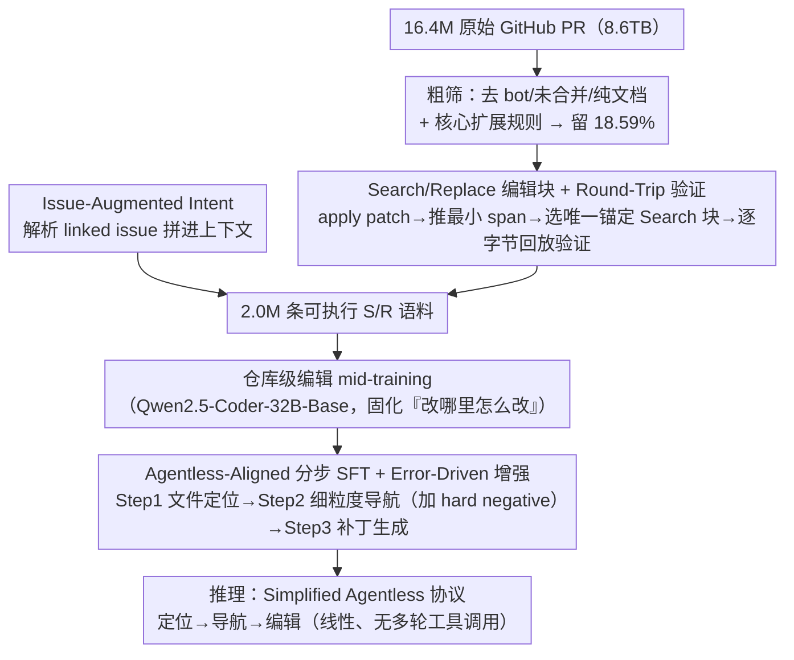

# Pull Requests as a Training Signal for Repo-Level Code Editing

**会议**: ICML2026  
**arXiv**: [2602.07457](https://arxiv.org/abs/2602.07457)  
**代码**: 待确认  
**领域**: code_intelligence  
**关键词**: 仓库级代码编辑, Pull Request 训练信号, Search/Replace 编辑块, mid-training, SWE-bench

## 一句话总结
本文提出 Clean-PR 中训练范式，把 1640 万条带噪声的 GitHub Pull Request 经过过滤、重建和回放验证转成 200 万条可执行的 Search/Replace 编辑块语料，再叠加 Agentless 对齐 SFT 与错误驱动数据增强，使 Qwen2.5-Coder-32B 在 SWE-bench Lite/Verified 上分别相对 baseline 提升 13.6% 和 12.3%，并以 32B 参数超越 72B 的 Lingma-SWE 与 SWE-Fixer。

## 研究背景与动机

**领域现状**：仓库级软件工程（repo-level SWE）已是检验代码 LLM 的核心基准，目前在 SWE-bench 上的 SOTA 系统几乎一律走 "复杂 agent 脚手架" 的路子——agentic 工具调用 + 结构化定位 + 大规模 test-time scaling 三件套堆叠，性能虽强但增益来源很难归因。

**现有痛点**：训练数据呈现明显的两极分化。SWE-bench 类数据（如 Multi-SWE-bench、SWE-Gym、R2E-Gym）执行可验证但规模仅几千到几万条；而 The Stack、CodeReview 等自然代码语料规模够大却缺乏 "如何根据 issue 修改多文件代码" 的编辑指令信号。两边都不足以把仓库级编辑能力真正"内化"到模型权重里。

**核心矛盾**：要在权重里编码仓库级编辑能力，需要同时具备 (i) 自然语料的规模、(ii) 多文件编辑的结构化信号、(iii) 可执行的高保真度——三者难以兼得。

**本文目标**：回答一个根本性问题——repo-level 编辑能力中，有多少可以直接编码进模型权重，从而摆脱对推理时复杂脚手架的依赖？分解为两个子问题：(a) 怎么从噪声极重的 GitHub PR 流中提炼出"模型可学"的训练信号；(b) 仅靠 mid-training 不足以解决大型仓库中的定位与导航，还需要什么训练阶段补足。

**切入角度**：作者注意到 GitHub Pull Request 天然耦合了"自然语言意图（description + linked issue）"与"被接受的多文件代码变更"，是介于 SWE-bench 与 The Stack 之间的理想中间地带；但 1640 万条原始 PR 中只有 18.59% 算"干净"，必须配合严格清洗 + 编辑块重构 + 回放验证才能用。

**核心 idea**：用 "round-trip 验证的 Search/Replace 编辑块" 取代 "脆弱的 unified diff" 作为 PR 训练信号，配合 Agentless 对齐的分步 SFT 与错误驱动的 hard-negative 增强，把 repo 级编辑能力固化进权重，从而让 32B 模型在简化的 Agentless 协议下超过 72B 的 agentic 方案。

## 方法详解

### 整体框架
Clean-PR 想解决的是"仓库级编辑能力能否直接编码进权重、从而摆脱推理时复杂 agent 脚手架"这个问题。它把 8.6 TB 原始 GitHub 数据先清洗、重构、验证成 200 万条可执行的 Search/Replace 编辑语料，在 Qwen2.5-Coder-32B-Base 上做一轮仓库级编辑 mid-training 把"改哪里、怎么改"的先验固化进权重，再用 SWE-Gym/SWE-rebench 的可验证轨迹做一轮 Agentless 对齐的分步 SFT 教模型在大仓库里定位、导航、生成补丁。推理时只跑一条线性的 Simplified Agentless 协议，不需要多轮工具调用。

### 关键设计

**1. Search/Replace 编辑块 + Round-Trip 验证：把脏 PR 炼成可执行训练信号**

整个范式的地基是数据重构流水线，它要把 16.4M 条带噪声的 PR diff 变成 2.0M 条字节级可回放验证的样本。作者先做粗筛：bot 提交、未合并、纯文档改动一律丢弃，并要求 PR 至少改动 12 种目标语言里的一个核心源码文件（"核心扩展规则"），过完这一关只剩 18.59% 的 PR。然后对每条幸存 PR 做三步重构——在 before 仓库快照上 apply 原 patch 得到 after，算法化推导最小编辑 span 并在 before 里选"最短唯一锚定上下文"作为 Search 块，最后把生成的 S/R 块重新 apply 回 before，只有结果与 ground-truth after 完全 bitwise 一致才保留。重构之后还会做复杂度控制（限 ≤5 核心文件，平均文件数从 $3.0$ 降到 $1.7$）、对 >100k token 的文件围绕 S/R 块裁窗、对单仓贡献超过 2000 条的随机降采样到 2000 条以防分布偏斜。

之所以放弃常见的 unified diff，是因为 diff 严重依赖模型精确预测行号，生成时稍有格式漂移就 apply 失败；而 S/R 用唯一上下文匹配来定位编辑点，绕开了行号脆性，加上 round-trip 验证保证了每条样本本身就可执行。效果很直接：Valid Patch 率从 StarCoder-style 的 89.7% 跳到 96.3%，Line Acc. 从 47.0% 升到 55.7%——说明"唯一搜索块"这种信号能逼模型输出更精确的导航线索。

**2. Issue-Augmented Intent：补全被一句话省略掉的真实意图**

现实里很多 PR description 只写一句 "Fixes #123"，训练信号里就丢失了原始 bug 报告和需求描述，跟推理时模型面对的"详细 issue → patch"工作流对不上。作者的做法是解析 PR 正文里的 issue 引用标识符，把所有 linked issue 的标题和正文拼进训练上下文，和代码一起喂给模型，原本只有"解决方案摘要"的 description 就被补全成"完整问题陈述 + 解决方案"，Clean-PR-train 的平均 description 长度也因此从 50.0 词涨到 59.5 词。

这一步本质是在对齐训练-推理分布：只有让模型在训练时就看到完整的自然语言意图，它才学得会"从意图对齐到代码实现"。消融印证了这点——去掉 linked issue 改用 PR Desc Only，Verified 从 27.8% 掉到 25.7%；它单独已经强过 StarCoder-style baseline，但要拿最佳成绩还得和 S/R 格式组合。

**3. Agentless-Aligned 分步 SFT + Error-Driven 增强：在带噪 retrieval 下学会"该改才改"**

mid-training 只教会了模型"给定干净上下文能编辑"，但 SWE-bench 真实场景是要在动辄 3010 个文件的仓库里找出该改的 1.7 个文件并精确导航到代码段，且 retrieval 必然带噪。作者用 SWE-rebench/SWE-Gym 的 ground-truth 轨迹拆出三阶段监督：Step 1 文件定位（Issue + Repo Tree → Filepath，剔除 .md/.txt 等非代码标签），Step 2 细粒度导航（用 AST 把 ground-truth 编辑映射到所属 function/class，作为 Issue + File Content → Relevant Context 的目标），Step 3 补丁生成（Localised Context → 最小唯一 S/R 块）。

关键在 error-driven 增强：用 Qwen-2.5-Coder-32B-Instruct 当中间模型生成 hard negative，Step 2 喂 $\text{Issue} + (F_{gt} \cup F_{neg}) \to \text{Relevant Context}$ 要求模型对干扰文件 $F_{neg}$ 输出 "No changes needed"，Step 3 喂 $\text{Issue} + (C_{relevant} \cup C_{noise}) \to \text{Search/Replace}$ 教模型拒绝在语义相似却实际无关的代码段上动手。最终 SFT 三阶段数据量 18,891 / 30,752 / 25,439 = 75,082，其中 21,864 条是错误增强生成的负例。标准 SFT 只训"完美定位"的 happy path，模型就会"看到了就改"而过度编辑无关文件（Zeng et al., 2025）；显式把"retrieval 不完美"写进训练分布后，All-Languages 设置下 Pass@1 在 Lite 从 21.8% 提到 24.3%、Verified 从 27.4% 提到 30.6%，且 Line Acc. 同步上升，说明模型学到的是"在干扰中精准甄别"而非多背几个 pattern。

### 一个完整示例
拿一条普通的 bug 修复 PR 走一遍流水线：原始 PR 标题写 "Fix off-by-one in pagination"、正文只有 "Closes #482"，附带一份改了 3 个文件的 unified diff。流水线先确认它已合并、非 bot、改动了核心 `.py` 文件（通过粗筛）；解析 "Closes #482" 把 issue #482 的标题和正文拼进上下文，description 从一句话补成完整 bug 报告；在 before 快照上 apply diff 得到 after，对每处改动推导最小 span 并选唯一锚定上下文生成 S/R 块；把这些 S/R 块重新 apply 回 before，逐字节比对 after——一致才入库。复杂度控制再把 3 个文件的样本归到"≤5 文件"区间。这一条 PR 最终变成一份"完整 issue 意图 + 可回放 S/R 编辑块"的训练样本，正是推理时模型要面对的输入输出形态。

### 损失函数 / 训练策略
- 基座：Qwen2.5-Coder-32B-Base（消融含 7B Base）。
- 硬件：32×H200，context window 32,768 tokens；Python-only mid-training 约 60 wall-clock 小时，All-Languages 全量 mid-training 259 小时，分步 SFT 再 38 小时。
- 损失：标准 next-token CE，按三阶段 SFT 任务统一格式监督；hard negative 样本与正例混合训练（不单独加权）。
- 推理：Simplified Agentless 协议线性执行 localisation → navigation → editing，无 multi-turn 与外部工具调用。

## 实验关键数据

### 主实验
SWE-bench Lite / Verified 在 32B 基座上的对比（Pass@1 为主指标）：

| 设置 | Mid-Train | SFT | Valid Patch | File Acc. | Line Acc. | Pass@1 |
|------|-----------|-----|-------------|-----------|-----------|--------|
| Qwen-Coder-32B-Instruct (Lite) | None | ✗ | 77.0 | 74.7 | 38.3 | 10.7 |
| Qwen-Coder-32B-Base + SFT (Lite) | None | ✓ | 84.0 | 78.3 | 46.7 | 11.3 |
| + StarCoder2-style (17.4B, Lite) | Diff | ✓ | 89.7 | 84.3 | 47.0 | 15.7 |
| **Clean-PR-train All (17.7B, Lite)** | S/R | ✓ | **96.3** | **87.3** | **55.7** | **24.3** |
| Qwen-Coder-32B-Instruct (Verified) | None | ✗ | 77.6 | 70.6 | 42.3 | 18.3 |
| + StarCoder2-style (17.4B, Verified) | Diff | ✓ | 82.4 | 77.7 | 48.4 | 20.4 |
| **Clean-PR-train All (17.7B, Verified)** | S/R | ✓ | **95.2** | **80.7** | **52.2** | **30.6** |

相对 Instruct baseline，Lite 绝对提升 $+13.6\%$、Verified $+12.3\%$；相对 StarCoder2-style 同 token 量的 baseline，Lite $+8.6\%$、Verified $+10.2\%$。

与外部开源 SOTA 对比（pass@1）：

| 方法 | 框架 | 参数 | Lite | Verified |
|------|------|------|------|----------|
| SWE-Gym | OpenHands | 32B | 15.3 | 20.6 |
| Lingma-SWE | SWESynInfer | 72B | 22.0 | 30.2 |
| SWE-Fixer | SWE-Fixer | 72B | 22.0 | 30.2 |
| **Clean-PR** | Agentless | **32B** | **24.3** | **30.6** |

### 消融实验

| 配置 | Lite Pass@1 | Verified Pass@1 | 说明 |
|------|-------------|------------------|------|
| Full（S/R + Linked Issue, Python） | 22.3 | 27.8 | 完整 Clean-PR 设置（Python 子集） |
| w/o S/R 改 Diff + Linked Issue | 19.1 | 24.4 | 仅替换编辑格式：Verified 掉 3.4% |
| w/o Linked Issue 仅 PR Desc | 20.4 | 25.7 | 仅去掉 issue 增强：Verified 掉 2.1% |
| StarCoder-style（Diff + PR Desc Only） | 15.7 | 20.4 | 两个改动叠加，全面掉点 |
| Standard SFT（All 语言） | 21.8 | 27.4 | 无 Error-Driven 增强 |
| + Error Aug.（All 语言） | 24.3 | 30.6 | 加增强后 Line Acc. 同步提升 |

### 关键发现
- **数据格式 > 数据规模**：仅 3.8B token 的 Python-only Clean-PR 就超过 17.4B token 的 StarCoder2-style baseline（Lite 22.3% vs 15.7%），说明"干净且可执行验证"的训练信号远比堆 token 重要。
- **避免灾难性遗忘**：StarCoder2-style diff 训练让 HumanEval 从 54.1% 退化到 47.6%（$-6.5\%$），而 Clean-PR 反而把 HumanEval 推到 59.8%（$+5.7\%$）、LiveCodeBench 从 29.0% 提到 32.6%——精确上下文匹配的目标对通用代码能力有正向迁移。
- **小模型也受益**：同 recipe 迁到 Qwen2.5-Coder-7B 后，Lite Pass@1 从 10.3% 提到 14.5%、Verified 从 14.2% 提到 20.4%，且定位指标提升幅度比 32B 更大，说明高质量 PR 监督对容量受限的小模型尤其关键。
- **Pass@k 揭示 ranking 瓶颈**：Verified Pass@1 30.6% → Pass@10 41.5%（Lite 24.3% → 37.5%），意味着模型内在推理力比单次解码体现的更强，未来加 verifier/re-ranker 还能继续涨点。
- **多语言迁移**：Multi-SWE-bench Flash 上 Clean-PR 拿到 12.3% Pass@1，胜过 Instruct 与 StarCoder2-style baseline，说明 12 种语言的 mid-training 让模型获得跨语言的仓库编辑泛化能力。

## 亮点与洞察
- **"用 LLM 友好的中间表示重构脏数据"是 PR 训练的关键解锁点**：把 unified diff 换成 Search/Replace 并加 round-trip bitwise 验证，等于把"训练样本可执行性"做成 first-class citizen，既能直接对齐 Aider/SWE-agent 等主流编辑 pipeline，又避免了行号脆性导致的"看似对、apply 时崩"问题。Valid Patch 率从 89.7% 直接跳到 96.3% 就是这个改动单点贡献。
- **错误驱动增强是"训-推一致性"的廉价处方**：不去改 RL 也不去做拒绝采样，只是用一个中间模型生成 hard negative 文件/代码段，要求主模型对干扰输出 "No changes needed" 或避开修改——本质上是把"retrieval 不完美"这件事写进训练分布，思路非常通用，可直接迁到任何"先 retrieve 后生成"的任务。
- **挑战了"必须靠 agent 才能赢"的叙事**：用线性的 Simplified Agentless 协议、32B 参数、纯权重内化，就能超过 72B + agentic loop 的方案，给"data > scaffolding"提供了一个干净的因果证据；这对学界控制变量、对工业界降本都有现实意义。
- **mid-training 不是 pretrain 也不是 SFT**：本文把它定位成"在 base 与 SFT 之间，专门用领域特定的可执行信号编码先验"的独立阶段，是一个值得推广到其他垂直领域（如数据库 SQL、Notebook 编辑、机器人代码）的训练范式。

## 局限与展望
- **作者承认的局限**：Pass@1 与 Pass@10 之间的 11% gap 说明 likelihood ranking 不完美，仍需 verifier 或 re-ranker；mid-training 的 wall-clock 成本（259 小时 × 32×H200）对学界复现并不友好。
- **数据可用性 vs 法律风险**：声称将释放最大规模 PR 语料（2M），但 GitHub PR 涉及开源 license 的合规性（GPL/AGPL 等）作者未充分讨论；下游使用者直接用该语料训商业模型存在不确定性。
- **评测局限**：SWE-bench Lite/Verified 仍以 Python 为主，多语言只在 Multi-SWE-bench Flash 上验证了 300 条；对 C/C++ 这种依赖编译/链接的语言的真实能力仍待更大规模评测。
- **未触及 RL/Self-Improve**：整个 pipeline 是 SFT 范畴的中训练 + 监督，没有利用 SWE-bench 的可执行特性做 outcome-based RL；显然 RL + Clean-PR 是下一个自然延伸。
- **错误驱动增强对"中间模型"质量敏感**：用 Qwen-2.5-Coder-32B-Instruct 生成 hard negative，若中间模型本身分布偏，注入的"噪声"可能并不代表真实 retrieval 失败模式，需要消融。

## 相关工作与启发
- **vs StarCoder2 / The Stack 类自然语料**：他们追求规模与多语言覆盖但不约束编辑格式与单 PR 验证；本文用 round-trip 验证 + S/R 格式把"规模"换成了"密度"，等 token 量下效果远超，并在通用代码 benchmark 上反而提升，否定了"训领域专用必然损失通用"的悲观假设。
- **vs SWE-Gym / R2E-Gym（SWE-bench-style 数据）**：他们高保真但每集只几千到上万条；本文给出了一条"百万级 PR → 可执行训练信号"的可扩展通路，互补而非替代，二者完全可以叠加（事实上本文的 SFT 阶段就用了 SWE-Gym/SWE-rebench 的轨迹）。
- **vs Agentless（Xia et al., 2025）**：Agentless 本身已经把流程简化成 localisation → navigation → editing；本文不仅沿用其 S/R 编辑块约定，还显式把这套流程 distill 进权重，进一步降低了 inference 时对脚手架的依赖。
- **vs OpenHands / SWE-agent 等 agentic 框架**：他们靠 multi-turn 工具调用 + iterative planning，强但贵；本文以"权重内化 + 线性 pipeline"实现 SOTA，给出"是否需要 agent 取决于权重里有没有相应先验"的另一条判断标准。

## 评分
- 新颖性: ⭐⭐⭐⭐ 数据范式（Search/Replace + round-trip 验证 + linked issue + 错误增强）的组合是新的，且明确把 mid-training 作为独立阶段提出；单点技术并非首创但 recipe 完整可复现。
- 实验充分度: ⭐⭐⭐⭐⭐ 包含 32B 主结果、7B 缩放泛化、多语言泛化、Pass@k 扩展、数据格式/Issue/Error-Aug 三组关键消融、HumanEval/LiveCodeBench 上的灾难性遗忘分析，论证链条非常完整。
- 写作质量: ⭐⭐⭐⭐ 数据流水线、训练阶段、消融的因果分解都很清楚；个别表格编号引用（如 "Table 3 presents..."）与实际表号略有 drift，但不影响理解。
- 价值: ⭐⭐⭐⭐⭐ 释放 2M 条已验证 PR 语料对社区是稀缺资源；以 32B 超 72B 的结果直接动摇了"agent scaffolding 必不可少"的主流叙事，对工业部署和学术研究都有直接影响。

<!-- RELATED:START -->

## 相关论文

- [\[ACL 2025\] CoRet: Improved Retriever for Code Editing](../../ACL2025/code_intelligence/coret_improved_retriever_for_code_editing.md)
- [\[ACL 2025\] CompileAgent: Automated Real-World Repo-Level Compilation with Tool-Integrated LLM-based Agent System](../../ACL2025/code_intelligence/compileagent_automated_real-world_repo-level_compilation_with_tool-integrated_ll.md)
- [\[ICML 2026\] HE-SNR: Uncovering Latent Logic via Entropy for Guiding Mid-Training on SWE-bench](he-snr_uncovering_latent_logic_via_entropy_for_guiding_mid-training_on_swe-bench.md)
- [\[NeurIPS 2025\] QiMeng-SALV: Signal-Aware Learning for Verilog Code Generation](../../NeurIPS2025/code_intelligence/qimeng-salv_signal-aware_learning_for_verilog_code_generation.md)
- [\[ICML 2026\] MatchFixAgent: Language-Agnostic Autonomous Repository-Level Code Translation Validation and Repair](matchfixagent_language-agnostic_autonomous_repository-level_code_translation_val.md)

<!-- RELATED:END -->
