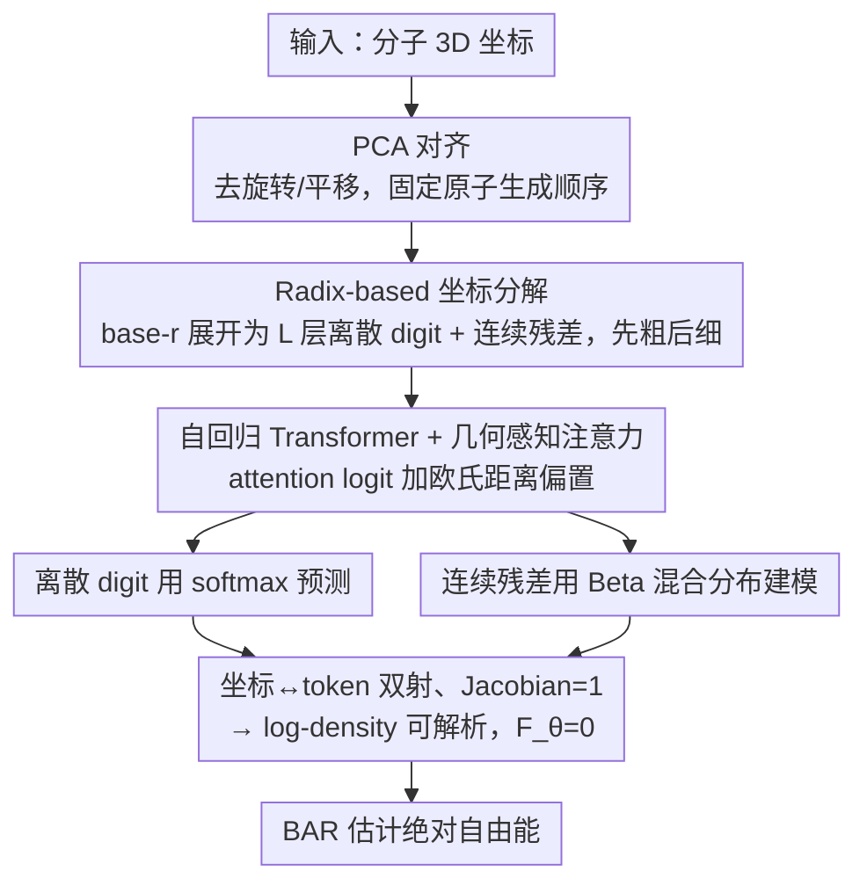

# CARD: Coarse-to-fine Autoregressive Modeling with Radix-based Decomposition for Transferable Free Energy Estimation

**会议**: ICML 2026  
**arXiv**: [2605.02657](https://arxiv.org/abs/2605.02657)  
**代码**: 发表后公开  
**领域**: AI for Science / 分子建模 / 自回归生成  
**关键词**: 自由能估计、自回归 Transformer、基数分解、零自由能 proposal、BAR

## 一句话总结
CARD 用"基数 $r$ 分解"把分子 3D 坐标双射映射为先粗后细的离散-连续混合 token 序列，让一个跨系统通用的自回归 Transformer 作为"零自由能 proposal"通过 BAR 直接估算任意分子系统的绝对自由能，在 70 个新系统的溶剂化任务上达到经典 MFES 的精度且推理快约 40 倍。

## 研究背景与动机
**领域现状**：自由能差 $\Delta F = -\beta^{-1} \log Z_b / Z_a$ 是药物发现里预测结合亲和力、溶剂化自由能的核心量。经典做法 Free Energy Perturbation (FEP) + alchemical 中间态 + BAR/MBAR 估计已被广泛使用，但都需要海量 MD 模拟，计算成本极高。

**现有痛点**：(1) 经典方法要做大量 alchemical 中间态采样才能保证分布重叠，单系统几小时到几天；(2) 数据驱动的深度方法（如蛋白配体亲和力 regression）泛化差，在分布外系统经常失效；(3) DeepBAR 这类"零自由能 proposal"方法用 normalizing flow，但表达力受限于可逆性约束，且输入维度绑死特定系统 → 换一个分子就要从头训练。

**核心矛盾**：理想的 proposal 模型既要 (a) 概率密度可解析 → 才能定义 $F_\theta = 0$，又要 (b) 表达力强如扩散/自回归模型，还要 (c) 跨系统泛化 —— 这三者在已有框架里互斥（normalizing flow 满足 a 不满足 b/c；diffusion 满足 b 不满足 a；标准 AR 满足 a/b 不满足 c）。

**本文目标**：(1) 构造一个能精确算 log-density 又能跨系统的生成模型；(2) 用它当 zero-free-energy proposal，让 BAR 一次估算任意系统的绝对自由能，省掉 alchemical 中间态；(3) 在多个真实任务（溶剂化、endstate correction、互变异构）上零样本/小样本验证。

**切入角度**：作者借鉴 LLM 的"自回归 + Transformer + 海量预训练 → 跨任务泛化"经验，把 3D 坐标转成 token 序列让 Transformer 跨分子建模；但简单展开坐标会遇到"局部细节与全局几何相互依赖"的鸡生蛋问题 → 提出 radix 分解实现 coarse-to-fine 顺序。

**核心 idea**：把每个坐标按 base-$r$ 展开为 $L$ 个离散 digit + 一个连续残差，按"所有 atom 的最高位 → 次高位 → ... → 最低位 → 连续残差"的顺序自回归生成，先定全局后填细节。

## 方法详解

### 整体框架
CARD 要解决的是"如何用一个跨系统通用的、log-density 可解析的生成模型当自由能 proposal"，它的核心做法是把分子的 3D 坐标搬进自回归 Transformer 的地盘：先用 PCA 去掉旋转/平移自由度并给原子定一个稳定的生成顺序，再把每个坐标用基数 $r$ 展开成"先粗后细"的离散 digit + 连续残差 token 序列，最后让一个 encoder-decoder Transformer 逐 token 预测——其注意力额外读入参考结构的欧氏距离偏置（几何感知注意力），离散位用 softmax、连续残差用 Beta 混合分布。因为整个坐标-token 变换是严格双射，序列的对数似然就等于分子构象的 log-density，于是模型天然满足 $F_\theta = 0$，配合 BAR 一次估出绝对自由能。

### 关键设计

**1. Radix-based 坐标分解：把连续坐标变成先粗后细的可逆 token 序列**

直接让 AR 模型一个个吐出连续坐标会陷入"鸡生蛋"悖论——原子 $i$ 的精确位置依赖于尚未生成的原子 $j$。CARD 的破解办法是 coarse-to-fine：先选一个足够大的 $a$ 让所有坐标分量满足 $|x_{ij}| < a/2$，归一到 $[0,1)$ 后做 base-$r$ 展开 $\hat{x}_{ij} = (0.\hat{x}_{ij}^1 \hat{x}_{ij}^2 \cdots \hat{x}_{ij}^L \cdots)_r$。前 $L$ 层产生离散 digit $\hat{x}_i^k \in \{0,...,r-1\}^3$，相当于第 $k$ level 把每个原子定位到一个 $r^3$ 的子立方体里；第 $L+1$ 层给出连续残差 $y_i \in [0, a/r^L)^3$。生成顺序刻意排成"所有原子的最高位 → 所有原子的次高位 → … → 所有原子残差"，于是混合序列写成 $s = (\hat{x}_1^1, ..., \hat{x}_N^1, \hat{x}_1^2, ..., \hat{x}_N^L, y_1, ..., y_N)$，长度 $N(L+1)$。这样每个原子都先和别的原子一起把大致空间位置敲定，再统一往下细化，类比图像的多分辨率生成，每一步预测都能看到全局粗结构。更关键的是作者证明这个坐标-token 变换是严格双射且 Jacobian 为 1，因此 log-density 干净地拆成 $\log q_\theta(x|c) = \sum_{i=1}^{N(L+1)} \log q_\theta(s_i | c, s_{:i})$——这正是"零自由能 proposal"对可解析似然的硬性要求。

**2. 几何感知注意力：让 attention 直接看到欧氏距离而非纯序列位置**

分子建模和文本建模的根本差异是"位置就是物理坐标"，所以 CARD 在每个 transformer block 里同时喂入"已生成的粗坐标"和"参考结构距离矩阵"。query 用前一 level 的同原子坐标 $q_i = (\text{LN}(h_i + \varphi_1(x'_{i-N}))) W_1$，刻意错开一层避免泄露当前 step 待预测的信息；而 key/value 用最新坐标 $x'_j$ 实时拿到几何。在 attention logit 上还加一项参考结构距离偏置 $\frac{1}{R}\sum_k \varphi_d^h(d_{ij}^{(k)})$，其中 $d_{ij}^{(k)} = \|u_{i'}^{(k)} - u_{j'}^{(k)}\|_2$ 是 $R$ 个参考结构里原子 $i,j$ 的间距。让注意力直接读到欧氏距离，"远距离原子近乎无关、近距离原子强相关"这条物理 prior 就不必从零学起，大大降低了几何建模的难度。

**3. Beta 混合分布建模连续残差：在有界区间上保住精确似然**

序列最后那批连续 token $y_i \in [0, a/r^L)^3$ 需要一个既有界又能精确算 log-density 的分布——Gaussian 在 $[0,1)$ 外有支撑不合法，categorical 又会损失精度。CARD 把 $y_i$ 缩放到 $[0,1)$ 后用 $K$ 个 Beta 组件加权混合 $\text{BMM}(x; \Theta) = \sum_{k=1}^K \pi_k \text{Beta}(x; \alpha_k, \beta_k)$，并把 3 个坐标分量按 chain rule 顺序建模 $y_{i1} \to y_{i2} \to y_{i3}$。Beta 天然定义在闭区间 $[0,1]$，既守住了 radix 分解留下的有界残差范围，又能闭式求似然，与零自由能 proposal 范式严丝合缝。

### 损失函数 / 训练策略
训练分两阶段。Stage I 是纯 NLL $\mathcal{L}_{\text{NLL}} = -\frac{1}{BN}\sum_b \log q_\theta(x^{(b)}|c)$，让模型先学会生成合理构象。Stage II 在此基础上联合优化能量对齐项 $\mathcal{L}_{\text{energy}} = \frac{1}{B}\sum_b |\tilde{U}_\theta^{(b)} - \tilde{U}^{(b)}|$（mean-centered），用真实力场能量去校正 MD 采样不均衡/采样不全带来的偏差。推理阶段用 BAR 在 proposal 分布 $q_\theta$ 与目标 Boltzmann 分布之间估自由能差，由于 $F_\theta = 0$ 这个差就直接是目标系统的绝对自由能。

## 实验关键数据

### 主实验
三个互补任务全面验证泛化：

| 任务 | 数据集 | 指标 | CARD | Baseline |
|------|--------|------|------|---------|
| 真空→甲苯溶剂化 | ZINC20 70 testmol | MAE (kcal/mol) | <1, $R^2 > 0.9$ | MFES (ref) |
| 真空→水溶剂化 | ZINC20 70 testmol | MAE (kcal/mol) | <1, $R^2 > 0.9$ | MFES (ref) |
| MM→NNP endstate correction | HiPen 18 mol | MAE (kcal/mol) | **0.90** | MFES (ref) |
| 水相互变异构 | 27 tautomer pairs | MAE↓ | **4.11** | DFT 4.62 / sPhysNet 4.61 |
| 水相互变异构 | 27 tautomer pairs | PCC↑ | **0.64** | DFT 0.36 / sPhysNet 0.35 |

### 消融实验
真空→甲苯溶剂化任务上对 radix $r$、depth $L$、训练 stage 做消融：

| 配置 | MAE↓ | RMSE↓ | $R^2$↑ | Pct(<1)↑ |
|------|------|-------|--------|----------|
| **$r=4, L=3$, Stage I+II (full)** | **0.71** | **1.27** | **0.92** | **82.9** |
| $r=4, L=3$, Stage I 仅 | 0.81 | 1.34 | 0.91 | 77.1 |
| $r=3, L=3$, Stage I 仅 | 2.43 | 3.08 | 0.61 | 26.5 |
| $r=5, L=3$, Stage I 仅 | 1.88 | 2.41 | 0.73 | 22.1 |
| $r=4, L=2$, Stage I 仅 | 5.85 | 14.26 | -0.08 | 17.1 |
| $r=4, L=4$, Stage I 仅 | 1.43 | 2.39 | 0.77 | 61.4 |

### 关键发现
- **40 倍加速 + 跨系统泛化是双重突破**：在 70 个训练集没见过的分子上，CARD 单系统推理约 770 秒 vs MFES 约 32,300 秒，且精度持平；这是已有深度方法（每系统单独训练）做不到的。
- **$L=2$ 直接崩盘** ($R^2 = -0.08$)：说明 coarse-to-fine 必须有足够层数才能让粗结构稳定，过浅 = 退化成"直接生成连续坐标"。
- **$L=4$ 反而略掉点**：层数太多后高层 $\hat{x}_i^k$ 的 $r^3$ 类别越来越难区分，模型抓不到有效信号；最优 $L=3$。
- **$r$ 太小 (3)** 让 BMM 要建模过宽残差，溢出表达力；**$r$ 太大 (5)** 离散空间立方膨胀难训。最优 $r=4$ 把 $r^3=64$ 类卡在 softmax 友好区。
- **Stage II 能量对齐贡献大**：让 MAE 从 0.81 降到 0.71（>10% 相对提升），表明 MD 采样偏差需要力场标签矫正。
- 互变异构任务上 CARD 比 DFT (B3LYP/6-31G*) 还准 —— 因为 DFT 用单个 min-energy conformation 近似自由能，复杂柔性分子失效；CARD 真做 Boltzmann 平均。

## 亮点与洞察
- **Radix 分解** 是个非常优雅的桥梁：把"分子生成"这一连续高维问题转化成"先粗后细的混合 token AR"，复用 Transformer 全部成熟工具链（KV cache、scaling、跨任务 transfer），同时严格满足 tractable likelihood。
- **"零自由能 proposal" + BAR** 是这条线的核心范式 —— DeepBAR 提出但被 NF 表达力卡住，CARD 用 AR + BMM 解放了表达力，理论与工程同时升级。
- **Geometry-aware attention 的双 query/key 拆分**（query 用前 level 坐标避免泄露，key/value 用最新坐标）值得借鉴到任何"逐 step 生成几何对象"的任务，如 protein folding 的自回归版、3D mesh 生成。
- **跨化学环境（真空/甲苯/水/NNP/互变异构）几乎不掉点**，是 AI for Chemistry 里少见的"真泛化"，相当于把 LLM "一个模型多任务"的 paradigm 搬到分子。
- 整体思路（radix-based coarse-to-fine + tractable AR）可迁移到 protein 全原子建模、晶体结构生成、甚至 3D point cloud generation。

## 局限与展望
- **PCA 对齐对对称分子不稳定**：作者承认接近对称的主轴可能让对齐方向乱跳，引入大方差；需要更鲁棒的等变特征 (e.g., E(3)-equivariant network) 替代。
- **数据集主要是 drug-like 小分子**（ZINC20，原子数 < 50）：蛋白-配体复合物动辄数千原子，能否扩展到这种规模尚未验证。
- **推理时序列长度 $\sim N(L+1)$ 仍随原子数线性增长**：作者实测 inference 复杂度近似 quadratic in $N$（vanilla Transformer），需要 FlashAttention / Linear Attention 才能上千原子。
- **训练用 MD 轨迹的 sampling bias** 可能传到模型，Stage II 能量对齐部分缓解但不能根治。改进方向：(a) E(3) equivariant CARD；(b) 用 NNP 替代力场能量做 finer label；(c) 拓展到蛋白-配体 docking。

## 相关工作与启发
- **vs DeepBAR (NeurIPS21)**：开创"零自由能 proposal"思想但用 normalizing flow，表达力不足且要每系统重训；CARD 用 AR Transformer + radix 解放表达力并实现跨系统泛化。
- **vs neural TI / FEAT**：那些方法借助 diffusion 学时变 Hamiltonian 做 thermodynamic integration，仍是 alchemical 范式；CARD 直接走 BAR 跳过中间态。
- **vs Boltzmann Generators (Noé 2019, Tan 2025)**：那些追求采样平衡态，多数没法精确算 log-density 或跨系统失败；CARD 同时具备 likelihood + transferability。
- **vs MGVAE / MGT / Sequoia（多分辨率分子建模）**：那些在图层级做 coarse-to-fine，CARD 在原子坐标层级做，并保持精确 AR factorization。
- **vs LLM 的 BPE tokenization**：radix 分解相当于"3D 坐标的 BPE"，启发我们对其他连续物理量（如蛋白二面角、晶体晶格参数）也可用类似分解 token 化后让 Transformer 处理。

## 评分
- 新颖性: ⭐⭐⭐⭐⭐ 把 LLM AR 范式与零自由能 proposal 严格统一，radix 分解是真正原创的"3D→token"桥梁。
- 实验充分度: ⭐⭐⭐⭐ 三个互补任务 + 详尽消融 + 推理速度对比都做了；缺蛋白尺度验证。
- 写作质量: ⭐⭐⭐⭐⭐ 公式推导（双射、Jacobian = 1、log-density 分解）严密，工程细节交代清晰，是 AI4Sci 论文里少见的"理论 + 实验都硬"。
- 价值: ⭐⭐⭐⭐⭐ 把单系统数小时的自由能计算变成跨系统秒级 + 高精度，对 FEP 类药物筛选 pipeline 是颠覆性的工程价值。

<!-- RELATED:START -->

## 相关论文

- [\[ICML 2026\] Protein Autoregressive Modeling via Multiscale Structure Generation](protein_autoregressive_modeling_via_multiscale_structure_generation.md)
- [\[NeurIPS 2025\] Energy Matching: Unifying Flow Matching and Energy-Based Models for Generative Modeling](../../NeurIPS2025/computational_biology/energy_matching_unifying_flow_matching_and_energy-based_models_for_generative_mo.md)
- [\[ICML 2026\] Learning Protein Structure-Function Relationships through Knowledge-guided Representation Decomposition](learning_protein_structure-function_relationships_through_knowledge-guided_repre.md)
- [\[CVPR 2026\] Stronger Normalization-Free Transformers](../../CVPR2026/computational_biology/stronger_normalization-free_transformers.md)
- [\[ICML 2026\] Constrained Flow Optimization via Sequential Fine-Tuning for Molecular Design](constrained_flow_optimization_via_sequential_fine_tuning_for_molecular_design.md)

<!-- RELATED:END -->
