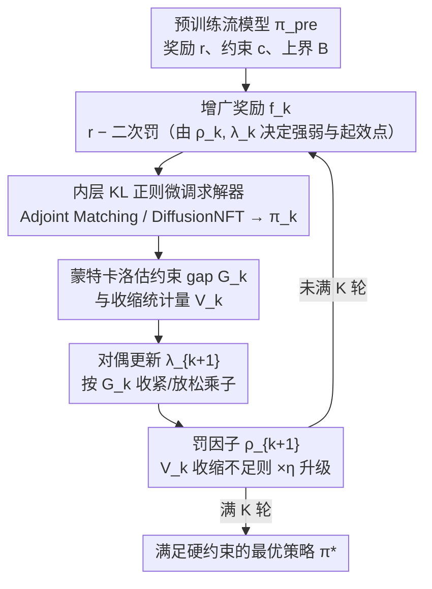

# Constrained Flow Optimization via Sequential Fine-Tuning for Molecular Design

**会议**: ICML 2026  
**arXiv**: [2605.30610](https://arxiv.org/abs/2605.30610)  
**代码**: 待确认  
**领域**: 科学计算 / 分子设计 / 生成式优化  
**关键词**: 流匹配微调、增广拉格朗日、约束生成式优化、分子设计、KL 正则化

## 一句话总结
本文针对"在满足领域硬约束（如合成可达性、能量上界）的前提下最大化奖励（如结合亲和、偶极矩）"这一关键场景，提出 CFO 算法：用增广拉格朗日把约束生成式优化拆成一串带 KL 正则的标准微调子问题，自适应地更新罚因子 $\rho_k$ 与对偶变量 $\lambda_k$，在合成低维场景与 FlowMol 分子设计任务上同时给出可证收敛与显著的奖励—约束 Pareto 改进。

## 研究背景与动机

**领域现状**：扩散与流模型（diffusion / flow matching）已成为分子、蛋白、DNA 等科学发现的事实标准生成器。为把它们用于真实发现任务，业内主流做法是在 KL 正则下用 RL 或最优控制思路对预训练流模型做奖励驱动微调（例如 Adjoint Matching、DiffusionNFT、Flow-GRPO），最大化诸如结合亲和、QED 等可学奖励。

**现有痛点**：科学发现里大量"硬"约束 —— 合成可达性、毒性上界、xTB 能量、docking pose 物理合理性 —— 是预训练数据没编码或只能弱学到的。当前的奖励驱动微调虽然有 KL 锚住分布漂移，但**无法证明任何硬约束被满足**（Uehara et al., 2024a）。最朴素的"把约束当作另一项加权奖励"做法在实践中极不稳定：权重 $\mu$ 在任务和训练阶段之间漂移，需要靠枚举试错来调；而且当探索进入高奖励区时，相同 $\mu$ 经常被奖励"压过去"，最终产出"高奖励但违法"的分子。

**核心矛盾**：奖励最大化与约束满足之间存在 trade-off，而**固定权重的拉格朗日**不能可靠地刻画这个 trade-off —— 既不保证可行（除非 $\mu$ 超过未知阈值），也不存在 $\mu$ 到违反量的单调映射，更没有动力学去"边训边收紧"惩罚。

**本文目标**：(i) 给约束生成式优化一个严格的优化形式（reward + KL 正则 + 期望约束），并把"约束生成"作为奖励常数时的子问题统一进来；(ii) 设计一个算法，在 KL 接近预训练模型的前提下，自动、可证地权衡奖励与约束。

**切入角度**：作者注意到经典约束优化里已经有非常成熟、对超参数不敏感的方法 —— 增广拉格朗日（Augmented Lagrangian, AL）。AL 的核心好处是：罚因子 $\rho_k$ 和对偶 $\lambda_k$ 会按"约束违反量"自适应调整，无需人为枚举权重。把 AL 套到流模型上，每一轮就退化成一个"带新增广奖励"的标准 KL 正则微调子问题，可以原样调用已有的 Adjoint Matching / DiffusionNFT 等求解器。

**核心 idea**：把约束生成式优化转化为一串带自适应增广奖励的常规微调子问题；用 AL 的对偶更新自动收紧或放松惩罚，避免手调 $\mu$，同时给出可证的可行性与最优性保证。

## 方法详解

### 整体框架

CFO 要解决的是"在硬约束下做奖励驱动微调"：给定预训练流模型 $\pi^{\text{pre}}$（速度场视为 RL 中的动作）、一个标量奖励 $r(x)$、一个标量约束 $c(x)$ 与违反上界 $B$，求一个新策略 $\pi^{*}$，使其终态分布 $p_1^{\pi}$ 满足

$$\max_{\pi} \mathbb{E}_{x \sim p_1^{\pi}}[r(x)] - \alpha D_{KL}(p_1^{\pi}\,||\,p_1^{\text{pre}}) \quad \text{s.t.} \quad \mathbb{E}_{x \sim p_1^{\pi}}[c(x)] \le B$$

把 $r \equiv 0$ 代回去，问题就退化成"在满足期望约束下保持与预训练模型最近"的约束生成，于是约束生成与约束微调被统一进同一个框架。CFO 的核心做法是借用经典的增广拉格朗日：在外层维护罚因子 $\rho_k$ 与拉格朗日乘子 $\lambda_k$ 两个对偶变量，把整个带约束的问题切成 $K$ 轮无约束子问题。每一轮都按三步走——先用对偶变量构造**增广奖励 $f_k$**，交给内层标准 KL 正则微调求解器解出当前策略 $\pi_k$；再用蒙特卡洛在 $\pi_k$ 上估计约束 gap，据此做**对偶更新 $\lambda_{k+1}$**收紧或放松乘子；最后看收缩统计量判断要不要把**罚因子 $\rho_{k+1}$**整体抬一级。如此循环，外层根据约束违反量自适应地收紧惩罚，内层始终是可原样复用已有求解器的常规微调。

### 关键设计

**1. 增广奖励 $f_k$：把约束烧进奖励、但罚权重在线自适应**

朴素做法是把约束当成另一项加权奖励 $r - \mu c$，但固定权重 $\mu$ 既不保证可行、又会在高奖励区被奖励"压过去"，只能靠枚举试错。CFO 改成每一轮构造增广奖励 $f_k(x) = r(x) - \frac{\rho_k}{2}\bigl[\max(0,\, c(x) - B - \frac{\lambda_k}{\rho_k})\bigr]^2$，把"奖励 $-$ 二次罚"打包成一个新奖励交给任意 KL 正则微调器，对偶变量 $\rho_k, \lambda_k$ 则同时决定罚的强弱与起效点。其中偏移项 $\lambda_k/\rho_k \le 0$ 会把"罚开始生效"的阈值往严的方向挪，让算法在违反量还没超过 $B$ 时就提前发力；二次罚相比硬截断更平滑，求解后 KKT 条件更易满足。这套构造之所以有效，是因为外层对 $\rho, \lambda$ 的更新等价于对偶变量的近端点更新，既保留了"违反越多惩罚越重"的直觉，又换来了可证收敛性，从根本上摆脱手调 $\mu$。

**2. 对偶更新 $\lambda_{k+1}$：用经验约束 gap 自动调乘子**

罚权重不再人工枚举，而是交给数据驱动。每轮先用蒙特卡洛估计当前策略下的约束 gap $G_k = \mathbb{E}_{x \sim p_1^{\pi_k}}[c(x)] - B$：若 $G_k > 0$（违反）就把 $\lambda$ 推得更负以加重惩罚，若 $G_k < 0$（满足）就把 $\lambda$ 拉回 0 以松开惩罚，再投影回区间，即 $\lambda_{k+1} \leftarrow \max\{\lambda_{\min}, \min\{0, \lambda_k - \rho_k G_k\}\}$。上界 $0$ 保证这一项永远是惩罚而非奖励，下界 $\lambda_{\min}$ 则避免一次大违反就把惩罚推到无穷。这一步本质上是投影梯度风格地沿约束违反量调整乘子，把奖励—约束的 trade-off 留给训练动态自己摸索。

**3. 罚因子 $\rho_{k+1}$：由"收缩统计量"触发式升级**

只调 $\lambda$ 有时仍收不住违反，这时需要整体抬高罚力度，但又不能无脑放大 $\rho$ 把子问题推进数值病态区。CFO 定义收缩统计量 $V_k = \min\{G_k,\, -\lambda_k/\rho_k\}$ 度量"朝可行域逼近"的进度：当且仅当 $V_k > \tau V_{k-1}$（即未能按比例 $\tau \in (0,1)$ 收缩）时，判定当前罚因子不够，置 $\rho_{k+1} = \eta \rho_k$（$\eta \ge 1$）把惩罚整体抬一级，否则保持 $\rho_{k+1} = \rho_k$。这是增广拉格朗日里"判断要不要爬罚梯子"的标准启发式（Birgin & Martínez, 2014），让 $\rho$ 自然停留在"刚够"的水平上——既不浪费硬度、又能在必要时升级强度，也正是 CFO 无需手动调度 $\mu$ 的真正来源。

### 损失函数 / 训练策略

内层调用任意一个 KL 正则微调求解器（"FineTuningSolver"），求解 $\pi_k \in \arg\max_{\pi} \mathbb{E}_{x \sim p_1^{\pi}}[f_k(x)] - \alpha D_{KL}(p_1^{\pi}\,||\,p_1^{\text{pre}})$；论文用 Adjoint Matching（AM，一阶、需要可微 $r, c$）和 DiffusionNFT（NFT，零阶、可处理不可微目标）两个代表性求解器验证 CFO 与求解器解耦。为公平比较，论文固定"总梯度步数预算" $M = K \cdot N$，让 CFO 与基线在同等算力下对比；典型设置 $K = 6, N = 10$（分子任务）或 $K = 20$（低维任务）。理论上，只要内层在每轮以误差 $\epsilon_k$ 解出近似最优（Assumption 5.1），就能保证 CFO 的可行性（Theorem 5.2 + Corollary 5.3）；进一步要求 $\epsilon_k \to 0$ 才能拿到全局最优性（Theorem 5.4）。

## 实验关键数据

### 主实验

**低维可视化任务**（reward 为到白十字的负平方距离，约束为红三角外线性增加）以及 **FlowMol 在 GEOM Drugs 上的分子设计任务**（奖励 = 偶极矩 Debye，约束 = 总 xTB 能量 $\le -80$ Ha）。

| 任务 / 求解器 | 方法 | 奖励 $\mathbb{E}[r] \uparrow$ | 约束 $\mathbb{E}[c]$ | 是否满足约束 |
|---|---|---|---|---|
| 2D 玩具，AM 作内层 | PRE | $-7.62 \pm 0.03$ | $0.58 \pm 0.07$ | 否 |
| 2D 玩具，AM 作内层 | AM（不约束） | $-2.93 \pm 0.03$ | $2.47 \pm 0.11$ | 否（恶化 4.3 倍） |
| 2D 玩具，AM 作内层 | **CFO$_{\text{AM}}$** | $-4.75 \pm 0.04$ | $\mathbf{0.12 \pm 0.06}$ | 是 |
| 2D 玩具，NFT 作内层 | DiffusionNFT | $-3.59 \pm 0.10$ | $1.76 \pm 0.05$ | 否 |
| 2D 玩具，NFT 作内层 | **CFO$_{\text{NFT}}$** | $-5.28 \pm 0.14$ | $\mathbf{0.06 \pm 0.01}$ | 是 |
| 分子设计，AM | PRE / AM / **CFO$_{\text{AM}}$** | $6.55 / 8.37 / \mathbf{8.39}$ D | $-77.86 / -78.31 / \mathbf{-82.28}$ Ha | 否 / 否 / **是** |
| 分子设计，NFT | DiffusionNFT / **CFO$_{\text{NFT}}$** | $8.30 / \mathbf{8.27}$ D | $-78.67 / \mathbf{-80.72}$ Ha | 否 / **是** |

要点：CFO 几乎不损失奖励就把约束从"违反"打到"严格满足"，且对一阶 / 零阶求解器都成立。

### 消融实验

| 配置 | 奖励 $\mathbb{E}[r]$ | 约束 $\mathbb{E}[c]$ ($\le B = -80$) | 说明 |
|---|---|---|---|
| 固定 $\mu = 0.01$（手调拉格朗日） | $8.34$ D | $-78.94$ Ha | 高奖励但违反约束 |
| 固定 $\mu = 50.0$ | $6.69$ D | 满足 | 奖励退化，弱于 PRE 之上仅一点 |
| 18 个 $\mu \in [10^{-6}, 10^{6}]$ 枚举 | — | — | 仅 2 个 $\mu$ 同时达到 CFO 级奖励且满足约束；运行成本 $\approx 18\times$ CFO |
| **CFO**（$K=6, N=10$） | $8.39$ D | $-82.28$ Ha | 一次跑通；约 44 min |
| 同算力 AM$_{\mu=0.5}$ | $8.38$ D | 满足 | 但需 727 min 枚举开销 |
| 预算 $M=6000$，$K=3, N=2000$ | 高奖励 | $0.40$（违反） | 外更新太少 |
| 预算 $M=6000$，$K=20, N=300$ | $-4.75$ | $0.12$ | 平衡点 |
| 预算 $M=6000$，$K=100, N=60$ | $-5.91$ | $0.10$ | 内求解器太弱，奖励掉点 |

### 关键发现

- **CFO 对 $\mu$ 这种"罚权重"超参数完全不敏感**，因为 $\rho_k, \lambda_k$ 在线自适应；而朴素拉格朗日做 18 倍枚举里只有 2 个能同时满足约束和奖励，验证了"手调 $\mu$ 不可靠"这一动机假设。
- **与内层求解器解耦**：把 AM 换成 DiffusionNFT，CFO 同样能把分子能量从 $-78.67$ Ha 推到 $-80.72$ Ha（合规）而仅小幅牺牲偶极矩，证明 CFO 是一个"包"在任何 KL 正则微调器外面的轻量壳。
- **化学统计副作用最小**：CFO 在严格满足能量约束的同时，QED $0.37$ / Lipinski $77\%$ 都明显比 AM（$0.34$ / $71\%$）更接近 PRE（$0.45$ / $88\%$），说明 CFO 不会用"破坏化学合理性"来换约束满足。Per-sample 可行率 CFO $61.4\%$ vs AM $40.6\%$。
- **算力外推**：固定总梯度步数 $M = K \cdot N$，太少 $K$ 让对偶更新跟不上违反，太多 $K$ 让内层欠优化奖励掉点，中等 $K$ 是甜点 —— 这给实际部署 CFO 提供了清晰的算力分配指引。

## 亮点与洞察

- **"约束生成式优化"作为统一概念**：作者把"约束生成"与"约束 + 奖励微调"放进同一个 KL 正则下的约束优化框架，常数奖励就退化成前者；这种统一让一个算法（CFO）同时解决两类任务，而不是堆叠两个独立模块。
- **把经典 AL 工具搬到生成模型微调里非常巧妙**：扩散 / 流模型的微调本就被建模成 KL 正则最优控制，而 AL 的"内层无约束优化 + 外层对偶 / 罚自适应"几乎是为这个结构定制的；这种"用一个已经被证明可行的优化范式去吃一个新场景"的迁移思路，比硬造一个新损失要扎实得多。
- **求解器抽象很值钱**：CFO 不绑定 Adjoint Matching、不绑定可微奖励、不绑定连续空间，理论保证只依赖 Assumption 5.1（近似求解器误差有界）。这意味着 SAM 出新求解器（Flow-GRPO、DRAKES、SEPO），CFO 都能即插即用，覆盖到蛋白、肽段等离散设计场景。
- **"$V_k$ 收缩判据 + 罚因子条件升级"**：这是 AL 算法工程上最被低估的细节 —— 它让 $\rho$ 只在"必须"的时候升级，从而避免子问题被推到数值病态区。对工程师来说，这就是"无需手动 $\mu$ 调度"的真正源头。

## 局限与展望

- 作者承认在 KL 锚住的同时，对分子任务的 "validity" 指标会从 PRE 的 $34\%$ 跌到 CFO 的 $9\%$（虽然仍高于 AM 的 $4\%$）；这是因为优化进入了化学空间中代表性不足的区域，validity 没作为显式约束。一个自然延伸是把 validity 也作为 $c$ 的一员，让 CFO 同时处理多约束。
- 理论的最优性结果（Theorem 5.4）要求 $\epsilon_k \to 0$，实务里几乎不可达；论文用 AM 这种近似求解器在经验上效果好，但"近似有多近"与"最终次优 gap"之间没给定量界。这是 AL + 神经求解器组合的共性遗留问题。
- 内层一旦是高代价的扩散微调，外层 $K$ 轮就会显著放大计算；论文用 $M = K \cdot N$ 总预算策略给出了甜点 $K$，但当问题维度更高（如全原子蛋白）时这条 trade-off 曲线是否依然平滑值得验证。
- 当前所有约束都用 GNN 预测器近似真实 xTB 能量，预测器误差会传到对偶更新里污染 $\lambda$；作者把这部分误差留给附录，没正面给出"预测器不准 $\Rightarrow$ 可行性变差"的量化关系。

## 相关工作与启发

- **vs Adjoint Matching（Domingo-Enrich et al., 2024）**：AM 是纯奖励驱动的一阶微调求解器，本身没有约束概念；CFO 把它当作内层调用，外面套 AL 来处理约束。本质上 CFO = AM + 自适应增广奖励 + 对偶更新外层。
- **vs 固定权重拉格朗日 / KL-shielded RL（Chamon et al., 2024; Zhang et al., 2025b）**：那一类工作要求人工指定 $\mu$，论文实验显示 18 倍枚举里只有 2 个 $\mu$ 能用；CFO 用 AL 把"找 $\mu$"换成"自动调 $\rho, \lambda$"，效率 $\approx 18\times$。
- **vs DiffOpt（Kong et al., 2024）/ Khalafi et al. (2024)**：这两类是"推断时"约束生成 —— 不动模型权重，仅在采样时用引导或重加权。优点是不用重训，缺点是每次采样都要付额外推理代价（论文报告 DiffOpt 单样本采样代价 $\approx 44$–$55\times$）。CFO 是"微调时"路径：把约束烧进权重，推断与基模型同速。
- **vs DRAKES / SEPO（离散生成约束）**：CFO 的求解器抽象天然兼容离散域；论文未做实验但点明这条路径可直接打开蛋白 / 肽段离散设计的约束优化场景。
- **可迁移的工程洞察**：(i) 任何"有奖励 + 有硬约束"的生成任务（多模态 RLHF、约束图像生成、安全文本生成）都可以套同样的 AL 外壳；(ii) 朴素加权目标在 LLM RLHF 里同样常见，CFO 给出了一个 drop-in 的替代方案，特别适合"安全约束必须满足、效用越高越好"的场景。

## 评分
- 新颖性: ⭐⭐⭐⭐ 把成熟 AL 框架严谨迁移到流模型微调并给出可证收敛是一次干净的"理论 + 工程"组合，但 AL 本身不算新颖。
- 实验充分度: ⭐⭐⭐⭐ 既有可视化 toy 又有 FlowMol 分子任务，覆盖一阶 / 零阶求解器与 18 倍 $\mu$ 枚举对比，但只在单个分子任务上验证。
- 写作质量: ⭐⭐⭐⭐ 问题定式与算法步骤交代清晰，定理与假设对应明确，Eq.5 → Alg.1 → Theorem 5.2/5.4 的逻辑链非常顺。
- 价值: ⭐⭐⭐⭐ 给"约束 + 奖励"分子 / 蛋白设计场景提供了一个无需调权重的标准件，工业落地价值高。

<!-- RELATED:START -->

## 相关论文

- [\[NeurIPS 2025\] Flow Density Control: Generative Optimization Beyond Entropy-Regularized Fine-Tuning](../../NeurIPS2025/computational_biology/flow_density_control_generative_optimization_beyond_entropy-regularized_fine-tun.md)
- [\[ICLR 2026\] Thompson Sampling via Fine-Tuning of LLMs](../../ICLR2026/computational_biology/thompson_sampling_via_fine-tuning_of_llms.md)
- [\[ICLR 2026\] Verifier-Constrained Flow Expansion for Discovery Beyond the Data](../../ICLR2026/computational_biology/verifier-constrained_flow_expansion_for_discovery_beyond_the_data.md)
- [\[ICML 2026\] EvoEGF-Mol: Evolving Exponential Geodesic Flow for Structure-based Drug Design](evoegf-mol_evolving_exponential_geodesic_flow_for_structure-based_drug_design.md)
- [\[ICLR 2026\] Fine-Tuning Diffusion Models via Intermediate Distribution Shaping](../../ICLR2026/computational_biology/fine-tuning_diffusion_models_via_intermediate_distribution_shaping.md)

<!-- RELATED:END -->
