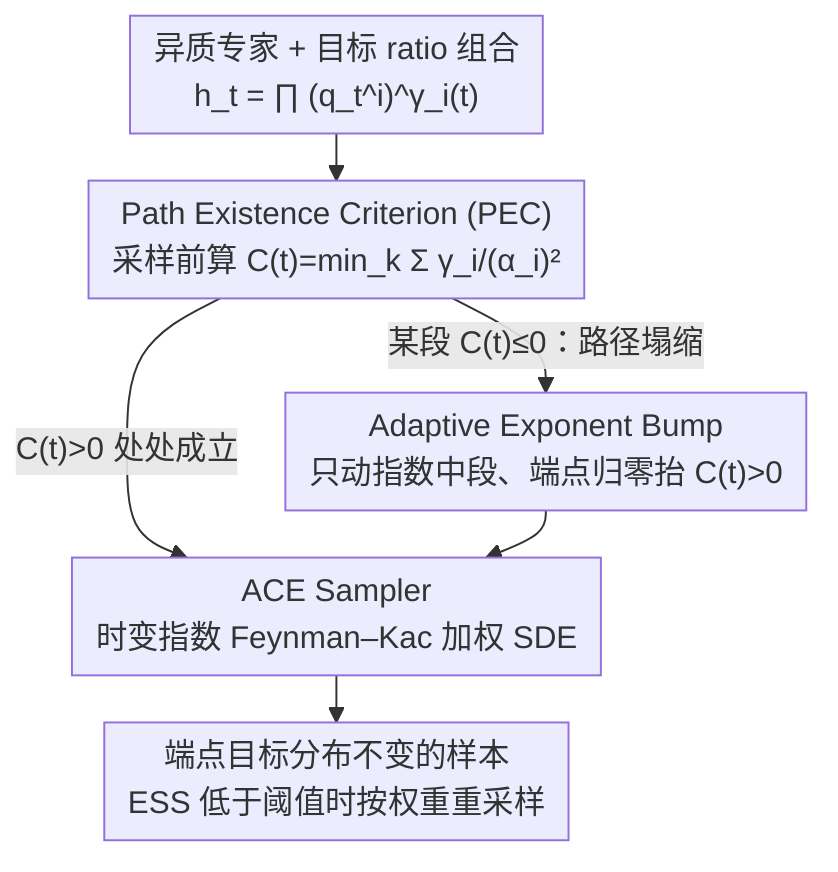

# On the Collapse of Generative Paths: A Criterion and Correction for Diffusion Steering

**会议**: ICML 2026  
**arXiv**: [2512.10339](https://arxiv.org/abs/2512.10339)  
**代码**: https://ziseoklee.github.io/projects/ACE/ （有，项目页）  
**领域**: 计算生物
**关键词**: 边际路径塌缩, 路径存在性判据, 自适应指数修正, Feynman–Kac 引导, 异质噪声调度

## 一句话总结
本文指出"用 ratio-of-densities 组合多个异质扩散/流模型"的推理时引导会出现 **Marginal Path Collapse（MPC）**——中间时刻的复合密度变得不可归一化，进而提出一个充要的 **Path Existence Criterion (PEC)** $C(t)>0$ 来诊断塌缩，并设计 **ACE** 通过对指数 $\gamma_i(t)$ 加 bump 函数来动态修正路径，把 Feynman–Kac 修正器推广到时变指数情形，在合成 Checkerboard、柔性 pose scaffold decoration（DN/CONF/SBDD 三专家组合）以及 COCO-MIG 多属性生成上都显著优于 NR/FKC 等常数指数基线。

## 研究背景与动机

**领域现状**：扩散与流匹配模型的"推理时引导"已经成了不重训就能改任务的事实标准做法，从 classifier-free guidance、product-of-experts，到 Bayesian 组合，本质上都可以写成时间相关的 ratio-of-densities $p^*_t \propto \prod_i (q^{(i)}_t)^{\gamma_i(t)}$。在 CFG 这种"同一个模型同一个调度"的同质场景下，常数指数 $\gamma$ 几乎总是工作良好。

**现有痛点**：科学应用——比如药物分子的 scaffold decoration——天然需要把异质专家拼起来：de-novo 无条件先验、conformer 拓扑专家、pocket-conditioned SBDD 三者训练在完全不同的噪声调度和不同维度上，且各自的最优调度形态都不同（refinement 需要快衰减，exploration 需要慢衰减）。一旦强行用常数指数把它们的 ratio 拼成中间路径，作者发现这条路径在中间时刻可能**根本不存在**——配分函数发散，得分场未定义。但数值求解器还能跑出"看起来正常"的样本，于是用户得到的是一条悄悄走偏的路径。

**核心矛盾**：异质调度 + 负指数（denominator 专家） + 高引导强度 $\omega$ 三者叠加，会让分子端方差收缩慢于分母端，导致 $h_t(x)$ 在 $\infty$ 处不衰减反而爆涨，即使端点 $h_0, h_1$ 都是合法密度。这是一个**全局可归一化**失败，不是局部数值崩，所以靠数值监控（NaN、能量）查不出来。

**本文目标**：(i) 给出一个能在采样前就计算出来的、判断"复合中间密度是否存在"的充要条件；(ii) 当判据不满足时，给出一种修正方案，把不合法的 ratio 路径"修"成一条合法的、同样以指定端点为目标的新路径，并配套可正确采样的加权 SDE。

**切入角度**：作者把视线从"score 是否数值稳定"挪到"$h_t$ 是否可积"。在 Gaussian 先验到紧支撑目标的设定下，所有专家在 $t$ 时刻都是 Gaussian 卷积，可以逐坐标分析 ratio 的二次型系数，进而给出一个仅依赖 $\{\alpha^{(i)}_t, \gamma_i(t)\}$ 的封闭判据。

**核心 idea**：定义 $C_k(t) = \sum_{i: k \in I_i} \gamma_i(t)/(\alpha^{(i)}_t)^2$，当 $C(t) = \min_k C_k(t) > 0$ 路径存在，$< 0$ 则塌缩；既然 $\gamma_i(t)$ 是我们能控制的，就**只调指数的中间值、保留端点 $\gamma_i(0), \gamma_i(1)$ 不变**，用一个 bump 函数把 $C(t)$ 抬过零，再用一个支持时变指数的 Feynman–Kac 加权采样器去执行修正后的路径。

## 方法详解

### 整体框架
ACE 要解决的是"把多个异质扩散/流专家拼成 ratio 组合 $h_t(x) = \prod_i (\tilde q^{(i)}_t(x))^{\gamma_i(t)}$ 时，中间时刻的复合密度可能根本不可归一化"这个隐蔽失败。它把这个问题拆成先诊断、再修路径、再采样三件事：先用一个只依赖噪声调度和指数的封闭量在采样前判断路径是否存在；若某段时间内不存在，就给指数加一个端点归零、中段为正的扰动把路径"抬"回合法区；最后配一个能正确处理时变指数的加权粒子采样器去执行修正后的路径。输入是一组预训练异质专家加一个目标 ratio 组合，输出是从修正路径上采到的、端点目标分布完全不变的样本。

### 关键设计

**1. Path Existence Criterion：在采样前一行求和就能判断路径是否塌缩**

异质组合最棘手的地方在于，路径塌缩时 score 场仍然数值有限，求解器照跑不误，靠 NaN/能量监控根本查不出来——用户拿到的是一条悄悄走偏的样本。作者把判断标准从"score 是否数值稳定"换成"复合密度 $h_t$ 是否可积"。在 Gaussian 先验到紧支撑目标的 stochastic interpolant 设定下，每个专家 $\tilde q^{(i)}_t$ 在 $\|x\|\to\infty$ 方向上对数密度的二次项系数完全由 $1/(\alpha^{(i)}_t)^2$ 决定，于是 ratio 的二次项就是各坐标上各专家贡献的累加：定义 $C_k(t) = \sum_{i: k \in I_i} \gamma_i(t)/(\alpha^{(i)}_t)^2$，并取 $C(t) = \min_k C_k(t)$。$C_k(t) > 0$ 意味着该坐标方向上 $h_t$ 是 sub-Gaussian 衰减、可积、路径存在；$C_k(t) < 0$ 则该方向爆涨、$h_t$ 不可积、路径塌缩；$C(t) = 0$ 是边界情形（附录给反例说明既可塌也可不塌），所以 $>0$ 与 $<0$ 是最锐的充要判据（Theorem 2.1）。这个判据只在采样器实际用到的离散时刻 $\{0, t_1, \dots, t_{\text{end}}\}$ 上检验，工程上几乎零开销，可以在调度设计阶段直接画 $C(t)$ 曲线当 sanity check。更进一步，作者把 $C(t)$ 与中间分布的浓度半径挂钩 $R_t(\varepsilon) \propto 1/\sqrt{C(t)}$（Proposition 2.1）：$C(t)\to 0^+$ 时半径发散，所以"刚好不塌但 $C(t)$ 贴近 0"的样本一样会跑飞——$C(t)$ 不是 0/1 开关，而是一个连续的"质量旋钮"。

**2. Adaptive Exponent Bump：只动指数的中段、端点纹丝不动地把判据抬过零**

诊断出 $C(t)$ 在某段时间 $\le 0$ 后，最常见的回避手段是直接降低引导强度 $\omega$，但这会削弱所有时刻的引导、连合法时段也跟着变弱。ACE 的做法是只在中间时段对指数加正质量、端点处归零：把 $\gamma_i(t)$ 改造成 $\tilde\gamma_i(t) = \gamma_i(t) + b(t)$，其中 $b(t) = B_1 \cdot t(1-t) + B_2 \cdot \min(t, \tau(1-t))$ 由平滑二次抛物 bump $Q(t)=t(1-t)$ 与带可调拐点 $\tau$ 的线性 bump $L_\tau(t)$ 组成，二者都自动满足 $b(0)=b(1)=0$，因此 $\tilde\gamma_i(0)=\gamma_i(0)$、$\tilde\gamma_i(1)=\gamma_i(1)$，端点目标分布原封不动。作者证明只要先验端 $C(0)>0$（通常成立），就一定能在"覆盖所有坐标的某些正指数专家"上加这样的 bump 让 $C(t)>0$ 处处成立（Theorem 2.2）；当恰好有单个专家覆盖全部坐标时（如柔性 pose scaffold decoration 里的 SBDD pocket 专家），只加一个 bump $\tilde\gamma_j(t)=\gamma_j(t)+b(t)$ 就够。强度 $B_1, B_2$ 可从 $C(t)$ 的最负点反解出下界。这等于"让高引导只在中段被临时温和化"，既不牺牲目标分布也不牺牲端点强度。

**3. ACE Sampler：把 Feynman–Kac 修正器补回时变指数那一项**

换一条合法路径还不够，必须有匹配的采样器才能保证"模拟出来的边际等于修正后路径的边际"。score 写成加权和 $s^*_t = \sum \tilde\gamma_i(t) \tilde s^{(i)}_t$，速度场取数值最稳的 $v^*_t = \sum \tilde\gamma_i(t) \tilde v^{(i)}_t$，粒子按 $dX_t = (v^*_t + \tfrac{\sigma_t^2}{2} s^*_t)\, dt + \sigma_t\, dW_t$ 推进。关键差异在权重：直接套用 Skreta 等人的 Feynman–Kac corrector（FKC）在 $\dot{\tilde\gamma}_i \neq 0$ 时是错的，会丢掉由 bump 时间变化诱导的一项，导致权重偏估、终端分布偏移；ACE 的权重对数演化在 FKC 基础上显式补回 $\sum \dot{\tilde\gamma}_i(t) \log \tilde q^{(i)}_t(X_t)$（Theorem 2.3）。由于 $\log \tilde q^{(i)}_t(X_t)$ 没有闭式，作者用 Itô 公式给出一组辅助 SDE 在线追踪它们；当有效样本数 ESS 低于阈值时按权重重采样，把高权样本复制、低权（跑偏）样本剔除。$\dot{\tilde\gamma}_i = 0$ 时整个采样器退化为原始 FKC，所以 ACE 是 FKC 在时变指数下的严格推广。

### 损失函数 / 训练策略
ACE 是**纯推理时**框架，不重训任何专家。涉及的超参只有 bump 系数 $B_1, B_2, \tau$ 和 ESS 重采样阈值。在 scaffold decoration 实验里取 $B_1 = 30$，$B_2 \in \{0.037, 0.136, 0.236, 0.336\}$ 对应 $\omega \in \{1.1, 1.2, 1.3, 1.4\}$；2D 合成实验取 $B_2 = 1.5$，$B_1 \in [0, 50]$ 扫描。

## 实验关键数据

### 主实验

**2D 合成 Checkerboard**：三专家组合（1D X 局部约束、2D (X,Y) 全局约束、1D X 分母），故意选 $\alpha^{(1)}_t = \cos(\pi t/2)$、$\alpha^{(2)}_t = $ DDPM、$\alpha^{(3)}_t = 1-t$ 这种会触发塌缩的调度。

| 方法 | $W_1$ ↓ (mean±std) | $W_2$ ↓ | MMD(RBF) ↓ |
|------|----|----|----|
| NR (无重采样常数 $\gamma$) | 0.89 ± 0.02 | 1.18 ± 0.02 | 0.092 ± 0.004 |
| FKC (Skreta'25, 常数 $\gamma$) | 1.37 ± 1.09 | 1.59 ± 1.16 | 0.419 ± 0.579 |
| **ACE ($B_1=10, B_2=1.5$)** | **0.20 ± 0.04** | **0.29 ± 0.05** | **0.012 ± 0.003** |

ACE 比 NR 误差降 ~4×，比 FKC 降一个数量级；FKC 在塌缩条件下方差爆表（max 误差 2.92）。

**柔性 pose Scaffold Decoration (CrossDocked2020, DN+CONF+SBDD 三专家组合)**：

| 方法 | $\omega$ | PEC 满足? | OSR(Top25%)↑ | Vina Avg↓ | QED↑ |
|------|----------|----|-----|------|-----|
| ACE | 1.4 | ✓ | **0.75** | **−7.10** | **0.53** |
| FKC | 1.4 | ✗ | 0.40 | −6.24 | 0.44 |
| NR  | 1.4 | ✗ | — | −6.32 (ω=1.1 起就塌) | 0.42 |
| 参考分子 | — | — | — | −6.77 | 0.48 |

ACE 在 $\omega = 1.1 \to 1.4$ 全程保持 PEC 成立，docking 分数随引导单调改善；FKC/NR 在 $\omega \ge 1.1$ 就开始塌、性能反而退化。**ACE 还首次让模块化组合超过专门训练的 monolithic baseline（Delete、AutoFragDiff）的优化成功率**，同时 drug-likeness 不降。

**COCO-MIG 多属性图像生成**：ACE 比常数指数基线提升属性 success rate **+9.6 个百分点**，证明框架不限于异质组合，同质场景也吃 buff。

### 消融实验

| 配置 | Synthetic $W_1$↓ | 说明 |
|------|------|------|
| Full ACE ($B_1=10$) | 0.20 | 完整修正 + 重采样 |
| ACE 但 $B_1=0$ | 0.78 | 不加 bump，仅时变指数 + 重采样 → 退化但仍优于 FKC |
| FKC (常数 $\gamma$ + 重采样) | 1.37 | 缺修正项，塌缩时权重发散 |
| NR (常数 $\gamma$ 无重采样) | 0.89 | 无任何校正，路径外样本留在 batch 里 |
| ACE-lite (无重采样) | — | 实战变体，scaffold 实验里用，省算力 |

### 关键发现
- **塌缩是默认状态而非边角情况**：作者用 125 种常见调度（DDPM/cosine/sigmoid/linear/polynomial）做组合扫描，异质 pair 的塌缩率随 $\omega$ 从 $\omega=1.0$ 的 41% 暴涨到 $\omega=15$ 的 80%。$\omega$ 越大越倾向塌。
- **塌缩的"瞬时性"足以致命**：即使 $C(t) < 0$ 只持续不到 10% 的采样区间，FKC 的重要性权重已经发散；ACE 不论塌缩持续多久都能可靠恢复目标分布。
- **数值有限不代表步进合法**：mixed score field 在塌缩时仍可数值上有限，SDE 求解器照跑不误，但运送的是"另一个未指定的分布" $p'_t \neq p^*_t$；终点和目标的接近完全靠运气，不是步进算法在保证。
- **$C(t)$ 是连续的质量旋钮，不只是 0/1 开关**：Proposition 2.1 给出 $R_t \propto 1/\sqrt{C(t)}$，$C(t) \to 0^+$ 时分布半径 $\to \infty$，重要性权重退化、样本质量随之恶化。ACE 把 $C(t)$ 抬高到稳定的正值，相当于一个"聚焦力"。

## 亮点与洞察
- **把"采样器是否数值稳定"和"路径是否存在"切开**：扩散社区长期把 NaN/能量监控当成判定"采样有没有问题"的标准；本文指出存在一类更隐蔽的失败——路径本身不存在但 score 仍数值有限——这才是异质组合大量"看上去 ok 实际跑偏"的根因。这一概念区分本身就有方法论价值。
- **PEC 是个手起刀落的工程工具**：判据只依赖 $\alpha^{(i)}_t$ 和 $\gamma_i$，离散时刻上一行向量求和就能算，可以在调度设计阶段当 sanity check 直接画 $C(t)$ 曲线，迁移成本极低。任何要把多个异质专家拼成 ratio 的项目都可以先跑一遍 PEC。
- **bump-on-exponent 而非 reschedule-on-noise**：很多人面对调度不匹配会想"重新对齐 $\alpha^{(i)}_t$"，但这要么改训练、要么牺牲单个专家的最优形态。作者反向操作——保留所有专家的最优调度、只让 $\gamma_i(t)$ 在中段轻微变化——非常优雅，端点指数和目标分布完全不变。
- **把 Feynman–Kac 推广到时变指数**：核心补丁是补回 $\sum \dot\gamma_i \log q^{(i)}$ 这一项并用辅助 SDE 跟踪 $\log q^{(i)}_t(X_t)$，这对所有未来想用时变 guidance schedule 的工作（不止本文场景）都有借鉴价值。
- **同质场景也吃红利**：COCO-MIG +9.6% 说明 PEC/ACE 不是"修补异质场景的丑陋创可贴"，在 CFG 之类的常规 guidance 上也能起到"控制中间分布浓度半径"的作用。

## 局限与展望
- **理论依赖 Gaussian 先验 + 紧支撑目标**：PEC 的充要性证明只在该设定下严密；对非 Gaussian 先验、非紧支撑目标（如 RGB 像素到自回归潜空间这种 unbounded 目标）需要重新推导，作者未给一般情形的判据。
- **bump 函数形态人工挑选**：$B_1, B_2, \tau$ 当前需要扫描；理论上"满足 $C(t) > 0$"有无穷多解，作者没给"在所有合法 bump 中选最优"的自动化方案——比如 $B_1$ 太大会让中间分布偏移过多导致样本质量反而下降（Table 2 里 $B_1=50$ 时 $W_1$ 比 $B_1=10$ 差三倍），这意味着 bump 设计仍是一个开洞参数。
- **粒子重采样有算力成本**：scaffold 实验需要 ACE-lite 才能可接受，意味着大规模图像/视频生成场景 ACE 完整版可能成本过高，省掉重采样后的理论保证会减弱。
- **多覆盖子集选择没自动化**：当没有单一专家覆盖所有坐标时，作者建议在多个正指数专家上同时加 bump，但如何选择最少子集、如何分配 bump 强度，工程上未给出具体启发式。
- **改进方向**：(i) 把 bump 参数纳入 inference-time 的可学习/自动调参回路（如根据 ESS 反馈调 $B_1$）；(ii) 把 PEC 扩展到更一般的指数族先验；(iii) 与 classifier guidance、Hessian-based steering 等其他 ratio 形式结合做统一诊断。

## 相关工作与启发
- **vs Feynman–Kac Correctors (Skreta et al., 2025a)**：FKC 是本文最近的前置工作，给出了 ratio-of-densities 路径的加权 SDE 采样器，但隐式假设路径处处可归一化、且要求 $\gamma_i$ 常数。本文指出"路径存在性"在异质情形下必须显式诊断，并把 FKC 推广到 $\dot\gamma \neq 0$；ACE 在常数指数时数学上退化为 FKC。
- **vs Classifier-Free Guidance (Ho & Salimans, 2021)**：CFG $p^*_t = p_t(x|y)^\gamma / p_t(x)^{\gamma-1}$ 是同质单调度场景下的特例，$C(t) = 1/\alpha_t^2 > 0$ 自动成立，所以 CFG 用户从来没遇到塌缩问题，但放到多模型异质组合就会塌；本文是 CFG 类引导在异质场景的"安全网"。
- **vs 任务专用 baseline（Delete, AutoFragDiff）**：这些是为 scaffold decoration 专门训练的 monolithic 模型，本文则用 plug-and-play 的三个通用预训练专家加 ACE，居然能超过专用模型——证明"路径正确性"比"任务专用训练"更核心。
- **vs Bayesian composition / product-of-experts**：这一大类组合方法（包括 SDS/VSD 那种"多 critic 分数加和"）都隐藏在 ratio-of-densities 模板下，本文的判据应该是通用诊断工具，非常值得在 3D/视频/分子等异质多专家场景下广泛尝试。

## 评分
- 新颖性: ⭐⭐⭐⭐⭐ 首次定义并形式化 Marginal Path Collapse，给出充要 PEC 与配套时变指数的 Feynman–Kac 推广。
- 实验充分度: ⭐⭐⭐⭐ 合成、分子、图像三个不同领域 + 125 调度组合扫描验证普遍性，但 bump 超参扫描略浅。
- 写作质量: ⭐⭐⭐⭐⭐ 概念-诊断-修复-采样四段递进非常清晰，定理-反例配套到位，图 3/4 直观展示 $C(t)$ 几何含义。
- 价值: ⭐⭐⭐⭐⭐ 把一个一直被忽视的"采样器看似 ok 但其实跑偏"问题摆上桌，给出零训练成本的诊断与修复方案，对未来异质模型组合（科学发现、多模态、agent-style 多专家）有直接工程意义。

<!-- RELATED:START -->

## 相关论文

- [\[ICML 2026\] Stein Diffusion Guidance: Training-Free Posterior Correction for Sampling Beyond High-Density Regions](stein_diffusion_guidance_training-free_posterior_correction_for_sampling_beyond_.md)
- [\[NeurIPS 2025\] Steering Generative Models with Experimental Data for Protein Fitness Optimization](../../NeurIPS2025/computational_biology/steering_generative_models_with_experimental_data_for_protein_fitness_optimizati.md)
- [\[ICML 2026\] Towards A Generative Protein Evolution Machine with DPLM-Evo](towards_a_generative_protein_evolution_machine_with_dplm-evo.md)
- [\[ICML 2025\] Steering Protein Language Models](../../ICML2025/computational_biology/steering_protein_language_models.md)
- [\[ICML 2026\] SIGMA: Structure-Invariant Generative Molecular Alignment for Chemical Language Models via Autoregressive Contrastive Learning](sigma_structure-invariant_generative_molecular_alignment_for_chemical_language_m.md)

<!-- RELATED:END -->
