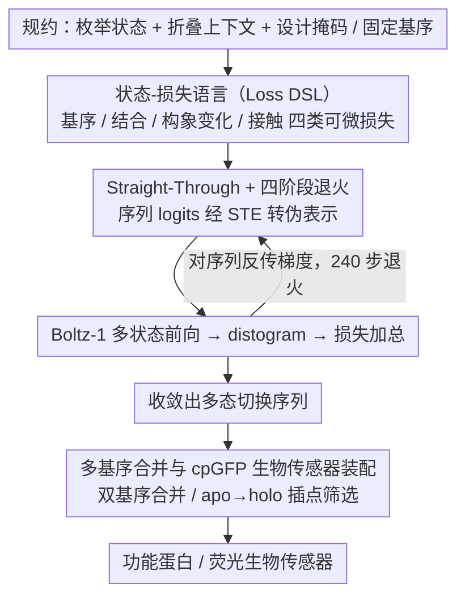

# SwitchCraft: A Programmatic Framework for Designing State-Switching Proteins

**会议**: ICML 2026  
**arXiv**: [2605.31236](https://arxiv.org/abs/2605.31236)  
**代码**: https://github.com/bjing2016/switchcraft  
**领域**: 蛋白质设计 / 科学计算 / 结构生物学  
**关键词**: 多态蛋白设计、Boltz-1、可微结构预测、变构调控、生物传感器  

## 一句话总结
SwitchCraft 把"设计一个能在多个功能态之间切换的蛋白质"形式化为一个对组合约束求解的优化问题，通过对结构预测模型 Boltz-1 反向传播多组状态相关的损失（基序、结合、构象变化、接触），直接梯度下降优化氨基酸 logits，实现首个通用的多态蛋白计算设计框架，并在体外硅基实验中演示了正/负变构、基序切换、诱导结合、配体修饰、配体辨识与 cpGFP 荧光生物传感器的从头设计。

## 研究背景与动机

**领域现状**：生成式蛋白质设计当前由两条技术路线主导：一是蛋白质语言模型（PLM, 如 ProGen、ESM3），在数十亿天然蛋白序列上训练，按家族标签或 GO term 生成新序列；二是结构生成模型（RFDiffusion、Boltz-1、BoltzDesign1），在 PDB 上学习结构分布或对结构预测器反向传播，用于结合体（binder）设计和酶活性位点支架。

**现有痛点**：天然蛋白远不止"一个静态结构对应一个静态功能"，大量关键功能（马达蛋白沿微管行走、ATP 合酶旋转、聚合酶处理信息、血红蛋白协同结合）依赖**多态动力学**——蛋白要在多个构象/结合态之间精确切换。PLM 的条件只能引用已有标签，无法描述未见过的复杂新功能；结构生成器则被限定在单个静态结构上。两条路线都没法直接表达"在配体 A 存在时折叠成构象 1、在配体 B 存在时折叠成构象 2"这种规约。

**核心矛盾**：要么数据驱动但缺标签（PLM 路线），要么物理可控但只描述单态（结构路线）；而真正能完整表达"多个态 + 每个态的结构约束"的数据集根本不存在，导致纯数据驱动路径走不通。

**本文目标**：构造一个**编程式（programmatic）框架**，让设计者像写一段带分支的程序那样，指定任意多个状态及其各自的结构约束，让优化器自动找出能同时满足所有状态的氨基酸序列。

**切入角度**：作者注意到 BoltzDesign1 这类方法已经证明可以对结构预测器 Boltz-1 反向传播来设计 binder——既然单个状态可以这么做，那把多个状态的损失加在一起一起反向传播即可。Boltz-1 接受配体上下文作为输入，天然支持"同一序列在不同配体环境下折叠成不同结构"的多次前向。

**核心 idea**：把"序列 $\mathbf{z}\in\mathbb{R}^{20\times L}$ 在多个折叠上下文 $\{\mathcal{C}_s\}$ 下被 Boltz-1 折出来的结果同时满足一组损失 $\{\mathcal{L}_n\}$"作为优化目标，直接对 $\mathbf{z}$ 做梯度下降，借助 straight-through estimator 把离散氨基酸 argmax 化为可微问题。

## 方法详解

### 整体框架
SwitchCraft 要解决的是"一个序列在不同配体环境下能折成多个指定构象"这件单态生成器做不到的事，它的办法是把这个需求重写成一道优化题。设计者先写出**规约**：枚举若干状态 $s=1,\ldots,N_{\text{states}}$，每个态绑一个折叠上下文 $\mathcal{C}_s$（可含小分子、金属离子、DNA、目标多肽等固定分子），再枚举一组损失 $\mathcal{L}_n:\mathbb{R}^{20\times L}\to\mathbb{R}$、每个依赖一个或多个状态的 Boltz-1 输出，并声明设计掩码 $\mathbf{m}\in\{0,1\}^L$ 与可选的固定基序序列 $\mathbf{s}$。然后进入**优化**：以 logits 表示的序列 $\mathbf{z}$ 为唯一变量，跑 240 步退火 schedule，每步把 $\mathbf{z}$ 转成伪表示喂进 Boltz-1，加总所有损失再对 $\mathbf{z}$ 求梯度更新。整个过程概念上就像训练一个深度模型——损失是设计目标、optimizer 是 SGD、被优化的"权重"就是序列本身。优化收敛出的多态切换序列还能进一步**组装成器件**：把构象开关嵌入环状置换 GFP（cpGFP），就得到从头设计的荧光生物传感器。

### 关键设计

**1. 可组合的状态-损失语言（Loss DSL）：把自然语言规约翻译成可微损失**

设计者脑子里的需求往往是"配体 X 存在时支架某基序、不存在时破坏它"这类带分支的自然语言，痛点在于它没法直接喂给优化器。SwitchCraft 的做法是抽出四类基础损失原语，全部从 Boltz-1 的连续输出（distogram、pair representation）派生，从而对 $\mathbf{z}$ 处处可导。**基序损失** $\mathcal{L}_{\text{motif}}=\sum_{i,j\in m, i\neq j}\sum_k \frac{p_{ijk}}{|m|(|m|-1)}(d_k-\|\mathbf{r}_i-\mathbf{r}_j\|)^2$ 用 distogram 概率加权地最小化基序内残基对的预测距离与目标距离的平方误差，而对应的**反基序损失** $\mathcal{L}_{\text{anti-motif}}=-0.5\,\mathcal{L}_{\text{motif}}$ 只用一个负号就把"主动破坏支架"表达出来；**结合损失** $\mathcal{L}_{\text{binding}}=\frac{1}{2c}\sum \min_j^{(k=c)}\min_i^{(k=2)} H_{<20\text{Å}}(D_{ij})$ 借用 BoltzDesign1 的截断熵，聚合"top-$c$ 配体 token 与 top-2 蛋白残基"的近接概率以鼓励高置信度接触，**反结合损失**同样取负 0.5 倍。

多态的灵魂在另外两个损失上。**构象变化损失** $\mathcal{L}_{\text{conf-change}}(\mathbf{z};\mathcal{C}_1,\mathcal{C}_2)=-\frac{1}{L}\sum_i \max_j \mathrm{JSD}(D^{(1)}_{ij}\|D^{(2)}_{ij})$ 把两个状态下同一对残基的距离分布之 JSD 最大化，强制状态间结构显著分化——之所以用 distogram 上的 JSD 而非"先对齐结构再算 RMSD"，是因为前者绕开了配准歧义、且天然可微。**接触损失** $\mathcal{L}_{\text{contact}}=\frac{1}{L}\sum_j \min_{i:|i-j|\geq 9} H_{<14\text{Å}}(D_{ij})$ 则保证每个态本身被自信地折出来，不至于为了制造差异而牺牲单态可信度。这套正/反对称（motif vs anti-motif、binding vs anti-binding）加状态间 JSD 的设计，让用户能像搭积木一样把"该有/不该有/必须不同"组合成任意复杂的规约。

**2. Straight-Through + 四阶段退火的序列优化：把离散搜索变成可微优化**

序列优化的痛点是氨基酸是 20 选 1 的离散量，直接在 simplex 上搜会指数爆炸，纯连续松弛又会得到非物理的"混合氨基酸"。SwitchCraft 用直通估计（STE）加多阶段退火来两头讨好：每步同时算软分布 $\mathbf{z}_{\text{soft}}=\mathrm{softmax}(\mathbf{z}/\tau)$、硬 one-hot $\mathbf{z}_{\text{hard}}=\mathrm{onehot}(\mathrm{argmax}\,\mathbf{z})$ 和原始 logits $\mathbf{z}$，并令 $\mathbf{z}_{\text{st}}=(\mathbf{z}_{\text{hard}}-\mathbf{z}_{\text{soft}})|_{\nabla=0}+\mathbf{z}_{\text{soft}}$ 使前向看起来是硬决策、梯度却走软路。真正喂给 Boltz-1 的是凸组合 $\mathbf{z}_{\text{pseudo}}=\beta\mathbf{z}_{\text{hard}}+(1-\beta)(\gamma\mathbf{z}_{\text{soft}}+(1-\gamma)\mathbf{z})$，其中 $\beta,\gamma,\tau$ 分别控制"硬/软占比""软分布锐度""温度"三个旋钮。

这三个旋钮按四阶段 schedule 转动，实现从全局探索到离散收敛的平滑过渡：Stage 1（30 步，$\beta=0,\gamma=1,\tau=0.5$）做软探索；Stage 2（100 步，$\gamma$ 从 0 退火到 1）逐渐挤出硬决策；Stage 3（100 步，$\tau$ 从 0.5 降到 0.005）压低温度；Stage 4（10 步，$\beta=1$）完全切到 one-hot 做微调。基序位置（$\mathbf{m}[i]=0$）的残基在每步前向时都被钉死为 motif 序列，不参与优化。早期连续梯度负责全局探索、后期硬约束负责收敛到合法残基，这正是把"梯度上的 inverse design"从结构域推广到序列域的关键。

**3. 多基序合并与 cpGFP 生物传感器装配工作流：把构象开关组装成可用器件**

前两个设计能造出"会切换的蛋白"，但要落到真正有用的器件还差两步。其一是当一个状态需要同时支架两个不同基序时，作者用 Algorithm 2 在残基索引层面先合并基序约束、再走标准 motif 损失，把"基序切换"升级成"一序列双基序"。其二是把多态切换器封装成荧光生物传感器（Sec 4.6）：先用 SwitchCraft 设计 apo/holo 两态构象差异显著的 switcher（ContactLoss + BindingLoss + ConfChangeLoss 三损失联合），再选 apo→holo 间骨架二面角变化最大的残基位作为环状置换 GFP（cpGFP）插入点（Algorithm 3 保证插入位点空间多样），嵌入 cpGFP 后用 Boltz-1 共折叠，筛出 chromophore 接触发生显著变化的设计。

这套工作流的依据来自对天然 cpGFP 传感器机制的逆向工程：以 nicotine 传感器（PDB 7s7u/7s7v）为例，它靠 linker 上一个谷氨酸在 apo 态贴近 chromophore 淬灭荧光、holo 态被拽离 14 Å 解淬灭。作者把这套机制翻译成可计算的筛选准则（intraRMSD、crossRMSD、回转半径、effector iPTM 阈值），从而无需任何天然 switcher 模板，就能为任意小分子从头生成候选传感器，绕开了"必须先有天然开关"的瓶颈。

### 一个完整示例
以 heme + O₂ 的"配体修饰"任务为例走一遍：规约里声明两个状态，态 1 的上下文 $\mathcal{C}_1$ 只放 heme、态 2 的 $\mathcal{C}_2$ 放 heme + 氧分子，再挂上 ContactLoss（两态各自要折得自信）和 ConfChangeLoss（两态距离分布的 JSD 要大）。优化时 $\mathbf{z}$ 在两个上下文里各做一次 Boltz-1 前向、各算一次 distogram，损失加总后回传到同一份 logits 上。240 步退火后某条轨迹收敛出的序列里，一个组氨酸在无氧态配位 heme 铁、有氧态被氧分子排开，触发约 3.8 Å 的局部重排——这恰好复现了血红蛋白"氧结合诱导构象协同"的物理图景，而整个过程只靠对 Boltz-1 反传梯度得到。

### 损失函数 / 训练策略
全局损失是所有状态-损失项之和；优化器是 Adam，单步学习率 $\alpha\in\{0.1,0.2\}$ 按阶段切换；初始 $\mathbf{z}$ 从 Gumbel-softmax 采样。每个设计任务跑大量独立轨迹（100 至 13858 条），每条最终序列再用 Boltz-1 预测 5 个结构做评估。

## 实验关键数据

### 主实验
作者按复杂度递增定义了 6 个多态设计原语，加 1 个生物传感器工作流。下表汇总硅基成功率（成功率 = 满足结构置信度 + 状态差异 + 低 intra-state RMSD 等多重过滤的设计占比）。

| 设计任务 | 配体类型 | 总设计数 | 成功设计 | 关键发现 |
|---------|---------|---------|---------|---------|
| 正/负变构（基序 ON/OFF） | 5 类配体 × 24 基序 × 100 设计 | 12000 | 11 个基序至少 1 成功 | 状态间基序 RMSD 差异常 >5 Å，含 fold switching |
| 基序切换（3IXT↔1YCR） | OQO | 100 | 3 完全成功 | 多数候选满足 4 约束中 3 个，接近通过 |
| 配体修饰（heme + O₂） | heme + 氧分子 | 558 | 10 | 组氨酸被氧排开诱发 3.8 Å 重排，类血红蛋白协同 |
| 诱导结合（Top7 片段 + Ca²⁺） | Ca²⁺ | 940 | 8 | Ca²⁺ 结合诱发 12.50 Å 重排形成结合界面 |
| 配体辨识（3 态：apo/OQO/Ca²⁺） | OQO + Ca²⁺ | 465 | 12 | 关键 loop 在 3 态间任意两两 RMSD ≥1.48 Å |
| 传感器 switcher（SAM/cGMP/ATP） | 3 个小分子 | 13858 | 89 严过滤 → 44 接触变化合格 | 复现 nicotine 传感器机制，Glu74 14.7 Å 位移 |

### 消融实验
| 配置 | 现象 | 说明 |
|------|------|------|
| 完整 4 阶段 schedule | 240 步收敛到 one-hot | 软到硬平滑过渡 |
| 仅基序损失（单态） | 退化为 BoltzDesign1 风格 | 验证框架向后兼容 |
| 去掉 ConfChangeLoss | 多态退化为单态拷贝 | JSD 项是状态分离的关键 |
| 去掉 ContactLoss | 个别态结构置信度崩塌 | 必须为每个态单独保留 |
| 反基序系数从 $-0.5$ 改 $-1.0$ | 破坏过强导致整体折叠失败 | 平衡正反约束的权重很敏感 |

### 关键发现
- 成功率绝对值仍低（11/24 基序、个位数到百分位的命中率），说明这个 benchmark 本身有很大改进空间，作者直接把"5 配体 × 24 基序正负变构"提议为多态设计的标准 benchmark。
- 配体修饰任务里出现了"大构象变化但物理不合理（需要解开再重新结合才能完成）"的失败模式，提示未来需要加入动力学约束。
- 三态配体辨识用 50 残基的 miniprotein 就实现，关键 loop 在三态中分别形成盐桥、疏水口袋、Ca²⁺ 协调位点，hints 多步酶的可设计性。
- 生物传感器工作流中，作者无需任何天然 switcher 模板就为 SAM/cGMP/ATP 生成了 44 个机制合理的候选，其中 SAM 设计复现了 nicotine 传感器的"linker 谷氨酸位移解淬灭"机制。

## 亮点与洞察
- 把多态蛋白设计形式化为"序列上的约束满足问题"，方法的描述形式（state + loss + mask）几乎是一种领域 DSL，便于生物学家直接"编程"出新功能。
- 正/反对称损失（motif vs anti-motif、binding vs anti-binding）只用一个负号就把"该有"和"不该有"统一进同一框架，极具可组合性。
- ConfChangeLoss 用 distogram 上的 JSD 而非"结构对齐 + RMSD"来定义状态差异，规避了配准歧义，可以直接微分。这个技巧对所有需要"两个生成物要不同"的任务（如多样性生成、对抗样本）都可迁移。
- 用 STE + 四阶段退火处理 20 维 simplex 上的离散搜索，是把"梯度上的 inverse design"思路从结构域推到序列域的一个干净案例，比 ProteinMPNN 这种纯采样方式更适合带复杂约束的场景。

## 局限与展望
- 成功率绝对值仍低（很多任务个位数命中），离能直接量产功能蛋白还有距离；作者承认这是 benchmark 而非生产工具。
- 所有评估都是 in silico——用 Boltz-1 折叠并打分。结构预测器本身的偏置会被无限放大，预测置信高的设计未必能在 wet lab 折出来。论文只在 Appendix B.7 提到 induced binding 的初步实验验证。
- 损失目前都是"结构性"的，没有动力学/能量面约束，导致部分构象切换在物理上不可达（需要解-再结合），未来需要引入 transition state 或 kinetic 项。
- Boltz-1 单次前向已经很贵，每个设计要跑 240 步 × 多个状态 forward + backward，对硬件门槛和能耗都是非平凡的开销。

## 相关工作与启发
- **vs BoltzDesign1（Cho et al. 2025）**：本文直接继承其单态结合体设计的损失与优化框架，把单态扩展到多态，是显式的"框架级 superset"，所有 BoltzDesign1 能做的事 SwitchCraft 都能做。
- **vs RFDiffusion（Watson et al. 2023）**：RFDiffusion 是单态结构生成，本文的 24 基序 benchmark 直接复用它的支架任务设定，但把每个基序扩展成"配体响应的可切换支架"，构成自然的难度升级。
- **vs ProteinMPNN / DynamicMPNN**：ProteinMPNN 只做"给定 backbone 找序列"的逆向折叠；DynamicMPNN 支持多 backbone tied design，但 backbone 必须提供。SwitchCraft 把 backbone 和 sequence 一起隐式优化（通过 Boltz-1 内部完成结构隐式表示），不需要预先提供任何 backbone。
- **vs ProDiT / ProteinGenerator**：这两者也想生成多 backbone 对应的序列，但**不接受配体作为输入**，无法表达"配体驱动的状态切换"，这是 SwitchCraft 最关键的差异化点。

## 评分
- 新颖性: ⭐⭐⭐⭐⭐ 首个通用多态蛋白设计框架，从单态到多态是质变。
- 实验充分度: ⭐⭐⭐⭐ 6 类任务 + 生物传感器 case study 覆盖度好，但成功率绝对值低且全为硅基。
- 写作质量: ⭐⭐⭐⭐⭐ 把方法抽象成 specification + optimization 两阶段非常清晰，损失定义和 schedule 写得像教科书。
- 价值: ⭐⭐⭐⭐⭐ 为下一代 functional protein design 立了通用 benchmark 和接口，可能定义未来几年的方法基线。

<!-- RELATED:START -->

## 相关论文

- [\[NeurIPS 2025\] Learning Conformational Ensembles of Proteins Based on Backbone Geometry](../../NeurIPS2025/computational_biology/learning_conformational_ensembles_of_proteins_based_on_backbone_geometry.md)
- [\[ICLR 2026\] HeurekaBench: A Benchmarking Framework for AI Co-scientist](../../ICLR2026/computational_biology/heurekabench_a_benchmarking_framework_for_ai_co-scientist.md)
- [\[NeurIPS 2025\] BarcodeMamba+: Advancing State-Space Models for Fungal Biodiversity Research](../../NeurIPS2025/computational_biology/barcodemamba_advancing_state-space_models_for_fungal_biodiversity_research.md)
- [\[ICML 2025\] Designing Cyclic Peptides via Harmonic SDE with Atom-Bond Modeling](../../ICML2025/computational_biology/designing_cyclic_peptides_via_harmonic_sde_with_atom-bond_modeling.md)
- [\[NeurIPS 2025\] A Unified Framework for Variable Selection in Model-Based Clustering with Missing Not at Random](../../NeurIPS2025/computational_biology/a_unified_framework_for_variable_selection_in_modelbased_clu.md)

<!-- RELATED:END -->
