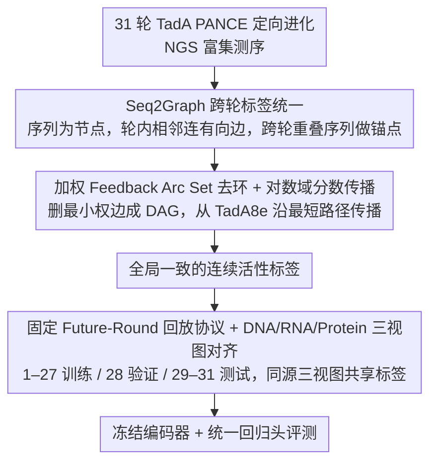

# TadA-Bench: A Million-Variant Benchmark for Future-Round Discovery Toward Agentic Protein Engineering

**会议**: ICML 2026  
**arXiv**: [2606.02624](https://arxiv.org/abs/2606.02624)  
**代码**: 已开源（Hugging Face + GitHub）  
**领域**: 蛋白工程 / AI for Science / 基准评测  
**关键词**: protein engineering, directed evolution, future-round discovery, benchmark, biological foundation models  

## 一句话总结
TadA-Bench 用 31 轮真实定向进化湿实验中的百万级 TadA 变体序列，把蛋白工程问题形式化为"用前若干轮排出后若干轮"的固定数据回放任务，并配套 Seq2Graph 图式标签统一管线，揭示了主流生物大模型在"未来轮发现"上严重失效。

## 研究背景与动机
**领域现状**：蛋白工程正从"一次性预测器"走向"代理式 (agentic) 迭代闭环"，模型需要读取湿实验历史、调用分析工具、推荐下一轮变体，再交回湿实验验证。这要求评测数据具备时间可回放性、探索规模、跨轮标签一致性三大属性。

**现有痛点**：现行的功能性基准（生物物理属性、ProteinGym 这类 DMS 聚合）追求"宽度"——尽可能多家族、多 assay；但它们要么没有真实时间轴，要么只覆盖局部 fitness landscape，无法考核"基于过去轮预测未来轮"这一闭环里最关键的排名能力。专门针对 base editor deaminase 的数据则非常分散，多数关注 Cas/sgRNA 互作而非 deaminase 本体，跨实验室拼接还会引入显著批次效应。

**核心矛盾**：标准随机切分 (random split) 评测衡量的是插值能力，而真实蛋白工程闭环要的是外推能力——这两者的差距究竟有多大、是不是只靠选个更好的回归头就能弥补，社区缺乏一个"单一 campaign、深时间链、统一标签"的硬基准来回答。

**本文目标**：(1) 构建一个深度（31 轮）、规模够大（百万变体）、时间链清晰的单一定向进化数据集；(2) 在多轮 NGS 富集计数里把"局部排名 + 跨轮锚点"转换成全局一致的连续活性标签；(3) 定义固定的过去→未来回放协议，用一类统一指标考核 DNA / RNA / 蛋白基础模型。

**切入角度**：作者选择 TadA（用于 Adenine Base Editor 的脱氨酶）做了 31 轮 PANCE 定向进化，把每轮的 NGS 富集数据视为局部偏序约束，用图论方法消除环路并锚定到已知的 TadA8e 参考序列，从而拿到跨轮可比的活性标签。

**核心 idea**：把"湿实验定向进化轨迹"看作 fixed-data replay 任务，用未来轮 ranking + 有限预算挑选两套指标暴露当前生物大模型的真实推荐能力，并通过对比"匹配规模下的覆盖 vs 局部密度"指出"进化覆盖比局部稠密采样更有信息量"。

## 方法详解

### 整体框架
TadA-Bench 要解决的是"怎么把一段真实的湿实验定向进化轨迹，变成能公平考核生物大模型未来轮发现能力的离线基准"。作者把它拆成三层：先以 31 轮 TadA PANCE 定向进化的 NGS 测序为数据底座，从同一批读数派生出对齐的 DNA / RNA / 蛋白三视图；再用 Seq2Graph 管线把每轮各自带批次效应的富集计数整合成一条全变体可比的连续活性标签；最后固定一套"过去训练、未来测试"的回放协议，让任意冻结编码器配统一回归头都能在同一个 campaign 上被同样的排名指标评判。

### 关键设计

**1. Seq2Graph 跨轮标签统一：把带批次效应的多轮富集计数转成可比标签**

多轮 NGS 最棘手的地方在于每一轮的绝对富集读数都带自己的批次噪声，直接拼接归一化会被批次效应主导，全局回归又会受重复变体和平台噪声干扰。作者的做法是不去碰绝对值，只保留"谁比谁强"这一相对信息：把每个独特 DNA 序列当成一个图节点，轮内按读数富集排序后只在相邻变体之间连一条高→低的有向边，边权取局部富集比；跨轮之间则靠"完全相同的序列在不同轮都出现"作为天然锚点把各轮的局部图缝起来。这种"局部相对比较 + 序列重叠锚点"的抽象天然抗批次效应，又能撑住百万级节点的规模，正好契合多轮高通量筛选数据的本质。

**2. 加权 Feedback Arc Set 去环 + 对数域分数传播：从偏序约束还原全局一致的连续标签**

局部偏序拼起来后，噪声会制造出不一致的环（例如 $v_i>v_j,\ v_j>v_k,\ v_k>v_i$），必须先消环才能得到全局一致的活性序。作者把它建模成加权 Feedback Arc Set 问题——删掉总权重最小的一组边让图变成 DAG，即 $\min_{F\subseteq E}\sum_{e\in F}w_e$ 使得 $G\setminus F$ 无环；这是 NP-hard，于是在每个强连通分量内用贪心启发式（Eades et al., 1993）近似。去环后从已知参考 TadA8e（活性锚定为 1.0）出发、沿"边数最少的路径"做对数域传播：因为富集比是乘性的，取对数后沿路径相加就等价于乘积，而选最短路径能压低噪声沿路累积。值得强调的是作者把这步定位成"数据整合管线"而非图学习贡献，反复提醒边和路径只承担一致性修正与分数扩散，**不可解释为生物学上的祖代/演化谱系**——这种克制是为了让基准不偷偷引入 ancestry 假设。

**3. 固定 Future-Round 回放协议 + DNA/RNA/Protein 三视图对齐：把闭环操作压成可复现的外推考题**

标准随机切分会让模型借同一 mode 里的样本"插值"过去，从而掩盖真正的外推失败，而蛋白工程闭环要的恰恰是"基于过去轮预测未来轮"。为此作者以第 $k$ 轮为 cutoff，模型只能看 $D_{\le k}$ 训练，却要对仅出现在 $D_{>k}$ 的变体排序；主基准固定 1–27 轮训练、第 28 轮验证、29–31 轮测试，且三段切分的序列互不相交，强制评测落在"未来轮发现"这一真实瓶颈上。三视图全部源自同一 NGS：DNA 直接来自测序，RNA 用 T→U 替换得到，蛋白经码字翻译并对同义码字做活性平均，最终得到 729k+148k+150k 条 DNA 序列与 256k+45k+108k 条独立蛋白序列，让跨模态基础模型在"同一题、不同语种"下公平比较；完整的湿实验、Seq2Graph 与回放协议细节都记录在 Appendix。

### 损失函数 / 训练策略
主协议是冻结编码器 + 一个统一回归头，在训练集上用 MSE 回归连续活性，验证集（第 28 轮）只用来选学习率，以保证不同基础模型之间唯一变量是表示本身。为排除"成绩差只是因为探针太弱"的可能，作者额外跑 full fine-tuning 与 prompt tuning 两类 adaptation 检查；并用一个 discovery-mode 检查模拟湿实验预算——给定模型推荐的 top-N 候选，统计其中真正高活性的未来轮变体被命中多少，直接对应落地 agentic loop 里的候选挑选环节。

## 实验关键数据

### 主实验

| 视图 | 模型 | Spearman ↑ | Recall@10% ↑ | nDCG@10% ↑ |
|------|------|------------|--------------|------------|
| DNA | Evo2-7B | 0.0707 | 0.1005 | 0.3236 |
| DNA | Evo2-40B | 0.0675 | 0.1003 | 0.3244 |
| DNA | NT-500M | 0.0189 | 0.1005 | 0.3079 |
| RNA | OG-46M | 0.0079 | 0.1063 | 0.3158 |
| 蛋白 | ESM2-650M | 0.0479 | 0.1120 | 0.2791 |
| 蛋白 | ESMC-600M | **0.0509** | 0.1180 | 0.2860 |
| 蛋白 | Prot-XLNET | 0.0342 | 0.1175 | 0.2895 |

主结论：跨 DNA / RNA / 蛋白三视图，所有冻结探针的 Spearman 均落在 $\rho\approx 0.1$ 以下，远低于同模型在随机切分对照下的相关性——说明现有生物大模型对"未来轮"几乎没有有效的排名信号，瓶颈不在某一种模态或某一个家族。

### 消融实验

| 配置 | 现象 | 含义 |
|------|------|------|
| 随机切分（同分布） | 蛋白视图 Spearman 显著抬升、达"强插值"水平 | 标签本身可学，问题不在 Seq2Graph 噪声 |
| 未来轮切分（默认） | Spearman ≤ 0.1 | 外推失败，瓶颈在"过去→未来" |
| Full fine-tune | 提升有限，gap 不闭合 | 不是探针容量不够 |
| Prompt tuning | 同上 | 不是输入条件方式问题 |
| 有限预算 top-N 挑选 | Recall@10% 仍弱 | 即便给湿实验真实预算，候选命中率仍偏低 |
| 匹配规模下：高覆盖 vs 高密度 | 高进化覆盖子集训练出的模型外推更强 | "覆盖比稠密更重要"——基准设计应保留 campaign 结构 |

### 关键发现
- 插值能力 ≠ 未来轮发现能力：随机切分上看似"够用"的生物大模型，到 fixed future-round 协议下 Spearman 直接掉到接近 0，且这一差距在 DNA/RNA/Protein 三视图上同步存在。
- Adaptation 不能救场：full fine-tuning 与 prompt tuning 都未能闭合 gap，意味着问题不是"探针太弱"而是表示学到的轨迹外推信号不足。
- 进化覆盖优于局部密度：匹配训练规模时，覆盖多个 lineage 的训练集比围绕已知 hits 反复采样更利于未来轮外推——直接支持"campaign 结构必须保留"这一基准设计准则。
- 有限预算 top-N 挑选成绩同样疲软，说明把高分变体推荐给湿实验时，真实命中率仍然有限，对落地 agentic loop 是一个明确的硬瓶颈。

## 亮点与洞察
- **"湿实验回放"范式定义清晰**：把代理式蛋白工程的核心子任务剥离成"固定数据 + 时间切分 + 排名指标"，把"很难评、很贵"的闭环问题压成可重现的离线协议，是社区急需的基准化思路。
- **Seq2Graph 把脏数据问题做成了数据基础设施**：作者很克制地强调它"只是数据整合而不是图学习创新"，但用 FAS 去环 + 对数域路径传播解决多轮 NGS 的拼接，本身就是一套可迁移到其他多轮高通量筛选（如 Cas9，Appendix B.4）的工具。
- **三视图同源对齐**：从同一批 NGS 数据生成对齐的 DNA / RNA / 蛋白序列，为跨模态生物基础模型提供了"同一题、不同语种"的公平比较场地，避免不同 benchmark 选不同任务造成的混淆。
- **结论本身就是研究方向**：把"未来轮外推弱"做成可量化的硬指标后，立刻给出了"覆盖更重要"这种可指导新数据收集的洞见，对 agentic AI for science 是有用的方法论提示。

## 局限与展望
- **单一蛋白家族**：尽管 31 轮 × 百万变体已经罕见，整个基准只覆盖 TadA 一个目标蛋白与一种 selection-coupled assay；跨家族外推性需后续工作补充。
- **fixed-data 而非真闭环**：协议刻意不评测 proposal、planning、tool-use、自动湿实验，因此无法直接衡量真正的 agentic 决策能力，只能视为"agentic loop 中排名子模块"的诊断。
- **标签是 sequence-defined 而非 design-defined**：活性反映完整细胞水平表现（表达 + 折叠/稳定 + 编辑活性），并非孤立催化常数；用它评 model 时要意识到信号是复合的。
- **路径选择 ≠ ancestry**：作者主动撇清，但社区使用时仍可能误读为进化谱系；需要在使用文档里持续提醒。
- **改进方向**：扩展到多家族 PANCE 数据；加入主动学习/获取函数评测层；提供候选生成模块的接入接口。

## 相关工作与启发
- **vs ProteinGym / FLIP / ProteinBench (Notin et al., 2023; Dallago et al., 2021; Ye et al., 2025)**：这些基准追求"宽度"——多家族、多 assay 聚合 DMS；TadA-Bench 走"深度"——单 campaign、31 轮、固定未来轮协议，互补而非替代。
- **vs CRISPRbase 与 base editor 聚合数据集 (Fan et al., 2023; Dixit et al., 2024)**：跨实验室拼接引入批次效应；TadA-Bench 走单一 assay 单一团队来源，并用 Seq2Graph 做内部一致性修复。
- **vs 生物基础模型自身评测 (ESM2/ESMC, Evo 2, NT, OmniGenome)**：这些模型论文以 zero-shot / DMS 插值为主；TadA-Bench 提供了一个真正的外推考核场，结果上挑战了"更大编码器自动等于更好科学发现"的隐含假设。
- **vs ML-guided directed evolution / ALDE 类方法**：本文不评 proposal 层，但把"排名"独立化后为这些方法提供干净的子模块测试床。

## 评分
- 新颖性: ⭐⭐⭐⭐ 任务范式与标签管线在生物基准里少见；评测指标本身较常规。
- 实验充分度: ⭐⭐⭐⭐⭐ 跨 DNA / RNA / Protein、跨 7+ 主流基础模型、配 Random-split 对照与 adaptation 检查。
- 写作质量: ⭐⭐⭐⭐ 概念清晰、自我设限明确（多处主动声明"不是 ancestry / 不是 graph learning 贡献"）。
- 价值: ⭐⭐⭐⭐⭐ 为 agentic AI4Science 提供了少有的硬基准，结论直接指向下一阶段方法学方向。

<!-- RELATED:START -->

## 相关论文

- [\[ICLR 2026\] EvoFlows: Evolutionary Edit-Based Flow-Matching for Protein Engineering](../../ICLR2026/computational_biology/evoflows_evolutionary_edit-based_flow-matching_for_protein_engineering.md)
- [\[ICLR 2026\] How to Make the Most of Your Masked Language Model for Protein Engineering](../../ICLR2026/computational_biology/how_to_make_the_most_of_your_masked_language_model_for_protein_engineering.md)
- [\[ICML 2026\] Influence-Guided Symbolic Regression: Scientific Discovery via LLM-Driven Equation Search with Granular Feedback](influence-guided_symbolic_regression_scientific_discovery_via_llm-driven_equatio.md)
- [\[NeurIPS 2025\] A Standardized Benchmark for Multilabel Antimicrobial Peptide Classification](../../NeurIPS2025/computational_biology/a_standardized_benchmark_for_multilabel_antimicrobial_peptide_classification.md)
- [\[ICML 2025\] scSSL-Bench: Benchmarking Self-Supervised Learning for Single-Cell Data](../../ICML2025/computational_biology/scssl-bench_benchmarking_self-supervised_learning_for_single-cell_data.md)

<!-- RELATED:END -->
