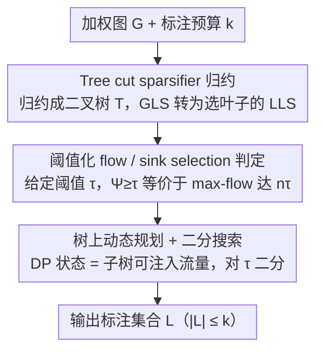

# An Approximation Algorithm for Graph Label Selection

**会议**: ICML2026  
**arXiv**: [2605.18623](https://arxiv.org/abs/2605.18623)  
**代码**: https://github.com/josia-john/icml2026-graph-label-selection  
**领域**: 图学习  
**关键词**: 图标签选择、主动学习、近似算法、树割稀疏化、动态规划  

## 一句话总结
这篇论文首次在不放宽标注预算的设定下，为 Graph Label Selection 给出 $\tilde{O}(\log^{1.5} n)$ 近似算法，并通过树割稀疏化、流判定和树上动态规划把原本全局耦合的选点问题变成可求解的组合优化流程。

## 研究背景与动机
**领域现状**：图上的主动学习常把样本之间的相似性表示成加权图，然后在有限预算 $k$ 下选择少量顶点进行标注，希望这些标注能代表整张图。Graph Label Selection (GLS) 是这一类问题的经典形式化：选择标注集合 $L$，最大化剩余未标注子集的最差割稀疏度 $\Psi(L)$，直观上就是不允许出现一个很大但和已知信息连接很弱的未标注簇。

**现有痛点**：这个目标函数既不是 submodular，也不是 supermodular，因此逐点贪心很难得到可靠保证。已有理论方法多采用 resource augmentation，即允许算法选超过 $k$ 个标注点，再和预算为 $k$ 的最优解比较；这对实际主动学习并不自然，因为标注预算通常是硬约束。

**核心矛盾**：GLS 的难点在于“选哪个点”不是局部问题。一个点是否有价值取决于它和其他候选点共同切断哪些稀疏簇，星形图等例子会让局部贪心选择明显错误。要在固定预算下拿到近似保证，算法必须显式处理标注点之间的全局相互作用。

**本文目标**：作者希望回答 Cohen-Addad 等工作提出的开放问题：是否存在一个真正只使用 $k$ 个标注点、同时能与 $\mathrm{OPT}_k$ 竞争的多项式时间近似算法。论文给出的答案是肯定的，近似因子为 $\tilde{O}(\log^{1.5} n)$。

**切入角度**：作者没有继续沿用逐点贪心，而是先把一般图通过 tree cut sparsifier 归约到二叉树，再把给定阈值 $\tau$ 下“某个标注集合是否足够好”变成 max-flow 判定，最后利用树结构做动态规划。

**核心 idea**：用树割稀疏化保留所有割的稀疏度，再在树上用动态规划一次性选择一组叶子标注点，从而捕捉标注点之间的全局组合效应。

## 方法详解

### 整体框架
论文要解决的是固定预算 $k$ 下的图标签选择，难点在于目标函数既非 submodular 也非 supermodular，逐点贪心拿不到保证。作者的破局思路是把这个全局耦合的选点问题逐层翻译成更易处理的形式：先用 tree cut sparsifier 把一般图归约成一棵二叉树、让选点变成选叶子，再把"某个标注集合是否够好"改写成树上的 max-flow 判定，最后利用树结构对这个流问题做精确动态规划，并对阈值二分搜索得到最优解。近似因子只来自第一步树割稀疏化的失真，后两步在树问题上都是精确求解。

### 关键设计

**1. Tree cut sparsifier 归约：把全局选点压到一棵树上**

GLS 的根本困难是"选哪个点"不是局部问题——一个点的价值取决于它和其他候选点共同切断哪些稀疏簇，星形图等例子会让贪心明显选错。作者的第一步是构造一棵叶子集合等于原图顶点的树 $T$，要求任意 $A\subseteq V$ 的原图割权 $w_G(A,V\setminus A)$ 被树上分离 $A$ 与补集叶子的最小割 $\lambda_T(A,\mathcal{L}_T\setminus A)$ 夹住、最多放大 $\alpha$ 倍。这样任意标注集合 $L$ 的目标值满足 $\Psi_G(L)\leq\widehat{\Psi}_T(L)\leq\alpha\Psi_G(L)$，GLS 就被转成树叶上的 Leaf Label Selection (LLS)：选 $|L|\leq k$ 个叶子，最大化未选叶子集合的最差树割稀疏度 $\widehat{\Psi}_T(L)$。之所以非要换成树，是因为树结构让后续 DP 成为可能，而 cut sparsifier 保证树上解不会偏离原图太多；额外的二叉化步骤还能在不改变近似性质的前提下把 DP 结构规范化。

**2. 阈值化的 flow / sink selection 判定：把"所有子集都要好"压成一条流约束**

LLS 的目标是最小稀疏度，仍然是个对所有未标注子集都要成立的非线性约束，不好直接优化。作者把它转成给定阈值 $\tau$ 的可行性判定：对候选 $\tau$ 构造图 $T_{L,\tau}$，让每个叶子从源点接收容量 $\tau$，被选为 label 的叶子用无穷容量连向汇点，树边保留原容量。关键等价性是 $\widehat{\Psi}_T(L)\geq\tau$ 当且仅当该图的 $s$-$t$ max-flow 达到 $n\tau$——只要存在某个未标注叶子集合形成过稀疏的割，min-cut 就会低于 $n\tau$；反过来流满 $n\tau$ 就说明所有未标注集合的稀疏度都不低于 $\tau$。这一步把"所有未标注子集都要好"这种全局约束压缩成 max-flow/min-cut 语言，问题随之变成在预算内选最少叶子当 sink、使所有源流都能路由，为下一步树上 DP 提供了可组合的流守恒视角。

**3. 树上动态规划与二分搜索：用可注入流量当状态精确求解**

一般图上的 sink selection 仍然难，但在二叉树上可以用 DP 精确解。状态 $\mathrm{DP}[v][k]$ 表示在子树 $T_v$ 中允许选 $k$ 个 sink 时，最多还能从子树根部额外注入多少流而保持可路由。叶子 base case 很直接：不选该叶子时它贡献 $-\tau$ 的净需求，选它则可吸收任意流。内部节点枚举预算分配 $a$ 与 $k-a$，用边容量函数 $\mathrm{bound}_{(v,c)}(x)$ 把每个子树能承受的流截断到边容量范围内再相加；根节点若 $\mathrm{DP}[root][k]\geq 0$ 就说明预算 $k$ 足以让阈值 $\tau$ 可行，最后对 $\tau$ 二分即得 LLS 解。总状态数 $O(nk)$、每个转移枚举预算，DP 时间 $O(nk^2)$。这个设计的价值在于：树让左右子问题只通过一条边交换流，DP 因此能完整捕捉标注点之间的全局相互作用，而这正是一般图上反复解流/割问题做不到的。

### 损失函数 / 训练策略
本文是组合优化算法，没有神经网络训练损失。优化目标是最大化 $\Psi(L)=\min_{C\subseteq V\setminus L} w(C,V\setminus C)/|C|$，即让任意未标注簇都不至于同时"大且孤立"。理论算法使用二分搜索 $\tau$；实验实现中由于缺少开源 tree cut sparsifier，作者用 Fiedler vector 和 METIS 等稀疏割启发式构建层次分解树。

## 实验关键数据

### 主实验
论文的理论主结果是固定预算近似保证；实验则展示启发式树分解版本在真实 SNAP 图上的速度优势。下面表格综合了理论和 ca-GrQc 运行时结果。

| 数据集 / 设置 | 指标 | 本文 | 之前SOTA / 基线 | 提升 |
|---------------|------|------|-----------------|------|
| 任意加权图，预算 $k$ | 近似保证 | $\tilde{O}(\log^{1.5} n)$，且 $|L|\leq k$ | Cohen-Addad 等为 $O(\log n)$ resource augmentation | 首个无预算放宽的多项式近似 |
| ca-GrQc, $k=10$ | real time | 22s (Ours Fiedler) | 144s Guillory-Bilmes / 4967s Cohen-Addad | 约 6.5x / 225x 更快 |
| ca-GrQc, $k=50$ | real time | 21s (Ours Fiedler) | 842s Guillory-Bilmes / 15586s Cohen-Addad | 约 40x / 742x 更快 |
| ca-GrQc, $k=100$ | real time | 22s (Ours Fiedler) | 1835s Guillory-Bilmes / 22956s Cohen-Addad | 约 83x / 1043x 更快 |
| com-dblp, 317080 点 | $\Psi$ 质量 | 0.030 / 0.048 / 0.083 for $k=50/500/5000$ | 多数基线难以扩展到该规模 | 可在大图上给出可用解 |

### 消融实验
实验中的主要分析是不同 sparse-cut heuristic 对质量和可扩展性的影响。作者没有声称这些启发式保持最坏情况理论保证，但它们展示了理论框架的实际可运行版本。

| 配置 | 关键指标 | 说明 |
|------|---------|------|
| Fiedler sweep | ca-GrQc 上质量接近现有方法，运行约 20 秒量级 | 谱方法切分质量稳定，但需要计算 Fiedler vector |
| FiedlerBalanced, $\beta\in\{0.01,0.1\}$ | 速度更快，质量下降 | 强制更平衡的树分解减少递归深度和运行时间，但牺牲稀疏割质量 |
| METIS, samples $\in\{\sqrt n,10\sqrt n,100\sqrt n\}$ | 可扩展到 com-dblp，$\sqrt n$ samples 几小时内完成 | 多次不同目标权重的 METIS 切分能在大图上保持实用性 |
| 原始 tree cut sparsifier | 理论因子 $\tilde{O}(\log^{1.5} n)$ | 目前缺少开源实现，实验用启发式替代，因此理论与工程版本分离 |

### 关键发现
- 固定预算近似是论文最重要的理论突破：它避免了“算法多标一些点”这种对主动学习不太现实的保证方式。
- 树上 DP 的运行时间主要是 $O(nk^2)$，因此当 $k$ 不是特别大时，比在一般图上反复解复杂流/割问题更有扩展潜力。
- 实验质量与 sparse-cut heuristic 强相关。Fiedler 与 METIS 整体表现好，Balanced 版本用质量换速度；这说明实际瓶颈从“如何选标签”部分转移到了“如何构造好树分解”。

## 亮点与洞察
- 最巧妙的地方是把预算约束下的选点问题转成“选择 sink 让流可路由”。这个视角让每个标注点的作用变成吸收流量，而不是局部提高某个贪心分数。
- 论文清楚地区分了理论算法和工程实现。理论上依赖 tree cut sparsifier 获得近似因子，实验中承认没有开源实现，因此用 Fiedler/METIS 做 proof-of-concept，这比把启发式伪装成理论算法更诚实。
- 动态规划状态的设计很有复用价值。许多树分解后的主动学习、代表点选择或 cut-cover 问题，都可能用“子树可注入/可吸收流量”作为可组合状态。
- 对图主动学习而言，这篇论文提醒我们：如果目标函数不是 submodular，继续堆贪心启发式可能很难拿保证，换一个等价判定问题反而能打开算法空间。

## 局限与展望
- 实验没有使用真正的最坏情况 tree cut sparsifier 实现，因此实验版算法不继承 $\tilde{O}(\log^{1.5} n)$ 理论保证。后续若有高质量开源 sparsifier，结果会更完整。
- 运行时表不是严格受控 benchmark，作者也说明同机有其他进程、实现未调优，因此数字应主要看量级趋势，而不是精确排序。
- 目标函数关注图割稀疏度，适合相似图上传播标签的设定；若真实任务的标签噪声、类别不平衡或特征模型误差很强，仅靠图结构可能不够。
- DP 对预算有 $k^2$ 依赖，大预算或超大规模动态图场景仍需进一步优化，例如近似 DP、并行化 METIS sampling 或增量更新。

## 相关工作与启发
- **vs Guillory and Bilmes**: 早期工作提出 GLS 目标并给出实用启发式，本文则从近似算法角度解决固定预算保证，理论性更强。
- **vs Cesa-Bianchi et al.**: 他们在无权树等特殊结构上有保证，本文通过 tree cut sparsifier 把一般图归约到树结构，因此适用范围更广。
- **vs Cohen-Addad et al.**: 前作给出 resource augmentation 算法并提出固定预算开放问题；本文直接解决该开放问题，但近似因子来自树割稀疏化，实验实现也依赖启发式分解。
- **启发**: 对图上样本选择问题，可以先寻找保割结构的树/层次分解，再在分解结构上做精确 DP；这条路线可能比直接在原图上设计贪心规则更容易获得可证明结果。

## 评分
- 新颖性: ⭐⭐⭐⭐⭐ 首个无 resource augmentation 的 GLS 多项式近似算法，问题设定和算法路线都很清楚。
- 实验充分度: ⭐⭐⭐⭐☆ 覆盖多个 SNAP 图并比较多种启发式，但理论 sparsifier 未实装，实验保证与理论保证仍有距离。
- 写作质量: ⭐⭐⭐⭐☆ 归约链条完整，证明组织清晰；部分算法伪代码从 PDF 抽取看较紧凑，需要结合正文读。
- 价值: ⭐⭐⭐⭐⭐ 对图主动学习、代表点选择和图组合优化都有直接参考价值。

<!-- RELATED:START -->

## 相关论文

- [\[AAAI 2026\] Posterior Label Smoothing for Node Classification](../../AAAI2026/graph_learning/posterior_label_smoothing_for_node_classification.md)
- [\[ICML 2026\] Identifying and Correcting Label Noise for Robust GNNs via Influence Contradiction](identifying_and_correcting_label_noise_for_robust_gnns_via_influence_contradicti.md)
- [\[AAAI 2026\] EchoLess: Label-Based Pre-Computation for Memory-Efficient Heterogeneous Graph Learning](../../AAAI2026/graph_learning/echoless_label-based_pre-computation_for_memory-efficient_heterogeneous_graph_le.md)
- [\[AAAI 2026\] RFKG-CoT: Relation-Driven Adaptive Hop-count Selection and Few-Shot Path Guidance for Knowledge-Aware QA](../../AAAI2026/graph_learning/rfkg-cot_relation-driven_adaptive_hop-count_selection_and_few-shot_path_guidance.md)
- [\[ECCV 2024\] GKGNet: Group K-Nearest Neighbor Based Graph Convolutional Network for Multi-Label Image Recognition](../../ECCV2024/graph_learning/gkgnet_group_k-nearest_neighbor_based_graph_convolutional_network_for_multi-labe.md)

<!-- RELATED:END -->
