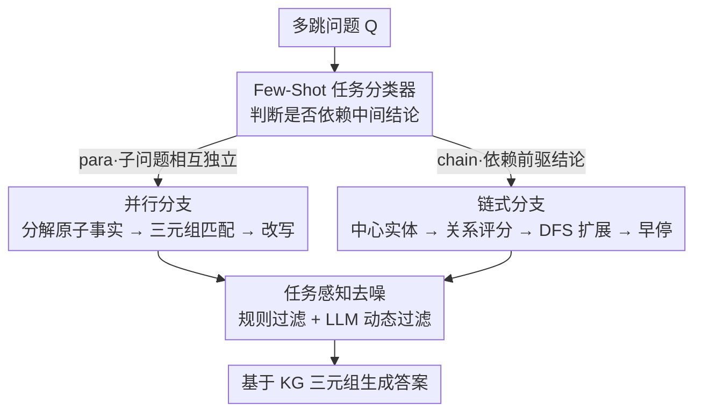

# DTKG: Dual-Track Knowledge Graph-Verified Reasoning Framework for Multi-Hop QA

**会议**: ICML 2026  
**arXiv**: [2510.16302](https://arxiv.org/abs/2510.16302)  
**代码**: https://anonymous.4open.science/r/DTKG-621F  
**领域**: 图学习 / 知识图谱 / 多跳问答 / RAG  
**关键词**: 知识图谱、多跳推理、双过程理论、事实核验、路径剪枝

## 一句话总结
DTKG 把多跳问答按"并行事实核验 vs 链式推理"二分，先用 few-shot 分类器把问题路由到合适的分支，并行分支用 KG 三元组核验原子事实，链式分支在 Wikidata 上做 DFS 路径扩展+评分剪枝，外加一套"任务感知"去噪，在 6 个数据集上比 KGR / ToG 等单策略 baseline 提升 5%–29.5%。

## 研究背景与动机
**领域现状**：RAG 已经是缓解 LLM 幻觉的主流方案，而多跳 QA 是 RAG 中最有挑战的子任务，需要跨多个知识单元做实体—关系链推理。当前两类主流路线一是 LLM-centric 的事实核验（如 KGR），二是 KG path-based 的链式构造（如 ToG）。

**现有痛点**：两类方法都犯了"一刀切"的错。LLM 事实核验擅长把答案拆成若干独立小事实再去 KG 比对，但是面对"先求 A 再用 A 的属性查 B"这类链式问题就会丢掉中间结论、推理链断裂；KG 路径方法擅长按关系一跳跳走，但是遇到"同时核验几个独立子问题"的并行任务，会爆出大量冗余分支，算力被浪费在不相关路径上。

**核心矛盾**：多跳问题在拓扑上本质是异质的——有的子问题之间相互独立（并行），有的强依赖前驱结论（链式）；但是现有架构只有一个"推理核"，必然在一类问题上达不到最优。Stanovich 称之为"认知吝啬鬼"倾向，把所有问题都丢给同一套廉价启发式。

**本文目标**：(i) 把多跳问题动态分到正确的处理分支；(ii) 给两种分支设计专用的 KG 推理算子；(iii) 让去噪策略也按任务类型分化，因为并行任务的噪声是"跨子问题冗余三元组"，链式任务的噪声是"偏离主干的旁支关系"，两者本质不同。

**切入角度**：作者搬来 Tversky & Kahneman 的 dual-process 理论——人类用"无意识快速分类 + 有意识深度处理"应对不同任务，这正好对应"先分类再分支"的两阶段管线。

**核心 idea**：用一个 few-shot LLM 分类器模拟"无意识阶段"快速判定问题类型，再让两条不同的 KG 处理流水线（事实核验 vs 路径构造）模拟"有意识阶段"专注做擅长的事，并配以任务相关的去噪，从而消除策略—任务错配。

## 方法详解

### 整体框架
DTKG 要解决的是"一套推理核打不过异质多跳问题"的错配：有的子问题彼此独立（适合并行核验），有的强依赖前驱结论（适合链式推理）。它的做法是先用一个轻量分类器判断问题类型，再把问题路由到两条专用的 KG 处理分支，最后用一套按任务分化的去噪策略清理无关三元组。作者把这套"快判 + 深处理"对应到 Tversky & Kahneman 的双过程理论，并形式化地把推理空间二分为 $\mathcal{Q} = \mathcal{Q}_{para} \cup \mathcal{Q}_{chain}$，提出 Optimal Strategy Alignment 定理：最优核 $\mathcal{K}^* = \arg\max_{\mathcal{K}} \mathbb{P}(A|Q,\mathcal{K})$ 仅当推理核 $\mathcal{K}$ 与问题 $Q$ 的拓扑对齐时取到，为"先分类再分支"提供了形式化背书。

### 关键设计

**1. Few-Shot 任务分类器：把策略—任务错配消灭在最前端**

整条流水线最致命的失败是用错了推理策略，所以 DTKG 把这个判断提到流水线最前面，用一个 6-shot prompted LLM 分类器 $\mathcal{C}: Q \to \{para, chain\}$ 来扮演双过程理论里"无意识快判"的角色。它判别的核心信号是"问题是否依赖中间推理结论"——依赖则输出 "yes" 走链式分支，否则输出 "no" 走并行分支；prompt 由 5 条显式边界规则 + 6 个标注示例构成，全程靠 LLM 的 in-context learning，不需要任何监督训练数据。把这一步做对之所以关键，是因为它决定了后续分支能否"专一"：消融里把它换成 Random Classification，HotpotQA 的 ACC 直接从 85.8% 跌到 73.0%，比任何单分支都差，说明混合策略一旦不基于问题类型选择就会反噬。

**2. 双轨处理引擎：给并行和链式各配一套最优算子**

两类问题的最优算子本就不同，所以 DTKG 不强行复用一条管线，而是让两条分支各自做擅长的事，只共享底层的三元组打分模块。**并行分支**走"分解—匹配—改写"的扁平管线：先用 LLM 把候选答案 $R$ 拆成原子事实集合 $F = \{f_1, \ldots, f_n\}$，每个 $f_i$ 抽出主语实体并按字符串相似度映射到 Wikidata QID；对该实体的候选三元组先用 embedding 余弦 $\text{sim}_{\cos}(f_i, t_j) = \mathbf{h}(f_i)\cdot \mathbf{h}(t_j) / (|\mathbf{h}(f_i)||\mathbf{h}(t_j)|)$ 取 top-$K$ 召回，再用 reranker 精排，按 $\text{score}_{\text{combined}} = \alpha \cdot \text{score}_{\text{rerank}} + (1-\alpha)\cdot \text{sim}_{\cos}$ 融合（$\alpha$ 是部署侧可调的召回/精度旋钮），与最高分三元组 $t^*$ 比对，不一致就触发改写 $f_i' = f_{\text{rewrite}}(f_i, t^*)$。**链式分支**走"实体—关系—评分—扩展—早停"的深度管线：从问题抽中心实体 $e_0$，在 KG 上同时取 head/tail 关系集合 $R(e_0) = R_{\text{head}} \cup R_{\text{tail}}$，沿路径 $P_k = [e_0 \xrightarrow{r_1} e_1 \cdots \xrightarrow{r_k} e_k]$ 做 DFS，用 $\text{score}_{\text{path}}(P_k) = \prod_{i=1}^k \text{score}_{\text{combined}}(r_i)$ 给整条路径评分；为了不让 DFS 爆炸，用四种约束收口——最大深度 $D_{\max}=3$、每步保留 top-$W_{\max}$、低于阈值 $\theta$ 截断、候选过多时由 LLM 挑最多 3 条；每扩一层判一次 $\text{stop}(P_k) = \mathbb{I}[\text{info}(P_k) \supseteq \text{info}(Q)]$，信息足够就早停，最后选 top-$k$ 路径让 $A = f_{\text{gen}}(Q, P^*)$ 严格基于路径三元组生成答案，避免幻觉。两条分支共用打分模块只是工程上复用实现，判停、剪枝、生成完全独立，互不干扰；消融里 Only-Fact 在链式重的 CWQ 上 ACC 86.0% < 90.0%、Only-Chain 在并行重的 Mintaka 上 EM 57.0% < 67.6%，单分支都明显次于完整双轨。

**3. 任务感知去噪：把噪声拆成"管理性 / 属性相关性"两类分别处理**

通用阈值剪枝最大的毛病是误删——同一条关系在 A 问题里是噪声，在 B 问题里却是关键。DTKG 因此把噪声拆成成本不同的两类，用两层机制分别清理。第一层是规则过滤，针对永远无意义的 KG 管理性元数据：维护一个静态关键词库 $K_{\text{invalid}} = \{\text{ID, source, version, metadata}\}$，只要关系标签命中其一就判 $\text{filter}_{\text{rule}}(r) = \text{True}$ 直接干掉（如 wikidata:id），廉价且零误伤。第二层是动态过滤，针对"上下文相关但与当前问题无关"的属性关系：交给 LLM 按问题语境打分 $\text{score}_n(r, Q) = \text{LLM}(\text{Prompt}_n \oplus r \oplus Q)$，低于阈值 $\theta$ 才丢弃。这样"绝对噪声"用规则一刀切、"相对噪声"用 LLM 上下文判断，刚好对应低成本和高精度两挡，相比 ToG 的统一路径剪枝能保住"语义相关且逻辑必要"的关系不被误剪。

### 损失函数 / 训练策略
DTKG 是无训练（training-free）的推理框架，所有"学习"都通过 LLM 的 in-context prompting 完成，没有额外参数。关键超参：embedding top-$K$、reranker 融合权重 $\alpha$、DFS 最大深度 $D_{\max}=3$、宽度 $W_{\max}$、关系分阈值 $\theta$、必要性分阈值；具体值在 Appendix 给出。底座 LLM 用 Llama-3-8B。

## 实验关键数据

### 主实验
在 6 个数据集上对比 COT / CRITIC / KGR / ToG 等基线，Llama-3-8B 底座，指标为 EM / ACC（语义匹配准确率，BERTScore 阈值判定）。

| 数据集 | 指标 | 本文 DTKG | 最强基线 | 提升 |
|--------|------|------|----------|------|
| HotpotQA | EM/ACC | 38.2 / 85.8 | ToG 37.1 / KGR 83.5 | +1.1 / +2.3 |
| Mintaka | EM/ACC | 67.6 / 93.9 | COT 66.6 / KGR 92.0 | +1.0 / +1.9 |
| CWQ | EM/ACC | 46.3 / 90.0 | KGR 45.0 / ToG 88.1 | +1.3 / +1.9 |
| QALD10-en | EM/ACC | 50.0 / 85.0 | COT 50.0 / KGR 83.0 / CRITIC 83.0 | tie / +2.0 |
| GraphRAG-Bench | EM/ACC | 14.5 / 87.1 | COT 14.4 / ToG 84.5 | +0.1 / +2.6 |
| MuSiQue | EM/ACC | 18.5 / 83.0 | COT 18.0 / ToG 80.5 | +0.5 / +2.5 |

绝对 ACC 提升相对 Original（无 KG）最大达到 MuSiQue 的 53.5% → 83.0%（+29.5%），这正是论文摘要里 "5.0%-29.5%" 数字的来源。

### 消融实验
分类器消融（Llama-3-8B，EM/ACC）：

| 配置 | HotpotQA | Mintaka | CWQ | QALD10-en | 说明 |
|------|----------|---------|-----|-----------|------|
| Only-Fact Verification | 35.6 / 83.5 | 62.3 / 91.5 | 40.5 / 86.0 | 49.5 / 83.5 | 全走并行分支，链式数据集明显掉点 |
| Only-Reasoning Chain | 36.5 / 85.5 | 57.0 / 91.5 | 40.6 / 87.1 | 50.0 / 81.0 | 全走链式分支，并行任务 Mintaka EM 暴跌 |
| Random Classification | 30.5 / 73.0 | 56.0 / 86.0 | 41.0 / 79.0 | 47.5 / 76.0 | 错配代价巨大，HotpotQA ACC -12.8% |
| Full DTKG | 38.2 / 85.8 | 67.6 / 93.9 | 46.3 / 90.0 | 50.0 / 85.0 | 完整双轨 |

### 关键发现
- 分类器是关键，不是可选项：Random Classification 把 HotpotQA 的 ACC 从 85.8% 拉到 73.0%，说明"混合策略"如果不基于问题类型选择，反而比单分支还差，验证了 dual-process 设计的必要性。
- 单分支在自己擅长的领域接近 DTKG，但在不擅长的领域差距悬殊：Only-Chain 在偏链式的 CWQ 上 EM 40.6 离 DTKG 46.3 不算远，但是在并行重的 Mintaka 上 EM 57.0 < 67.6，差 10 个点，正面验证了"策略—任务对齐"的论点。
- 收益最大的不是 EM 而是 ACC：DTKG 在 MuSiQue 上 ACC 从 53.5% 提到 83.0%，说明 KG 接地把"语义对但措辞不同"的答案救回来了，对自然语言 QA 评测尤其友好。

## 亮点与洞察
- 把心理学的 dual-process 理论搬来做架构隐喻并不只是炫技：分类阶段的"廉价快判"对应 Type 1 思维，分支阶段的"深度处理"对应 Type 2，正好解释了"为什么要在前置做路由 + 后置做专用算子"——这套隐喻可以迁移到任何"输入类型异质 + 算子各有所长"的任务（如多模态 QA、混合代码/自然语言 reasoning）。
- 把噪声按"管理性 / 属性相关性"二分这一招很可复用：静态关键词库干掉绝对噪声，LLM 打分干掉相对噪声，避免单一阈值导致的"高 recall 时误删 / 高 precision 时漏拉"困境。对任何 RAG 系统的去噪都适用。
- "embedding top-$K$ → reranker 精排 → 加权融合"的两阶段打分是工程上很务实的设计，既保住了召回，又拉起了精度；权重 $\alpha$ 还给了部署侧调优旋钮。

## 局限与展望
- 分类器靠 6-shot prompting，鲁棒性依赖底座 LLM 的 in-context 能力，Llama-3-8B 之外其他底座的稳定性论文未做交叉验证；如果分类器把链式题判成并行，错配代价从消融来看不小。
- 强依赖 Wikidata：覆盖度受限于 KG 完备性，对中文 / 垂直领域（医疗、法律）等 KG 稀疏场景，链式分支的路径召回质量可能崩塌；论文没给跨 KG 的迁移实验。
- $D_{\max} = 3$ 的硬约束意味着 ≥4 跳的问题会被截断，虽然作者声称"大多数多跳问题 ≤3 跳"，但 MuSiQue 里就有 4 跳样本，论文没在这种长跳场景做专门分析。
- LLM 调用次数没有量化对比（只放在 Appendix A.7）：双轨流水线每个问题至少要 1 次分类 + 多次评分 + 1 次生成，端到端延迟和成本相比单分支 baseline 应该明显上升，部署侧需要权衡。

## 相关工作与启发
- **vs KGR (Guan et al., 2024)**：KGR 用 KG 做事实核验，本质等价于 DTKG 的并行分支单独跑；在 CWQ 这种链式数据集上 KGR EM 45.0 < DTKG 46.3，差距来自缺失链式分支。DTKG 把 KGR 看成自己的一个子模块并补上链式路径构造。
- **vs ToG (Sun et al., 2024)**：ToG 在 KG 上做迭代路径探索，等价于 DTKG 的链式分支单独跑；在 Mintaka 这种并行重数据集上 ToG ACC 90.0 < DTKG 93.9，差距来自冗余路径浪费算力。DTKG 用分类器把并行任务从 ToG 式探索里救出来。
- **vs CoT (Wei et al., 2022)**：CoT 是纯 LLM in-context 推理，没有 KG 接地，幻觉无法被截断；DTKG 在 ACC 上几乎全面碾压 CoT（如 GraphRAG-Bench 87.1 vs 77.2），说明"显式 KG 验证"比"隐式链式思考"在事实性任务上更稳。

## 评分
- 新颖性: ⭐⭐⭐ 单点创新有限（分类器 + 两条已知风格分支 + 去噪），但是"双过程理论指导路由"的整体框架是新的组合。
- 实验充分度: ⭐⭐⭐⭐ 6 个数据集 + 3 个分类消融，但是去噪模块消融、跨底座、长跳场景未覆盖。
- 写作质量: ⭐⭐⭐⭐ 动机—理论—方法—实验链路清晰，定理形式化也写到位，认知科学背景偶有过度堆砌。
- 价值: ⭐⭐⭐⭐ 把"分类 + 路由"这一套 RAG 架构范式落到了 KG-QA 上，给后续多策略 RAG 系统提供了好用的模板。

<!-- RELATED:START -->

## 相关论文

- [\[CVPR 2026\] M3KG-RAG: Multi-hop Multimodal Knowledge Graph-enhanced Retrieval-Augmented Generation](../../CVPR2026/graph_learning/m3kg_rag_multi_hop_multimodal_knowledge_graph_enhanced_retrieval_augmented_genera.md)
- [\[AAAI 2026\] RFKG-CoT: Relation-Driven Adaptive Hop-count Selection and Few-Shot Path Guidance for Knowledge-Aware QA](../../AAAI2026/graph_learning/rfkg-cot_relation-driven_adaptive_hop-count_selection_and_few-shot_path_guidance.md)
- [\[ACL 2026\] ComplianceNLP: Knowledge-Graph-Augmented RAG for Multi-Framework Regulatory Gap Detection](../../ACL2026/graph_learning/compliancenlp_knowledge-graph-augmented_rag_for_multi-framework_regulatory_gap_d.md)
- [\[AAAI 2026\] PathMind: A Retrieve-Prioritize-Reason Framework for Knowledge Graph Reasoning with Large Language Models](../../AAAI2026/graph_learning/pathmind_a_retrieve-prioritize-reason_framework_for_knowledge_graph_reasoning_wi.md)
- [\[ICML 2026\] Anchor-guided Hypergraph Condensation with Dual-level Discrimination](anchor-guided_hypergraph_condensation_with_dual-level_discrimination.md)

<!-- RELATED:END -->
