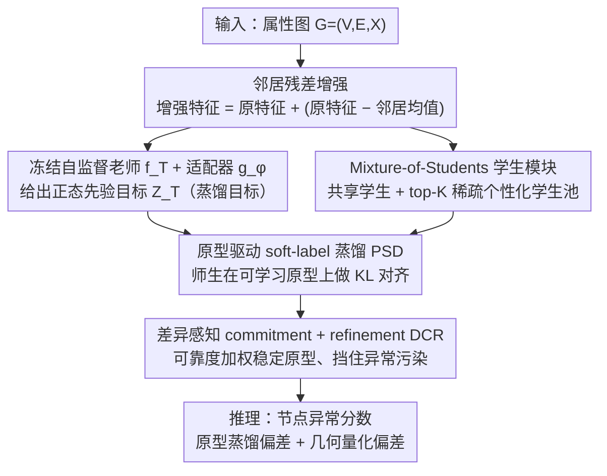

# ProMoS: Generalist Graph Anomaly Detection via Prototype-Based Distillation

**会议**: ICML 2026  
**arXiv**: [2605.26857](https://arxiv.org/abs/2605.26857)  
**代码**: https://github.com/yimingxu24/ProMoS  
**领域**: 图学习 / 异常检测 / 自监督  
**关键词**: 通用图异常检测、原型蒸馏、Mixture-of-Students、零样本、自监督 GNN  

## 一句话总结
ProMoS 把一个冻结的自监督 GNN 当成"正态先验老师"，用一束共享 + 稀疏激活的轻量学生分支去蒸馏它，并通过可学习原型把师生对齐到一个跨图共享的语义空间，从而第一次实现了完全无标签、零样本、跨图迁移的通用图异常检测器。

## 研究背景与动机
**领域现状**：图异常检测（GAD）目前主流仍是"一张图训一个模型"的范式：要么用稀缺标签做监督学习（DOMINANT / BWGNN / GHRN），要么用自监督代理任务（重构、对比学习）建模正态结构。少数最近工作（ARC、UNPrompt、AnomalyGFM）开始尝试 generalist GAD，希望训一次、跨图直接用。

**现有痛点**：现有 generalist 方法仍重度依赖训练图的异常标签，甚至在推理时要少量 target 域支持样本。标注成本高、开放世界异常永远在演化，"标完一批永远不够"。同时，跨图迁移天然面临异质性：金融图节点特征是数值、拓扑是 hub-centric；社交图是文本、是社区结构，instance-level 对齐很容易过拟合到训练图的细粒度模式。

**核心矛盾**：要想 generalist，就必须摆脱标签 + 摆脱细粒度对齐；但纯无监督下从零学正态又容易陷入"狭窄、不具代表性的正态流形"——一个 ill-designed 的无监督目标会让 normality 描述偏差，下游异常打分必然降级。

**本文目标**：构造首个"无监督 + 零样本 + 跨图"三 ✓ 的 generalist GAD 框架。子问题拆成两个：(i) 怎样在无标签条件下学到全面、有代表性的正态模式；(ii) 怎样克服跨图节点语义与拓扑的异质性鸿沟。

**切入角度**：作者注意到自监督 GNN（如 GraphMAE 等）在大图上预训练时，其表示已经把"邻居匹配"这种正态规律吃进去了——因为正常节点本就占绝大多数。这等于免费提供了一个"正态先验老师"，没必要从头再学一次正态。

**核心 idea**：用知识蒸馏把冻结自监督 GNN 老师的正态先验注入轻量学生模块，再用一组可学习语义原型把师生输出对齐到"原型层级"而非"实例层级"，让正态模式以可迁移的抽象概念形式存在；推理时把师生在原型空间的偏差 + 几何偏离当作异常分数。

## 方法详解

### 整体框架
ProMoS 想解决的是"无标签、零样本、跨图"三者同时成立的图异常检测，思路是不再从零学正态，而是把一个冻结的自监督 GNN 老师当成现成的"正态先验"，用轻量学生去蒸馏它，并把师生对齐挪到可迁移的语义原型层级而非容易过拟合的实例层级。具体地，输入 attributed graph $\mathcal{G}=(\mathcal{V},\mathcal{E},\mathbf{X})$ 先做邻居残差增强 $\tilde{\mathbf{x}}_i = \mathbf{x}_i + (\mathbf{x}_i - \frac{1}{|\mathcal{N}(v_i)|}\sum_{v_j\in\mathcal{N}(v_i)}\mathbf{x}_j)$，然后冻结老师 $f_T$ 经可训适配器 $g_\phi$ 给出 $\mathbf{Z}_T = g_\phi(f_T(\mathbf{X},\mathbf{A}))$ 作为蒸馏目标，一束共享 + 稀疏激活学生分支去拟合它；师生都被投影到一组可学习原型上对齐，原型本身在训练中被持续稳定与演化；推理阶段不再训练，节点异常分数直接由师生在原型空间的蒸馏偏差加几何量化偏差给出。学生模块、原型对齐、原型稳定这三步分别对应下面的三个关键设计。

### 关键设计

**1. Mixture-of-Students 学生模块：用稀疏分支同时建模全局正态与局部多样正态**

痛点在于单一学生很难两头兼顾——做小了表达力不足，只能挤出一团粗糙的正态原型；做大了又失去蒸馏的轻量优势。ProMoS 把正态拆成两路分支来表达：一个始终激活的共享学生 $\mathbf{h}_i^g = f_g(\tilde{\mathbf{x}}_i \odot \mathbf{m}_i) + \tilde{\mathbf{x}}_i$ 负责学被老师反复确认的全图通用规律；一个含 $N$ 个轻量 MLP $\{f_p\}$ 的个性化学生池负责局部多样模式，由路由器 $\mathbf{r}_i = \mathrm{softmax}(\mathbf{W}_r \tilde{\mathbf{x}}_i)$ 只稀疏激活 top-$K$ 个学生并赋权 $g_{i,p}$，得到 $\mathbf{h}_i^\ell = \sum_p g_{i,p} f_p(\tilde{\mathbf{x}}_i \odot \mathbf{m}_i) + \tilde{\mathbf{x}}_i$。其中随机 mask $\mathbf{m}_i$ 起鲁棒化作用，identity skip 则鼓励学生只去拟合"老师聚合带来的增量"。这种"shared 全局 + sparse 个性化"的解耦让两类正态各归其位；作者在附录 A 进一步证明 MoS 的期望预测误差不会比任意单学生更差，因此叠加这套结构在理论上稳赚不赔。

**2. 原型驱动 soft-label 蒸馏（PSD）：在可迁移的原型空间对齐师生，而非实例特征**

如果直接在 instance 或 feature 维度逼师生输出一致，蒸馏会过拟合训练图的细粒度特征；一旦 target 图节点语义换了一套，对齐立刻失效，跨图就废了。PSD 的做法是给每个分支 $b\in\{g,\ell\}$ 维护一个原型码本 $\mathbf{P}^b\in\mathbb{R}^{M_b\times d}$（用训练图特征 k-means 初始化后作为可训参数），让师生都相对这组原型算 soft 分配——老师为 $\mathbf{q}_i^b[m] = \frac{\exp(\mathrm{sim}(\mathbf{z}_i^t,\mathbf{p}_m^b)/\tau)}{\sum_{m'}\exp(\mathrm{sim}(\mathbf{z}_i^t,\mathbf{p}_{m'}^b)/\tau)}$，学生 $\mathbf{s}_i^b$ 同理但代入学生输出 $\mathbf{h}_i^b$，相似度取负欧氏平方——再用跨分支 KL 做蒸馏：$\mathcal{L}_{\text{PSD}} = \frac{1}{|\mathcal{V}|}\sum_i\sum_b \mathrm{KL}(\mathbf{q}_i^b \| \mathbf{s}_i^b)$。原型表达的是"这类节点的语义角色"这种高层抽象概念，比实例特征天然更跨图稳定，所以即便 target 图特征分布变了，对齐到原型层级仍然成立。

**3. 差异感知 commitment + refinement（DCR）：稳定老师空间，同时挡住异常节点污染原型**

跨图异质性会让冻结老师的特征空间漂移不稳，而无监督下异常节点又会注入误导梯度把原型带歪，DCR 同时处理这两件事。它先把老师表示 $\mathbf{z}_i^t$ 量化到最近原型 $\mathcal{Z}_b(\mathbf{z}_i^t) = \arg\min_m \|\mathbf{z}_i^t - \mathbf{p}_m^b\|^2$，再用原型间关系矩阵 $\mathbf{Q}^b = \mathrm{softmax}(\mathrm{sim}(\mathbf{P}^b,\mathbf{P}^b)/\tau)$ 的对应行作为"canonical reference"，检查某节点的师生原型分布是否符合全局原型结构，从而给出可靠度 $w_i^b = \sigma(-\beta(\mathrm{KL}(\mathbf{q}_i^b\|\mathbf{Q}_{m_i^\star}^b) - \mu))$。最终目标 $\mathcal{L}_\mathrm{DCR} = \sum_i\sum_b w_i^b(\|\mathbf{z}_i^t - \mathrm{sg}[\mathcal{Z}_b]\|^2 + \|\mathrm{sg}[\mathbf{z}_i^t] - \mathcal{Z}_b\|^2)$ 里，第一项 commitment 把老师特征拉向原型以稳定空间，第二项 refinement（stop-gradient 反向）让原型自身去拟合可信节点的语义。关键在于：朴素 VQ-VAE 式 commitment 会被异常节点带歪，而可靠度加权让模型自己识别"不像正常"的节点并降权，等于在无监督下做了一次软异常剔除，把原型保护得更纯净。

### 损失函数 / 训练策略
总目标 $\mathcal{L} = \mathcal{L}_\text{PSD} + \lambda \mathcal{L}_\text{DCR}$，$\lambda$ 控制蒸馏与原型对齐的权衡，$\tau$ 是温度，$\beta,\mu$ 控制可靠度灵敏度。推理阶段不需要重训，节点异常分数为 $s_i = \sum_b[\mathrm{KL}(\mathbf{q}_i^b\|\mathbf{s}_i^b) + \lambda(\|\Delta_h\|^2 + \|\Delta_z\|^2)]$，其中 $\Delta_h = \mathbf{h}_i^b - \mathcal{Z}_b(\mathbf{h}_i^b)$、$\Delta_z = \mathbf{z}_i^t - \mathcal{Z}_b(\mathbf{z}_i^t)$。直觉是：异常节点要么师生原型分配差异大（distillation bias），要么表示远离任何原型（geometric deviation）。

## 实验关键数据

### 主实验
11 个真实图数据集（Cora、CiteSeer、ACM、BlogCatalog、Facebook、Weibo、Reddit、CS、Photo、Tolokers、T-Finance）零样本设置下的 AUROC（节选）：

| 数据集 | ProMoS | DOMINANT (无监督) | TAM | UNPrompt (有监督 generalist) | AnomalyGFM (有监督 generalist) |
|--------|--------|-------------------|-----|------------------------------|-------------------------------|
| Cora | **84.56** | 66.53 | 62.02 | 53.19 | 47.83 |
| CiteSeer | **90.77** | 69.47 | 72.27 | 53.70 | 49.10 |
| ACM | **89.47** | 70.08 | 74.43 | 68.74 | 53.40 |
| BlogCatalog | **76.17** | 74.25 | 49.86 | 68.87 | 49.31 |
| Reddit | **60.83** | 50.05 | 55.43 | 57.10 | 52.78 |
| Photo | **72.67** | — | 58.35 | 38.60 | 49.65 |
| T-Finance | **71.62** | OOM | 56.16 | 22.14 | 64.44 |

ProMoS 在 9/11 个数据集上 AUROC 第一，在 Weibo 这类强同质图上略低于纯重构式 DOMINANT 但仍稳居第二（91.74 vs 92.88），并且是唯一同时满足"无监督 + 零样本 + generalist"三条的方法。AUPRC 上 ProMoS 在 7/11 数据集第一，提升最大的 T-Finance / CS / Cora 都翻倍以上。

### 消融实验

| 配置 | 大致表现 | 说明 |
|------|---------|------|
| Full ProMoS | 11 图平均最佳 | 完整三组件 |
| w/o MoS（仅 shared 或仅 personalized） | 明显下降 | 失去全局/局部互补 |
| w/o 原型蒸馏（改 instance KL） | 跨图掉点显著 | 退回 instance-level 对齐，无法跨图迁移 |
| w/o DCR | 原型坍缩 + 异常拖累 | 老师特征空间不稳、原型被异常污染 |
| w/o 可靠度加权 | 部分图 AUROC 掉 3-5 pt | 失去对异常梯度的过滤 |

### 关键发现
- MoS 的理论保证（期望误差 ≤ 任意单学生）在实践中成立：单分支版本性能始终弱于完整 MoS。
- 原型蒸馏是跨图泛化的关键：把它换成 instance KL 后，跨图 AUROC 立刻塌到接近 baseline。
- 可靠度加权对异常率高的图（如 T-Finance）增益最大，说明无监督下"自适应剔除可疑节点"确实保护了原型纯净。
- 自监督老师可换成不同 GNN（GraphMAE 等），ProMoS 性能稳定，说明 framework 而非特定老师在起作用。

## 亮点与洞察
- **"不从零学正态，去蒸馏一个免费的正态先验"**：这是整篇文章最 elegant 的点。已经有大量预训练自监督 GNN，但之前没人把它们当作 GAD 的老师，作者把"通用预训练 → 下游任务"这个 LLM 时代的 paradigm 第一次干净地搬到了 graph anomaly detection。
- **原型既是 alignment anchor 又是 inference signal**：训练时它是师生对齐的中介，推理时它又当 codebook 提供量化偏差。这种"一组参数干两件事"的复用很省事且优雅，类似 VQ-VAE 把 codebook 同时用于编码和解码。
- **可靠度加权是无监督版的 robust learning**：用"节点的师生原型分布是否符合全局原型关系矩阵"判断该节点是否可信——本质上是用全局原型结构对每个节点做一次软异常判定，再反向调整学习权重，构成了一个自洽的闭环。可以迁移到任何 noisy-label / self-training 场景。
- **MoS 思路可外推**：把"shared 全局 + sparse 个性化"的 MoE 思路套到自监督蒸馏上，对其他迁移任务（跨域分割、跨语种 NLP）都值得借鉴。

## 局限与展望
- 老师必须是高质量自监督 GNN：如果预训练老师的正态先验本身偏差大（小规模、噪声大图），ProMoS 的天花板会被拉低。
- 原型数 $M_b$、专家数 $N$、top-$K$、温度 $\tau$、$\beta,\mu$ 都是超参，跨图迁移时是否需要 per-target 调还不完全清晰；作者用了固定配置但部分图（Tolokers）仍弱于 specialist baseline。
- 当前是 node-level GAD；graph-level GAD 是否能用同一框架（让 graph-level 老师 + graph-level 原型）值得探索。
- 异常类型仍只覆盖结构/属性异常，对"罕见行为模式异常"（时序/跨模态）扩展需要换老师。

## 相关工作与启发
- **vs DOMINANT/CoLA/TAM**：传统 unsupervised GAD，需要每张图重训，没有跨图能力，ProMoS 把"训一次 → 全图通用"的范式落地。
- **vs ARC / UNPrompt / AnomalyGFM**：同为 generalist GAD，但前者都要标签或 few-shot；ProMoS 完全无监督且零样本，性能反而更强。
- **vs 图自监督预训练（GraphMAE 等）**：以前自监督 GNN 用于下游分类/聚类，ProMoS 把它们"反向"用作 anomaly detection 老师，提供新落地场景。
- **vs 图像异常检测中的 KD（如 STFPM、MKD）**：图像 KD-AD 早已成熟，ProMoS 将其核心思路（teacher–student distillation bias 当异常分数）移植到 node-level graph，关键改造是用原型替代特征对齐，让 KD 跨图也能工作。

<!-- RELATED:START -->

## 相关论文

- [\[ICML 2026\] Rethinking Feature Alignment in Generalist Graph Anomaly Detection: A Relational Fingerprint-based Approach](rethinking_feature_alignment_in_generalist_graph_anomaly_detection_a_relational_.md)
- [\[ICML 2026\] Learnable Kernel Density Estimation for Graphs and Its Application to Graph-Level Anomaly Detection](learnable_kernel_density_estimation_for_graphs_and_its_application_to_graph-leve.md)
- [\[ICML 2026\] Quantile-Free Uncertainty Quantification in Graph Neural Networks](quantile-free_uncertainty_quantification_in_graph_neural_networks.md)
- [\[ICML 2026\] Physics-Informed Coarsening for Multigrid Graph Neural Surrogates](physics-informed_coarsening_for_multigrid_graph_neural_surrogates.md)
- [\[ICML 2026\] Full-Spectrum Graph Neural Network: Expressive and Scalable](full-spectrum_graph_neural_network_expressive_and_scalable.md)

<!-- RELATED:END -->
