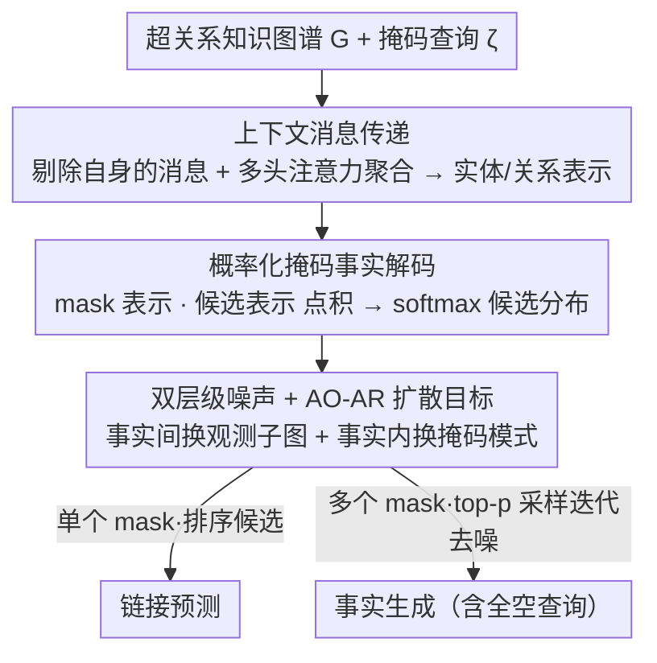

# Generative Representation Learning on Hyper-relational Knowledge Graphs via Masked Discrete Diffusion

**会议**: ICML 2026  
**arXiv**: [2605.24064](https://arxiv.org/abs/2605.24064)  
**代码**: https://github.com/bdi-lab/KREPE (有)  
**领域**: 图学习 / 知识图谱表示 / 生成式建模  
**关键词**: 超关系知识图谱, 事实生成, 掩码离散扩散, 上下文消息传递, 链接预测

## 一句话总结
本文提出"事实生成"任务，把超关系知识图谱（HKG）补全从"填一个空"扩展到"从任意掩码模式甚至从零生成完整事实"，并给出首个生成式 HKG 表示学习方法 KREPE：用上下文消息传递编码事实内/事实间依赖，用掩码离散扩散建模缺失分量的联合条件分布，在三个 HKG 基准的链接预测上达 SOTA，并在事实生成任务上把基于 GPT-5.2 / Gemini 3 Pro 的强 LLM 基线大幅甩开（如 WikiPeople- 从零生成 0.855 vs LLM 最好 0.343）。

## 研究背景与动机

**领域现状**：HKG 把传统三元组 $(h,r,t)$ 扩展成"主三元组+若干 qualifier 键值对" $((h,r,t),\{(k_i,v_i)\})$，能表达更复杂的多维事实（典型如 Wikidata、YAGO）。主流 HKG 补全方法（StarE、HyperFormer、HAHE、MAYPL 等）都把任务建模为**链接预测**：假设事实里恰好有一个位置是 `?`，模型对该位置在候选实体/关系集上打分排序。

**现有痛点**：单空假设和现实严重脱节。真实查询里缺失的分量数目是不确定的——可能缺主语+关系、可能整条事实都不知道、还可能只知道一个 qualifier 想反推主三元组。一旦多个位置同时缺失，基于打分排序的方法面临组合爆炸（候选空间随 qualifier 数指数增长）；强行扩展（如 HAHE 的多位置预测）也只能处理预定义的固定掩码模式，至多每个 qualifier 对里掉一个。

**核心矛盾**：HKG 补全的内在需求是"在不确定掩码模式下生成新事实"，而现有架构本质是"判别式打分+单一掩码模板"，二者从训练目标到推理流程都对不齐。直接套 LLM 也不行——LLM-based KG 方法（KICGPT 等）都走"先用 KG 模型出候选、再让 LLM 重排"，而 KG backbone 本身搞不定多空查询，重排也就无从谈起。

**本文目标**：(1) 形式化定义一个能涵盖任意掩码模式（含全空）的新任务"Fact Generation"；(2) 设计一个**同时**胜任链接预测和事实生成的单一表示学习框架，不再让两者使用不同模型/不同目标。

**切入角度**：把缺失分量看成"从联合条件分布 $P_\theta(x_{\text{mask}} \mid \zeta, G)$ 里采样"的问题，自然地引入**掩码离散扩散**——这套机制天生支持任意子集 masking 与迭代式重构。同时观察到：HKG 里的依赖既有"事实内"（一个 fact 里 head/relation/tail/qualifier 互相约束）也有"事实间"（同一实体在多个 fact 中共享语义），需要在 message passing 和扩散噪声两个层级分别建模。

**核心 idea**：用**上下文消息传递**（更新某个分量时显式剔除其自身信息，强制依赖周围 context）建表示，用**双层级噪声 + AO-AR 扩散目标**（同时扰动观测子图和查询的掩码模式）做训练，把链接预测视作"单掩码事实生成"的特例，统一在同一个模型里。

## 方法详解

### 整体框架
KREPE 要解决的是"在不确定缺哪几个分量的情况下补全甚至凭空生成一条超关系事实"。它把一张 HKG $G=(\mathcal{V},\mathcal{R},\mathcal{H})$ 和一个掩码查询 $\zeta$（fact 里任意子集被换成 `?`）当输入，先用上下文消息传递把观测到的事实编码成实体/关系表示，再用掩码离散扩散把每个 `?` 位转成候选集上的概率分布。训练时每个 epoch 把训练事实随机切成"观测集 $\mathcal{H}_{\text{obs}}$"和"目标集 $\mathcal{H}_{\text{tgt}}$"：拿 $\mathcal{H}_{\text{obs}}$ 跑 $L$ 层消息传递拿表示，再把 $\mathcal{H}_{\text{tgt}}$ 里的事实按掩码分布加掩码当查询，让模型对每个 mask 位输出分布并优化负对数似然。推理时 $\mathcal{H}_{\text{train}}$ 整体作观测集，单次前向得到所有 mask 位分布——只有一个 mask 就排序候选做**链接预测**，多个 mask 就 top-$p$ 采样 + 迭代去噪做**事实生成**，连 $((?,?,?),\{(?,?)\})$ 这种全空查询也能生成。

### 关键设计

**1. 上下文消息传递：强制模型只用周围结构推断分量身份**

要让一个表示既能判别又能被扩散重建，关键是不能让分量"看到自己"。KREPE 把每个事实拆成若干"关系-实体对" $(p,e)$，按角色 $\rho\in\{\texttt{head},\texttt{tail},\texttt{qual}\}$ 投影成 $z_{(p,e)}^{(l)} = W_\rho^{(l)}[p^{(l-1)};e^{(l-1)}]$，事实表示 $z_\xi^{(l)}$ 取所有对之和。更新某个分量 $e$ 时，它发出的不是完整事实表示，而是"剔除自身"的上下文消息 $m_{\xi\to(p,e)}^{(l)} = \text{MLP}^{(l)}\big((z_\xi^{(l)} - z_{(p,e)}^{(l)})/(n_\xi+1)\big)$，再分别拼上配对的关系/实体表示得到 $m_{\xi\to e}^{(l)}$、$m_{\xi\to p}^{(l)}$，最后用多头注意力把同一分量来自多个事实的消息聚合起来更新。

这个"显式踢掉自身"的设计不是细节而是核心归纳偏置：消融 (i) 把上下文消息换成直接用 $z_\xi$（保留自身信息）更新，WD50K 链接预测 MRR 从 0.419 掉到 0.408、事实生成准确率从 0.717 暴跌到 0.552——一旦分量能看到自己就会走捷径，学不到"用上下文重建"的能力。与之配套，实体和关系都用**共享**的初始 token $z_{\text{ENT}}$、$z_{\text{REL}}$ 而非每个 ID 一套独立 embedding（消融 iv 换成独立 embedding 后 WD50K MRR 崩到 0.272），逼模型靠结构而非记忆 ID 来区分实体。

**2. 概率化掩码事实解码：用点积模长承载候选置信度**

判别和生成要落在同一套表示上，就得把"待预测分量"显式转成候选集上的概率分布。KREPE 把掩码分量初始化为可学向量 $x_{\text{ENT}}$ 或 $x_{\text{REL}}$，在消息传递里让查询 $\zeta$ 只能影响 mask 自身、不许去污染已知分量；最终层拿到 $x_{\text{mask}}^{(L)}$ 后，与所有候选的最终表示 $c^{(L)}$ 做点积再 softmax：$P_\theta(x \mid \zeta, G) = \text{Softmax}_{c\in\mathcal{C}}(x_{\text{mask}}^{(L)} \cdot c^{(L)})$。本地 query 信息编码进 $x_{\text{mask}}^{(L)}$，全局 HKG 结构编码进 $c^{(L)}$，两路在点积里自然融合。

这里用点积而非余弦相似度是有意为之：表示向量的**模长**承载了"该候选在当前上下文下有多自信"的信息，强行归一化会把它抹掉——消融 (vi) 替成 cosine 后准确率掉约 0.6 个点。让 mask 的更新单向依赖 $\zeta$ 同样关键，它避免训练时已知分量被 mask 噪声污染，从而保住链接预测分支的判别精度。

**3. 双层级噪声 + AO-AR 扩散目标：把链接预测变成事实生成的特例**

要让一个模型既能填单空又能从零生成，就得在训练时把"分布"撑得足够宽，这正是双层级噪声的作用。**事实间噪声**通过每个 epoch 随机结构采样把训练集切成 $\mathcal{H}_{\text{obs}}$ 和 $\mathcal{H}_{\text{tgt}}$，让表示总是来自不断变化的观测子图；**事实内噪声**对 $\xi\in\mathcal{H}_{\text{tgt}}$ 先采样掩码个数 $n_{\text{mask}}\sim\mathcal{U}(\{1,\dots,2n_\xi+3\})$，再无放回地选 $n_{\text{mask}}$ 个分量掩掉得到 $\zeta$，上界 $2n_\xi+3$ 覆盖了"全空"在内的所有掩码模式。训练目标用 any-order 自回归损失（等价于吸收态掩码离散扩散的时间无关 reparameterization）：

$$\mathcal{L}_{\text{AO-AR}} = \mathbb{E}_{\xi,\mathcal{M}_\zeta}\Big[-\sum_{(x,y)\in\mathcal{M}_\zeta} \log P_\theta\big(x=y \mid \zeta,(\mathcal{V},\mathcal{R},\mathcal{H}_{\text{obs}})\big)\Big]$$

推理生成时用迭代去噪：每步重算所有当前 mask 的分布，按 top-$p$ 采样替换一部分 mask，重复到全部填完或达步数上限（实现里缓存 mask vector，把复杂度压到 $\mathcal{O}(|\zeta|^2 d^2(L+|\mathcal{V}|+|\mathcal{R}|))$）。两层噪声各自不可少：消融 (ii) 关掉随机结构采样让 WD50K 链接预测 MRR 从 0.419 崩到 0.296，说明"观测子图本身就是训练变量"是把判别和生成捏到同一目标的前提；消融 (v) 把 AO-AR 换成普通链接预测交叉熵，事实生成准确率从 0.717 跌到 0.038，印证判别式损失天然学不到联合条件分布。

### 损失函数 / 训练策略
全程只有 AO-AR 这一个目标（公式 7），训练一次就同时支持实体预测、关系预测、事实生成三种下游任务；判别式排序与生成式采样共享同一套表示和同一组参数，区别只在推理时 mask 个数是 1 还是多个。

## 实验关键数据

### 主实验
数据集：WD50K、WikiPeople-、WikiPeople；评估指标：链接预测用 MRR / Hit@10 / Hit@1，事实生成用 LLM-as-a-judge（GPT-5.2）打 accuracy。

**链接预测（实体预测，All 位置）**

| 数据集 | 指标 | KREPE | 之前 SOTA (MAYPL) | 提升 |
|--------|------|-------|--------------------|------|
| WD50K | MRR | **0.419** | 0.411 | +0.008 |
| WD50K | Hit@10 | **0.580** | 0.572 | +0.008 |
| WikiPeople- | MRR | **0.522** | 0.521 | +0.001 |
| WikiPeople | MRR | **0.491** | 0.488 | +0.003 |
| WikiPeople | Hit@10 | **0.642** | 0.635 | +0.007 |

关系预测（WD50K All 位置）MRR 也从 HDiff 的 0.956 提到 **0.968**，Hit@10 拉到 0.995。

**事实生成（accuracy，越高越好）**

| 数据集 | 设置 | KREPE | 最强 LLM 基线 | 提升 |
|--------|------|-------|----------------|------|
| WikiPeople- | Scratch（全空） | **0.855** | 0.343 (Random+Gemini 3 Pro) | +0.51 |
| WD50K | Scratch | **0.717** | 0.351 (Neighbor+Gemini) | +0.37 |
| WikiPeople | Scratch | **0.777** | 0.326 (Few-shot+Gemini) | +0.45 |
| WD50K | Arbitrary Masking | **0.604** | 0.604 (Random+Gemini) | 持平 |
| WikiPeople- | Targeted | **0.600** | 0.394 (Neighbor+Gemini) | +0.21 |

WikiPeople- Scratch 上 Valid&Novel Rate 0.351 vs LLM 最高 0.242，期望生成次数 2.85 vs 4.13——同时更准更新颖。

### 消融实验
（WD50K 链接预测 MRR / 从零生成 accuracy）

| 配置 | LP MRR | FG Acc | 说明 |
|------|--------|--------|------|
| Full KREPE | 0.419 | 0.717 | 完整模型 |
| (i) w/o Context Msg | 0.408 | 0.552 | 不剔除自身，生成掉 16.5 点 |
| (ii) w/o Stochastic Sampling | 0.296 | 0.545 | 不切观测/目标子图，LP 直接崩 |
| (iii) w/o Attention | 0.408 | 0.673 | 注意力换平均池化 |
| (iv) Individual Init | 0.272 | 0.466 | 实体/关系独立 embedding，全面恶化 |
| (v) w/ LP Loss | 0.415 | **0.038** | 换成判别式交叉熵，生成能力归零 |
| (vi) w/ Cosine Sim | 0.419 | 0.711 | 余弦相似度替点积，生成略掉 |

### 关键发现
- **AO-AR 扩散目标是生成能力的根本来源**：换成普通链接预测损失（v）准确率几乎归零，但保留它对链接预测毫无伤害（LP MRR 0.419 vs 完整 0.419）——这是同一个模型既能判别又能生成的关键证据。
- **"剔除自身"和"共享初始 token"都是反直觉但必要的设计**：(i)、(iv) 两个消融分别说明，把分量自身信息塞进 message 会让模型走捷径，而给每个 ID 配独立 embedding 反而让 WD50K MRR 崩到 0.272。
- **LLM 在 HKG 事实生成上全面失守**：即便给 Gemini 3 Pro 配上 1000 条 random fact 上下文，从零生成准确率也只有 0.343，远低于 KREPE 的 0.855；并且 LLM 还有"是真生成还是回忆预训练语料"的争议，KREPE 由于训练数据明确，结果可信度更高。
- **生成质量与新颖度可以兼得**：V&N Rate 0.351 + 期望 2.85 次出一条新事实，定性表(Table 7)显示 KREPE 能给"Toy Story"自然生成 "(nominated for, Oscars Best Score), {(subject of, 68th Oscars), (nominee, R. Newman)}" 这样跨多个 qualifier 的合理事实，也能"从空气里"生成电影/体育/文学多领域事实。

## 亮点与洞察
- **任务定义本身就是贡献**：把 HKG 补全从"fill-in-the-blank"提升到"conditional fact generation"，给后续工作开了新的 benchmark 维度——之前所有 HKG 模型根本无法直接做这件事，作者顺手设计了 7 个强基线（包括 2 个判别式变种 + 5 种 LLM 提示策略）一并放出。
- **"双层级噪声"是把判别和生成统一在一个目标下的关键 trick**：事实间换观测子图 + 事实内换掩码模式，把"训练分布"撑得足够宽，让链接预测自然落在事实生成的特例里。这套思路可以迁移到任何"既要判别也要生成"的结构化预测任务（如表格补全、代码补全、关系抽取）。
- **"剔除自身的 context message"+"共享初始 token"**：表示学习里少见但很优雅的组合——强制模型只用上下文重建分量身份，本质上把每条事实都变成一个自监督的去噪样本，对低资源 / 长尾实体特别友好。
- **dot product vs cosine similarity**：模长居然有实质贡献（消融 vi 掉 0.6 点）。在生成式表示里，"这个候选在这个上下文里有多自信"和"它和 mask 表示有多相似"是两件事，强行归一化会丢前者信息。

## 局限与展望
- **仅支持 transductive 设置**：训练时见过的实体/关系才能预测，无法处理新实体加入（作者自己列为 future work，要扩展到 inductive scenarios）。
- **推理复杂度对查询长度二次依赖**：$\mathcal{O}(|\zeta|^2 d^2 (L + |\mathcal{V}| + |\mathcal{R}|))$，候选集 $|\mathcal{V}|$ 很大时仍然不便宜——Wikidata 全量上百万实体场景下 softmax 一层会成为瓶颈。
- **LLM-as-a-judge 评测有偏**：尽管作者补做了 multi-judge + human 10% 子集验证（皮尔森 0.997 / 0.987），但裁判和生成模型有"风格同源"嫌疑，KREPE 的高分有部分可能来自 LLM 偏好"结构化、保守"的事实。
- **掩码个数上界 $2n_\xi+3$ 偏经验**：对超长 qualifier 序列是否够用没系统消融；现实 HKG 中部分事实 qualifier 数可达数十。

## 相关工作与启发
- **vs MAYPL (Lee & Whang, 2025)**：同一组人去年的判别式 HKG 模型，编码 HKG 结构但只做单空 link prediction。KREPE 复用了"全面编码 HKG 结构"的思路，但把训练目标换成 AO-AR 扩散，从而同时打开生成能力——而且链接预测分数还能反超（WD50K All MRR 0.419 vs 0.411）。
- **vs HDiff (Luo et al., 2025)**：同样用扩散+HKG，但 HDiff 用 denoising diffusion 去**精炼连续嵌入再排序候选**，本质还是判别式重排；KREPE 用**离散扩散直接建模联合条件分布**，因此能生成。区别提醒我们：扩散在结构化数据上的真正价值是"显式概率"，不是"嵌入正则化"。
- **vs LLM-based KG (KICGPT, MuKDC 等)**：retrieve-then-rerank 范式需要 KG backbone 先给出候选，对多空查询天然死锁；MuKDC 用 LLM 做数据增广不是真正的生成模型。KREPE 用 HKG 自己的概率模型生成，避免依赖外部检索器。
- **vs GPHT / Triple Set Prediction (Zhang et al., 2024)**：GPHT 用排序处理"全空三元组"，候选空间在 KG 上勉强可控；但对 HKG 来说候选数随 qualifier 个数指数增长，排序范式直接失效——这是 KREPE 选生成范式的硬约束。
- **可迁移启发**：AO-AR / 掩码离散扩散 + role-aware message passing 的组合，对任何"分量数可变、依赖关系丰富"的结构化生成任务（药物-靶点多关系网络补全、表格 schema 推理、protein interaction 预测）都值得一试。

## 评分
- 新颖性: ⭐⭐⭐⭐⭐ 同时给出新任务定义（fact generation）和首个生成式 HKG 表示学习框架，问题与方法均原创。
- 实验充分度: ⭐⭐⭐⭐⭐ 3 个数据集 × 3 个下游任务，对比 15+ HKG 基线和 7 种 LLM 策略，附 6 项消融 + multi-judge + human 评测验证。
- 写作质量: ⭐⭐⭐⭐ 定义清晰、消融定位精准；只是公式较密、bi-level noising 的图示理解需要反复看 Figure 2。
- 价值: ⭐⭐⭐⭐⭐ 既刷出新 SOTA，又把"HKG 补全 = 概率生成"这条路打通，对知识图谱社区是范式级别的推动。

<!-- RELATED:START -->

## 相关论文

- [\[ICML 2026\] T-GINEE: A Tensor-Based Multilayer Graph Representation Learning](t-ginee_a_tensor-based_multilayer_graph_representation_learning.md)
- [\[ICLR 2026\] Relatron: Automating Relational Machine Learning over Relational Databases](../../ICLR2026/graph_learning/relatron_automating_relational_machine_learning_over_relational_databases.md)
- [\[ICML 2026\] Unsat Core Prediction through Polarity-Aware Representation Learning over Clause-Literal Hypergraphs](unsat_core_prediction_through_polarity-aware_representation_learning_over_clause.md)
- [\[AAAI 2026\] UniHR: Hierarchical Representation Learning for Unified Knowledge Graph Link Prediction](../../AAAI2026/graph_learning/unihr_hierarchical_representation_learning_for_unified_knowledge_graph_link_pred.md)
- [\[ICML 2026\] Deep Neural Sheaf Diffusion](deep_neural_sheaf_diffusion.md)

<!-- RELATED:END -->
