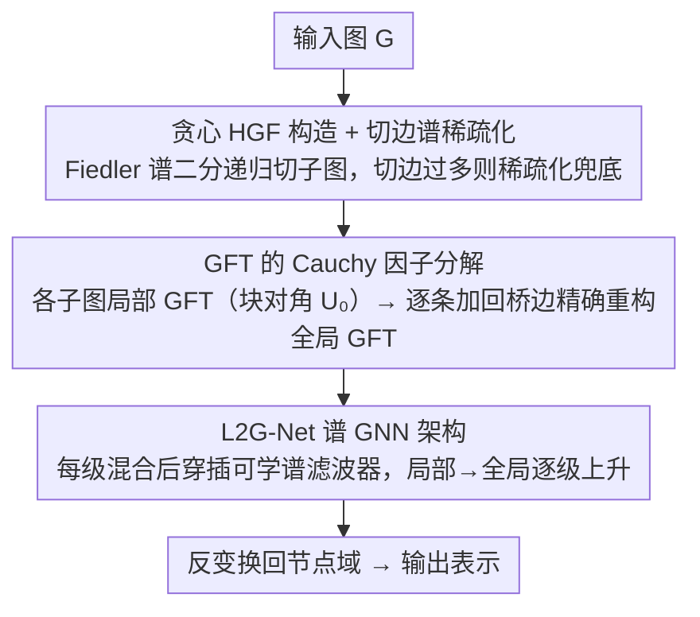

# L2G-Net: Local to Global Spectral Graph Neural Networks via Cauchy Factorizations

**会议**: ICML 2026  
**arXiv**: [2602.18837](https://arxiv.org/abs/2602.18837)  
**代码**: 待确认  
**领域**: 图学习 / 谱图神经网络  
**关键词**: 谱 GNN、图傅里叶变换、Cauchy 分解、层次化分块、长程依赖

## 一句话总结
作者把图傅里叶变换（GFT）的特征基**精确分解**成"每个子图的局部 GFT × 一串 Cauchy 矩阵"，将 $O(n^3)$ 的特征分解降到 $O(kn^2)$（$k$ 为子图间的切边数），并在分解里穿插可学谱滤波器，得到一族能在 569k 节点大图上跑通、参数比 Transformer 少几个数量级却性能相当的局部-到-全局谱 GNN。

## 研究背景与动机

**领域现状**：谱 GNN 通过把图信号投影到 Laplacian 特征基（即 GFT）来处理图，理论上能精确刻画全局频率结构。但实践中真正的 GFT-based GNN 很少被采用，主流是 ChebNet 这类多项式 Laplacian 滤波器和 MPNN（message passing），它们用 Laplacian 的稀疏乘法替代特征分解。

**现有痛点**：纯 GFT 方法有两个致命问题——计算特征分解需要 $O(n^3)$，几万节点就跑不动；GFT 域操作是**全局**的，改一个谱系数会影响所有节点，缺少顶点域的局部归纳偏置。多项式/MPNN 路线虽然便宜且有 $k$-hop 局部性，但只能靠多步消息传递近似长程依赖，会触发 oversquashing 和优化不稳。Graph Transformer 用 attention 做全局聚合，但参数巨大且丢失图结构可解释性。

**核心矛盾**：**全局谱表达力**与**局部计算/归纳偏置**之间在现有架构里是二选一——要全局表达就必须付 $O(n^3)$ 并失去局部性，要局部计算就必须放弃精确谱。

**本文目标**：找到一种**既保持精确 GFT、又能局部计算、且天然带局部偏置**的谱处理框架，并把它做成可堆叠的 GNN 层。

**切入角度**：作者从一个数学观察出发——往图里加一条边等价于 Laplacian 的一次秩一更新，而秩一更新前后的特征基之间**存在 Cauchy 矩阵形式的精确闭式关系**（Fasino 2023）。如果把整张图按层次划分成子图，再把跨子图的桥边一条条"加回去"，就能把全局 GFT 表达成"局部子图 GFT × 一串 Cauchy 因子"的精确乘积。

**核心 idea**：用 **Cauchy 因子分解**把 GFT 改写成"分块 GFT + 局部混合"的链式结构，并在每一级混合之间插可学谱滤波器，构成局部-到-全局的谱 GNN。

## 方法详解

### 整体框架
L2G-Net 想要的是一个既能做精确图傅里叶变换、又不用付 $O(n^3)$ 特征分解、还自带局部归纳偏置的谱处理框架。它的做法是把整张图层次化地切成子图，先对每个子图算便宜的局部 GFT，再把跨子图的桥边一条条"加回去"——每加一条边对应一次 Cauchy 因子乘法，串起来就精确等于全局 GFT；可学谱滤波器则穿插在每一级混合之间，于是同一套链式结构既是计算捷径，也是一个可堆叠的谱 GNN 层族。整个流程从不显式构造完整 GFT 矩阵 $U$。

### 关键设计

**1. GFT 的 Cauchy 因子分解：把 $O(n^3)$ 的全局变换改写成局部更新链**

纯 GFT 之所以不能用，是因为要拿到特征基 $U$ 必须做 $O(n^3)$ 的特征分解。作者的破局点来自一个经典数值线代事实（Proposition 2.1）：往图里加一条边 $(i,j)$ 等价于 Laplacian 的一次秩一更新 $\tilde L = L + w_{ij}(e_i-e_j)(e_i-e_j)^\top$，而更新前后的特征基之间存在精确闭式关系 $\tilde U^\top = D(\tilde\lambda, \lambda) U^\top$，其中 Cauchy 因子 $D$ 由解 secular equation 得到的新特征值 $\tilde\lambda$ 构造（即正交 Cauchy-like 矩阵 OCLM）。Theorem 3.1 把这件事推到层次化分块上：任意图 $G \in \mathcal{F}(L, \{G_i\}, k)$ 的 GFT 基都能精确写成

$$U^\top = D(\lambda, \tilde\lambda_{K-1}) \cdots D(\tilde\lambda_1, \tilde\lambda_0) U_0^\top,$$

其中 $U_0$ 是各子图局部 GFT 拼成的块对角阵，再按顺序加回全部 $K = k(2L-1)$ 条桥边，每次秩一更新贡献一个 Cauchy 因子。关键在于这些 Cauchy 因子本身是块对角的——每次加边只影响两个端点所在子图的谱分量，所以整条分解链能在 $O(kn^2)$ 内算完（Theorem 3.2，$k$ 为子图间最大切边数），而不是 $O(n^3)$。作者还把 Fasino 2023 的原始结论推广到允许重特征值和退化更新的一般情形（Definition 3.1 用 deflation 挑出有效子空间），这条分解是后续所有 GNN 设计的数学基石。

**2. 贪心 HGF 构造 + 切边谱稀疏化：让分解链尽量短，并给任意图兜底**

Theorem 3.2 的复杂度由切边数 $k$ 主导而非边数 $|E|$，因此整个方法的红利取决于"能不能切得均衡且切边少"。作者用基于 Fiedler 向量的谱二分生成候选划分，但不盲目递归：只有当切分确实更便宜、即 $n^2 k + \max_i f(G_i) < f(G)$（$f$ 是特征分解的理论代价）时才接受这一刀，否则把该子图直接标为叶子。问题是有些图天生切不出小桥边，这时分解链会爆长，所以作者给出 worst-case 兜底——对切边过多那一层的桥边子图单独做 Spielman-Srivastava 谱稀疏化（Theorem 4.1）：在保证 $(1-\varepsilon) x^\top L x \le x^\top L' x \le (1+\varepsilon) x^\top L x$ 的前提下，把切边数压到 $O(\varepsilon^{-2})$，构造只要 $O(|E| \log n)$。由于谱滤波器是 Lipschitz 的，稀疏化带来的层输出偏差仅 $O(\varepsilon)$，这就把 Cauchy 框架从"只对模块化图友好"推广到任意图，且误差可控。

**3. L2G-Net 谱 GNN 架构：把可学滤波器穿插进分解链，实现局部到全局的插值**

有了精确分解，作者把可学谱滤波器直接嵌进每一级混合，得到可堆叠、可加非线性与残差的谱 GNN 层。标准谱 GNN 第 $m$ 层对通道 $c$ 做的是 $X_{m+1,c} = U g_{\theta,c}(\lambda) U^\top Z_{m,c}$（$Z_m = X_m W_m$）；L2G-Net 把其中的前向变换 $U^\top$ 换成递归

$$H_p^{(r)} = g_{r,p}(\lambda_{r,p})\, D_{r,p}\, [H_{p_l}^{(r-1)}; H_{p_r}^{(r-1)}]^\top,$$

含义是每一级先用 Cauchy 因子 $D_{r,p}$ 把左右子图当前的谱表示混合，紧接着用该子图特征值上的可学滤波器 $g_{r,p}$ 处理，逐级上升到根级再用全图滤波器 $g_\theta(\lambda)$ 收一次，合成变换再沿分解反向走回节点域。划分和 Cauchy 因子完全由图 $G$ 决定，可学参数只出现在各级滤波器 $g_{r,p}$ 里，所以架构在训练前就被图结构固定。这样做的好处是表达力严格更强：标准全局滤波器 $g(L)$ 对所有节点用同一频响，而 L2G-Net 在不同子图用不同响应再混合，Theorem 5.1 证明它严格包含 $g(L)$ 类。这正对应图 2 展示的"局部-到-全局插值"——能量随 hop 距离衰减的形状由图结构本身决定，介于 ChebNet 的硬截断和 GFT 的全局扩散之间；相比 Graph Transformer，结构性归纳偏置直接编码进计算图，不再依赖位置编码，参数量自然降几个数量级。

### 损失函数 / 训练策略
按各 benchmark 的标准损失（节点分类用 cross-entropy/AUC、图回归用 MAE）。滤波器用 spline 参数化；异质图实验里所有特征通道和层共享同一个滤波器以最大化参数效率。预处理（HGF 划分 + Cauchy 因子计算）一次完成后被缓存，训练阶段不再重复。

## 实验关键数据

### 主实验

**异质图节点分类**（Platonov 2023 大规模异质 benchmark，Roman-empire 用 Acc、Tolokers/Minesweeper 用 AUC）：

| 数据集 | 指标 | L2G-Net | Polynormer (前 SOTA, attention) | St-ChebNet (前 SOTA, 谱) | Global GFT |
|--------|------|---------|---------|---------|---------|
| Roman-empire | Acc | 92.12 (1.1) | **92.55** (0.3) | 92.03 (0.9) | — |
| Amazon-ratings | Acc | 53.39 (0.6) | **54.81** (0.5) | 53.15 (0.2) | — |
| Minesweeper | AUC | **97.50** (0.3) | 97.46 (0.4) | 95.71 (2.3) | — |
| Tolokers | AUC | 85.57 (0.6) | **85.91** (0.7) | 85.55 (3.4) | — |

**长程超大图**（Liang 2025 City-Networks，$>10^5$ 节点，运行时间分钟）：

| 数据集 | ED (实测) | ED 外推 (cubic) | CF (本文) | 加速比 |
|--------|----------|----------|-----------|--------|
| Paris | OOM | 50,412 min | **17.91 min** | ~3000× |
| Shanghai | OOM | 121,932 min | **45.61 min** | ~2700× |
| LA | OOM | 131,544 min | **61.53 min** | ~2100× |
| London (569k) | OOM | 1,632,123 min | **144.22 min** | ~11000× |

### 消融 / 分析实验

**显存消耗（GB，64-bit）**：

| 配置 | Mines. | Tolok. | Am.Rat. | R.Emp. | Paris | London |
|------|--------|--------|---------|--------|-------|--------|
| Full GFT | 0.80 | 1.11 | 4.80 | 4.11 | 103.97 | **2588.22** |
| CF (ours) | 0.20 | 0.28 | 1.21 | 1.03 | 12.21 | **40.96** |
| 节省 | 4× | 4× | 4× | 4× | 8.5× | **63×** |

**因子分解 vs 特征分解**（Platonov 2023, 秒）：CF 在 R.Emp 上 232 s vs ED 731 s、Am.Rat 上 281 s vs 897 s，最坏情况 Tolokers（图非常稠密、稀疏化后切边仍多）也有 91 s vs 118 s。

**LRGB 长程归纳基准**（peptides-func AP↑ / peptides-struct MAE↓）：L2G-Net 72.14 / 0.2479（+PE 72.46 / 0.2462），与 GRIT (69.88 / 0.2460)、Graph ViT (69.42 / 0.2449)、MP-SSM (69.93 / 0.2458)、GMN (70.71 / 0.2473) 均在一个标准差内或超过。

### 关键发现
- **理论复杂度被实测精确证实**：在合成 BA 图上固定 $k=5$ 时 CF 严格走 $O(n^2)$，固定 $n=8000$ 时 CF 随 $k$ 线性增长；预处理（谱切 + 稀疏化）几乎与 $k$ 无关，是常数开销——这意味着"先稀疏化压切边、再分解"是可控的工程策略。
- **参数效率是真正的杀手锏**：图 5 显示 L2G-Net 用比 Polynormer 少几个数量级的可学参数就达到几乎相同的精度，所有数据集上稳定超过 Global GFT，说明局部偏置不是"妥协精度换效率"而是**真正有用的归纳偏置**。
- **可解释性副产物**：Grad-CAM 节点归因（图 6）显示 L2G-Net 把预测重要性集中在少数节点上，Global GFT 把重要性摊到全图，Polynormer 因 attention 学到额外结构反而最弥散；这印证了 L2G-Net 的局部偏置确实"看得见、对得上图几何"。
- **失败/边界场景**：Tolokers 这种本身极稠密、稀疏化后切边仍大的图，CF 相对 ED 的优势最小（91 vs 118 秒），暗示方法的红利来自图本身具有可分块的层次结构；Amazon-ratings 上比 Polynormer 还落后 1.4%，说明纯谱归纳偏置在某些异质模式下未必最优。

## 亮点与洞察
- **把"加一条边 = 秩一更新 = Cauchy 旋转"这件已知的数学事实，扩展到层次化分块上做成可堆叠 GNN 层**——这是一种很罕见的"用经典数值线代知识改造深度学习架构"的做法，思路本身就有教学价值。
- **架构由图决定、参数与图无关**这一点很优雅：不同图自动得到不同的层次化结构和不同的层数，参数量却保持极小且共享，这天然适合"一个模型在很多不同图上各跑各的"的设定。
- **谱稀疏化在这里的角色被重新定义**：传统语境里稀疏化是"近似图"，这里它是"在 Cauchy 分解链里截断更新数"的有界误差工具——这个视角可以迁移到任何"用秩一更新链表达全局算子"的场景（如低秩近似、Krylov 子空间方法）。
- 大图（569k 节点）能精确做"等价于全 GFT"的谱处理，把谱方法从"理论漂亮但不能用"硬生生拽进了"可以和 Transformer 比一比"的赛道。

## 局限与展望
- 方法的红利**强依赖于图本身存在层次/模块化结构**且切边小；对完全稠密或随机均匀连接的图，HGF 划分得不到好切边，必须靠稀疏化引入 $O(\varepsilon)$ 误差。
- 异质 benchmark 上对 attention-based 的 Polynormer 仍有小幅落差（Roman-empire 差 0.43%、Amazon-ratings 差 1.42%），说明纯谱表达在某些任务上不如学到的 attention 灵活；可以考虑把 attention 作为额外通道融合进 L2G-Net。
- 实验主要在 CPU（i9-9900K + RTX 2070）上做，Cauchy 因子的 GPU 高效核函数和并行调度（Theorem 3.2 已经给出并行复杂度上界 $T_m = O(kn^2 + \max_i f_i(n))$）尚未充分开发，工程上还有显著加速空间。
- 现阶段架构对图结构是静态的——若想做动态图/演化图，需要重新跑 HGF 划分；如何**增量更新 Cauchy 分解**（再加几条边对应再加几个 Cauchy 因子）是天然的延伸方向。

## 相关工作与启发
- **vs ChebNet / 多项式滤波**：ChebNet 用 $K$ 阶 Laplacian 多项式给出 $K$-hop 硬截断，本质是局部；L2G-Net 在局部之上能精确恢复全局 GFT，对长程依赖天然不需要堆深度，规避 oversquashing。
- **vs Global GFT**：纯 GFT 是 L2G-Net 在 $L=0$（不切分）时的特例，本文方法严格更广（Theorem 5.1），并在所有 benchmark 上都比 Global GFT 强，验证了"局部偏置不是损失而是收益"。
- **vs Polynormer / Graph Transformer**：Transformer 路线用 attention 学全局聚合，但参数巨大且需要位置编码；L2G-Net 用图结构本身编码归纳偏置，参数少几个数量级，且 Grad-CAM 表明结果更可解释。
- **vs Fernández-Menduiña 2025a**：该前作只对**路径图 Laplacian**给出 Cauchy 恒等式，本文把它推广到**任意对称矩阵 + 任意层次化分块**，并真正变成可训练 GNN。
- **vs MP-SSM / 状态空间 GNN**：两者都试图突破多项式滤波器的局部性，但 MP-SSM 是隐式连续时间动力系统；L2G-Net 给出**显式的精确分解**，谱表达和复杂度都可计算可控。

## 评分
- 新颖性: ⭐⭐⭐⭐⭐ 把秩一更新 + Cauchy 矩阵这一数值线代结果系统地扩展并改造成可堆叠 GNN 层族，思路在谱 GNN 圈里很少见。
- 实验充分度: ⭐⭐⭐⭐ 覆盖合成图（验证理论复杂度）、异质 benchmark、长程归纳、城市级超大图四类，但 GPU 工程优化和大规模消融（不同 $L$、不同 $\varepsilon$ 的细致曲线）相对欠缺。
- 写作质量: ⭐⭐⭐⭐ 数学叙述清晰，Theorem-Proof-Algorithm 结构完整，Figure 1/2 直观；少数地方（Definition 3.1 的 deflation 解释）需要回查附录。
- 价值: ⭐⭐⭐⭐⭐ 把"精确谱 GNN"从 $O(n^3)$ 拽进 $O(kn^2)$ 并真正跑通 569k 节点图，给"谱方法到底还有没有用"这个开放问题一个有力的正面回答。

<!-- RELATED:START -->

## 相关论文

- [\[ICML 2026\] Quantile-Free Uncertainty Quantification in Graph Neural Networks](quantile-free_uncertainty_quantification_in_graph_neural_networks.md)
- [\[AAAI 2026\] Sheaf Graph Neural Networks via PAC-Bayes Spectral Optimization](../../AAAI2026/graph_learning/sheaf_graph_neural_networks_via_pac-bayes_spectral_optimization.md)
- [\[NeurIPS 2025\] DuetGraph: Coarse-to-Fine Knowledge Graph Reasoning with Dual-Pathway Global-Local Fusion](../../NeurIPS2025/graph_learning/duetgraph_coarse-to-fine_knowledge_graph_reasoning_with_dual-pathway_global-loca.md)
- [\[ICML 2026\] Polynomial Neural Sheaf Diffusion: A Spectral Filtering Approach on Cellular Sheaves](polynomial_neural_sheaf_diffusion_a_spectral_filtering_approach_on_cellular_shea.md)
- [\[ICML 2025\] Hyperbolic-PDE GNN: Spectral Graph Neural Networks in the Perspective of A System of Hyperbolic Partial Differential Equations](../../ICML2025/graph_learning/hyperbolic-pde_gnn_spectral_graph_neural_networks_in_the_perspective_of_a_system.md)

<!-- RELATED:END -->
