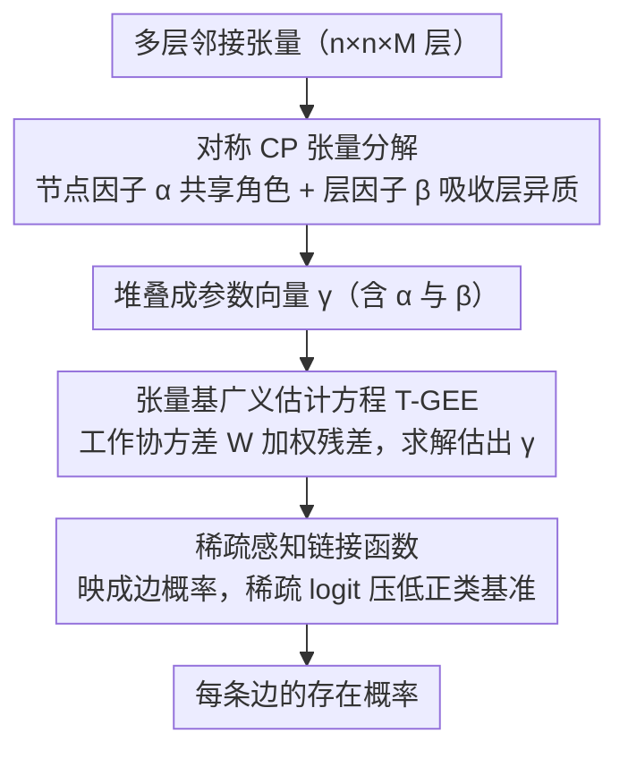

# T-GINEE: A Tensor-Based Multilayer Graph Representation Learning

**会议**: ICML 2026  
**arXiv**: [2605.28300](https://arxiv.org/abs/2605.28300)  
**代码**: 待确认  
**领域**: 图学习 / 表示学习  
**关键词**: 多层图, 张量分解, 广义估计方程, 跨层依赖

## 一句话总结
T-GINEE 结合 **CP 张量分解**与**广义估计方程（GEE）**显式建模多层网络中的**跨层依赖关系**——具有理论保证和优异的可扩展性，在百万级节点图（DBLP、Stack Overflow）上突破其他张量方法 OOM 的限制。

## 研究背景与动机

**领域现状**：现实世界中大量存在多层网络（社交网络中朋友 / 同事 / 家庭多种关系；生物网络中蛋白质共表达 / 物理交互）。这类系统需要通过学习低维向量表示来捕捉跨层复杂关系。

**现有痛点**：传统图嵌入方法（GNN、矩阵分解）在多层设置时大多**独立处理各层**（忽视层间关联）或使用**简单聚合策略**（信息损失）——缺乏严格的理论基础来刻画嵌入应如何编码层间的细微相互影响。

**核心矛盾**：当前多层图学习缺乏系统性的理论框架来**显式建模跨层残差依赖**。

**本文目标**：为多层图学习设计一个兼具理论保证与计算高效的统计框架。

**切入角度**：生物统计中的**GEE 框架**能原则性地建模相关数据；**CP 张量分解**可优雅地表示多层图结构——二者结合可显式捕捉层间协方差。

**核心 idea**：用 **CP 张量分解参数化多层图参数张量**，并通过**张量基 GEE 框架**联合建模层内与跨层依赖。

## 方法详解

### 整体框架
T-GINEE 要解决的是多层网络里"各层既各有脾气、又彼此牵连"的建模难题。它把整个多层图的参数张量用一个对称 CP 分解写成"节点嵌入 + 层嵌入"的低秩形式，再借生物统计里的广义估计方程（GEE）把参数估计变成一个带工作协方差加权的拟合问题，让相关的层之间互相借力，最后通过链接函数把参数张量映成每条边的存在概率。

### 关键设计

**1. 对称 CP 张量分解：用低秩因子同时刻画"共同角色"与"层异质性"**

参数张量 $\Theta$（$n \times n \times M$，$M$ 为层数）若逐元素自由估计，参数量是 $O(n^2 M)$，在百万节点图上根本存不下。本文把它写成对称 CP 形式 $\Theta = \sum_{r=1}^R \alpha^{(r)} \circ \alpha^{(r)} \circ \beta^{(r)}$：两个节点模态共用同一组节点因子 $\alpha$，自然满足无向图的对称性，且这组共享的 $\alpha$ 跨所有层编码了节点在不同关系类型中的**共同角色**；而层特定因子 $\beta$ 则负责吸收各层的异质性。这样参数总数从 $O(n^2 M)$ 压到 $O((n+M)R)$。这一分解之所以站得住，是因为现实中实体往往只靠少数潜在特征在多种关系里交互，CP 的低秩结构既抓住了这种稀疏性，又保留了可解释的因子。

**2. 张量基广义估计方程（T-GEE）：用工作协方差把跨层相关性吃进估计**

直接拿无权最小二乘去拟合各层的边，会默认所有边相互独立，从而忽视层间相关、得到低效的参数估计。T-GINEE 改用 GEE 范式：它不假设响应的完整分布，只指定**均值与协方差这前两阶矩**，再用一个**工作协方差矩阵** $\Sigma^w_{i,j} = \Gamma^{1/2}_{i,j}\, W\, \Gamma^{1/2}_{i,j}$ 去加权残差，把跨层相关性显式写进目标函数，最终通过求解估计方程 $s(\gamma)=\mathbf{0}$（等价于最小化加权残差平方和）估出参数向量 $\gamma$。其中共享相关矩阵 $W$ 并非预先给定，而是从全体边的**残差池**中估计出来——这一"工作"协方差的设定允许相关结构被部分误设而不致命，既让彼此相关的层在估计时互相支援、更高效地利用共变异信息，又保证了实践中的鲁棒性。

**3. 稀疏感知链接函数：契合真实网络"绝大多数边不存在"的极端稀疏**

估出参数后，链接函数 $g^{-1}$ 负责把参数张量映成每条边的边缘概率 $\mathcal{P}$，可灵活取 logit、probit，或针对稀疏网络的稀疏感知 logit $g^{-1}(x) = \frac{s}{1 + e^{-x}}$。后者引入系数 $s \in (0,1)$ 压低正类基准概率：真实网络通常极稀疏，标准 logit 在稀疏区域容易梯度爆炸，而稀疏感知设计天然契合"绝大多数边不存在"的观测分布，让框架在稀疏图上既稳定又准确。

## 实验关键数据

### 主实验

| 方法 | CP | Tucker | NMF | SVD | LSE | MASE | NNTUCK | SPECK | HOSVD | **T-GINEE** |
|------|-----|--------|-----|-----|-----|------|--------|-------|--------|----------|
| 合成网络 AUC | 0.449 | 0.529 | 0.722 | 0.813 | 0.223 | 0.382 | 0.611 | 0.760 | 0.850 | **0.940** |

T-GINEE 远超第二名 HOSVD（0.8503）；基础 CP 分解与 T-GINEE 的巨大差距（0.4488 → 0.9395）量化了统计正则化框架的效益。

### 真实数据对比

| 方法 | AUCS | Krackhardt | WAT | Yeast | DBLP（百万节点） | Stack Overflow（百万节点） |
|------|--------|----------|-----|-------|--------|-------------|
| HOSVD | 0.897 | 0.783 | 0.820 | 0.902 | OOM | OOM |
| SVD | 0.877 | 0.932 | 0.719 | 0.879 | 0.6093 | 0.9682 |
| **T-GINEE** | **0.920** | **0.948** | **0.838** | **0.921** | 0.6478 | **0.9831** |

CP、Tucker、HOSVD 在 DBLP 与 Stack Overflow 上均因内存溢出失败，T-GINEE 成功处理百万级节点图。

### 消融与新层泛化
- **异构合成实验**：在低过度决定比下学到的协方差矩阵 $W$ 正确恢复层间相似性顺序。
- **新层泛化**（表 4）：在 DBLP-5K 上零样本迁移——训练前四层，无训练数据下预测第五层边，T-GINEE AUC 0.7733 超越即使在第五层重训的 MGCN 与 MR-GCN。

## 亮点与洞察
- **原则性跨层建模**：首次将 GEE 框架（生物统计标准工具）与张量分解无缝结合，赋予多层图学习严格的统计基础。
- **双重理论保证**：Theorem 3.1 证明 $\sqrt{N}$ 一致性收敛；Theorem 3.2 建立渐近正态性。
- **突破性可扩展性**：稀疏张量实现 + mini-batch 采样使算法从 $O(n^2 M)$ 降至 $O(R |E|)$，在百万节点图上保持竞争力。
- **层间知识迁移**：学到的 $\alpha$ 与 $\beta$ 分解自然支持**零样本跨层泛化**。

## 局限与展望
- 理论分析（Theorem 3.2）要求过度决定条件，限制了渐近正态性在极稀疏情况的适用。
- 秩 $R$ 与稀疏系数 $s$ 的最优选择缺乏数据驱动方法。
- 层非均质性：假设层间共享完整的节点嵌入 $\alpha$，对完全异质的关系类型可能过强。
- 改进：引入分层或软共享机制；开发可证的 mini-batch 理论；设计自适应秩与稀疏系数选择。

## 相关工作与启发
- **vs 传统张量分解（CP/Tucker）**：传统方法无协方差建模假设各边独立；T-GINEE 显式学习工作协方差。
- **vs 多层 GNN（MGCN/MR-GCN）**：GNN 基于图卷积的局部邻域聚合；T-GINEE 采全局张量视角与统计推理。
- **启发**：GEE 范式与张量分解的结合可推广至其他多元数据场景。

## 评分
- 新颖性: ⭐⭐⭐⭐⭐  GEE 与张量分解的首次结合为多层图引入新理论范式。
- 实验充分度: ⭐⭐⭐⭐⭐  合成 + 真实数据 + 小规模基准 + 百万级图 + 多任务全面 GNN 对标。
- 写作质量: ⭐⭐⭐⭐⭐  动机层次清晰，方法表述严谨，实验结论明确。
- 价值: ⭐⭐⭐⭐⭐  突破多层图学习的理论空白，统计框架与可扩展设计并进。

<!-- RELATED:START -->

## 相关论文

- [\[ICML 2026\] Generative Representation Learning on Hyper-relational Knowledge Graphs via Masked Discrete Diffusion](generative_representation_learning_on_hyper-relational_knowledge_graphs_via_mask.md)
- [\[ICML 2026\] Unsat Core Prediction through Polarity-Aware Representation Learning over Clause-Literal Hypergraphs](unsat_core_prediction_through_polarity-aware_representation_learning_over_clause.md)
- [\[AAAI 2026\] UniHR: Hierarchical Representation Learning for Unified Knowledge Graph Link Prediction](../../AAAI2026/graph_learning/unihr_hierarchical_representation_learning_for_unified_knowledge_graph_link_pred.md)
- [\[ICML 2025\] Banyan: Improved Representation Learning with Explicit Structure](../../ICML2025/graph_learning/banyan_improved_representation_learning_with_explicit_structure.md)
- [\[AAAI 2026\] Feature-Centric Unsupervised Node Representation Learning Without Homophily Assumption](../../AAAI2026/graph_learning/feature-centric_unsupervised_node_representation_learning_without_homophily_assu.md)

<!-- RELATED:END -->
