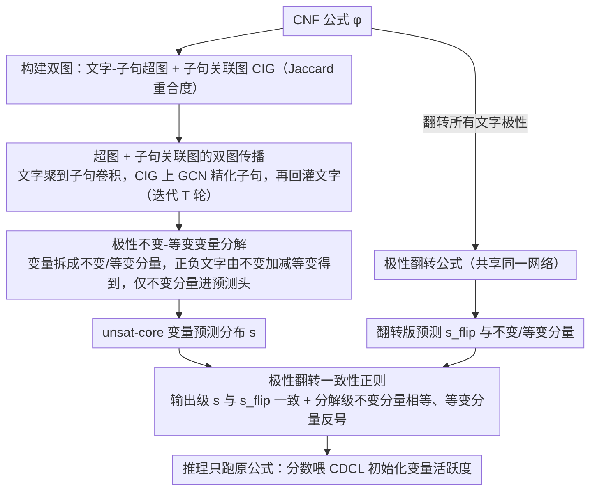

# Unsat Core Prediction through Polarity-Aware Representation Learning over Clause-Literal Hypergraphs

**会议**: ICML 2026  
**arXiv**: [2605.04819](https://arxiv.org/abs/2605.04819)  
**代码**: 无  
**领域**: 图学习 / 神经符号推理 / SAT 求解  
**关键词**: SAT、unsat core、超图神经网络、极性不变–等变分解、一致性正则

## 一句话总结
本文把 CNF 公式建模成「子句–文字超图 + 子句关联图」，并在变量级把表示拆成极性不变与极性等变两部分，再用极性翻转一致性正则训练，把 unsat-core 变量预测精度显著拉高一档。

## 研究背景与动机
**领域现状**：基于 GNN 的 SAT 学习器（NeuroCore、NeuroSAT、SATformer 等）通常把 CNF 公式编码成二部图或有向无环图，节点是文字/变量和子句，边连接「文字出现在子句里」这种二元关系，然后学一个 embedding 用来预测变量是否属于 unsat core、是否是 backbone，或者直接给 CDCL 求解器灌注变量活跃度先验。

**现有痛点**：作者指出两类系统性的局限。第一类是「结构表达力不足」：二部图只能编码成对关系，而真实子句往往含多个文字、子句之间也通过共享变量产生高阶耦合，二部图只能靠堆很深的 GNN 间接捕捉，伴随过平滑。第二类是「极性建模缺失」：每个变量 $v_i$ 都有一对极性相反的互补文字 $l_i, \neg l_i$，现有方法要么把两者当独立节点 + MLP 聚合，要么在互补文字间加一条边，但都没有显式约束「同源信息共享」+「极性翻转下表示反号」这两条 SAT 内禀性质。

**核心矛盾**：表达力（需要高阶 + 极性感知）与 inductive bias（现有图结构只表达二元关系，且对变量的代数对称性视而不见）之间的矛盾。绕过这个矛盾要么靠更深的网络换更糟的过平滑，要么靠人工启发式加边/标签，难以系统化。

**本文目标**：(i) 找到一种结构原生承载多文字子句和多子句相互作用的图表示；(ii) 在变量级显式建模「极性不变」与「极性翻转」两种性质；(iii) 用一种「免标签」的对偶视图正则把极性约束注入训练。

**切入角度**：作者从两条数学观察出发——每个 CNF 公式翻转所有文字极性后，其可满足性、unsat-core 变量集都不变（性质 1）；而变量赋值会被整体翻转（性质 2）。这意味着 unsat-core 预测任务对极性翻转是「不变的」，恰好可以作为自监督训练信号。

**核心 idea**：把 CNF 建成「文字为节点、子句为超边」的超图 + 一个子句–子句关联图做高阶传递；把变量表示做「不变 + 等变」分解后再拼成正/负文字 embedding，并通过对原公式和极性翻转公式共享参数 + 一致性损失，强行让模型学到极性对称性。

## 方法详解

### 整体框架
paSAT 要解决的核心问题是：怎么让一个 GNN 既能捕捉子句的高阶结构、又能尊重 SAT 公式天生的极性对称性，从而更准地预测哪些变量属于 unsat core。它的做法是把 CNF 公式同时摆进两张图——一张「文字–子句超图」承载多文字子句这种高阶包含关系，一张「子句关联图」承载子句之间共享变量的二元耦合——再在变量级把表示代数地拆成「极性翻转下不变」和「极性翻转下反号」两部分，最后用同一公式的极性翻转版本作为免标签的对偶视图来约束训练。

具体地，给定 CNF 公式 $\phi$，先转成超图 $\mathcal{H}=(\mathcal{V}_H,\mathcal{E}_H)$：节点 $u_i$ 对应文字 $l_i$，超边 $e_j$ 对应子句 $c_j$，关联矩阵 $\mathbf{H}\in\mathbb{R}^{2N\times M}$ 满足 $\mathbf{H}_{ij}=1$ 当且仅当 $l_i\in c_j$；再额外构造子句关联图 $\mathcal{G}_C$，节点是子句、边权 $w^C_{ij}=|\mathcal{L}(c_i)\cap \mathcal{L}(c_j)|/|\mathcal{L}(c_i)\cup \mathcal{L}(c_j)|$ 用 Jaccard 度量子句重合度。训练时同时跑原公式 $\phi$ 与极性翻转公式 $\phi^{(flip)}$ 两条共享参数的管线，分别得到变量预测分布 $\mathbf{s},\mathbf{s}^{(flip)}$，再用三项损失（任务损失 + 输出一致性 + 分解一致性）联合优化；推理时只跑原公式，把分数喂给 CDCL 求解器做变量活跃度初始化（NeuroCore 风格，但只跑一次而非周期性重跑，省 GPU）。

### 关键设计

**1. 超图 + 子句关联图的双图传播：让子句之间直接对话**

纯超图有个隐患：子句要影响彼此，只能绕道「共享同一个文字」间接传递，而 unsat core 恰恰是「多个子句联合冲突」的产物，这种高阶依赖靠堆深层 GNN 间接学既慢又容易过平滑。paSAT 因此显式建一张「谁和谁共享文字」的子句关联图，等于给模型开一条专门学习子句级相互制约的捷径。每一轮 $t$ 的传播分三步走：先做超图卷积 $\mathbf{M}^{(t)}_H=\mathbf{D}^{-1}\mathbf{H}\mathbf{B}^{-1}\mathbf{H}^\top \mathbf{L}^{(t)}\mathbf{W}^{(t)}$ 把文字聚到子句再传回；再在子句侧取 $\mathbf{C}^{(t)}=\mathbf{B}^{-1}\mathbf{H}^\top \mathbf{L}^{(t)}\mathbf{W}^{(t)}$ 喂进 GCN $\Delta\mathbf{C}^{(t)}=\mathbf{D}_C^{-1/2}\mathbf{A}_C\mathbf{D}_C^{-1/2}\mathbf{C}^{(t)}\mathbf{U}$ 并残差更新 $\mathbf{C}'^{(t)}=\mathbf{C}^{(t)}+\alpha\sigma(\Delta\mathbf{C}^{(t)})$；最后把精化后的子句信息回灌到文字 $\mathbf{M}^{(t)}=\mathbf{D}^{-1}\mathbf{H}\mathbf{C}'^{(t)}$，并通过 $\mathbf{L}^{(t+1)}=f_{\mathrm{update}}(\mathbf{L}^{(t)},\mathbf{M}^{(t)},\bar{\mathbf{L}}^{(t)})$ 聚合互补文字 $\bar{\mathbf{L}}^{(t)}$。这样子句既保留了高阶包含语义，又能在自己那张图里直接交换「制约信号」。

**2. 极性不变–等变变量分解：把代数对称写进网络结构**

每个变量 $v_i$ 都有一对互补文字 $l_i,\neg l_i$，传统做法把它们当独立节点拼接 + MLP 聚合，会把「同源信息共享」和「极性翻转反号」这两条内禀性质糊成一团。paSAT 改用代数分解：变量表示 $\mathbf{v}_i^{(t)}\in\mathbb{R}^{2d}$ 被拆成不变分量 $\mathbf{v}_{i,\mathrm{inv}}^{(t)}$ 与等变分量 $\mathbf{v}_{i,\mathrm{eq}}^{(t)}$，正/负文字由线性加减得到 $\mathbf{l}_{x_i}^{(t)}=\mathbf{v}_{i,\mathrm{inv}}^{(t)}+\mathbf{v}_{i,\mathrm{eq}}^{(t)}$、$\mathbf{l}_{\neg x_i}^{(t)}=\mathbf{v}_{i,\mathrm{inv}}^{(t)}-\mathbf{v}_{i,\mathrm{eq}}^{(t)}$；超图传播后再用 $\mathbf{v}_{\mathrm{inv},i}^{(t+1)}=\tfrac{1}{2}(\mathbf{L}_{2i}+\mathbf{L}_{2i+1})$、$\mathbf{v}_{\mathrm{eq},i}^{(t+1)}=\tfrac{1}{2}(\mathbf{L}_{2i}-\mathbf{L}_{2i+1})$ 反推回不变/等变并经两个 MLP 重组，最终只用不变分量经线性头预测 unsat-core 概率 $\mathbf{s}=g(f'_{\mathrm{inv}}(\mathbf{V}_{\mathrm{inv}}^{(T)}))$。这一招之所以有效，是因为 unsat-core 标签本身是个对极性翻转不变的「结构属性」，预测头只看不变分量天经地义；而线性的「+/-」组合让「翻转极性」恰好成为文字 embedding 上的群作用，于是对称性由网络架构而非损失来承担。

**3. 极性翻转一致性正则：用对偶视图免标签灌进对称性**

光有架构上的「+/-」组合并不保险——模型完全可以把所有信息都塞进等变分量，让两个分量名不副实。为此 paSAT 对每个 $\phi$ 额外构造极性翻转公式 $\phi^{(flip)}$（翻转所有文字符号但保留结构），两条公式共享网络得到 $\mathbf{s},\mathbf{s}^{(flip)}$，再加两道一致性约束：输出级 $\mathcal{L}_{\mathrm{cons}}=\tfrac{1}{|\mathcal{V}|}\|\mathbf{s}-\mathbf{s}^{(flip)}\|_2^2$ 强迫两版预测相同；分解级 $\mathcal{L}_{\mathrm{decomp}}=\tfrac{1}{|\mathcal{V}|}\sum_i\bigl[\|\mathbf{V}_{i,\mathrm{inv}}^{(T)}-\mathbf{V}_{i,\mathrm{inv}}^{(T)(flip)}\|_2^2 + \|\mathbf{V}_{i,\mathrm{eq}}^{(T)}+\mathbf{V}_{i,\mathrm{eq}}^{(T)(flip)}\|_2^2\bigr]$ 把「不变分量该相等、等变分量该反号」这两条数学定义直接搬进 loss，强制信息按语义分流。由于 $\phi^{(flip)}$ 不需要任何额外人工标注，整套对称性约束本质上是免标签的自监督，跟对比学习里的等变增强同源。

### 损失函数 / 训练策略
总损失 $\mathcal{L}=\mathcal{L}_{\mathrm{core}}+\lambda_{\mathrm{cons}}\mathcal{L}_{\mathrm{cons}}+\lambda_{\mathrm{decomp}}\mathcal{L}_{\mathrm{decomp}}$。$\mathcal{L}_{\mathrm{core}}$ 沿用 NeuroCore 的 KL 散度形式 $D_{\mathrm{KL}}(\mathbf{p}^*\|\mathbf{p})$，目标分布把 unsat-core 变量上均匀分配概率、其他为 0。整网端到端训练，与 CDCL 集成时只在求解开始前跑一次神经网络，把预测分数作为变量活跃度，求解过程中周期性按固定分数复位活跃度，但不重复推理。

## 实验关键数据

### 主实验
在 SR（随机 3-SAT）、CA（社区结构）、PS（pigeonhole 风格）三个数据集上按 Easy/Medium/Hard 难度评估 Precision、PR-AUC、ROC-AUC。

| 数据集 | 指标 | GCN | NeuroCore | SATFormer | paSAT |
|--------|------|------|-----------|-----------|-------|
| SR (Avg) | PR-AUC | 0.915 | 0.938 | 0.920 | **0.963** |
| SR (Avg) | ROC-AUC | 0.732 | 0.805 | 0.741 | **0.872** |
| CA (Avg) | PR-AUC | 0.215 | 0.333 | 0.246 | **明显更高** |
| CA (Avg) | ROC-AUC | 0.518 | 0.605 | 0.527 | **明显更高** |

在最具挑战的 CA 数据集（社区结构稀疏、unsat-core 占比小、类别极不平衡），paSAT 相对 NeuroCore 在 PR-AUC 与 ROC-AUC 上都有显著提升，说明高阶 + 极性建模在结构复杂场景下增益更大；SR 上的 ROC-AUC 提升 6–9 个点也表明分类排序质量更稳。

### 消融实验

| 配置 | 关键指标 | 说明 |
|------|---------|------|
| Full paSAT | 最优 | 超图 + CIG + 极性分解 + 极性翻转一致性 |
| w/o CIG | 掉点 | 没有子句–子句关联图，高阶子句依赖只能间接学 |
| w/o 极性分解 | 掉点 | 退化成「正负文字拼接 + MLP」聚合，丢掉代数对称 |
| w/o $\mathcal{L}_{\mathrm{decomp}}$ | 掉点 | 分解架构在，但无显式监督使其真的承担不变/等变语义 |
| w/o $\mathcal{L}_{\mathrm{cons}}$ | 掉点 | 缺输出级对偶视图监督 |

### 关键发现
- 子句关联图在结构复杂的 CA 数据集上贡献最大，说明显式建模子句–子句依赖是高阶问题的关键瓶颈。
- 仅有架构上的不变/等变分解不够，必须配合分解级一致性损失才能真正学到对称语义，否则两个分量会被网络「合谋糊一起」。
- 与 CDCL 集成时把神经网络从「周期性调用」改为「一次性初始化」，几乎不掉点却大幅节省 GPU 时间，说明 paSAT 的预测信号本身就足以做出强力先验。

## 亮点与洞察
- 把 SAT 公式的代数对称性翻译成「架构 + 损失」双重约束，是一种很优雅的 inductive bias 注入：架构上用 +/- 让翻转操作成为群作用，损失上用分解级 MSE 防止信息坍缩，两件事互为表里。
- 极性翻转构造对偶视图作为「免标签自监督」，思路与对比学习里的「等变增强」非常像，可以迁移到任何带有显式群对称性的图任务（如分子图的镜像翻转、电路图的电压翻转）。
- 「超图 + 关联图」的双图结构提醒我们：当一个对象既参与高阶（子句包含多文字）又有自身二元关系（子句共享变量）时，硬塞进同一张图反而会让消息传递目标混淆，拆成两张图各司其职更干净。

## 局限与展望
- 实验只在 unsat-core 这一种任务上验证；极性翻转一致性是否对「backbone 预测、模型计数、guidance for branching heuristic」等任务一样有效仍待证明。
- 子句关联图边数为 $O(M^2)$，在工业级百万子句实例上是否能 scale 需要进一步工程化（稀疏化、采样）。
- 与 CDCL 的集成只做了「初始化活跃度」这一最弱耦合，没有探索周期性 re-call 神经网络或在 search tree 中动态使用 paSAT 的潜力，求解时间提升受限。
- 极性翻转后 $\phi^{(flip)}$ 的可满足性不变是性质 1 用上的，但「赋值翻转」性质 2 文中提了 NeuroBack 已用，但 paSAT 自身只在 unsat-core 这种「赋值无关」任务上展开，对 backbone 这种「赋值相关」任务怎么改造损失（应该用反号约束）值得后续工作。

## 相关工作与启发
- **vs NeuroCore (Selsam & Bjørner 2019)**：本文沿用 NeuroCore 的 KL 训练目标与 CDCL 集成范式，但把图结构从二部图换成超图 + CIG，并显式建模极性。NeuroCore 的极性靠 LSTM-style 互补文字消息传递隐式学，paSAT 通过架构对称性 + 损失把约束硬编码，因此样本效率应该更高。
- **vs SATFormer**：SATFormer 用 Transformer 在文字-子句间做全局注意力，理论上能捕捉任意阶交互，但本文在 SR、CA 上都大幅超过 SATFormer，说明 inductive bias（特别是极性对称）比纯架构容量更重要。
- **vs NeuroBack (Wang et al. 2024)**：NeuroBack 也用极性翻转构造对偶公式来训练 backbone 预测器，但只在输出级监督；paSAT 把对偶视图扩展到「分解级一致性」并引入超图结构，是一次更系统化的对称性建模。
- **vs HGNN 通用超图工作**：本文的超图卷积形式 $\mathbf{D}^{-1}\mathbf{H}\mathbf{B}^{-1}\mathbf{H}^\top$ 是 (Bai et al. 2021) 的标准形式，创新主要在「领域知识 + 任务对称」的组合上，提示通用 GNN 想在结构化推理任务上突破，必须深挖任务自身的代数结构。

## 评分
- 新颖性: ⭐⭐⭐⭐ 极性不变–等变分解 + 极性翻转对偶视图是把 SAT 代数对称性「翻译」进神经网络的一次清晰示范，超图 + CIG 双图结构对子句间高阶关系建模也较有原创性。
- 实验充分度: ⭐⭐⭐⭐ 在 SR/CA/PS 三个不同分布的数据集 × 三个难度 × 三项指标上系统比较，并做了完整的模块/损失消融，但缺少与 CDCL 集成后的端到端求解时间对比。
- 写作质量: ⭐⭐⭐⭐ 公式推导严谨，性质 1/性质 2 的表述把 motivation 写得很硬核；图 1 的 pipeline 视图也直观，唯一缺点是部分章节略偏数学化、缺少求解器侧的直观例子。
- 价值: ⭐⭐⭐⭐ 对 SAT × GNN 这条小而硬核的研究线推进一步，方法可迁移到其他带群对称性的结构化预测任务，但短期内被工业级 SAT 求解器采用门槛较高。

<!-- RELATED:START -->

## 相关论文

- [\[ICML 2026\] T-GINEE: A Tensor-Based Multilayer Graph Representation Learning](t-ginee_a_tensor-based_multilayer_graph_representation_learning.md)
- [\[AAAI 2026\] UniHR: Hierarchical Representation Learning for Unified Knowledge Graph Link Prediction](../../AAAI2026/graph_learning/unihr_hierarchical_representation_learning_for_unified_knowledge_graph_link_pred.md)
- [\[ICML 2026\] Generative Representation Learning on Hyper-relational Knowledge Graphs via Masked Discrete Diffusion](generative_representation_learning_on_hyper-relational_knowledge_graphs_via_mask.md)
- [\[AAAI 2026\] Feature-Centric Unsupervised Node Representation Learning Without Homophily Assumption](../../AAAI2026/graph_learning/feature-centric_unsupervised_node_representation_learning_without_homophily_assu.md)
- [\[ICML 2025\] Banyan: Improved Representation Learning with Explicit Structure](../../ICML2025/graph_learning/banyan_improved_representation_learning_with_explicit_structure.md)

<!-- RELATED:END -->
