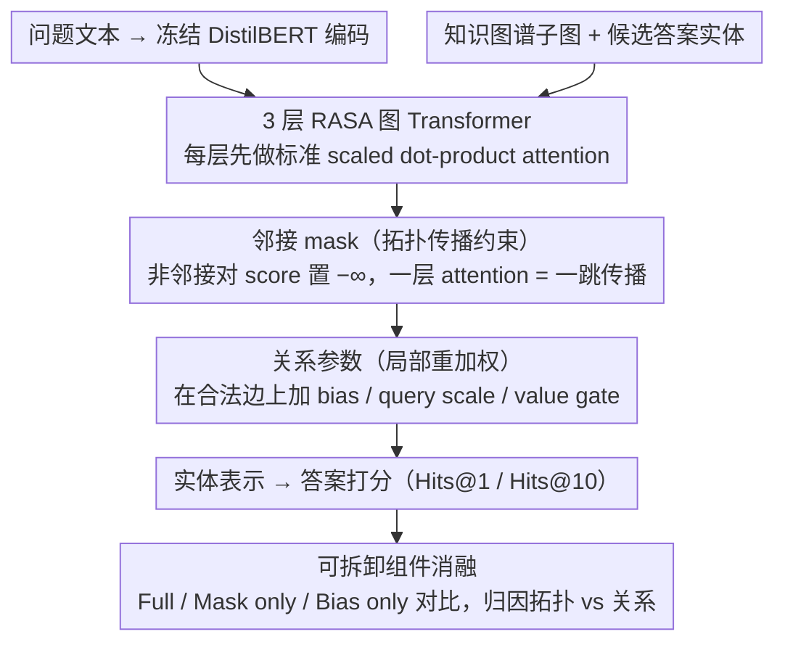

# What Structural Inductive Bias Helps Transformers Reason Over Knowledge Graphs? A Study with Tabula RASA

**会议**: ICML2026  
**arXiv**: [2602.02834](https://arxiv.org/abs/2602.02834)  
**代码**: 无公开代码  
**领域**: 图学习 / 知识图谱推理  
**关键词**: 知识图谱问答, 图 Transformer, 稀疏注意力, 结构归纳偏置, 多跳推理  

## 一句话总结
这篇论文用一个可拆卸的最小图 Transformer 变体 RASA 做控制实验，发现知识图谱多跳问答中最有用的结构归纳偏置主要是邻接 mask 带来的拓扑约束，而不是关系类型 bias、query scaling 或 value gating 这类可学习关系参数。

## 研究背景与动机
**领域现状**：知识图谱问答要求模型沿着实体和关系链做多跳推理，常见方案包括 R-GCN/GAT 这类图神经网络、Graphormer 等结构化 Transformer，以及把子图检索交给 LLM 的 KG+LLM 管线。图 Transformer 方向通常会把中心性编码、最短路编码、边类型编码、稀疏 attention 等多个结构信号打包在一起，最后报告一个整体性能。

**现有痛点**：这些方法虽然有效，但很难回答“到底是哪一种结构信息真正起作用”。如果一个模型同时用了邻接 mask、边类型 embedding、位置编码和关系权重，性能提升可能来自更小的搜索空间，也可能来自关系类型语义，还可能只是额外参数或调参带来的收益。对于知识图谱多跳推理，这个归因问题尤其重要，因为模型失败时常常不是不知道实体，而是不知道应该沿哪条图路径传播信息。

**核心矛盾**：Transformer 的全局注意力看似可以让任意节点直接交互，但多跳可达性本质上需要一层一跳地组合路径。关系参数只能给已有 attention score 加权或缩放，不能保证信息只沿图边流动；邻接 mask 则直接把注意力空间限制在真实邻居上。本文要验证的矛盾是：KGQA 中有用的偏置究竟是“知道边的类型”，还是“先知道只能沿边走”。

**本文目标**：作者不追求新的 SOTA 系统，而是构造一个可以拆开组件的实验装置，分别测量拓扑 mask 与可学习关系参数的贡献；同时在 MetaQA、WebQSP、CWQ 和 held-out relation 设置中检查这种贡献是否稳定。

**切入角度**：论文从一个简单深度论证出发：如果每层 attention 最多把一个节点的表示扩展到一跳邻居，那么 $k$-hop 推理至少需要 $k$ 层有效传播。邻接 mask 恰好显式实现“一层一跳”，而关系 bias、scale、gate 只能在 dense attention 中重新调权，未必能学出正确传播路径。

**核心 idea**：用 RASA 把“拓扑约束”和“关系重加权”拆成可独立开关的组件，证明多跳 KGQA 的主要收益来自邻接 mask 这个拓扑归纳偏置。

## 方法详解
论文的方法部分可以理解为两层：第一层是理论和直觉，说明为什么多跳知识图谱推理需要按图结构逐跳传播；第二层是 RASA 这个实验载体，用极少的改动把四类结构信号暴露为可消融组件。RASA 本身不是作者要卖的新架构，而是一个“显微镜”，用来观察不同结构信号在同一 Transformer 框架下各自贡献多少。

### 整体框架
输入是一张知识图谱子图、问题文本和候选答案实体。问题侧用冻结的 DistilBERT 编码，图侧在实体节点之间运行一个 3 层、hidden size 128、4 头的 RASA Transformer。每层 attention 在标准 scaled dot-product attention 基础上读取边连接和边类型：如果两个节点在图中相连或是自环，就允许它们 attention；否则对应 score 被置为 $-\infty$。在允许的边上，模型还可以使用关系类型 bias、关系特定 query scale 和 value gate 来微调不同关系的影响。最后模型基于实体表示做答案打分，用 Hits@1/Hits@10 评估。

实验设计上，作者固定同一个编码器、同一套 answer scoring 和近似相同的调参预算，然后比较 Vanilla Transformer、Graphormer、R-GCN、GAT、RASA 以及 RASA 的组件消融。关键对比不是"RASA 是否超过所有模型"，而是 Full、Mask only、Bias only 之间的阶梯差距。

### 关键设计
1. **邻接 mask：把多跳推理约束在合法图路径上**

	RASA 要回答的核心问题是"沿哪条边传播信息"，而全局 dense attention 允许任意两节点直接交互，等于放任模型在 $O(n^2)$ 的搜索空间里自己去重新发现图的连通性。邻接 mask 直接把这一步前置编码进模型：标准 attention score 为 $S_{ij}=(XW_Q)_i\cdot(XW_K)_j/\sqrt{d_k}$，RASA 在 softmax 之前用邻接矩阵过滤——若 $A_{ij}=0$ 且 $i\ne j$ 就令 $S_{ij}=-\infty$，于是非邻接节点无法直接交换信息，一层 attention 恰好对应一次"一跳"消息传播，$k$-hop 答案必须靠多层逐跳累积。它的价值不只是把搜索空间从 $O(n^2)$ 压到稀疏图的 $O(m)$（$m\ll n^2$）省计算，更在于把"哪些路径可能合法"作为拓扑先验交给模型，省去它从数据里重新学连通性的负担。

2. **关系参数：只在合法边上做局部重加权**

	有了 mask 划定的合法传播空间后，模型还需要区分"导演""出生地""主演"这些关系类型的重要性差异，这由三类关系参数完成：为每种关系、每个 attention head 学习一个加到 score 上的 edge-type bias $b_r$、一个乘到 score 上的 query scale $s_r$、以及一个通过 $\sigma(g_r)$ 调节对应边信息流量的 value gate $g_r$，三者合计每层只增加 $3|R|H$ 个参数。关键在于这些参数只改变已有边上的权重，并不改变 attention 图本身——一旦抽掉 mask，它们就退化成在 dense attention 里乱调权重，无法阻止模型去关注无关节点。这正是本文想证明的层级差异：mask 改的是"能不能连"，关系参数改的只是"连了之后看多重"。

3. **可拆卸组件消融：把拓扑与关系拆开做因果归因**

	很多图 Transformer 把 mask、边类型、位置编码、关系权重一起塞进模型再报一个总分，根本分不清增益来自哪。RASA 的设计让 mask、bias、scale、gate 四个组件都能独立开关、无需重训编码器，于是同一套架构可以跑出三种关键配置：Full 打开全部四项；Mask only 只保留二值邻接 mask、移除所有可学习关系参数；Bias only 移除 mask、只留最简单的 edge-type bias。如果 Mask only 已经恢复绝大部分增益、而 Bias only 在 CWQ 这类复杂数据集上接近甚至低于 Vanilla Transformer，就能干净地把功劳归给拓扑约束而非关系参数或额外容量；作者还在 WebQSP/CWQ 与 held-out relation 设置中复现同一趋势，进一步排除"只是某个数据集的偶然"。

### 损失函数 / 训练策略
论文没有引入特殊损失，训练重点是公平控制变量。所有自实现模型使用冻结 DistilBERT 编码器和统一 answer scoring；RASA 在 MetaQA 上使用 3 层、128 维、4 heads，batch size 16，AdamW，学习率 $2\times 10^{-5}$，cosine annealing，并用 early stopping patience 5。主要结果报告 3 个随机种子均值和标准差，WebQSP 的 best HP 版本使用更宽的 $d=256,L=4$ 配置，CWQ 则保持相同超参比较。

## 实验关键数据

### 主实验
| 数据集 / 设置 | 指标 | RASA / 本文配置 | 强基线 | Vanilla Transformer | 结论 |
|--------|------|------|----------|------|------|
| MetaQA 3-hop | Hits@1 | 92.6±0.1 | Graphormer 93.3±0.2 / R-GCN 91.9±0.2 | 12.9±0.2 | RASA 不是 SOTA 宣称，但作为消融载体足够强 |
| WebQSP | Hits@1 | 72.5±0.2 | Graphormer 74.0±0.4 / R-GCN 65.7±0.6 | 18.7 | 结构化 attention 明显优于无结构 Transformer |
| CWQ | Hits@1 | 59.9±0.2 | Graphormer 64.7±0.1 / R-GCN 58.2±0.0 | 2.7 | 复杂组合问题上拓扑结构仍是核心信息 |
| MetaQA held-out relation | 性能下降 | RASA -7.2pp | R-GCN -29.2pp | - | 基于 mask 的拓扑偏置比关系特定权重更能泛化到未见关系 |

### 消融实验
| 配置 | 关键指标 | 说明 |
|------|---------|------|
| Full RASA | MetaQA 3-hop 92.6±0.1 | mask + bias + scale + gate 全部打开 |
| Mask only | MetaQA 3-hop 85.4±0.1 | 只保留邻接 mask，已恢复 full 相对 unmasked 增益的约 91% |
| Bias only | MetaQA 3-hop 12.9±0.2 | 没有 mask 时，仅靠关系 bias 与 Vanilla Transformer 基本无差别 |
| Mask only on WebQSP / CWQ | 64.2 / 56.6 | 相比 Vanilla 的 18.7 / 2.7，mask 分别贡献 +45.5pp / +53.9pp |
| Bias only on CWQ | 2.1 | 低于 Vanilla Transformer 2.7，说明无拓扑约束的关系 bias 可能变成噪声 |

### 关键发现
- 邻接 mask 是最大贡献项：在 MetaQA 3-hop 上，Bias only 到 Mask only 的差距是 +72.5pp，而在 mask 上再加入关系参数只增加 +7.2pp。
- 这个结论跨数据集复现：WebQSP 和 CWQ 上 mask 分别贡献 +45.5pp 和 +53.9pp，占 full 模型相对 unmasked 增益的大部分。
- 关系参数不是完全无用，但更像在正确拓扑路径上的精修；如果没有 mask 先给出合法传播空间，它们在 CWQ 这类长组合链问题上甚至会伤害性能。
- 效率上 RASA 当前实现比 Vanilla Transformer 慢约 6 倍，主要因为没有使用真正稀疏 kernel，而是在 dense adjacency 构造上付出了代价。

## 亮点与洞察
- 最有价值的地方不是提出 RASA，而是把 RASA 明确定位为消融工具。很多图 Transformer 论文会把多个结构信号一起加上去，本文则把“拓扑”和“关系语义”拆开，让结论更像机制分析而不是榜单报告。
- “拓扑优先于关系参数”这个结论很有启发：对于多跳 KGQA，先保证信息沿合法边逐跳传递，比让模型学习每种关系的细粒度权重更关键。这解释了为什么一些 relation-heavy 的模型在未见关系或组合泛化上容易脆弱。
- held-out relation 实验提供了独立证据。R-GCN 的关系特定矩阵遇到训练中没见过的边类型会明显退化，而邻接 mask 只依赖连通性，新关系即使没有学到参数也仍然提供可用路径。
- 这篇论文也提醒后续图学习方法：不要把所有“结构编码”都当作同类。改变 attention pattern 的结构约束和只改变 score 的关系重加权，在机制上是不同层级的归纳偏置。

## 局限与展望
- 论文依赖显式知识图谱结构。如果图不完整、边缺失或候选子图召回不足，严格邻接 mask 可能把本来应该跨边推理的信息直接屏蔽掉。
- RASA 的实现没有利用稀疏 attention kernel，导致 latency 49.0ms，高于 Vanilla Transformer 的 7.9ms。若要变成实用 KGQA 系统，需要把稀疏结构落实到 kernel 和 batching 层。
- 主消融把 bias、query scaling、value gating 作为“关系参数”整体处理，没有细分三者各自贡献。本文回答了拓扑 vs 关系的大问题，但还没有回答哪一种关系重加权最稳。
- 绝对性能不超过 LLM-augmented KGQA。SubgraphRAG+GPT-4o 在 WebQSP 上达到 90.1%，说明本文结论更适合指导结构模块设计，而不是直接替代检索增强 LLM 系统。

## 相关工作与启发
- **vs Graphormer**: Graphormer 通过中心性、空间距离和边编码把结构注入 dense attention，RASA 通过邻接 mask 改变 attention pattern。Graphormer 绝对性能更强，但本文的结论说明“结构通道”本身是关键，不一定必须是关系参数。
- **vs R-GCN**: R-GCN 用关系特定权重矩阵做消息传递，天然适合已见关系，但 held-out relation 实验中退化更大。RASA 的 mask 更依赖拓扑连通性，因此对新关系类型更稳。
- **vs KG+LLM / SubgraphRAG**: LLM-augmented 方法利用文本知识和大模型推理，目标是最终 QA 性能；本文控制外部知识，关注纯结构偏置。两者可以结合：子图检索后，用 mask-based attention 做可解释路径聚合。
- **启发**: 对其他结构化推理任务，如程序依赖图、分子图和因果图，优先考虑显式限制信息流的结构 mask，再叠加关系或类型参数，可能比只加 edge embedding 更稳。

## 评分
- 新颖性: ⭐⭐⭐⭐ 不是发明邻接 mask，但用干净消融回答“哪种结构偏置最重要”这个问题很有价值。
- 实验充分度: ⭐⭐⭐⭐ MetaQA、WebQSP、CWQ、held-out relation 和 attention entropy 覆盖较全面，但关系参数内部消融还不够细。
- 写作质量: ⭐⭐⭐⭐⭐ 论文定位克制，反复说明 RASA 是实验载体而非 SOTA 系统，结论边界清楚。
- 价值: ⭐⭐⭐⭐ 对图 Transformer 和 KGQA 的结构设计有直接启发，尤其适合指导需要组合泛化的结构化推理模型。

<!-- RELATED:START -->

## 相关论文

- [\[ICLR 2026\] Graph Tokenization for Bridging Graphs and Transformers](../../ICLR2026/graph_learning/graph_tokenization_for_bridging_graphs_and_transformers.md)
- [\[ACL 2026\] What Makes AI Research Replicable? Executable Knowledge Graphs as Scientific Knowledge Representations](../../ACL2026/graph_learning/what_makes_ai_research_replicable_executable_knowledge_graphs_as_scientific_know.md)
- [\[ACL 2025\] Multimodal Transformers are Hierarchical Modal-wise Heterogeneous Graphs](../../ACL2025/graph_learning/multimodal_transformers_are_hierarchical_modal-wise_heterogeneous_graphs.md)
- [\[AAAI 2026\] PathMind: A Retrieve-Prioritize-Reason Framework for Knowledge Graph Reasoning with Large Language Models](../../AAAI2026/graph_learning/pathmind_a_retrieve-prioritize-reason_framework_for_knowledge_graph_reasoning_wi.md)
- [\[ACL 2026\] STEM: Structure-Tracing Evidence Mining for Knowledge Graphs-Driven Retrieval-Augmented Generation](../../ACL2026/graph_learning/stem_structure-tracing_evidence_mining_for_knowledge_graphs-driven_retrieval-aug.md)

<!-- RELATED:END -->
