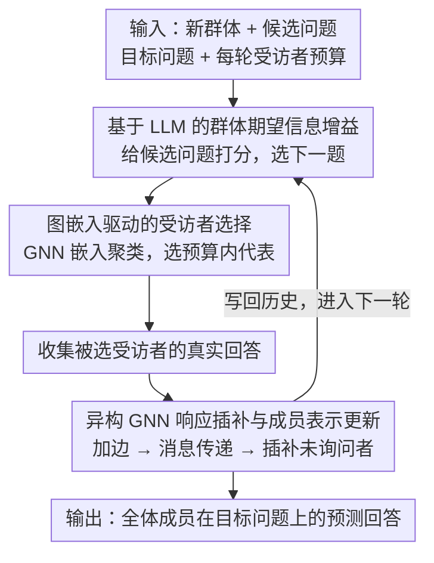

# Whom to Query for What: Adaptive Group Elicitation via Multi-Turn LLM Interactions

**会议**: ICML 2026  
**arXiv**: [2602.14279](https://arxiv.org/abs/2602.14279)  
**代码**: https://github.com/ZDCSlab/Group-Adaptive-Elicitation  
**领域**: 图学习 / LLM 交互式群体建模  
**关键词**: 自适应询问, 群体偏好, 异构图神经网络, 信息增益, 缺失响应插补  

## 一句话总结
这篇论文把多轮问卷式 elicitation 从“问什么问题”扩展到“问谁、问什么”的联合决策，用 LLM 估计问题的信息增益、用异构 GNN 在群体关系图上传播和插补缺失回答，从而在有限受访者预算下更快恢复群体偏好。

## 研究背景与动机
**领域现状**：自适应 elicitation 通常把目标看成对某个潜变量的逐步询问，例如通过前几轮回答来决定下一道最有信息量的问题。LLM 让这个流程更自然，因为它能处理自然语言问题、根据历史回答预测后续回答，并用预测熵或期望信息增益来度量问题价值。

**现有痛点**：真实群体调查的瓶颈往往不只是问题数量，而是每一轮能联系到多少人。已有方法大多默认受访者集合固定，只优化问题选择；即使使用 LLM 插补未观测回答，也常把每个个体独立处理，没有利用人口属性、群体相似性和部分观测之间的结构。

**核心矛盾**：有限预算下，一个问题只有在问到合适的人时才真正有用。只选高信息量问题会浪费在易预测或冗余个体上；只做群体插补又可能把不确定信号过度传播，尤其会伤害那些难以由人口属性解释的高敏感个体。

**本文目标**：作者要形式化 adaptive group elicitation：在每一轮同时选择一个问题和一小部分受访者，使观察到的回答既能更新被询问者本身，也能通过群体结构帮助预测未询问者在目标问题上的回答。

**切入角度**：论文把 LLM 的自然语言预测能力和异构图的群体传播能力分开使用。LLM 负责评估“这个问题能让未来目标问题的不确定性下降多少”，GNN 负责在受访者、人口属性和“问题-选项”节点之间传播已观测回答。

**核心 idea**：用 LLM 做问题层面的期望信息增益选择，用异构 GNN 做 respondent selection 与缺失响应插补，把“问什么”和“问谁”闭环耦合起来。

## 方法详解
论文的方法可以理解成一个多轮闭环系统。训练阶段先学习两个模块：一个能根据个人历史回答预测下一题回答分布的 LLM，以及一个能在异构群体图上做链接预测的 GNN。测试阶段面对一个新群体时，系统每轮先用 LLM 给候选问题打分，再用 GNN 的个体嵌入挑选代表性受访者；收到少量真实回答后，GNN 对未询问者做插补，并把真实回答与插补回答一起写回历史，进入下一轮。

### 整体框架
输入包括一个新群体、候选问题集合、目标评估问题集合以及每轮可询问的受访者预算。系统输出的是群体成员在目标问题上的预测回答。每一轮包含四步：先根据已有历史估计每个候选问题的群体级信息增益；再用异构 GNN 的成员嵌入聚类，选择预算内最有代表性的受访者；然后收集这些人的真实回答；最后将新边加入异构图，通过消息传递更新成员嵌入并插补未询问者回答。

这种设计里，LLM 和 GNN 的职责是互补的。LLM 不需要显式参数化复杂的政治态度或经济偏好潜变量，只需要从交互历史预测未来回答。GNN 不需要生成自然语言，它只需要利用“成员-属性”“成员-问题选项”关系做结构化传播，把少量观察推广到整个人群。

### 关键设计

**1. 基于 LLM 的群体期望信息增益：用"未来回答的熵降"代替手工先验**

这一步解决框架里“问什么”的问题——在不给群体偏好硬编先验分布的前提下，判断哪道候选问题最能压缩群体的不确定性。作者借 de Finetti 式预测观点，把对成员 $v$ 潜变量 $U_v$ 的不确定性转写成它对一批目标问题未来回答的条件熵 $H(U_v|\mathcal{H}_{t-1}^v)=\sum_{x\in\mathcal{X}_h}H(Y_x^v|X=x,\mathcal{H}_{t-1}^v)$；候选问题的期望信息增益（EIG）就是“问前的熵”减去“用 LLM 模拟问后回答再算的熵”，并对全体成员求和，取使群体 EIG 最大的那道题。这样 LLM 只需在自然语言交互历史上学预测分布，不必显式参数化复杂的政治态度或经济偏好，而目标函数仍保有清晰的信息论含义。

**2. 图嵌入驱动的受访者选择：把有限预算投向最难被邻居推断的人**

选完问题还要决定“问谁”，否则预算会浪费在容易预测或冗余的个体上。系统取异构 GNN 给每个成员算出的最终嵌入 $h_v$，认为嵌入相近的人回答模式也相近；给定每轮预算 $k$，就在嵌入空间里聚类、选 $k$ 个聚类中心作为代表性受访者，让观测尽量覆盖群体里信息量大的区域。收到真实回答后把新边写进图、重新传播、下一轮再重新选人。它的价值在高敏感个体上最明显——那些光靠人口属性插补不出来的人正需要被真实问到，而不是把预算花在邻居就能推断的人身上。

**3. 异构 GNN 响应插补与成员表示更新：用群体结构把少量观测推广到全员**

只问了一小部分人，其余人对当前问题的回答得靠插补补齐，这一步也持续刷新群体的结构表示。图里有三类节点：成员节点、人口属性节点、问题-选项节点；成员连到自己的属性节点，也连到它已选过的问题-选项。GNN 以链接预测学习 $p(c|v,q)=\frac{\exp(\langle h_v,h_c\rangle/\tau)}{\sum_{c'}\exp(\langle h_v,h_{c'}\rangle/\tau)}$，训练时随机 mask 掉一部分成员-选项边、用交叉熵把被遮的回答恢复出来。相比 LLM 各自独立插补容易把弱信号当成确定答案，图传播把人口属性和相似回答模式显式纳进来，让未观测回答有群体结构兜底——这也是论文实验里“收益主要来自 GNN 传播而非 LLM 单独插补”的根因。

### 损失函数 / 训练策略
LLM 通过自回归预测目标训练：最大化成员历史中下一轮回答的似然，即学习 $p_\theta(Y_{t+1}^v|X_{t+1}^v,\mathcal{H}_t^v)$。GNN 使用 masked link prediction：随机遮蔽一部分成员-问题选项边，在部分观测图上通过 R-GCN 消息传递得到成员和选项嵌入，再用 softmax 链接预测恢复被 mask 的选项。

实验中，LLM 查询策略使用 Llama-3.1-8B + LoRA 进行 meta-training，训练区域为美国 South，测试区域为 West；GNN 使用两层 R-GCN，隐藏维度 64，在冷启动设定下评估，测试时所有用户-问题边都先从消息传递图中移除。

## 实验关键数据

### 主实验
论文在 CES、OpinionQA 和 Twin-2k 三个真实意见数据集上评估，每轮只问一个问题，并限制每轮可询问的 respondent 比例。目标是在从未查询的 held-out target questions 上预测全体成员回答，主指标是 accuracy，附加指标包括 Brier Score 和 Perplexity。

| 数据集 / 设置 | 指标 | 本文方法 | 最强对比方法 | 提升 |
|--------|------|------|----------|------|
| CES，10% respondent 预算，round 1 | 目标问题 accuracy 相对提升 | 最高 | Meta-Greedy / Meta-Greedy-Imp 中较强者 | +17.1% relative |
| CES，10% respondent 预算，round 4 | 目标问题 accuracy 相对提升 | 最高 | 最强 baseline | +12.6% relative |
| CES / OpinionQA / Twin-2k，10%-50% 预算 | accuracy 曲线 | 各预算下整体最高 | Meta-Random、Meta-Greedy、Meta-Greedy-Imp | 稳定领先 |
| CES / OpinionQA 校准指标 | Brier Score / Perplexity | round 1 后最低且差距扩大 | Meta-Greedy-Imp 常出现过度自信 | 校准更好 |

### 消融实验
论文的消融重点有两类：一类检查 respondent selection 对高敏感人群是否更有价值，另一类比较贪心查询和多步规划。下表摘取 round 4 的关键数字。

| 配置 | 关键指标 | 说明 |
|------|---------|------|
| CES，50% 预算，Random selection | Global 0.793 / Hard 0.714 / Extreme 0.720 | 随机选择也能受益于更多观察，但高敏感个体恢复不足 |
| CES，50% 预算，Group-relational selection | Global 0.801 / Hard 0.780 / Extreme 0.826 | 难预测人群提升最大，说明“问谁”比单纯增加观测更关键 |
| OpinionQA，50% 预算，Random selection | Global 0.490 / Hard 0.473 / Extreme 0.465 | 多选项意见任务更难，随机观察提升有限 |
| OpinionQA，50% 预算，Group-relational selection | Global 0.496 / Hard 0.522 / Extreme 0.529 | 在最难人群上优势更明显 |
| 10% 预算，Greedy vs. Multi-step | Global 0.488 vs. 0.485，Extreme 0.322 vs. 0.336 | 多步规划只在少数敏感层级略有增益 |
| 50% 预算，Greedy vs. Multi-step | Global 0.507 vs. 0.507，Extreme 0.561 vs. 0.542 | 高预算下多步规划无稳定收益，计算成本不划算 |

### 关键发现
- 模型收益不是来自 LLM 单独插补。Meta-Greedy-Imp 并不稳定优于 Meta-Greedy，说明把 LLM 预测直接当作缺失回答容易传播噪声；GNN 的群体结构传播才是更可靠的插补机制。
- respondent selection 的收益集中在高敏感个体。CES 50% 预算下 Extreme tier 从随机的 0.720 提升到 0.826，说明图嵌入选择确实把预算投向了最难由群体均值解释的人。
- 贪心选择已经足够实用。多步 rollout 在 10% 预算的 Extreme tier 有小幅提升，但整体不稳定，高预算下甚至反转；这支持作者关于子模信息增益近似贪心的理论讨论。

## 亮点与洞察
- 这篇论文真正把 elicitation 的预算约束拆成了两个维度：问题预算和受访者预算。很多自适应询问论文只优化问题序列，但真实调查里“谁愿意回答、问谁更有价值”往往才是成本中心。
- LLM 与 GNN 的分工很清楚：LLM 负责语言化的预测和信息增益，GNN 负责关系结构和缺失边恢复。这比把所有任务都交给 LLM 更稳，也更容易解释为什么收益来自群体传播。
- 高敏感 respondent 分层分析很有启发。它把平均 accuracy 背后的异质性拆出来，说明一个好的 elicitation 策略不是让所有人平均变好，而是优先修复最难插补的人。

## 局限与展望
- 方法依赖可用的人口属性或群体关系。如果部署场景缺少稳定属性、属性本身噪声很大，或者群体结构与目标偏好弱相关，GNN 插补的优势可能下降。
- 实验主要是离线重放式评估，真实互动中的拒答、疲劳、策略性回答、问题措辞变化还没有被纳入闭环。
- LLM 查询策略需要 meta-training，并且当前实验主要使用区域迁移设定；未来可以研究跨国家、跨语言或跨组织场景下的泛化。
- respondent selection 可能引入公平性问题。系统若总是询问“高信息量”人群，可能增加某些群体负担，也可能在敏感属性上产生不均衡采样。

## 相关工作与启发
- **vs 个体级 LLM elicitation**: 既有方法常用 LLM 根据历史回答选择下一题，本文把单个个体的潜变量推断扩展到群体层面，并显式加入 respondent selection。
- **vs 传统图模型 / CAR 模型**: 传统空间或群体图模型通常参数化较强，难以处理自然语言问答；本文用异构 GNN 表达成员、属性、选项的混合关系，更适合问卷数据。
- **vs LLM agent 群体仿真**: 多 agent 社会模拟侧重生成交互过程，本文更像预算受限的统计推断任务，核心不是模拟对话，而是最小代价恢复群体响应分布。
- **可迁移启发**: 这套“LLM 估计问题价值 + 图模型估计人群覆盖”的范式可以迁移到用户研究、教育诊断、医疗分诊问卷和企业偏好调查中。

## 评分
- 新颖性: ⭐⭐⭐⭐☆ 把自适应问题选择和 respondent selection 统一起来，并用 LLM+异构 GNN 实现，问题设定很有现实感。
- 实验充分度: ⭐⭐⭐⭐☆ 三个真实数据集、预算曲线、校准指标和敏感人群消融都比较扎实，但真实在线交互验证仍缺失。
- 写作质量: ⭐⭐⭐⭐☆ 方法动机清楚，理论与实验能互相呼应；部分主结果依赖图形曲线，表格化数字略少。
- 价值: ⭐⭐⭐⭐☆ 对调查、用户建模和群体决策系统有直接参考价值，也提供了 LLM 与图学习协作的一个干净范例。

<!-- RELATED:START -->

## 相关论文

- [\[ECCV 2024\] GKGNet: Group K-Nearest Neighbor Based Graph Convolutional Network for Multi-Label Image Recognition](../../ECCV2024/graph_learning/gkgnet_group_k-nearest_neighbor_based_graph_convolutional_network_for_multi-labe.md)
- [\[ICML 2026\] MedCoG: Maximizing LLM Inference Density in Medical Reasoning via Meta-Cognitive Regulation](medcog_maximizing_llm_inference_density_in_medical_reasoning_via_meta-cognitive_.md)
- [\[ICML 2026\] GILT: An LLM-Free, Tuning-Free Graph Foundational Model for In-Context Learning](gilt_an_llm-free_tuning-free_graph_foundational_model_for_in-context_learning.md)
- [\[AAAI 2026\] Relink: Constructing Query-Driven Evidence Graph On-the-Fly for GraphRAG](../../AAAI2026/graph_learning/relink_constructing_query-driven_evidence_graph_on-the-fly_for_graphrag.md)
- [\[ICML 2025\] Is Complex Query Answering Really Complex?](../../ICML2025/graph_learning/is_complex_query_answering_really_complex.md)

<!-- RELATED:END -->
