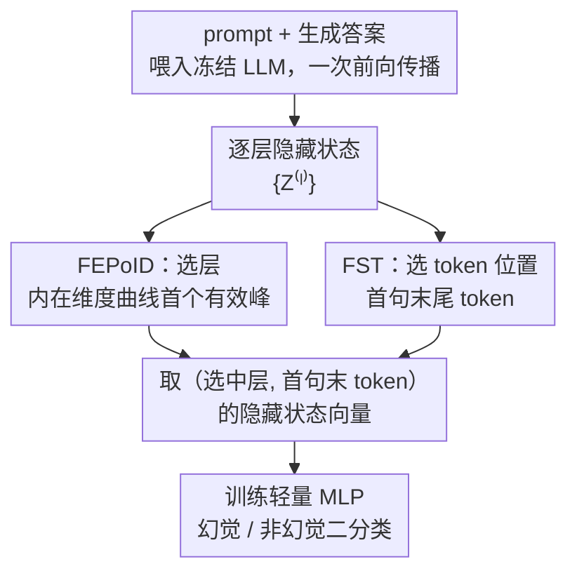

# Automatic Layer Selection for Hallucination Detection

**会议**: ICML 2026  
**arXiv**: [2605.26366](https://arxiv.org/abs/2605.26366)  
**代码**: https://github.com/DesoloYw/Automatic-Layer-Selection-for-Hallucination-Detection  
**领域**: 幻觉检测  
**关键词**: 幻觉检测, 中间层选择, 内在维度, 隐藏状态探测, 大语言模型

## 一句话总结
提出 FEPoID（内在维度的首个有效峰值）作为无需训练的自动层选择准则，并结合首句截断策略（FST），在多种 QA 和摘要幻觉检测基准上持续选出接近最优的中间层，显著超越已有基线方法。

## 研究背景与动机

**领域现状**：大语言模型（LLM）在实际部署中常产生流畅但事实错误的输出（幻觉），检测这些幻觉而不修改模型本身是一个关键的实用问题。已有研究表明，LLM 中间层的隐藏状态比最终层更强地编码了与幻觉相关的信号，基于此出现了隐藏状态探测（hidden-state probing）的检测范式。

**现有痛点**：虽然中间层包含更丰富的幻觉信号，但最优层的位置在不同模型架构、不同数据集之间差异很大。现有方法要么使用固定的中间层（如中间层），要么对所有候选层逐一评估，前者不可靠，后者计算代价过高。缺少一个高效且有原则的自动层选择方法。

**核心矛盾**：最优层的位置依赖于模型和数据，不存在通用的固定选择规则；同时已有的用于衡量层质量的指标（如 RankMe、曲率、梯度范数等）虽然在其他场景有用，但在幻觉检测的层选择上表现不稳定。

**本文目标**：(1) 系统评估各类层选择准则在幻觉检测中的有效性；(2) 提出一个无需训练、计算高效、跨模型/数据集鲁棒的自动层选择方法；(3) 解决表征提取时的 token 位置选择问题。

**切入角度**：作者观察到内在维度（ID）随层演变的曲线呈现稳定的多峰模式——中间层出现第一个峰值，靠近输出层出现第二个更高的峰值。作者假设第一个峰值捕捉了抽象语义信息（与幻觉检测相关），而第二个峰值主要反映表面词汇复杂度（对检测无益）。

**核心 idea**：选择内在维度曲线上的"首个有效峰值"（FEPoID）作为层选择准则，同时用首句截断（FST）去除生成末尾的噪声，两者联合实现无监督、高效的幻觉检测。

## 方法详解

### 整体框架
这篇论文要解决的是隐藏状态探测式幻觉检测里两个一直靠拍脑袋决定的问题：从模型的哪一层、哪个 token 位置去取表征。整套流程很轻——预训练 LLM 全程冻结，把 prompt 和生成答案拼起来喂进去做一次前向传播，得到逐层的隐藏状态 $\{\mathbf{Z}^{(\ell)}\}$，再从某个中间层、某个 token 位置取出一条隐藏状态向量，训一个轻量 MLP 做幻觉/非幻觉的二分类。真正的难点不在分类器，而在前面那两个选择：层选错了或 token 位置选错了，分类器再强也救不回来。

动机来自一组失败的尝试：作者先把信息论、梯度、几何三类共六种现成的层质量准则（RankMe、验证损失 / RGN / SNR、曲率、内在维度）搬到幻觉检测场景逐层评估，对应「丰富语义 / 任务对齐 / 信息压缩 / 高效信息容量」四个直觉假设，结果没有一个能跨模型、跨数据集稳定选出好层——这正是要补的空白。最终方案是两个互补且都无需训练的设计：FEPoID 负责选层，FST 负责选 token 位置。

### 关键设计

**1. FEPoID：用内在维度曲线的「首个有效峰值」自动定位最优中间层**

最优层的位置在不同模型、不同数据集之间漂得很厉害，固定取中间层不可靠、逐层试又太贵。作者的切入点是内在维度（ID）：用 TwoNN 估计器算出每一层表征矩阵 $\mathbf{Z}^{(\ell)} \in \mathbb{R}^{N \times d}$ 的内在维度 $d_{\text{ID}}^{(\ell)}$，画成随层变化的曲线，会看到一个稳定的双峰形态——中间层一个峰，靠近输出层还有一个更高的峰。关键假设是：第一个峰捕捉的是抽象语义信息（正是幻觉检测需要的），第二个峰主要反映表面词汇复杂度（对检测没用）。所以不能简单取 ID 最大的层，那样几乎总会落到末端的第二个峰上。

FEPoID 的做法是从浅到深扫描 ID 曲线的所有局部极大值，并用一个前向窗口 $w$（默认 7）过滤掉虚假的小峰：若候选峰值层 $\ell$ 满足 $d_{\text{ID}}^{(\ell)} < d_{\text{ID}}^{(\min(\ell+w, L))}$ 且窗口内 ID 单调递增，说明它只是上坡途中的小起伏，丢弃；活下来的最早那个峰对应的层就是选中层。这样选出的层恰好落在抽象语义最丰富的位置，实验里它和 oracle 最优层高度一致，而整个计算只是一次 ID 估计加一遍扫描，开销可以忽略。

**2. FST（首句截断）：取第一句末尾的 token，而不是整段生成的最后一个 token**

取「最后一个 token」是探测方法的默认习惯，但作者发现这恰恰是噪声重灾区。LLM（尤其是 LLaMA）往往在第一句就给出了答案，却还会继续往下写，于是出现三种退化：不一致续写（后文和首句答案自相矛盾）、语义漂移（越写越偏题）、退化重复（反复重述同一句）。这些后续内容把末尾 token 的表征污染了，让分类器学到的是噪声而非答案信号。

FST 的解法很直接：用一个基于规则的句子边界检测器找到第一个生成句子的末尾 token，就取这个位置的隐藏状态。它不需要真实答案标注、也不依赖辅助 LLM，纯规则、零成本。因为答案信息几乎都集中在首句，截在这里既保住了信号又甩掉了后续噪声——实验里它对所有基线都带来一致提升，是个「方法无关」的增益。

## 实验关键数据

### 主实验（QA 任务）

在 5 个 QA 数据集和 2 个指令微调模型上的 AUROC 对比（提取最后生成 token 表征，$w=7$）：

| 方法 | CoQA | SQuAD | HotpotQA | TriviaQA | PsiLoQA | 平均 |
|------|------|-------|----------|----------|---------|------|
| Pred. Entropy | 0.583 | 0.570 | 0.710 | 0.686 | 0.360 | 0.582 |
| Semantic Entropy | 0.500 | 0.552 | 0.445 | 0.551 | 0.608 | 0.531 |
| Lexical Similarity | 0.678 | 0.599 | 0.729 | 0.684 | 0.408 | 0.620 |
| EigenScore | 0.525 | 0.530 | 0.599 | 0.588 | 0.508 | 0.550 |
| Probing + Val Loss | 0.671 | 0.616 | 0.768 | **0.786** | 0.784 | 0.725 |
| Probing + Curvature | 0.632 | 0.618 | 0.741 | 0.737 | 0.757 | 0.697 |
| Probing + ID | 0.671 | 0.613 | 0.693 | 0.707 | 0.737 | 0.684 |
| **Probing + FEPoID** | **0.671** | **0.638** | **0.781** | 0.752 | **0.786** | **0.725** |

*以上为 LLaMA-3.1-8B-Instruct 结果。FEPoID 在平均 AUROC 上达到最优，且在 Mistral-7B 上平均 AUROC 达 0.853，同样排名第一。*

### 摘要任务与计算效率

| 方法 | HaluEval | CNN/DM | 平均 | 计算时间(秒) |
|------|----------|--------|------|-------------|
| RankMe | 0.608 | 0.577 | 0.592 | 27.3 |
| Curvature | 0.549 | 0.592 | 0.571 | 45.2 |
| Val Loss | 0.596 | 0.586 | 0.591 | 29.6 |
| RGN | 0.571 | 0.582 | 0.577 | 58.2 |
| SNR | 0.553 | 0.547 | 0.550 | 57.9 |
| **FEPoID** | **0.617** | **0.600** | **0.608** | **10.1** |

*LLaMA-3.1-8B-Instruct 上结果。FEPoID 不仅检测性能最优，计算时间仅为其他方法的 1/3 到 1/6。*

### 关键发现
- FEPoID 在 QA 和摘要两类任务、5 种模型规模（1B-8B）、base 和 instruct 两种调优策略上均稳定表现最优或接近最优，展现了极强的泛化能力
- FST 对所有基线方法均带来一致的 AUROC 提升（方法无关的增益），在 LLaMA 上提升尤为显著（因为 LLaMA 生成更容易出现末尾噪声），Fisher 分离度和轮廓系数均大幅改善
- 直接选最大 ID 层的策略在 HotpotQA、TriviaQA 等数据集上会选到过深的层，导致性能下降；而 FEPoID 通过前向窗口机制稳定地避免了这个陷阱
- 超参数 $w$ 的敏感性分析表明 FEPoID 对 $w$ 的选择非常鲁棒，性能在较大范围内保持稳定

## 亮点与洞察
- FEPoID 的设计极其优雅——仅靠 TwoNN 内在维度估计加一个前向窗口即可实现无训练、无标注的自动层选择，计算开销可以忽略不计（全部 32 层仅需约 10 秒），这使其在实际部署中极具吸引力
- FST 的"方法无关"特性非常实用：它不仅改善了隐藏状态探测，还提升了不确定性方法和词汇相似度等完全不同范式的基线，说明"末尾噪声"是一个普遍且被低估的问题
- "ID 曲线双峰假设"提供了理解 Transformer 层级表征的新视角：中间峰值 = 抽象语义，末端峰值 = 表面复杂度，这一洞察可迁移到其他需要选择中间层表征的下游任务

## 局限与展望
- 实验仅覆盖 1B-8B 规模的模型，更大模型（70B+）的层选择行为可能不同，FEPoID 的双峰假设是否仍成立有待验证
- FST 依赖规则式句子边界检测，对非英语语言或非自然句子结构的生成（如代码、数学推导）可能不适用
- 当前仅在 QA 和摘要任务上验证，开放式生成（如对话、创意写作）中幻觉的定义和分布不同，泛化性有待测试
- 可探索将 FEPoID 的层选择动态化——针对不同输入样本选择不同层，或组合多层表征以进一步提升检测性能

## 相关工作与启发
- **INSIDE**（Chen et al., 2024）：利用 LLM 内部状态进行幻觉检测，固定选择中间层，FEPoID 提供了更优的自动化替代
- **Semantic Entropy**（Farquhar et al., 2024）：从语义层面估计不确定性，但需要多次采样，本文的隐藏状态探测方法仅需单次前向传播
- **EigenScore**（Chen et al., 2024）：基于隐藏状态协方差谱性质评估表征质量，但其层选择策略次优
- **ID 与层选择的关系**：Cheng et al.（2025）发现最大 ID 附近的层最先迁移到下游任务，本文进一步细化为"首个有效峰值才是最优选择"

<!-- RELATED:START -->

## 相关论文

- [\[NeurIPS 2025\] Robust Hallucination Detection in LLMs via Adaptive Token Selection](../../NeurIPS2025/hallucination/robust_hallucination_detection_in_llms_via_adaptive_token_selection.md)
- [\[ICML 2026\] From Out-of-Distribution Detection to Hallucination Detection: A Geometric View](from_out-of-distribution_detection_to_hallucination_detection_a_geometric_view.md)
- [\[ICML 2026\] Finding the Correct Visual Evidence Without Forgetting: Mitigating Hallucination in LVLMs via Inter-Layer Visual Attention Discrepancy](finding_the_correct_visual_evidence_without_forgetting_mitigating_hallucination_.md)
- [\[ICML 2026\] Harnessing Reasoning Trajectories for Hallucination Detection via Answer-agreement Representation Shaping](harnessing_reasoning_trajectories_for_hallucination_detection_via_answer-agreeme.md)
- [\[CVPR 2026\] TriDF: Evaluating Perception, Detection, and Hallucination for Interpretable DeepFake Detection](../../CVPR2026/hallucination/tridf_evaluating_perception_detection_and_hallucination_for_interpretable_deepfa.md)

<!-- RELATED:END -->
