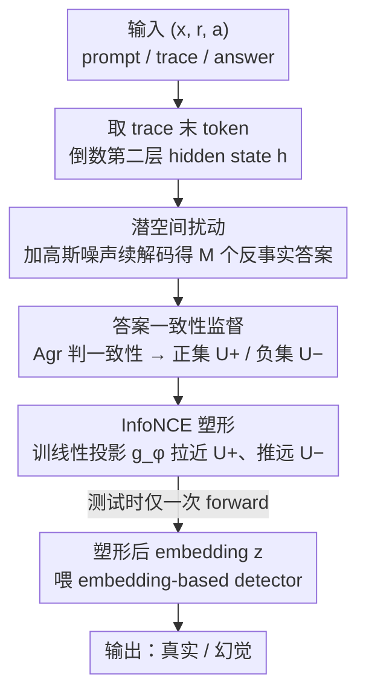

# Harnessing Reasoning Trajectories for Hallucination Detection via Answer-agreement Representation Shaping

**会议**: ICML 2026  
**arXiv**: [2601.17467](https://arxiv.org/abs/2601.17467)  
**代码**: https://github.com/radiolab-ntu/ars_icml2026 (有)  
**领域**: 幻觉检测  
**关键词**: 大推理模型, 幻觉检测, 潜空间扰动, 反事实答案, 对比表示塑形

## 一句话总结
本文针对大推理模型（LRM）的幻觉检测提出 ARS：不在文本层扰动 reasoning trace，而是**直接在 trace 末端的潜表示上施加小扰动并续解码**得到反事实答案，再用"答案是否一致"作为标签训一个轻量 contrastive 头来塑形 trace-conditioned answer embedding，使后续 embedding-based detector 把幻觉与真实回答分得更开（TruthfulQA 上 AUROC $66.85\to 86.64$）。

## 研究背景与动机
**领域现状**：LRM（Qwen3、DeepSeek-R1 等）先生成长 reasoning trace 再产出答案。常见幻觉检测方法分四类：(i) 基于 logit/perplexity 的不确定性；(ii) 基于多次采样的一致性（Semantic Entropy、SelfCKGPT）；(iii) 让模型口头报告置信度；(iv) 用 embedding-based probe（CCS、HaloScope、EigenScore）从内部状态分类。

**现有痛点**：直接拿 reasoning trace 当信号在实证上效果**不增反减**——作者用 Qwen3-8B 在 TruthfulQA 上对比"有/无 trace"两种 representation，发现 trace 反而会掩盖 answer-level 幻觉信号（图 1）。原因有二：(1) 同一答案可由多条 trace 支持，trace 的表面形式变化巨大，detector 容易过拟到风格而非答案有效性；(2) 幻觉本质是 answer-level 性质，但 trace 横跨大量 token 和层，无关风格变化淹没了真信号。

**核心矛盾**：trace 里**确实**藏着关于答案稳定性的信号——直觉是"真答案在内部表征上稳定，幻觉答案脆弱，小扰动就会换答案"——但常规 embedding 既包含这个稳定性信号也包含大量风格噪声，无法被 detector 直接利用。

**本文目标**：(1) 从 trace 中提炼出 answer-centric 的稳定性信号；(2) 把这个信号注入到 trace-conditioned answer embedding 里，让下游任意 embedding-based detector 都能直接受益；(3) 不依赖人工 hallucination 标注、不在推理阶段做多次采样。

**切入角度**：把 trace 看成给定 context，关注 trace 结束、答案开始的那一刻——也就是 reasoning trace 末 token 在倒数第二层的 hidden state $\boldsymbol h$。这是模型"已经看完所有 reasoning，但还没开始锁定答案"的状态，对它做小扰动续解码得到的反事实答案，能最干净地反映"模型当前对答案的承诺有多强"。

**核心 idea**：用潜空间扰动制造反事实答案 → 用"反事实是否与原答案一致"做对比标签 → 训一个 lightweight projection 把稳定性信号显式塑形进 embedding 里。

## 方法详解

### 整体框架
ARS 要解决的是"reasoning trace 里明明藏着答案稳定性信号，但常规 embedding 把它和大量风格噪声混在一起，detector 用不上"这一矛盾。它的做法是把 trace 当作给定 context，只盯住 trace 结束、答案开始的那一刻——对这个潜状态做小扰动续解码，制造一批"模型本来也可能给出的反事实答案"，再用"反事实是否与原答案一致"做监督信号，训一个极轻量的线性投影把稳定性显式塑形进 embedding。整条链路冻结 LRM $\pi_\theta$，给一条 $(\boldsymbol x, \boldsymbol r, \boldsymbol a)$（prompt / trace / answer）：取 trace 末 token 的倒数第二层 hidden state，加高斯扰动续解码得反事实答案，按答案一致性分正负集，最后训线性映射 $g_\phi$ 拉近正集、推远负集。测试时对新样本只跑一次 forward，取 answer embedding $\boldsymbol u$，过 $g_\phi$ 得塑形后的 $\boldsymbol z$，喂任意 embedding-based detector（CCS、Probing、HaloScope、EigenScore）做二分类。

### 关键设计

**1. 在 trace 边界做潜空间扰动：制造廉价反事实答案**

幻觉本质是 answer-level 性质，但常规做法要么在文本空间扰动 trace（删词、换序、paraphrase），需要小心设计还常常改变语义；要么走多次输出采样，推理代价直接 $\times M$。ARS 改为直接在 LRM 自身的决策几何上动手：取 trace 末 token 倒数第二层的 hidden state $\boldsymbol h = \boldsymbol h_L(\boldsymbol x\oplus\boldsymbol r)$，加各向同性高斯扰动 $\tilde{\boldsymbol h}=\boldsymbol h + \boldsymbol\delta,\ \boldsymbol\delta\sim\mathcal N(0,\sigma^2\boldsymbol I)$，再续解码 $\tilde{\boldsymbol a}=\text{Decode}_\theta(\boldsymbol x\oplus\boldsymbol r;\tilde{\boldsymbol h})$，得到一个"模型在当前内部状态下也可能产出的其它答案"及其 embedding $\tilde{\boldsymbol u}$。

扰动位置故意选 trace 末、答案前这个交界，是因为另两个位置都会失效：在 trace 中部扰动会让后续 reasoning 整体重写，扰动效应被 trace 风格主导而非答案改变；在答案中部扰动则后续 token 受已生成 answer token 强约束，只能做局部编辑无法翻转语义。唯独 trace 边界是模型已完整吸收 reasoning、但尚未提交答案的"最大答案自由度"位置，对它扰动最干净地反映模型当前对答案的承诺有多强。这样把多次采样的成本从推理时一次性转移到训练时，且无需任何文本扰动设计。

**2. 答案一致性作为零标注的自动监督**

有了反事实答案，还需要标签来分正负，ARS 用"反事实答案是否与原答案等价"这一信号，完全绕开人工幻觉标注。对每个原样本产 $M$ 个 $\tilde{\boldsymbol a}_j$，用 $\text{Agr}(\boldsymbol a, \tilde{\boldsymbol a}_j)\in\{0,1\}$ 判定（可用文本相似度或 LLM-as-judge 实例化），关键是 $\text{Agr}$ 不需要真值 $y$，只判反事实答案与原答案是否一致。一致集 $\mathcal U^+=\{\tilde{\boldsymbol u}_j: \text{Agr}=1\}$ 收集"小扰动下仍指向同一答案的内部状态"，不一致集 $\mathcal U^-=\{\tilde{\boldsymbol u}_j:\text{Agr}=0\}$ 收集"小扰动就翻车的内部状态"。直觉上幻觉样本稳定性 margin 小、$\mathcal U^-$ 通常更大，真实样本则 $\mathcal U^+$ 占主导。这等于把模型自身的决策稳定性蒸馏成训练信号：搭 CCS 时整条链路 zero supervision，同时也兼容有监督 Probing，新领域/新模型几乎零冷启动成本。

**3. InfoNCE 塑形目标：把稳定性写进 embedding 几何**

最后用对比 loss 把稳定性信号显式编码进塑形后的表示 $\boldsymbol z$。以原答案的 $\boldsymbol z = g_\phi(\boldsymbol u)$ 为 anchor，正例 $\tilde{\boldsymbol z}^+ \sim g_\phi(\mathcal U^+)$、负例集合 $\mathcal Z^- = g_\phi(\mathcal U^-)$，目标为

$$\mathcal L_{\text{ARS}}=-\frac{\text{sim}(\boldsymbol z,\tilde{\boldsymbol z}^+)}{\tau}+\log\sum_{\tilde{\boldsymbol z}'\in\{\tilde{\boldsymbol z}^+\}\cup\mathcal Z^-}\exp\Big(\frac{\text{sim}(\boldsymbol z,\tilde{\boldsymbol z}')}{\tau}\Big),$$

其中 $\text{sim}$ 是 cosine，映射 $g_\phi$ 只是无 bias 的 single linear projection，极轻量。它把"幻觉=不稳定"从需要多次推理采样（如 Semantic Entropy）变成一次 forward 即可读出的几何属性，且 plug-and-play 兼容现有 detector，不必改动下游模型。理论上 Proposition 4.2 给出 $\Pr(\hat y\neq y)\leq C(1-\eta_\phi)+e_\alpha$，把检测错误率上界拆成"答案稳定性本身能否区分真假"的 $e_\alpha$、与"塑形是否成功分离正负对"的 $1-\eta_\phi$ 两项；优化 $\mathcal L_{\text{ARS}}$ 直接收紧后者，使 loss 与可证 bound 严格对齐。

### 损失函数 / 训练策略
- $\mathcal L_{\text{ARS}}$ 如上；Adam，lr $1\text{e-}4$，weight decay $1\text{e-}5$，cosine decay，batch 128。
- $g_\phi$ 实现为 single linear projection；输入是 LRM 倒数第二层最后一个 answer token 的 embedding（按 Azaria & Mitchell 2023 约定）。
- 超参 $\sigma, k, \tau, M$、训练层在 100 样本 validation split 上选；TruthfulQA 用 25% 测试。

## 实验关键数据

### 主实验

| 模型 | 数据集 | Detector | Vanilla AUROC | ARS-Shaped AUROC | 提升 |
|------|--------|----------|--------------|------------------|------|
| Qwen3-8B | TruthfulQA | CCS | 66.85 | **86.64** | $+19.79$ |
| Qwen3-8B | TriviaQA | CCS | 59.24 | **88.54** | $+29.30$ |
| Qwen3-8B | GSM8K | CCS | 57.98 | **90.37** | $+32.39$ |
| Qwen3-8B | MATH-500 | CCS | 55.64 | **78.66** | $+23.02$ |
| Qwen3-8B | TruthfulQA | Probing | 78.66 | **83.66** | $+5.00$ |
| Qwen3-8B | MATH-500 | Probing | 67.03 | **78.17** | $+11.14$ |
| DeepSeek-R1-Distill-Llama-8B | TriviaQA | CCS | 63.99 | **88.86** | $+24.87$ |
| DeepSeek-R1-Distill-Llama-8B | MATH-500 | CCS | 54.44 | **86.38** | $+31.94$ |

| 数据集 | 模型 | ARS | TSV (Park 2025) | G-Detector (Zhang 2026) | Semantic Entropy |
|--------|------|-----|----------------|-------------------------|-----------------|
| TruthfulQA | Qwen3-8B | **86.64** | 77.08 | 71.86 | 65.60 |
| TriviaQA | Qwen3-8B | **91.62** (Probing) | 89.67 | 90.52 | 58.37 |
| GSM8K | Qwen3-8B | **90.37** | 83.15 | 83.78 | 72.51 |
| MATH-500 | Qwen3-8B | **78.66** | 63.12 | 57.67 | 56.13 |

### 消融实验

| 配置 | TruthfulQA AUROC | 说明 |
|------|----------------|------|
| ARS (trace-boundary intervention) | **86.64** | 默认 |
| trace 中部扰动 | 显著下降 | 答案改变与 trace 风格变化纠缠 |
| 答案中部扰动 | 显著下降 | 后续 token 受 answer 强约束，只做表层编辑 |
| 文本删词 (10–90%) | 全面差于 ARS | 文本扰动设计敏感 |
| 文本 mask / paraphrase | 同上 | 同上 |
| 跨数据集（GSM8K→TriviaQA） | 87.80 | 接近 in-domain 91.62，强迁移 |
| Qwen3-14B（更大模型） | 77.47 (vs TSV 73.41, G-Det 69.89) | scale 后仍领先 |

### 关键发现
- **trace 边界是唯一对的扰动点**：消融把 mid-trace / mid-answer / 文本扰动都跑了，trace 末肯定胜出——这给"如何使用 reasoning trace"提供了一个非显然的实践经验。
- **CCS（无监督）+ ARS 反而比 Probing（有监督）+ ARS 更强**：在 TruthfulQA 和 GSM8K 上 CCS-ARS 都超过 Probing-ARS，说明塑形过的 embedding 已经足够分离，反而是无监督 CCS 把它最大化利用了，这意味着 ARS 让"有标签 vs 无标签"的差距大幅缩小。
- **强跨域迁移**：GSM8K 训的 $g_\phi$ 在 TriviaQA 上仍能拿 87.80，说明 ARS 捕获的是与数据集无关的稳定性几何，而非过拟合表层风格。
- **scale 友好**：14B 模型上仍稳定超越最强 baseline (TSV/G-Detector)。
- **inference 零额外采样**：与 Semantic Entropy / SelfCKGPT 需要 $M$ 次 forward 不同，ARS 测试只需一次 forward + 线性投影，工业部署极友好。

## 亮点与洞察
- **潜空间扰动取代文本扰动**：直接对 hidden state 加小高斯噪声然后续解码，绕开了所有 text perturbation 的语义/格式设计问题，是一个非常 clean 的 trick，可以迁移到任何"研究输入空间 vs 答案空间的稳定性"任务。
- **训练时扰动 / 推理时干净**：把多次采样的代价 amortize 到训练阶段，推理时只走一次 forward 拿到塑形过的 embedding——这种 "expensive train / cheap test" pattern 在大模型部署语境下尤其值得复用。
- **答案一致性即自监督**：$\text{Agr}$ 完全可由模型自己判，零人工标注；这让 ARS 在新领域/新模型上几乎零冷启动成本。
- **理论与算法严格对齐**：Proposition 4.2 把对比 loss 优化的 $\eta_\phi$ 与检测错误上界直接挂钩，这种"loss 直接对应可证 bound"的范式在表示学习里很难得。
- **trace 边界这一锚点的物理直觉**：作者解释为"模型完整吸收 reasoning 但尚未承诺答案"的状态，非常符合人类对 deliberation 的直觉。

## 局限与展望
- $\text{Agr}$ 用 LLM-as-judge 实现，质量依赖判断模型；若 judge 自己也有幻觉，contrastive pair 会被污染（论文用 Qwen3-32B 做 judge 部分缓解但未消融 judge 选择）。
- 高斯各向同性扰动可能不是最优——不同方向上模型敏感度差异巨大，未来可考虑沿主成分方向或 Fisher 信息方向自适应扰动。
- 主要 benchmark 是 QA/数学，对长文本生成（如 long-form summarization）下的幻觉是否仍能精准检测尚未验证。
- $g_\phi$ 是 single linear projection，能力上限可能不高；当 LRM 内部表征已经几何坍缩时（例如 RLHF 后），线性投影未必能恢复 stability 信号。
- 论文 placement 在 causal_inference 文件夹下并不贴切（核心是反事实但任务属于 trustworthy LLM），未来重分类时建议挪到 hallucination/llm_reasoning 子领域。

## 相关工作与启发
- **vs Semantic Entropy (Kuhn 2023)**: 都基于"幻觉=不稳定"，但 SE 需要 $M$ 次输出空间采样，ARS 把这部分变成训练期一次性、推理期零开销，且把信号塑形到 embedding 而不是只输出一个 score。
- **vs HaloScope / CCS / Probing**: 这些方法都吃 raw embedding，ARS 是它们的 *upstream* 增强——把 raw embedding 通过 $g_\phi$ 塑形后再传给它们，所以 ARS 与所有 embedding-based detector 正交兼容。
- **vs TSV (Park 2025)**: TSV 也修改表示但需要 (semi-)supervised 信号，ARS 用 answer agreement 完全 zero-supervision；在 TruthfulQA 上 ARS 高 TSV 约 9.5 个点。
- **vs RHD / RACE / G-Detector（LRM 专用）**: 它们都从 trace 文本/结构出发，没有在表示层做 reshape；ARS 直接塑形表示，绕过文本风格噪声。
- **启发**：用潜空间扰动+续解码制造反事实标签的范式可推广到——可解释性中的"特征重要性"、安全对齐中的"jailbreak 鲁棒性"、agent 中的"工具调用稳定性"评估，几乎任何"答案是否稳健"的问题都能套这一框架。

## 评分
- 新颖性: ⭐⭐⭐⭐⭐ "潜空间扰动 + 答案一致性 contrastive 塑形"在幻觉检测里是首次提出且非常自然
- 实验充分度: ⭐⭐⭐⭐ 4 数据集 × 2 主模型 + 14B 扩展 + 跨域迁移 + 4 种下游 detector + 多种扰动位置消融
- 写作质量: ⭐⭐⭐⭐ trace 边界的物理直觉讲透，方法图清晰，理论与算法关联明确
- 价值: ⭐⭐⭐⭐⭐ 推理时零开销、零人工标注、跨域强迁移、即插即用，工业部署立即可用

<!-- RELATED:START -->

## 相关论文

- [\[ICML 2026\] From Out-of-Distribution Detection to Hallucination Detection: A Geometric View](from_out-of-distribution_detection_to_hallucination_detection_a_geometric_view.md)
- [\[ACL 2026\] The Reasoning Trap: How Enhancing LLM Reasoning Amplifies Tool Hallucination](../../ACL2026/hallucination/the_reasoning_trap_how_enhancing_llm_reasoning_amplifies_tool_hallucination.md)
- [\[ICML 2026\] Automatic Layer Selection for Hallucination Detection](automatic_layer_selection_for_hallucination_detection.md)
- [\[CVPR 2026\] Understanding the Role of Hallucination in Reinforcement Post-Training of Multimodal Reasoning Models](../../CVPR2026/hallucination/understanding_the_role_of_hallucination_in_reinforcement_post-training_of_multim.md)
- [\[NeurIPS 2025\] Reasoning Models Hallucinate More: Factuality-Aware Reinforcement Learning for Large Reasoning Models](../../NeurIPS2025/hallucination/reasoning_models_hallucinate_more_factuality-aware_reinforcement_learning_for_la.md)

<!-- RELATED:END -->
