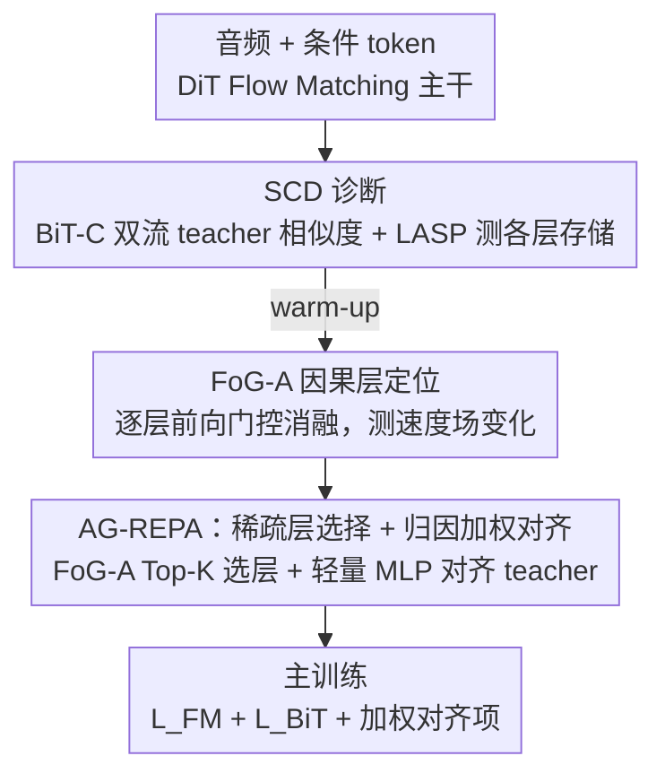

# AG-REPA: Causal Layer Selection for Representation Alignment in Audio Flow Matching

**会议**: ICML 2026  
**arXiv**: [2603.01006](https://arxiv.org/abs/2603.01006)  
**代码**: https://github.com/zpforlove/AG-REPA  
**领域**: 音频生成 / Flow Matching  
**关键词**: REPA, 音频生成, Flow Matching, 因果归因, 层选择  

## 一句话总结
AG-REPA 发现音频 Flow Matching 中“存储语义信息的层”和“真正驱动速度场的层”并不重合，提出用 forward-only gate ablation 选择因果贡献最高的层做表示对齐，在语音和通用音频生成上比固定层 REPA 更快收敛、更低 FAD。

## 研究背景与动机
**领域现状**：Flow Matching 已成为语音合成和通用音频生成的重要范式，通过学习从噪声到音频数据分布的连续速度场来生成样本。REPresentation Alignment（REPA）则是近年用于加速生成模型训练的技巧：把中间 hidden states 对齐到预训练 teacher 特征，让模型更快获得有用表示。

**现有痛点**：视觉领域 REPA 常按经验选择某个中间层或固定深度做对齐，但音频 Flow Matching 的结构不同。token-conditioned audio generation 要从稀疏离散 token 解码到连续波形，没有视频/图像那样密集的空间 anchor；如果沿用固定中层对齐，很可能监督的是“表示很像 teacher、但对速度场没什么作用”的层。

**核心矛盾**：表示相似性不等于功能贡献。某一层可能很会存储语义或声学信息，却未必是当前生成 dynamics 中最能影响 velocity field 的层。对齐这种层会让训练看似获得 teacher 信息，却没有把监督施加到真正控制生成轨迹的位置。

**本文目标**：作者想回答“音频 Flow Matching 的 REPA 应该对齐哪几层”。他们不仅要找到信息存储位置，还要找到对速度场输出有因果影响的位置，并据此构造更有效的层选择与加权策略。

**切入角度**：论文引入 Store-Contribute Dissociation（SCD）观点：深层常是 semantic storage，浅层或中间过渡层才可能是 causal driver。于是方法从表示诊断转向因果归因，用前向门控消融直接测量去掉某层后速度场变化有多大。

**核心 idea**：不要把 REPA 施加在 teacher similarity 最高的层，而是用 FoG-A 找出最能改变 velocity field 的 Top-K 层，并按归因强度分配对齐权重。

## 方法详解

### 整体框架
AG-REPA 要解决的是音频 Flow Matching 里 REPA 该对齐哪几层的问题：以往按经验固定中层对齐，但作者发现"最像 teacher 的层"和"最影响速度场的层"并不重合。它的做法是先用一套诊断工具把这两件事拆开看，再只对真正驱动生成的层做稀疏、加权的对齐。模型本身是统一音频生成框架，同时做 TTS 和 Text-to-Audio，语音侧用语义 token、通用音频侧用事件/声学 token，共享一个 DiT-based Flow Matching backbone。在 warm-up 阶段，作者先测各层表示与 Whisper/BEATs teacher 的相似度，再对每层做门控消融观察速度场变化，最后挑出贡献最高的几层加轻量 projection head 做对齐。

### 关键设计

**1. SCD 诊断：把"表示存储"和"功能贡献"分开测**

这一步针对的痛点是：以往默认 teacher similarity 高的层就值得监督，但生成模型最终预测的是速度场，信息存在某层不代表优化那里最有效。作者用两个表示探针把"网络知道什么"测出来——BiT-C 用 Whisper 和 BEATs 两个 teacher 建立双流 cosine alignment，LASP 用共享冻结投影头在同一 teacher 空间里比较各层的信息存储量。结果很清楚：语义相似度 Cos-SEM 往往在深层 L22–L24 最高，事件相似度 Cos-EVT 在不同 token topology 下偏深或偏中层。也就是说，单看相似度会把对齐引向深层的 representation reservoir，而这恰恰可能不是生成动力学里有杠杆的位置。这个"存储与贡献分离"（Store-Contribute Dissociation, SCD）的现象，正是后续方法不再沿用固定中层对齐的根据。

**2. FoG-A：用前向门控消融定位因果层**

诊断出"像 teacher"不等于"驱动生成"之后，需要一个能直接测功能必要性的工具。FoG-A 把 DiT 残差层写成 $h_l=h_{l-1}+m_l f_l(h_{l-1},t,c)$，标准前向里所有 $m_l=1$；测第 $k$ 层时把 $m_k=0$ 把它从前向里"摘掉"，不反传梯度，只比较消融后的速度场 $v_\theta^{\setminus k}$ 与原速度场 $v_\theta$ 的归一化差异——差异越大，说明拿掉这层越会改变生成方向，它就越是 causal driver。相比之下，梯度范数只反映优化器当下在哪更新、LASP 只反映哪里存信息，都不是因果量；FoG-A 通过 intervention 直接回答"这层对最终生成函数有多必要"，因此更贴近 alignment 真正该作用的位置。它不需要训练额外探针、也不需要反传，成本极低。

**3. AG-REPA：稀疏层选择 + 归因加权对齐**

有了 FoG-A 分数，就能把 REPA 从固定深度启发式改成自适应的因果层监督。作者按 FoG-A 分数取 Top-K 层组成集合 $\mathcal{S}$，并让每层的对齐权重正比于它的归因强度 $\lambda_k=\mathrm{FoG\text{-}A}_k/\sum_{j\in\mathcal{S}}\mathrm{FoG\text{-}A}_j$；每个选中层接一个轻量两层 MLP，把 temporal-pooled hidden state 对齐到 frozen teacher embedding。最终目标在 Flow Matching 主损失上叠加输入端的 BiT-C anchor 和这些层的对齐项：$\mathcal{L}_{FM}+\lambda_{BiT}\mathcal{L}_{BiT}+\sum_{k\in\mathcal{S}}\lambda_k(1-\cos(h_{\phi_k}(\bar{h}_k),\mathcal{T}(x)))$。这样设计是因为生成往往由多个层共同控制、且贡献不均匀，Top-K 加按归因比例加权比单层 REPA 或固定 L1–L3 更能适配不同架构和 tokenizer。

### 损失函数 / 训练策略
AG-REPA 在开销上很克制。FoG-A 只在 5,000-step warm-up 中每 200 步触发一次，用小 batch、无梯度、单 GPU，总计约 41 次等价单前向，wall-clock 增量小于 0.5%。主训练只多出 $K=3$ 个轻量 MLP heads，额外参数小于 0.5%，每步时间开销小于 2%，因此在几乎不增加训练成本的前提下完成因果层选择和对齐。

## 实验关键数据

### 主实验
| 方法 | Speech WER↓ | Speech FAD↓ | Audio FAD↓ | Speech MOS↑ | Audio MOS↑ |
|------|-------------|-------------|------------|-------------|------------|
| Base (no layer align.) | 5.82 | 1.84 | 3.45 | 3.62±0.08 | 3.45±0.09 |
| REPA @ Layer 4 | 5.15 | 1.65 | 3.12 | 3.75±0.07 | 3.58±0.08 |
| REPA @ Layer 8 | 4.93 | 1.58 | 3.05 | 3.79±0.06 | 3.64±0.08 |
| REPA @ L4,8,12 | 4.21 | 1.45 | 2.88 | 3.92±0.06 | 3.77±0.07 |
| REPA @ Deep (L20–L22) | 5.60 | 1.79 | 3.39 | 3.64±0.08 | 3.48±0.09 |
| REPA @ Shallow (L1–L3) | 3.62 | 1.36 | 2.68 | 4.05±0.06 | 3.87±0.07 |
| AG-REPA (Top-3) | 3.45 | 1.29 | 2.56 | 4.12±0.05 | 3.94±0.07 |

### 消融实验
| 选择策略 | Top-3层 | Speech FAD↓ | Audio FAD↓ | 相对收益 | 收敛步数 |
|----------|---------|-------------|------------|----------|----------|
| Base | None | 1.84 | 3.45 | 0.0% | N/A |
| Random Control | L5,L14,L19 | 1.75 | 3.32 | +4.9% | 850k |
| Highest LASP | L22,L23,L24 | 1.68 | 3.21 | +8.7% | 720k |
| Gradient Norm | L1,L2,L4 | 1.35 | 2.71 | +26.6% | 260k |
| Highest FoG-A | L1,L2,L7 | 1.29 | 2.56 | +29.9% | 220k |

### 关键发现
- SCD 非常明显：Config B 下 Cos-SEM 的 top layers 是 L23/L22/L24，Cos-EVT 是 L14/L13/L15，但 FoG-A 在 speech 上选择 L1/L2/L7，在 audio 上选择 L1/L7/L2。也就是说，深层更像 teacher，浅层/中层更影响 velocity field。
- 与最佳单固定层 REPA 相比，AG-REPA 在 speech FAD 上约降 18%，在 audio FAD 上约降 16%；相对 L4,8,12 多层启发式也有约 11% 优势。
- “知道”不如“在做”：Highest LASP 只把 Speech FAD 降到 1.68，而 Highest FoG-A 降到 1.29，并把达到 Speech FAD=1.5 的收敛步数从 720k 缩短到 220k，约 3.3× 加速。
- 泛化实验显示 AG-REPA 不是只适用于本文 DiT。Voicebox FAD 从 1.20 到 0.95，CosyVoice 从 0.88 到 0.72，F5-TTS 从 1.45 到 1.15，均有稳定提升。

## 亮点与洞察
- 最关键的洞察是把“表示相似”从“因果贡献”中剥离出来。很多对齐方法默认 teacher similarity 高的层最值得监督，而本文说明生成动力学里真正有杠杆的位置可能完全不同。
- FoG-A 是很实用的 causal probe：它不需要反传，也不需要训练额外探针，只需门控某层并观察 velocity field 变化，因此成本低且解释直接。
- AG-REPA 的选择规则能跨架构重跑，这比固定 L1–L3 的 shallow heuristic 更稳。表 5 中 F5-TTS 上 shallow REPA 只把 FAD 从 1.45 降到 1.34，而 AG-REPA 降到 1.15。
- 这篇论文对其他生成模型也有启发：做表示对齐或蒸馏时，不应只问“哪层最像 teacher”，还要问“监督哪层最能改变最终生成函数”。

## 局限与展望
- FoG-A 目前依赖逐层前向消融，虽然成本很低，但仍需要能访问模型内部层并修改 forward gate；对闭源模型或高度封装的推理框架不直接适用。
- 实验集中在音频 Flow Matching，结论能否无缝迁移到图像、视频或 autoregressive audio model 还需要验证。
- Top-K 层集合在本文设置中稳定，但如果训练分布、模型规模或 tokenization 大幅变化，warm-up 选择是否仍足够可能需要进一步测试。
- AG-REPA 仍依赖 Whisper/BEATs 作为外部 teacher，teacher bias 可能影响模型对语义或声学属性的偏好。后续可以研究无 teacher 或多 teacher 不确定性加权。

## 相关工作与启发
- **vs REPA**: 标准 REPA 通过中间层对齐加速生成模型训练，但层选择多为经验启发；AG-REPA 用 FoG-A 根据功能贡献自动选择层。
- **vs iREPA / vision REPA variants**: 视觉方法强调空间结构或视觉 teacher 特征，不能直接套到 1D 时序音频表示；本文为 token-conditioned audio 重新设计了层诊断和 projection head。
- **vs HASTE**: HASTE 关注 alignment 在训练后期可能造成 capacity mismatch；AG-REPA 关注 alignment 应该放在哪些层，两者可互补。
- **vs interpretability probes**: LASP/BiT-C 属于表示探针，FoG-A 属于干预探针；本文把解释性指标直接转化成训练策略，这是它比纯分析论文更有价值的地方。

## 评分
- 新颖性: ⭐⭐⭐⭐ SCD 视角和 FoG-A 驱动的 REPA 层选择很有启发，属于把 interpretability 变成训练算法的清晰案例。
- 实验充分度: ⭐⭐⭐⭐⭐ 主模型、层选择消融、跨架构泛化、效率和稳定性分析都比较完整。
- 写作质量: ⭐⭐⭐⭐ 方法线索清楚，图表支撑强；部分理论动机和符号较密，对非音频读者稍有门槛。
- 价值: ⭐⭐⭐⭐⭐ 对音频生成训练加速很实用，也为其他生成模型的表示对齐提供了可迁移方法论。

<!-- RELATED:START -->

## 相关论文

- [\[ICML 2026\] Stable Velocity: A Variance Perspective on Flow Matching](stable_velocity_a_variance_perspective_on_flow_matching.md)
- [\[ICML 2026\] The Coupling Within: Flow Matching via Distilled Normalizing Flows](the_coupling_within_flow_matching_via_distilled_normalizing_flows.md)
- [\[ICLR 2026\] DenseGRPO: From Sparse to Dense Reward for Flow Matching Model Alignment](../../ICLR2026/image_generation/densegrpo_from_sparse_to_dense_reward_for_flow_matching_model_alignment.md)
- [\[ICML 2026\] Alignment-Guided Score Matching for Text-to-Image Alignment in Diffusion Models](alignment-guided_score_matching_for_text-to-image_alignment_in_diffusion_models.md)
- [\[ICML 2026\] A Kinetic Energy Perspective of Flow Matching](a_kinetic_energy_perspective_of_flow_matching.md)

<!-- RELATED:END -->
