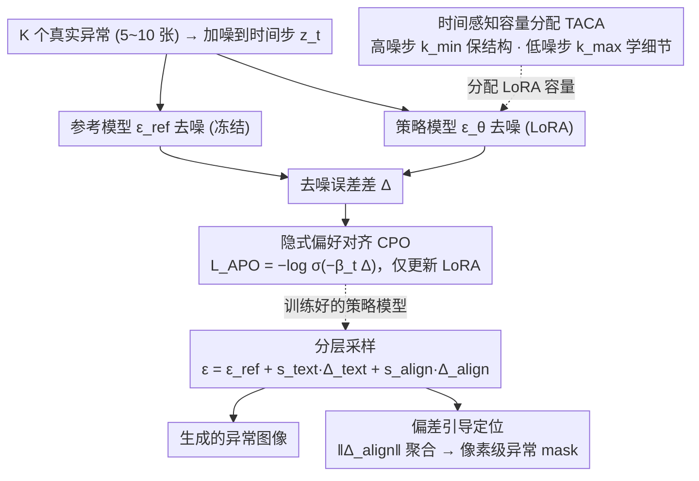

# Anomaly-Preference Image Generation (APO)

**会议**: ICML 2026  
**arXiv**: [2605.02439](https://arxiv.org/abs/2605.02439)  
**代码**: 论文未明确公开  
**领域**: 扩散模型 / 工业异常检测 / 偏好对齐  
**关键词**: 少样本异常生成, DPO, 隐式偏好, 时间感知 LoRA, 分层采样

## 一句话总结
作者把"少样本异常图像生成"重写为"无人工标注的偏好优化问题"：真实异常作为正样本，参考模型在同一时刻的去噪偏差作为隐式负样本，通过 DPO 风格 loss 让扩散模型对齐异常分布；再用按时间步调节 LoRA rank 的 TACA 保住结构多样性、用分层 CFG 调节文本-异常对齐强度，在 MVTec 等 benchmark 上同时刷新真实度和多样性。

## 研究背景与动机
**领域现状**：工业视觉异常检测受限于"缺陷样本稀缺 + 标注昂贵"，主流做法是用扩散模型从少量真实异常中合成更多样本来增广检测器。方案分两派：fine-tuning 派（如 AnomalyDiffusion、DualAnoDiff、SeaS）和 training-free 派（如 AnomalyAny）。

**现有痛点**：fine-tuning 派常把外观和位置解耦学习导致语义不一致、双流架构特征冲突梯度互相干扰；training-free 派把所有计算压到推理时、延迟爆炸。两类方法都没显式约束"生成分布要对齐真实异常分布"，导致要么过拟合（多样性差），要么分布漂移（真实度差）。

**核心矛盾**：现实和多样性之间存在 trade-off。直接套 DPO 需要成对偏好数据（正负样本都得是模型生成的），但少样本场景下根本凑不齐人工偏好对——既要做分布对齐，又没有人工偏好信号。

**本文目标**：（1）构造一个无需人工标注的稳定优化目标，直接做生成与目标异常的分布对齐；（2）在对齐的同时不牺牲多样性；（3）推理时能调节"基础模型连贯性"和"异常模式对齐"之间的比例。

**切入角度**：DPO 的核心是 KL-正则化的策略优化，关键 trick 在于把 reward 重参数化成 $\beta\log\frac{p_\theta}{p_\text{ref}}$。如果只用一组真实异常做正样本、把"参考模型在同一 $\mathbf{z}_t$ 上的去噪误差"当作隐式 baseline，就能不用人工负样本而直接拿到偏好梯度——核心 idea 由此而来。

**核心 idea**：用"策略模型相对参考模型的去噪偏差 $\Delta = \|\hat\epsilon_\theta-\epsilon\|^2 - \|\hat\epsilon_\text{ref}-\epsilon\|^2$"代替 DPO 中的成对偏好对数比，把少样本异常生成变成一个可解析、稳定的隐式偏好优化问题。

## 方法详解

### 整体框架
APO 要解决的是"手里只有 K 个（量级 5~10）真实异常样本，却想让扩散模型生成既真实又多样的新异常"这件事，而难点在于既没有人工偏好对来做分布对齐、又容易在 fine-tune 时丢掉多样性。它的解法是把任务重写成一个隐式偏好优化问题：训练时拿真实异常加噪到任意时间步，同时让冻结的参考模型 $\epsilon_\text{ref}$ 和待训练的策略模型 $\epsilon_\theta$ 各去噪一次，用两者去噪误差的差值当偏好信号去更新一组时间感知 LoRA；推理时再把去噪预测拆成"无条件 + 文本条件 + 异常对齐"三个可独立调权的分量，并顺手把对齐分量的强度聚合成像素级异常定位图。三块设计——CPO、TACA、分层采样——分别对应"对齐目标分布""保住多样性""推理可控 + 免费定位"。

### 关键设计

**1. 隐式偏好对齐 CPO：把 DPO 改写成无成对标注的形式**

针对的痛点是少样本异常场景根本凑不齐 DPO 需要的 $(\mathbf{z}^w, \mathbf{z}^l)$ 人工偏好对，但又想保留 DPO 那种 KL 正则化带来的训练稳定性。作者从约束优化 $\max_\theta \mathbb{E}[\mathcal{R}] - \beta D_\text{KL}(p_\theta \| p_\text{ref})$ 出发，得到最优策略形如 $p^*_\theta \propto p_\text{ref}\exp(\mathcal{R}/\beta)$，再把 reward 重参数化成 $\mathcal{R} = \beta\log\frac{p_\theta}{p_\text{ref}}$。关键一步是用变分 ELBO 把"扩散轨迹上的 KL 之差"化简成 closed-form $\delta = \frac{1}{2}\mathbb{E}_t[\lambda'_t(\|\hat\epsilon_\theta-\epsilon\|^2 - \|\hat\epsilon_\text{ref}-\epsilon\|^2)]$，其中 $\lambda'_t$ 是 log-SNR 的时间导数。这样一来负样本就不必由模型生成，而是用"参考模型在同一 $\mathbf{z}_t$ 上的去噪期望"当天然 baseline——等价于声明"任何真实异常都被偏好于参考模型在该噪声水平上的预测"。

记两模型去噪误差之差为 $\Delta = \|\hat\epsilon_\theta-\epsilon\|^2 - \|\hat\epsilon_\text{ref}-\epsilon\|^2$，最终 loss 就是 $\mathcal{L}_\text{APO} = -\log\sigma(-\beta_t\Delta)$，时间自适应权重 $\beta_t = -\frac{1}{2}\beta\lambda'_t$。$\Delta < 0$ 表示策略模型比参考模型更贴近真实异常分布，sigmoid 把这种"更好"转成偏好概率，单调的 log-sigmoid 比纯 L2 更不容易在少量样本上过拟合，既免去标注成本又保住了稳定性。

**2. 时间感知容量分配 TACA：按噪声水平重新分配 LoRA 容量**

针对的痛点是对所有时间步统一 fine-tune 时，高噪步会过拟合到训练样本的背景模式，从而压制结构多样性。TACA 的观察是扩散去噪在高噪步主要决定全局结构（layout/composition）、在低噪步才决定纹理细节，因此模型容量应该沿时间轴分配而非一视同仁。具体把 LoRA 的权重更新写成 $\Delta W_t = B \cdot G_t \cdot A$，其中 $G_t$ 是按维度选择的对角 mask，激活维度数 $k(t) = \lfloor k_\text{min} + (k_\text{max}-k_\text{min})(T-t)/T \rfloor$：$t\to T$（高噪）时 $k\to k_\text{min}$、几乎不动以保住结构多样性，$t\to 0$（低噪）时 $k\to k_\text{max}$、大幅适配以学到细粒度异常细节。这一行 mask 改动尊重了扩散过程本身的物理意义，让结构多样性和异常细节同时保住，是真实度 vs 多样性 trade-off 的根因解法之一。

**3. 分层采样 + 偏差引导定位：推理可控并免费产出异常 mask**

针对的痛点是传统 CFG 只有一个 scale，无法把"文本语义强度"和"异常模式强度"分开调。分层采样把去噪预测写成 $\hat\epsilon = \epsilon_\text{ref}(\mathbf{z}_t, t) + s_\text{text}\Delta_\text{text} + s_\text{align}\Delta_\text{align}$，其中 $\Delta_\text{text} = \epsilon_\text{ref}(\mathbf{z}_t, \mathbf{c}, t) - \epsilon_\text{ref}(\mathbf{z}_t, t)$ 控制文本条件强度、$\Delta_\text{align} = \epsilon_\theta(\mathbf{z}_t, \mathbf{c}, t) - \epsilon_\text{ref}(\mathbf{z}_t, \mathbf{c}, t)$ 控制异常对齐强度。两个 scale 独立可调，等价于从引导分布 $p_\text{ref} \cdot (p_\text{ref}^{\mathbf{c}}/p_\text{ref})^{s_\text{text}} \cdot (p_\theta^{\mathbf{c}}/p_\text{ref}^{\mathbf{c}})^{s_\text{align}}$ 采样，用户由此能在"基础模型连贯性"和"异常模式对齐"之间细粒度滑动。更妙的是异常定位是免费副产品：把 $\|\Delta_\text{align}\|$ 按 TACA 权重 $k(t)$ 加权聚合，再双线性上采样 + 高斯平滑，就得到像素级异常图 $\mathbf{P}_\text{anomaly}$——因为对齐偏差本身就是异常 saliency 的最佳指标，训练时根本无需定位监督。

### 损失函数 / 训练策略
仅训练 LoRA 适配器，参考模型 $\epsilon_\text{ref}$ 完全冻结。loss 单一项 $\mathcal{L}_\text{APO} = -\log\sigma(-\beta_t\Delta)$，时间步 $t \sim \mathcal{U}(0,T)$ 均匀采样、噪声 $\epsilon \sim \mathcal{N}(0,\mathbf{I})$。$\beta$ 控制 KL 强度，$\beta_t$ 自动按 log-SNR 缩放。

## 实验关键数据

### 主实验（MVTec 真实度 + 多样性）
对比 Crop&Paste、DFMGAN、AnomalyDiffusion、DualAnoDiff、AnomalyAny、SeaS。两个核心指标：IS（Inception Score，越高越真实/多样）和 IC-LPIPS（Intra-Class LPIPS，越高越多样）。

| 类别 | 指标 | AnomalyDiff | DualAnoDiff | SeaS | APO (本文) |
|------|------|-------------|-------------|------|------------|
| bottle | IS / IC-L | 1.58 / 0.19 | 2.17 / 0.43 | 1.78 / 0.21 | **2.19 / 0.45** |
| cable | IS / IC-L | 2.13 / 0.41 | 2.15 / 0.43 | 2.09 / 0.42 | **2.20 / 0.45** |
| capsule | IS / IC-L | 1.59 / 0.21 | 1.62 / 0.32 | 1.56 / 0.26 | **2.18 / 0.34** |
| carpet | IS / IC-L | 1.16 / 0.24 | 1.36 / 0.29 | 1.13 / 0.25 | **1.39 / 0.36** |

APO 在每个类别上几乎都同时刷新两个指标——即真实度和多样性同时变好，而不是此消彼长。

### 消融实验

| 配置 | 关键观察 | 说明 |
|------|----------|------|
| 仅 CPO（无 TACA） | 真实度好但多样性掉 | 验证 TACA 是多样性的关键 |
| 仅 TACA（无 CPO） | 多样性好但分布漂移 | 验证 CPO 是真实度的关键 |
| Full APO | 两者兼顾 | 两个模块互补、缺一不可 |
| 调 $s_\text{text}, s_\text{align}$ | 在 trade-off 曲线上平滑滑动 | hierarchical sampling 提供细粒度可控性 |

### 关键发现
- CPO 和 TACA 是正交贡献：前者管"对齐目标分布"、后者管"保留生成多样性"，两个一起上才能同时拿到真实度和多样性的双 SOTA。
- 异常定位 mask 是 free lunch：训练时根本没显式监督定位，但 $\|\Delta_\text{align}\|$ 自然反映异常区域，下游检测器拿来当伪标签直接用。
- DPO 重参数化的 $\beta_t$ 自动随 log-SNR 缩放，比固定 $\beta$ 训练稳定得多——这套时间自适应权重对扩散模型上的偏好学习有普适价值。

## 亮点与洞察
- **把 DPO 推广到无成对偏好的扩散场景**：用"参考模型的去噪误差"代替"模型生成的负样本"，是一种简洁而有力的偏好信号设计；不止异常生成，任何"我有一小撮 target 分布、想让扩散模型对齐"的少样本场景都能套用。
- **沿时间步分配模型容量的思想**：TACA 是个一行代码改动（按 $t$ 调 LoRA mask），但极大地缓解了 fine-tune 时高噪步过拟合背景的问题。这套"按 noise schedule 分配可训练参数"的思路可以迁移到风格迁移、定制化生成等任何 LoRA fine-tune 场景。
- **对齐偏差当 saliency map**：训练时完全没做定位监督，推理时却自动产出像素级 mask，这种"分布对齐 → 隐式定位"的副产品在工业部署里直接省一个 segmentation head。

## 局限与展望
- 只在工业异常（MVTec、VisA 这类）上验证，对医学异常、自然场景缺陷的迁移性需要进一步实验。
- 推理时多了一倍前向（要同时跑 $\epsilon_\theta$ 和 $\epsilon_\text{ref}$），实时性应用需要做模型蒸馏。
- TACA 的 $k_\text{min}, k_\text{max}$ 是手工设计 schedule，能否数据驱动地学出最优分配 schedule 是开放问题。
- 极少样本场景（K=1 或 2）下 CPO 是否仍稳定文中没专门探索，作者实验里用的 K 量级在 5~10。

## 相关工作与启发
- **vs AnomalyDiffusion / DualAnoDiff**：那些用 textual inversion 或双流架构 fine-tune，本文用偏好学习 + LoRA，框架更轻、更稳。
- **vs SeaS**：SeaS 走 unified multi-task 路线，本文走"先对齐分布、再分层采样"路线，二者哲学不同；本文优势是真实度-多样性 Pareto 更优。
- **vs DPO/Diffusion-DPO (Wallace 2024)**：经典 Diffusion-DPO 需要 human-ranked image pairs；本文用真实样本 + 参考模型偏差代替，是首个把 DPO 应用到 "no preference pairs available" 场景的扩散方法。
- **vs 各类 RLHF for diffusion**：传统 RLHF 要先训 reward model 再 PPO；APO 一步到位、loss 单项、训练成本与标准 fine-tune 同量级。

## 评分
- 新颖性: ⭐⭐⭐⭐⭐ 把 DPO 改造成"无成对偏好"的隐式形式，思路非常巧妙
- 实验充分度: ⭐⭐⭐⭐ MVTec 全类别 + 多基线 + 多指标，扎实；可惜未对极小 K 做敏感性分析
- 写作质量: ⭐⭐⭐⭐ 数学推导清晰、伪代码完整；少数符号略密
- 价值: ⭐⭐⭐⭐⭐ 异常生成 + 缺陷检测增广在工业上需求强烈，方法可直接落地

<!-- RELATED:START -->

## 相关论文

- [\[CVPR 2025\] DualAnoDiff: Dual-Interrelated Diffusion Model for Few-Shot Anomaly Image Generation](../../CVPR2025/image_generation/dual-interrelated_diffusion_model_for_few-shot_anomaly_image_generation.md)
- [\[ICML 2025\] Preference Adaptive and Sequential Text-to-Image Generation](../../ICML2025/image_generation/preference_adaptive_and_sequential_text-to-image_generation.md)
- [\[CVPR 2025\] Boost Your Human Image Generation Model via Direct Preference Optimization](../../CVPR2025/image_generation/boost_your_human_image_generation_model_via_direct_preference_optimization.md)
- [\[ICML 2026\] E²PO: Embedding-perturbed Exploration Preference Optimization for Flow Models](embedding-perturbed_exploration_preference_optimization_for_flow_models.md)
- [\[ICML 2026\] Offline Preference Optimization for Rectified Flow with Noise-Tracked Pairs](offline_preference_optimization_for_rectified_flow_with_noise-tracked_pairs.md)

<!-- RELATED:END -->
