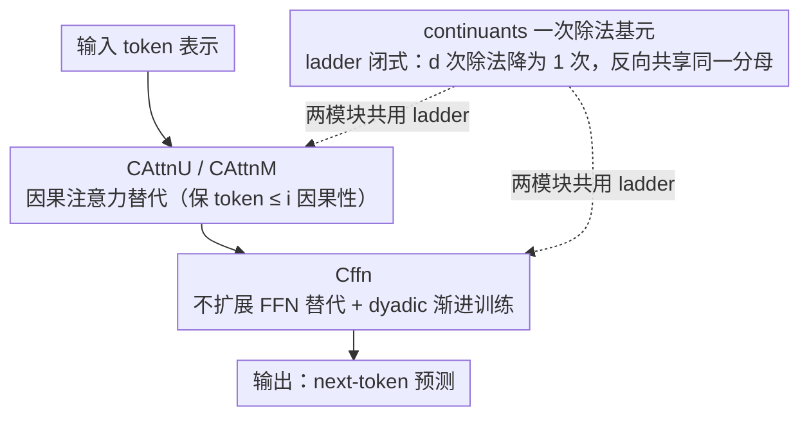

# CoFrGeNet: Continued Fraction Architectures for Language Generation

**会议**: ICML 2026  
**arXiv**: [2601.21766](https://arxiv.org/abs/2601.21766)  
**代码**: 论文未公开（IBM Research）  
**领域**: LLM 高效架构 / 语言生成 / Transformer 替代  
**关键词**: 连续分数、CoFrNet、注意力替代、FFN 替代、参数高效

## 一句话总结
本文把"连续分数（continued fraction）"这种具备最优有理逼近性质的函数类引入到语言生成 Transformer 中，分别为多头注意力和 FFN 设计 CoFrNet 替代模块（CAttnU/CAttnM/Cffn），通过"continuants"封闭形式把 $d$ 次除法降为 1 次，在 GPT2-xl 和 Llama-3.2B 上用 $\frac{2}{3}\sim\frac{1}{2}$ 的参数实现持平甚至更优的下游性能。

## 研究背景与动机
**领域现状**：Transformer 是当下语言模型主流，但 attention 的二次复杂度 + FFN 的 4-8× 参数扩展使得模型规模高速增长。围绕这两个组件已有大量改进：Linformer/Synthesizer 把 attention 线性化、Multi-Query/GQA 减 KV 头、Slim Attention 去 value 矩阵、Sparse Attention 限制 token 跨度，但**几乎都还在"注意力"或"标准 MLP"这个函数类内做减法**。SSM/Mamba 走另一条路但仍是隐状态线性递推。

**现有痛点**：(1) 这些方法多数在保持参数量近似下做加速，要么牺牲表达力（线性 attention 性能掉点），要么需要复杂调参（MoE/sparse）；(2) 同时**没有人系统地换函数类**——所有变种本质都是矩阵乘 + softmax + ReLU/GELU 这种"多项式 + 元素非线性"的组合。

**核心矛盾**：要在模型质量不掉的情况下大幅压参，纯粹依赖现有函数类（多项式 + 激活）很难突破——因为**多项式近似在固定阶下表达力上限明确**；而**连续分数（有理函数）在同样阶下能更紧地逼近任意函数**（这是数论中的经典结论：截断分数比同分母任意有理数都更接近真实值）。

**本文目标**：把 (Puri et al. 2021) 的 CoFrNet 从**监督学习扩展到生成建模**，具体要解决三个新问题：(a) 输出从标量变多维，(b) 序列因果性约束，(c) 把 $1/x$ 非线性的 $d$ 次除法降下来（除法在硬件上比乘法慢一个量级）。

**切入角度**：先用连续分数的"continuant 多项式"表达 $\tilde f(a) = K_{d-1}(a_2,\dots,a_d) / K_d(a_1,\dots,a_d)$，把整条阶梯压成"两次多项式相除"，再封闭形式推导梯度同样可表为 continuant 之比——这样不管 $d$ 多深都只需要算一次 $1/K_d$。

**核心 idea**：**用"连续分数 ladder 集合 + continuant 闭式计算"代替 attention 的 QKV 矩阵乘和 FFN 的扩展隐层**，在数学上换函数类、在工程上把除法砍到 $O(1)$ 次。

## 方法详解

### 整体框架
CoFrGeNet 要解决的是"在不掉点的前提下大幅压参"，做法是把 Transformer block 里的两大耗参组件直接换成连续分数函数类：causal multi-head attention 换成 CAttnU / CAttnM 两种 ladder 实现，FFN 换成不扩展的 Cffn。所有替代模块共用同一套 ladder 集合形式 $y = Ux + Vz,\ z_j = \tilde f(W^{(j)} x)$（(8) 式）：每根 ladder $j$ 先用参数 $W^{(j)}$ 把输入投成 $d$ 维 partial denominator，CF 层再用 continuant 递推算出连续分数值 $z_j = K_{d-1}/K_d$，最后线性组合成输出，整条前向与反向都封装进一个自定义 `autograd.Function`。

### 关键设计

**1. 基于 continuants 的「一次除法」实现：让深 ladder 不再被除法拖死**

连续分数 ladder 越深表达力越强，但标准实现 (1) 式每一层都要做一次倒数，$d$ 层就是 $d$ 次除法，而现代 GPU 上除法比乘法慢 5-20×，深 ladder 根本跑不动。本文用 continuant 多项式改写整条阶梯：按 (4)(5) 的递推 $K_k(a_{d-k+1},\dots,a_d) = a_{d-k+1} K_{k-1} + K_{k-2}$ 只用 $O(d)$ 次加乘就能算出全部 continuant，连续分数值写成 $\tilde f(a) = K_{d-1}/K_d$ 只剩一次除法。更关键的是 Proposition 1 给出梯度的闭式 $\partial \tilde f / \partial a_k = (-1)^k \big(K_{d-k}(a_{k+1},\dots,a_d) / K_d(a_1,\dots,a_d)\big)^2$——所有偏导共享同一个分母 $K_d$，于是反向传播同样只需算一次 $1/K_d$ 再复用到 $d$ 个梯度。实现上封成 `torch.autograd.Function`，前向把 $K_*$ 和 $1/K_d$ saved-for-backward 缓存下来，并只对 $K_d$ 做一次 $\text{sgn}(K_d)\max(|K_d|,\epsilon)$ 钳制防止极点发散（比 Puri et al. 2021 每层 clip $d$ 次保留更多表达力）。效果是 CoFrGeNetB（朴素实现）推理 5898 μs，改用 continuants 后降到 628 μs，接近 10× 加速，让深 ladder 真正变得可用。

**2. 因果注意力替代 CAttnU / CAttnM：在保因果的前提下做 token-token 混合**

attention 的难点在于换成 ladder 后要保住因果性（token $i$ 只能看 $\le i$）。CAttnU 走 MLP-Mixer 路线：先把张量在 embedding 维和序列长 $l$ 上转置，再用 **univariate ladder** 让每个输出只吃同一 token 的单维信息，两个 ensemble 分别输出 $y_1 = w_0^{(1)} \odot x + (w_1^{(1)} \odot x)^{\circ-1}$ 和 $y_2$，各自接一个**上三角线性层** $U_1, U_2$ 把感受野限死在 $\le i$，最后 $O = U_1 y_1 \odot U_2 y_2$ 用逐元素乘造出跨维交叉项——这一步很关键，因为单条 univariate ladder 表达力弱，元素乘补回了维度间的相互作用。CAttnM 则更像"轻量化标准 attention"：不转置，用 $L$ 根 $p$-variate ladder 算出 $y_1, y_2$，拼接后过全连接 $F$，再用 causal softmax 得到注意力权重 $A = \text{Csoftmax}([y_1, y_2] F)$（第 $i$ token 只看 $\le i-1$），最后照常 $O = AV$（$V = X W^v$）。两者把 attention 的参数从 $4p^2$ 分别降到 $l(2d+l+1)$（CAttnU）和 $L(p+l)+p^2$（CAttnM），当 $l \sim p$（GPT/Llama 的典型规模）时省参可观；CAttnU 更激进省参，CAttnM 保留 value 矩阵更稳但稍重，报告默认用 CAttnM。

**3. 不扩展的 Cffn 与 dyadic 渐进训练：砍掉 FFN 扩展并稳住有理函数训练**

标准 FFN 靠 $\alpha\sim4$ 倍隐层扩展贡献了大半参数，本文认为这部分对连续分数函数类是冗余的。Cffn 直接用 $L$ 根 $p$-variate ladder（不转置，特征跨维混合不破坏因果性），输入取 gated 的 non-expanded（$\alpha=1$）表示，把参数从 $2\alpha p^2$ 压到 $Lp(d+1) + 2p^2$。但有理函数在 $K_d \to 0$ 附近梯度极尖锐，全参数从头训会发散，所以配套一个 **dyadic schedule**：先只更新线性主干，过 $t/2$ 步后才放开 depth-1 ladder，过 $3t/4$ 步后放开 depth-2，depth-$i$ 只在最后 $t/2^i$ 步训练——本质是"先收敛到多项式解、再逐级释放高阶有理修正"的 curriculum。这一调度不可省：Table 5 显示去掉 dyadic 后 OWT 上 PTB 从 29.89 劣化到 33.72、Wikitext2 从 17.12 暴涨到 26.71。

### 损失函数 / 训练策略
保持 GPT2-xl / Llama 原生的 next-token cross-entropy；优化器 Adam，学习率 GPT2-xl 预训练 $6\times 10^{-4}$、微调 $0.25\times 10^{-4}$（baseline）与 $0.125\times 10^{-4}$（CoFrGeNet），weight decay 0.1，无 dropout。极点保护 $\epsilon = 0.01$；ladder 深度 $d$ 和宽度 $L$ 均取自 $\{1,3,5,7\}$。GPT2-xl 在 16 张 H100 上 DDP 训练，Llama 在 128 张 H100 上 FSDP 训练 2M 步。

## 实验关键数据

### 主实验
GPT2-xl（1.5B）vs CoFrGeNet 三个变体，OWT 和 GneissWeb（GW）预训练，下游 GLUE 微调：

| 数据 | 模型 | 参数 | MNLI | QQP | QNLI | SST2 | COLA | MRPC | RTE |
|------|------|------|------|-----|------|------|------|------|-----|
| OWT | GPT2-xl | 1.5B | 86.89 | 88.93 | 91.35 | 93.56 | 81.78 | 79.83 | 60.27 |
| OWT | **CoFrGeNet-F** | **985M** | **87.26** | **89.95** | **91.89** | **94.16** | **82.59** | **80.21** | **61.35** |
| OWT | CoFrGeNet (双替换) | **798M** | 87.11 | 89.36 | 91.79 | 93.91 | 81.97 | 79.93 | 61.25 |
| OWT | Synthesizer-D | 1.2B | 84.93 | 86.82 | 90.13 | 91.34 | 80.15 | 77.95 | 59.83 |
| OWT | Sparse Attn | 1.21B | 85.27 | 86.38 | 90.93 | 92.72 | 80.76 | 77.42 | 59.36 |
| GW | GPT2-xl | 1.5B | 78.28 | 86.83 | **82.93** | 91.82 | 74.18 | 77.72 | 60.19 |
| GW | **CoFrGeNet-F** | 985M | **79.62** | **87.26** | 82.73 | **92.36** | **74.83** | **78.01** | **61.35** |
| GW | CoFrGeNet | **798M** | 79.05 | 86.98 | 82.12 | 92.13 | 74.38 | 77.95 | 61.11 |

下游困惑度（OWT 预训练）：

| 模型 | 参数 | PTB | Wikitxt2 | Lbda | AgNews | LM1B | Wikitxt103 |
|------|------|-----|---------|------|--------|------|-----------|
| GPT2-xl | 1.5B | 30.12 | 18.30 | 8.66 | 37.13 | 41.20 | 17.50 |
| **CoFrGeNet-F** | **985M** | **29.89** | **17.12** | **8.12** | **35.72** | **40.14** | **16.14** |
| CoFrGeNet | 798M | 30.03 | 17.96 | 8.55 | 36.47 | 40.86 | 17.17 |
| Synthesizer-D | 1.2B | 31.47 | 19.35 | 9.92 | 39.84 | 41.94 | 18.91 |

### 消融实验

| 配置 | 关键指标 | 说明 |
|------|---------|------|
| Continuants vs 朴素实现（CoFrGeNetB） | Inference 628 vs 5898 μs | **10× 推理加速**，验证 continuant 形式必要性 |
| Continuants 训练时间 | 178 hr vs 203 hr (CoFrGeNetB) | 训练快 12-13%（CoFrGeNet 双替换甚至比 GPT2-xl 还快 6%） |
| w/o dyadic schedule (CoFrGeNet-F OWT) | Wikitext2 PPL 17.12 → 26.71 | 渐进训练贡献巨大，无它直接劣化 50%+ |
| 仅替换 FFN（CoFrGeNet-F 985M）vs 仅替换 attention（CoFrGeNet-A 1.21B） | F 普遍最优 | FFN 替换贡献大于 attention 替换 |
| CAttnM vs CAttnU | M 略优 | 报告中默认 CAttnM |

### 关键发现
- **FFN 比 attention 更值得替换**：CoFrGeNet-F（只换 FFN）参数最少（985M）反而效果最好，说明 transformer 的"参数冗余"主要在扩展 FFN 而非 attention；这与 transformer 可解释性社区"FFN 是记忆库"的共识相印证——记忆库不需要 $4\times$ 扩展，CoFrNet 的有理函数表达力够用。
- **Continuant 实现是工程关键**：没有它，连续分数因为除法成本根本不实用；有了它，深 ladder 也几乎无开销，从而把这类函数族真正变成可落地的 attention/FFN 替代。
- **小模型同样有效**：Llama-3.2B（已用 GQA 的高效 attention baseline）上 CoFrGeNet 在 openbookqa/piqa/arc-easy/sciq 等 8 个开放域问答和推理任务都能竞争或更优（详细数字见附录 Table 6），说明方法在不同骨架上都鲁棒。
- **保留极点处理 + 输出裁剪**：测试时把 ladder 输出裁到训练区间防止极点爆炸，是工程上必要的稳健化。

## 亮点与洞察
- **"换函数类"是 transformer 架构创新的稀缺方向**：本文几乎是近几年第一次系统证明"非多项式 + 非元素激活"的函数类（连续分数/有理函数）能在生成模型上有竞争力，给"在 attention/MLP 之外找替代"打开了实证窗口。
- **数论性质直接转译为工程效率**：continuant 是 18 世纪就有的工具，本文巧妙利用其"梯度也是 continuant 之比"的性质把 $d$ 次除法降到 1 次——这种"用经典数学结构换硬件友好度"的思路非常优雅，可迁移到任何需要深层有理近似的场景（ODE 网络、neural rational diffusion）。
- **"plug-in 替换"对工业落地极友好**：因为 ladder 只是替换 MHA 和 FFN，整个训练/推理流水线（数据、tokenizer、KV cache、LoRA 等）无需任何改动，对接成本接近 0，特别适合大型 industry workflow。
- **Dyadic 渐进训练**值得作为有理网络/分数网络的通用 trick——把"线性主干 → 高阶修正"分阶段释放，是控制有理函数训练不稳定性的简洁办法，可类比 progressive growing 之于 GAN。

## 局限与展望
- **没开源代码**：限制了独立复现和后续 follow-up；IBM 内部似乎主要做 GPT2-xl 和 Llama-3.2B 这两种规模，缺 7B/13B 的实证。
- **未触及现代 attention 优化栈**：CAttnM 形式上还需要算 $l \times l$ 的 causal softmax，没法直接兼容 FlashAttention/PagedAttention，工程上的 wall-clock 优势可能被这些底层优化抵消。
- **数值稳定性边界不清**：$\epsilon$ 钳制虽然避免极点，但训练后期模型是否会"靠近极点博弈梯度"作者没分析；不同领域/数据下的稳定区间需要更多研究。
- **与 SOTA 大模型的对照缺位**：与 Mamba/RWKV/Linear Attention 等"非 transformer"高效路线没直接比较，且 baseline 是 GPT2 系列（已经较老），与 Llama-3-8B、Mistral 等同代模型的相对位置不清晰。
- **可迁移到其他架构**：作者明确把"用 CoFrNet 替换 Mamba 隐状态函数"列为未来工作；同理也可考虑替换 ViT/Diffusion Transformer 的 MLP 块。

## 相关工作与启发
- **vs Synthesizer-D / Sparse Attention**：本文在同等或更少参数下显著优于这两类经典高效 attention，说明"换函数类"比"压稀疏"或"换 QK 形式"更有效。
- **vs Multi-Query / GQA**：MQA/GQA 通过共享 K/V 头压参数；CoFrNet 通过换 ladder 替换 QKV 整体；两者正交，理论上可以叠加（CoFrGeNet-F 已与 Llama 的 GQA 共存验证可叠加性）。
- **vs Linformer / Linear Attention**：线性 attention 牺牲表达力换 $O(n)$；CoFrNet 不动复杂度但换函数类，主要解决参数和质量问题，目标不同。
- **vs CoFrNets (Puri et al. 2021)**：原始 CoFrNet 只在监督学习上验证了通用近似，本文是其在生成建模上的首次成功落地，并解决了"多维输出 + 因果性 + 除法效率"三个新难题——把一项学术工作真正工程化。
- **vs Mamba / RWKV**：本文承认未与 SSM 直接比，并把"用 CoFrNet 重新设计 SSM 隐状态函数"作为未来工作，留出广阔空间。

## 评分
- 新颖性: ⭐⭐⭐⭐⭐ 系统把连续分数引入语言生成是近年罕见的"换函数类"型创新，continuant 工程化方案也是首创。
- 实验充分度: ⭐⭐⭐⭐ GPT2-xl + Llama-3.2B 两种骨架、OWT + GneissWeb + docling 三个预训练集、GLUE + 6 PPL 数据集 + 8 个 QA/推理任务，覆盖比较全；但缺 7B+ 大模型与 wall-clock 对比。
- 写作质量: ⭐⭐⭐⭐ 数学推导严谨（Proposition 1 + 附录 Lemma 2）、架构图清晰；但符号偏密（$y_1, U_1, F, A$ 含义需反复对照），新读者门槛高。
- 价值: ⭐⭐⭐⭐ 对"如何在不掉点的前提下减 1/3-1/2 参数"给出可即插即用的方案，工业落地价值高；学术上为"非多项式函数类做 LM"开辟新方向。

<!-- RELATED:START -->

## 相关论文

- [\[ICML 2025\] Representative Language Generation](../../ICML2025/image_generation/representative_language_generation.md)
- [\[ICML 2026\] Esoteric Language Models: A Family of Any-Order Diffusion LLMs](esoteric_language_models_a_family_of_any-order_diffusion_llms.md)
- [\[CVPR 2026\] VecGlypher: Unified Vector Glyph Generation with Language Models](../../CVPR2026/image_generation/vecglypher_unified_vector_glyph_generation_with_language_models.md)
- [\[CVPR 2025\] Language-Guided Image Tokenization for Generation](../../CVPR2025/image_generation/language-guided_image_tokenization_for_generation.md)
- [\[ACL 2026\] Multimodal Large Language Models for Multi-Subject In-Context Image Generation](../../ACL2026/image_generation/multimodal_large_language_models_for_multi-subject_in-context_image_generation.md)

<!-- RELATED:END -->
