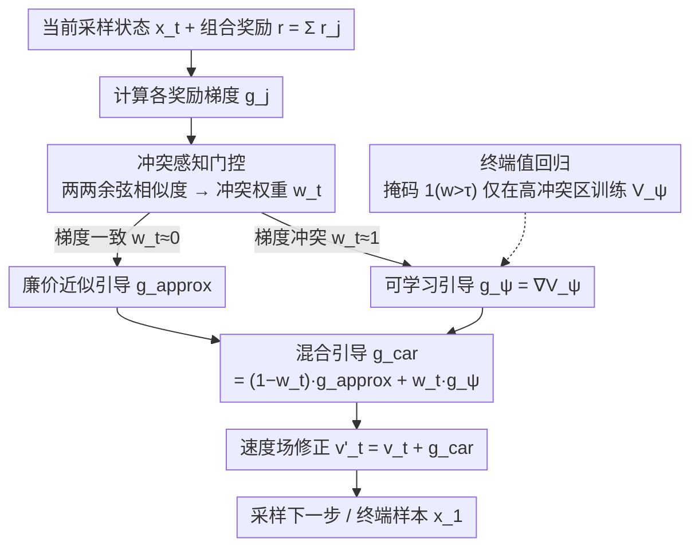

# Conflict-Aware Additive Guidance for Flow Models under Compositional Rewards

**会议**: ICML2026  
**arXiv**: [2605.20758](https://arxiv.org/abs/2605.20758)  
**代码**: https://github.com/yuxuehui/CAR-guidance  
**领域**: 图像生成  
**关键词**: 推理时引导, 流匹配, 组合奖励, 梯度冲突, 偏离流形

## 一句话总结

针对流模型在多目标组合奖励下推理时引导易产生 off-manifold drift 的问题，提出 Conflict-Aware Additive Guidance (CAR)，通过检测梯度冲突并动态切换可学习的值梯度修正，以极低额外计算代价将身份保留提升 25.4%、规划成功率提升 38.75%。

## 研究背景与动机

**领域现状**：连续时间流模型（Rectified Flow、Flow Matching）已成为强大的生成范式，推理时引导（inference-time guidance）通过在基础向量场上叠加梯度项 $g_t(x_t,t)$ 来满足外部约束，无需微调即可实现可控生成。

**现有痛点**：近似引导方法（如 $g^{\text{cov-G}}$）计算高效但在组合多个奖励函数时极易产生 off-manifold drift——生成样本偏离数据流形进入低密度区域，导致图像失真或规划轨迹出现幻觉跳跃。精确引导方法（Guidance Matching、GLASS-FKS）虽能避免漂移，但前者需要满足所有约束的真值样本，后者计算量高出 $3\times$ 以上。

**核心矛盾**：多奖励函数的梯度方向相互冲突时，近似引导的误差会随梯度错位 $(1 - \cos\phi)$ 和奖励函数数量 $G$ 急剧放大，形成"能量陷阱"将轨迹捕获到流形外。

**本文目标**：在近似引导的计算量级上，消除组合奖励场景下的 off-manifold drift。

**切入角度**：从测度传输理论出发，将近似误差分解为耦合偏移、梯度错位、局部近似三个可归因的项，发现梯度错位是组合场景下误差主因。

**核心 idea**：用冲突感知门控动态检测梯度冲突区域，仅在高冲突区激活轻量可学习引导进行修正。

## 方法详解

### 整体框架

CAR 要解决的是：流模型在推理时叠加多个奖励的近似引导，组合起来很容易把样本推离数据流形。它的做法是不再全程用同一种引导，而是在每个采样步根据"这些奖励的梯度有没有打架"来动态决定引导怎么算。给定预训练流模型 $v_t(x_t,t)$ 和组合奖励 $r(x_1) = \sum_{j=1}^G r_j(x_1)$，推理时把速度场改写为 $v'_t = v_t + g^{\text{car}}$，其中引导项是廉价近似引导 $g^{\text{approx}}$ 和可学习引导 $g_\psi$ 的混合 $g^{\text{car}} = (1 - w_t) g^{\text{approx}} + w_t g_\psi$，混合权重 $w_t$ 由梯度冲突程度自己决定。

### 关键设计

**1. 近似误差三项分解：先搞清组合引导为什么会漂**

方法的出发点是回答一个理论问题——近似引导在单奖励时好用，为什么一组合多个奖励就崩。CAR 从测度传输角度，把精确目标分布与近似实现之间的 $W_2^2$ 误差拆成三项：(A) 耦合偏移误差，对应近似假设 $\mathcal{P}(z) \approx 1$ 带来的偏差；(B) 梯度错位误差，量级正比于 $G(G-1)\mu^2(1-\cos\phi)$；(C) 局部近似误差。关键结论在项 (B)：它随奖励数 $G$ 二次增长，又与奖励梯度间的角度偏差 $(1-\cos\phi)$ 成正比。这就解释了单奖励（无错位项）时近似引导足够好，而多约束一旦方向冲突，误差会被 $G$ 和 $\cos\phi$ 两头放大，把轨迹拽进流形外的低密度"能量陷阱"。这一分解直接告诉后续设计：要修的不是全程，而是梯度错位严重的那些区域。

**2. 冲突感知门控：只在梯度打架的地方花钱**

既然误差主因是梯度错位，CAR 就用一个门控在每个采样步自动判断当前要不要上重武器。它先算所有奖励梯度两两之间的平均余弦相似度，得到原始冲突分数

$$w_{\text{raw}} = 1 - \frac{2}{G(G-1)} \sum_{j<k} \frac{\langle g_j, g_k \rangle}{\|g_j\|\|g_k\| + \varepsilon},$$

再映射到 $(0,1)$ 当作混合权重 $w_t$。梯度方向基本一致时 $w_t \approx 0$，引导几乎全用廉价近似，零额外开销；梯度互相冲突时 $w_t \approx 1$，切换到可学习引导去精修。这与 PCGrad 这类把梯度互相投影去冲突的做法不同——后者全程都在改梯度但收益边际，而门控是"按需修正"，把额外计算只投到真正需要的时空区域，所以合成数据上平均推理时间能压到 1.65ms 量级。

**3. 终端值回归：让可学习引导稳定训出来**

冲突区要用的 $g_\psi$ 需要先学好，CAR 把它参数化成一个标量值函数 $V_\psi(x_t,t)$ 的梯度 $g_\psi = \nabla_{x_t} V_\psi$。难点是值函数怎么训才稳——常规的 Fitted Value Evaluation 会撞上"致命三角"（函数近似 + 离策略 + 自举）导致发散。CAR 利用流模型 ODE 动力学是确定性的这一点，干脆跳过 bootstrap，让 $V_\psi$ 直接回归终端奖励 $r(x_1)$：

$$\mathcal{L}(\psi) = \mathbb{E}\big[\mathbb{I}_t \cdot (r(x_1) - V_\psi(x_t,t))^2\big],$$

其中掩码 $\mathbb{I}_t = \mathbf{1}(w(x_t) > \tau)$ 让训练只发生在高冲突区域。去掉自举消除了致命三角中最致命的一环，保证收敛；掩码又把训练样本集中到门控真正会激活的区域，既省算力也让 $g_\psi$ 把容量用在刀刃上。

## 实验关键数据

### 主实验——合成数据集（2D 混合高斯）

| 方法 | 后验覆盖 (PC) ↑ | 约束满足 (CS) ↑ | 推理时间 (ms) ↓ | 训练数据量 |
|------|-----------------|-----------------|-----------------|-----------|
| $g^{\text{cov-G}}$ | 71.70% | 89.56% | 0.38 | — |
| PCGrad | 75.20% | 92.45% | 0.42 | — |
| GM | 84.50% | 99.99% | 2.81 | 10,240k |
| GLASS-FKS | 90.80% | 99.71% | 296 | — |
| **CAR (ours)** | **93.80%** | **100.00%** | 4.20 | 1,574k |

> 冲突约束 [1,0] 下，$g^{\text{cov-G}}$ 近 30% 样本偏离流形；CAR 将漂移率降至 6.2%，计算量仅为 GLASS-FKS 的 1/70。

### 消融与扩展实验

| 任务 | 方法 | 违反数 ↓ | 成功率 ↑ | 关键改善 |
|------|------|---------|---------|---------|
| ManiSkill2 StackCube (静态障碍) | $g^{\text{cov-G}}$ | 1.2 | 12% | — |
| ManiSkill2 StackCube (静态障碍) | **CAR** | **0.1** | **72%** | 成功率 +60% |
| ManiSkill2 StackCube (混合约束) | $g^{\text{cov-G}}$ | 1.8 | 9% | — |
| ManiSkill2 StackCube (混合约束) | **CAR** | **0.4** | **61%** | 违反率 -78% |
| Maze2D (动态障碍) | $g^{\text{cov-G}}$ | 0.9 | 42% | — |
| Maze2D (动态障碍) | **CAR** | **0.2** | **61%** | 成功率 +19% |
| CelebA-HQ 图像编辑 | $g^{\text{cov-G}}$ | ID=0.543 | — | — |
| CelebA-HQ 图像编辑 | **CAR** | **ID=0.681** | — | 身份保留 +25.4% |

## 亮点与洞察

- 理论贡献扎实：三项误差分解清晰定位了组合引导失败的根因，$G(G-1)(1-\cos\phi)$ 的二次增长解释了为什么多约束场景比单约束难得多
- "按需修正"设计非常务实：冲突感知门控使得无冲突时零额外开销，冲突区域才投入计算，在合成数据上平均推理时间仅 1.65ms 远低于精确方法
- TVR 用终端奖励直接回归消除自举，在流模型确定性 ODE 特性下理论上保证收敛
- 跨领域验证充分：从 2D 合成到像素空间图像编辑到 3D 点云机械臂操控，一致有效

## 局限性 / 可改进方向

- CLIP 奖励信号不平滑，高维图像编辑中 $g_\psi$ 训练不够稳定，可能产生对抗性伪影
- 仍需在线 rollout 收集训练数据（Maze2D 约 10 分钟），非完全即插即用
- 冲突阈值 $\tau$ 需要手动设定（实验中取 0.20 或 0.50），对不同任务需调参

## 相关工作与启发

- **Guidance Matching** (Feng et al., 2025)：精确引导但需真值样本，CAR 以极低数据量逼近其性能
- **GLASS-FKS** (Holderrieth et al., 2026)：基于采样的精确方法，高方差且计算量大
- **PCGrad** (Yu et al., 2020)：多任务梯度投影式去冲突，在推理时引导场景下改善有限

## 评分

- 新颖性: ⭐⭐⭐⭐ （梯度冲突检测 + 值梯度修正的组合在引导采样中是新的）
- 实验充分度: ⭐⭐⭐⭐⭐ （4 个领域 + 理论 + 消融 + 可视化，非常全面）
- 写作质量: ⭐⭐⭐⭐ （理论推导清晰，实验组织系统化）
- 价值: ⭐⭐⭐⭐ （组合约束是实际部署的真实痛点，方法实用性强）

<!-- RELATED:START -->

## 相关论文

- [\[ICLR 2026\] Uni-X: Mitigating Modality Conflict with a Two-End-Separated Architecture for Unified Multimodal Models](../../ICLR2026/image_generation/uni-x_mitigating_modality_conflict_with_a_two-end-separated_architecture_for_uni.md)
- [\[ICLR 2026\] Translate Policy to Language: Flow Matching Generated Rewards for LLM Explanations](../../ICLR2026/image_generation/translate_policy_to_language_flow_matching_generated_rewards_for_llm_explanation.md)
- [\[NeurIPS 2025\] Entropy Rectifying Guidance for Diffusion and Flow Models](../../NeurIPS2025/image_generation/entropy_rectifying_guidance_for_diffusion_and_flow_models.md)
- [\[CVPR 2026\] Frequency-Aware Flow Matching for High-Quality Image Generation](../../CVPR2026/image_generation/freqflow_frequency_aware_flow_matching.md)
- [\[NeurIPS 2025\] Value Gradient Guidance for Flow Matching Alignment](../../NeurIPS2025/image_generation/value_gradient_guidance_for_flow_matching_alignment.md)

<!-- RELATED:END -->
