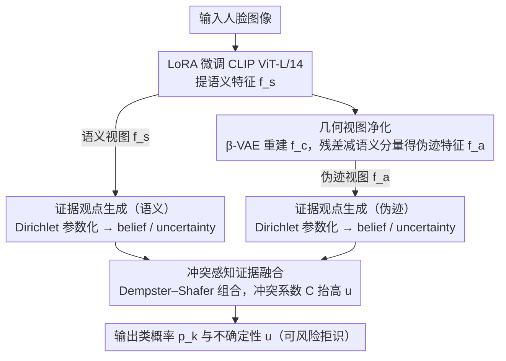

# Divide and Conquer: Reliable Multi-View Evidential Learning for Deepfake Detection

**会议**: ICML 2026  
**arXiv**: [2606.01885](https://arxiv.org/abs/2606.01885)  
**代码**: https://github.com/kxl0825/DiCoME.git (有)  
**领域**: AI 安全 / Deepfake 检测  
**关键词**: 深度伪造检测、多视图学习、证据学习、几何正交分解、不确定性量化

## 一句话总结
本文提出 DiCoME 框架，先用几何正交投影把 CLIP 语义特征和伪造伪迹特征强制解耦成两路互补"专家视图"，再用 Dempster–Shafer 证据融合显式建模两视图间的"认识论冲突"以输出可信的不确定性，在跨数据集和跨伪造方法的 deepfake 检测基准上将平均 AUC 从 0.923 提升到 0.939（cross-dataset）和 0.976（cross-manipulation）。

## 研究背景与动机

**领域现状**：随着 GAN 和扩散模型的发展，deepfake 在语义层面已经几乎以假乱真，可供取证的只剩极其微弱的结构性异常痕迹。当前主流方案沿用单视图整体处理范式，用一个 backbone（越来越多地是 CLIP 这类视觉基础模型）把语义内容和伪造痕迹一起编码成纠缠的表征，再接 Softmax 二分类。

**现有痛点**：作者把这类范式的失败模式提炼为 **Semantic Masking Effect（语义掩蔽效应）**——由于视觉 backbone 天生为语义不变性而优化，identity 等高幅值语义特征会主导整个特征空间（$\|f_s\| \gg \|f_a\|$），微弱的伪迹信号在梯度下行时被当作捷径噪声忽略。结果是模型在见过的 manipulation 上自信满满，但一遇到未见过的伪造方法或跨域数据就崩盘，而且 Softmax 还会把这种崩盘伪装成高置信的预测。

**核心矛盾**：deepfake 检测的本质是"在强语义背景上找微弱异常"，但常规 backbone 把语义维度和伪迹维度纠缠在一起，feature-level 融合（如 RGB+Frequency、Global+Local）只是把两个高度相关的视图拼起来——所谓的"Structure Expert"其实只是在重复"Content Expert"，既没有真正的互补性，也没法在冲突时给出 calibrated uncertainty。已有的 Effort（ICML'25）用 SVD 正交化做了一步尝试，但它依赖全局低秩假设，对样本级的细微伪迹一刀切。

**本文目标**：(1) 在特征层面把伪迹从语义中彻底剥离，得到两路解相关且互补的证据；(2) 在决策层面把"两个专家意见冲突"显式建模为高不确定性，而不是被 Softmax 压成一个虚假的高置信预测。

**切入角度**：把伪迹严格定义为"语义子空间的正交补"——这是一个几何硬约束，比软正则化（如对比学习）更彻底；再借 Subjective Logic 把每个视图的输出参数化为 Dirichlet 分布，用 Dempster–Shafer 理论显式算出"冲突系数"。

**核心 idea**：用几何正交投影把 CLIP 语义残差中的语义泄漏部分减掉，得到纯净的伪迹视图；然后用证据融合让两个视图的冲突直接抬高 epistemic uncertainty，从而在未知攻击面前主动"承认不知道"。

## 方法详解

### 整体框架
DiCoME 的核心思想是"先分、后合"：与其用单个 backbone 把语义和伪迹一起编码再二分类，不如先在特征层面把伪迹从语义里硬性剥离成两路解相关的"专家视图"，再在决策层面用证据理论显式仲裁两个专家的分歧。具体落成两阶段流水线：**Divide** 阶段用 LoRA 微调的 CLIP ViT-L/14 提语义特征 $f_s$，经几何净化得到纯净伪迹特征 $f_a$；**Conquer** 阶段把 $f_s$、$f_a$ 各送入一个 evidential head 转成带不确定性的 subjective opinion，再用 Dempster–Shafer 组合规则融合，输出类概率 $p_k = b_k + u/K$ 以及可用于风险拒识的不确定性 $u$。

### 关键设计

**1. 几何视图净化：把伪迹严格定义为语义的正交补**

针对的痛点是 Semantic Masking Effect——CLIP 残差里看似是异常的信号其实大量混着语义泄漏，以往 FDML 的 attention 引导、Effort 的全局 SVD 要么是软约束、要么是粗粒度的整体低秩假设，都无法逐样本保证两路视图真正解相关。DiCoME 的做法是先用一个轻量 $\beta$-VAE 在 CLIP 特征空间（而非高维像素空间）把 $f_s$ 重建成"语义流形版本" $f_c$，重建用 cosine 对齐 $\mathcal{L}_{align} = 1 - \cos(f_s, f_c)$ 而非 $\ell_2$——因为 CLIP embedding 在球面上，信息编码在方向而非幅值里。得到原始残差 $f_r = f_s - f_c$ 后，再按向量投影定理减掉它沿 $f_s$ 方向的分量 $f_r^{\parallel} = \frac{\langle f_r, f_s \rangle}{\|f_s\|_2^2} f_s$，得到 $f_a = f_r - f_r^{\parallel}$。这一减保证 $\langle f_a, f_s \rangle = 0$，即 $f_a$ 落在语义子空间的正交补 $S^{\perp}$ 上。把"伪迹 = 语义正交补"做成一行向量投影的几何硬约束，等于给 Structure Expert 一个免疫语义干扰的特征空间，从根上消解掉 Semantic Masking Effect，也为后续证据融合提供了"两路解相关证据"这一理论前提。

**2. 证据观点生成：用 Dirichlet 参数化把"证据有多少"显式编码**

Softmax 的问题是把"证据不足"和"证据冲突"两种本质不同的不确定性都压成同一个 confidence 分数，遇到 unseen attack 必然 overconfident。DiCoME 改用 Subjective Logic：对视图 $v \in \{1,2\}$，evidential head 输出非负证据 $e^v = \text{Softplus}(W^v f_v + C^v)$，构成 Dirichlet 参数 $\alpha_k^v = e_k^v + 1$、总强度 $S^v = \sum_k \alpha_k^v$，进而导出 belief $b_k^v = e_k^v / S^v$ 与 uncertainty $u^v = K/S^v$，二者满足 $\sum_k b_k^v + u^v = 1$。这样当某视图缺乏判别证据时 $e_k \to 0$、$u^v \to 1$，模型天然能说出"我不知道"，而"有多少证据"被显式写进 $S^v$，给下一步融合提供了数学上 well-defined 的 belief/uncertainty。训练用 Bayes risk 形式的 evidential loss $\mathcal{L}_{fit} = \sum_k y_{i,k}(\psi(S_i) - \psi(\alpha_{i,k}))$，并加 KL 正则把非目标类证据压向均匀先验，正则权重按 $\lambda_t = \min(1, t/T)$ 退火以避免训练早期过度惩罚。

**3. 冲突感知证据融合：让两个专家的分歧直接抬高不确定性**

常用的均值/拼接融合会把冲突信息"平均掉"，反而让模型对 hard sample 更自信。DiCoME 改用 Dempster–Shafer 组合规则 $T^1 \oplus T^2$：$b_k = \frac{1}{1-\mathcal{C}}(b_k^1 b_k^2 + b_k^1 u^2 + b_k^2 u^1)$、$u = \frac{u^1 u^2}{1-\mathcal{C}}$，其中冲突系数 $\mathcal{C} = \sum_{i \ne j} b_i^1 b_j^2$ 量化两视图的分歧程度。这套规则自然处理三种情形：两视图都强信且方向一致时，$b_k^1 b_k^2$ 项占主导，融合 belief 协同放大、$u$ 以乘积速率衰减（一致放大）；一方强信另一方无知时，cross-term $b_k^1 u^2$ 让强信方"代为投票"（知识互补）；两视图相反时 $\mathcal{C}$ 显著上升，归一化既抑制 belief 又抬高 $u$，给出可拒识的风险信号而非盲目硬判（冲突感知）。关键不在于"换了 Dirichlet 输出"，而在于这套规则嵌入了一套显式的"如何处理证据冲突"的逻辑，正好接住前两步构造出的解相关解耦视图——unseen attack 恰恰会让两视图给出矛盾意见，从而被识别为高不确定性。

### 损失函数 / 训练策略
总损失 $\mathcal{L}_{total} = \mathcal{L}_{edl} + \lambda_{vae} \mathcal{L}_{vae}$，其中 $\mathcal{L}_{vae} = \mathcal{L}_{align} + \beta \mathcal{L}_{kld}$，$\mathcal{L}_{align} = 1 - \cos(f_s, f_c)$ 强制 $\beta$-VAE 在角度而非幅值上对齐 CLIP 特征，$\mathcal{L}_{kld}$ 是标准 VAE 的高斯先验 KL。骨干为 CLIP ViT-L/14，LoRA 微调；AdamW lr=1e-4，batch 128，单卡 A100；只在 FaceForensics++ c23 上训练，零样本迁移到所有评测集；推理用 video-level AUC。

## 实验关键数据

### 主实验
在 6 个跨数据集（CDFv2/DFD/DFDC/DFo/WDF/CDFv3）和 8 种跨 manipulation（DF40 子集：UniFace/BleFace/MobSwap/e4s/FaceDan/FSGAN/InSwap/SimSwap）上对比 12 个 baseline。

| 评测设置 | 指标 | DiCoME | Effort (ICML'25) | GenD (WACV'26) | ProDet (NIPS'24) |
|----------|------|--------|------------------|----------------|------------------|
| Cross-dataset Avg AUC | video AUC | **0.939** | 0.907 | 0.923 | 0.821 |
| Cross-manipulation Avg AUC | video AUC | **0.976** | 0.940 | 0.958 | 0.867 |
| CDFv2 | video AUC | **0.977** | 0.956 | 0.960 | 0.926 |
| DFDC | video AUC | **0.882** | 0.843 | 0.871 | 0.707 |
| DFo | video AUC | **0.993** | 0.977 | 0.989 | 0.879 |

cross-dataset 平均比次优 GenD 高 1.6 点，cross-manipulation 平均高 1.8 点；最难的 DFDC 提升近 4 点，是整组里最显著的。

### 消融实验

| 子表 | 配置 | CDFv2 | DFDC | MFS | Avg |
|------|------|-------|------|-----|-----|
| (a) | (A) 只用 $f_s$（单视图 CLIP） | 0.927 | 0.856 | 0.933 | 0.905 |
| (a) | (B) $f_s + f_s$（双拷贝，无新视图） | 0.954 | 0.867 | 0.929 | 0.917 |
| (a) | (C) $f_s + f_r$（用原始残差，无正交化） | 0.956 | 0.860 | 0.951 | 0.922 |
| (a) | **Ours $f_s + f_a$（正交净化）** | **0.977** | **0.882** | **0.956** | **0.938** |
| (b) | (D) $\mathcal{L}_{ce}$ + Mean Fusion | 0.956 | 0.874 | 0.942 | 0.924 |
| (b) | (E) $\mathcal{L}_{edl}$ + Mean Fusion | 0.961 | 0.878 | 0.941 | 0.927 |
| (b) | **Ours $\mathcal{L}_{edl}$ + DS-Conflict** | **0.977** | **0.882** | **0.956** | **0.938** |
| (c) | (F) 去 $\mathcal{L}_{align}$ | 0.955 | 0.866 | 0.944 | 0.922 |
| (c) | (G) 去 $\mathcal{L}_{kld}$ | 0.948 | 0.872 | 0.944 | 0.921 |

### 关键发现
- **正交投影是最大贡献来源**：(a) 表里 (C)→Ours 仅多了一步几何正交化就把平均 AUC 从 0.922 抬到 0.938（+1.6），证明原始残差 $f_r$ 确实严重泄漏语义，软约束/无约束都不够。
- **DS 融合本身就比 Mean 强**：(b) 表里 EDL+Mean 仅比 CE+Mean 高 0.3 点，但换成 DS-Conflict 又再涨 1.1 点；说明真正的增益不在"换了 Dirichlet 输出"，而在"显式建模冲突"。
- **角度对齐 > 幅值对齐**：去掉 cosine $\mathcal{L}_{align}$ 后 AUC 掉得比去 KL 还多，印证 CLIP 球面 embedding 的特性，$\ell_2$ 重建会被非语义的幅值扰动带偏。
- **uncertainty 真的能用**：风险-覆盖曲线显示在 DFD 上拒掉最不确定的 10% 样本能带来显著精度跃升；t-SNE 可视化也确认原始 CLIP 把真假样本严重混叠，几何净化后形成宽决策边界的紧凑簇；feature 相关性热图显示正交化后两视图近似解相关。

## 亮点与洞察
- **把"伪迹"严格几何定义为"语义正交补"**：这是个非常干净的归纳偏置，比 attention 引导、对比解耦、SVD 全局低秩都更彻底——它对每个样本都强制成立，且实现就是一行向量投影，几乎没有额外参数。
- **冲突即不确定性**：DS 融合最妙的地方是把"两个 expert 互相说对方撒谎"这件事变成了一个数学上 well-defined 的不确定性来源（冲突系数 $\mathcal{C}$），而不是被 Softmax 拍成一个虚假的高置信。这对开放世界的 unseen attack 检测特别贴合，因为新攻击恰恰会让两个视图给出矛盾意见。
- **CLIP 特征的"特征空间 VAE 重建"是个可迁移的 trick**：避开像素空间 VAE 的高维难训问题，又利用了 CLIP 已经压缩好的语义先验，比 RECCE 那种像素重建优雅得多。这套"基础模型特征 + 轻量 VAE 投影 + 残差解耦"的范式很容易迁移到其他"在强先验背景下找微弱异常"的任务（医学影像 OOD、工业缺陷检测、对抗样本检测等）。
- **训练只在 FF++ c23 一个域上做**：所有提升都是 zero-shot 迁移得到的，这种"一域训练、多域评测"的协议在 deepfake 检测领域最能反映真实泛化能力。

## 局限性 / 可改进方向
- **正交化基于单一方向 $f_s$**：把整个语义子空间塌缩为一根向量，对于 identity、表情、光照等多个独立语义因子是粗暴近似——理论上把 $f_s$ 换成 SVD 出来的前 $k$ 主方向会更合理（但作者批评了 Effort 的全局 SVD，二者的取舍值得专门实验）。
- **$\beta$-VAE 重建质量决定一切**：若 $f_c$ 重建不足，残差 $f_r$ 里的"非语义噪声"和"伪迹"会一起被当作 $f_a$ 送给 Structure Expert，正交化只能保证"和 $f_s$ 正交"，不保证"是伪迹"。论文没汇报 $\beta$ 系数和潜变量维度的敏感性。
- **只在人脸 deepfake 上验证**：方法本身是任务无关的，但全身 deepfake、AI 生成全图（如 SDXL 输出）、视频时序伪迹是否同样适用没有评测。
- **二分类下 Dirichlet 退化为 Beta 分布**：DS 融合在 $K = 2$ 时的"冲突感知"优势其实是受限的，扩展到多类伪造源识别（区分是 GAN 还是 diffusion 生成的）应能更充分发挥这套机制。

## 相关工作与启发
- **vs Effort (ICML'25)**：都用正交分解隔离伪迹，但 Effort 用全局 SVD 强加 uniform low-rank，会丢失样本级细节；DiCoME 用样本级单向量投影，且加 evidential 不确定性。结果是 cross-dataset Avg 从 0.907 提到 0.939。
- **vs FDML / 一般 multi-view fusion**：FDML 等用 attention 引导软约束做特征级融合，仍受语义泄漏污染；DiCoME 用几何硬约束保证两视图解相关，再用 DS 在决策级（而非特征级）融合，避免了"互相回声"问题。
- **vs RECCE / 像素级重建检测**：RECCE 在像素空间做 reconstruction，对高分辨率人脸难训且对压缩鲁棒性差；DiCoME 把重建放到 CLIP 特征空间，既继承 CLIP 的语义鲁棒性，又把重建难度降到 $d$ 维。
- **vs 一般 Evidential Deep Learning**：标准 EDL 是单视图任务（图像分类、回归）的不确定性估计工具，本文把它升级为"多视图证据冲突仲裁器"，思想可迁移到任何"多个不可靠 expert 协同决策"的安全敏感任务。

## 评分
- 新颖性: ⭐⭐⭐⭐ "伪迹 = 语义正交补 + 冲突即不确定性"这套组合在 deepfake 检测里是新的，但正交投影和 EDL 单独都不算新颖
- 实验充分度: ⭐⭐⭐⭐⭐ 6 个跨数据集 + 8 种 manipulation + 三套消融 + uncertainty/Grad-CAM/t-SNE/相关性热图多角度可视化，相当完整
- 写作质量: ⭐⭐⭐⭐ "Semantic Masking Effect"和"Divide-and-Conquer"两个概念框架立得很稳，公式推导清晰，但部分句子（尤其 intro）略冗长
- 价值: ⭐⭐⭐⭐⭐ cross-dataset SOTA 提升 1.6 点、DFDC 提升 4 点，且 uncertainty 实测可用于风险拒识，对部署可信度有直接价值

<!-- RELATED:START -->

## 相关论文

- [\[ICML 2026\] From Talking to Singing: A New Challenge for Audio-Visual Deepfake Detection](from_talking_to_singing_a_new_challenge_for_audio-visual_deepfake_detection.md)
- [\[CVPR 2025\] Divide and Conquer: Heterogeneous Noise Integration for Diffusion-based Adversarial Purification](../../CVPR2025/image_generation/divide_and_conquer_heterogeneous_noise_integration_for_diffusion-based_adversari.md)
- [\[ICML 2026\] ViewMask-1-to-3: Multi-View Consistent Image Generation via Multimodal Discrete Diffusion Models](viewmask-1-to-3_multi-view_consistent_image_generation_via_multimodal_discrete_d.md)
- [\[ICML 2026\] Gradient Preconditioning for Efficient and Reliable Reward-Guided Generation](gradient_preconditioning_for_efficient_and_reliable_reward-guided_generation.md)
- [\[ICML 2026\] Offline Multi-agent Reinforcement Learning via Sequential Score Decomposition](offline_multi-agent_reinforcement_learning_via_sequential_score_decomposition.md)

<!-- RELATED:END -->
