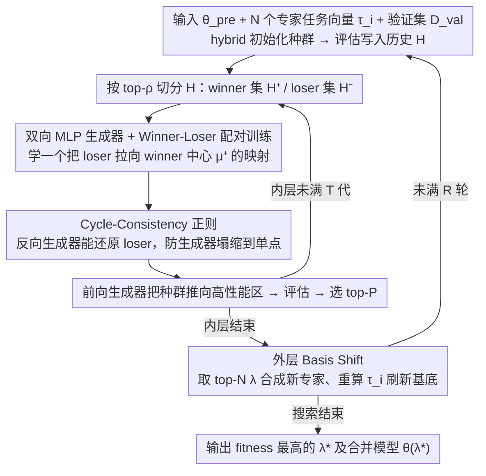

# EvoGM: Learning to Merge LLMs via Evolutionary Generative Optimization

**会议**: ICML 2026  
**arXiv**: [2605.29295](https://arxiv.org/abs/2605.29295)  
**代码**: https://github.com/JiangTao97/evogm (有)  
**领域**: 模型压缩 / LLM 合并 / 进化搜索  
**关键词**: 模型合并, 任务向量, 进化算法, 生成式优化, Cycle Consistency

## 一句话总结
EvoGM 把"找 task-vector 合并系数 $\bm{\lambda}$"从手工设计变异算子的进化搜索改写成可学习的生成任务：用一对带 cycle-consistency 的 MLP 生成器从历史的 winner/loser 配对里学高性能区域的分布，并在外层套多轮"基底切换"逐步刷新专家池，在 GLUE 8 任务和 Qwen2.5-1.5B 10 模型 unseen 任务上分别比 PSO-Merging 的 SOTA 平均高约 1.4% 和明显领先。

## 研究背景与动机

**领域现状**：LLM 全参数微调成本越来越高，模型合并（model merging）通过把多个专家模型在参数空间直接组合为一个，成为"免训练复用能力"的主流范式。task arithmetic 这一支把每个专家写成相对预训练模型的 task vector $\bm{\tau}_i = \bm{\theta}_i - \bm{\theta}_{pre}$，再用系数向量 $\bm{\lambda} \in \mathbb{R}^N$ 线性组合得到 $\bm{\theta}(\bm{\lambda}) = \bm{\theta}_{pre} + \sum_i \lambda_i \bm{\tau}_i$，于是合并问题就归约成一个低维（=专家数 $N$）的黑盒优化。

**现有痛点**：当前两类做法都有结构性缺陷。一类是 TA / TIES / DARE / DELLA 这种基于人工启发式的"剪枝 + 缩放 + 平均"，对验证目标完全不可学；另一类是 CMA / PSO-Merging / Model Swarm 这种进化搜索，原则上能利用验证信号，但所有变异算子都是手写的随机扰动，**完全忽略了系数空间的性能 landscape**——在实际部署里验证集小、评估预算少（一次 fitness 评估要做一次完整推理），随机扰动的搜索效率太低，很容易卡在次优。

**核心矛盾**：sparse 且昂贵的 fitness 反馈下，随机变异既浪费样本又拿不到结构性归纳偏置。但与此同时，历史搜索轨迹里其实已经积累了大量"哪种 $\bm{\lambda}$ 更好"的信号，**这些信号被随机算子白白浪费了**。

**本文目标**：把进化合并从"随机扰动"升级为"从历史数据学一个 proposal 分布"，要解决三个子问题：(i) 怎么从历史中提取"好 vs 坏"的偏好信号；(ii) 怎么训练一个生成器把"差"映射到"好"，又不塌缩到单点；(iii) 怎么避免在固定专家基底下早早饱和。

**切入角度**：作者借鉴 sparse-feedback 优化里"用 generative model 学结构化 proposal"的思路，把合并系数搜索看成一个数据驱动的生成任务——验证准确率就是 reward，winner 集合就是 high-performance 分布的样本。

**核心 idea**：用**双向 MLP 生成器**学一个"loser→winner"的映射代替随机变异，再用 cycle-consistency 防塌缩、用**外层"基底切换"周期性把 elite merge 当成新专家**，让搜索空间和模型能力一起进化。

## 方法详解

### 整体框架
EvoGM 要解决的是"在小验证集、少评估预算下高效搜索 task-vector 合并系数 $\bm{\lambda}\in\mathbb{R}^N$"这件事，核心动作是把传统进化搜索"采样 → 评估 → 选择 → 变异"循环里那个**手工随机变异算子**整体换成一个从历史轨迹学出来的生成器，再在外面套一层"专家基底刷新"让搜索空间本身也能进化。整个搜索完全在 $\mathbb{R}^N$（$N$ 等于专家数，论文里取 8 或 10）上进行，不对 LLM 参数做任何梯度反传。

具体是一个嵌套双循环。输入是预训练基座 $\bm{\theta}_{pre}$、$N$ 个 LoRA 微调专家及其任务向量 $\bm{\tau}_i = \bm{\theta}_i - \bm{\theta}_{pre}$、验证集 $\mathcal{D}_{val}$、种群大小 $P=2N$、外层轮数 $R$、内层迭代数 $T$。内层用 hybrid 初始化（均匀平均、one-hot、随机均匀）构造种群并在 $\mathcal{D}_{val}$ 上评估写入历史 $\mathcal{H}$，此后每次迭代把 $\mathcal{H}$ 按 top-$\rho$（默认 $\rho{=}0.3$）切成 winner 集 $\mathcal{H}^+$ 与 loser 集 $\mathcal{H}^-$、重新训一对生成器、用前向生成器把整个种群"推"向高性能区，再评估并按 fitness 选 top-$P$ 进入下一代；外层每跑完一次内层搜索就取 top-$N$ 的 $\bm{\lambda}^{(i)}$ 合成新专家、刷新基底再开下一轮，最终输出历史中 fitness 最高的 $\bm{\lambda}^*$ 及对应合并模型 $\bm{\theta}(\bm{\lambda}^*)$。

### 关键设计

**1. 双向 MLP 生成器 + Winner-Loser 配对训练：把"变异"学成可微映射**

进化搜索的瓶颈在于随机变异完全无视系数空间的性能 landscape，于是 EvoGM 把"差解 → 好解"这个动作显式学成一对 5 层 MLP（输出层 tanh 将 $\bm{\lambda}$ 约束在 $[-1,1]^N$）：前向生成器 $G_{-\to+}: \mathcal{H}^- \to \mathcal{H}^+$ 负责提案，反向生成器 $G_{+\to-}: \mathcal{H}^+ \to \mathcal{H}^-$ 为后面的 cycle 约束服务。训练数据由 winner/loser 两集合的 Cartesian product $\mathcal{H}^- \times \mathcal{H}^+$ 构造正负样本对（实现上对两集合独立 mini-batch 采样，等价于乘积分布），优化目标把 loser 显式拉向 winner 中心 $\bm{\mu}^+ = \frac{1}{|\mathcal{H}^+|}\sum_{\bm{\lambda}^+ \in \mathcal{H}^+} \bm{\lambda}^+$：$\mathcal{L}_{opt} = \mathbb{E}_{\bm{\lambda}^- \in \mathcal{H}^-}[\|G_{-\to+}(\bm{\lambda}^-) - \bm{\mu}^+\|_2^2]$。之所以用 winner-loser 偏好而非直接拟合 reward 模型，是因为 sparse-feedback 黑盒优化下 reward 回归方差太大，最弱的"谁比谁好"信号反而更稳，也更容易让生成器跟上每代刷新的分布。

**2. Cycle-Consistency 正则：防止生成器塌缩到单点**

只最小化 $\mathcal{L}_{opt}$ 会把生成器逼成"常函数 $=\bm{\mu}^+$"——所有 loser 都被映到同一个 winner 中心，种群多样性归零、进化退化成局部贪心。EvoGM 借 CycleGAN 的不动点思路，在两个方向同时加 cycle 约束 $\mathcal{L}_{cyc} = \mathbb{E}_{\bm{\lambda}^-}[\|G_{+\to-}(G_{-\to+}(\bm{\lambda}^-)) - \bm{\lambda}^-\|_2^2] + \mathbb{E}_{\bm{\lambda}^+}[\|G_{-\to+}(G_{+\to-}(\bm{\lambda}^+)) - \bm{\lambda}^+\|_2^2]$，总损失 $\mathcal{L}_{total} = \alpha_c \mathcal{L}_{cyc} + \alpha_o \mathcal{L}_{opt}$。直觉很直接：若 $G_{-\to+}$ 把所有输入压成同一点，$G_{+\to-}$ 就还原不出多样的原始 loser，cycle 损失会爆炸，于是双射性被当成一个自带几何意义的隐式正则，比显式加 entropy/KL 项好调得多。消融里去掉 cycle loss 在 NLGraph 这类需要 exploration 的推理任务上掉点最猛，印证了"防塌缩比直接拟合 reward 更关键"。

**3. 外层 Basis Shift：让专家基底跟着搜索一起进化**

固定专家张成的合并空间会限死 $\bm{\lambda}^*$ 的能力上界，长时间搜索后容易陷入"系数怎么调都饱和"的平台。EvoGM 在每一外层 round 结束时，从历史 $\mathcal{H}$ 取 top-$N$ 系数 $\{\bm{\lambda}^{(i)}\}_{i=1}^N$ 真的实例化成新模型 $\bm{\theta}_i^{(r+1)} = \bm{\theta}(\bm{\lambda}^{(i)})$，重算 $\bm{\tau}_i^{(r+1)} = \bm{\theta}_i^{(r+1)} - \bm{\theta}_{pre}$，下一轮内层就在这个由 elite merge 张成的全新基底上继续搜 $\bm{\lambda}$（默认 $R=2$、$T=3$）。因为 task vector 的线性组合本身就是新方向，把它们 promote 回基底等价于给搜索空间"换坐标系"，从而突破原始专家划定的上界。这一步在收敛曲线上表现为换轮时的短暂震荡加之后的二次上扬，论文观察到的 iteration 3 处性能跳变正是它造成的，消融里 w/o Rounds 在 NLGraph / MMLU 上掉幅最大。

总损失 $\mathcal{L}_{total} = \alpha_c \mathcal{L}_{cyc} + \alpha_o \mathcal{L}_{opt}$ 在每次内层迭代都会"reset 并重新训"两个生成器，使其紧跟当前 $\mathcal{H}$ 的最新分布；整个 EvoGM 对 LLM 零梯度更新，计算开销集中在每个 candidate 的 validation 评估上。

## 实验关键数据

### 主实验

Seen tasks：FLAN-T5-base 合并 8 个 GLUE 单任务专家。

| 数据集 (GLUE) | 指标 | EvoGM | PSO-Merging (SOTA) | 提升 |
|---|---|---|---|---|
| CoLA | acc | 71.1 | 68.2 | +2.9 |
| MNLI | acc | 82.8 | 83.8 | -1.0 |
| QQP | acc | 84.8 | 83.6 | +1.2 |
| RTE | acc | 82.2 | 81.2 | +1.0 |
| STS-B | acc | **80.9** | 71.9 | **+9.0** |
| **AVG (8 tasks)** | **acc** | **82.4** | 81.2 | **+1.2** |

Unseen tasks：Qwen2.5-1.5B 上 10 个 Tulu-v2 LoRA 专家做 multi-task 合并，在 knowledge / reasoning / safety 三类共 8 个 benchmark 评测。

| Benchmark (Test) | EvoGM | PSO-Merging | Model Swarm | Single Best |
|---|---|---|---|---|
| MMLU | **0.625** | 0.595 | 0.606 | 0.586 |
| MMLU-Pro | 0.224 | 0.232 | 0.236 | 0.232 |
| HellaSwag | **0.594** | 0.587 | 0.587 | 0.572 |
| GSM8K | **0.434** | 0.354 | 0.332 | 0.325 |
| NLGraph | **0.537** | 0.465 | 0.373 | 0.376 |
| TruthQA | **0.441** | 0.421 | 0.392 | 0.384 |
| AbstainQA | 0.121 | **0.147** | 0.095 | 0.119 |

8 项里 EvoGM 在 Test 上 5 项第一，且在 GSM8K / NLGraph 这种推理任务上提升幅度最显著（+8 ~ +14 个百分点的相对提升），说明学到的 proposal 分布对"硬"任务尤其有效。

### 消融实验
配置：4 专家合并、种群 8、$R=2,T=2$。

| 配置 | 关键现象 | 说明 |
|---|---|---|
| Full EvoGM | 全任务最佳 | 完整双向生成器 + cycle + 多轮 basis shift |
| Single-Generator | 一致掉点 | 去掉反向生成器后无法构造 cycle 约束，搜索退化 |
| w/o Rounds | NLGraph / MMLU 显著下降 | 用 5 次连续内层迭代代替"多轮 + basis shift"，证明只刷系数不刷基底会饱和 |
| w/o Cycle Loss | NLGraph 掉点最猛 | 只剩 $\mathcal{L}_{opt}$，生成器塌缩到 winner 中心，多样性丢失导致推理任务最受伤 |

### 关键发现
- **Cycle loss 是核心**：去掉后在 NLGraph 这种需要 exploration 的推理任务上跌得最厉害，验证了"防塌缩 > 直接拟合 reward"。
- **Basis shift 不是 cosmetic**：训练曲线上能看到 iteration 3（轮切换点）出现先震荡后跃升的双段形态，basis shift 把搜索从局部最优里"踹"出来。
- **种群大小敏感、迭代数稳定**：population 从 10 涨到 30，test acc 提 0.0305；iteration 从 3 涨到 8 只有边际收益，说明真正稀缺的是 candidate 覆盖度。
- **小评估预算下优势更大**：默认每个 benchmark 只采 200 条做 val、1000 条做 test，在这种 sparse feedback 下生成式 proposal 比随机扰动的样本利用率高得多。

## 亮点与洞察
- **"把进化算子学出来"是一个干净的范式迁移**：传统 EA/PSO 里 mutation 都是 hand-crafted（高斯扰动、polynomial mutation），EvoGM 直接把它替换为一个可学习的条件生成器，且没有引入 surrogate model 也不需要 differentiable proxy——只用 winner/loser 偏好这一种最弱的反馈信号就跑起来了，这种"reward-free + preference-only"的设定对昂贵黑盒优化很有迁移价值。
- **CycleGAN 思路用在低维搜索空间上是巧妙的小工具**：$\mathbb{R}^N$ 上的 cycle 约束几乎不增加计算量（5 层 MLP），却把"防塌缩"从需要 KL/熵正则的难调超参，变成一个具体且自带几何意义的约束，调参负担小很多。
- **Basis shift 揭示了 model merging 的隐藏维度**：之前所有 search-based merging 都把 $\{\bm{\tau}_i\}$ 当成 immutable 的搜索空间结构，本文指出"elite merge 本身就是更好的 task vector"，把外层循环也变成可优化的，这个观点对未来 federated / continual merging 有启发——基底可以随任务漂移持续 refit。
- **可迁移到所有 expensive black-box 搜索**：NAS 的算子选择、Prompt 优化的 token 组合、超参搜索都可以套这个 winner-loser + cycle-generator 的模板，前提是搜索空间是连续低维。

## 局限与展望
- **维度受限**：$\bm{\lambda} \in \mathbb{R}^N$ 里 $N$ 就是专家数，论文里只到 10。如果想做 layer-wise / module-wise 合并系数（$N$ 变成几百几千），目前的双 MLP 生成器结构能否 scale 没验证。
- **仍然每代都要全集评估**：每个新 $\bm{\lambda}$ 都要把合并后模型在 200 条 val 上跑一遍，整体 wall-clock 还是受限于 LLM inference，作者没报告与 PSO-Merging 在等评估预算下的具体加速比。
- **expert 池本身的质量假设**：basis shift 假设 elite merge 一定是"更好的基底"，但如果原始专家方向高度冗余，新基底只是在同一个子空间里转，理论上不会扩展能力上界——本文没分析这种 degenerate 情形。
- **超参组合 sensitivity 未深挖**：$\alpha_c / \alpha_o$、$\rho$、tanh 输出范围 $[-1, 1]$（这其实排除了 $|\lambda_i| > 1$ 的 task negation 区域）都是默认值，缺少在不同模型族 / 不同任务难度下的鲁棒性分析。
- **改进思路**：把生成器换成 conditional diffusion（带 reward guidance）或许能更好建模多模态的 winner 分布；对 layer-wise $\bm{\lambda}$ 可以引入 graph/层间结构先验；basis shift 可以与 task interference detection 结合，只在检测到饱和时才触发。

## 相关工作与启发
- **vs PSO-Merging / Model Swarm**：同为 population-based 进化搜索，区别在于他们的 mutation/crossover 算子是手工的随机操作（PSO 的 velocity 更新、swarm 的位置扰动），EvoGM 把它换成从历史数据学的条件生成器；在 unseen tasks 上对 NLGraph 这种推理任务领先尤其明显，说明结构化 proposal 比随机扰动更适合复杂 landscape。
- **vs CMA（Akiba et al., 2025）**：CMA 也是 evolutionary，但把搜索空间扩到 layer-wise 并用 CMA-ES 自适应协方差，本文不扩搜索空间维度，而是改进 sample efficiency；二者其实正交，可叠加。
- **vs TIES / DARE / DELLA**：这些是 training-free 的人工启发式（trim/scale/rescue），完全不利用 validation 信号；EvoGM 在 GLUE 上比 DELLA 高 ~3 个点，体现 validation-guided search 的天花板。
- **vs AdaMerging**：AdaMerging 用熵最小化做无监督系数学习并依赖少量梯度，EvoGM 完全 gradient-free 而且不需要无标注 test data，更适合纯 black-box 部署。
- **vs CycleGAN**：思想直接借鉴，但用在 $\mathbb{R}^N$ 的小型优化问题上而非图像 domain transfer，是一个轻量但合理的方法论迁移。

## 评分
- 新颖性: ⭐⭐⭐⭐ 把"可学习 proposal + cycle 防塌缩 + 外层 basis shift"三件套引入 model merging 是一个清晰的方法论组合，每个组件单看都不算原创但 ensemble 落到合并问题上是新的。
- 实验充分度: ⭐⭐⭐⭐ 覆盖 FLAN-T5 + Qwen 两个模型族、seen / unseen 两个设定、10+ baseline，消融拆到 3 个核心组件；但缺评估预算等量对比和 wall-clock 报告。
- 写作质量: ⭐⭐⭐⭐ 算法和图示清晰，动机推导自然；公式可读、Pipeline 易懂。
- 价值: ⭐⭐⭐⭐ 在小 val + 少预算的实际 deployment 场景下意义明显，且方法范式对其他黑盒优化任务有迁移价值。

<!-- RELATED:START -->

## 相关论文

- [\[ICML 2026\] Threshold-Guided Optimization for Visual Generative Models](threshold-guided_optimization_for_visual_generative_models.md)
- [\[CVPR 2025\] Decouple-Then-Merge: Finetune Diffusion Models as Multi-Task Learning](../../CVPR2025/image_generation/decouple-then-merge_finetune_diffusion_models_as_multi-task_learning.md)
- [\[ICML 2026\] A Systematic Investigation of RL-Jailbreaking in LLMs](a_systematic_investigation_of_rl-jailbreaking_in_llms.md)
- [\[ICML 2026\] $f$-Trajectory Balance: A Loss Family for Tuning GFlowNets, Generative Models, and LLMs with Off- and On-Policy Data](f-trajectory_balance_a_loss_family_for_tuning_gflownets_generative_models_and_ll.md)
- [\[ICML 2026\] Esoteric Language Models: A Family of Any-Order Diffusion LLMs](esoteric_language_models_a_family_of_any-order_diffusion_llms.md)

<!-- RELATED:END -->
