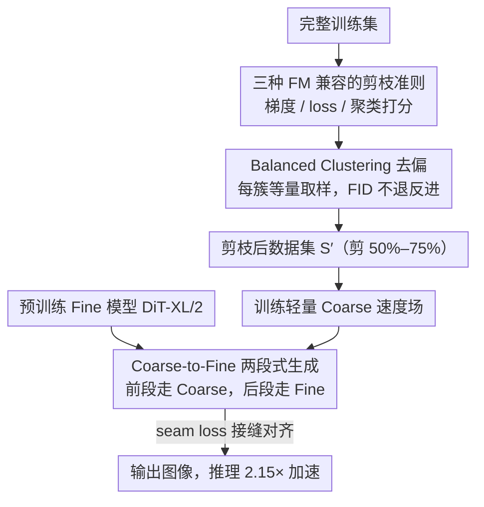

# Exploring and Exploiting Stability in Latent Flow Matching

**会议**: ICML 2026  
**arXiv**: [2605.08398](https://arxiv.org/abs/2605.08398)  
**代码**: https://github.com/briqr/explo-r-it-ing_lfm_stability  
**领域**: 扩散模型 / Flow Matching / 数据剪枝  
**关键词**: Latent Flow Matching、轨迹稳定性、数据剪枝、Coarse-to-Fine、推理加速

## 一句话总结
本文系统刻画了 Latent Flow Matching（LFM）的"轨迹稳定性"——同一噪声种子下，剪掉 75% 数据、换大小架构、改训练种子都能产生几乎相同的图像；进而把这个性质转化成两个实用算法：(1) 用 balanced-clustering 剪枝可在 CelebA-HQ 上把 50% 数据剪掉而 FID 反而轻微提升、ImageNet 上 75% 数据可剪；(2) Coarse-to-Fine 两段式生成，把 DiT-XL/2 (675M) 和 DiT-S/2 (33M) 拼起来，推理快 2.15×。

## 研究背景与动机

**领域现状**：扩散模型已经是图像/视频/医学影像生成的主流范式，Flow Matching（FM）作为 DDPM 的 ODE 替代品，因为采样步数少而越来越受欢迎；Latent FM (LFM) 进一步把 FM 搬到 VAE latent 空间，是目前 SD3、Flux 一类大模型的底座。

**现有痛点**：训练 LFM 巨贵——需要超大数据集、长时间、海量算力，条件模型还需要大量人工标注；但社区从来没系统问过：**数据集到底要多大？模型要多大？** 一些零散观察提示稳定性的存在（Kadkhodaie 在 score-based diffusion 上看到不同 split 训练的模型趋同），但都没给出可用的剪枝/加速方案，且都局限在 pixel 空间低分辨率。

**核心矛盾**：理论上 FM 学的是"分布之间的传输"，应当对样本分布的小扰动敏感；但实际经验表明，FM 模型在大幅扰动（删一半数据、换 20× 大的架构）下仍然把同一个 $x_0$ 映射到几乎相同的 $x_1$。这个"稳定性"如果是真的，就意味着大量训练数据其实在做重复劳动，可以剪。

**本文目标**：(1) 在 LFM 上**严格度量**这种稳定性（同种子下生成的人脸 ArcFace 相似度、ImageNet 的 DINO 相似度）；(2) 给出**理论解释**（基于 Bertrand 2025 的 FM 闭式解里 softmax 极度尖峰）；(3) 把稳定性**翻译成实用算法**——数据剪枝 + 模型剪枝。

**切入角度**：Bertrand 2025 证明 rectified FM 的最优速度场 $\hat{u}^*(x,t)=\sum_i \lambda_i(x,t)\frac{x^i-x}{1-t}$ 里，softmax 权重 $\lambda_i$ 在早期就极度尖峰——单个训练样本主导整个轨迹。所以只要这个"主导样本"留在数据里，剪不剪掉其他样本对轨迹影响极小。

**核心 idea**：用 LFM 的内在稳定性同时换"训练效率（数据/标注减少）"和"推理效率（大小模型拼接）"，并用三种剪枝准则配合 balanced clustering 来实证。

## 方法详解

### 整体框架
本文先把 LFM 的"轨迹稳定性"用同种子下的生成相似度严格量化出来，再借 Bertrand 2025 的 FM 闭式解（softmax 权重极度尖峰、单样本主导轨迹）作为解释，最终把这个性质落成两个互补的工具：训练侧用样本打分 + clustering 把数据集剪掉 50%–75% 仍不掉点，推理侧把一大一小两个 DiT 沿时间轴拼起来换 2.15× 加速。两条线共享同一个内核——既然轨迹由少数主导样本决定、且大小模型在轨迹上长得几乎一样，那大量数据和大模型的前半段算力其实都是冗余的。

### 关键设计

**1. 三种 FM 兼容的剪枝准则：给每个样本算重要性分数再按比例保留**

要把"剪枝"从分类模型迁到 Flow Matching，第一道坎是 FM 的 loss 信号本身很噪——大部分方差来自每步随机采的噪声，单看一次前向根本分不出样本好坏。本文给出三套打分准则按分数取前 $1-pr$ 的样本留下。梯度准则 $\mathcal{G}$ 用 7% 步数训一个小代理模型，固定 $M=2$ 个噪声 + $T=8$ 个 timestep 沿"共享噪声路径"算每样本梯度范数平方，再除以 per-$t$ 均值消掉 timestep 带来的尺度偏差得到 $s_i^{\mathcal{G}}$；loss 准则 $\mathcal{L}$ 把同一公式里的梯度换成 loss 值，便宜很多因而常作主力；聚类准则 $\mathcal{C}$ 则在 CLIP image embedding 空间做 k-means，分 **proportional**（按簇大小取样、保持原分布）和 **balanced**（每簇等量、强行平衡数据集）两套，簇内还可按"离中心近 / 远 / kernel-mean 匹配"挑代表样本。这里的关键适配是：固定噪声路径 + EMA 平滑才能从 FM 的高方差 loss 里拿到稳定的样本重要性信号，否则打分形同随机。

**2. Balanced Clustering 兼顾公平性 ($\mathcal{C}_b$)：用簇级平衡顺手纠数据偏差**

CelebA-HQ 上未剪枝模型生成的人脸 gender 分布是偏斜的（女多男少），而稳定性给了一个意外红利：既然删掉某个 cluster 内的样本几乎不影响其他 cluster 的轨迹，就可以放心地在 CLIP embedding 上做 k-means 后每簇等量取样，把数据分布强行抹平。实测用 $\mathcal{C}_b$ 剪枝后，PaliGemma 算的 gender KL 散度从 0.044 降到 0.016（已逼近显式用 label 的 $(\mathcal{C}_b)_{\text{gender}}=0.005$），age / skin-tone / hair-color 等属性的 KL 也同步下降，而 FID 不退反进。这等于给"无标签数据集去偏"提供了一个免费方案——平衡数据的同时不牺牲生成质量，正是稳定性保证 cluster 间互不干扰的直接后果。

**3. Coarse-to-Fine 两段式生成 (C2F)：让小模型跑前半条轨迹**

稳定性实验显示 DiT-S/2 (33M) 和 DiT-XL/2 (675M) 在同一噪声种子下走的轨迹高度相似（相似度 0.81），既然如此，让 675M 参数从 $t=0$ 一路白跑到 $t=1$ 就是浪费。C2F 因此在剪枝后的 $S'$ 上训一个轻量 Coarse 速度场 $v_C$ 覆盖噪声主导的前段 $t\in[0,t_0)$，把预训练好的 Fine 模型 $v_F$（DiT-XL/2）只留给细节决定性的后段 $t\in[t_0,1]$。难点在 $t_0$ 处的接缝：本文用 Fine 模型做 ODE 反向积分 $x_{k+1}=x_k+h\,v_F(x_k,t_k),\,h<0$ 从干净样本 $x_1$ 回积到 $x_{t_0}$，把这个 $x_{t_0}$ 当作 Coarse 的训练目标，并加一项 seam loss $\mathcal{L}_{\text{seam}}^v=\|v_F(x_{t_0},t_0)-v_C(x_{t_0},t_0)\|^2$ 强制两段在交界处速度对齐。因为大小模型本来就相似，只需几个 epoch fine-tune 就能缝出可用的 C2F，无须重训 Fine 权重。

### 损失函数 / 训练策略
Coarse 模型的总损失把前段 FM 目标和接缝对齐合在一起：

$$\mathcal{L}_{\text{coarse}}=\mathbb{E}\,\mathcal{L}_{\text{FM}}^{t\in[0,t_0)}+\lambda_v\,\mathcal{L}_{\text{seam}}^v$$

其中 seam 系数 $\lambda_v$ 是超参，分界点取 $t_0=0.7$ 时 FID 与速度平衡最好。Coarse 用 DiT-S/2、Fine 用 DiT-XL/2，在 H100 上 batch 128、$256^2$ 分辨率下，C2F 跑 43.53 ms/img，对比 Fine-only 的 93.95 ms/img 即 2.15× 加速。

## 实验关键数据

### 主实验

CelebA-HQ ($pr=0.5$) 不同剪枝准则下的 FID（越低越好）：

| 方法 | FID | 备注 |
|------|------|------|
| Unpruned | 24.24 | 全数据基线 |
| Random | 25.25±0.38 | 随机剪 |
| $\mathcal{G}$ (高梯度) | 24.62 | 几乎持平 |
| $\mathcal{G}^{-1}$ (低梯度) | 29.75 | 显著恶化 |
| $\mathcal{L}$ (高 loss) | 33.92 | 最差（反直觉，和分类相反） |
| $\mathcal{L}^{-1}$ (低 loss) | **23.49** | 反而轻微改进 |
| $\mathcal{C}_p$ | 25.19 | 按比例 |
| $\mathcal{C}_b$ | **22.80** | **balanced clustering 最优** |
| $\mathcal{C}_b^\kappa$ | 23.42 | kernel 变体 |

ImageNet（DiT-XL/2 conditional，200k 迭代）：

| 剪枝率 $pr$ | FID 趋势 | 备注 |
|------------|----------|------|
| 0 (unpruned) | 基线 | |
| 0.75 | 略升至 600k 后趋同 | 长期最稳定收益 |
| 0.9 | 200k 前最快，590k 后跌 | 中期最强 |
| 0.95 | 170k 前最快，之后崩 | 短期 sprint |

### 消融实验

C2F 在 CelebA-HQ 上，seam 位置 $t_0$ 的影响：

| 配置 | FID@$t_0=0.7$ | 推理速度 (ms/img) | 说明 |
|------|--------------|-------------------|------|
| Fine-only | 24.24 | 93.95 | 全用 DiT-XL/2 |
| C2F (unpruned Coarse) | 略好 | 43.53 | 2.15× 加速 |
| C2F + $\mathcal{C}_b$ pruned Coarse | **最优** | 43.53 | 速度+FID 双赢 |
| C2F_male（违反稳定性）| **44.92** | 43.53 | seam loss 救不了 |

### 关键发现
- **$\mathcal{L}$ 在 FM 上的表现与分类模型完全相反**：分类里"高 loss 样本"是 hard-example、留下来有用；但 FM 里 $\mathcal{L}$ 反而最差（FID 33.92），$\mathcal{L}^{-1}$ 最好。原因是 FM 的高 loss 多半来自"密度低的离群样本"，而 FM 主要靠"主导样本"建路径，离群样本反而拖累训练。这是个很反直觉、对从业者有用的发现。
- **不同扰动对稳定性的影响差异巨大**：换 DiT-S/2→DiT-XL/2 (s=0.81 几乎不变)、换 U-Net (s=0.55 稍降)、移除一个 gender 模态 (s=0.58)，但**换 VAE 种子** (s=0.32) 或 **flip latent 全部 feature map 符号** (s=0.32) 会完全打破稳定性。这说明稳定性的根源在 **latent 空间几何 + FM 目标**的耦合，不是架构本身。
- **score-based diffusion 不具备相同稳定性**：把 FM 换成 score-based 后稳定性完全消失，说明这是 rectified FM 这个特定目标的性质，不是所有 diffusion 都有。
- **Balanced clustering 同时减少 bias 且不损 FID**：$\mathcal{C}_b$ 把 gender KL 从 0.044 降到 0.016，FID 不退反进。这给"数据集均衡"提供了一个不需要标签的简洁方案。

## 亮点与洞察
- **把"稳定性"从现象提升为理论解释 + 实用算法** 是这篇文章最大的贡献：直接拿 Bertrand 2025 的 closed-form solution 当解释根基，再翻成数据剪枝 + C2F 两个落地方案，理论-实证-工程闭环很完整。
- **C2F 的工程价值很大**：在不动 Fine 模型权重的前提下，只训一个小 Coarse + seam loss，就能在生产环境拿到 2.15× 加速；这种"模型蒸馏的 partial 版本"对部署 DiT-XL/Flux 级模型非常友好。
- **稳定性的边界条件**（VAE 改变、latent 符号翻转就会破）这个发现对 LFM 社区是个警告——**任何动 VAE 的操作（换 VAE、改 scaling、归一化）都会让已有 LFM 失效**，要重新训。

## 局限与展望
- 主要在中等规模数据集（CelebA-HQ 28k、FFHQ 63k、ImageNet 1.2M）和 DiT 系列上验证；在 web-scale 数据（LAION-5B 量级）+ 大 Flux/SD3 上是否仍然成立，本文没回答。
- $\mathcal{G}$ 梯度准则计算太贵，文中只用来分析，没在大数据集落地；要让它实用，可能要做随机投影或 sketch。
- C2F 的 seam loss 只对齐了一个时间点，没考虑两段 ODE 的曲率匹配；如果两段速度场二阶导差很多，仍可能出现微小 artifact。
- 文章把 stability 与 generalization 的关系当作 future work——按理说稳定性越强就越接近"复刻训练集"，怎么平衡稳定性与多样性是个开放问题。

## 相关工作与启发
- **vs Kadkhodaie 2024**：他们在 score-based diffusion + pixel 空间观察到分裂训练后趋同；本文把现象搬到 latent FM、给出理论根据、并翻成可用工具。
- **vs Bertrand 2025**：Bertrand 给出 FM closed-form，但只用来研究"模型何时 generalize"；本文借用其 softmax-peaked 性质来论证剪枝可行性，这是非常聪明的"复用"。
- **vs 数据集 distillation / coreset**：本文证明 LFM 上简单的 cluster-balanced 剪枝就能打败更复杂的 coreset 方法，给生成模型领域的数据高效化提供了一个简洁 baseline。

## 评分
- 新颖性: ⭐⭐⭐⭐ 稳定性现象 + C2F 两段式都不是首创，但首次把它们在 LFM 上系统化、给理论解释
- 实验充分度: ⭐⭐⭐⭐⭐ CelebA-HQ / FFHQ / ImageNet 三个数据集、6 种剪枝准则、5 种扰动类型，覆盖很全
- 写作质量: ⭐⭐⭐⭐ 公式叙述清晰，图 4 的扰动分类做得很有视觉冲击力
- 价值: ⭐⭐⭐⭐⭐ 工程价值大（直接 2.15× 加速 + 数据剪 50%），且对 LFM 稳定性边界给出 actionable 指导

<!-- RELATED:START -->

## 相关论文

- [\[ICML 2026\] Stable Velocity: A Variance Perspective on Flow Matching](stable_velocity_a_variance_perspective_on_flow_matching.md)
- [\[ICML 2026\] The Coupling Within: Flow Matching via Distilled Normalizing Flows](the_coupling_within_flow_matching_via_distilled_normalizing_flows.md)
- [\[ICML 2026\] Saving Foundation Flow-Matching Priors for Inverse Problems](saving_foundation_flow-matching_priors_for_inverse_problems.md)
- [\[ICML 2026\] A Kinetic Energy Perspective of Flow Matching](a_kinetic_energy_perspective_of_flow_matching.md)
- [\[ICML 2026\] LithoGRPO: Fast Inverse Lithography via GRPO Reinforced Flow Matching](lithogrpo_fast_inverse_lithography_via_grpo_reinforced_flow_matching.md)

<!-- RELATED:END -->
