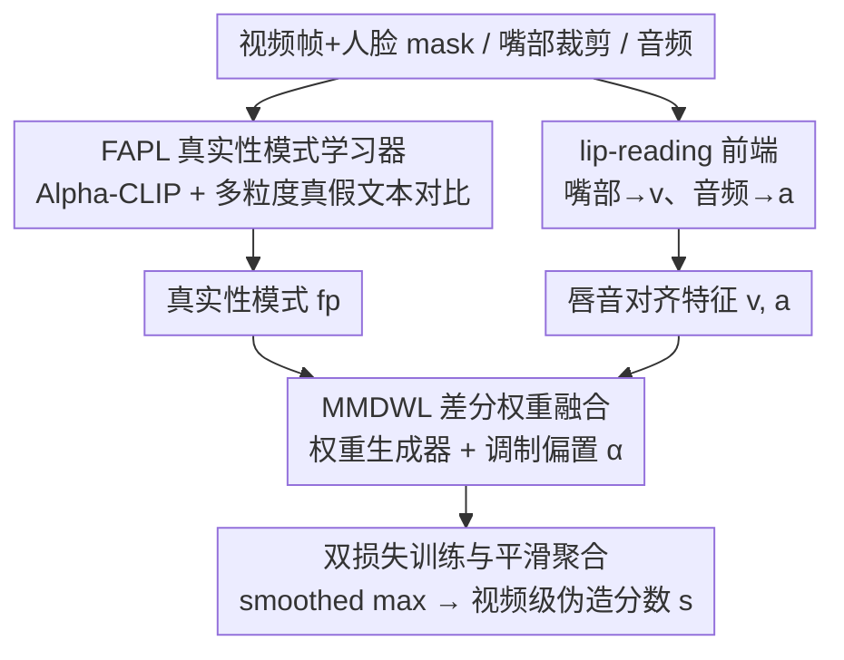

# From Talking to Singing: A New Challenge for Audio-Visual Deepfake Detection

**会议**: ICML 2026  
**arXiv**: [2605.27944](https://arxiv.org/abs/2605.27944)  
**代码**: https://LiuKe3068LikWix.github.io/SingingHead-DeepFake/  
**领域**: AI 安全 / 音视频深度伪造检测  
**关键词**: 深度伪造、跨场景泛化、文本引导、唱歌驱动头像、多模态融合

## 一句话总结
针对"唱歌头像"这一被现有 deepfake 检测器忽视的高难度域，作者一边构建 SHDF 数据集量化"说话→唱歌"的域漂移，一边提出 T-AVFD 框架，用 Alpha-CLIP+多粒度真假文本对比学习"真实人脸的语义模式"，再用差分权重模块自适应融合唇音一致性与人脸语义，仅在真实说话视频上训练就能跨域泛化到唱歌伪造，SHDF AUC 从 50% 量级抬到 80.2%。

## 研究背景与动机

**领域现状**：音视频伪造检测的主流范式是利用"跨模态不一致"——尤其是嘴唇运动与语音的对齐误差，AVAD、AVH-Align 等代表方法都建立在"真实视频里唇音应当严格同步"这一前提之上。配套的数据集（FakeAVCeleb、AVLips、TalkingHeadBench 等）也几乎全部是说话头像。

**现有痛点**：当输入从说话切换到唱歌时，节奏化的发声、伴奏音乐、夸张的口型/头部摆动让唇音对齐信号本身变得不稳定，对齐为核心证据的检测器迅速失效。作者用 forgery-agnostic 的 AVH-Align 做诊断：唱歌相对于说话的 MMD² 域距比"两个说话域之间"大 3.44× 到 4.66×，真假分数分布重叠率从 26.4% 飙升到 77.6%，说明这是一个真正的"非平凡域漂移"，不是简单换个生成器就能解释。

**核心矛盾**：检测器需要的"跨模态一致性"在唱歌场景下天然被削弱，但同时又缺乏唱歌的训练数据（也不能把唱歌伪造塞进训练集，否则会过拟合特定生成器的伪造指纹）。换言之，要在"训练只能用真实说话视频"的强约束下，找到能跨场景迁移的伪造线索。

**本文目标**：(1) 构建第一个唱歌头像 deepfake 基准来量化并暴露这个漂移；(2) 设计一个不依赖唱歌训练数据、也不依赖伪造样本的检测框架，使其在说话和唱歌上都能泛化。

**切入角度**：作者观察到（Figure 2）无论说话还是唱歌，真实人脸的语义表征都比合成人脸更丰富、更连贯——这是一种**与具体场景解耦的"真实性签名"**，相比唇音对齐更稳定。

**核心 idea**：用"真假对照的多粒度文本"去监督一个 Alpha-CLIP 人脸编码器，提炼出场景无关的"真实人脸语义模式"，再让一个差分权重模块根据内容自适应地决定"信人脸语义"还是"信唇音对齐"。

## 方法详解

### 整体框架
T-AVFD 想解决的核心难题是：在只能用真实说话视频训练、且看不到任何伪造样本的强约束下，把伪造判别从"唇音对齐"这种唱歌场景会失效的线索，转向一种跨场景更稳定的"真实人脸语义模式"。它接收三路输入——含人脸 mask 的视频帧 $\{F_t\}_{t=0}^{T}$、嘴部裁剪 $\{M_t\}_{t=0}^{T}$ 和音频 $\{A_t\}_{t=0}^{T}$，由 FAPL 真实性模式学习器把人脸语义在面-文对比空间里对齐成真实性模式 $fp$，再由 MMDWL 差分权重模块在 $fp$ 与唇音对齐特征之间做内容自适应融合，最终输出视频级伪造分数 $s$。整套训练只用真实说话视频，损失为 $\mathcal{L}=\mathcal{L}_{ft}+\mathcal{L}_{av}$，完全不碰合成样本。

### 关键设计

**1. 真实性模式学习器 FAPL：用真假文本把"真"的语义钉成判别锚点**

唱歌场景下唇音对齐天然不稳，但真实人脸的语义表征仍然比合成脸更连贯，FAPL 就是要把这种"真实性签名"显式提炼出来。它用 Alpha-CLIP 替代普通 CLIP：Alpha-CLIP 额外吃一张人脸 mask，靠 transformer attention $AT_{fm}$ 在保留全局上下文的同时强化人脸区域语义，再对所有帧求平均得到稳定的人脸特征 $f$。文本侧设计 face/eyes/mouth 三个粒度的正负对（"a real human face" vs "a fake human face" 等），每条文本前拼接 $l$ 个可学习 token，过 CLIP 文本编码器后求平均、归一化、再经一个共享线性层得到正锚点 $p$ 与负锚点 $n$：$p=W(\frac{1}{g_p}\sum_i f_i^p/\|f_i^p\|)$，$n$ 同理。

判别靠 face-text 对比对齐损失 $\mathcal{L}_{ft}=-\frac{1}{N}\sum\log\frac{\exp(s_i^+)}{\exp(s_i^+)+\exp(s_i^-)}$，其中 $s^+=f^\top p/\tau$、$s^-=f^\top n/\tau$，把真实人脸拉向 $p$、推离 $n$；推理时把 $p$ 与 $f$ 拼接得到真实性模式 $fp$。由于训练只见过真脸，这个损失学到的其实是"真实分布的形状"——伪造样本只要偏离就暴露，从根上规避了对特定生成器伪造指纹的过拟合。共享线性层保证 $p$、$n$ 落在同一子空间不至于跑偏；可学习 token 则让文本端在保住"人脸-眼-嘴"结构先验的同时适配检测任务，Table 7 显示 prompt 全固定或全可学这两端都更差。

**2. 多模态差分权重融合 MMDWL：让模型自己决定信人脸还是信对齐**

现有方法（AVH-Align、AVAD）对人脸与唇音线索做静态均匀融合，无法应对不同伪造类型下模态可靠性的差异——唱歌时对齐不可靠、说话时对齐又很有用。MMDWL 让融合权重随内容自适应：先用预训练 lip-reading 模型的视觉/音频前端 $E_v,E_a$ 分别处理嘴部序列与 Mel 频谱，投影到与 $fp$ 同维的 $v,a$；权重生成器 $\acute{w}=\delta(\mathrm{MLP}(\mathrm{CAT}[a,v,fp]))$（$\delta$ 为 softmax）给出三模态相对权重，再叠加一个固定调制偏置 $\alpha=\{-0.1,+0.1,+0.1\}$ 对应 $\{fp,v,a\}$，得到 $w=\delta(\acute{w}+\alpha)$，最后用 $w$ 加权各模态特征产生视频级分数。

这个 $\alpha$ 略微压低 $fp$、抬升音视频对齐项，本质是把"对齐信号仍然重要、只是不能独裁"这条领域知识不增参地注入 softmax 之前。效果上，模型在唱歌场景会自动提高 $fp$ 权重、在说话场景又退回对齐为主，从而无需重训就能跨场景。Table 8 印证了它的关键性：去掉 DWL 后 THB 的 AUC 从 93.0 掉到 80.4、SHDF 从 80.2 掉到 68.7。

**3. 双损失训练与平滑聚合：无伪造样本下同时学语义与对齐**

为了在没有合成样本时仍能利用音视频时序证据，训练同时优化两支损失。音视频对齐损失沿用 AVAD 的对比形式 $\mathcal{L}_{av}=-\frac{1}{F}\sum_{i=1}^{F}\log\frac{e^{\Phi_{ii}}}{\sum_{k\in T_{(i)}} e^{\Phi_{ik}}}$，要求第 $i$ 个音频帧与对应视频帧的相似度高于时序邻域内的负样本帧；总损失 $\mathcal{L}=\mathcal{L}_{av}+\mathcal{L}_{ft}$，两项系数都取 1，避免再引入额外超参。推理时用 smoothed max $s=\log\sum_{t=1}^{F}\exp(s_t)$ 聚合帧级分数——相比硬 max 不会被单帧噪声主导，相比平均又不会把真正的异常帧稀释，加上只用真实数据训练，使得"未见过的伪造类型"也能作为异常被检出。

## 实验关键数据

### 主实验

在 3 个说话数据集（AVLips、FakeAVCeleb=FKAV、TalkingHeadBench=THB）和自建唱歌数据集 SHDF 上对比 6 个基线，所有无监督方法都仅在真实说话数据上训练，监督方法用官方权重。

| 数据集 | 指标 | 本文 T-AVFD | 之前最佳 | 提升 |
|--------|------|------|----------|------|
| AVLips (talking) | AP / AUC | 83.6 / 87.7 | 85.3 / 84.7 (LipFD) | +3.0 AUC |
| FKAV (talking) | AP / AUC | 95.6 / 95.6 | 95.1 / 93.0 (EffViT / AVH-Align) | +2.6 AUC |
| THB (talking, 扩散生成) | AP / AUC | 87.6 / 93.0 | 68.7 / 82.3 (RealForensics / AVH-Align) | +10.7 AUC |
| SHDF (singing) | AP / AUC | 85.7 / 80.2 | 67.7 / 50.9 (RealForensics) | +29.3 AUC |

唱歌场景下所有基线 AUC 都在 50% 左右（接近随机），T-AVFD 直接抬到 80.2%；说话场景下也在最难的扩散基准 THB 上拉开 ~11 个 AUC，说明"语义模式"比"对齐模式"更通用。

### 消融实验

| 配置 | SHDF AP/AUC | THB AP/AUC | 说明 |
|------|------|------|------|
| Full T-AVFD | 85.7 / 80.2 | 87.6 / 93.0 | 完整模型 |
| w/o texts | 74.6 / 62.0 | 75.2 / 89.5 | 去掉所有文本，掉 18.2 AUC（SHDF） |
| w/ single text | 80.5 / 73.0 | 80.2 / 91.1 | 只用 face 单粒度，掉 7.2 AUC |
| w/o face feature | 66.5 / 45.1 | 78.8 / 90.9 | 唱歌几乎崩盘，说话仍能撑住 |
| w/o $\mathcal{L}_{ft}$ | 73.2 / 61.3 | 75.0 / 89.5 | 没有对比对齐，文本提示形同虚设 |
| w/o FAPL | 68.8 / 50.6 | 75.8 / 88.9 | 退化为纯对齐方法，唱歌掉到 ~50% |
| w/o DWL | 76.3 / 68.7 | 66.0 / 80.4 | 均匀融合，THB 反而比 SHDF 受损更严重 |

### 关键发现
- **DWL 在说话场景反而比唱歌场景更关键**：THB 去掉 DWL 掉 12.6 AUC、SHDF 仅掉 11.5；说明 DWL 不只是"为唱歌兜底"，它在扩散生成的说话伪造里也能放大对齐线索的优势。
- **Alpha-CLIP 是不是真的有必要**：Table 4 给出直接证据——CLIP 对真假人脸的正负文本差异都接近 +0.01，区分能力弱；Alpha-CLIP 在真脸上是 +0.0412、假脸是 −0.0225，正好出现"极性翻转"，说明 mask 引导的区域语义才是真正能区分真假的特征源。
- **跨训练域稳定性**（Table 3）：把训练集换成 SHDF 真实唱歌后，AVH-Align 在 AVLips 上 AUC 跌到 52.6（近随机），而 T-AVFD 还能维持 77.3，说明 T-AVFD 的"真实性模式"不绑死训练域。
- **生成器隔离实验**（Table 5）：固定生成器 MEMO，分别合成 500 段说话和 500 段唱歌；T-AVFD 从 talking 89.34 AUC 到 singing 79.95 AUC，AVH-Align 则从 88.0 跌到 42.4——这是"是漂移不是生成器签名"的硬证据。
- **鲁棒性**：6 种扰动（高斯模糊/JPEG/反色/噪声/像素化/缩放）下，THB 平均 AUC 84.6%（AVAD 37.8%、AVH-Align 43.2%），模糊/压缩/缩放下接近无扰动表现，验证语义模式对低层退化天然抗性强。

## 亮点与洞察
- **把"真假二元分类"重写成"真实分布的对比对齐"**：用文本作为锚点定义"真"的语义区域，让模型在没有任何伪造样本的前提下学到判别边界，规避了 supervised deepfake 检测对生成器分布的依赖；这种"以真为模板"的思路可迁移到任何"假样本难收集/易过时"的领域（如新型 AIGC 内容、新型攻击模式）。
- **域漂移的量化先行**：先用 MMD² 和分数重叠率把"唱歌确实是新域"说清楚，再用 fixed-generator 的对照实验把"是漂移而非生成器签名"钉死，这种"先定性后定量再做控制实验"的论证套路比直接报点数更有说服力。
- **手工调制偏置 $\alpha$ 的妙用**：在自适应权重上叠加一个固定先验偏置，本质是把"领域知识（音视频对齐仍然重要）"显式注入到 softmax 前，不增加可学习参数却把性能稳住，是个值得迁移到其他动态融合场景的小 trick。
- **可学习 token + 多粒度固定文本的折中**：既不让 prompt 完全可学（会丢失人脸-眼-嘴的结构先验），又不让它完全固定（CLIP 默认空间不擅长真假语义），结果显著超过两端（Table 7）；这一思路对所有"用 CLIP 文本作判别锚点"的下游任务都有参考价值。

## 局限与展望
- 作者承认论文未单独点名局限；可看到的实际局限包括：(1) SHDF 仅 80+100 个身份，唱歌真样本来自 YouTube 可能存在版权与多样性瓶颈，且只覆盖 MEMO/Hallo2/EchoMimic 三个生成器；(2) 调制偏置 $\alpha$ 是手工设的，更复杂的"多场景"（讲解、表演、戏剧念白）下是否仍合适未知；(3) 训练只用真实说话数据，意味着任何生成器在"真实人脸语义分布"上"撞对了"就能逃逸，未来需要主动构造对抗性"语义真实"样本来压力测试；(4) 对帧级伪造定位（哪段被改）没有给出方案，目前只是 video-level；(5) 评测主要在英文与有限语言上，跨语言/跨文化人脸真实性模式是否稳定值得追问。
- 改进思路：把 FAPL 的真实性模式扩展为 per-frame 的细粒度分数，加上时间一致性约束做定位；或者把 Alpha-CLIP 替换为开放域更强的多模态人脸基础模型；调制偏置 $\alpha$ 可改成根据音频内容（讲话/唱歌/笑声）自动产生的小型先验网络。

## 相关工作与启发
- **vs AVH-Align (CVPR 2025)**：AVH-Align 用自监督对齐做无监督检测，依赖唇音同步；本文证明其在唱歌域 AUC 仅 37.4，T-AVFD 把它当 backbone（lip-reading 端）但补上 FAPL 来摆脱"对齐独裁"。
- **vs AVAD (CVPR 2023)**：AVAD 用自回归建模音视频同步异常，无训练代码，跨场景一塌糊涂；本文把对齐损失 $\mathcal{L}_{av}$ 借用过来但只作为辅助信号，不再担当主角。
- **vs LipFD / RealForensics**：监督式方法在见过的生成器上还行（AVLips/FKAV），换到 THB 扩散和 SHDF 唱歌都断崖式下滑，说明"对伪造指纹的记忆"无法外推；T-AVFD 的"以真为模板"路线在所有跨域设置上都显著占优。
- **启发**：CLIP 文本作"语义判别锚点"+ 多粒度可学习 prompt 这一组合，已经在 medical anomaly detection、industrial defect detection 里有零散使用；本文把它系统化为"真实性模式学习器"，并且第一次把它和"对齐损失"通过动态权重耦合起来，这种 framework-level 的组合可能成为未来 unsupervised forgery / anomaly 检测的通用骨架。

## 评分
- 新颖性: ⭐⭐⭐⭐⭐ 首次系统性提出"说话→唱歌"域漂移，把伪造检测从对齐范式重塑为"真实人脸语义模式"范式，配套数据集 + 方法 + 域漂移诊断三位一体。
- 实验充分度: ⭐⭐⭐⭐⭐ 4 个数据集 × 6 个基线 + 跨训练域 + 固定生成器 + 6 种扰动 + 7 项消融，几乎把"是不是漂移"、"是不是某模块"、"是不是某文本设计"都钉得很死。
- 写作质量: ⭐⭐⭐⭐ 论证链清晰、图表自洽；细节略密集，prompt learnability 与 $\alpha$ 的选择缺乏更直观的可视化。
- 价值: ⭐⭐⭐⭐⭐ 在 AIGC 唱歌头像爆炸的当下，这个新基准本身就有平台级价值；T-AVFD 的"以真为模板+动态融合"框架对所有 unsupervised forgery 检测都有方法论级启发。

<!-- RELATED:START -->

## 相关论文

- [\[ICML 2026\] Divide and Conquer: Reliable Multi-View Evidential Learning for Deepfake Detection](divide_and_conquer_reliable_multi-view_evidential_learning_for_deepfake_detectio.md)
- [\[ECCV 2024\] Textual-Visual Logic Challenge: Understanding and Reasoning in Text-to-Image Generation](../../ECCV2024/image_generation/textual-visual_logic_challenge_understanding_and_reasoning_in_text-to-image_gene.md)
- [\[CVPR 2026\] Cinematic Audio Source Separation Using Visual Cues](../../CVPR2026/image_generation/cinematic_audio_source_separation_using_visual_cues.md)
- [\[ICCV 2025\] FLOAT: Generative Motion Latent Flow Matching for Audio-driven Talking Portrait](../../ICCV2025/image_generation/float_generative_motion_latent_flow_matching_for_audio-driven_talking_portrait.md)
- [\[CVPR 2026\] Markovian Scale Prediction: A New Era of Visual Autoregressive Generation](../../CVPR2026/image_generation/markovian_scale_prediction_a_new_era_of_visual_autoregressive_generation.md)

<!-- RELATED:END -->
