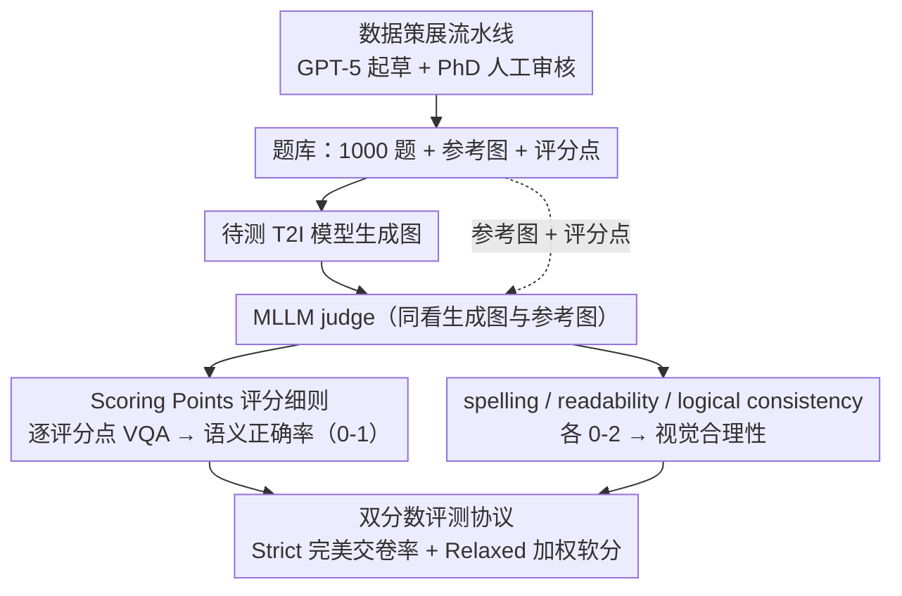

# GenExam: A Multidisciplinary Text-to-Image Exam

**会议**: ICML 2026  
**arXiv**: [2509.14232](https://arxiv.org/abs/2509.14232)  
**代码**: https://github.com/OpenGVLab/GenExam (有)  
**领域**: 多模态 VLM / 评测基准 / 文本到图像生成  
**关键词**: 多学科考试, 文本到图像评测, 评分点, MLLM-as-judge, GPT-Image-1.5

## 一句话总结
GenExam 把"画图考试"作为衡量 T2I 模型推理-理解-生成综合能力的金标准，给 10 个学科、1000 道题各配上 ground-truth 图 + 细粒度评分点，结果连最强闭源模型 Nano Banana Pro 也只有 70.2% strict 分，多数开源 T2I/统一 MLLM 不到 3%。

## 研究背景与动机

**领域现状**：多学科推理已有 MMLU、MMMU、Humanity's Last Exam 等评测，但都是"看懂题目"的理解任务；T2I 端的多学科基准（MMMG、OneIG-Bench、SridBench）以"概念插图"为主，评测准则宽松，类似"用图像说明一个概念"而非"完成一道画图考题"。

**现有痛点**：现有 T2I 评测 (i) prompt 简短宽泛，(ii) 没有参考图也没有评分细则，(iii) 知识面浅且无层次化分类，(iv) 评测端要么靠 CLIP/VQA score（抓不到学科正确性）要么用 MLLM-as-judge 给一句话指令（漏掉大量细节）。导致"画对了几根化学键"、"圆和切线的位置关系"这类硬错误根本评不出来。

**核心矛盾**：多学科图像的关键不是真实感或美学，而是语义正确性——一个原子画错、一个箭头反向，整张图就废了；但通用图像评测指标无法捕捉这种细粒度对错。

**本文目标**：(1) 构造一个像 AP / A-level / IB 画图题那样有标准答案、评分细则、知识分类的 T2I benchmark；(2) 设计一套能可靠判定语义正确性 + 视觉合理性的自动评测协议；(3) 用它系统暴露当前 T2I / 统一 MLLM 在学科生成能力上的真实差距。

**切入角度**：把考试评分逻辑搬到 T2I 评测——每道题不仅有 prompt 和参考图，还有人工 + GPT-5 共同制定的"评分点"列表（如"分子是否恰好含 8 个 C 原子？"），用 MLLM 把每个评分点当 VQA 来答 Yes/No，最后按分数加权汇总。

**核心 idea**：像批改画图考卷一样评测 T2I 模型——每张图先按 customized scoring points 算"语义正确率"，再按 spelling / readability / logical consistency 三个 0-2 分项算"视觉合理性"，最终给出 strict 与 relaxed 双分数。

## 方法详解

### 整体框架
GenExam 要解决的是"通用图像评测指标抓不到学科正确性"这个老问题，办法是把一道画图考题拆成可机判的三件套：题库、评分细则、双维度协议。题库有 1000 道题，覆盖数学/物理/化学/生物/计算机/地理/经济/音乐/历史/工程 10 个一级学科，再按 ISCED-F 标准织出 10/40/132/236 的四层分类。每道题都配一张 ground-truth 参考图、一段平均 74.8 词的 exam-style prompt，以及一组评分点。评测时不再让 judge 笼统地说"对不对"，而是先按评分点算 semantic correctness（0-1），再按 spelling/logic/readability 三项各打 0-2 分算 visual plausibility，最后汇成 strict 和 relaxed 两个分数。

### 关键设计

**1. 数据策展流水线：用 GPT-5 + 人工双层审核兼顾规模与严谨**

网图质量参差不齐，纯人工成本太高，纯 GPT-5 又会"凑数"，所以题库走一条双层流水线：先按四层分类生成关键词，从网图抓取并结合已有 MLLM 数据集做候选筛选；再让 GPT-5 按文本丰富度、学科密度、复杂度三个维度打分过滤；通过的题由 GPT-5 起草 prompt 和 scoring points；最后交 PhD 标注员人工审核与修订。最终 1000 题里 hard 占 38%、medium 38%、easy 24%，prompt 长度跨 24-173 词，难度和学科覆盖都受控。

**2. Scoring Points 评分细则：把"图像对不对"降维成一组 VQA 判定题**

单条 MLLM 指令去评一张学科图，最容易漏掉的恰恰是决定成败的细节——化学键数量、几何位置关系、乐谱上的音符。GenExam 的做法是把每个关键约束显式拆出来：每题由 GPT-5 起草 3-14 个（平均 6.9 个）yes/no 评分点，比如"分子是否恰好含 8 个碳原子？"，再交人工审核细化。评测时 MLLM judge 同时看生成图和参考图，对每个评分点逐一回答 Yes/No，语义正确率按 $\text{semantic} = \sum_i s_i \cdot \mathbb{1}[\text{answer}_i=\text{Yes}]$ 汇总，其中各点权重 $s_i$ 总和为 1。这样"画错一根键"这种硬错误就有了稳定的捕捉点，而不会被一句宽松的总体评价糊弄过去。

**3. 双分数评测协议（Strict + Relaxed）：同时刻画难度天花板和底层差异**

只用一套尺度会顾此失彼：纯 strict 会让大批模型并列 0% 失去区分度，纯加权平均又掩盖了学科图"差一点就全错"的特性。所以 GenExam 并行汇报两个分数。strict 分是"完美交卷率"——一张图必须满足全部评分点、且 spelling/logic/readability 三项都拿满 2 分才算过，错一点就记 0，用来凸显几乎没人能完美的难度。relaxed 分则是加权软分 $0.7\cdot\text{semantic}+0.1\cdot\text{spell}+0.1\cdot\text{logic}+0.1\cdot\text{read}$，权重由人类偏好对齐标定，用来区分一大堆低分模型之间的接近程度。两者一个拉开顶尖闭源差距、一个揭示底层差异。

### 损失函数 / 训练策略
本文是评测 benchmark，本身不涉及训练；唯一可调的是评测端的 MLLM judge——默认用 GPT-5 并把 reasoning effort 设为 low，附录验证了换成 Gemini-3-Flash 等替代品后与人类判断仍高度一致。

## 实验关键数据

### 主实验
在 17 个模型上测 strict / relaxed 双分数（节选）：

| 模型 | 类型 | Strict ↑ | Relaxed ↑ |
|------|------|---------:|----------:|
| Nano Banana Pro | 闭源 | **70.2** | **93.0** |
| GPT-Image-1.5 | 闭源 | 42.5 | 81.5 |
| GPT-Image-1 | 闭源 | 13.1 | 62.2 |
| Seedream 4.5 | 闭源 | 12.3 | 59.5 |
| FLUX.2 max | 闭源 | 8.6 | 61.6 |
| FLUX.2 dev | 开源 T2I | 2.4 | 42.3 |
| Qwen-Image-2512 | 开源 T2I | 1.5 | 35.3 |
| BAGEL (thinking) | 开源统一 MLLM | 0.0 | 12.9 |
| Janus-Pro | 开源统一 MLLM | 0.0 | 9.5 |

最强闭源模型也未及格，多数开源 T2I 几乎全军覆没；开源统一 MLLM 全为 0 strict，比专门 T2I 还差。

### 消融实验

| 评测器 | 与人类 Kendall $\tau$ | Pearson $r$ |
|--------|----------------------:|------------:|
| Relaxed by GPT-5 | **0.675** | **0.844** |
| Relaxed by Gemini-3-Flash | 0.661 | 0.826 |
| 仅 Semantic Correctness | 0.633 | 0.806 |
| VQA Score | 0.145 | 0.179 |
| CLIP Score | 0.116 | 0.165 |

各维度 MAE：semantic 0.10、spelling 0.11、readability 0.20、logic 0.28，均很低，说明评测稳定。

### 关键发现
- **统一 MLLM 反而比专门 T2I 差**：BAGEL、Show-o2 等开源统一模型 strict 全 0，relaxed 也低于 FLUX.2 dev / Qwen-Image-2512，说明"用同一模型理解 + 生成"对学科图像还远未跑通。
- **bottleneck 不在知识，而在视觉执行**：FLUX.2 dev 在历史题里能正确指出埃及/伊朗/印度/中国的地理位置，却画不出对应的图形元素 —— 模型缺的是"把知识翻译成可读图像"的能力。
- **CLIP / VQA score 完全失效**：与人类的相关性接近 0.1，说明传统 T2I 评测指标根本抓不到学科正确性。
- **开源应先攻基本功**：开源模型在 spelling 和 logic consistency 上掉得最猛，提示先把文字渲染、坐标对齐这种基本功补齐，再谈推理。

## 亮点与洞察
- **把"评分细则"显式化是 LLM/T2I 评测可推广的范式**：把笼统的"对/错"拆成结构化 yes/no 列表后，MLLM judge 的 MAE 立刻可控、相关系数远超传统指标。这套思路也适用于 chart QA、code generation、数学解答评测等子任务。
- **strict + relaxed 双指标设计巧妙**：一个突出难度天花板（拉开顶尖闭源差距），一个揭示底层差异（区分多数 0 分模型），既不会被"全部满分"或"全部 0 分"压扁。
- **"考试视角"重新框定了 T2I 评测目标**：以往评 T2I 关心 fidelity / aesthetic / alignment，这里转向"正确性 + 可读性"，更贴近 AGI 路线上对"专家级智能"的检验。
- **数据策展协议可复用**：GPT-5 起草 + 人工细化的双层 pipeline 在很多需要 scoring criteria 的 benchmark 上都能照搬。

## 局限与展望
- 1000 题对覆盖 10 个学科 + 4 层分类来说仍偏少，部分子领域（如音乐）样本只够几十张，统计稳定性受限。
- 依赖 GPT-5 / Gemini-3-Flash 这类前沿闭源 MLLM 做 judge，长期可复现性和成本是隐患；附录测了开源 judge，但与人类相关系数有所下降。
- 评分点权重平均分配且总和为 1，没有体现"主结构 vs 细节"的层次重要度。
- 题目集中在"画图考试"，对动画、视频、3D 等学科可视化任务尚未覆盖。

## 相关工作与启发
- **vs MMMU / MMLU / Humanity's Last Exam**: 都是多学科考试，但都只评 understanding；GenExam 把同样严肃的考试规模带到了 generation 端。
- **vs MMMG / OneIG-Bench / SridBench**: 同为学科图像生成评测，但前者强调"概念插图"宽松；GenExam 的 prompt 更长、约束更硬、评分更细。
- **vs RISEBench / WiScore**: 借鉴了 strict 二值评分和人类对齐的加权方式，但首次把"customized scoring points"扩展到学科级评测。
- **可迁移启发**：把"VQA-style 评分点"做成模型评测的通用接口，对多模态推理、agent benchmark、代码生成评测同样适用；同时也提示统一 MLLM 研究者：当前 unified 架构在学科生成上的劣势提醒"理解 + 生成共用 backbone"的设计仍需重新打磨。

## 评分
- 新颖性: ⭐⭐⭐⭐ 首个学科级 T2I 考试 benchmark，scoring-points 协议是显著创新。
- 实验充分度: ⭐⭐⭐⭐⭐ 17 个模型 × 10 学科 × 双指标 + 5 位人类标注 250 题对齐 + 多 evaluator 鲁棒性，覆盖广。
- 写作质量: ⭐⭐⭐⭐ 图表清晰、协议讲得很透；附录细节稍多，主文需要回头查 token 不太友好。
- 价值: ⭐⭐⭐⭐⭐ 给 T2I 社区第一次给出了"考试级"评测，长期会成为统一 MLLM 学科能力的标尺。

<!-- RELATED:START -->

## 相关论文

- [\[ICML 2026\] WISE: A World Knowledge-Informed Semantic Evaluation for Text-to-Image Generation](wise_a_world_knowledge-informed_semantic_evaluation_for_text-to-image_generation.md)
- [\[ICML 2026\] RAIGen: Rare Attribute Identification in Text-to-Image Generative Models](raigen_rare_attribute_identification_in_text-to-image_generative_models.md)
- [\[ICML 2026\] Restoring Initial Noise Sensitivity in Text-to-Image Distillation via Geometric Alignment](restoring_initial_noise_sensitivity_in_text-to-image_distillation_via_geometric_.md)
- [\[ICML 2026\] Alignment-Guided Score Matching for Text-to-Image Alignment in Diffusion Models](alignment-guided_score_matching_for_text-to-image_alignment_in_diffusion_models.md)
- [\[ICML 2026\] GASS: Geometry-Aware Spherical Sampling for Disentangled Diversity Enhancement in Text-to-Image Generation](gass_geometry-aware_spherical_sampling_for_disentangled_diversity_enhancement_in.md)

<!-- RELATED:END -->
