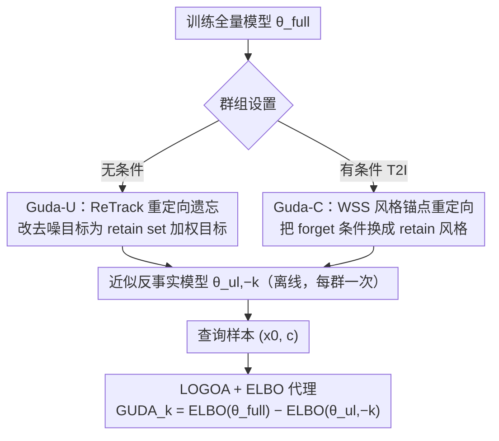

# GUDA: Counterfactual Group-wise Training Data Attribution for Diffusion Models via Unlearning

**会议**: ICML 2026  
**arXiv**: [2601.22651](https://arxiv.org/abs/2601.22651)  
**代码**: https://github.com/sony/guda (有)  
**领域**: 可解释性 / 训练数据归因 / 扩散模型 / 机器遗忘  
**关键词**: 训练数据归因, 反事实, 群组级归因, 机器遗忘, 扩散模型

## 一句话总结
GUDA 把"群组级训练数据归因"重新表述成"如果训练时没有这个群组，模型对该样本的对数似然会掉多少"的反事实问题，用机器遗忘从全量模型上"擦掉某个群组"近似 Leave-One-Group-Out (LOGO) 重训得到的反事实模型，再用 ELBO 差作为归因分数，在 CIFAR-10 和 Stable Diffusion 艺术风格归因上比 CLIP 相似度和实例级梯度归因更准，且比 LOGO 重训快约 100 倍。

## 研究背景与动机

**领域现状**：扩散模型的训练数据归因（Training Data Attribution, TDA）目前多停留在实例级别——Influence Function、TracIn、TRAK、D-TRAK、DAS 等方法回答"哪个具体训练样本对这次生成贡献最大"。但在版权评估、数据贡献者公平补偿、风格审计这些真实场景里，人们要的其实是群组级答案：是哪一个艺术家、哪一个物体类别贡献了这张生成图。

**现有痛点**：把实例级分数简单加总并不能等价于群组级归因，原因有二：(1) 可扩展性差，数据集变大后逐样本评估成本爆炸；(2) 非线性，群组之间通过共享表示交互，整体效应并非各样本之和。已有的相似度方法（如 CLIP 余弦距离）只测嵌入空间的视觉相似，不反映"训练时去掉这个群组模型会变成什么样"的因果效应；而把实例级遗忘信号当成归因（如 Wang et al. 2024）也被作者实验证明在群组级别上几乎随机。

**核心矛盾**：群组级归因的金标准是 LOGO 重训——对每个群组 $k$ 从头训一份"去掉 $\mathcal{D}_k$"的反事实模型 $\theta^{\mathrm{logo}}_{-k}$，再比较它和全量模型 $\theta^{\mathrm{full}}$ 在样本上的解释力。理论上干净，但要训 $N+1$ 个模型，群组一多就完全不可行（论文里 CIFAR-10 上 LOGO 跑了 207 小时）。

**本文目标**：在保持"反事实模型"这个清晰的估计目标的前提下，找到一个不需要重训就能近似 $\theta^{\mathrm{logo}}_{-k}$ 的可扩展方案，并且能验证近似质量。

**切入角度**：群组归因问的"如果群组 $k$ 不存在会怎样"本质上就是一个数据删除查询，而这正是机器遗忘 (machine unlearning) 在做的事。于是可以从全量模型 $\theta^{\mathrm{full}}$ 出发，只对该群组做轻量遗忘微调，得到反事实近似 $\theta^{\mathrm{ul}}_{-k}$。

**核心 idea**：定义 LOGOA 反事实估计量 = 全量模型与 LOGO 反事实模型在样本上的 ELBO 差，再用"以 LOGO 为目标"的遗忘算子（无条件用 ReTrack 重定向，有条件用风格锚点重定向）逼近反事实模型，把"重训 $N+1$ 次"换成"训一次全量 + 每群做一次遗忘微调"。

## 方法详解

### 整体框架

GUDA 的端到端流程分两个阶段：

1. **反事实模型预构造**：训练一个共享的全量模型 $\theta^{\mathrm{full}}$，然后对每个群组 $k=1,\ldots,N$ 用遗忘算子 $\mathcal{U}$ 从 $\theta^{\mathrm{full}}$ 出发产出近似反事实模型 $\theta^{\mathrm{ul}}_{-k} = \mathcal{U}(\theta^{\mathrm{full}}; \mathcal{D}_k, \mathcal{D}_{-k})$。这一阶段只做一次，可离线复用。
2. **查询时打分**：给定生成样本 $(x_0, c)$，对每个群组只需在 $\theta^{\mathrm{full}}$ 和 $\theta^{\mathrm{ul}}_{-k}$ 下分别计算 ELBO，作差得到 $\mathrm{GUDA}_k(x_0, c) = \mathrm{ELBO}(x_0|c; \theta^{\mathrm{full}}) - \mathrm{ELBO}(x_0|c; \theta^{\mathrm{ul}}_{-k})$。分数为正表示全量模型解释力更好，即群组 $k$ 对生成有贡献。

ELBO 选用是关键工程妥协：log-likelihood 可以通过 probability-flow ODE 算，但跑 $N$ 个反事实模型 × 大量查询太贵；ELBO 作为下界与 log-likelihood 高度相关（在 CIFAR-10 上用 ODE 估计的 $\Delta \log p$ 经验上与 $\Delta\mathrm{ELBO}$ 强相关），尤其在头部群组识别上稳定。

统一遗忘损失结构为 $\mathcal{L}_{\text{unlearn}} = \mathcal{L}_{\text{forget}} + \lambda_{\text{pres}} \mathcal{L}_{\text{preserve}}$，其中保留项 $\mathcal{L}_{\text{preserve}} = \mathbb{E}_{(x,c) \sim \mathcal{D}_{-k}, t, \varepsilon}[\|\epsilon_\theta(x_t, t, c) - \epsilon_{\theta^{\mathrm{full}}}(x_t, t, c)\|_2^2]$ 是冻结全量模型做 score matching 防止灾难性遗忘；遗忘项 $\mathcal{L}_{\text{forget}}$ 在无条件 (Guda-U) 和有条件 (Guda-C) 两种 setting 下不同。

### 关键设计

**1. LOGOA 反事实估计量 + ELBO 代理：先把"oracle 是什么"钉死，再谈近似**

很多归因工作直接抛一个分数公式就去比 metric，GUDA 反过来先定义清楚理想答案：对生成样本 $(x_0, c)$ 与群组 $k$，反事实影响就是全量模型与 LOGO 重训模型在该样本上的解释力之差 $\mathrm{LOGOA}_k(x_0, c) = \mathrm{ELBO}(x_0|c; \theta^{\mathrm{full}}) - \mathrm{ELBO}(x_0|c; \theta^{\mathrm{logo}}_{-k})$。理想上这里该用 $\log p_\theta$，但扩散模型的对数似然得靠 probability-flow ODE 估计、每次评估都很贵，于是换成 tractable 的下界 ELBO（ELBO 越大代表模型给该样本的下界似然越大，在 CIFAR-10 上 $\Delta\mathrm{ELBO}$ 与 ODE 估的 $\Delta\log p$ 经验强相关）。把 oracle 写清楚的好处是：后续任何遗忘方法的质量都有了一个直接可比的验证靶子——离 $\theta^{\mathrm{logo}}_{-k}$ 多近，而不是"换一种遗忘损失再调一调"。这也一句话解释了实例级的 Wang et al. (2024) 为何在群组归因上几乎随机：他们的估计量根本不指向 $\theta^{\mathrm{logo}}_{-k}$。

**2. Guda-U：无条件设置下的 ReTrack 重定向遗忘**

有了 oracle，剩下的问题就是怎么不重训也能逼近 $\theta^{\mathrm{logo}}_{-k}$。痛点在于通用遗忘损失（如 ESD）只关心"让模型别再生成群组 $k$ 的内容"，方向并不对齐 LOGO 反事实。ReTrack 的做法是直接改去噪目标：对来自遗忘群组的 $x_0^{(f)} \in \mathcal{D}_k$ 加噪得到 $x_t$ 后，不再让模型去预测它原本的噪声 $\varepsilon$，而是预测一个 retain set 上的重要性加权目标 $\bar{\varepsilon}_t(x_t) = \sum_{x_0^{(r)} \in \mathcal{D}_{-k}} w_t(x_t; x_0^{(r)}) (x_t - \sqrt{\bar{\alpha}_t} x_0^{(r)})/\sigma_t$，权重 $w_t \propto q_t(x_t|x_0^{(r)})$，实现里只取最近 $K$ 个邻居。完整版 ReTrack 还带一个密度比修正项，使整个遗忘目标在期望意义下恰好等于"只在 retain set 上训练"的目标——这正是 LOGO 想要的反事实；实践版省掉密度比、用近邻截断作为高效近似。因为遗忘算子的方向直接决定了反事实近似有多准，它成了整个 GUDA 框架里最关键的可换零件：同框架下把 ReTrack 换成 ESD，Top-1 就从 72.7% 掉到 61.9%，差距完全来自这一个选择。

**3. Guda-C：有条件 T2I 下的加权风格选择锚点 (WSS)**

把 ReTrack 照搬到 Stable Diffusion 这类 text-to-image 模型上会直接失败，因为多出一个新难点：一旦"删掉风格 $k$"，那些包含风格 $k$ 的 prompt 在 retain-only 训练下就成了 out-of-support，LOGO 重写出的去噪问题里 forget condition 落在训练支撑集之外，posterior target 根本没定义。WSS 的解法是"换皮不换骨"——给一对 forget 样本 $(x_f, c_f) \sim \mathcal{D}_k$ 构造锚点条件 $c_a$：保留 $c_f$ 里的内容描述（物体/场景），只把风格描述替换成从 retain styles $\mathcal{S}_{\text{retain}}$ 中按 CLIP 相似度加权采样的一个风格 $s$（例如把 Abstractionism 的"dynamic forms, energetic"换成 Artist Sketch 的"grayscale, sketchy, soft shading"）。遗忘损失随之变成让待遗忘模型在 forget condition 下的预测去对齐冻结全量模型在 retain anchor 下的预测：$\mathcal{L}_{\text{forget}}^{(C)} = \mathbb{E}[\|\epsilon_\theta(x_t, t, c_f) - \epsilon_{\theta^{\mathrm{full}}}(x_t, t, c_a)\|_2^2]$。这样既把 forget condition 重定向回 retain prompt 分布、消除 condition-distribution mismatch，又让监督目标和当前 noisy latent $x_t$（来自 forget 图）在内容上保持一致，使 score matching 仍然有意义。

### 损失函数 / 训练策略

总损失 $\mathcal{L}_{\text{unlearn}} = \mathcal{L}_{\text{forget}} + \lambda_{\text{pres}} \mathcal{L}_{\text{preserve}}$。Guda-U 的 $\mathcal{L}_{\text{forget}}^{(U)}$ 是 ReTrack 重要性加权目标 (Eq. 8)；Guda-C 的 $\mathcal{L}_{\text{forget}}^{(C)}$ 是 WSS 锚点重定向 (Eq. 9)。保留项统一用 score-matching 蒸馏到 retain set。CIFAR-10 上每个反事实只跑 20 epoch（对比 LOGO 从头训 2,400 epoch），UnlearnCanvas 上从 SD 1.5 共享 checkpoint 出发分别做 fine-tune LOGO 和遗忘，都只算 fine-tuning 成本，反映大模型场景的真实工程口径。

## 实验关键数据

### 主实验

CIFAR-10（10 类，2,048 个 query，全部方法群组归因对比）：

| 方法 | Top-1 ↑ | NDCG@3 ↑ | Spearman ↑ | 总耗时 |
|------|---------|----------|------------|--------|
| GUDA (ReTrack) | **0.727** | **0.677** | 0.265 | 2:02 |
| GUDA w/ ESD | 0.619 | 0.634 | 0.241 | 1:33 |
| CLIPA (相似度) | 0.662 | 0.646 | 0.246 | <1 秒 |
| DAS (实例级梯度) | 0.716 | 0.675 | **0.267** | 35:24 |
| D-TRAK | 0.609 | 0.639 | 0.258 | 30:30 |
| TRAK | 0.118 | 0.317 | 0.030 | 30:58 |
| LOGOA (oracle) | — | — | — | 207:47 |

UnlearnCanvas（Stable Diffusion 1.5，60 风格训练，16 风格评估，320 query）：

| 方法 | Top-1 ↑ | NDCG@3 ↑ | RBO ↑ | Spearman ↑ | 总耗时 |
|------|---------|----------|-------|------------|--------|
| GUDA (Ours) | **0.456** | **0.734** | **0.446** | **0.239** | 8:54 |
| CLIPA | 0.338 | 0.672 | 0.393 | 0.117 | <1 秒 |
| Wang et al. (2024, 实例级遗忘) | 0.047 | 0.588 | 0.355 | 0.147 | 158:33 |
| LOGOA (oracle) | — | — | — | — | 46:08 |

### 消融实验

| 配置 | Top-1 | 说明 |
|------|-------|------|
| GUDA + ReTrack forget | 0.727 | 完整方法 |
| GUDA + ESD forget | 0.619 | 同一框架换遗忘损失，Top-1 掉 10.8 个点，证明 LOGO-aligned 损失才是关键 |
| CLIPA | 0.662 | 纯相似度，没看反事实 |
| Wang et al. (实例级遗忘) | 0.047 | 把生成图本身做遗忘的实例级信号 → 群组级几乎随机 |

### 关键发现

- **遗忘算子的选择直接决定归因质量**：同一 GUDA 框架下，把 forget 损失从 ReTrack 换成 ESD，Top-1 从 72.7% 掉到 61.9%——意味着未来更好的 LOGO 对齐遗忘方法可以直接换上而不用改框架。
- **语义相似度 ≠ 反事实影响**：CLIPA 在 CIFAR-10 上 66.2% Top-1，与视觉上清晰可分的 10 类相比已经不算差，但相比 GUDA 仍有 6.5 个点的差距；UnlearnCanvas 上更显著（33.8% vs 45.6%），相似度抓不到"训练时去掉这个风格模型会变成什么"。
- **实例级方法不能简单聚合成群组级**：TRAK 在 CIFAR-10 上 11.8% Top-1（10% 是随机水平），Wang et al. 在 SD 上 4.7%——汇总实例梯度或 loss 排名没法捕捉群组的非线性相互作用，必须直接对反事实模型建模。
- **效率压倒性优势**：CIFAR-10 上 GUDA 比 LOGO oracle 快约 100 倍（2h vs 207h），主要来源是遗忘只需 20 epoch 而 LOGO 要从头训 2,400 epoch；查询时也比梯度法 DAS 快约 7 倍（1.6s vs 11.6s/张）。
- **Head 指标比 Spearman 更可靠**：Wang et al. 的 Spearman (0.147) 还高于 CLIPA (0.117)，但 Top-1 几乎随机；Spearman 等权全排名时尾部一致也能加分，所以群组归因实际场景应以 Top-k / NDCG@k / MRR 为主。

## 亮点与洞察

- **把"群组归因"和"机器遗忘"两个表面无关的研究方向用一个反事实定义连了起来**：群组归因要的反事实模型，正是遗忘算法要构造的对象，于是一边的进步可以直接转化为另一边的提升。这是论文最 elegant 的地方。
- **先定义 oracle，再设计近似**：很多归因工作直接给一个分数公式然后比 metric，GUDA 反其道而行——先把 LOGOA 这个 oracle 写清楚，再用 LOGO 重训作为 ground truth 验证遗忘近似，把归因方法的好坏归约到"遗忘算子离 LOGO 多近"，方法论清晰可继承。
- **WSS 锚点构造法可以迁移到任何"删条件分布也会一起被删"的反事实问题**：例如在条件生成里做"如果训练时没有某个文本概念"的反事实评估，朴素方法都会遇到 condition-distribution mismatch；WSS 这种"内容固定、属性替换并按相似度采样"的锚点设计是一种通用模式。
- **离线预计算 + 在线常数时间查询**的工程结构很适合做"风格归因即服务"——一次性把每个风格的反事实模型算好后，每个新生成图只需 ELBO 评估。

## 局限与展望

- **不重叠群组假设**：当前理论和实验都假设 $\{\mathcal{D}_k\}$ 是 partition，每个样本只属于一个群组；现实里艺术风格、主题、对象常重叠交叉，扩展到 overlapping groups 是作者明确留作 future work 的方向。
- **ELBO 不是 log-likelihood**：作者只在 CIFAR-10 上经验验证了 $\Delta\mathrm{ELBO}$ 和 $\Delta\log p$ 强相关，KL gap 的不对称在原则上可能扭曲尾部群组的排序，所以论文也强调以头部识别为主要应用场景。
- **不是认证删除**：GUDA 的遗忘是反事实模型的计算近似，不提供任何信息论或密码学意义上的删除保证，不能用于真正需要 verifiable data removal 的合规场景。
- **大规模评估仍受限**：UnlearnCanvas 上虽然在 60 风格里训练，但只在前 16 个评估，且 LOGO oracle 自己也只是 fine-tuning LOGO 而非从头训。在真实 LAION 规模上的 LOGO 验证仍是开放问题。
- **未尝试更强的遗忘算子**：作者主要对比了 ReTrack 和 ESD，后续如果有针对 LOGO 对齐设计的新遗忘损失（例如显式加密度比修正、加二阶校正），按论文框架可以直接替换并预期得到更高归因精度。

## 相关工作与启发

- **vs Influence Function / TRAK / TracIn**：这些是实例级 TDA，回答"哪个样本影响最大"；GUDA 改回答"哪个群组影响最大"，并明确指出聚合实例级分数无法捕捉群组的非线性交互（Koh et al. 2019, Basu et al. 2020 同样观察）。
- **vs Data Shapley / CS-Shapley / Lu et al. (2025)**：这些是 cooperative game theory 视角的数据估值，目标函数是某个 value function 而非反事实模型本身；GUDA 直接构造 $\theta^{\mathrm{logo}}_{-k}$ 这个 oracle 并近似它，方法学更"模型中心"。
- **vs Wang et al. (2024)**：同样用了"unlearning for attribution"标签，但他们 unlearn 的是合成出来的目标图（用来得到 loss-based ranking），而 GUDA unlearn 的是整个群组，目标是反事实模型；实验里 Wang 在群组归因上几乎随机。
- **vs ESD / Forget-Me-Not / EraseDiff / ReTrack**：这些是为"概念/数据删除"而设计的遗忘方法；GUDA 把它们当成 LOGO 近似工具来用，并且证明 ReTrack 因为在期望意义下等于 retain-only 训练，是目前最适合做归因近似的遗忘算子。

## 评分
- 新颖性: ⭐⭐⭐⭐⭐ "群组归因 = 反事实模型构造问题 = 机器遗忘"的桥接非常 clean，重新定义了一类问题的攻击面
- 实验充分度: ⭐⭐⭐⭐ CIFAR-10 上有完整 LOGO oracle 验证，UnlearnCanvas 上做了 SD 1.5 真实 T2I 场景；但只 16 个风格、且 LOGO 也用 fine-tune 代理，没有更大规模 LAION 级验证
- 写作质量: ⭐⭐⭐⭐⭐ 先讲 LOGOA oracle 再讲 GUDA 近似的叙事顺序非常清晰，Algorithm 1 和两个 Table 把方法和数字交代得很扎实，正负面 Limitations 都明确写出
- 价值: ⭐⭐⭐⭐⭐ 在 AI 版权、数据贡献者补偿、生成模型审计场景里是工业级有用的工具，并且框架开放，新的遗忘算子可以即插即用

<!-- RELATED:START -->

## 相关论文

- [\[NeurIPS 2025\] Large-Scale Training Data Attribution for Music Generative Models via Unlearning](../../NeurIPS2025/image_generation/large-scale_training_data_attribution_for_music_generative_models_via_unlearning.md)
- [\[ICML 2026\] Barriers to Counterfactual Credit Attribution for Autoregressive Models](barriers_to_counterfactual_credit_attribution_for_autoregressive_models.md)
- [\[ICML 2026\] Stage-wise Distortion-Perception Traversal in Zero-shot Inverse Problems with Diffusion Models](stage-wise_distortion-perception_traversal_in_zero-shot_inverse_problems_with_di.md)
- [\[ICML 2026\] A Unified Framework for Diffusion Model Unlearning with f-Divergence](a_unified_framework_for_diffusion_model_unlearning_with_f-divergence.md)
- [\[ICML 2026\] Localizing Memorized Regions in Diffusion Models via Coordinate-Wise Curvature Differences](localizing_memorized_regions_in_diffusion_models_via_coordinate-wise_curvature_d.md)

<!-- RELATED:END -->
