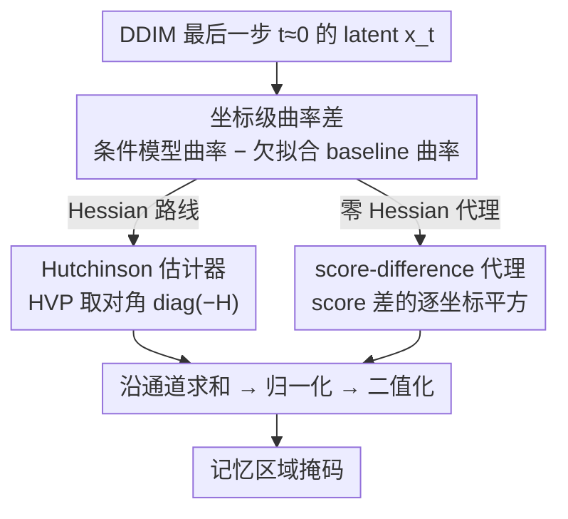

# Localizing Memorized Regions in Diffusion Models via Coordinate-Wise Curvature Differences

**会议**: ICML 2026  
**arXiv**: [2605.26756](https://arxiv.org/abs/2605.26756)  
**代码**: https://github.com/Gwangho99/mem-curv-diff  
**领域**: AI 安全 / 扩散模型记忆 / 隐私版权  
**关键词**: 扩散模型记忆, 局部记忆定位, 曲率差, score difference, Fisher 信息

## 一句话总结
本文把"扩散模型局部记忆"刻画为对数密度在某些坐标上的**方差崩塌（高曲率）**，并用"条件模型 − 欠拟合基线（无条件模型或早期 checkpoint）"的**坐标级曲率差**，把单纯由数据流形固有低方差引起的"伪记忆"扣掉，只保留**过拟合驱动的记忆区域**，在 Stable Diffusion 的 ground-truth 记忆掩码上把定位 IoU 从 BE 的 0.75 提到约 0.92。

## 研究背景与动机

**领域现状**：扩散模型（DDPM、Stable Diffusion 等）已被证实会"复现"训练样本，引发隐私和版权问题。检测/定位记忆的主流路线有两类：(1) 全局检测，例如 Wen 等提出的 score-difference 指标 $\|s_\theta(x_t,c) - s_\theta(x_t)\|_2$，用条件分支对文本依赖异常强这一直觉给整张图打一个标量分；(2) 几何视角，Ross 等用低 LID（Local Intrinsic Dimensionality）刻画记忆，Jeon 等用对数概率"尖锐度"解释 score-difference 是条件/无条件模型 sharpness gap。

**现有痛点**：现有方法要么只给全局标量、要么需要模型内部特定信号。空间定位方面，Chen 等的 Bright Ending (BE) 利用 cross-attention 最后一步做空间掩码，但严重 model-specific 且经常在非记忆区域亮起，复杂前景下假阳性多。机理方面，没人说清楚"为什么 sharpness gap 本身是关键信号"、"为什么无条件模型是合适的参考"。

**核心矛盾**：低 LID / 高 sharpness 只能告诉你"塌了几个维度"，但不告诉你"塌在哪些像素上"；而即便能用 Hessian 取坐标级曲率，高曲率也可能来自数据本身的低方差结构（如 prompt 指定的纯黑背景），把这种 DD-Mem（data-driven）当作记忆是误判。

**本文目标**：(1) 给出一个 model-agnostic、几何上可解释的**空间定位**度量，能精准标出"图里哪些像素是从训练集抄过来的"；(2) 顺便回答"为什么 score-difference 这个老 trick 有效"。

**切入角度**：把局部记忆重新定义为**坐标级方差崩塌**——同样是 LID=64，分布在整张图上是合法的概念变化，集中在一个 8×8 patch 上则是 template verbatim。借助 Tweedie 关系（命题 4.1），$x_0$ 的条件协方差正比于 $\sigma_t^4 \nabla^2_{x_t}\log p(x_t) + \sigma_t^2 I$，所以"坐标 $i$ 方差很小"等价于"$-(\nabla^2_{x_t}\log p)_{ii}$ 很大"，于是定位问题变成测**对角 Hessian**。

**核心 idea**：用"条件模型坐标曲率 − 一个欠拟合 baseline 的坐标曲率"扣掉数据流形固有曲率，剩下的就是过拟合驱动的记忆；并证明常用的 score-difference 平方在 $t \to 0$ 时正是这个曲率差的 Fisher-信息型近似，从而给老指标补上几何解释。

## 方法详解

### 整体框架

本文要解决的是"图里哪些像素是从训练集抄来的"这个空间定位问题，而它的整套方法都建立在一个翻译上：借 Tweedie 关系（命题 4.1）把"某坐标方差崩塌"等价改写成"对数密度在该坐标的曲率很大"，于是定位变成测对角 Hessian。但高曲率有真有假——真记忆是过拟合，假记忆是 prompt 强制的纯色背景这类数据固有低方差。本文的核心动作就是用一个"欠拟合 baseline"的曲率去减条件模型的曲率，把数据固有的那部分扣掉，只留下过拟合贡献，并配上一个零 Hessian 的 score-difference 代理让方法跑得起来。整条流程都在 DDIM 最后一步（$t\approx 0$）的 latent 上做：先正常 CFG 采样得到接近终点的 $x_t$，算曲率差或其 score 代理，沿通道求和、归一化、二值化，即得记忆掩码。

### 关键设计

**1. 坐标级曲率差：用欠拟合 baseline 减掉数据流形固有曲率**

直接看 $\text{diag}(-H_\theta(x_t,c))$ 会误报——作者用 Figure 3 的反例说明，"a black background" 这类纯色区域、以及非记忆样例的曲率也会很高，因为这些像素是 prompt 语义强制约束的低方差结构，并非抄训练集。解决办法是减去一个"拟合得更松"的参考模型曲率。本文给两种 baseline：无条件分支，$\Delta h_\emptyset^t := \text{diag}(-H_\theta(x_t,c)) - \text{diag}(-H_\theta(x_t))$（式 1）；以及早期 checkpoint $\tilde\theta$，$\Delta h_{\tilde\theta}^t := \text{diag}(-H_\theta(x_t,c)) - \text{diag}(-H_{\tilde\theta}(x_t,c))$（式 2，论文用 SD v1.1 当 v1.4 的 baseline、SD v2.0 当 v2.1 的 baseline）。无条件模型被迫一次性拟合整个数据分布、拟合相对宽松，恰好保留数据流形固有曲率；条件模型只需在单 prompt 上拟合，会把过拟合像素的曲率进一步推高。两者相减，纯色背景这种数据固有曲率被压平，记忆区域反而被反差出来。

**2. Hutchinson 估计器：不构造全 Hessian 也能取对角**

SD 的 latent 维度 $d\sim 10^5$，显式构造或存储整个 Hessian 完全不可行，而设计 1 只需要对角元 $\text{diag}(H)$。本文用 Hutchinson 估计器（Hutchinson 1989）绕过：取随机 Rademacher 向量 $v$，借自动微分算 Hessian–vector product $Hv=\nabla_x(s_\theta(x,c)^\top v)$，则 $\mathbb{E}[v\odot(Hv)]=\text{diag}(H)$。这样每估一次对角只要几次反传，曲率差就是对条件模型和 baseline 各跑一遍 HVP 再相减。默认取 $K=16$ 个随机样本，但论文指出 $K=1$ 已经有竞争力，这正是让"几何视角"落到工程上的关键。

**3. score-difference 代理：Fisher 信息恒等式给 Wen 指标补几何解释**

即便有 Hutchinson，Hessian 路线仍比纯前向贵，于是本文给出一个零 Hessian 的代理，顺手解释了 Wen 等 2024 的全局检测指标为什么有效。命题 4.2 的 Fisher 信息恒等式 $\mathcal{I}(x)=\mathbb{E}_{c\sim p(c|x)}[-\nabla_x^2\log p(c|x)]$ 取对角后给出

$$\mathbb{E}_c\big[\text{diag}(-\nabla_x^2\log p(x|c)+\nabla_x^2\log p(x))\big]=\mathbb{E}_c\big[(\nabla_x\log p(x|c)-\nabla_x\log p(x))^{\odot 2}\big],$$

也就是"对角曲率差"在期望意义下等于"score 差的逐坐标平方"。据此定义 $\Delta s_\emptyset^t := (s_\theta(x_t,c)-s_\theta(x_t))^{\odot 2}$（式 5）与 $\Delta s_{\tilde\theta}^t := (s_\theta(x_t,c)-s_{\tilde\theta}(x_t,c))^{\odot 2}$（式 6）当 $\Delta h$ 的代理。当 $t\to 0$，$x_t$ 已几乎确定 $c$，把期望替换成生成所用的单个 $c$ 误差极小，所以代理在最后一步格外准。无条件代理还能直接复用 CFG 自带的那一项，几乎零额外推理。更重要的是它给老指标换了解释：Wen 的全局 $\|s_\theta(x,c)-s_\theta(x)\|_2$ 本质是"坐标级曲率差的空间求和"，关键不在"条件信号强度"，而在"减掉欠拟合 baseline"这一步把数据固有复杂度滤掉了——这也说清了为什么参考必须是无条件模型。

### 损失函数 / 训练策略

本文不引入新训练，仅在已有 SD checkpoint 上做推理与梯度计算。所有度量都在 DDIM 最后一步 $t\approx 0$ 评估，沿通道维求和得到 2D 空间图，再做全数据集级 $[0,1]$ 归一化后二值化。

## 实验关键数据

### 主实验：用 ground-truth 模板掩码做空间定位

模型：Stable Diffusion v1.4 / v2.1；baseline 模型 $\tilde\theta$ 用 SD v1.1 / v2.0；ground-truth 掩码来自 Webster (2023) 的 template-verbatim 数据。指标：IoU / Pixel ACC。

| 方法 | SD v1.4 TV IoU | SD v1.4 All IoU | SD v2.1 TV IoU | SD v2.1 TV+Non IoU |
|------|----------------|------------------|----------------|---------------------|
| All-ones（平凡基线） | 0.560 | 0.522 | 0.649 | 0.325 |
| BE (Chen et al., 2025) | 0.751 | 0.564 | 0.933 | 0.956 |
| $\text{diag}(-H_\theta(x_t,c))$（原始曲率） | 0.586 | 0.522 | 0.649 | 0.500 |
| $\Delta h_\emptyset$（本文，式 1） | **0.899** | **0.953** | 0.943 | 0.866 |
| $\Delta s_\emptyset$（本文代理，式 5） | 0.830 | 0.918 | 0.785 | 0.794 |
| $\Delta h_{\tilde\theta}$（本文，式 2） | **0.921** | 0.867 | **0.947** | 0.828 |
| $\Delta s_{\tilde\theta}$（本文代理，式 6） | 0.863 | 0.654 | 0.920 | 0.844 |

curvature-difference 方法在 SD v1.4 TV 上把 IoU 从 BE 的 0.751 提到 0.92 左右；在 SD v1.4 "All"（含全局记忆 + 非记忆）上更夸张，从 0.564 提到 0.953。在 SD v2.1 上 BE 表现接近本文，原因是 SD v2.1 的记忆 prompt 约 85% 是 "Shaw Floors"（纯色地板背景），cross-attention 末尾 token 的简单背景偏好刚好对得上，但论文后段的 qualitative 例子里 BE 在复杂场景仍频繁误报。

### 检测实验（按空间均值聚合做全局检测）

| 方法 | SD v1.4 AUC / TPR@1%FPR | SD v2.1 AUC / TPR@1%FPR |
|------|--------------------------|--------------------------|
| $\mathbb{E}[\text{BE-attention}]$ | 0.886 / 0.390 | 0.945 / 0.877 |
| $\mathbb{E}[\text{diag}(-H_\theta(x_t,c))]$ | 0.861 / 0.082 | 0.775 / 0.000 |
| $\mathbb{E}[\Delta h_\emptyset]$ | 0.997 / 0.982 | 0.995 / 0.950 |
| $\mathbb{E}[\Delta h_{\tilde\theta}]$ | 0.989 / 0.900 | 0.996 / 0.963 |
| $\mathbb{E}[\Delta s_\emptyset]$ | 0.997 / 0.982 | 0.997 / 0.968 |
| $\mathbb{E}[\Delta s_{\tilde\theta}]$ | **0.998 / 0.988** | 0.993 / 0.968 |

聚合后做检测，4 个差分式度量都把 AUC 推到 0.99 以上、TPR@1%FPR 接近 0.97–0.99，全面超过 BE-attention 和原始曲率。

### 关键发现
- "减一个 underfitted baseline"才是关键，不是"测 sharpness"本身：原始 $-H_\theta(x_t,c)$ 的检测 AUC 仅 0.86 / 0.77，减完无条件分支立刻飞到 0.99+。这也是本文给 Wen 老指标的新解释——subtract 操作把数据固有曲率滤掉、只留过拟合贡献。
- score-difference 代理在全局聚合上反而比 Hessian 代价更小且不输：spatial averaging 把 score 的局部噪声平滑掉了；但在精细定位上 score 噪点更多，文中提到 $\Delta s_{\tilde\theta}$ 在 SD v1.4 "All" 上 IoU 跌到 0.654，加一个 $13\times13$ mean filter 就能回到 0.820。
- 当 baseline 自身已有记忆（SD v2.0）仍能在 SD v2.1 上定位记忆，说明 fine-tune 阶段曲率持续增大，sharpening 是个连续过程而非二值开关。

## 亮点与洞察
- **把"为什么 Wen 的 score-difference 有效"从直觉升级成 Fisher 信息恒等式**：原来大家觉得记忆 prompt 文本依赖更强，本文证明这个 $\ell_2$ 平方是"对角曲率差"的无偏代理，从而第一次说清楚"为什么减无条件分支而不是其他东西"。
- **把 LID 那一套全局几何细化到坐标级**：同样 LID=64 的两个样本可以是概念变化也可以是 template verbatim，作者用一个 4 维线性高斯玩具（Figure 2）极简地展示了"全局维度相同、坐标方差结构截然不同"，把 verbatim 与 concept 记忆分离这件事讲清楚。
- **Hutchinson + score-proxy 双轨制**：精细定位用 Hessian，全局检测用 score-difference，工程上一套度量族覆盖两个任务，且 score 代理几乎零额外推理成本，落地友好。

## 局限与展望
- 作者承认 Hessian 路线时间开销比 BE 大，但 $K=1$ Hutchinson 已 competitive，且 score-difference 代理零 Hessian。
- 方法被显式设计来抓 verbatim/local 记忆（坐标级方差崩塌），对 concept 级记忆（名人、风格——自由度散布全图）天然不敏感，作者把这列为 future work。
- baseline 选择对 $\Delta h_{\tilde\theta}$ 影响不小，需要有合适的"早期 checkpoint"；对那些没有公开早期版本的私有模型，只能退回 $\Delta h_\emptyset$。
- 评估依赖 Webster 提供的 SD-only ground-truth 掩码，是否能迁移到更现代的 DiT / 视频扩散需要新基准。

## 相关工作与启发
- **vs Bright Ending (Chen et al., 2025)**: BE 用 cross-attention 末步做空间定位，model-specific 且易在复杂前景误报；本文换成 Hessian/score 几何信号，model-agnostic、IoU 在 SD v1.4 TV 上从 0.751 提到 0.92。
- **vs Wen et al., 2024（score-difference）**: Wen 把它当"条件依赖强度"做全局检测；本文证明它是坐标曲率差的 Fisher 代理，从而(1) 解释了无条件 baseline 的必要性 (2) 顺手把它升级为空间度量。
- **vs Ross et al., 2025（LID/MMH）**: MMH 给出 OD-Mem vs DD-Mem 二分；本文继承这个分类但只把 OD-Mem 当"该报警的记忆"，并通过差分扣掉 DD-Mem，把 MMH 从全局 LID 扩展到坐标级曲率。
- **vs Jeon et al., 2025（sharpness）**: Jeon 解释 score-diff 是 conditional/unconditional sharpness gap；本文进一步指出"gap 本身才是过拟合信号"的几何根因——unconditional 是欠拟合 baseline。

## 评分
- 新颖性: ⭐⭐⭐⭐ 把局部记忆首次显式刻画成坐标级方差崩塌，并把 Wen 指标重新解读为 Fisher 曲率差，理论很干净。
- 实验充分度: ⭐⭐⭐⭐ 同时在 SD v1.4/v2.1 上用 ground-truth 掩码做定位 + 检测两套任务，4 个度量互证，但只覆盖 SD 系列。
- 写作质量: ⭐⭐⭐⭐ 命题–直觉–反例三段式推进，Figure 2 玩具反例尤其优雅，逻辑链工整。
- 价值: ⭐⭐⭐⭐ 对扩散模型隐私/版权审计是直接可用的工具，且代码已开源，工程门槛低。

<!-- RELATED:START -->

## 相关论文

- [\[ICML 2026\] GUDA: Counterfactual Group-wise Training Data Attribution for Diffusion Models via Unlearning](guda_counterfactual_group-wise_training_data_attribution_for_diffusion_models_vi.md)
- [\[ICML 2026\] Stage-wise Distortion-Perception Traversal in Zero-shot Inverse Problems with Diffusion Models](stage-wise_distortion-perception_traversal_in_zero-shot_inverse_problems_with_di.md)
- [\[CVPR 2026\] Attention, May I Have Your Decision? Localizing Generative Choices in Diffusion Models](../../CVPR2026/image_generation/attention_may_i_have_your_decision_localizing_generative_choices_in_diffusion_mo.md)
- [\[ICML 2025\] Localizing and Mitigating Memorization in Image Autoregressive Models](../../ICML2025/image_generation/localizing_and_mitigating_memorization_in_image_autoregressive_models.md)
- [\[ICML 2026\] WISE: A World Knowledge-Informed Semantic Evaluation for Text-to-Image Generation](wise_a_world_knowledge-informed_semantic_evaluation_for_text-to-image_generation.md)

<!-- RELATED:END -->
