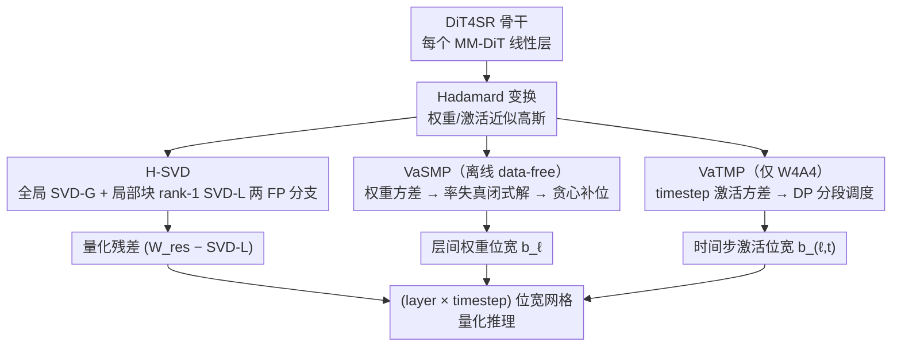

# Q-DiT4SR: Exploration of Detail-Preserving Diffusion Transformer Quantization for Real-World Image Super-Resolution

**会议**: ICML 2026  
**arXiv**: [2602.01273](https://arxiv.org/abs/2602.01273)  
**代码**: https://github.com/xunzhang1128/Q-DiT4SR (待开源)  
**领域**: 模型压缩 / 扩散模型量化 / 真实图像超分  
**关键词**: PTQ, Diffusion Transformer, Hierarchical SVD, 混合精度, Real-ISR

## 一句话总结
本文首次为基于 DiT 的真实图像超分（Real-ISR）设计了 PTQ 框架 Q-DiT4SR，通过「全局低秩 + 局部分块 rank-1」的层级 SVD 分解保留高频细节，并基于率失真理论提出无需校准数据的层间权重位宽分配（VaSMP）与基于动态规划的时间步激活位宽调度（VaTMP），在 W4A6 / W4A4 极低位设置下达到 SOTA，并将模型压缩 5.8× / 计算量减少 6.14×。

## 研究背景与动机

**领域现状**：真实图像超分（Real-ISR）从 CNN/Transformer 一路演化到扩散模型，最新基于 Diffusion Transformer（DiT）的方法（DiT4SR、DreamClear）凭借全线性层 + 自注意力的纯 DiT 架构刷新了纹理恢复质量。但 DiT 模型参数量和计算量都极其庞大，迭代去噪进一步放大推理成本，难以落地。

**现有痛点**：PTQ 是公认的低成本加速方案，但当前方法分成两类，没有一条直接适用于 DiT-based Real-ISR：(1) 通用扩散模型 PTQ（Q-Diffusion、PTQD、TDQ）针对 U-Net 与文生图任务设计，迁移到 DiT 超分后高频纹理严重退化；(2) DiT 专用 PTQ（PTQ4DiT、Q-DiT、SVDQuant）以文生图为目标，对 SR 这种「像素级保真」任务的局部细节不友好，W4A4 下普遍崩坏。

**核心矛盾**：作者把问题拆成三个具体短板——① 现有 SVD 低秩分解过于「全局」，把高频残差当噪声丢掉，但超分恰恰依赖这部分残差；② DiT 各层权重方差差异巨大（量级差几个数量级），却被统一分配同样位宽；③ 扩散采样轨迹上不同 timestep 的激活方差差异显著，但现有方法对激活精度采用「时间无关」的静态分配。

**本文目标**：在 W4A6 / W4A4 极低位设置下，针对 DiT-based Real-ISR 同时解决「权重重建精度」「层间权重位宽分配」「时间步激活位宽调度」三件事，并尽量避免昂贵的校准过程。

**切入角度**：作者两个关键观察——(a) PCA 分析显示去掉 DiT 层输出前 128 个主成分会显著破坏 SR 质量，说明主导成分必须保留为 FP；(b) Hadamard 变换后权重/激活近似高斯，方差直接决定均匀量化的失真，因此「方差」是天然的灵敏度代理。

**核心 idea**：用「全局低秩 + 局部分块 rank-1」的层级 SVD 把 FP 信息流保留得更彻底；再用「方差驱动 + 率失真理论」的闭式解 + 贪心离散化做无校准层间位宽分配，用「方差驱动 + 动态规划」做层内时间步激活位宽分配。

## 方法详解

### 整体框架
Q-DiT4SR 以 DiT4SR 为骨干，所有 MM-DiT 块都被量化（softmax 保留 8-bit 以保数值稳定）。每个线性层先做 Hadamard 变换（让权重/激活近似高斯，是后续量化与方差分析的统一前提），然后走三件独立但级联的工作：① H-SVD 把权重拆成「全局 SVD-G + 局部块 rank-1 SVD-L」两个 FP 分支，量化只施加于「权重残差 − SVD-L」；② VaSMP 在离线阶段用每层的权重方差 σ̄²_ℓ 解一个率失真问题，决定该层的权重位宽 b_ℓ；③ W4A4 才启用的 VaTMP 在小校准集（32 张 LR 图）上统计每层每 timestep 的激活方差 v_ℓ,t，再用动态规划求一个「分段常数」的时间步位宽 schedule。三步互相正交，最终得到一个（layer × timestep）的位宽网格用于推理。

### 关键设计

**1. H-SVD：用「全局低秩 + 局部块 rank-1」两层 FP 分支把高频从量化器里抢出来**

超分任务真正吃亏的地方在于，SVDQuant 这类做法只保留单个全局 SVD 分支，等于把所有「非低秩成分」一锅端进量化器，而 SR 偏偏依赖那些局部高频残差。H-SVD 的做法是给每个 Hadamard 变换后的权重 $\mathbf{W}_H = \mathbf{W}\mathbf{H}_n$ 拆出两段 FP 分支再量化剩下的：先用 truncated SVD 取出全局 rank-$r$ 分支 $\mathbf{W}_{\text{SVD-G}}$，再把残差 $\mathbf{W}_{\text{res}} = \mathbf{W}_H - \mathbf{W}_{\text{SVD-G}}$ 切成 $s_o \times s_i$ 的小块、每块单独做 rank-1 SVD $\mathbf{W}^{(p,q)} \approx \sigma_{p,q}\mathbf{u}_{p,q}\mathbf{v}_{p,q}^\top$ 拼回成局部分支 $\mathbf{W}_{\text{SVD-L}}$。块大小 $(s_o, s_i)$ 在「$P_{\text{SVD-L}} \lesssim P_{\text{SVD-G}}(r)$」的预算约束下网格搜索，让局部分支在参数量与全局分支对齐的前提下尽可能多吃局部纹理。最终重建写成 $\hat{\mathbf{W}} = (\mathbf{W}_{\text{SVD-G}} + \mathbf{W}_{\text{SVD-L}} + Q_w(\mathbf{W}_{\text{res}} - \mathbf{W}_{\text{SVD-L}}))\mathbf{H}_n^\top$——量化器只面对「残差再减掉局部分支」之后的细颗粒，误差被两个 FP 分支共同遮挡。之所以有效，是因为局部纹理被显式建成 FP 分支后，图 4 右图里 H-SVD 输出在 FP 主成分空间中的投影明显比单分支方案更贴近原始 FP 模型。

**2. VaSMP：方差驱动的率失真闭式解，做完全 data-free 的层间权重位宽分配**

DiT 各层权重方差跨好几个数量级，统一位宽显然浪费，但以往的混合精度（HAWQ / MixDQ / MPQ-DM）要算 Hessian、要激活校准、要迭代前向，成本高。VaSMP 抓住一个事实：层内输出通道相对稳定（图 5），所以混合精度落在「层间」比「通道间」更合理，而且层间方差本身就是干净的灵敏度代理。具体地，基于高速率近似 $\mathbb{E}[e^2] \propto \sigma^2 \cdot 2^{-2b}$ 把层级失真写成 $D_\ell(b_\ell) \propto N_\ell \bar{\sigma}_\ell^2 2^{-2b_\ell}$（$\bar{\sigma}_\ell^2$ 是该层输出通道方差均值，$N_\ell$ 是参数量），在权重预算 $\sum_\ell w_\ell b_\ell = B_{\text{target}} \sum_\ell w_\ell$（$w_\ell = N_\ell$）下解拉格朗日，直接得到连续闭式解 $b_\ell^* = B_{\text{target}} + \tfrac{1}{2}(\log_2 \bar{\sigma}_\ell^2 - \overline{\log_2 \bar{\sigma}})$，即「方差越大的层分到越多位」。再用 $\text{clip}(\lfloor b_\ell^* \rfloor, b_{\min}, b_{\max})$ 初始化整数位宽，按贪心增益 $\text{Gain}_\ell \propto \bar{\sigma}_\ell^2 \cdot 4^{-b_\ell}$ 把剩余 bit 一颗颗补给当前增益最大的层。全过程只在 Hadamard 域离线统计 $\bar{\sigma}_\ell^2$，不碰任何输入数据，把混合精度成本几乎压到零。消融（表 3）也印证了「闭式解 + 贪心」比朴素端到端 MSE 更稳——后者反而掉点，VaSMP 在 W4A6 RealSR 上做到 MUSIQ 67.72、LIQE 3.980，明显优于 H-SVD + 朴素 MP 的 66.84 / 3.838。

**3. VaTMP：按 timestep 激活方差用 DP 排一张分段位宽表，专治 W4A4 的激活瓶颈**

扩散 SR 的激活方差沿采样轨迹有明显的「先升后降」结构（图 6 左），静态位宽要么在低敏感步浪费、要么在高敏感步崩；而跨层激活混合精度对 DiT 又不可靠（不同层族结构差异大），所以 VaTMP 转到「层内时间维度」分配，只在激活精度最紧张的 W4A4 启用。它把每层 $T_\ell$ 个 timestep 切成若干段、每段配一个激活位宽 $b_{\ell,t} \in \{2,3,\dots,8\}$，在层内平均位宽 $\sum_t b_{\ell,t} \le B_\ell$ 约束下最小化激活总失真。基于 Gaussian 假设 $z \sim \mathcal{N}(0, v_{\ell,t})$ 配最优裁剪阈值 $A = \sqrt{v_{\ell,t}} A^\star(b)$，单步失真可写成 $D_{\ell,t}(b) = v_{\ell,t} \cdot \kappa(b)$，其中 $\kappa(b)$ 是 $\mathcal{N}(0,1)$ 上的归一化失真系数；在小校准集（32 张 LR、$128 \times 128$ 裁剪）上收集每层每 timestep 的 token 方差 $v_{\ell,t} = \tfrac{1}{NC}\sum_n \|\mathbf{z}_n^{(\ell,t)}\|_2^2$ 后，把「分段常数」调度写成段成本 $\text{SegCost}(i,j;b) = \kappa(b)\sum_{t=i}^{j-1} v_{\ell,t}$ 的最优分段问题，用动态规划求解。这样高方差（更敏感）的 timestep 自动拿高位、低方差的拿低位，平均位宽严格守预算。表 4 显示这一步在 W4A4 RealSR 上把 H-SVD+VaSMP 的 MUSIQ 65.83 抬到 66.36、MANIQA 0.4227 抬到 0.4367，是激活紧张场景下边际收益最显著的一环。

### 损失函数 / 训练策略
Q-DiT4SR 是 PTQ 框架，无需重训练。VaSMP 完全 data-free；VaTMP 只需一个 32 张 LR 图、$128 \times 128$ 裁剪的小校准集，且只用来收集激活方差。所有计算在单卡 NVIDIA RTX A6000 上完成校准与评测，骨干为 DiT4SR，$\times 4$ 超分，所有 MM-DiT 块全部量化，softmax 固定 8-bit。

## 实验关键数据

### 主实验

W4A6 / W4A4 设置下，在 DrealSR / RealSR / RealLR200 / RealLQ250 四个真实超分基准上对比 Q-Diffusion、EfficientDM、PTQ4DiT、QuaRot、SVDQuant、Q-DiT、PassionSR、FlatQuant、QueST。下表精选 RealSR 上的核心数字（W4A4，越接近 FP 越好）。

| 数据集 / 设置 | 指标 | FP | SVDQuant | Q-DiT | FlatQuant | Q-DiT4SR (ours) |
|--------|------|------|----------|-------|-----------|-----------------|
| RealSR W4A6 | MUSIQ ↑ | 67.89 | 66.63 | 59.02 | 57.11 | **67.72** |
| RealSR W4A6 | LIQE ↑ | 3.988 | 3.434 | 1.790 | 2.455 | **3.980** |
| RealSR W4A4 | MUSIQ ↑ | 67.89 | 63.14 | 59.97 | 59.41 | **66.36** |
| RealSR W4A4 | LIQE ↑ | 3.988 | 3.115 | 2.009 | 1.996 | **3.179** |
| RealLR200 W4A4 | MUSIQ ↑ | 70.33 | 67.37 | 58.16 | 56.47 | **68.98** |
| RealLR200 W4A4 | LPIPS ↓ | — | — | — | — | 几乎追平 FP |

W4A4 设置下，Q-DiT4SR 相对 FP：Peak Memory 15086 → 3974 MiB，端到端加速 ~4.5×；量化线性层单独看 1580.91 ms → 175.88 ms，单层加速 **8.99×**；模型大小 5.8×、计算量 6.14× 压缩。

### 消融实验

| 配置（RealSR W4A4） | MUSIQ ↑ | MANIQA ↑ | CLIP-IQA ↑ | LIQE ↑ |
|------|---------|----------|------------|--------|
| Baseline（朴素 PTQ） | 64.94 | 0.4111 | 0.4899 | 3.191 |
| + H-SVD | — | — | — | — |
| + H-SVD + VaSMP | 65.83 | 0.4227 | 0.4922 | 3.091 |
| + H-SVD + VaSMP + VaTMP（Full） | **66.36** | **0.4367** | **0.4956** | **3.179** |

SVD-L rank 预算消融（表 2，RealSR W4A6，SVD-G 固定 rank 32）：rank 4 → 8 涨幅最大（MUSIQ 66.71 → 67.72），再到 16/32 增益边际甚至倒挂，且 FLOPs / 参数量随 rank 线性增。最终选 rank 8。

VaSMP 消融（表 3，RealSR W4A6）：Baseline 65.84 → +H-SVD 67.46 → +H-SVD+MP（朴素全局 MSE 混合精度）反而降到 66.84 → +H-SVD+VaSMP 涨到 67.72。

### 关键发现
- 三个模块对应三个独立误差源：H-SVD 治「权重重建精度」、VaSMP 治「层间预算分配」、VaTMP 治「时间步激活精度」。W4A6 主要靠前两个就够（VaTMP 不启用就接近 FP），W4A4 三者缺一不可，激活精度紧张时 VaTMP 边际收益最显著。
- 朴素混合精度（直接优化全局 MSE）会输给 H-SVD 单独使用：纯端到端目标在 PTQ 这种非凸非可微场景下容易把灵敏度信号搞反，而 VaSMP 的「方差 → 闭式解 → 贪心」反而稳。
- Q-Diffusion、EfficientDM 这类方法在 MANIQA 等 no-reference IQA 上居然能拿到不低甚至更高的分（因为引入了「锐化噪声」），但视觉与 LPIPS / LIQE 一致显示这是退化，作者明确指出 IQA 指标在重度量化扩散 SR 下与人眼感知有失配，这是未来 quantization-aware 评测指标的开放问题。

## 亮点与洞察
- **「双 FP 分支夹一个量化残差」的设计哲学**：H-SVD 不是简单加一个分支，而是把权重表示空间显式拆成「全局结构 + 局部纹理 + 可量化残差」三层，让量化器只面对「连两层 FP 都拍不平的细颗粒残差」，这种「先用低秩+块稀疏吃掉信息流，再量化剩饭」的思路其实可以直接迁到 LLM PTQ。
- **率失真闭式解 + 贪心离散化的混合精度套路**：把工程上「怎么分位宽」这件事写成一个有解析解的优化问题，再用贪心吃整数解，全程不需要校准数据，是当前混合精度方法里最便宜的一种，值得作为新基线对照。
- **方差作为统一的灵敏度代理**：层间用「权重方差」、层内用「激活方差」，Hadamard 变换后高斯近似让两者都有干净的失真公式 $D \propto \sigma^2 \cdot 2^{-2b}$，所以「方差大 → 多分位」是闭式最优而非启发式，工程上非常干净。

## 局限与展望
- 作者承认的局限：现有 no-reference IQA 指标（尤其 MANIQA）在重度量化扩散 SR 下与视觉感知失配，需要 quantization-aware 的新评测指标。
- 自己发现的局限：(1) 整套框架对 Hadamard 高斯近似强依赖，若骨干换成有 GELU 重尾或大量稀疏激活的网络（如部分 MoE），失真模型可能不再准确；(2) VaTMP 的 DP 复杂度是 $\mathcal{O}(T^2 \cdot |\mathcal{B}|)$ 量级，对未来 100+ 步采样器需要剪枝；(3) softmax 强行保 8-bit，没有讨论能否再压；(4) 实验只在 DiT4SR 一种骨干 + $\times 4$ 一种倍率，对 SD3 / Flux 类更大 MM-DiT 的迁移性尚未验证。
- 改进思路：可把 VaSMP 的失真模型从 element-wise 扩到考虑层间互相补偿的二阶项；VaTMP 可与采样器一起做联合 schedule（少采样步 + 高位宽 vs 多采样步 + 低位宽）；与 KV-cache 量化结合做 DiT 端到端推理框架。

## 相关工作与启发
- **vs SVDQuant (ICLR 2025)**：同样用 SVD 把权重切成 FP 分支 + 量化残差，但只有「全局 rank-r」一支，本文加一支「局部分块 rank-1」让 SR 必需的高频不被量化器吃掉。在 RealSR W4A4 上 SVDQuant MUSIQ 63.14 vs Q-DiT4SR 66.36。
- **vs PTQ4DiT (NeurIPS 2024) / Q-DiT (CVPR 2025)**：通用 DiT 量化方案（channel reordering / block reconstruction / window attention rounding），都没专门处理 SR 的高频敏感性，且在 W4A4 下普遍崩坏（MUSIQ < 60）。
- **vs PassionSR (CVPR 2025)**：唯一专门做 SR 的扩散量化方法，但针对 one-step U-Net 模型调 adaptive scales，骨干换成 DiT 后大幅退化（W4A4 MUSIQ 57.75）。
- **vs HAWQ / MixDQ / MPQ-DM**：以往混合精度要算 Hessian、要校准、要迭代前向；VaSMP 提供了第一个完全 data-free 的层间权重位宽分配，方法本身更普适，可以拿来当各种 LLM/扩散模型 PTQ 的混合精度基线。

## 评分
- 新颖性: ⭐⭐⭐⭐ 在「DiT-based SR 的 PTQ」这条窄但有用的赛道上是开创性的，H-SVD 是 SVDQuant 的自然延伸但确实补了关键短板，方差驱动 + 闭式解的 VaSMP 也是干净的新公式。
- 实验充分度: ⭐⭐⭐⭐ 四个真实 SR 基准 × 两种位宽 × 九个 baseline 全跑，且有 SVD-L rank、VaSMP、VaTMP 三个独立消融 + 实测内存与端到端加速。缺点是只在 DiT4SR 单骨干、单倍率。
- 写作质量: ⭐⭐⭐⭐ 动机推导清晰，公式排版严谨（率失真 → 闭式解 → 贪心、Gaussian → DP 调度都讲得到位），图 1/4/6/9 直观。
- 价值: ⭐⭐⭐⭐ 把 DiT-based SR 的 W4A4 推到接近 FP，端到端 4.5×、量化层 8.99× 的实测加速对落地有直接价值；VaSMP 的 data-free 混合精度公式可被广泛复用。

<!-- RELATED:START -->

## 相关论文

- [\[AAAI 2026\] Realism Control One-step Diffusion for Real-World Image Super-Resolution](../../AAAI2026/image_generation/realism_control_one-step_diffusion_for_real-world_image_super-resolution.md)
- [\[CVPR 2026\] OARS: Process-Aware Online Alignment for Generative Real-World Image Super-Resolution](../../CVPR2026/image_generation/oars_process-aware_online_alignment_for_generative_real-world_image_super-resolu.md)
- [\[AAAI 2026\] Continuous Degradation Modeling via Latent Flow Matching for Real-World Super-Resolution](../../AAAI2026/image_generation/continuous_degradation_modeling_via_latent_flow_matching_for_real-world_super-re.md)
- [\[AAAI 2026\] Mixture of Ranks with Degradation-Aware Routing for One-Step Real-World Image Super-Resolution](../../AAAI2026/image_generation/mixture_of_ranks_with_degradation-aware_routing_for_one-step_real-world_image_su.md)
- [\[CVPR 2026\] FRAMER: Frequency-Aligned Self-Distillation with Adaptive Modulation Leveraging Diffusion Priors for Real-World Image Super-Resolution](../../CVPR2026/image_generation/framer_frequency-aligned_self-distillation_with_adaptive_modulation_leveraging_d.md)

<!-- RELATED:END -->
