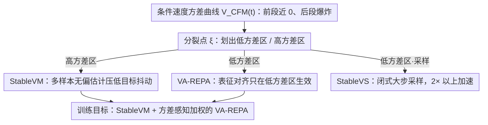

# Stable Velocity: A Variance Perspective on Flow Matching

**会议**: ICML 2026  
**arXiv**: [2602.05435](https://arxiv.org/abs/2602.05435)  
**代码**: https://github.com/linYDTHU/StableVelocity  
**领域**: 图像生成 / Flow Matching / 扩散模型  
**关键词**: flow matching, 方差缩减, 表征对齐, 采样加速, 随机插值

## 一句话总结
本文从"条件速度方差"这一被忽视的视角重新审视 flow matching，发现训练轨迹天然分裂为靠近先验的高方差区和靠近数据的低方差区，并据此提出统一框架 Stable Velocity，含一个无偏的多样本方差缩减损失 StableVM、一个只在低方差区启用 REPA 的 VA-REPA，以及一个利用低方差区闭式解的无微调采样加速器 StableVS，在 ImageNet 256 与 SD3.5/Flux/Qwen-Image/Wan2.2 上取得训练效率提升与 >2× 采样加速。

## 研究背景与动机

**领域现状**：以 Conditional Flow Matching (CFM) 为代表的 flow matching / 随机插值范式已经统一了扩散与流模型，通过让神经网络拟合条件速度场 $v_t(x_t \mid x_0)$ 来学习从先验 $\mathcal{N}(0, I)$ 到数据分布的概率流，是 SD3、Flux、Wan2.2 等大型生成模型的训练标配。

**现有痛点**：CFM 的训练目标 $v_t(x_t \mid x_0)$ 其实是对真实边缘速度场 $v_t(x_t)$ 的单样本 Monte Carlo 估计，方差极大；尤其在 $t$ 接近 1（接近先验、远离数据）的时刻，给定一个含噪样本 $x_t$ 几乎可以解释为来自任何一个数据点，回归目标剧烈抖动，优化又慢又不稳。同时社区里类似 REPA 这样的表征对齐辅助损失被无差别地施加在所有 $t$ 上，但其有效性的时间结构从未被分析过。

**核心矛盾**：CFM 把整段 $t \in [0, 1]$ 当作"形状相同"的一段去训练和采样，但条件速度的方差 $\mathcal{V}_{\text{CFM}}(t)$ 沿 $t$ 是高度不均匀的——它在前段几乎为零、后段急剧爆炸，已有方法既没有针对高方差段做方差缩减，也没有去利用低方差段的良好结构。

**本文目标**：(1) 给出 flow matching 训练方差的解析刻画，(2) 在高方差区构造一个无偏的方差缩减目标，(3) 让表征对齐辅助损失自适应只作用在它有意义的区段，(4) 利用低方差区的简化动力学加速采样。

**切入角度**：对条件速度协方差求迹得到 $\mathcal{V}_{\text{CFM}}(t)$，在 GMM、CIFAR-10、ImageNet latent 上画曲线，普遍能看到一个分裂点 $\xi$：$t<\xi$ 时方差近 0、$t \ge \xi$ 时方差迅速上升；且数据维度越高，$\xi$ 越靠近 1，低方差区越大。这条曲线就是整篇论文设计的物理依据。

**核心 idea**：用一个"按时间分区治理"的统一框架替换均匀施加的 CFM/REPA/采样器——高方差区做多样本方差缩减，低方差区加强表征监督并启用闭式大步采样。

## 方法详解

### 整体框架
本文要解决的是 CFM 把整段 $t \in [0,1]$ 当成同质区间训练和采样、却忽视条件速度方差沿时间剧烈变化的问题。做法是先在概率层面把 CFM 目标的方差 $\mathcal{V}_{\text{CFM}}(t)$ 解析出来，找到那个"前段近 0、后段爆炸"的分裂点 $\xi$，再围绕这条曲线分区施治：高方差区做方差缩减、低方差区强化语义监督并启用闭式大步采样。落地成三个共享同一个 $\xi$、彼此正交的模块——训练损失 StableVM、辅助损失 VA-REPA、采样器 StableVS，可单独或叠加挂进已有 REPA/REG/iREPA 流水线。

### 关键设计

**1. StableVM：用多样本无偏估计压低高方差区的目标抖动**

CFM 的训练目标 $v_t(x_t\mid x_0)$ 本质是对真实边缘速度 $v_t(x_t)$ 的单样本 Monte Carlo 估计，在 $t$ 接近 1 时一个含噪 $x_t$ 几乎能解释为任何数据点，回归目标剧烈抖动。StableVM 直接对这个目标方差下手：不再从单条件路径采 $x_t$，而是从混合路径 $p_t^{\text{GMM}}(x_t \mid \{x_0^i\}) = \tfrac{1}{n}\sum_i p_t(x_t \mid x_0^i)$ 采样，回归目标换成对 $n$ 个参考样本的自归一化加权平均 $\widehat{v}_{\text{StableVM}}(x_t; \{x_0^i\}) = \sum_k p_t(x_t \mid x_0^k)\, v_t(x_t \mid x_0^k) / \sum_j p_t(x_t \mid x_0^j)$。论文证明它与 CFM 共享同一个全局最优 $v_t(x_t)$（保持无偏，Thm 3.1），方差严格更小（Thm 3.2），且随 $n$ 增大以 $O(1/n)$ 衰减（Thm 3.3）——因此是"修原因"而非改最优点的方差缩减。相比 STF 那种"只换目标不换输入"的有偏方案（且只适用 VP 扩散），混合采样输入让 StableVM 真正无偏并推广到一般随机插值。条件生成下还维护一个容量 $K=256$ 的 FIFO 类别 memory bank，解决每个 batch 内同类样本太稀疏导致无法凑齐参考集的问题。

**2. VA-REPA：让表征对齐只在它有意义的低方差区生效**

社区里 REPA 类语义对齐损失被无差别施加到所有 $t$，但作者观察到预训练 REPA 模型的对齐损失 $\ell_{\text{RA}}$ 在低方差区始终很低且可学、在高方差区饱和在极高值——因为从近乎纯噪声做确定性语义恢复本身是 ill-posed 的，强迫对齐固定语义只会引入错配。VA-REPA 据此给对齐损失加一个时间权重 $w(t)\in[0,1]$，总损失写成 $\mathcal{L} = \mathcal{L}_{\text{StableVM}} + \lambda_{\text{RA}}\, \mathbb{E}_{t,x_t}[w(t)\,\ell_{\text{RA}}(x_t)] / \mathbb{E}_t[w(t)]$。$w(t)$ 有三种实现：硬阈 $\mathbb{I}[t<\xi]$、sigmoid 松弛 $\sigma(k(\xi - t))$、SNR 形式 $\text{SNR}(t)/(\text{SNR}(t)+\text{SNR}(\xi))$，默认用 sigmoid。分母 $\mathbb{E}_t[w(t)]$ 的归一化是关键一笔——当大部分样本落在高方差区被关掉时，它防止有效的辅助梯度被整体均值冲淡。本质上是把"何时该对齐"这个开关交给方差曲线，对症下药。

**3. StableVS：把低方差段当直线，用闭式大步采样换 >2× 加速**

传统采样器为应对全程未知的曲率必须用很小步长。但在低方差区 $v_t(x_t)\approx v_t(x_t\mid x_0)$，反向 SDE 可写成 DDIM 风格后验 $p_\tau(x_\tau \mid x_t, v_t) = \mathcal{N}(\mu_{\tau \mid t}, \beta_t^2 I)$，其中 $\beta_t = f_\beta\sigma_\tau$、均值 $\mu_{\tau \mid t} = (\rho_t - \lambda_t \sigma'_t/\sigma_t)x_t + \lambda_t v_t(x_t)$；对应 PF-ODE 也有闭式解 $x_\tau = \sigma_\tau[(1/\sigma_t - \sigma'_t/\sigma_t \cdot \Psi_{t,\tau})x_t + \Psi_{t,\tau} v_t(x_t)]$。在线性插值 + $\beta_t=0$ 的特例下两者一起退化为 $x_\tau = x_t + (\tau - t)v_t(x_t)$——低方差段轨迹就是常速度直线，可取任意大步长精确积分。于是 StableVS 把节省下来的 step quota 都留给真正需要小步的高方差段，整套无需任何微调。实测在 SD3.5/Flux/Qwen-Image/Wan2.2 上取 $\xi=0.85$、低方差区只用 9 步即可保质，等于用结构先验换计算。

### 损失函数 / 训练策略
最终训练目标为 StableVM 损失 $\mathcal{L}_{\text{StableVM}}$ 加上方差感知归一化后的 $\lambda_{\text{RA}}$ 倍 VA-REPA 项。默认配置：$\xi = 0.7$（训练）/ $0.85$（采样），bank 容量 $K = 256$，$w_{\text{sigmoid}}$ 加权。骨干 SiT-XL/2，ImageNet 256 latent，参考样本数 $n$ 通过 batch 内组合实现，无需额外网络。

## 实验关键数据

### 主实验
ImageNet 256×256，SiT-XL/2 + CFG（$w=1.8$，间隔式 CFG）：

| 方法 | Epoch | FID↓ | sFID↓ | IS↑ | Prec.↑ | Rec.↑ |
|------|-------|------|-------|-----|--------|-------|
| SiT-XL/2 | 1400 | 2.06 | 4.50 | 270.3 | 0.82 | 0.59 |
| REPA | 80 | 1.98 | 4.60 | 263.0 | 0.80 | 0.61 |
| REPA | 800 | 1.42 | 4.70 | 305.7 | 0.80 | 0.65 |
| iREPA | 80 | 1.93 | 4.59 | 268.8 | 0.80 | 0.60 |
| REG | 480 | 1.40 | 4.24 | 296.9 | 0.77 | 0.66 |
| **Ours (StableVM+VA-REPA)** | 80 | **1.80** | 4.52 | 272.4 | 0.81 | 0.60 |
| **Ours** | 480 | **1.44** | 4.49 | 302.9 | 0.80 | 0.64 |
| REPA-E† (要微调 VAE) | 800 | 1.12* | 4.09* | 302.9* | 0.79* | 0.66* |
| **Ours (class-balanced)** | 480 | **1.33*** | 4.46* | 307.8* | 0.80* | 0.64* |

80 epoch 即超过 REPA/iREPA/REG 的 80 epoch baseline，480 epoch 已接近需要 800 epoch + 微调 VAE 的 REPA-E。

跨模型规模（无 CFG，100k iter）：SiT-B/2 FID 52.06→49.69，SiT-L/2 22.75→21.03，SiT-XL/2 18.59→17.12；SiT-XL/2 400k iter 8.13→7.58。

### 消融实验

正交叠加到不同 REPA 变体上（100k iter）：

| 方法 | FID↓ | sFID↓ | IS↑ | Prec.↑ | Rec.↑ |
|------|------|-------|-----|--------|-------|
| REPA | 18.59 | 5.39 | 70.6 | 0.64 | 0.62 |
| + Ours | **17.12** | 5.39 | 74.8 | 0.65 | 0.63 |
| REG | 8.90 | 5.50 | 125.3 | 0.72 | 0.59 |
| + Ours | **8.11** | 5.34 | 128.8 | 0.74 | 0.60 |
| iREPA | 16.62 | 5.31 | 76.7 | 0.65 | 0.63 |
| + Ours | **16.02** | 5.30 | 78.6 | 0.66 | 0.63 |

Split point $\xi$ 消融：100k 时 $\xi=0.6$ 略优（17.38），但 400k 时 $\xi=0.7$ 全面最佳，$\xi=0.8$ 退化（因为把噪声段也纳入对齐）。

### 关键发现
- 三个组件**正交且 drop-in**：无论叠到 vanilla REPA、REG 还是 iREPA 上都稳定涨点，说明"方差分区"是普适设计原则，不是与特定辅助损失绑死的 trick。
- $\xi$ 选择有明显**训练阶段依赖**：早期偏小（更弱的辅助监督帮助初期收敛），中后期偏大（更广的有效对齐区间换更细的语义结构），最终选 $\xi=0.7$ 折中。
- 采样侧 StableVS 在 SD3.5/Flux/Qwen-Image/Wan2.2 上**无需任何微调**就能 >2× 加速且 PSNR/SSIM/LPIPS 几乎不变，说明大模型在低方差区确实学到了近乎直线的速度场，原采样器是"过度小心"的。

## 亮点与洞察
- 把"条件速度方差曲线 $\mathcal{V}_{\text{CFM}}(t)$"做成显式可视化的物理量，并据此推出训练损失、辅助损失、采样器三者的统一设计，这是 flow matching 文献里少见的"先做诊断、再开药"的工作。
- StableVM 的自归一化重要性采样形式让方差缩减"免费"获得 $O(1/n)$ 衰减率，而 STF 的有偏版本只能做 VP 扩散；这条理论让方差缩减能搬到所有随机插值上。
- VA-REPA 揭示了 REPA 类工作的一个隐含假设错配——把语义对齐当作全程任务，但语义信息本身在高噪声段就已被破坏。这条洞察可以迁移到任何"用预训练表征监督扩散模型"的任务（如条件控制、安全对齐）。
- StableVS 的极简形式（线性插值 + $\beta_t=0$ 时退化为 $x_\tau = x_t + (\tau-t) v_t$）暗示主流 T2I/T2V 大模型存在显著的"低方差直线段"，未来 distillation/consistency 类方法或许可以把蒸馏目标限定在高方差段，进一步压缩 step 数。

## 局限与展望
- 作者承认的局限：split point $\xi$ 的精确位置依赖未知数据分布，目前靠经验在 $0.7$（训练）/ $0.85$ (采样) 取值，缺少自动选 $\xi$ 的机制；类别 memory bank 在长尾极端类别上仍可能稀疏。
- 自己发现的局限：(1) 所有训练实验集中在 SiT 系 + ImageNet 256，没有展示在 Flux/SD3.5 这类大模型上从头训练的收益（只展示采样加速），训练侧的可扩展性需要更多证据。(2) StableVS 的"等效直线段"假设依赖模型已经准确学到 $v_t$，对欠训练或失配模型可能反而引入误差，论文未给出失败 case 分析。(3) 多样本估计 $n$ 越大方差越小，但 $n$ 与 batch、GPU 显存的 trade-off 未充分展开。
- 改进思路：在线估计 $\mathcal{V}_{\text{CFM}}(t)$ 并据此让 $\xi$ 随训练自适应；把 VA-REPA 的 $w(t)$ 与 loss 自身曲线挂钩，做成自动门控；将 StableVS 与 consistency distillation 结合，在低方差段做 1-step、高方差段做 few-step 的混合采样。

## 相关工作与启发
- **vs CFM (Tong et al., 2023)**：CFM 用单样本条件速度做训练目标，本文给出方差解析、提出多样本无偏替代 StableVM，保留同一个全局最优点但严格降低方差。
- **vs STF (Xu et al., 2023)**：STF 同样做多样本重加权但仅适用 VP 扩散，且训练输入只来自单条件路径（造成有偏）；StableVM 通过混合 $p_t^{\text{GMM}}$ 采样输入实现真正无偏，覆盖一般随机插值。
- **vs REPA / REG / iREPA (Yu et al., 2024; Wu et al., 2025b; Singh et al., 2025)**：这些工作把表征对齐均匀施加全程，本文用方差曲线证明高方差区对齐 ill-posed，VA-REPA 加门控直接叠用即可一致涨点。
- **vs DDIM / Rectified Flow / Consistency Models**：DDIM 通过推导后验闭式解减少采样步、Rectified Flow 通过 reflow 把轨迹拉直、Consistency Models 通过蒸馏直接学一步映射；StableVS 与前两者更相近——不需要任何额外训练，只是承认了"模型自己已经把低方差段学成了近直线"这件事并写出对应闭式更新，更"温和"地用结构而非额外训练换 speed。

## 评分
- 新颖性: ⭐⭐⭐⭐⭐ 把方差曲线作为统一设计原则贯穿训练 + 辅助 + 采样三层，是 flow matching 领域少见的系统性视角。
- 实验充分度: ⭐⭐⭐⭐ ImageNet 主实验 + 跨规模 + 跨 REPA 变体 + 4 个大模型采样验证齐全，但训练侧未跨大模型，扣半星。
- 写作质量: ⭐⭐⭐⭐⭐ 三个模块共享同一个 $\xi$ 与同一份方差曲线，故事线非常干净，定理与公式呈现规范。
- 价值: ⭐⭐⭐⭐⭐ 训练侧 drop-in 涨点 + 推理侧免微调 2× 加速，对工业级 T2I/T2V 部署直接可用。

<!-- RELATED:START -->

## 相关论文

- [\[ICML 2026\] A Kinetic Energy Perspective of Flow Matching](a_kinetic_energy_perspective_of_flow_matching.md)
- [\[CVPR 2026\] VeCoR — Velocity Contrastive Regularization for Flow Matching](../../CVPR2026/image_generation/vecor_--_velocity_contrastive_regularization_for_flow_matching.md)
- [\[ICML 2026\] The Coupling Within: Flow Matching via Distilled Normalizing Flows](the_coupling_within_flow_matching_via_distilled_normalizing_flows.md)
- [\[ICML 2026\] AG-REPA: Causal Layer Selection for Representation Alignment in Audio Flow Matching](ag-repa_causal_layer_selection_for_representation_alignment_in_audio_flow_matchi.md)
- [\[ICML 2026\] Exploring and Exploiting Stability in Latent Flow Matching](exploring_and_exploiting_stability_in_latent_flow_matching.md)

<!-- RELATED:END -->
