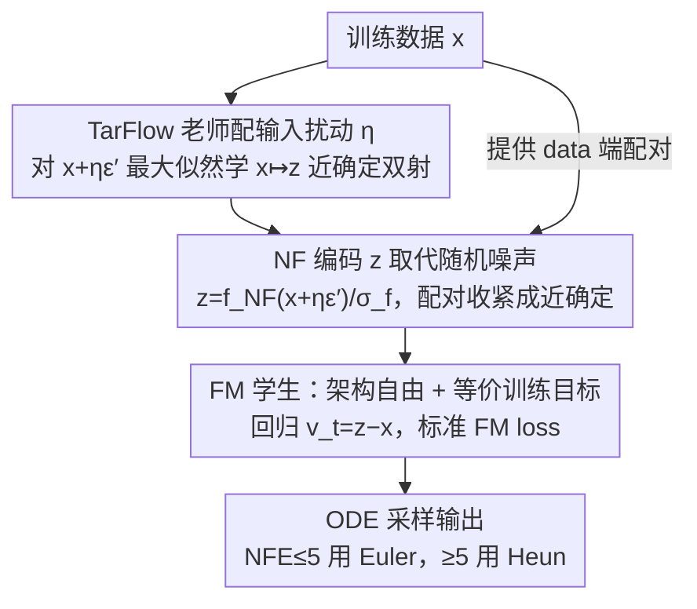

# The Coupling Within: Flow Matching via Distilled Normalizing Flows

**会议**: ICML 2026  
**arXiv**: [2603.09014](https://arxiv.org/abs/2603.09014)  
**代码**: https://github.com/apple/ml-nfm  
**领域**: 扩散模型 / 生成模型 / 流匹配  
**关键词**: Flow Matching、Normalizing Flow、coupling、蒸馏、TarFlow

## 一句话总结
本文提出 NFM（Normalized Flow Matching），用预训练 TarFlow 这种自回归归一化流（NF）产生的"准确定性 data→noise 双射"作为 Flow Matching 的噪声-数据配对，从而把 FM 收敛速度、少步数 FID 同时拉到新的水平，并反过来比当老师的 NF 推理快若干个数量级。

## 研究背景与动机

**领域现状**：Flow Matching（FM）已经成为大规模生成模型的主流训练范式 —— 用 $x_t=(1-t)x+t\epsilon$ 把 data 与 noise 做线性插值，再回归速度 $v_t=\epsilon-x$，推理时用 ODE solver 从 $x_1\sim\mathcal{N}(0,I)$ 反演到 $x_0$。决定性能的一个关键设计就是"噪声-数据配对（coupling）"，独立耦合最简单但训练慢、推理曲率大，于是 OT-based coupling（如 SD-FM）成为主流改良方向。

**现有痛点**：OT 类方法本质上仍是基于几何距离的、模型无关的预处理，它没有真正利用"模型可学到的 data 表示"。同时另一条线 —— Normalizing Flow（NF），尤其是新近的 TarFlow，能直接学一个 data ↔ Gaussian 的双射，理论上配对一旦确定速度回归就是零误差、采样一步即可，但 NF 自回归采样慢得离谱。

**核心矛盾**：FM 推理快但配对粗糙；NF 配对完美但采样慢。两边都有结构性短板，过去鲜有工作把它们组合起来。

**本文目标**：(i) 用 NF 学到的（接近双射的）配对替换 FM 的随机 / OT 配对，给 FM 学生提供更"对齐"的训练对；(ii) 验证这种"蒸馏 NF 到 FM"既能加速 FM 收敛、又能反过来在 FID 上击败 NF 老师。

**切入角度**：作者把 NF 看作"学到的、模型相关的最优传输近似"。即便 NF 的映射在似然意义上不是 OT 最优的（它受限于网络容量），但只要它能把每个 data 点稳定映到一个特定的 Gaussian 表示，就足以充当一个高质量的 coupling。

**核心 idea**：训练 FM 学生时，把噪声端 $\epsilon$ 换成预训练 NF 老师对 data 的编码 $z_{\epsilon'}=f_{\text{NF}}(x+\eta\epsilon',c)/\sigma_f$，速度目标改为 $v_t=z_{\epsilon'}-x$，其他 FM 流程不变。

## 方法详解

### 整体框架
NFM 想解决的是 Flow Matching 里"噪声-数据配对太粗糙"这件事，做法是把随机噪声端换成一个预训练 Normalizing Flow（NF）老师对 data 的编码。整套流程分两阶段：先按最大似然训一个 TarFlow 老师 $f_{\text{NF}}$，学一个 $x\mapsto z$ 的近确定可逆映射；再冻结老师，训一个普通 FM 学生 $g$（架构任意、不必可逆），让它看到的训练对从 $(x,\epsilon)$ 变成 $(x,z_{\epsilon'})$。学生的训练公式、采样器、guidance、时间调度全部沿用标准 FM，唯一改动就是把噪声端的 $\epsilon$ 替换成老师给的 $z_{\epsilon'}$，所以可以零成本接进任何现成的 FM 代码栈。

### 关键设计

**1. TarFlow 老师配输入扰动 $\eta$：既保平滑又控噪声水平**

老师选 TarFlow，是因为它是用 Transformer 实现的自回归流，每个 meta-block 内逐 patch 自回归生成，可逆性强、图像质量已能与扩散模型抗衡——代价是采样极慢，而这正是 NFM 要靠学生绕过的短板。训练老师时输入不是干净的 $x$ 而是 $x'=x+\eta\epsilon'$，再最小化 NLL，NFM 把这个 $\eta$ 原封不动保留下来，因为它一身两职：一方面让 $z$ 对 data 的小邻域保持平滑、不退化成纯确定的硬映射（保留一点 stochasticity），另一方面又隐式地把 FM 学生看到的最大噪声水平压到 $\sim\eta/(1+\eta)$。$\eta$ 因此成了调节"配对确定性强弱"的旋钮：$\eta$ 取大，不同图像的 $z$ 互相靠近、配对更"软"，最佳 FID 出现在更高 NFE 处；$\eta$ 取小，配对更"硬"，少步采样下表现更好。

**2. 用 NF 老师产生的 $z$ 取代随机噪声：把多对多映射收紧成近确定配对**

FM 真正难学的地方在大 $t$：插值点 $x_t=(1-t)x+t\epsilon$ 的条件方差很大，速度目标 $v_t=\epsilon-x$ 几乎只剩"两端点之差"这点信息，导致同一个 $x_t$ 可能对应五花八门的目标方向，梯度噪声大、学到的 ODE 轨迹弯曲。NFM 的解法是不再让 data 配随机 noise，而是配一个由老师锁定的、近 Gaussian 的编码 $z_{\epsilon'}=f_{\text{NF}}(x+\eta\epsilon',c)/\sigma_f$，其中 $\sigma_f^2=\mathbb{E}[f_{\text{NF}}(x+\eta\epsilon',c)^2]$ 把老师输出归一化到单位方差，保证 $z$ 整体仍近似 $\mathcal{N}(0,I)$、学生采样时照样能从标准高斯起步。这样每个 $x$ 都被绑到一个几乎确定的 $z$ 上，"特定 $z\to$ 特定 $x$"的映射让 $\text{Var}(v_t\mid x_t,t)$ 明显降低，直接表现为路径更直（实验里曲率 $\kappa$ 从 FM 的 0.0386 降到 0.0181）、少步采样的 FID 提升。一个值得注意的细节是：把老师的扰动幅度换算到 FM 的方差守恒坐标下，$\eta=0.05$ 只对应 FM 的最大噪声水平 $t=\eta/(1+\eta)\approx0.0476$，远小于标准 FM 的 $t=1$，等于学生从一开始就活在一个"噪声很温和"的区间里。

**3. 学生架构自由 + 与 FM 完全等价的训练目标：解锁比老师快几个量级的推理**

把 $\epsilon$ 换成 $z_{\epsilon'}$ 之后，FM"沿线性插值回归速度"的形式和时间权重都没变，于是学生 $g$ 不需要任何可逆约束，可以是普通 ViT/CNN（实验用 SiT-XL），做得比 TarFlow 更小、推理步数随意调。学生就用一条标准 FM loss

$$\mathcal{L}_{\text{FM}}=\big\|g\big((1-t)x+tz_{\epsilon'},\,c,\,t\big)-(z_{\epsilon'}-x)\big\|_2^2$$

训练，推理时 NFE ≤ 5 用 Euler、NFE ≥ 5 用 Heun，步长按 $t^2=\{1,(1-\delta t)^2,\ldots\}$ 的平方调度走。正因为没引入新超参、没破坏现有 pipeline，又卸掉了可逆性这副枷锁，学生的采样速度才能比自回归的 TarFlow 老师快若干个数量级——这也是 NFM 能做到"学生比老师又快又好"的结构性原因。

### 损失函数 / 训练策略
学生就用上面那条 $\mathcal{L}_{\text{FM}}$ 训练，类标签按概率 $p=0.1$ 随机置空以支持 classifier-free guidance，时间 $t$ 服从 $\text{lognorm}(-0.2,1)$。规模上老师训 512 MiB 样本（约 420 epoch），学生只训 256 MiB（约 210 epoch），即学生用一半的训练预算反超老师。

## 实验关键数据

### 主实验

| 数据集 / 教师 / NFE | FM | SD-FM | NFM (256 MiB) | NFM vs FM |
|----------------------|----|-------|---------------|-----------|
| ImageNet64, SiT-XL/4, 31 | 2.57 | 2.68 | 1.78 | -0.79 |
| ImageNet64, 15 | 4.80 | 3.15 | 2.15 | -2.65 |
| ImageNet64, 7 | 13.01 | 6.41 | 3.23 | -9.78 |
| ImageNet64, Euler-5 | 21.05 | 12.18 | 3.92 | -17.13 |
| ImageNet256, SiT-XL/2, 31 | 2.30 | – | 2.29 | -0.01 |
| ImageNet256, 7 | 12.41 | – | 3.43 | -8.98 |

学生 FID 在 ImageNet64 上达到 1.78，比同等参数的 TarFlow 老师（FID=1.98）还要好；ImageNet256 上 NFM (FID 2.29) 与老师 (FID 3.96) 拉开明显差距。

### 消融实验

| 配置 / 现象 | 结果 | 说明 |
|------------|------|------|
| Heun(t²), 31 NFE | FM 2.57 → NFM 1.78 | 大 NFE 下 NFM 优势小但仍稳定 |
| Euler(t), 128 NFE 曲率 $\kappa$ | FM 0.0386 / SD-FM 0.0289 / NFM 0.0181 | NFM 路径明显更直，能用更少 NFE |
| Heun, 5 NFE | 17.56 → 9.29 → 4.01 | NFM 在极少步采样下相对收益最大 |
| 大 $\eta$ vs 小 $\eta$（z-space 结构） | $\eta$ 越大不同图像 $z$ 越靠近 | 给 FM 提供更弱"准确定性"，少步采样 FID 反而变差 |

### 关键发现
- 学生 FID 反超老师：作者把它归因于"配对几乎确定 + 学生架构灵活 + EMA"三者的复合 —— 老师受困于可逆约束容量低，学生无此限制反而能拟合得更好。
- $z$ 空间结构出人意料：同一张图片在不同 $\eta\epsilon'$ 下的 $z$ 投影并不互为最近邻，反而是不同图片在相同 noise 下更近。这说明 NF 把"图像身份"和"噪声向量"在 $z$ 空间纠缠得很深，但即便如此 NFM 仍能 work，说明 FM 学生学的不是邻域结构，而是端点对应。
- 收益分布：在 NFE = 7 这一典型部署区间，NFM 比 FM 把 FID 砍到 1/4，比 SD-FM 仍降 50%。这恰好是 SD-FM 的 OT 配对覆盖不到的区域。

## 亮点与洞察
- 把 NF 当作"模型学到的 OT 近似"是一个很有解释力的视角：OT 的核心价值是"配对",而不是"几何最优",NFM 证明只要配对足够确定，OT 几何最优性并不必要。
- "FM 用 NF 蒸馏"的反方向兼有蒸馏（NF→FM）和混合（NF+FM）两种解读，且学生采样比老师快几个数量级，是少见的"学生比老师更快也更好"的例子。
- 整套方法没有改 FM 的训练公式、采样器、guidance、时间调度，工程接入成本极低 —— 任何现有 FM 代码只要把 $\epsilon$ 替换成 $z_{\epsilon'}$ 即可。

## 局限与展望
- 仍然需要先训练一个高质量 NF 老师，老师本身就贵；当老师 FID 较差时蒸馏出来的学生也会被拖累，本文未给出"老师有多差仍能 work"的边界。
- 实验只覆盖 ImageNet64 / 256 + class-conditional，文本到图像、视频、高分辨率（1024+）场景没验证，TarFlow 在这些设置下能否稳定训练仍是开放问题。
- $z$ 空间反直觉的结构（同图像 $z$ 不互为最近邻）作者也承认尚未完全理解，可能对蒸馏稳定性形成长期隐患。
- NFM 与 SD-FM 等 OT 类配对方法并不冲突，论文也建议未来组合使用，但目前没给出实际组合实验。

## 相关工作与启发
- **vs SD-FM / OT-CFM**：同样是"改 coupling"，但 OT 类方法是离散最优传输的近似，本文用 NF 学到的 deterministic map 取代之，效果在 ImageNet256 上显著更好，尤其在低 NFE 区间。
- **vs DiffFlow / DiNof**：这些工作把 NF 与 diffusion 联合训练；NFM 走的是"老师冻结、学生蒸馏"的更简洁路线，工程上更易复现。
- **vs Consistency Models / Rectified Flow**：CM 与 RF 试图缩短 ODE 路径以减少 NFE，NFM 走的是"换更好的端点"，本质上是从源头改善了路径曲率（实验中 $\kappa$ 减半）。
- **vs 一般蒸馏方法**（Progressive Distillation 等）：传统蒸馏让学生模仿老师采样轨迹，NFM 让学生学的是新目标分布上的 FM，因此学生不需要逐 NFE 对齐，泛化更好。

## 评分
- 新颖性: ⭐⭐⭐⭐ 把 NF 当成 FM 的 coupling 来源是个清新而自然的视角，跨家族蒸馏的实例化做得干净。
- 实验充分度: ⭐⭐⭐⭐ 多 NFE / 多 solver / 不同 $\eta$ / 曲率分析全套都跑了，对比对象覆盖 FM、SD-FM、TarFlow 自身。
- 写作质量: ⭐⭐⭐⭐ 思路清晰，附带的 $z$ 空间结构分析诚实地汇报了反直觉现象。
- 价值: ⭐⭐⭐⭐ 直接给现有 FM 模型提供一个低成本的 FID 改善方案，特别是在少步采样（实用部署区间）效果显著。

<!-- RELATED:START -->

## 相关论文

- [\[AAAI 2026\] Flowing Backwards: Improving Normalizing Flows via Reverse Representation Alignment](../../AAAI2026/image_generation/flowing_backwards_improving_normalizing_flows_via_reverse_representation_alignme.md)
- [\[ICML 2026\] Stable Velocity: A Variance Perspective on Flow Matching](stable_velocity_a_variance_perspective_on_flow_matching.md)
- [\[ICML 2025\] Normalizing Flows are Capable Generative Models](../../ICML2025/image_generation/normalizing_flows_are_capable_generative_models.md)
- [\[ICML 2026\] AG-REPA: Causal Layer Selection for Representation Alignment in Audio Flow Matching](ag-repa_causal_layer_selection_for_representation_alignment_in_audio_flow_matchi.md)
- [\[ICML 2026\] Path-Coupled Bellman Flows for Distributional Reinforcement Learning](path-coupled_bellman_flows_for_distributional_reinforcement_learning.md)

<!-- RELATED:END -->
