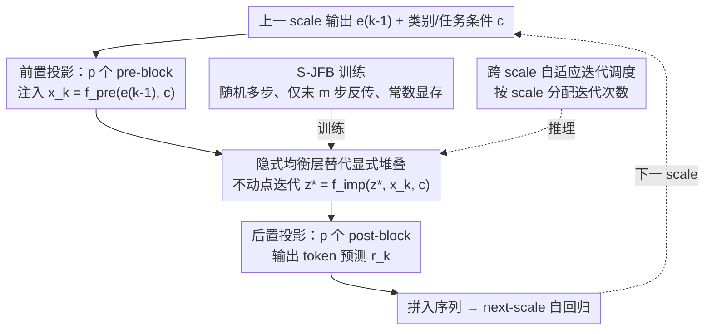

# Visual Implicit Autoregressive Modeling

**会议**: ICML 2026  
**arXiv**: [2605.01220](https://arxiv.org/abs/2605.01220)  
**代码**: https://github.com/mobiushy/VIAR  
**领域**: 图像生成 / 自回归生成 / 隐式深度模型  
**关键词**: VAR, Deep Equilibrium, Jacobian-Free Backprop, Next-scale prediction, 自适应推理

## 一句话总结
本文把 Deep Equilibrium（DEQ）隐式不动点层嵌进 VAR 的 next-scale 自回归框架，用 Jacobian-Free Backpropagation 实现常数显存训练，把 VAR-d30 的 20 亿参数压到 7.7 亿，同时在推理时把每个 scale 的迭代次数变成"可调旋钮"——在 ImageNet-256 上 FID 2.16/sFID 8.07 不变的同时，4090 单卡峰值显存从 19.24GB 降到 8.53GB、吞吐从 15.16 提到 32.08 img/s。

## 研究背景与动机

**领域现状**：图像生成两大主流是 diffusion 和 AR（自回归）。VAR（Tian et al. 2024）把图像 AR 从 next-token 改为 **next-scale prediction**——从粗到细生成多尺度 token map，每个 scale 内部并行预测，把总注意力开销从 $O(n^6)$ 降到 $O(n^4)$，并保留了空间局部性，是目前最强的 AR 图像生成范式之一。

**现有痛点**：VAR 在每个 scale 内部仍用一个**深度堆叠的显式 Transformer**（如 VAR-d30 的 30 层）。这带来三个工程问题：(1) 参数量大，d30 模型 20 亿参数；(2) 训练显存随深度线性增长，活动值和优化器状态都跟着深度爆；(3) 每个 scale 的计算深度固定为 30，无法根据 scale 大小自适应分配算力——而最大 scale（高分辨率）才是 KV cache 和延迟的真正瓶颈。

**核心矛盾**：模型深度既是"质量来源"又是"开销来源"，但在 VAR 范式下两者被绑死——你想要好质量只能堆深，堆深就必然付显存和延迟。同时 Figure 3 显示，在最大 scale 上，迭代 5 次余弦相似度已 >0.98、10 次接近 0.999，意味着**深层堆叠在高分辨率 scale 上其实是过度计算**。

**本文目标**：把 VAR 的"固定深度堆叠"换成一个"等价于无限深度但可调迭代次数"的模块，同时保留 next-scale 的并行性与空间局部性。

**切入角度**：Deep Equilibrium Model（DEQ）正好提供这种性质——用一个隐式不动点层 $z^* = f(z^*, x)$ 替代深堆叠，配合 Jacobian-Free Backprop（JFB）只通过最后几步反传，做到**训练显存与"等效深度"解耦**；推理时迭代次数变成可调旋钮，单一训练模型可以模拟不同深度网络。

**核心 idea**：把 VAR 的"前 p 个 block + 深堆叠 + 后 p 个 block"换成"前 p 个 block + **一个隐式均衡层** + 后 p 个 block"，前后保留浅层 transformer 作为接口，中间用不动点迭代承担"无限深"。每个 scale 的迭代次数可以独立调度。

## 方法详解

### 整体框架
VIAR 在每个 scale $k$ 上的流程是：(1) 输入注入：用 $p=5$ 个 pre-block 把上一 scale 输出 $e_{k-1}$ 投影成 $x_k = f_{\text{pre}}(e_{k-1}, c)$；(2) 隐式均衡：从 $z^0 = x_k$ 初始化，反复迭代 $z^{t+1} = f_{\text{imp}}(\text{Proj}([z^t, x_k]), c)$ 直到不动点 $z_k^*$；(3) 后投影：$\hat{r}_k = f_{\text{post}}(z_k^*, c)$ 用 $p=5$ 个 post-block 输出 token 预测。整个 next-scale 自回归的因子化 $p(r_1,\cdots,r_K) = \prod_k p(r_k|r_{<k})$ 与 VAR 一致，VAE tokenizer 复用 VAR 的多尺度 VQVAE 并冻结。

### 关键设计

**1. 隐式均衡层替代显式堆叠：把"深度"从架构超参变成推理旋钮**

VAR 的痛点是 middle stack 把 20+ 层显式 Transformer 焊死在架构里，深度既决定质量也决定显存与延迟。VIAR 把这一整摞折叠成单个共享参数的不动点算子：定义可收缩映射 $f_{\text{imp}}(z, x, c)$，实现为一个 Transformer block 加一个输入注入投影 $\text{Proj}([z, x_k])$，然后求解不动点 $z_k^* = f_{\text{imp}}(z_k^*, x_k, c)$。关键在于这一个 trained block 在推理时可以迭代任意次数——模型的"等效深度"在测试时由迭代数决定，而不是训练时焊死。这样既把 middle stack 参数压到 1 个 block 的量（93.3% middle 参数削减、整体 61.6% 总参数削减），又解锁了单模型多深度部署。资源收益直接体现在显存上：Figure 6 显示参数/梯度显存约 2.87GB（VIAR）vs 7.49GB（VAR-d30），优化器状态 5.74GB vs 14.98GB。

**2. Stochastic Jacobian-Free Backprop（S-JFB）：常数显存下的稳定梯度**

不动点层若完全展开会存不下中间激活，而纯 1-step JFB 又偏差太大。S-JFB 用随机多步折中：每个训练 step 先采样 $n \sim U\{0, N\}$ 次"无梯度"迭代把 $z$ 推近不动点，再采样 $m \sim U\{1, M\}$ 次"有梯度"迭代，且仅通过最后 $m$ 步反传——梯度近似为 $\partial \mathcal{L}/\partial \theta_{\text{imp}} \approx \sum_k (\partial \mathcal{L}_k/\partial \hat{z}_k) \cdot (\partial \hat{z}_k/\partial \theta_{\text{imp}})|_{\text{last } m}$。论文默认 $N=10, M=12$，前后浅 block 走标准反传，只有隐式 block 用 S-JFB。这样在期望意义上逼近真实梯度的同时保持常数显存。作者也指出 $m$ 不能太大：当算子局部 Lipschitz 常数大时过大的 $m$ 反而破坏稳定性，sweet spot 落在中等 $m$。

**3. 跨 scale 自适应迭代调度：把迭代次数当算力来分配**

VAR 各 scale 算力分配不均——高分辨率 scale 的 KV cache 和并行 token 数最大，但实际收敛最快（Figure 3 显示最大 scale 5 次迭代余弦相似度 >0.98、10 次接近 0.999）。VIAR 把每个 scale 的迭代数当成可调度的资源：在总预算 $\mathcal{C} = \sum_k (p_{\text{pre}} + c_k + p_{\text{post}})$ 下选不同调度 $\{c_k\}$——常数 $\text{Con.}_{(c,c)}$、递减 $\text{Dec.}_{(a,b)}$（粗尺度 $a$ 次、细尺度 $b$ 次）或自适应阈值控制 $\|G(z) - z\|_2 \le \tau_k$。既然高分辨率收敛极快，就可以大胆压缩它的迭代数把算力让出去。一个反直觉的发现是：当高分辨率未收敛时，给粗尺度加迭代反而能持续涨 FID，说明全局结构对细节质量的影响大于细节自迭代——这比在训练阶段固定 depth 灵活得多。

### 损失函数 / 训练策略
标准 next-scale 交叉熵 $\mathcal{L} = -\sum_k \log p_\theta(\hat{r}_k|r_{<k})$。隐式层用 S-JFB，前后浅层标准反传。global batch 512、lr 8e-5、其它优化器/调度沿用 VAR。tokenizer 冻结。基座为 2B 参数 VAR-d30 的 VQVAE + 自己设计的 pre/imp/post 结构。

## 实验关键数据

### 主实验
ImageNet 256×256 类条件生成，50K 样本对比 FID/sFID/IS/Precision/Recall。

| 模型 | FID ↓ | sFID ↓ | IS ↑ | Pre ↑ | Rec ↑ | #Params | 推理显存 |
|------|-------|--------|------|-------|-------|---------|----------|
| VAR-d30 (cfg=2.0) | 2.05 | 8.86 | 328.5 | 0.82 | 0.59 | 2010M | 19.24GB |
| VAR-d30 (cfg=1.5) | 2.08 | 8.82 | 306.8 | 0.82 | 0.59 | 2010M | 19.24GB |
| VIAR (cfg=2.0) | 2.35 | **7.92** | **330.7** | **0.83** | 0.58 | **770.9M** | 11.16GB |
| VIAR (cfg=1.5) | **2.16** | 8.07 | 300.1 | 0.81 | 0.59 | **770.9M** | 11.16GB |

VIAR 参数仅 38.4%（770.9M vs 2010M），FID 仅落 0.08（2.16 vs 2.08），sFID 还更好（7.92 vs 8.86），意味着空间结构甚至更优。

### 消融实验
4090 单卡吞吐与显存对比（变 schedule 激进程度，s1 最保守、s4 最激进）：

| 方法 | FID ↓ | sFID ↓ | 显存 (GB) ↓ | 吞吐 (img/s) ↑ |
|------|-------|--------|------|----------|
| VAR | 2.08 | 8.82 | 19.24 | 15.16 |
| VIAR_s1 | 2.16 | 8.07 | 11.16 | 21.50 |
| VIAR_s2 | 2.22 | 8.08 | 9.60 | 26.92 |
| VIAR_s3 | 2.27 | 8.02 | 9.40 | 28.12 |
| VIAR_s4 | 2.43 | 8.28 | **8.53** | **32.08** |

最激进的 s4 实现 2.1× 加速 + 2.26× 显存削减，FID 仅退 0.35。

跨 scale 调度（粗-细迭代）：

| 调度 | FID ↓ | sFID ↓ | IS ↑ |
|------|-------|--------|------|
| Dec.(20, 5) | 2.18 | 8.04 | 299.2 |
| Dec.(20, 10) | 2.16 | 8.07 | 294.8 |
| Dec.(10, 5) | 2.22 | 8.08 | 303.4 |
| Con.(20, 20) | 2.16 | 8.17 | 294.8 |
| Con.(5, 5) | 2.27 | 8.02 | 307.1 |
| Con.(10, 10) | **2.16** | 8.07 | 300.1 |

### 关键发现
- **粗尺度多迭代 > 细尺度多迭代**：当细尺度未收敛时，加粗尺度迭代反而更能涨 FID（Dec.(20,5) vs Con.(5,5)），暗示全局结构是细节质量的瓶颈。
- **训练显存恒定**：Figure 6 显示 VIAR 显存几乎不随"等效深度"增长（plateau ~2.87GB），VAR 显存与深度近似线性。
- **零样本编辑能力增强**：Figure 7 显示在 in-painting 和 class-conditional editing 上 VIAR 边界融合更顺滑、细节更锐利，作者归因于隐式层的"长程上下文聚合"特性比固定深度更稳。
- **不动点迭代收敛极快**：最大 scale 5 次迭代余弦相似度 0.985、10 次 0.999，这是省迭代算力的物理基础。

## 亮点与洞察
- 真正把 DEQ 在大规模生成任务上跑通——以往 DEQ 多在分类/光流上做 demo，VIAR 是第一次在 ImageNet 级别 AR 图像生成上证明"隐式层可以替代深堆叠且不掉点"，这一点工程意义比理论意义大。
- **"训练一次，推理多深度"**：单个 trained VIAR 模型可以在不同硬件预算上跑不同迭代数，相当于免费拿到一族"小-中-大"模型；这种弹性在边缘部署里是奢侈品。
- 把"深度 vs 计算"做成连续旋钮的思路可以迁移到 diffusion（实际上 Bai & Melas-Kyriazi 2024 已经在做）、长上下文 LLM 的中间层（每个 transformer block 隐式化）、甚至神经渲染（每像素自适应迭代）。
- 跨 scale 算力再分配的结论（粗尺度更重要）和直觉相反——直觉上高分辨率 scale 信息更密、应该多算，但实验显示它收敛快而粗尺度对全局结构定调。这种发现对所有"层级生成"架构都有借鉴价值。

## 局限与展望
- 主结果 FID 2.16 略逊于 VAR-d30 的 2.05，作者没在更大模型（d36+）上验证 VIAR 是否同样能维持参数比例；DEQ 在更大规模下的稳定性是开放问题。
- S-JFB 是有偏估计器，虽然实验稳定，但理论上对 $f_{\text{imp}}$ 的 Lipschitz 性质有要求；论文没给出收敛保证或局部稳定性的理论分析。
- 只在 ImageNet 256×256 上测，512×512 或文本到图像（如把 VIAR 换 LlamaGen / MAR 基座）效果未知；DEQ 的迭代次数会不会随分辨率剧增是真正的考验。
- 自适应 $\tau$ 阈值控制在论文里只是 sketch，没系统消融；实际部署里"什么时候停"的 controller 设计还是空白。
- 推理时迭代数虽然可调，但每次迭代仍要走完整个 Transformer block，FlashAttention/Triton 优化能否进一步压时延没讨论。

## 相关工作与启发
- **vs VAR (Tian et al. 2024)**：直接 baseline，保留 next-scale 范式不变，只把 middle stack 换成隐式层，是真正"插件式"改造，几乎所有 VAR 后续工作（CAR、speculative VAR）都可以无缝迁移。
- **vs Fixed-Point Diffusion (Bai & Melas-Kyriazi 2024)**：他们在 diffusion denoiser 内部插入 DEQ 层做时间步上的算力再分配；VIAR 把同样思路用在了 spatial scale 上，互补而非竞争。
- **vs Pokle et al. 2022（diffusion 整轨等价 DEQ）**：粒度更粗，整个反向轨迹一次解；VIAR 是单 scale 内 DEQ，更细粒度更可调。
- **vs Collaborative Decoding（Chen et al. 2025b）/ Cached-token Pruning（Guo et al. 2025）**：这些是 VAR 解码侧的加速方案（节省 KV cache 或并行解码），与 VIAR 的"结构侧"加速正交，理论上可以叠加。

## 评分
- 新颖性: ⭐⭐⭐⭐ — 把 DEQ 嫁接到 VAR 是第一次，且 JFB 的工程化做得扎实；但 DEQ 与 AR 的组合在 NLP/diffusion 里都不算全新概念。
- 实验充分度: ⭐⭐⭐⭐ — 主结果 + 5 种调度 + 训练显存曲线 + 零样本编辑 + 收敛分析都齐了；缺更大模型 scaling 和 512×512 验证。
- 写作质量: ⭐⭐⭐⭐ — Figure 1 一图讲完资源节省，方法部分公式清晰；不过 S-JFB 那段算法描述对不熟悉 DEQ 的读者略门槛高。
- 价值: ⭐⭐⭐⭐⭐ — "训练一次推理多深度" + "61.6% 参数削减" + "FID 几乎不掉"是真正能直接用的工业价值，对边缘部署/弹性推理意义重大。

<!-- RELATED:START -->

## 相关论文

- [\[AAAI 2026\] HACK: Head-Aware KV Cache Compression for Efficient Visual Autoregressive Modeling](../../AAAI2026/image_generation/head-aware_kv_cache_compression_for_efficient_visual_autoreg.md)
- [\[ICLR 2026\] MVAR: Visual Autoregressive Modeling with Scale and Spatial Markovian Conditioning](../../ICLR2026/image_generation/mvar_visual_autoregressive_modeling_with_scale_and_spatial_markovian_conditionin.md)
- [\[CVPR 2026\] Depth Adaptive Efficient Visual Autoregressive Modeling](../../CVPR2026/image_generation/depthvar_depth_adaptive_var.md)
- [\[ICML 2026\] Compression as Adaptation: Implicit Visual Representation with Diffusion Foundation Models](compression_as_adaptation_implicit_visual_representation_with_diffusion_foundati.md)
- [\[ICLR 2026\] Visual Autoregressive Modeling for Instruction-Guided Image Editing](../../ICLR2026/image_generation/visual_autoregressive_modeling_for_instruction-guided_image_editing.md)

<!-- RELATED:END -->
