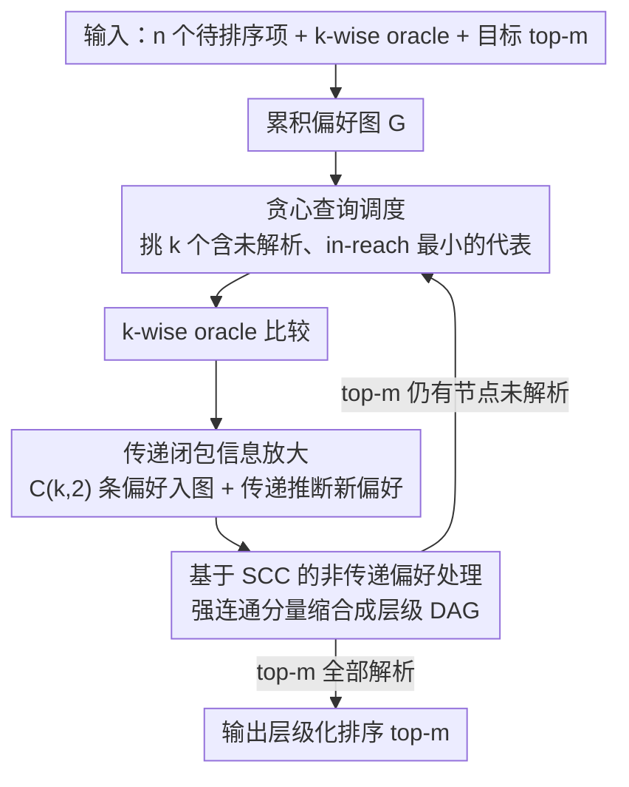

# BlitzRank: Principled Zero-shot Ranking Agents with Tournament Graphs

**会议**: ICML2026 Spotlight  
**arXiv**: [2602.05448](https://arxiv.org/abs/2602.05448)  
**代码**: https://github.com/ContextualAI/BlitzRank  
**领域**: 信息检索  
**关键词**: 锦标赛图, k-wise排序, 零样本重排序, 强连通分量, 文档重排序  

## 一句话总结
提出基于锦标赛图（tournament graph）的零样本重排序框架 BlitzRank，通过将每次 $k$-wise 比较产生的 $\binom{k}{2}$ 个偏好对累积到全局偏好图中并利用传递闭包推断额外排序关系，在 14 个基准、5 个 LLM oracle 上实现 Pareto 最优——在匹配或超越现有方法精度的同时减少 25–40% token 消耗。

## 研究背景与动机

**领域现状**：LLM 重排序是 retrieve-then-rerank 流水线的核心环节。现有方法分为三类：pointwise（逐文档打分）、pairwise（两两比较后聚合）和 listwise（滑动窗口一次处理多文档）。Sliding Window / RankGPT 是 listwise 的代表，TourRank 采用锦标赛淘汰赛制，Setwise 让 LLM 从 $k$ 个候选中选最优。

**现有痛点**：这些方法在利用比较信息上存在严重浪费。Pairwise 每次仅获取一个偏好对，开销高达 $O(n \log n)$ 次调用；Setwise 虽然一次看 $k$ 个文档，但只提取胜者，丢弃了剩余 $\binom{k}{2} - (k-1)$ 个偏好关系；Sliding Window 用固定步长滑动，信息传播依赖窗口重叠，无法判断何时已足够确定 top-$m$。

**核心矛盾**：每次 $k$-wise 比较实际上蕴含一个完整的局部锦标赛——$\binom{k}{2}$ 个偏好关系，但现有方法要么只提取胜者（Setwise/TourRank），要么依赖固定遍历顺序（Sliding Window），没有系统性地累积和传播这些比较信息。此外，LLM 判断常产生非传递偏好（$A \succ B \succ C \succ A$），现有方法将其视为噪声，而非可利用的结构。

**本文目标**：(1) 设计一个框架，从每次 $k$-wise 比较中提取完整锦标赛并通过传递闭包最大化信息利用；(2) 给出可证明正确的终止条件——当 top-$m$ 项已被"解析"时停止；(3) 优雅处理非传递偏好，输出层级化排序。

**切入角度**：作者从经典的"25 匹马赛跑"谜题出发——25 匹马、每次赛 5 匹、找最快 3 匹只需 7 场。关键洞察是：每场比赛不仅产出一个胜者，而是揭示了 $\binom{5}{2}=10$ 个偏好对，将这些偏好累积并做传递推断，就能用远少于淘汰赛制的比赛次数确定 top-$m$。

**核心 idea**：将 $k$-wise 比较建模为锦标赛图上的子图查询，通过传递闭包放大每次查询的信息量，并用节点"已解析"（与所有其他节点的偏好关系均已确定）作为终止判据，对非传递情况通过强连通分量（SCC）分解产出层级排序。

## 方法详解

### 整体框架
BlitzRank 把零样本重排序当成锦标赛图上的子图查询问题来解：给定 $n$ 个待排序项、一个能对 $k$ 个候选给出完整序的 $k$-wise 比较 oracle、以及目标 top-$m$，它维护一张随查询不断生长的累积偏好图 $G=(V,E)$，每一轮都用"挑哪 $k$ 个去问 → 把这次比较蕴含的所有偏好连同传递推断出来的偏好都加进图 → 检查 top-$m$ 是否已经确定"这条闭环往前推进，直到能可证明地确定前 $m$ 名才停。它的核心转变是：不再像 Setwise 那样只留胜者、也不像 Sliding Window 那样靠固定窗口重叠传播信息，而是把每次 $k$-wise 比较的全部 $\binom{k}{2}$ 个偏好关系都吃进图里，并让传递闭包替它"免费"推断更多关系。

### 关键设计

**1. 传递闭包信息放大：让每条新边都带动一片推断**

现有方法的浪费集中在"只用一次比较的局部结果"——Setwise 只取胜者，丢掉 $\binom{k}{2}-(k-1)$ 个偏好对；Sliding Window 只能靠窗口重叠一点点传播。BlitzRank 的做法是把每次 $k$-wise 比较看成一个完整的局部锦标赛，$\binom{k}{2}$ 条边一次性入图，再对全图取传递闭包，让已有路径自动组合出新偏好而不必再问 oracle。为了量化"还差多少信息"，它对每个节点 $v$ 定义 in-reach $R_G^-(v)=\{u:u\leadsto_G v\}$ 和 out-reach $R_G^+(v)=\{u:v\leadsto_G u\}$（$\leadsto_G$ 表示图上的有向可达），已知关系集 $K_G(v)=R_G^-(v)\cup R_G^+(v)$；当 $\kappa_G(v)=|K_G(v)|=n-1$ 时节点 $v$ 就被"解析"——它和其余所有节点的相对位置都已定死。算法只要当前 top-$m$ 全部解析就终止。正因为每条新边不仅自身有用、还能与已有路径组合推断大量新偏好，BlitzRank 才能在更少的 oracle 调用下确定 top-$m$。

**2. 基于 SCC 的非传递偏好处理：把循环当层级而非噪声**

LLM 判断常给出非传递偏好（$A\succ B\succ C\succ A$），现有方法只能当噪声丢掉。BlitzRank 反过来把它当成有意义的结构：对偏好图 $G$ 求强连通分量（SCC），同一 SCC 内的节点互相可达，说明 oracle 没法一致地把它们区分开，于是把它们归为同一"层级"。再把每个 SCC 缩成一个超节点得到缩合图（condensation），这张图必为 DAG，对锦标赛而言更是一个传递锦标赛，因此各 SCC 层级之间天然有全序，输出就成了层级化排序；当所有 SCC 退化为单点时，整体就回到普通全序。这样设计是有依据的——实验里 SCC 内文档的 BM25 分数标准差比相邻文档低约 40%，说明循环捕获的确实是"真正相似"的文档，把它们并成一层既诚实又省查询。

**3. 贪心查询调度：每轮都保证有进展**

每轮该挑哪 $k$ 个去问，直接决定收敛快慢。BlitzRank 在当前偏好图的缩合图 $[G]$ 上选点：取那些含未解析节点、且缩合 in-reach 最小的 SCC，每个 SCC 出一个代表节点凑成查询集 $Q$；若多个 SCC 的缩合 in-reach 相同，就优先选 out-reach 更小（也就是位置最不确定）的 SCC，再在其中挑 $\kappa_G$ 最小的代表。这个规则的关键在于缩合图里 in-reach 相同的 SCC 之间必然没有已知边（forced-tie 性质），所以查询它们的代表一定会发现新边，每轮都保证有进展——这也正是终止性证明的支点，最坏情况下 $\binom{n}{2}$ 轮必然停机。最终输出按 in-reach 排序的 top-$m$：传递情况下是全序，非传递时是层级排序。

### 一个完整示例
以经典的"25 匹马"谜题为直觉：25 匹马、每场只能赛 5 匹、要找最快 3 匹。淘汰赛制要赛很多场，但 BlitzRank 注意到每场 5 匹的比赛其实揭示了 $\binom{5}{2}=10$ 个偏好对。第一轮随机分组各赛一场，把这些偏好全部入图并取传递闭包，很多"谁快谁慢"的关系就被免费推出来；随后每一轮，调度器都挑那些 in-reach 最小、最可能争夺前几名却还没解析的节点凑一场新比赛，发现新边、再传递推断。当 top-3 对应节点的 $\kappa_G$ 都达到 $n-1$（与所有马的相对快慢都已确定）时，算法判定 top-3 已解析并停机——只用了远少于淘汰赛制的比赛次数。把"马"换成文档、"赛跑"换成 LLM 的 $k$-wise 比较，就是 BlitzRank 在重排序上的完整运行轨迹。

## 实验关键数据

### 主实验

在 14 个数据集（6 个 TREC DL + 8 个 BEIR）上，BM25 检索 top-100 后用 5 个 LLM oracle 重排序，$m=10$。

| 方法 | nDCG@10 | Tokens/query | 相对成本 |
|------|---------|-------------|---------|
| BM25 (不重排) | 41.1 | 0 | — |
| Pairwise | 57.0 | 324k | 8.1× |
| Setwise | 56.6 | 115k | 2.9× |
| TourRank | 56.0 | 57k | 1.4× |
| SW (Sliding Window) | 56.7 | 54k | 1.4× |
| AcuRank | 56.3 | 69k | 1.7× |
| AcuRank-H | 56.6 | 127k | 3.2× |
| **Blitz-k20** | **56.4** | **40k** | **1.0×** |
| **Blitz-k10** | **56.9** | **42k** | **1.1×** |

（宏平均，14 数据集 × 2 oracle: GPT-4.1 & Gemini-3-Flash）

### 窗口大小与 Sliding Window 对比

| 方法 | $k$ | DL19 | DL20 |
|------|-----|------|------|
| Sliding Window | 20 | 74.0 | 70.8 |
| Sliding Window | 10 | 56.4 | 53.2 |
| BlitzRank | 20 | 74.6 | 70.7 |
| BlitzRank | 10 | 73.6 | 72.4 |

Sliding Window 在 $k=10$ 时质量骤降（DL19: 74.0→56.4），因为步长 5 只传播 top-5 不足以确定 top-10；BlitzRank 在 $k=10$ 时仍保持接近 $k=20$ 的性能（73.6 vs 74.6），因为正确性由解析准则保证而非窗口覆盖。

### SCC 分析（消融）

| 配置 | SCC 内 BM25 标准差 | 邻居标准差 | 比值 |
|------|-------------------|-----------|------|
| $k=10$ | 0.605 | 1.032 | 0.59 |
| $k=20$ | 0.695 | 1.125 | 0.62 |

SCC 内文档的 BM25 方差比邻居低约 40%，验证了循环偏好捕获的是"真正相似"的文档而非随机噪声。$k=10$ 的 SCC 更小（平均 1.07 vs 1.18）且内部方差更低，说明更细粒度的比较能解决较容易的歧义。

## 亮点与洞察
- **经典信息论视角**：将 25 匹马谜题的最优策略推广为通用框架，核心洞察是"每次比较的信息量远大于只取胜者"
- **理论完备**：证明了算法的正确性（解析节点的 in-reach 即真实排名）和终止性（每轮至少发现一条新边），并给出 top-1 选择的查询复杂度上界 $\lceil(n-1)/(k-1)\rceil$
- **收敛可预测**：$k=10$ 时稳定在 12–15 轮（均值 13.6，标准差 0.58），便于成本估算
- **变长窗口**：框架天然支持每轮不同 $k$，可适配异构文档长度

## 局限性 / 可改进方向
- 框架假设确定性 oracle，而 LLM 判断具有随机性，当前仅通过 SCC 间接处理噪声
- 一般 $m > 1$ 的查询复杂度紧界仍为开放猜想（$O((n-1)/(k-1) + (m-1)/(k-1) \cdot \log_k m)$）
- 当前仅在文档重排序上验证，其他 $k$-wise 比较场景（众包标注、人类评估）需进一步实验

## 相关工作与启发
- **RankGPT / Sliding Window**（Sun et al., 2023）：固定窗口滑动，信息传播依赖重叠
- **Setwise**（Zhuang et al., 2024b）：$k$ 选 1，丢弃 $\binom{k}{2}-k+1$ 个偏好关系
- **Pairwise Ranking Prompting**（Qin et al., 2024）：heapsort 聚合，$O(n\log n)$ 次调用
- **TourRank**（Chen et al., 2025）：多轮淘汰赛 + 随机种子聚合
- **AcuRank**（Yoon et al., 2025）：贝叶斯 TrueSkill 更新，按不确定性选择性重排
- 锦标赛图理论（Brandt et al., 2016; Landau, 1953）提供了 SCC 分解和缩合图的理论基础

## 评分
- 新颖性: 9/10 — 锦标赛图+传递闭包+SCC 层级排序的组合在 LLM 重排序中首次系统化提出
- 实验充分度: 9/10 — 14 数据集 × 5 模型，含详细的 SCC 分析和窗口大小消融
- 写作质量: 9/10 — 25 匹马谜题引入自然，理论-实验衔接紧密
- 价值: 8/10 — Pareto 最优的效率-精度权衡对实际部署有直接价值

<!-- RELATED:START -->

## 相关论文

- [\[CVPR 2026\] Explaining CLIP Zero-shot Predictions Through Concepts](../../CVPR2026/information_retrieval/explaining_clip_zero-shot_predictions_through_concepts.md)
- [\[CVPR 2025\] EZSR: Event-based Zero-Shot Recognition](../../CVPR2025/information_retrieval/ezsr_event-based_zero-shot_recognition.md)
- [\[ICML 2026\] Retriever Portfolios: A Principled Approach to Adaptive RAG](retriever_portfolios_a_principled_approach_to_adaptive_rag.md)
- [\[ICLR 2026\] BTZSC: A Benchmark for Zero-Shot Text Classification Across Cross-Encoders, Embedding Models, Rerankers and LLMs](../../ICLR2026/information_retrieval/btzsc_a_benchmark_for_zero-shot_text_classification_across_cross-encoders_embedd.md)
- [\[ICML 2026\] Ranking-Free RAG: Replacing Re-Ranking with Selection in RAG for Sensitive Domains](ranking_free_rag_replacing_re-ranking_with_selection_in_rag_for_sensitive_domain.md)

<!-- RELATED:END -->
