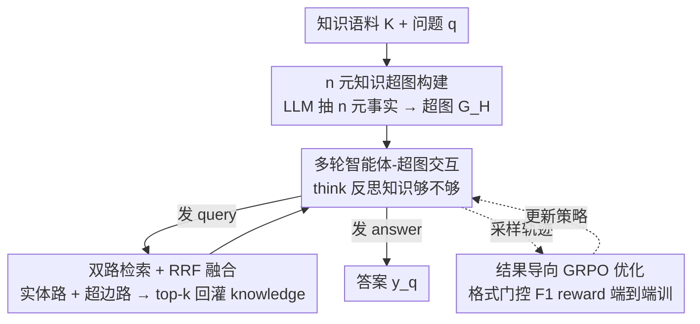

# Graph-R1: Towards Agentic GraphRAG Framework via End-to-end Reinforcement Learning

**会议**: ICML 2026  
**arXiv**: [2507.21892](https://arxiv.org/abs/2507.21892)  
**代码**: https://github.com/LHRLAB/Graph-R1 (有)  
**领域**: 信息检索 / GraphRAG / Agent  
**关键词**: GraphRAG, 强化学习, 知识超图, 智能体检索, 多轮推理

## 一句话总结
Graph-R1 把 GraphRAG 重写成"知识超图环境 + 多轮 think–query–retrieve–answer 智能体 + 结果导向 GRPO"的端到端 RL 框架，用更轻量的 n 元超图构建和双路超边检索 + RRF 融合，在 6 个标准 RAG 数据集上把 7B 模型的 F1 从 Search-R1 的 46.19 拉到 57.82。

## 研究背景与动机

**领域现状**：RAG 用 chunk-based 检索缓解 LLM 幻觉，但忽略实体间结构关系；GraphRAG（GraphRAG / LightRAG / HyperGraphRAG / PathRAG / HippoRAG2 等）改用实体–关系图建模知识，靠子图检索 + 路径裁剪喂给 LLM 长上下文推理。

**现有痛点**：作者把 GraphRAG 现状归结到三个具体瓶颈：

- 构图成本高、语义损失大：把自然语言压成二元 (head, rel, tail) 三元组本身就是一次有损压缩，并且要刷大量 LLM 调用；
- 检索是"一次性"的固定流程：大多数 GraphRAG 在收到 query 时一次性拉一坨子图丢给生成器，复杂多跳问题靠 prompt 工程拼凑；
- 生成强依赖大模型 + 长上下文 + 精心 prompt：小模型在图知识上几乎跑不动，HyperGraphRAG 这类方法和 StandardRAG 差距很小，说明"结构"没有真正被用起来。

**核心矛盾**：图结构带来的潜在收益（更高信息密度）和现行 GraphRAG 的"静态一次检索 + prompt 拼接"是矛盾的——结构信息要被"用起来"必须让模型多次回头看图、根据中间状态再 retrieve，但这件事 prompt-only 流水线做不到。

**本文目标**：(i) 把构图变得更"信息密一些"（n 元超边而不是二元三元组）；(ii) 把检索从一次性变成多轮、由 agent 自己决定停止；(iii) 用 RL 把这条"think-retrieve-rethink-generate"轨迹端到端优化掉，把"用不用图、什么时候问、问什么"全部学出来，而不是 prompt 调出来。

**切入角度**：受 DeepSeek-R1 / Search-R1 启发，把 GraphRAG 重新建模成一个 RL 问题——超图当环境，n 元事实当观测，think/query/retrieve/answer 当动作，token-level F1 + 格式合规度当 reward，用 GRPO 端到端训。

**核心 idea**：用"轻量 n 元知识超图 + 多轮智能体-超图交互 + 结果导向 GRPO"取代"重量级图构建 + 一次性子图检索 + 长上下文 prompt"，让小模型也能从图结构里榨出推理收益。

## 方法详解

### 整体框架
输入：知识语料 $K=\{d_1,\dots,d_N\}$ 和用户问题 $q$。输出：自然语言答案 $y_q$。

整条 pipeline 分两段——**离线**把语料抽成知识超图 $\mathcal{G}_H=(V,E_H,\phi)$，每条超边 $h_i$ 是一段语义片段，挂载多个实体 $\mathcal{V}_{h_i}$，并用共享 encoder $\phi(\cdot)$（bge-large-en-v1.5）给实体和超边都算 embedding；**在线**则让 LLM agent $\pi_\theta$ 围绕 $\mathcal{G}_H$ 滚多轮轨迹 $\tau=((\mathbf{s}_1,\mathbf{a}_1),\dots,(\mathbf{s}_T,\mathbf{a}_T))$。

每一步 agent 先在 `<think>` 里反思当前知识够不够，然后二选一：要么发 `<query>` 走双路超边检索把结果塞回 `<knowledge>`，要么发 `<answer>` 终止并产出答案。整条轨迹用 GRPO 端到端训练，reward 是"格式合规 + 答案 F1"组合而成的标量信号——不需要人写中间步监督，也不依赖 SFT 冷启。

### 关键设计

**1. 轻量化 n 元知识超图构建：把"多参与者事实"整体保留为一条超边**

二元三元组把一个事实里的多个参与者硬拆成若干 $(h,r,t)$，既损失语义又膨胀边数，这是 GraphRAG 构图贵又信息稀的根源。Graph-R1 对每个 chunk $d$ 用一个 LLM extractor $\pi_{\text{ext}}(d)\to\{(h_i,\mathcal{V}_{h_i})\}_{i=1}^m$ 直接抽 n 元关系事实——$h_i$ 是关系/事实文本，$\mathcal{V}_{h_i}$ 是参与实体集合，二者共享 encoder $\phi(\cdot)$ 得到 $\phi(v),\phi(h_i)$，整段语料压成 $\mathcal{G}_H=(V,E_H,\phi)$，每条超边就是"一段语义片段 + 挂载的多实体集合"，直接当 agent 的环境。相比 HyperGraphRAG，它砍掉了 confidence-score 等环节，在 2Wiki 上每 1K token 构建只要 5.69s / \$2.81，比 GraphRAG (8.04s / \$3.35)、HyperGraphRAG (6.76s / \$4.14) 都便宜，最终生成 120K 节点 / 98K 超边。把事实整条留住不仅保住了粒度，更关键的是给后面"对实体、对整条超边分别 embedding 检索"留了双路入口。

**2. 多轮智能体-超图交互：双路检索 + RRF 融合替代一次性拉子图**

复杂多跳问题靠"一次拉一坨子图丢给生成器"撑不起来，Graph-R1 把它改成 agent 主导的 think–query–retrieve–answer 循环。每步的动作 $\mathbf{a}_t=(\mathbf{a}_t^{\text{think}},\alpha_t,\mathbf{a}_t^{\text{out}})$ 用层次化策略 $\pi_\theta(\mathbf{a}_t^{\text{out}}\mid\alpha_t,\mathbf{a}_t^{\text{think}},\mathbf{s}_t)\cdot\pi_\theta(\alpha_t\mid\cdot)\cdot\pi_\theta(\mathbf{a}_t^{\text{think}}\mid\mathbf{s}_t)$ 分解：先 think 再决定发 query 还是 answer。收到 query 时并行跑两条互补路径——实体路 $\mathcal{R}_V=\arg\max^{k_V}_v \text{sim}(\phi(V_{\mathbf{a}_t^{\text{query}}}),\phi(v))$ 先找最相关实体再收集挂在它们上的超边，擅长"知道实体名、找它出现在哪些事实里"；超边路 $\mathcal{R}_H=\arg\max^{k_H}_{e_H}\text{sim}(\phi(\mathbf{a}_t^{\text{query}}),\phi(e_H))$ 直接拉超边，擅长"想找一种关系/事件但不知道具体实体"。两路结果用 reciprocal rank aggregation $\text{Score}(f)=1/r_V+1/r_H$ 取 top-$k$ 拼成 $\mathbf{a}_t^{\text{ret}}$ 喂回 `<knowledge>` 标签——RRF 让两条 ranking 不必分数对齐就能融合。实测 7B 上每个 query 平均只滚 2.3–2.5 轮、1200–1500 token，比 Search-R1/R1-Searcher 短得多，F1 反而更高。

**3. 结果导向的端到端 GRPO 优化：格式门控答案分，省掉 SFT 冷启**

多轮 agent + 图环境光靠 prompt 撑不起来，必须把"用不用图、什么时候问、问什么"学出来。Graph-R1 用一个标量 reward 把整条轨迹端到端回灌到策略 $\pi_\theta$：格式奖励 $R_{\text{format}}(\tau)=\min(1.0, 0.5\cdot\sum_t \mathbb{I}\{(\mathbf{a}_t^{\text{think}},\alpha_t,\mathbf{a}_t^{\text{out}})\})$ 鼓励完整跑 think→query/answer 结构，解决 agent 一开始不会 think、不会用标签的冷启问题；答案奖励 $R_{\text{answer}}$ 用 token-level F1（而非 EM，更宽容多跳问答的表述差异）对齐 ground truth。总奖励 $R(\tau)=-1.0+R_{\text{format}}(\tau)+\mathbb{I}\{R_{\text{format}}(\tau)=1.0\}\cdot R_{\text{answer}}$ 的关键是那个示性系数——只有格式拿满分才计算答案分，硬性把策略推进结构化输出空间，既避免模型走捷径乱答，又把本来要靠 SFT 做的行为约束直接折进 reward shaping 里。优化器选 GRPO：按组内平均归一化优势 $\hat A(\tau_i)=(R(\tau_i)-\text{mean}(\{R(\tau_j)\}))/F_{\text{norm}}(\cdot)$，加 PPO 风格 clip 和 KL 锚定，相对 PPO/REINFORCE++ 不需要 value model，更适配多轮轨迹这种长 horizon、稀疏 reward 的场景，消融里它也确实是最强的 RL 算法。

### 损失函数 / 训练策略
GRPO 目标：$\mathcal{J}_{\text{GRPO}}(\theta)=\mathbb{E}[\frac{1}{N}\sum_i\frac{1}{|\tau_i|}\sum_t\min(\rho_\theta\hat A,\text{clip}(\rho_\theta,1\pm\epsilon)\hat A)-\beta\mathbb{D}_{\text{KL}}(\pi_\theta\|\pi_{\text{ref}})]$，其中 $\rho_\theta=\pi_\theta/\pi_{\theta_{\text{old}}}$。基座：Qwen2.5-{1.5B,3B,7B}-Instruct；硬件：4×A100-80G；构图与 baseline GraphRAG 一致用 GPT-4o-mini 抽 n 元关系，检索 encoder 用 bge-large-en-v1.5。

## 实验关键数据

### 主实验
6 个 RAG 数据集（2Wiki / HotpotQA / Musique / NQ / PopQA / TriviaQA），用 EM、F1、Retrieval-Similarity (R-S)、Generation-Eval (G-E) 四个指标。表里给的是 7B 基座下的 6 数据集均值。

| 方法（Qwen2.5-7B 基座） | EM | F1 | R-S | G-E |
|--------|------|------|------|------|
| StandardRAG | 5.34 | 15.89 | 52.67 | 65.18 |
| HyperGraphRAG (GPT-4o-mini, prompt-only) | 13.15 | 29.40 | 61.82 | 78.92 |
| Search-R1 (chunk + RL) | 38.54 | 46.19 | 51.60 | 68.60 |
| R1-Searcher (chunk + RL) | 34.51 | 42.29 | 51.26 | 69.08 |
| **Graph-R1 (ours)** | **48.57** | **57.82** | 60.40 | **76.23** |

1.5B 上 Graph-R1 同样把 F1 从 Search-R1 的 29.53 拉到 40.09；3B 上从 35.69 拉到 51.26；7B 上从 46.19 拉到 57.82——同等参数下相对 RL-RAG 基线的 F1 绝对提升约 +10–16 个点。

### 消融实验
3B / 7B 基座、2Wiki + HotpotQA 均值：

| 配置 | EM (3B) | F1 (3B) | EM (7B) | F1 (7B) | 说明 |
|------|--------|---------|---------|---------|------|
| Full Graph-R1 | 50.39 | 57.16 | 56.25 | 63.87 | 完整模型 |
| w/o K.C. | 38.48 | 46.11 | 46.68 | 53.87 | 去掉超图构建（退回 chunk）F1 -11/-10 |
| w/o M.I. | 26.37 | 35.99 | 39.07 | 45.91 | 去掉多轮交互（一次性检索）F1 -21/-18 |
| w/o R.L. | 3.13 | 10.74 | 1.56 | 17.79 | 去掉 RL（纯 prompt agent）几乎崩溃 |

### 关键发现
- 三个模块里 **RL 贡献最大**——去掉 RL 后 EM 直接掉到个位数，说明"多轮 agent + 图环境"光靠 prompt 撑不起来，必须 RL 学策略；其次是多轮交互（M.I.），单轮就只能召回浅层证据；超图构建（K.C.）贡献相对最小但仍稳定带 +10 F1。
- **RL × 知识表示**有协同放大效应：Figure 5(b) 显示"无知识 < chunk + RL < 二元图 + RL < 超图 + RL"，prompt-only 的 HyperGraphRAG 反而不如 StandardRAG，说明"图结构 + 静态 prompt"并不自动等于更好；但只要套上 RL，图结构带来的 F1 天花板就显著抬高。
- **效率反而更好**：2Wiki 上 Graph-R1 (7B) 每 query 7.0s、生成成本 $0（因为模型已学到何时停），对比 HyperGraphRAG 的 9.6s / $8.76 既快又便宜，F1 还从 21.1 飙到 65.0；平均 2.3–2.5 轮交互、1200–1500 token 响应，比 Search-R1/R1-Searcher 更短但更准。
- **基座越大越受益**：1.5B→3B→7B，F1 单调 40.09→51.26→57.82，且相对 Search-R1 的差距越来越大，说明结构化推理能力依赖基座规模才能充分释放。
- **反例**：在已经被 RL 训过一轮的 Qwen3-4B 上，Graph-R1 反而表现略差——模型倾向于过度信任自己的内部推理而不去多轮 query，提示"先 RL 再 RL"会有干扰。

## 亮点与洞察
- "format reward 是答案 reward 的门控"这个设计很有意思：用 $\mathbb{I}\{R_{\text{format}}=1.0\}$ 当系数把答案分关在"格式过关"之后，等价于一个免费的"行为约束 + reward shaping"，省掉 SFT 冷启的同时避免 reward hacking，这套思路可以直接复用到任何"结构化输出 + 终端 reward"的 agent RL 场景。
- 双路检索（实体路 + 超边路）+ RRF 融合，相当于把 dense retrieval 的两种自然视角拼到一起，不需要训 cross-encoder 或 rerank 模型；这对工业界做 RAG 是很实用的 trick——只要你的知识有"实体"和"事实"两层就能套用。
- 把 GraphRAG 的失败案例（HyperGraphRAG 几乎等于 StandardRAG）作为反证写进 motivation，再用消融里 "w/o R.L. 崩到 17 F1" 闭环回去，论文的逻辑是"图结构本身不够，必须 + RL 才能用起来"，这个 narrative 比单纯 SOTA 报点更有说服力。
- 给三个 proposition 配理论证明（Lyapunov / 互信息 / Fano 不等式），虽然结论是工程常识（图比 chunk 信息密度高、多轮比一次性信息率高），但把它包成可证伸缩的形式，便于后续工作引用。

## 局限与展望
- 构图阶段 still 重度依赖 GPT-4o-mini 抽 n 元关系，5.69s/$2.81 per 1K token 在百万级语料上仍是不小开销；如果换成开源模型抽关系，质量损失多大没回答。
- 实验全部在 QA 风格的标准 RAG benchmark 上，没碰需要长答案/生成式回答的场景（如报告生成、代码 QA），不清楚 token-F1 reward 是否会鼓励模型走捷径输出关键词。
- Qwen3-4B 上掉点暗示"已经 RL 过的模型再上 GraphRAG-RL 会冲突"，对未来基座越来越强的 setting 是个隐患——是否需要给 already-RL'd 模型设计专门的 warm-start 策略？
- 知识超图是离线构建的静态环境，论文没讨论增量更新；真实 RAG 系统知识是持续涌入的，重新跑 πₑₓₜ 抽超边的成本会持续累计。
- agent 的最大交互轮数、$k_V/k_H/k$ 这些超参的敏感性分析没给详细数据，部署时调参成本未知。

## 相关工作与启发
- **vs HyperGraphRAG**：同样用 n 元超图，但 HyperGraphRAG 是 prompt-only + 一次性检索，被本文消融"w/o R.L."基本对齐；Graph-R1 砍掉了 HyperGraphRAG 的 confidence-score 等环节使构图更便宜，再叠 RL 把 F1 从 29.4 干到 57.8。
- **vs Search-R1 / R1-Searcher**：同样是"agent + RL + 检索"的范式，差别在 Search-R1/R1-Searcher 检索的是 chunk，Graph-R1 检索的是超图上的 n 元事实——本文 Figure 2 直接证明"在同一 RL 框架下换图作为知识环境，F1 天花板更高"，给出 graph-vs-chunk 在 RL setting 下的清晰对比。
- **vs DeepSeek-R1 / GRPO**：直接复用 GRPO 作为优化器，把"think → tool → answer"的 R1 范式从"内部思维链 + 工具"扩展到"内部思维链 + 图环境多轮检索"，并对应到 GraphRAG 这个具体落地场景。
- **vs PathRAG / HippoRAG2**：这些方法在子图/路径检索策略上做文章但仍是 prompt-only 一次检索，本文证明这些"静态检索 trick"在 prompt-only 下与 StandardRAG 差距很小，真正的杠杆在"让 agent 自己决定问几次、问什么"。

## 评分
- 新颖性: ⭐⭐⭐⭐ 把"agentic RL + n 元超图 + GRPO"三件事拼到一起是首次干净的组合，单点都是已知技术但组合出明显增益。
- 实验充分度: ⭐⭐⭐⭐ 6 数据集 × 3 基座 × 5+ 基线 + 3 模块消融 + 构建/检索/生成成本分析 + 表示/算法/Qwen 版本对比，覆盖度够；缺超参敏感性。
- 写作质量: ⭐⭐⭐⭐ 三个 challenge → 三个设计 → 三个 proposition 的对仗结构清晰，公式和图齐全；附录给理论证明，加分项明显。
- 价值: ⭐⭐⭐⭐ 开源代码、把 GraphRAG 推上 RL 范式、在小模型上也能跑通，对工业界 RAG 落地有直接参考价值。

<!-- RELATED:START -->

## 相关论文

- [\[ACL 2026\] End-to-End Optimization of LLM-Driven Multi-Agent Search Systems via Heterogeneous-Group-Based Reinforcement Learning](../../ACL2026/information_retrieval/end-to-end_optimization_of_llm-driven_multi-agent_search_systems_via_heterogeneo.md)
- [\[ACL 2026\] Agentic Conversational Search with Contextualized Reasoning via Reinforcement Learning](../../ACL2026/information_retrieval/agentic_conversational_search_with_contextualized_reasoning_via_reinforcement_le.md)
- [\[ACL 2025\] Gumbel Reranking: Differentiable End-to-End Reranker Optimization](../../ACL2025/information_retrieval/gumbel_reranking.md)
- [\[ACL 2026\] Learning to Extract Rational Evidence via Reinforcement Learning for Retrieval-Augmented Generation](../../ACL2026/information_retrieval/learning_to_extract_rational_evidence_via_reinforcement_learning_for_retrieval-a.md)
- [\[ACL 2025\] MEMERAG: A Multilingual End-to-End Meta-Evaluation Benchmark for Retrieval Augmented Generation](../../ACL2025/information_retrieval/memerag_a_multilingual_end-to-end_meta-evaluation_benchmark_for_retrieval_augmen.md)

<!-- RELATED:END -->
