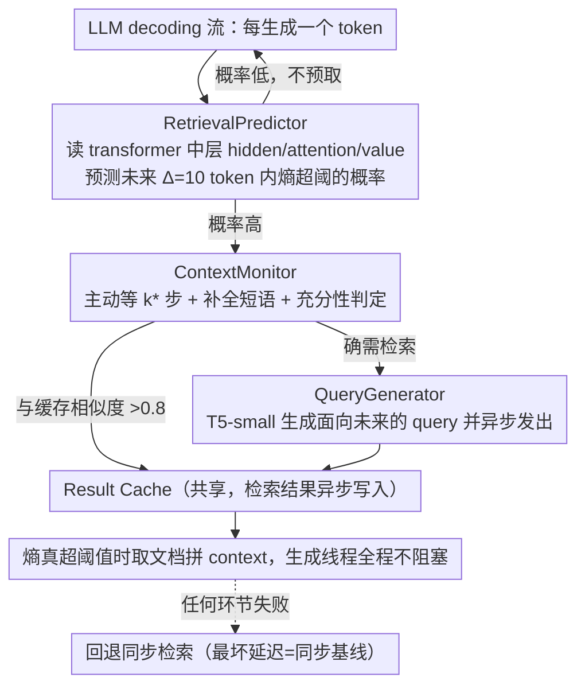

# Predictive Prefetching for Retrieval-Augmented Generation

**会议**: ICML2026  
**arXiv**: [2605.17989](https://arxiv.org/abs/2605.17989)  
**代码**: 待确认  
**领域**: 信息检索  
**关键词**: RAG, 异步检索, 预测式预取, LLM服务, 延迟优化

## 一句话总结
通过学习 transformer 隐状态/注意力中"早于不确定性 8–16 token 出现的语义前兆"，本文用 RetrievalPredictor + ContextMonitor + QueryGenerator 三件套把 RAG 的检索从同步阻塞改造为预测式异步预取，在 HotpotQA 等基准上把端到端延迟降低 43.5%、TTFT 降低 62.4%，同时答案质量保持在同步 RAG 1% 以内。

## 研究背景与动机

**领域现状**：RAG 已成为给 LLM 注入实时/事实知识、抑制幻觉的主流方案，但生产部署中检索本身成为延迟瓶颈——单次外部 API 检索 100–500 ms，复杂多跳查询可能触发上百次，累积后用户体感极差。

**现有痛点**：当前 RAG 检索是**同步阻塞**的，一旦熵超过阈值触发检索，token 生成就完全暂停等待检索返回；少数异步方法（TeleRAG 定时窗口、PipeRAG 用 stale token 当 query）只是"用启发式时间表把检索藏到生成背后"，但都假设生成过程中"信息需求是稳定的"——这在多领域、跨主题、实体引用边走边变的真实场景里很脆弱：预取回来的文档可能跟真正需要的根本不是一回事，反而徒增噪声。

**核心矛盾**：高事实精度 ↔ 低延迟之间存在结构性冲突——同步架构下，想要质量必须容忍多轮检索的延迟，想要延迟必须砍掉检索深度牺牲完整性；异步架构虽然能"藏住延迟"，但无法纠正"预取内容与真实信息需求不匹配"。

**本文目标**：把这个矛盾分解成三个可独立回答的子问题：(1) **何时**应该触发检索去预取？(2) 此刻积累的上下文**够不够**支撑一个有效 query？(3) **检索什么**才能真正对得上生成路径上的信息需求？

**切入角度**：作者的关键观察是——检索需求并非凭空出现，而是被生成动态中的"语义前兆"（熵轨迹特征、注意力分配模式、value 表示动态）预先编码，这些信号在不确定性真正爆发前 8–16 个 token 就开始显现；并且这些信号不仅能预测"何时需要"，也能编码"需要什么"。

**核心 idea**：用一个轻量预测器读取 transformer 中层的 hidden/attention/value 信号来**预测**未来 token 何时会触发高熵，再用一个上下文监控器决定**等几步**才发 query，最后用一个 T5-small 生成"面向未来信息需求"而非"复述当前上下文"的查询，让检索和生成真正并发、且预取内容对得上生成路径。

## 方法详解

### 整体框架

这套系统要解决的是"检索同步阻塞导致生成卡住"这个延迟瓶颈，做法是把检索决策提前到不确定性真正爆发之前，并搬到并行线程上预取。输入仍是 LLM 的 decoding 流、输出仍是原 LLM 生成的 token 序列，只是中间插入了一条"预测—预取—缓存"流水线：每生成一个 token，RetrievalPredictor 先从 transformer 中层信号估计"未来 $\Delta=10$ 个 token 内熵会超阈值的概率" $\hat p_t$；若概率高，ContextMonitor 决定等几步、要不要复用缓存、短语补全了没有；确需检索时 QueryGenerator 用一个面向未来需求的 query 异步发出，结果回到共享 Result Cache，生成线程全程不阻塞，等熵真的超阈值时直接从缓存取文档拼 context。整条 stack 在 8B 主干上只多加约 62M 参数（2 层 transformer predictor ~2M + 三个 MLP 评分头 <0.3M + T5-small 60M），三件套用统一多任务 loss 联合预训练，部署后再用 action-specific feedback 的 policy gradient 在线适配；任何环节失败都自动回退同步检索，把最坏延迟锁死在同步基线，预取但未命中的文档则保留摊销成本。

### 关键设计

**1. RetrievalPredictor：用 transformer 内部信号把检索决策提前到熵爆发之前**

纯熵阈值是反应式的——熵涨起来才知道该检索，此时已经晚了；作者的关键观察是检索需求会被生成动态中的"语义前兆"预先编码，这些信号在不确定性真正爆发前 8–16 个 token 就开始显现（10-token offset 处 Pearson 相关 0.42）。于是 predictor 在每个 token $t$ 拼接 16-token 滑窗的 hidden state $\mathbf{H}_t$、attention 矩阵 $\mathbf{A}_t$、value 向量 $\mathbf{V}_t$，过一个 2 层 transformer encoder 得到 $\mathbf{z}_t \in \mathbb{R}^{512}$，再拼上输出分布统计 $\mathbf{o}_t$（熵、top-k margin），经 sigmoid 头算出 $\hat p_t = \sigma(\mathbf{W}_p \cdot [\mathbf{z}_t;\mathbf{o}_t] + b_p)$，即未来 $\Delta=10$ 个 token 内熵 $\mathcal{H}_\tau$ 首次超过阈值 $\theta$ 的概率。信号刻意取自中层（深度 30–45%，如 Llama-3.1-8B 的 10–14 层），因为可解释性研究表明中层既捕获高层语义抽象又保留不确定性信号，而最末层会过拟合到输出分布。把决策窗口结构性地提前正是异步预取的前提，AUROC 0.81 对比仅用当前熵的 0.66，验证了这个前兆确实可学。

**2. ContextMonitor：触发后主动等几步，让 query 更准、还顺手去重**

直接拿"刚触发瞬间的上下文"发 query 经常只是半截短语（如"The main cause of the"），query 质量很差，所以 monitor 不立刻发，而是用三个轻量评分头做主动等待。Phase 1 用建在 T5 上的 ContextScore 在 $k\in\{0,...,5\}$ 中挑最佳等待步数 $k^\* = \arg\max_k \mathrm{ContextScore}(\mathbf{c}_{t+k})$；到 $t+k^\*$ 后 Phase 2 用 SufficiencyClassifier 计算当前上下文 Contriever embedding $\mathbf{e}_c$ 与缓存文档 $\mathbf{e}_d$ 的最大余弦相似度 $\sigma(\mathbf{W}_{\text{suff}} \cdot [\mathbf{e}_c; \max_d \cos(\mathbf{e}_c, \mathbf{e}_d)] + b_{\text{suff}})$，>0.8 就直接复用缓存、不发新检索；同时 ClarityScore $\sigma(\mathbf{W}_{\text{clarity}} \cdot \mathbf{h}_c + b_{\text{clarity}})$ 若 <0.7 则再等最多 2 个 token 把短语补成"The main cause of the 2008 financial crisis"。多等这 3–4 个 token 既补完短语、消歧信息需求，又给模型自纠错的窗口避免 false positive——实验里它把 factual query 的 Query Relevance Score 从 0.65 提到 0.86（+23%），并避免了 21% 的冗余检索，主动延迟反成净收益。

**3. QueryGenerator + 多任务联合训练 + 在线 contextual-bandit 适配**

PipeRAG 直接拿 stale token 当 query 的毛病在于"过去的 token 表达不了未来的信息需求"——生成已走到"2008 financial"，旧 query 还停在"main cause"。本文改用 fine-tuned T5-small 从积累上下文反推将要问什么，$\mathbf{q} = \mathrm{T5}(\mathbf{c}_{t+k^\*})$，confidence 高时生成聚焦窄 query、低时生成更广的 exploratory query，质量同时超过 raw context query 和 8B LLM 直生 query（QRS 0.79 vs 0.74）。三件套用统一多任务 loss $\mathcal{L} = \alpha\mathcal{L}_{\text{pred}} + \beta\mathcal{L}_{\text{timing}} + \gamma\mathcal{L}_{\text{suff}} + \delta\mathcal{L}_{\text{clarity}} + \epsilon\mathcal{L}_{\text{query}}$ 联合预训练，标签全自动生成：对每个候选位置做"有检索/无检索"配对生成，用 utility $s = \mathrm{EM}_{\text{with}} - \mathrm{EM}_{\text{without}}$ 判正负样本。部署后再做在线适配，把 4 个动作（Generate/Reuse/Accumulate/Fetch）建成 gated 级联，用 policy gradient $\nabla_\phi J = \mathbb{E}_{s\sim\rho}[\nabla_\phi \log \pi_\phi(a|s) \cdot R(s,a)]$ 优化，且每个动作的奖励只回传给负责该决策的组件（成功不检索 +0.5、成功复用缓存 +1.0、有效检索 +1.0、不必要检索 −0.5、迟到检索 −2.0）。之所以用 contextual bandit 而非长程 RL，是因为每个动作都有立即且明确归属的反馈，结构上本就是 bandit，简单稳定且 2000 query 就能收敛（AUROC 0.760 → 0.809，前 500 query 即拿到 70% 的提升）。

## 实验关键数据

### 主实验

在 HotpotQA / 2WikiMultiHopQA / NQ / TriviaQA 四个 QA 基准上用 Llama-3.1-8B 评测，与 9 个 baseline 共享同一套 Wikipedia 语料 + FAISS IVF + Contriever（125ms 中位检索延迟）。

| 方法 | HotpotQA EM/F1 | NQ EM/F1 | TTFT (ms) | E2E (s) | Ret/1K | Efficiency↑ |
|------|----------------|----------|-----------|---------|--------|-------------|
| Sync-RAG | 69.2 / 75.1 | 73.4 / 79.1 | 287 | 9.2 | 86.0 | 8.2 |
| Self-RAG | 67.8 / 73.6 | 72.1 / 77.8 | 234 | 7.8 | 72.0 | 9.4 |
| FLARE | 65.9 / 72.1 | 70.2 / 75.8 | 206 | 6.8 | 71.0 | 10.6 |
| PipeRAG | 66.8 / 72.9 | 70.1 / 75.8 | 118 | 5.6 | 66.8 | 13.0 |
| **Ours** | **68.7 / 75.1** | **72.5 / 78.7** | **108** | **5.2** | **59.0** | **14.4** |
| Oracle | 70.3 / 76.2 | 74.2 / 80.1 | 45 | 3.1 | 48.0 | 24.6 |

结论：相比 Sync-RAG，TTFT 降 62.4%（287→108 ms）、E2E 降 43.5%（9.2→5.2 s）、每千 token 检索次数降 31.4%（86→59）；HotpotQA EM 仅落 Sync-RAG 0.5%，但已显著超过其他异步/自适应方法。代码补全 RepoBench-P 上 TTFT 降 52%、E2E 降 32%，EM 反而比 Repoformer 高 0.6%；本地 50–100ms 检索的 QMSum 上 TTFT 仍降 35%。尾延迟同样过硬：P95 比 Sync-RAG 低 33%，prediction-miss 子集的 P99（14.0s）仍低于 Sync-RAG 的 P95（15.2s）。

### 消融实验（HotpotQA）

| 配置 | EM | F1 | TTFT | E2E | 说明 |
|------|----|----|------|-----|------|
| Full System | 68.7 | 75.1 | 108ms | 5.2s | 完整系统 |
| w/o Async architecture | 68.4 | 74.8 | 287ms | 7.8s | 去掉异步，TTFT 涨 2.7× |
| w/o Retrieval Predictor | 65.1 | 71.3 | 118ms | 5.8s | 退回熵阈值，EM 掉 3.6% |
| w/o Online learning | 66.2 | 72.5 | 112ms | 5.5s | 仅预训练，EM 掉 2.5% |
| w/o T5 query generator | 67.1 | 73.8 | 108ms | 5.4s | 用 raw context 当 query，EM 掉 1.6% |
| w/o Adaptive waiting | 66.8 | 73.5 | 108ms | 5.6s | 去掉 ContextScore 等待，EM 掉 1.9% |
| w/o Sufficiency check | 67.8 | 74.4 | 108ms | 5.4s | 不复用缓存，EM 掉 0.9% |

### 关键发现
- **异步架构是延迟红利的主来源**（去掉后 TTFT 立刻涨 2.7×），**Retrieval Predictor 是质量红利的主来源**（去掉后 EM 掉 3.6% 最多）——说明"预测"和"异步"是两条互补的收益曲线，不能只做其中一边。
- T5-small (60M) fine-tune 后的 QRS（0.79）反而高于直接用 8B LLM 生成 query（0.74），且只占 T5-large 22% 延迟却拿到 96% 质量——窄任务上 fine-tuning 的收益远大于堆参数。
- false positive 占触发的 38.7%，但其中 72% 在后续 50 token 内被复用，真正完全浪费的只有 28%，净增延迟开销约 8%（已计入 43.5% 的总收益中）。
- 模型越大收益越大：Llama-70B AUROC 涨到 0.83；1B 模型每 token 仅 ~10ms，lead time 只够 ~87ms，更适合配本地低延迟检索。同一组阈值 $\theta=2.5, \Delta=10$ 在 6 个不同模型上都给出 61.5–63.4% TTFT 提升，迁移性好。

## 亮点与洞察
- **"语义前兆比熵爆发早 8–16 token"是真正的核心 insight**：作者没有去训一个更准的熵估计器，而是把"未来需求"用中层 hidden/attention/value 直接预测，把检索决策时间窗口结构性地提前——这种"用内部表示替代外部信号"的思路可以复刻到其他需要预判的服务系统（speculative decoding、KV cache 预热、tool calling 预触发）。
- **Gated 4-动作 contextual bandit 的归属式奖励设计极其巧妙**：每个动作的 reward 只更新对应组件参数，避免 RL 长程信用分配的不稳定，2000 query 就收敛。这种"把决策树拆开、每个节点单独 bandit"的范式适合任何"多组件 + 立即反馈"的在线学习场景。
- **ContextMonitor 引入"主动等待"打破了 RAG 默认的反应式范式**：触发检索后先等 3–4 个 token 补完短语，看似牺牲了延迟，实际既提升 query 质量 23%、又避免 21% 冗余检索、还能让模型自纠错——"主动延迟"反成净收益，这个 trade-off 在 streaming 推理里普遍存在但常被忽视。
- 失败回退到同步 RAG 的设计让"最坏情况延迟 = 同步基线"，把预测器的下行风险锁死——这是把预测式系统真正推进生产的关键工程兜底。

## 局限与展望
- **依赖 hidden state/attention/value**：闭源 API 模型（GPT-4、Claude）无法部署；logit-only 退化变体只能拿到 0.66 AUROC，大部分收益消失。
- **训练数据来自 HotpotQA + NQ 的 oracle 标签**：作者用三条证据反驳"记忆"质疑（预测器学的是 transformer 计算属性、10K trace 后等待时间精度饱和、零样本到 2WikiMultiHopQA 仍保留 78% 精度），但 OOD 任务上仍需在线适配补 5–9 个 AUROC 点。
- **38.7% false positive 中仍有 28% 完全浪费**，净开销 ~8% latency，进一步压缩这部分是直接收益点。
- **预测式预取会把敏感 query pattern 在缓存中保留更久**，隐私敏感场景需要更激进的 cache eviction 策略。
- HotpotQA 上仅 0.5% EM 差距 81% 来自 bridge 类问题——"第二跳依赖第一跳结果"的场景仍是预测的硬伤，可结合 multi-step beam 或推迟二跳预测来优化。

## 相关工作与启发
- **vs FLARE / Self-RAG / DRAGIN**：这些方法都是"反应式同步检索"——靠熵阈值/学习信号触发，触发后阻塞生成；本文把决策时机**提前**到熵爆发前 8–16 token，且执行变成异步，因此 TTFT 降 50%+。
- **vs TeleRAG**：TeleRAG 用固定 lookahead window 定时触发，不管是否真有需求；本文用学习到的概率 $\hat p_t$ 动态决定，避免无效预取（Ret/1K 59 vs 86）。
- **vs PipeRAG**：PipeRAG 同样异步，但 query 是 stale token，主题切换时严重失配；本文用 T5-small 从积累上下文生成面向未来的 query，在匹配的基础设施上 EM 高 1.9%、Efficiency 高 14.4 vs 13.0。
- **vs vLLM / 系统级 RAG 优化**：FAISS 索引、KV cache 等是缩短"单次检索延迟"，本文是**藏住延迟**，与系统层优化正交，二者可叠加。

## 评分
- 新颖性: ⭐⭐⭐⭐ "预测式异步预取"在 RAG 里是首个完整方案，"语义前兆 8–16 token 提前"的观察很扎实，但单看每个组件都是已有模块的组合。
- 实验充分度: ⭐⭐⭐⭐⭐ 6 个基准 + 9 个 baseline + 跨 6 个模型族验证 + 尾延迟 + 失败分析 + 灵敏度扫，覆盖到位。
- 写作质量: ⭐⭐⭐⭐ 三件套结构清晰、公式标号齐全、关键 trade-off 都给了量化解释；个别地方（如 contextual bandit 推导）略简，需查 appendix。
- 价值: ⭐⭐⭐⭐⭐ RAG 延迟是生产部署的头号瓶颈，43.5% E2E 降幅在 0.5% EM 代价下非常划算，且系统级方案可立刻 ship。

<!-- RELATED:START -->

## 相关论文

- [\[ACL 2026\] Feedback Adaptation for Retrieval-Augmented Generation](../../ACL2026/information_retrieval/feedback_adaptation_for_retrieval-augmented_generation.md)
- [\[ACL 2026\] Disco-RAG: Discourse-Aware Retrieval-Augmented Generation](../../ACL2026/information_retrieval/disco-rag_discourse-aware_retrieval-augmented_generation.md)
- [\[ICML 2026\] LazyAttention: Efficient Retrieval-Augmented Generation with Deferred Positional Encoding](lazyattention_efficient_retrieval-augmented_generation_with_deferred_positional_.md)
- [\[ICML 2026\] Hierarchical Abstract Tree for Cross-Document Retrieval-Augmented Generation](hierarchical_abstract_tree_for_cross-document_retrieval-augmented_generation.md)
- [\[NeurIPS 2025\] Chain-of-Retrieval Augmented Generation (CoRAG)](../../NeurIPS2025/information_retrieval/chain-of-retrieval_augmented_generation.md)

<!-- RELATED:END -->
