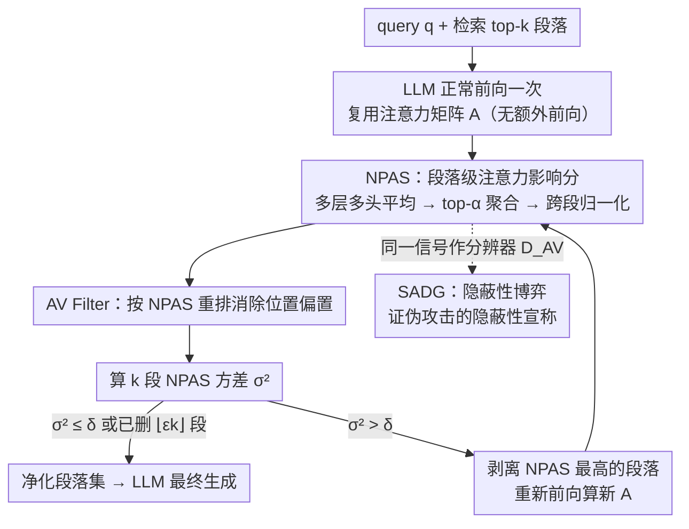

# Through the Stealth Lens: Attention-Aware Defenses Against Poisoning in RAG

**会议**: ICML 2026  
**arXiv**: [2506.04390](https://arxiv.org/abs/2506.04390)  
**代码**: https://github.com/sarthak-choudhary/Stealthy_Attacks_Against_RAG (有)  
**领域**: 信息检索 / RAG 安全 / 检索投毒防御  
**关键词**: RAG投毒, 注意力分析, 隐蔽性博弈, 投毒检测, 自适应攻击

## 一句话总结
本文指出现有 RAG 投毒攻击虽然能用少量恶意段落操纵 LLM 输出，但**并非真正隐蔽**——成功的低预算攻击必然会让模型把注意力过度集中在恶意段落上，因此作者用每段落归一化注意力分数 NPAS 和基于其方差的 AV Filter 把异常段落筛掉，在 4 数据集 × 5 LLM × 5 攻击的设定下把 RACC 比 Certified Robust RAG 最高拉高 20%。

## 研究背景与动机

**领域现状**：RAG 通过把外部知识库的 top-$k$ 段落拼进 prompt 来补偿 LLM 的过时知识与幻觉，已成 Google AI Overview、Bing、Perplexity 等系统的底座。但知识库本身就是一个开放攻击面，攻击者只要往维基百科/网页/社交媒体上放几段精心构造的"恶意段落"，就能被检索器召回并操控生成。PoisonedRAG 等工作证明：只腐化 10 段中的 1 段就能让 GPT-4 输出指定答案。

**现有痛点**：现有防御主要分两类——一类是 perplexity / vigilant prompting / reranking 等**段落孤立**式过滤，对语义通顺的 LLM 生成投毒几乎无效；另一类是 Xiang et al. (2024) 的 Certified Robust RAG，用 isolate-then-aggregate 提供经验上界，但清洁准确率代价大（ACC 比 Vanilla 掉 ~20%）。共同缺陷是没有利用"恶意段落正在主导生成"这一关键内部信号。

**核心矛盾**：在 $\epsilon < 0.5$ 的低腐化预算下，攻击者要让少数段落压住多数良性段落，就**必须**让它们对 LLM 推理的影响显著超过良性段落——这本身就和"隐蔽"互斥。但既往攻击没人形式化"隐蔽性"，更没人系统地从模型内部信号去检测。

**本文目标**：(i) 形式化定义 RAG 投毒的"隐蔽性"度量，可证伪现有攻击的隐蔽性宣称；(ii) 设计一个轻量、即插即用、不依赖额外前向的检测+过滤防御；(iii) 通过自适应攻击探索这条信号的鲁棒下限。

**切入角度**：在 transformer 推理时，**注意力权重是一个免费的、能反映 token 影响力的代理信号**（Vig & Belinkov 2019）。若攻击成功诱导出目标答案 $s'$，则 $s'$ 的生成 token 必然把注意力大量分配给含有/暗示 $s'$ 的恶意 token，从而在段落级聚合上呈现"少数段落抢走过多注意力"的高方差异常。

**核心 idea**：把每段的归一化注意力分数（NPAS）当作"段落对响应的影响代理"，**用 NPAS 在 $k$ 段间的方差**作为"被投毒"的统计签名，再用迭代剥离最高分段落的 AV Filter 做防御。

## 方法详解

### 整体框架
本文要在 RAG 生成阶段（Step II）解决一个隐蔽性博弈问题：低预算投毒攻击要让少数恶意段压住多数良性段，就必然在 LLM 内部留下"少数段抢走过多注意力"的痕迹，于是把这个痕迹做成可量化的检测信号。具体地，给定 query $q$、检索得到的 top-$k$ 段落 $z^{(k)}$、LLM $\text{LLM}_\theta$、腐化预算 $\epsilon$ 与方差阈值 $\delta$，先让 LLM 正常前向一次并复用它产出的注意力矩阵（无需额外算力），把多层多头注意力平均成单矩阵 $A \in \mathbb{R}^{l \times T}$（$l$ 为响应 token 数、$T$ 为输入 token 数），再聚合成段落级的 NPAS；只要 NPAS 方差超过阈值就剥离分数最高的段落并重跑，直到方差落回阈值下或已删够 $\lfloor \epsilon k \rfloor$ 段，最后把净化后的段落集 $\tilde z$ 喂回 LLM 做最终生成。同一套 NPAS 还充当 SADG 博弈里的"分辨器" $\mathcal{D}_{\text{AV}}$，把检测与隐蔽性度量统一在一个信号上。

### 关键设计

**1. SADG：把"隐蔽性"做成密码学风格的可证伪定义**

以往论文谈隐蔽都用"人能否一眼看出恶意段落"这种主观标准，无法证伪也无法量化。SADG（Stealth Attack Distinguishability Game）把它升级成对抗博弈：仲裁者采样 $q$ 后分别构造良性集 $z^{(k)}_{\text{benign}}$ 和被攻击者投毒后的 $z^{(k)}_{\text{corrupt}}$，**随机打乱顺序**发给防御者让它猜哪个被投毒，防御者优势定义为 $\mathsf{Adv} = |\Pr[\text{win}] - 1/2|$。一个攻击只有对所有 PPT 防御者都满足 $\mathsf{Adv} \le \tau$ 才称 $\tau$-stealthy，理想隐蔽对应 $\tau = 0$。这套定义之所以关键，是因为它能直接拿任意检测器去刷攻击的隐蔽上界——本文后面"现有攻击根本不隐蔽"的所有结论都建立在这个可证伪游戏之上。

**2. NPAS：段落级的影响力代理**

直接看 token 级原始注意力太噪、也无法跨段比较，所以需要一个对段落长度不变、可跨 query/模型迁移的"段落 $\to$ 响应"影响力分数。NPAS（Normalized Passage Attention Score）先把所有解码层和注意力头平均得 $A$，再对段 $z_t$ 取其 top-$\alpha$ 个被关注 token（$\alpha \in \{5, 10, \infty\}$）的列在 $A$ 中的注意力之和作原始分 $\mathsf{Score}_\alpha(z_t, A) = \sum_i \sum_{x_j \in \text{Top}_\alpha(z_t)} A[i,j]$，最后跨段归一化为 $\mathsf{NormScore}_\alpha(z_t) = \mathsf{Score}_\alpha(z_t) / \sum_{i=1}^k \mathsf{Score}_\alpha(z_i)$。取 top-$\alpha$ 是为了抓住"Heavy Hitter"（往往就是含目标答案的关键词）并屏蔽段落长度差异，跨段归一化则让阈值在不同设定间可迁移。良性段的注意力近乎均匀（仅有轻微 recency bias），被投毒段会把注意力抢走形成右偏分布，所以**用 NPAS 在 $k$ 段间的方差**就是天然又稳健的判别量。

**3. AV Filter：迭代剥离 + 重排避位置偏置**

在不知道哪一段恶意的前提下，AV Filter（Attention-Variance Filter）以最多 $\lfloor \epsilon k \rfloor$ 次删除为预算把可疑段落筛掉。它先按 NPAS 重排段落以消除 recency bias（靠近生成位置的段会天然多吸一点注意力，重排让真正异常的段更显著，针对 Liu et al. 2023 / Guo & Vosoughi 2024 观察到的位置偏置），然后进入 while 循环：算 NPAS 方差 $\sigma^2$，若 $\sigma^2 \le \delta$ 提前终止，否则删掉 $\arg\max \mathsf{NormScore}$ 的段落、重新前向算新的 $A$ 与 NPAS，直到触达预算上限。之所以要迭代而非单次评分，是因为恶意段抢走 30% 注意力时下一段可能还有 15%，单次会被"次大段"掩盖、方差也偏高，逐次剥离才能稳住多投毒段的情形。阈值 $\delta = 26.2$ 在 RQA + Llama-2 的清洁集上用 mean+1·std 估出，**优先压低假阴**（误删几段良性对最终答案伤害很小）。整套流程零训练，只复用 LLM 自身前向的注意力，因此推理代价几乎为零。

### 损失函数 / 训练策略
本文是**纯推理期防御**，无需训练 LLM。阈值 $\delta$ 在单数据集（RQA + Llama-2）一次性估出后直接迁移到 4 数据集 × 5 模型，$\alpha \in \{5,10,\infty\}$ 是超参；当 GPT-4o 等闭源模型不暴露注意力时，作者用开源 Mistral-7B 做**辅助模型**计算 NPAS，black-box 设定下 SADG 优势仍显著。自适应攻击端则借鉴 jailbreak 的 GCG 风格优化，最小化"恶意段落的 NPAS 与良性段落差距"。

## 实验关键数据

### 主实验
评估 4 数据集（RQA、RQA-MC、NQ、HotpotQA）× 5 LLM（Llama2-7B-Chat / Mistral-7B-Instruct / Llama-3.1-8B / Deepseek-R1-Distill-Qwen-7B / GPT-4o）× 5 攻击（Poison、MA、Paradox、CorruptRAG、PIA），$k=10$、$\epsilon=0.1$，5 seed 平均。

| 设定 | 指标 | Vanilla | Keyword (CR-RAG) | Decoding (CR-RAG) | AV Filter (本文 $\alpha=10$) |
|------|------|---------|------------------|-------------------|------------------------------|
| Mistral-7B / RQA-MC / 清洁 ACC | ↑ | 81.0 | 58.0 | 57.0 | **74.0** |
| Llama2-C / RQA-MC / 清洁 ACC | ↑ | 79.0 | 56.0 | 44.0 | **75.0** |
| Mistral-7B / RQA-MC / PIA | RACC↑ / ASR↓ | 59.6 / 31.0 | 57.0 / 7.0 | 55.0 / 5.0 | **77.2 / 6.0** |
| Llama2-C / RQA-MC / PIA | RACC↑ / ASR↓ | 33.4 / 63.0 | 54.0 / 6.0 | 38.0 / 12.0 | **(↑ ~20% vs 基线)** |
| 平均 SADG 胜率 (CIR) | ↑ | — | — | — | **0.78** |

关键结论：AV Filter 在**保留 RAG 清洁效用**这件事上几乎不掉点（相比 Vanilla 平均掉 ≤ 5%），而 Keyword / Decoding 这种 isolate-then-aggregate 会掉 15-20%；同时在 PIA / Poison 攻击下 RACC 还比基线高最多 20%。

### 消融实验
| 配置 | 关键发现 | 说明 |
|------|---------|------|
| $\alpha = 5 / 10 / \infty$ | 三者表现接近，$\alpha=10$ 略优 | top-$\alpha$ 数量需匹配恶意段中 Heavy Hitter 数；过小漏信号、过大被噪声稀释 |
| 不重排 vs 重排（按 NPAS 排序） | 不重排时 recency bias 让位置 9-10 段误删率上升 | 验证位置偏置是真实问题，重排是必要工程项 |
| 单次 NPAS vs 迭代 AV Filter | 迭代对多投毒段（$\epsilon=0.2$）显著更稳 | 单次评分会被次大段掩盖 |
| White-box vs Black-box（GPT-4o + Mistral 辅助） | Black-box 下 SADG 优势从 0.78 → ~0.65，仍远高于 0.5 | 注意力信号在辅助模型上也保留可分性 |
| 自适应攻击 vs AV Filter | 优化后 ASR 最高 35%（仍 < Vanilla < Certified 上界） | 但需 $\sim 10^3\times$ baseline 推理时间 + 知晓良性段，实战不现实 |

### 关键发现
- **NPAS 在良性集上近乎均匀，在被投毒集上单段拉高到 30%+**（图 2a），方差分布出现明显右移（图 2b），这是 AV Filter 能稳定工作的根本原因。
- 阈值 $\delta$ 在 RQA + Llama-2 上估一次就能迁到 4 数据集 × 5 模型，说明 NPAS 跨设定的尺度一致性靠归一化撑住了。
- **黑盒可用**是本文很重要的工程价值：即使部署的是 GPT-4o，用 Mistral-7B 旁路算 NPAS 仍能跑 AV Filter。
- 自适应攻击虽然把 ASR 抠回 35%，但作者诚实地标注"它需要约 1000 倍推理时间 + 已知良性段，作为隐蔽上界探索而非实际威胁"，避免了把"已被攻破"过度宣传的常见误读。

## 亮点与洞察
- **把"隐蔽性"从直觉判据升级为密码学博弈**：SADG 让任意攻击的隐蔽性宣称都能被任意检测器证伪，是这条防线最重要的理论贡献——以后再有人说"我的 RAG 攻击 stealthy"，得先报 $\mathsf{Adv}_{\text{SADG}}$。
- **注意力作为免费防御信号**：复用 LLM 自身前向产出的注意力，无需训练、无需额外前向（除迭代删除外的重算），即插即用，迁移到任意开源 RAG 栈几乎零成本。
- **诚实呈现自适应攻击**：很多防御论文不做自适应攻击或刻意藏弱点，本文不仅做了，还明确量化"需要 $10^3\times$ 推理 + 已知良性段"的实战不可行性，把军备竞赛的边界讲清楚了。
- 可迁移 trick：(i) top-$\alpha$ 聚合 + 跨样本归一化 这套消除长度/尺度差异的范式可以直接搬到段落归因、检索结果重排等场景；(ii) "用方差当异常签名 + 迭代删除最大值" 在多源融合（如多模态对齐、多 agent 投票）里都能复用。

## 局限与展望
- **依赖 benign-majority + 冗余假设**：Assumption 3.2 要求至少 2 段良性支持正确答案，若知识库本身覆盖差或检索器召回差则不成立；样式投毒、隐私泄露等不以"在响应中输出特定 token"为目标的攻击不在覆盖范围（Assumption 3.4）。
- **$\epsilon < 0.5$ 信息论硬约束**：作者明说多数腐化时信息论上无解，与 Certified Robust RAG 同样的边界。
- **自适应攻击仍能拿到 35% ASR**：说明 NPAS 不是终极信号；攻击者一旦掌握辅助模型，可用 jailbreak 优化把恶意段的 NPAS 显式压低。后续可能方向：用 attention rollout 或基于 hidden state 的多信号集成；和 Certified Robust RAG 做 ensemble（Appendix D.7 已做初探）。
- 阈值 $\delta$ 依赖于"清洁集存在"，在领域漂移大的部署中可能要重新校准。

## 相关工作与启发
- **vs Certified Robust RAG (Xiang et al., 2024) — Keyword / Decoding**：他们 isolate 每段独立生成再聚合，提供经验上界但清洁 ACC 掉 ~20%；本文做**段落集联合的注意力分析**，清洁 ACC 几乎不掉、RACC 还高 20%，两者可以集成（附录 D.7）。
- **vs Perplexity Filter (Jain et al., 2023)**：perplexity 是段落孤立分数，对 LLM 流畅生成的投毒几乎无效；NPAS 是"段落-响应联合分数"，能捕捉到"通顺但有强影响"的恶意段。
- **vs Vigilant Prompting (Pan et al., 2023) / Misinformation Detection (Hong et al., 2023)**：基于内容判定真伪，受限于模型对世界知识的覆盖；本文转向内部信号，对内容真伪无关，只看"是否过度影响"。
- **vs Attention Rollout (Abnar et al., 2020)**：更复杂的注意力归因方法，但作者明确选择简单的层/头平均以保稳定性和部署便利——是一种 engineering 取舍而非能力上限。
- **vs PoisonedRAG (Zou et al., 2024) 等攻击侧工作**：本文反过来用攻击留下的"高影响痕迹"做防御，并把这些攻击的隐蔽性宣称在 SADG 下证伪。

## 评分
- 新颖性: ⭐⭐⭐⭐ SADG 形式化 + 把注意力方差作为投毒签名都是首次系统化，但单看 NPAS 是注意力归因的自然延伸。
- 实验充分度: ⭐⭐⭐⭐⭐ 4 数据集 × 5 LLM × 5 攻击 + 白盒/黑盒 + 自适应攻击 + 与 SOTA 集成，覆盖全面且诚实呈现弱点。
- 写作质量: ⭐⭐⭐⭐ 假设独立成节、SADG 定义清晰、Algorithm 1 直接可复现；缺点是符号略密、Heavy Hitter 概念到实验段才解释。
- 价值: ⭐⭐⭐⭐⭐ 即插即用、零训练、白/黑盒通吃，对生产级 RAG 系统（Perplexity / Bing / 企业内部 RAG）有直接工程意义。

<!-- RELATED:START -->

## 相关论文

- [\[ACL 2026\] Disco-RAG: Discourse-Aware Retrieval-Augmented Generation](../../ACL2026/information_retrieval/disco-rag_discourse-aware_retrieval-augmented_generation.md)
- [\[ACL 2026\] VideoStir: Understanding Long Videos via Spatio-Temporally Structured and Intent-Aware RAG](../../ACL2026/information_retrieval/videostir_understanding_long_videos_via_spatio-temporally_structured_and_intent-.md)
- [\[ICLR 2026\] Bayesian Attention Mechanism: A Probabilistic Framework for Positional Encoding and Context Length Extrapolation](../../ICLR2026/information_retrieval/bayesian_attention_mechanism_a_probabilistic_framework_for_positional_encoding_a.md)
- [\[AAAI 2026\] SR-KI: Scalable and Real-Time Knowledge Integration into LLMs via Supervised Attention](../../AAAI2026/information_retrieval/sr-ki_scalable_and_real-time_knowledge_integration_into_llms_via_supervised_atte.md)
- [\[AAAI 2026\] RRRA: Resampling and Reranking through a Retriever Adapter](../../AAAI2026/information_retrieval/rrra_resampling_and_reranking_through_a_retriever_adapter.md)

<!-- RELATED:END -->
