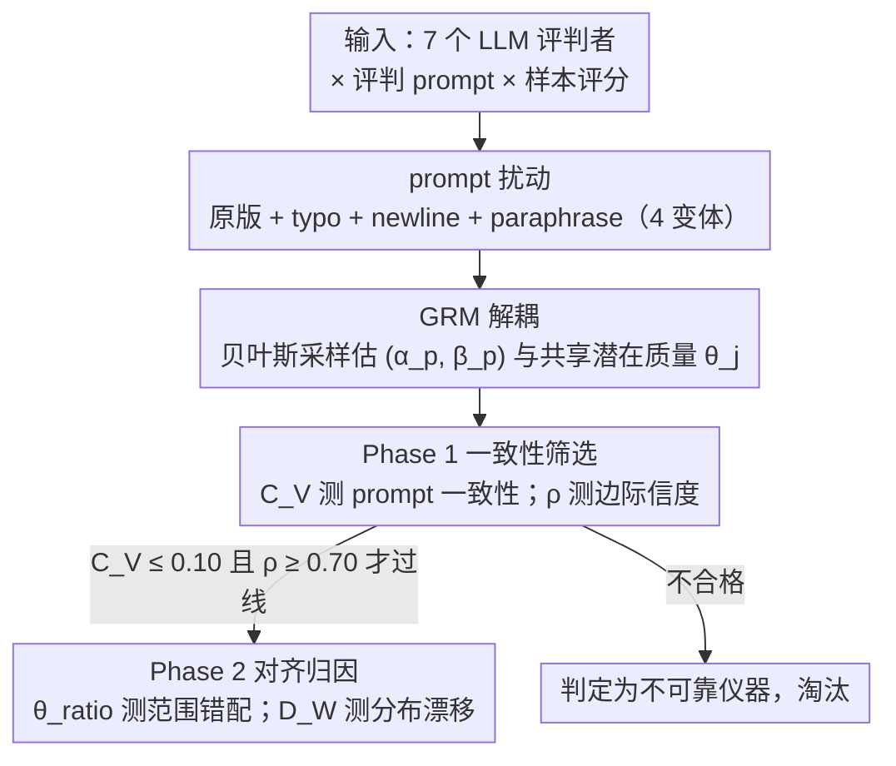

# Diagnosing the Reliability of LLM-as-a-Judge via Item Response Theory

**会议**: ICML 2026  
**arXiv**: [2602.00521](https://arxiv.org/abs/2602.00521)  
**代码**: https://github.com/elu-lab/IRT-Judge  
**领域**: LLM 评测 / LLM-as-a-Judge / 可靠性诊断  
**关键词**: Item Response Theory, Graded Response Model, 评判一致性, 人类对齐, 潜在质量

## 一句话总结
本文把心理测量学里的 Item Response Theory (IRT) 中的 Graded Response Model (GRM) 搬到 LLM-as-a-Judge 上，把"评判分数"分解成评判者属性 $(\alpha, \beta)$ 与样本潜在质量 $\theta$，再用 4 个可解释指标分两阶段（内在一致性 + 人类对齐）系统诊断 7 个主流 LLM 在 11 类评判准则上"是不是一台稳定的测量仪器"。

## 研究背景与动机
**领域现状**：LLM-as-a-Judge 已经渗透到摘要评测、对话评测、视觉生成评测、RLHF 奖励建模等场景，因为相比人工标注它便宜、可规模化。验证它"靠不靠谱"主要走两条路：一是 *intrinsic consistency*（同样的样本换个 prompt 还能给一样的分吗），二是 *human alignment*（和人类打分一致吗）。

**现有痛点**：两条路通常被分开做、而且都停留在"输出层面"。一致性侧用 inter-rater agreement、不同 seed 重跑、McDonald's $\omega$、token 概率不确定性等，但这些指标都只看最终离散分数，没法把"评判者本身的测量特性"从"样本质量本身的差异"中分离出来。对齐侧用 Pearson/Spearman/Kendall 相关、Cohen's $\kappa$、Krippendorff's $\alpha$ 等聚合指标，只能看"结果像不像"，看不出评判者是"系统偏严/偏松"还是"分辨力不够"。

**核心矛盾**：现有方法把"测量误差"和"样本本身差异"混在一起算，导致即便发现 LLM 评判不稳定，也说不清是 prompt 敏感、模型分辨力差、还是评判维度本身就难标。需要一个能把测量仪器特性从被测对象特性中分离出来的统计框架。

**本文目标**：建立一个统一框架，同时回答两个问题：(1) 这个 LLM 评判者作为"测量仪器"本身是否稳定？(2) 它的"测量结果"与人类是否对齐？而且要让这两个问题的诊断信号是可解释的、可分项归因的。

**切入角度**：作者借鉴心理测量学百年累计的 Item Response Theory——教育考试就是用 IRT 评估"考题能不能可靠测出学生能力"，那同样可以用它评估"LLM 评判者能不能可靠测出样本质量"。具体选用 Graded Response Model (GRM) 因为评判分数恰好是 Likert 式的有序离散类别。

**核心 idea**：把"LLM 评判分数 = 评判者特性 $(\alpha, \beta)$ × 样本潜在质量 $\theta$"建模成一个生成式概率模型，用贝叶斯推断同时估出三者；然后从估出的 $\theta$ 分布和 $(\alpha, \beta)$ 中抽取 4 个诊断指标，把"测量不稳定"按"prompt 敏感 vs 分辨力不足 vs 系统偏差 vs 范围错配"逐项归因。

## 方法详解

### 整体框架
这套框架想解决的是"现有方法把测量误差和样本真实差异混在一起算，导致 LLM 评判不稳定时说不清到底坏在哪"，思路是把评判过程当成一次心理测量、用 GRM 反推出三类隐变量再据此分项诊断。具体走三步：先对每个原始评判 prompt 生成 typo / newline / paraphrase 三种语义不变的微扰版本（加原版共 4 个变体），再把"7 个 LLM × 每个 prompt 变体 × 每个样本"的评分喂给 GRM、用贝叶斯采样同时估出每个 prompt 变体的判别力与门槛 $(\alpha_p, \boldsymbol{\beta}_p)$ 以及每个样本共享的潜在质量 $\theta_j$，最后做两阶段诊断——Phase 1 先用一致性指标筛掉"仪器本身就不稳"的评判者，只有过线者才进入 Phase 2 与人类的潜在质量分布对比。

### 关键设计

**1. GRM 解耦：把 prompt 效应从样本真质量里剥出来**

现有一致性/对齐指标都只盯最终离散分数，没法回答"这个分差到底是样本真有差距、还是评判者对 prompt 措辞敏感"。GRM 直接在生成模型层面下手：对 $K$ 档评分，把"评判者 $p$ 给样本 $j$ 打分 $\ge k$"的概率建模为 $P(Y_{pj} \ge k \mid \theta_j) = \sigma(\alpha_p (\theta_j - \beta_{pk}))$，其中 $\theta_j$ 是被所有 prompt 变体共享的样本潜在质量，$\alpha_p$ 是该 prompt 的分辨力（响应曲线陡度），$\boldsymbol{\beta}_p$ 是它在相邻档间切换的门槛序列（强制单调递增）。先验取 $\theta_j \sim \mathcal{N}(0,1)$、$\alpha_p \sim \text{LogNormal}(0, 0.5)$、$\beta_{pk} \sim \mathcal{N}(0,1)$，NUTS 同时采样全部参数。妙处在于 4 个变体共享同一个 $\theta_j$：分数差异里"评判者敏感于措辞"的成分会被自动吸收进 $(\alpha, \boldsymbol{\beta})$，"样本真质量差异"被吸收进 $\theta$，两者天然解耦，比较模型时只看 $\theta$ 分布即可，绕开了"模型 A 用满 5 档、模型 B 只用 3 档导致 $\alpha,\beta$ 不可比"的麻烦。选 GRM 而非 NRM（假设名义类别、丢失顺序信息）或 PCM（强制所有 item 共用一个 $\alpha$，对显然敏感度不同的 prompt 太苛刻），正是因为评判分数是有序离散的 Likert 量表。

**2. Phase 1 一致性筛选：用 $C_V$ 与 $\rho$ 做差分诊断**

光说"评判不稳"太模糊，本文用两个正交指标把它拆开。$C_V$ 衡量 prompt 一致性：先对每个变体 $p$ 算"同一打分档内 $\theta_j$ 的方差均值" $\bar V_p$，再对各 $\bar V_p$ 求跨 prompt 的变异系数 $C_V = \sigma_V / \mu_V$。$\rho$ 衡量边际信度：$\rho = \text{Var}(\hat\theta_j) / (\text{Var}(\hat\theta_j) + \mathbb{E}[\sigma_j^2])$，分子是 $\theta$ 后验均值的方差（真质量差异），分母额外加上 NUTS 后验方差的期望（测量不确定性），所以 $\rho$ 直观就是"$\theta$ 方差里有多少来自真质量"。阈值沿用心理测量学的成熟惯例——$C_V < 0.10$ 源自 Chebyshev 不等式（保证 75% 样本落在均值 ±20% 内）与分析化学/临床流行病学的精度基准，$\rho > 0.70$ 是 Nunnally 的经典门槛。两者组合即可差分归因：高 $C_V$ + 高 $\rho$ 说明问题主要在 prompt 敏感性，而 $\rho$ 偏低则无论 $C_V$ 如何都意味着模型分辨力本身不够、压根不适合做评判者。这一阶段还兼任"门控"——只有 $C_V \le 0.10$ 且 $\rho \ge 0.70$ 的评判者才进入 Phase 2，避免在测量本身就乱的仪器上算人类对齐（那种对齐数字毫无意义）。

**3. Phase 2 对齐归因：用 $\theta_{\text{ratio}}$ 与 $D_W$ 拆解"和人类的差距"**

传统 Spearman/Kendall 只能回答"和人类一致吗"这种 yes/no，看不出评判者是系统偏严还是分辨力错配。本文用两个指标拆开。$\theta_{\text{ratio}} = \theta_{\text{range}}^{(\text{LLM})} / \theta_{\text{range}}^{(\text{Human})}$，其中 $\theta_{\text{range}}$ 定义为"最高档样本 $\theta$ 中位数减最低档样本 $\theta$ 中位数"：$\theta_{\text{ratio}} < 1$ 表示 LLM 压缩了质量范围（超敏感，分不开人类眼中有差距的样本），$> 1$ 表示放大了范围（麻木，把人类觉得没差的样本硬拉开），$\approx 1$ 才是分辨力相当。$D_W = W_1(\hat\theta^{(\text{LLM})}, \hat\theta^{(\text{Human})})$ 则取 LLM 与人类 $\theta$ 分布间的 1-Wasserstein 距离；之所以不用相关（只看线性、不看分布形状）或 KL（不对称、对非重叠 support 未定义），是因为 Wasserstein 同时刻画"位置漂移"和"形状差异"，数值还有"把一个分布搬成另一个的最小代价"的物理意义。组合解读同样清晰：$\theta_{\text{ratio}} \approx 1$ 但 $D_W$ 大 → 分辨力相当但系统偏严/松；$\theta_{\text{ratio}} \ne 1$ 而 $D_W$ 小 → 整体感知对齐但敏感度不同；两者都偏离 → 评判者对"质量"的根本理解就和人不一样，把"对齐失败"落到了可干预的具体维度上。

### 训练策略
整套框架没有端到端训练，本质是一次后验推断：用 PyMC 写出 GRM 概率模型，调 NUTS（NumPyro 后端、4 链、1000 warmup + 1000 采样、target acceptance 0.95）做贝叶斯采样；遇到二值评分（如 TopicalChat 的 Understandability、Groundedness）则退化为 2-PL 逻辑模型代替 GRM。Prompt 扰动各有做法：typo 用 AugLy 对 Qwen3-8B 最后一层注意力最高的 5 个 token 做字符级扰动，newline 随机插入 3 个换行，paraphrase 先用 NLTK POS tagging 抽 5 个动词/形容词、再让 GPT-4o-mini 生成同义替换。

## 实验关键数据

### 主实验
评估 7 个模型（Gemini 2.5 Flash, GPT-4o, GPT-4o-mini, Qwen3-30B-A3B, Qwen3-235B-A22B, Llama-4-Maverick, Llama-4-Scout，视觉任务用 Qwen3-VL），3 套评测基准（SummEval 文本摘要、TopicalChat 对话、HelpSteer-2 通用质量）+ 1 套视觉基准（VIEScore on ImageHub 三个子集 CIG/MIE/TIE × {SC, PQ}）。

**Phase 1 关键结果**（$C_V \le 0.10$ 且 $\rho \ge 0.70$ 视为合格）：

| 任务 / 模型 | $C_V$ | $\rho$ | 合格? | 解读 |
|------------|-------|--------|-------|------|
| SummEval Relevance / GPT-4o | 0.05 | 0.92 | ✓ | 摘要评测最稳 |
| SummEval Consistency / GPT-4o-mini | 0.92 | 0.88 | ✗ | $\rho$ 高但 $C_V$ 爆表 → prompt 敏感 |
| TopicalChat Understandability / Qwen3-235B | 0.27 | 0.34 | ✗ | $\rho$ 直接腰斩 → 分辨力本身不够 |
| HelpSteer-2 Helpfulness / Gemini-2.5 | 0.03 | 0.86 | ✓ | 最佳 |
| VIEScore CIG-SC / Gemini-2.5 | 1.32 | 0.94 | ✗ | $\rho$ 高 $C_V$ 极高 → 典型 prompt 敏感 |
| VIEScore CIG-PQ / Gemini-2.5 | 1.11 | 0.94 | ✗ | 同上 |

**Phase 2 关键结果**（$\theta_{\text{ratio}}$, $D_W$）：

| 任务 / 模型 | $\theta_{\text{ratio}}$ | $D_W$ | 解读 |
|------------|------------------------|-------|------|
| SummEval Relevance / Gemini-2.5 | 0.96 | 0.30 | 范围匹配，轻度漂移 |
| TopicalChat Understandability / GPT-4o | 2.59 | 0.33 | "麻木"严重，质量被拉开 2.6× |
| VIEScore TIE-PQ / GPT-4o | 4.40 | 0.60 | 范围放大 4×，分布大幅漂移 |
| HelpSteer-2 Coherence / Qwen3-30b | 1.03 | 0.16 | 罕见的"范围匹配 + 高对齐" |

### 消融实验（TopicalChat 上做 prompt 详细度 / CoT / 评分尺度消融）

| 配置 | 关键发现 | 说明 |
|------|---------|------|
| 简略 prompt → 详细 prompt | $C_V$ 大幅下降 | 详细指令显著稳定 prompt 一致性 |
| 详细 prompt + CoT | $C_V$ 进一步下降（GPT-4o Naturalness $C_V = 0.01$, Qwen3-30b/Llama-4-m $C_V = 0.06$） | CoT 还能再压一档 |
| 3 档 → 5 档评分 | $\rho$ 在分级标准上略升（Naturalness 0.91-0.95, Coherence 0.90-0.95） | 适度增加档次能提升信度 |
| 3 档 → 7 档评分 | $\rho$ 反而可能下降 | 不是越多档越好 |
| 任何配置 → $\rho$ 提升 | 仅边际 | 详细指令稳定的是 $C_V$，对 $\rho$ 帮助有限 |

### 关键发现
- **没有免费午餐**：7 个 LLM 没有任何一个在所有 11 个评测准则上都满足 $C_V \le 0.10$ 且 $\rho \ge 0.70$，说明"通用可靠的 LLM 评判者"目前不存在。
- **视觉 vs 文本**：VIEScore（视觉评测）的 $C_V$ 普遍是 0.16-1.32（远高于 NLP 任务的 0.03-0.30），说明视觉评测对 prompt 措辞极其敏感；但同时 VIEScore 的 $\rho$ 普遍 0.80-0.96 反而比 NLP 高——一旦 prompt 固定，视觉评判内部排序是稳定的。
- **规模效应分裂**：在 NLP 任务上，更大的模型（Qwen3-235B vs 30B, GPT-4o vs mini）一致带来更低 $C_V$ + 更高 $\rho$；但在 VIEScore 上完全不成立，规模在视觉评测上不再保稳定性。
- **$\theta_{\text{ratio}}$ 普遍 $> 1$**：几乎所有 LLM 都比人类"麻木"（放大质量差异），尤其是 TopicalChat 普遍 2-3×，VIEScore TIE-PQ 高达 4×，这种系统性"分得过开"是现有相关性指标完全看不出来的。
- **prompt 详细度治 $C_V$，scale 治 $\rho$**：消融揭示了清晰的设计指南——想稳就写详细 prompt + CoT；想分辨力强就调评分档次（5 档比 3 档好，7 档可能反而坏）。

## 亮点与洞察
- **把 IRT 搬进 LLM 评测领域**：心理测量学已经有 70 多年成熟工具，本文是把 GRM 用于诊断 LLM-as-a-Judge 的首个系统性尝试，开了一条"把 LLM 评判者当成测量仪器来标定"的新路。比起单纯算相关系数，IRT 提供了概率生成模型 + 可解释参数 + 成熟阈值惯例三个层面的优势。
- **门控式两阶段设计很关键**：先 Phase 1 过线再 Phase 2，避免了在测量本身就乱的评判者上算人类对齐——这种"对齐数字"在文献中其实很常见但毫无意义。这种"先验证仪器再用仪器测"的思路可以迁移到任何 LLM-based 评测设计。
- **$\theta_{\text{ratio}}$ 揭示了被相关性掩盖的系统问题**：很多 LLM 评判者和人类相关性系数看起来不差，但 $\theta_{\text{ratio}}$ 普遍 $> 1$ 暴露了它们系统性地"分得过开"——这种 finding 在传统 Spearman/Kendall 框架下根本看不到。
- **可迁移性强**：框架不依赖具体模型或任务，只要评判输出是有序离散的就能用，且代码开源。给后续设计新的 LLM 评测准则提供了一个标准化、可量化的可靠性验证流程。

## 局限与展望
- **GRM 假设较强**：要求评分有序、不同 item 共享潜在能力 $\theta$；如果评判是分类型（如 win/lose/tie 三选一无序）GRM 就不适用，得换 NRM 但会丢顺序信息。
- **NUTS 采样开销不小**：4 链 × 2000 步 × 7 模型 × 11 准则 × 4 prompt 变体，需要工程优化才能 scale 到更大评测基准。
- **prompt 扰动覆盖有限**：只测了 typo / newline / paraphrase 三种 surface-level 扰动，没有覆盖结构性变化（重排 rubric、改变 framing），作者承认结构性变化应当视为"新仪器"独立走 Phase 1。
- **人类基线的可靠性没单独验证**：把人类评分当作"金标准"喂给 GRM 算 $\theta^{(\text{Human})}$，但人类标注本身也有 inter-annotator 不一致，这部分没被显式建模。
- **没给"如何修复不可靠评判者"的处方**：诊断到 "$\rho$ 太低就别用" 之后呢？是该换模型、改 prompt、还是改任务定义？这部分留给后续工作。

## 相关工作与启发
- **vs 传统 inter-rater agreement / McDonald's $\omega$**：这些只看输出层面的一致性，无法把 prompt 敏感性和样本质量差异分开；本文用 GRM 在生成模型层面解耦，能做差分诊断。
- **vs 不确定性量化（Wagner et al., 2024; Xie et al., 2025）**：基于 token 概率的不确定性只看单点输出的置信度，看不到跨 prompt 的稳定性结构；$C_V$ 直接把跨 prompt 一致性算成单个数字。
- **vs 相关系数 / Cohen's $\kappa$**：这些聚合指标对"系统性偏严/偏松""范围错配"等模式不敏感；$\theta_{\text{ratio}}$ + $D_W$ 能把"对齐失败"分解到具体维度。
- **vs Selective evaluation（Jung et al., 2025）/ 统计替换检验（Calderon et al., 2025）**：那些工作做"什么时候可以让 LLM 替代人类"的决策；本文做更上游的"这个评判者作为测量仪器本身合不合格"的诊断，是补充关系。

## 评分
- 新颖性: ⭐⭐⭐⭐ 把 IRT/GRM 引入 LLM 评测是清晰的跨学科迁移，框架设计完整，但底层统计模型是 1960s 的成熟工具。
- 实验充分度: ⭐⭐⭐⭐ 7 模型 × 11 准则 × 4 prompt 变体覆盖了 NLP 和视觉两大场景，消融揭示了 prompt 详细度与评分尺度的清晰作用。
- 写作质量: ⭐⭐⭐⭐ 公式定义清晰，"差分诊断"小节直接把 $C_V$/$\rho$ 组合解读写出来，便于实践使用；缺点是术语密集，对不熟悉 IRT 的读者门槛较高。
- 价值: ⭐⭐⭐⭐ 给"如何标定 LLM 评判者"提供了第一个有理论根基+可解释指标+成熟阈值惯例的标准化流程，代码开源，落地友好。

<!-- RELATED:START -->

## 相关论文

- [\[ACL 2025\] IRT-Router: Effective and Interpretable Multi-LLM Routing via Item Response Theory](../../ACL2025/interpretability/irt_router_multi_llm.md)
- [\[ICML 2026\] From Rashomon Theory to PRAXIS: Efficient Decision Tree Rashomon Sets](from_rashomon_theory_to_praxis_efficient_decision_tree_rashomon_sets.md)
- [\[ICML 2026\] Prompt Optimization Is a Coin Flip: Diagnosing When It Helps in Compound AI Systems](prompt_optimization_is_a_coin_flip_diagnosing_when_it_helps_in_compound_ai_syste.md)
- [\[ICML 2026\] Steer Like the LLM: Activation Steering that Mimics Prompting](steer_like_the_llm_activation_steering_that_mimics_prompting.md)
- [\[ICML 2026\] GEM: Geometric Entropy Mixing for Optimal LLM Data Curation](gem_geometric_entropy_mixing_for_optimal_llm_data_curation.md)

<!-- RELATED:END -->
