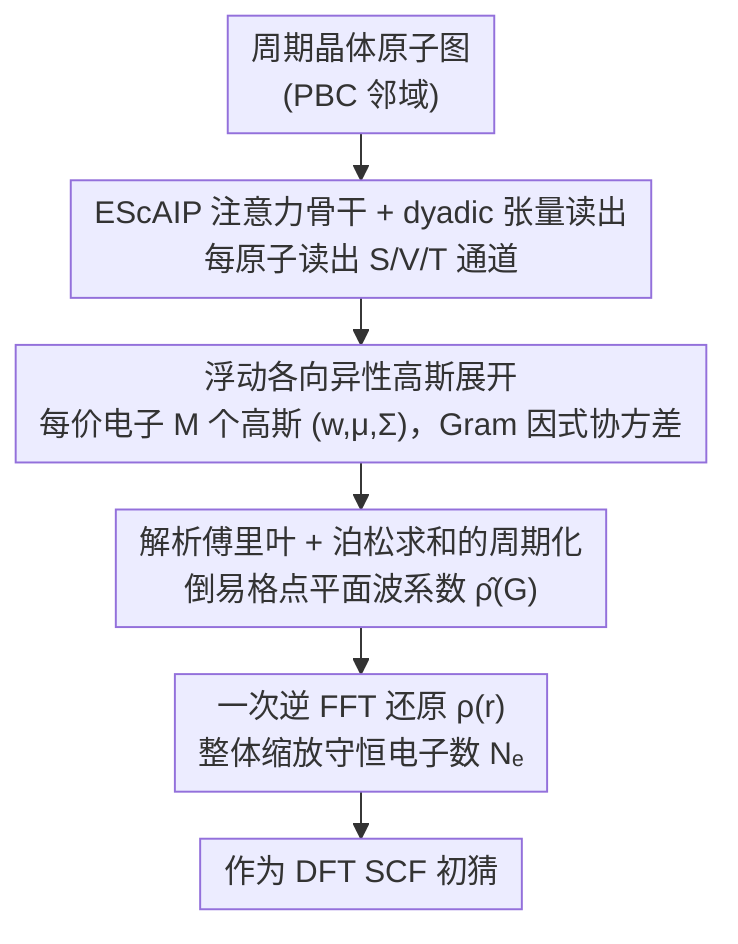

# Global Plane Waves from Local Gaussians: Periodic Charge Densities in a Blink

**会议**: ICML 2026  
**arXiv**: [2601.19966](https://arxiv.org/abs/2601.19966)  
**代码**: https://github.com/Jotels/ELECTRAFI (有)  
**领域**: 科学计算 / 机器学习+DFT / 电子结构  
**关键词**: 电荷密度预测, 平面波基组, 各向异性高斯, 泊松求和, DFT 初猜加速

## 一句话总结
ELECTRAFI 在实空间预测一组各向异性高斯的参数，再利用高斯的解析傅里叶变换 + 泊松求和公式，在倒易空间一次性算出周期晶体的电荷密度的平面波系数，做一次逆 FFT 就拿到全场密度；在 NMAE 与 ChargE3Net 持平甚至更优的同时，推理快 $463\times \sim 633\times$，把端到端 DFT 总时间真正降下来 $\sim 20\%$。

## 研究背景与动机

**领域现状**：Kohn–Sham DFT 是物理/化学/材料里最常用的电子结构方法，主流加速思路分两条：一是机器学习势 (MLIP) 直接预测能量/力，绕开 SCF 循环；二是保留 DFT 流程、用 ML 预测一个好的初始电荷密度 $\rho(\mathbf{r})$ 作为 SCF 起点，从而减少自洽迭代次数。后一条路线的好处是仍然由 DFT 收敛到目标泛函的严格自洽解。

**现有痛点**：周期体系的 ML 密度模型分两派——**轨道模型**用原子中心的球谐+径向基展开密度，对小分子很好但对金属/无机晶体所需的高 $l$、弥散基组爆炸；**probe 模型**（如 ChargE3Net、DeepDFT）把实空间网格点当作图节点跑 GNN，准确度强但每张图要查询 $10^7$ 量级网格点，单结构推理动辄 $30\sim80$ 秒，**省下的 SCF 时间会被推理时间反吃掉**，端到端反而变慢。

**核心矛盾**：周期性 + 长程库仑相互作用天然属于倒易空间，但已有模型要么在实空间做昂贵的周期镜像求和+球谐展开，要么直接用 NN 预测平面波系数（输出维度跟 FFT 网格走，scale 极差，仅作小补丁有效）。**准确度和推理成本必须联合优化**才能换来真实的 DFT 墙钟节省。

**本文目标**：构造一个 (1) 天然周期、(2) 与平面波 DFT 编码对齐、(3) 能解析处理长程结构、(4) 推理时间相对 DFT 可忽略的电荷密度模型，并且在真实 VASP 流水线里跑出**净时间节省**。

**切入角度**：高斯函数在傅里叶变换下保持高斯，且有闭式表达；同时**泊松求和公式**可以把"全空间高斯叠加"等价改写成"倒易格点上的傅里叶级数"。如果用一组浮动高斯做密度的局部展开，就能把"周期化"这一步整体让位给解析变换，不再做实空间镜像求和。

**核心 idea**：实空间预测局部各向异性高斯参数 $(w^{(j)},\boldsymbol{\mu}^{(j)},\boldsymbol{\Sigma}^{(j)})$ → 解析写出每个高斯在倒易格点 $\mathbf{G}$ 处的傅里叶系数 → 求和得 $\hat{\rho}(\mathbf{G})$ → 一次逆 FFT 还原周期实空间密度 $\rho(\mathbf{r})$。

## 方法详解

### 整体框架
ELECTRAFI 要解决的是"如何让 ML 预测的初始电荷密度天然满足晶体周期性，同时推理快到相对 DFT 可忽略"。它的做法是把任务一分为二：网络只在实空间预测一组局部各向异性高斯的参数 $(w^{(j)},\boldsymbol{\mu}^{(j)},\boldsymbol{\Sigma}^{(j)})$，而"周期化 + 长程结构"这件昂贵的事交给解析的傅里叶变换 + 泊松求和。具体流程是：周期晶体原子图喂进一个改造自 EScAIP 的注意力 GNN（按 PBC 邻域更新标量/向量/张量流），经 dyadic 邻域聚合给每个原子读出三类通道 $S\in\mathbb{R}^{N\times C}$、$V\in\mathbb{R}^{N\times C\times 3}$、$T\in\mathbb{R}^{N\times C\times 3\times 3}$；按"每价电子配 $M$ 个高斯"分配，原子 $a$ 拿 $n_a=Mv_a$ 个槽位、全结构共 $N_\mathcal{N}=M\sum_a v_a$ 个高斯；最后把这些高斯解析变换到倒易格点求和得 $\hat\rho(\mathbf{G})$，一次逆 FFT 还原 $\rho(\mathbf{r})$，并整体缩放使 $\int_\Omega\rho\,d\mathbf{r}=N_e$ 守恒电子数。下面三个关键设计按数据流自上而下排列——先看骨干怎么读出几何特征，再看高斯怎么表示密度，最后看解析变换怎么完成周期化。

### 关键设计

**1. EScAIP 注意力骨干 + dyadic 张量读出：用软等变换推理速度**

probe/orbital 模型推理慢的另一半原因出在骨干：严格 SO(3) 等变的高阶张量积（MACE / Equiformer 类的 irreps + Gaunt contractions）代价随 $L_{\max}$ 暴涨，在大晶胞上 cost-prohibitive。ELECTRAFI 干脆放弃硬等变，用多头注意力 + 前馈在标量流上堆容量；向量/张量头则对单位边方向 $\hat{\mathbf{e}}_{ij}$ 及其无迹 dyad $\hat{\mathbf{e}}_{ij}\hat{\mathbf{e}}_{ij}^\top$ 做注意力加权求和，造出与几何对齐的特征直接喂给 $(\boldsymbol{\mu},\boldsymbol{\Sigma},w)$ 预测头，复杂度只与边数线性相关、也不必显式枚举三元组（避开 DimeNet/GemNet 的角度基）。

把等变性这条几何归纳偏置交给数据补，看似冒险，实验却显示它够用：未增强训练时旋转测试 NMAE 从 1.35% 升到 1.69%，而加入随机旋转增强后回落到 1.33%，甚至略好于无旋转测试。算力被集中到注意力和 FFN 上，正是 ELECTRAFI 端到端能跑进 0.1 秒级别的关键之一。

**2. 浮动各向异性高斯展开 + Gram 因式协方差：用紧凑表示啃下弥散价电子密度**

无机晶体的价电子密度又胖又弥散，固定原子中心的 LCAO 表示要堆很多高 $l$ 的弥散基函数才能描述，效率低下。ELECTRAFI 让每个高斯虽挂在原子上、却能通过预测的位移 $\mathbf{d}^{(j)}$（中心 $\boldsymbol{\mu}^{(j)}=\mathbf{R}_{a(j)}+\mathbf{d}^{(j)}$）自由漂移到键中点或空隙位置；协方差写成 Gram 形式 $\boldsymbol{\Sigma}^{(j)}=\gamma^{(j)}\mathbf{A}^{(j)}\mathbf{A}^{(j)\top}$，天然对称正定且既能调朝向又能调形状；签名权重 $w^{(j)}=\tanh(\mathrm{MLP}(S^{(j)}))$ 可正可负，允许加减来刻画密度的精细结构，最后再全局乘一个标量把电子数拉回 $N_e$。

各向异性协方差直接削掉了对高阶球谐的依赖，参数量从 $O(L_{\max}^2)$ 退化到几个 $3\times3$ 张量，因此推理大幅加速、且对元素种类不敏感——这是它能在金属/无机晶体上既准又快的表示层根基。

**3. 解析傅里叶 + 泊松求和的周期化：把无穷镜像求和换成有限格点求和**

周期体系最大的钉子是怎样让密度场天然满足平移对称、又不付实空间镜像求和的代价。ELECTRAFI 引入一个辅助的非周期函数 $\tilde\rho(\mathbf{r})=\sum_j w^{(j)}\mathcal{N}(\mathbf{r};\boldsymbol{\mu}^{(j)},\boldsymbol{\Sigma}^{(j)})$，但它永远不在实空间显式求值——而是利用高斯的自互易性，每个分量在倒易格点 $\mathbf{G}$ 上都有闭式 $\hat{\mathcal{N}}(\mathbf{G})=\exp(-\tfrac{1}{2}\mathbf{G}^\top\boldsymbol{\Sigma}\mathbf{G})e^{-i\mathbf{G}\cdot\boldsymbol{\mu}}$，求和即得 $\hat\rho(\mathbf{G})=\sum_j w^{(j)}\exp(-\tfrac{1}{2}\mathbf{G}^\top\boldsymbol{\Sigma}^{(j)}\mathbf{G})e^{-i\mathbf{G}\cdot\boldsymbol{\mu}^{(j)}}$。再借泊松求和公式 $\sum_{\mathbf{R}\in\Lambda}\rho(\mathbf{r}+\mathbf{R})=\frac{1}{|\Omega|}\sum_{\mathbf{G}\in\Lambda^*}\hat\rho(\mathbf{G})e^{i\mathbf{G}\cdot\mathbf{r}}$，"全空间高斯叠加"就被等价改写成"倒易格点上的傅里叶级数"，周期化整步让位给解析变换。

这套构造之所以划算，是因为朴素镜像求和即便只取 $N=1$（27 个相邻原胞）也要付 27 倍代价、且仍不真正周期；而直接用 NN 预测 $\hat\rho(\mathbf{G})$ 又会让输出维度随 FFT 网格爆炸（GPWNO 等只能当小补丁）。截断倒易格点 $\Lambda^*$ 只带来低通滤波，而 DFT 密度本身就是低通，所以几乎无损；反观截断实空间 $\Lambda$ 会在原胞边界留下不连续。其结果是可学习量与分辨率彻底解耦——**网络规模与晶胞大小、平面波截断完全无关**，可以直接迁移到更大体系。

### 损失函数 / 训练策略
直接以 NMAE 作为训练目标（与既有密度模型评测约定一致）：$\mathcal{L}=\mathrm{NMAE}(\rho_{\mathrm{pred}},\rho_{\mathrm{ref}})=\frac{\int_\Omega|\rho_{\mathrm{ref}}-\rho_{\mathrm{pred}}|\,dV}{\int_\Omega\rho_{\mathrm{ref}}\,dV}$，其中分子是预测与参考密度的实空间绝对误差积分、分母是参考密度的总电子数，在每个结构的完整实空间网格上算（不做子采样），最终汇报 $\mathrm{NMAE}[\%]=100\times\mathrm{NMAE}$。MP-Full 训练集 117,876 结构，最大密度文件超 4GB、单材料最多输出 $1.57\times10^8$ 个浮点数；超参数 $M$（每价电子高斯数）按附录设置。

## 实验关键数据

### 主实验
所有测试在单张 A100-40GB；VASP DFT 跑在 24 核 Intel Xeon E5-2650（Broadwell）。

| 数据集 | 指标 | ELECTRAFI | ChargE3Net | DeepDFT / GPWNO / InfGCN |
|--------|------|-----------|-----------|---------------------------|
| MP-Full | NMAE [%] | **0.58** | 0.54 | 0.80 (DeepDFT) |
| MP-Full | $t_{\mathrm{inf}}$ [s] | **0.17** | 78.73 | — |
| MP-Full | Speedup | **463×** | — | — |
| GNoME | NMAE [%] | 0.93 | **0.69** | — |
| GNoME | $t_{\mathrm{inf}}$ [s] | **0.11** | 33.28 | — |
| GNoME | Speedup | **302×** | — | — |
| ECD-HSE06 | NMAE [%] | **1.35** | 1.53 | — |
| ECD-HSE06 | $t_{\mathrm{inf}}$ [s] | **0.05** | 31.65 | — |
| ECD-HSE06 | Speedup | **633×** | — | — |
| MP-Mixed | NMAE [%] | **1.24** | — | 11.50 / 4.83 / 5.11 |
| Cubic | NMAE [%] | **1.37** | — | 10.37 / 7.69 / 8.98 (SCDP 2.59) |

NMAE 上 ELECTRAFI 在 4/5 个 benchmark 拿到 SOTA 或并列；在 MP-Full / GNoME 比 ChargE3Net 略差 0.04 ~ 0.24 个百分点，但**推理快两到三个数量级**。

### 端到端 DFT 加速实验（重点）

| 数据集 | 方法 | NMAE | ML 推理时间 | SCF 步数 | DFT 时间 | **总时间** | 总时间节省 |
|--------|------|------|------------|---------|----------|----------|----------|
| MP | SAD (默认) | — | 0 | 16.80 | 266.34 s | 266.34 s | 0% |
| MP | SC (上限) | — | 0 | 8.73 | 161.98 s | 161.98 s | 39.18% |
| MP | **ELECTRAFI** | 0.55% | 0.17 s | 13.33 | 219.57 s | **219.74 s** | **+17.50%** |
| MP | ChargE3Net | 0.50% | 72.11 s | 12.09 | 208.26 s | 280.37 s | **−5.27%** |
| GNoME | SAD | — | 0 | 13.49 | 119.98 s | 119.98 s | 0% |
| GNoME | SC (上限) | — | 0 | 6.88 | 77.91 s | 77.91 s | 39.75% |
| GNoME | **ELECTRAFI** | 0.88% | 0.11 s | 10.11 | 95.06 s | **95.17 s** | **+20.68%** |
| GNoME | ChargE3Net | 0.59% | 28.29 s | 9.50 | 92.67 s | 120.96 s | **−0.82%** |

### 关键发现
- **推理时间不能忽略**：ChargE3Net 在 DFT 墙钟上确实比 ELECTRAFI 略快（SCF 步数也少一点），但把推理加回来后**净反慢 0.8%~5.3%**；ELECTRAFI 因为 inference 几乎免费，把 SCF 减少直接变成 17%~21% 的端到端节省。
- **结构级稳定性差距巨大**：ELECTRAFI 只在 13.4% (MP) / 7.2% (GNoME) 的结构上让总时间变长，ChargE3Net 在 84.3% / 74.6% 的结构上变长。
- **元素级互补**：错误分析（附录 F）显示 ELECTRAFI 在碱金属/碱土/卤素/重元素（Ac 等）上更准（更平滑、更弥散的密度），ChargE3Net 在轻共价元素和开壳过渡金属上更准（局域定向键合）；与各自表示的归纳偏置一致。
- **旋转鲁棒性**：架构不显式等变，未增强训练时旋转测试 NMAE 从 1.35% 升到 1.69%；加随机旋转增强后回到 1.33%（甚至略好于无旋转测试），说明软等变 + 注意力骨干可以靠数据学到等变性。
- **天花板分析**：用收敛态密度 (SC) 做初猜的上限是约 40% 总时间节省；ELECTRAFI 拿到了其中约 50%，说明 NMAE 改进还有空间但已经触及"SCF 收敛由长波长慢模式决定"的瓶颈，单纯优化 grid-level NMAE 收益边际递减。

## 亮点与洞察
- **"局部预测 + 全局解析变换"是个非常优雅的解耦**：把"网络该学什么"（局部、原子尺度的高斯参数）和"周期性 + 长程结构怎么处理"（解析傅里叶 + 泊松求和）彻底分开，网络输出维度与晶胞大小/FFT 截断完全无关，可以直接迁移到更大体系而不重训。
- **把"推理成本"提升为一等公民指标**：作者明确指出当前 charge density benchmark 只看 NMAE 或 SCF 步数都不够，端到端 DFT 墙钟才是终极指标——这是 ML for DFT 子领域一个真正重要的方法论转向。
- **可迁移 trick**：用浮动各向异性高斯 + Gram 因式 SPD 协方差代替球谐展开，这套表示在所有"用 3D 函数场近似物理量"的任务里都有用（电势、磁场、流场……）；解析傅里叶 + 泊松求和也可以直接搬到任何周期反演问题（MRI k-space、声学超表面、光子晶体）。
- **软等变 + 数据增强可行**：在大规模周期体系里，硬塞 SO(3) 等变可能不再划算，本文展示"快骨干 + 旋转增强"是一条可行的实用路线。

## 局限与展望
- **作者承认**：周期电荷密度的 NMAE 下限本身比分子体系高（MP/GNoME 上 0.6~0.9%，QM9 上能到 0.1% 量级），SCF 节省也只能拿到上限的 50% 左右；推测原因是 SCF 收敛由初猜在慢收敛长波长模式上的投影误差决定，单看全局 NMAE 找不准方向。
- **互补性未利用**：ELECTRAFI 强在弥散/离子键，ChargE3Net 强在局域定向键合，两者天然互补但还没有 hybrid 模型；可以尝试"全局 Fourier 表示 + 局部 real-space 修正"。
- **不支持磁体系**：当前模型只预测总价电子密度，没有 spin-resolved 输出，spin-polarized DFT（这类结构的初猜尤其昂贵）暂时享受不到加速；需要新的 spin-resolved benchmark。
- **数据集元数据不完整**：MP/ECD 都缺一些跑端到端 DFT 实验所需的输入信息（augmentation occupancies、PAW charges、SCF 设置），评测公允性受限；呼吁未来 benchmark 提供完整 DFT 输入文件。
- **个人补充**：评测全部在 PBE/HSE06 泛函上，对 meta-GGA 或者带强 Hubbard-U 的复杂磁性体系是否依然有 SCF 节省存疑；另外 $M$（每价电子高斯数）是个全局超参，对不同元素是否需要 element-aware 自适应也值得探究。

## 相关工作与启发
- **vs ChargE3Net (probe 模型, koker2024)**: 后者把网格点当 GNN 节点，每结构要查 $10^7$ 点，准确度强但推理 $30\sim80$ 秒；本文用局部高斯展开把推理压到 0.1 秒，单结构 NMAE 略差但端到端时间真正节省。
- **vs DeepDFT / GPWNO / InfGCN**: 这些模型在 MP-Mixed/Cubic 上 NMAE 在 4.8%~11% 区间，本文用同样训练集做到 1.24%/1.37%，差距大到不是同一量级，说明"浮动各向异性高斯 + 解析周期化"在材料体系比固定基/probe 都更高效。
- **vs ELECTRA (elsborg2025, 同一作者前作)**: 前作用浮动高斯做分子电子密度，本文把它从分子（非周期）推广到晶体（周期），核心新增就是用泊松求和做周期化。
- **vs Plane-Wave Add-on (kim2024gaussian)**: 前作把平面波算子当作 atom-centered 表示的小补丁，预测全局平面波系数效果有限；本文反过来"局部预测 + 解析得到全局平面波"，证明 reciprocal-space 才该是表示的中心而非附加项。
- **vs MACE/Equiformer/NequIP 等等变模型**: 严格 SO(3) 等变 + 高阶 irreps 在大晶胞上 cost-prohibitive，本文走"软等变 + 数据增强 + dyadic 张量构造"，准确度持平但推理快得多——给"大体系等变性该不该硬塞"提供了一个反例。

## 评分
- 新颖性: ⭐⭐⭐⭐⭐ "局部高斯 + 解析傅里叶 + 泊松求和"这套组合既物理直观又解决了 prior art 反复绕不开的实空间镜像求和痛点。
- 实验充分度: ⭐⭐⭐⭐⭐ 五个 benchmark + 真实 VASP 端到端测试 + 元素级错误分析 + 旋转鲁棒性消融，覆盖到位。
- 写作质量: ⭐⭐⭐⭐ Method 推导清晰，把"为什么不能直接镜像求和、为什么不能直接预测 $\hat\rho$"讲得很透；Related Work 部分对 orbital/probe/frequency-domain 三派的归类很有价值。
- 价值: ⭐⭐⭐⭐⭐ 第一个真正实现"ML 初猜 → 端到端 DFT 总时间下降"的周期密度模型，且代码开源；对 DFT 加速、材料发现、催化/电池模拟都有直接的落地意义。

<!-- RELATED:START -->

## 相关论文

- [\[CVPR 2025\] KVQ: Boosting Video Quality Assessment via Saliency-Guided Local Perception](../../CVPR2025/interpretability/kvq_boosting_video_quality_assessment_via_saliency-guided_local_perception.md)
- [\[AAAI 2026\] PragWorld: A Benchmark Evaluating LLMs' Local World Model under Minimal Linguistic Alterations and Conversational Dynamics](../../AAAI2026/interpretability/pragworld_a_benchmark_evaluating_llms_local_world_model_under_minimal_linguistic.md)
- [\[ICML 2026\] BLOCK-EM: Preventing Emergent Misalignment via Latent Blocking](block-em_preventing_emergent_misalignment_via_latent_blocking.md)
- [\[ICML 2026\] Courtroom Analogy: New Perspective on Uncertainty-Aware Classification](courtroom_analogy_new_perspective_on_uncertainty-aware_classification.md)
- [\[ICML 2026\] Verified SHAP: 神经网络精确 Shapley 值的可证明界](verified_shap_provable_bounds_for_exact_shapley_values_of_neural_networks.md)

<!-- RELATED:END -->
