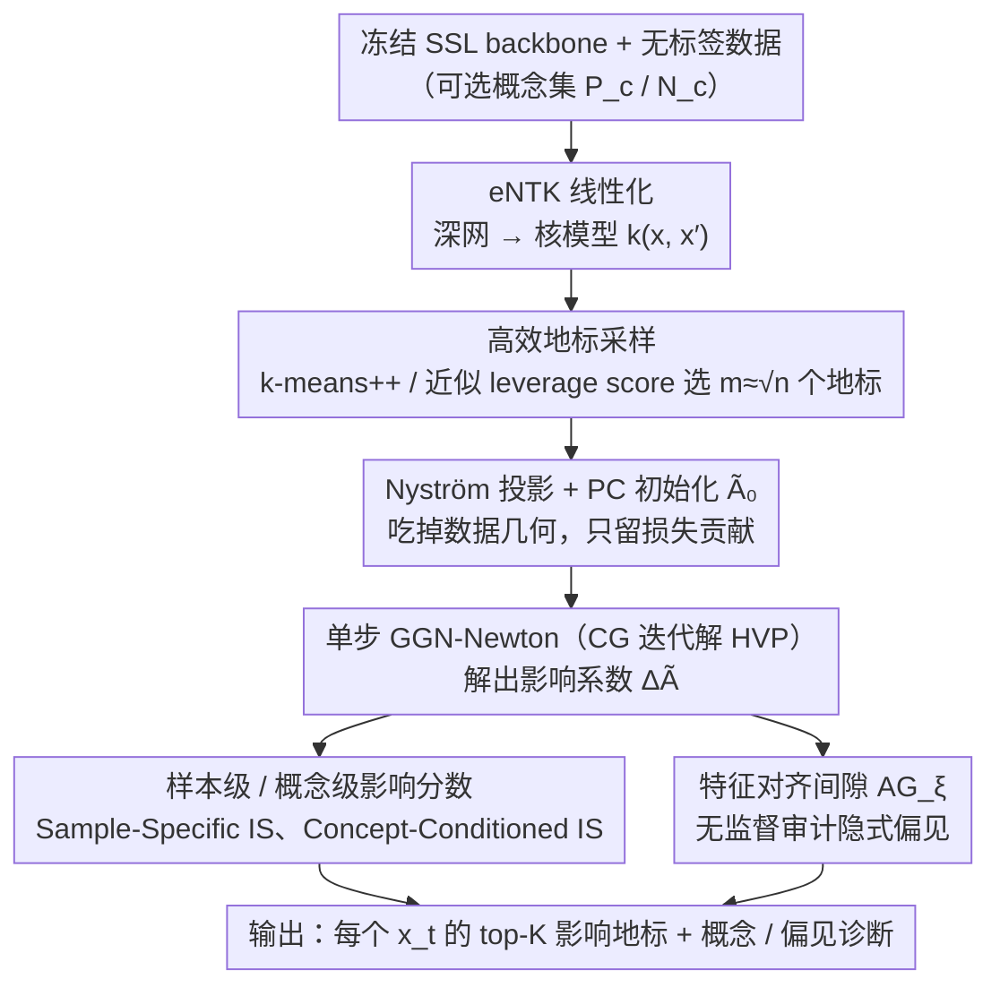

# Interpretable Self-Supervised Learning via Representer Landmarks and Nyström Approximation

**会议**: ICML 2026  
**arXiv**: [2509.24467](https://arxiv.org/abs/2509.24467)  
**代码**: 待确认  
**领域**: 可解释性 / 自监督学习  
**关键词**: 自监督学习, 可解释性, Representer Theorem, eNTK, Nyström 近似

## 一句话总结
KREPES 用 eNTK 把任意 SSL 模型近似成核模型，再借 Representer 定理把表征写成"地标样本"的核加权组合，用 Nyström + 单步 GGN-Newton 把 SimCLR/BYOL/VICReg/Barlow Twins 等非凸目标的影响系数解析地解出来，从而无监督地审计 SSL 隐空间并扩展到 1M+ 数据集。

## 研究背景与动机

**领域现状**：SimCLR、BYOL、VICReg、Barlow Twins 等 SSL 方法是当前从海量无标签数据学表征的主流，但训练出来的网络是黑盒；社区主要靠 saliency map、linear probe 这类 post-hoc 方法，或者用领域特定的可解释架构（视频姿态的几何瓶颈、单细胞转录组的原型解码）来做解释。

**现有痛点**：post-hoc 方法不能解释 SSL 表征"内部到底学了什么"；领域特定方案绑死任务、无法迁移；而真正"内禀可解释"的 Representer-Theorem 路线（Yeh 2018、Tsai 2023、Engel 2023）全部依赖监督信号——它们用标签梯度推出代表点的系数 $\alpha_i \propto \partial L/\partial f(x_i)$，离开标签就无定义。

**核心矛盾**：(i) SSL 没有标签和具体预测任务，feature-attribution 范式天然失效；(ii) 想用核方法做样本级解释，但标准核方法在 1M+ 样本上是 $O(n^2)$ 内存、$O(n^3)$ 时间，而既有的 Nyström/RFF 加速器（Rudi 2017、Della Vecchia 2024）只针对凸损失，处理不了 SimCLR/BYOL 这类非凸目标。

**本文目标**：构造一个统一框架，给任意 SSL 目标训出来的网络补上"内禀可解释性"——既能在样本级追溯"为什么 $x_t$ 被映到当前位置"，也能在概念级追问"哪些概念在驱动这个嵌入"，还要能扩展到 ImageNet-1K、Adult-1M 这种百万级数据。

**切入角度**：作者注意到 eNTK 可以把深网近似成一个线性核模型；而一旦线性化，Representer 定理就允许把学到的表征写成 $f(x_t) = \sum_l k(x_l, x_t) A_{l,:}$。剩下的问题是怎么在非凸 SSL 损失下解析地拿到系数 $A$，作者用 Generalized Gauss–Newton (GGN) 近似把损失局部凸化，再用 Nyström 把 RKHS 投影到 $m \ll n$ 个地标张成的有限维子空间。

**核心 idea**：把 SSL 网络压成 eNTK + Representer Theorem 形式，再用"PC 初始化 + 单步 GGN-Newton + CG 解 Hessian-Vector Product"在 Nyström 子空间里解析地拿到 dual 系数，使整个可解释性流程在 $O(n\sqrt{n})$ 时间内跑完。

## 方法详解

### 整体框架
KREPES 要解决的是"SSL 网络是黑盒，又没有标签可借力"这个矛盾：它不重训模型，而是在**冻结**的预训练 backbone 之上做一次训练后审计，把表征改写成一组"地标样本"的核加权组合，从而逐样本追溯"为什么 $x_t$ 被映到当前位置"。落地上分三段衔接：先用 eNTK 把深网在参数处一阶线性化成核模型 $k(x, x')$，再挑 $m \ll n$ 个地标做 Nyström 投影、从 PC 初始化出发跑一步 GGN-Newton 解出影响系数 $\Delta\tilde{A}$，最后用 $\Delta\tilde{A}$ 算出各类影响分数对隐空间做无监督诊断。输入是预训练 SSL backbone 加无标签数据 $\{x_i\}$（可选附带概念集 $\mathcal{P}_c, \mathcal{N}_c$），输出是每个测试样本 $x_t$ 的 top-K 影响地标和概念分数。

### 关键设计

**1. Representer + GGN 的无监督 SSL 影响函数：把表征拆成地标的可加贡献**

监督版 Representer 系数 $\alpha_i \propto \partial L/\partial f(x_i)$ 一旦离开标签就无定义，这正是 SSL 解释的死结。KREPES 的破法是：先靠 Representer 定理把线性化后的表征写成地标的核组合 $f(x_t) = \sum_l k(\tilde{x}_l, x_t) \tilde{A}_{l,:}$，于是地标 $\tilde{x}_l$ 经由参数 $\tilde{A}_{l,:}$ 对 $f(x_t)$ 的敏感度就是 $\nabla_{\tilde{A}_{l,:}} f(x_t) = k(\tilde{x}_l, x_t) I_h$；再把 SSL 损失关于全局 $\tilde{A}$ 在 $\tilde{A}_0$ 处做 Taylor 展开，并把非凸的 Hessian 换成 GGN 代理 $\bar{H}_{GN} = J^\top Q J + \lambda I$（它对任意 SSL 目标都局部 PSD），令 $\nabla_{\Delta\tilde{A}} \tilde{L} = 0$ 就解析地得到单步 Newton 解 $\mathrm{vec}(\Delta\tilde{A}) = -\bar{H}_{GN}^{-1} \mathrm{vec}(\nabla_{\tilde{A}} L(\tilde{A}_0))$，无需任何标签即可量化"训练目标对几何的因果影响"。有了 $\Delta\tilde{A}$ 就能定义两层指标：样本级的 Sample-Specific Influence Score $\mathrm{IS}(\tilde{x}_l, x_t) = \|\nabla_{\tilde{A}_{l,:}} f(x_t)\, \Delta\tilde{A}_{l,:}^\top\|_2$ 度量某地标对该样本表征的整体贡献强度；概念级则借 Kim 2018 的 CAV $v_c$（在正/负概念集 SSL 表征上学出的线性判别方向），把贡献投影上去得到 Concept-Conditioned Influence $\mathrm{IS}(\tilde{x}_l, x_t; v_c) = \langle \nabla_{\tilde{A}_{l,:}} f(x_t)\, \Delta\tilde{A}_{l,:}^\top, v_c\rangle$，正值意味着该地标把 $x_t$ 推向概念 $c$、负值意味着抑制。之所以能这样干净地解耦，是因为"数据本身的几何协方差"已经被下一条的 PC 初始化 $\tilde{A}_0$ 吃掉，留给 Newton 增量的只剩损失贡献。

**2. Nyström + PC 初始化 + GGN-HVP：让单步 Newton 跑到百万样本**

第 1 条的 Newton 步若直接在 RKHS 里搜参数会撞上 $O(n^2)$ 内存墙，且解出来的系数还会混入数据协方差。KREPES 用 Nyström 把函数类压成有限维 $f(x) = \sum_{i\in[m], j\in[p]} \tilde{\alpha}_i^j k(\tilde{x}_i^j, x) + \gamma$，对核做近似 $K_{nn} \approx K_{nm} K_{mm}^\dagger K_{mn}$ 并取截断特征分解 $K_{mm} \approx U_h \Lambda_h U_h^\top$，关键是把 Taylor 展开点钉死在 $\tilde{A}_0 = U_h \Lambda_h^{-1/2}$ 上——此时 $f(X) = K_{nm}\tilde{A}_0$ 恰好就是 Nyström 特征图，等价于先把 PCA 主成分当作先验，从而保证后续 Newton 增量 $\Delta\tilde{A}$ 只反映 SSL 目标的因果偏置而非数据流形几何。求解 $\Delta\tilde{A}$ 时也不显式形成 $O(m^3)$ 的稠密 Hessian，而是把 $\bar{H}_{GN}\Delta\tilde{A} = -\nabla_{\tilde{A}} L(\tilde{A}_0)$ 当作线性方程组、用共轭梯度（CG）迭代求解，每步只需一次 Hessian-Vector Product；针对不同 SSL 目标 HVP 都被解析推出，例如 Barlow Twins 写成残差 $r(\theta) = \mathrm{vec}(W \odot (C - I))$ 的非线性最小二乘，对应 $\mathrm{HVP}_{BT}(d) = 2\cdot\mathrm{vjp}(r, \theta, \mathrm{jvp}(r, \theta, d))$，SimCLR 写成行 softmax 交叉熵，对应 $\mathrm{HVP}_{SC}(d) = \mathrm{vjp}(f, \theta, p \odot u - p(p^\top u))$（$u = \mathrm{jvp}(f, \theta, d)$）。整条链路 batch-wise 累加期望，既不形成 dense 矩阵又保持解析单步，规避了非凸优化的不稳定，把复杂度从全核的 $O(n^2)$ 压到 $O(n\sqrt{n})$。

**3. 特征对齐间隙与高效地标采样：无监督查偏见 + 不漏关键方向**

在 Adult 这类表格场景里"特征本身"就是语义概念，无需额外训 CAV，KREPES 直接把特征当概念来审计隐式偏见。它先对特征 $\xi$ 定义样本间一致度 $v_\xi(x_t, x_l) = 1 - \min(|x_{t,\xi} - x_{l,\xi}|/\Delta\xi, 1)$，据此得到 Feature-Conditioned Influence $\mathrm{IS}(\tilde{x}_l, x_t; v_\xi) = \|\nabla_{\tilde{A}_{l,:}} f(x_t)\|_2 \cdot v_\xi(x_t, x_l)$，再聚合成 Feature Alignment Gap $\mathrm{AG}_\xi = \mathbb{E}_{x_t}[\Psi(x_t; v_\xi) - \Psi_{\mathcal{R}_{\mathrm{rand}}}(x_t; v_\xi)]$——即"按该特征对齐的地标贡献"相对随机地标的超额量，$\mathrm{AG}_\xi \gg 0$ 就说明 SSL 几何系统性放大了特征 $\xi$，这样无需标签也能查出 Adult-1M 上"模型偏好性别/家庭关系而非教育"这类算法偏见。另一头，Nyström 子空间的质量取决于地标选得好不好，KREPES 给两种互补策略：k-means++ 种子 $P(x_j) \propto \min_{c\in Z}\|x_j - c\|_2^2$ 保证几何上的均匀覆盖，近似 leverage score 采样 $P(x_j) \propto \hat{\ell}_j(\lambda)/\|\hat{\ell}\|_1$ 保证谱重要方向的覆盖，后者用 Hutchinson 估计器加 CG 求解 $(K + \lambda n I) z_k = \Pi_{:,k}$，避开 $O(n^3)$ 的精确求逆，让关键方向不被漏掉。

### 损失函数 / 训练策略
KREPES 本身不重新训 SSL：它在**冻结**的预训练 backbone 上加一层 eNTK 线性化 + Nyström 投影，再求解一次 GGN-Newton，整个流程是"训练后审计"，因此没有额外训练损失，关键超参只有地标数 $m = O(\sqrt{n})$、Tikhonov 正则 $\lambda$ 和投影维度 $h$。

## 实验关键数据

### 主实验

| 数据集 (规模) | SSL 目标 | KREPES Acc Gap $\Delta$ | Kendall-$\tau$ (NN vs KREPES) | Confidence Drop (random / KREPES) |
|--------|------|------|----------|------|
| Adult (1M) | BT / SimCLR / VICReg | +0.06 / +0.12 / +0.12 | 0.845 / 0.842 / 0.840 | .0002 / .0572 等 |
| Higgs (1M) | BT / SimCLR / VICReg | +0.03 / -0.10 / +0.25 | 0.781 / 0.778 / 0.783 | .0003 / .0461 等 |
| ImageNet (1.2M) | BT / SimCLR / VICReg | -0.24 / -0.39 / -0.31 | 0.801 / 0.797 / 0.790 | .0001 / .0583 等 |
| CoverType (1M) | BT / SimCLR / VICReg | -0.41 / +0.87 / +0.47 | 0.872 / 0.861 / 0.863 | .0003 / .0810 等 |
| CIFAR-10 (60k) | BT / SimCLR / VICReg | -0.92 / -0.38 / -1.10 | 0.878 / 0.881 / 0.880 | .0011 / .0667 等 |

eNTK + KREPES 与原 NN 准确率几乎打平（$|\Delta| < 1\%$），$\tau \geq 0.78$ 说明 decision boundary 几乎重合；删掉 KREPES 找出的 top-10 地标会让 k-NN ($k=50$) 置信度比随机删降低数百倍，验证地标确实是"因果支柱"而非几何巧合。

### 消融实验

| 配置 / 指标 | 数值 | 说明 |
|------|---------|------|
| CIFAR-10 Class Coverage $\kappa$ — Barlow Twins | 12 (Acc 91.18%) | 12 个 top-norm 地标即覆盖 10 类，地标和语义高度对齐 |
| CIFAR-10 $\kappa$ — VICReg / BYOL / SimCLR | 18 / 26 / 27 | $\kappa$ 越小下游 acc 越高，无监督地标质量预测准确率 |
| CIFAR-10 $\kappa$ — Spectral Contrastive | 81 (Acc 89.75%) | 谱对比覆盖最差，验证排序一致性 |
| Adult Precision@1 — KREPES vs cosine baseline | 0.872 vs 0.809 | KREPES top-1 地标与测试样本同类概率显著高于最近邻 |
| Cover Precision@1 — KREPES vs baseline | 0.772 vs 0.550 | 复杂表格上差距进一步拉到 22 个百分点 |
| Adult/Bank 时间复杂度 | $O(n\sqrt{n})$ vs Full Kernel $O(n^2)$ | log-log 图上斜率明显更平，且准确率与全核打平 |

### 关键发现
- **地标排序即下游能力代理**：CIFAR-10 上 Barlow Twins 的 $\kappa=12$ 同时对应最高线性探测精度（91.18%），说明"top-norm 地标覆盖多少类"这一无监督量本身就是 SSL 模型的质量信号，可以拿来选模型。
- **谱熵替代 linear probe 做超参选择**：在 MNIST + Barlow Twins 上扫 $\lambda$，$\tilde{A}^\top \tilde{A}$ 的归一化谱熵峰值与 10% 线性探测精度峰值对齐，给出一种 zero-label 调参方案。
- **隐式偏见可被无监督审计**：在 Adult-1M 上 Alignment Gap 显示 SSL 模型把 gender、relationship 等敏感属性放大到压倒 education/occupation 的地位；在 FairFace 上 KREPES 揭示东南亚人被东亚地标锚定（33%）、印度人被中东（23%）和拉丁裔（22%）地标锚定，远高于其本族（30%），证明 SSL pixel-space 增广会引入跨人群混淆。
- **排斥力可视化**：KREPES 同时建模正、负影响，红色"排斥地标"显示 SSL 把视觉相似但语义不同的样本（深色飞机 vs 鸟、白色汽车 vs 飞机机身、草丛中的棕色鸟 vs 鹿）显式推开，这是过去只看 attraction 的解释方法看不到的。

## 亮点与洞察
- **Representer + eNTK + GGN 的三段拼接**很巧妙：eNTK 把深网线性化打通核框架，Representer 给出"地标分解"形式，GGN 让非凸 SSL 目标退化成可单步求解的二次问题——三者缺一都做不到无监督闭式影响。
- **PC 初始化的几何意义**：把 Taylor 展开点钉死在 Nyström 主成分上，使后续 Newton 增量 $\Delta\tilde{A}$ 仅捕获 SSL 目标的"因果偏置"，等价于把表征改写成"数据先验 + 损失贡献"的可加分解，这种"先验/任务解耦"思路可以迁移到所有基于核近似的解释方法。
- **HVP-only 推断**：完全用 CG + jvp/vjp 算 Hessian-Vector Product，从不显式形成 Hessian，是把核方法做到 1M+ 数据的关键工程技巧，可复用于任何需要二阶信息的深度模型解析。

## 局限与展望
- 整个框架基于 **eNTK 线性化**，对深度非常深、非线性极强（如全局注意力、复杂归一化）的网络，eNTK 近似的保真度未必如表格/小模型上那么高；论文虽然给出 $\tau \geq 0.78$ 的一致性，但 ImageNet 上 $\Delta$ 已经达到 -0.39，说明确实存在系统性偏差。
- **单步 GGN-Newton**假设损失曲率被 PSD 代理良好刻画，对非常 plateau 或 saddle 严重的 SSL 损失（如某些训练早期或 collapse 边缘）可能给出不可靠的影响系数。
- **概念集需要人工提供**：Concept-Conditioned Influence Score 依赖于事先准备的正/负概念集 $\mathcal{P}_c, \mathcal{N}_c$，在没有概念库的开放域里仍需配合自动概念发现。
- 改进方向：(i) 把单步 Newton 换成几步迭代或 KFAC 块对角近似，提升大模型上的保真度；(ii) 把 Alignment Gap 推广到序列特征/多模态特征；(iii) 把"排斥地标"作为新的对比学习正则，反过来约束 SSL 训练的几何。

## 相关工作与启发
- **vs Yeh et al. 2018 / Tsai et al. 2023 / Engel et al. 2023 (kGLM)**: 他们用 Representer Theorem 解释**监督** DNN，系数靠标签梯度推；本文首次把 Representer 框架搬到 SSL，靠 GGN 把非凸目标局部凸化得到 $\Delta\tilde{A}$，无需标签。
- **vs Rudi et al. 2017 / Della Vecchia et al. 2024 (Nyström for KRR / convex loss)**: 他们的 Nyström 加速只支持凸损失（核岭回归、convex 损失家族）；本文把 Nyström 推广到 SimCLR、Barlow Twins、BYOL、VICReg 等非凸 SSL 目标，通过 GGN 代理把损失局部凸化后再做 Nyström 投影。
- **vs cosine-similarity / nearest-neighbor 解释 baseline**: 单纯几何邻近只反映表征空间的距离，不区分"因果驱动"和"伪相关"；KREPES 在 Adult/CoverType 上 Precision@1 高出 6–22 个百分点，且能识别出"排斥地标"，说明影响函数捕获的是因果而非相关。
- **vs Koh & Liang 2017 (Influence Function)**: 经典 IF 需要 Hessian 在最优点 PSD 且依赖标签，对深 SSL 不可行；本文用 eNTK 替代 Hessian、用 GGN 解决 PSD 要求、用 Representer Theorem 替代标签梯度，是把 IF 推广到 SSL 的系统性方案。

## 评分
- 新颖性: ⭐⭐⭐⭐⭐ 首次把 Representer Theorem 推到 SSL，eNTK + GGN + Nyström 的组合拼装非常完整。
- 实验充分度: ⭐⭐⭐⭐ 覆盖 1M+ 的图像和表格、4 种 SSL 目标，且同时验证准确率打平、地标因果性、bias 审计、label-free 调参，但没有 Transformer-scale 视觉模型。
- 写作质量: ⭐⭐⭐⭐ 公式记号严谨，三段框架图清晰；个别地方度量定义偏密集，初读需要回看 Sec.3。
- 价值: ⭐⭐⭐⭐⭐ 给 SSL 解释性提供了一条统一、可扩展、可审计偏见的实用路径，对负责任 AI 和无监督模型选择都有直接落地价值。

<!-- RELATED:START -->

## 相关论文

- [\[ICML 2026\] IdEst: Assessing Self-Supervised Learning Representations via Intrinsic Dimension](idest_assessing_self-supervised_learning_representations_via_intrinsic_dimension.md)
- [\[CVPR 2025\] Probing the Mid-Level Vision Capabilities of Self-Supervised Learning](../../CVPR2025/interpretability/probing_the_mid-level_vision_capabilities_of_self-supervised_learning.md)
- [\[ICCV 2025\] AIM: Amending Inherent Interpretability via Self-Supervised Masking](../../ICCV2025/interpretability/aim_amending_inherent_interpretability_via_self-supervised_masking.md)
- [\[NeurIPS 2025\] Dataset Distillation for Pre-Trained Self-Supervised Vision Models](../../NeurIPS2025/interpretability/dataset_distillation_for_pre-trained_self-supervised_vision_models.md)
- [\[ICML 2026\] MiniMax Learning of Interpretable Factored Stochastic Policies from Conjoint Data, with Uncertainty Quantification](minimax_learning_of_interpretable_factored_stochastic_policies_from_conjoint_dat.md)

<!-- RELATED:END -->
