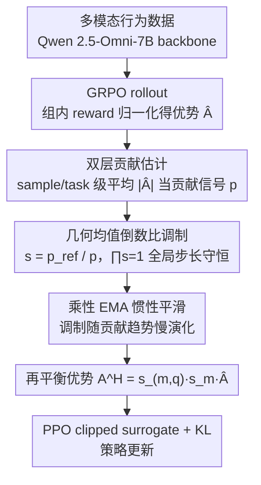

# OmniSapiens: A Foundation Model for Social Behavior Processing via Heterogeneity-Aware Relative Policy Optimization

**会议**: ICML 2026  
**arXiv**: [2602.10635](https://arxiv.org/abs/2602.10635)  
**代码**: https://github.com/MIT-MI/human_behavior_atlas  
**领域**: 人体理解 / 社会行为分析 / 多模态基础模型 / 推理式强化学习  
**关键词**: 社会智能, 行为基础模型, 异构 RL, GRPO 改进, 优势重加权

## 一句话总结
针对社会行为数据天然异构（10 个任务跨情感/认知/病理/社交，模态横跨语音/视觉/文本）导致 GRPO 类推理 RL 学习信号被少数任务主导的问题，本文提出 HARPO，通过用优势幅值近似各 sample 与各 task 对策略更新的贡献，再以"几何均值参照 + 倒数比"得到结构化调制因子并加上惯性平滑，在 Qwen 2.5-Omni-7B 上训出 OmniSapiens-7B 2.0，多任务平均排名第 1，零样本 5 任务全胜，推理一致性从 66.5% 提到 87.7%，token 数压到 19.86。

## 研究背景与动机

**领域现状**：社会智能 AI 需要同时读懂情感、心理状态、社交信号并能迁移到新场景。现有做法要么是单任务专家（情感分类、抑郁检测各做一个模型），要么是近年的统一行为基础模型（HumanOmniV2、OmniSapiens 系列）用 SFT 或 GRPO 做多任务 RL。

**现有痛点**：作者观察到，行为数据天然异构——SEN（句子级情感）和 PTSD（病理状态长视频）的 reward 分布尺度差几个数量级，模态构成也完全不同（一个是文本，一个是 audio+video+text）。直接套用 GRPO 后，少数任务/样本由于优势幅值系统性偏大，会主导整个策略梯度，导致 SAR、SEN 等任务的 F1 直接从 70+ 掉到个位数（见表 1 中 RE++ 的 SAR=5.01，GRPO 的 HUM=27.56）。

**核心矛盾**：GRPO 在组内做了 reward 归一化，但**跨组、跨任务之间没有任何尺度约束**——式 (4) 把所有 rollout 的梯度直接相加，谁的优势绝对值大谁就主导更新。当任务之间天然异构时，这种聚合就退化为"赢者通吃"的多任务学习失败模式。

**本文目标**：在 critic-free 的推理 RL 框架内，引入一个**显式的异构感知机制**，让 sample-level 与 task-level 的更新影响都被自动均衡，但又不破坏 GRPO 的整体训练范式与全局步长。

**切入角度**：作者注意到一个简洁的事实——由式 (5)，每条 rollout 对策略梯度的贡献正比于其优势绝对值 $|\hat{A}|$。因此**优势幅值本身就是"该样本/任务对更新的实际贡献"的可计算代理**，不需要额外训练 critic 或引入辅助网络，就能直接拿来做反向加权。

**核心 idea**：用"几何均值参照下的倒数比"作为调制因子去乘 GRPO 优势，把贡献大的 rollout 优势按比例压小、贡献小的按比例放大，并通过几何均值天生为 1 的性质保证全局步长不变。

## 方法详解

### 整体框架
OmniSapiens-7B 2.0 要解决的是多任务社会行为 RL 里"少数任务/样本因优势幅值偏大而主导整个策略梯度"的失衡问题。它以 Qwen 2.5-Omni-7B 为多模态 backbone，吃文本/图像/视频/音频混合的行为数据（Human Behavior Atlas 10 个任务、100k+ 样本，含 SEN/EMO/SOC/INT/NVC/HUM/SAR/ANX/DEP/PTSD），输出"推理链 + 预测标签/答案"的自回归序列。训练用 HARPO（Heterogeneity-Aware Relative Policy Optimization），整体沿用 GRPO 的 PPO clipped surrogate + KL 正则，唯一改动是在 actor 之外挂一个"调制器"：它按训练步 $t$ 在线估计每个 sample/task 的更新贡献，再把贡献转成调制因子去乘组归一化优势，把主导更新的 $\hat{A}_{(m,q,i)}$ 替换成再平衡后的 $A^H_{(m,q,i)}$。Reward 仍是三部分加权——任务奖励 $r_{task}$（分类 binary、QA cosine）、格式奖励 $r_{fmt}$（权重 0.2）、长度惩罚 $r_{len}$（系数 0.75）。调制器内部顺次做三件事——双层贡献估计、几何均值倒数比调制、乘性 EMA 惯性平滑——正好对应下面三个关键设计。

### 关键设计

**1. 贡献信号的双层估计：把"优势幅值"直接当作零成本贡献代理**

异构问题的根子是"谁影响大谁主导"，所以第一步得有个能直接量化"影响"的标量。HARPO 没有去训 critic 或估梯度，而是抓住式 (4)-(5) 的事实——每条 rollout 对策略梯度的贡献正比于其优势绝对值 $|\hat{A}|$，于是直接把组归一化优势的绝对值当贡献信号，既免训练又免额外前向，且与策略梯度的耦合关系数学上最直接。具体分两层：sample-level 信号取某样本 rollout group $G(m,q)$ 内的平均绝对优势 $p^{(t)}_{(m,q)} = \frac{1}{|G(m,q)|}\sum_i |\hat{A}^{(t)}_{(m,q,i)}|$，task-level 信号取该 task 当前 batch 全部 rollout 的平均绝对优势 $p^{(t)}_m$。两者都除以 rollout 数，是为了对随机 batch 采样保持不变。选优势幅值而非 reward 或 loss，正因为它与梯度的关系最紧、计算最便宜。

**2. 几何均值参照下的倒数比调制：局部重加权而全局步长守恒**

有了贡献信号，就要把它转成"不破坏全局更新规模"的调制因子，做"强者压、弱者升"的再平衡。HARPO 在 sample 层取 task 内所有样本贡献信号的几何均值 $\bar{p}^{(t)}_{ref,m}$ 作参照，在 task 层取所有 task 贡献信号的几何均值 $\bar{p}^{(t)}_{ref,M}$ 作参照，调制因子定义为参照与自身的倒数比 $s^{(t)}_{(m,q)} = \bar{p}^{(t)}_{ref,m}/p^{(t)}_{(m,q)}$ 与 $s^{(t)}_m = \bar{p}^{(t)}_{ref,M}/p^{(t)}_m$，最终把优势调成 $A^H_{(m,q,i)} = s^{(t)}_{(m,q)} \cdot s^{(t)}_m \cdot \hat{A}^{(t)}_{(m,q,i)}$——贡献超参照的因子 $<1$ 被压缩，低于参照的 $>1$ 被放大。这里坚持用几何均值而非算术均值有两层考虑：一是贡献信号在任务间常差几个数量级，几何平均能用乘性尺度温和处理这种 heavy-tail；二是更关键的不变量——几何均值天然让所有调制因子连乘为 1，即 $\prod_q s^{(t)}_{(m,q)} = 1$ 且 $\prod_m s^{(t)}_m = 1$，于是放大与压缩的乘性贡献严格互相抵消，整体更新步长不变，从根上避开了"调权重就要重调 lr"的经典坑。

**3. 惯性平滑：用乘性 EMA 让调制以更慢的时间尺度演化**

调制因子本质是"策略更新权重的权重"，如果它自己随 on-policy 单步噪声剧烈抖动，会把已经归一化过的优势又重新注入高方差，反而恶化学习。HARPO 因此让调制机制以比策略参数更慢的尺度演化：贡献信号先用普通 EMA 平滑 $\bar{p}^{(t)} = \beta_\rho \bar{p}^{(t-1)} + (1-\beta_\rho) p^{(t)}$；而调制因子由于是乘性比率，用乘性 EMA 而非加法 EMA $s^{(t)} = (s^{(t-1)})^{\beta_s}(s)^{1-\beta_s}$。这样调制只跟踪贡献信号的持续趋势、对单步扰动免疫，且乘性更新天然维持"几何均值 = 1"的不变量，与设计 2 的全局步长守恒完全相容。

### 损失函数 / 训练策略
HARPO 目标函数与 GRPO 完全同构，只把 clipped surrogate 里的 $\hat{A}$ 换为调制后的 $\tilde{A}^H_{(m,q,i):k}(\theta)$：$J_{HARPO}(\theta) = \mathbb{E}\big[\frac{1}{|G|}\sum_i \frac{1}{n_o}\sum_k \tilde{A}^H_{(m,q,i):k}(\theta)\big] - \beta \mathbb{E}[D_{KL}(\pi_\theta \| \pi_{ref})]$。训练数据为 Human Behavior Atlas（Ong et al., 2026）覆盖 10 个行为任务的多模态 RL 数据集，base 模型 Qwen 2.5-Omni-7B，统一 reward 设计，所有对比 RL 算法都在同一数据/同一 base 上跑以保证公平。

## 实验关键数据

### 主实验：10 任务多任务表现（节选自 Tab. 1）

| 模型 / 算法 | EMO | HUM | SAR | INT | DEP | 平均排名 ↓ |
|------|------|------|------|------|------|------|
| Qwen 2.5-Omni-7B (base) | 58.25 | 54.30 | 65.60 | 25.40 | 71.35 | 6.20 |
| HumanOmniV2-7B | 59.70 | 63.80 | 39.50 | 26.30 | 65.40 | 5.80 |
| OmniSapiens BAM | 64.53 | 64.40 | 79.50 | 17.70 | 78.85 | 3.30 |
| OmniSapiens-7B RL (GRPO) | 57.28 | 63.90 | 64.70 | 48.60 | 77.15 | 4.20 |
| **OmniSapiens-7B 2.0 (HARPO)** | **76.55** | **69.85** | 70.64 | **50.52** | **78.87** | **1.90** |

模型层面：在 10 个任务里 8 个 top-2，平均排名 1.90，是所有对比的最佳。

| RL 算法 (同 base / 同数据) | HUM | SAR | SEN | INT | 平均排名 ↓ |
|------|------|------|------|------|------|
| GRPO | 27.56 | 53.58 | 77.51 | 49.90 | 3.90 |
| RE++ | 60.26 | 50.21 | 56.52 | 5.01 | 4.50 |
| RLOO | 67.86 | 62.58 | 76.86 | 51.73 | 2.80 |
| GPG | 69.28 | 45.96 | 75.77 | 54.21 | 2.90 |
| EMAGRPO | 63.50 | 77.75 | 68.28 | 52.62 | 3.10 |
| **HARPO** | **69.85** | 70.64 | 77.61 | 50.52 | **2.10** |

算法层面：GRPO 在 HUM 上崩盘到 27.56，RE++ 在 SAR/INT 上崩盘到 5.01；HARPO 是唯一在所有 10 任务上都未崩盘的，相对 GRPO 最大提升 +42.29%（论文摘要）。

### 零样本泛化（Tab. 2）与推理质量（Tab. 3）

| 模型 | AUT | SER | IDR | SMSA | SIR | 一致性 ↑ | 平均 token ↓ |
|------|------|------|------|------|------|------|------|
| Qwen 2.5-Omni-7B | 25.68 | 53.53 | 70.25 | 44.64 | 34.99 | 34.0 | 73.66 |
| HumanOmniV2 | 38.05 | 62.74 | 21.97 | 53.06 | 37.45 | 50.0 | 195.90 |
| OmniSapiens-7B RL | 30.46 | 55.77 | 69.29 | 55.03 | 66.53 | 55.1 | 57.69 |
| **OmniSapiens 2.0** | **39.91** | **72.11** | **72.43** | **58.47** | **69.27** | **87.7** | **19.86** |

5 个 held-out 任务全胜，推理一致性从 66.5% 跳到 87.7%，平均 token 数压到 19.86（不到次优 OmniSapiens-7B RL 的 35%）。

### 关键发现
- HARPO 的胜负关键不在"平均更高"，而在"任务底线更稳"——GRPO/RE++/GPG 都会在某些任务上崩到个位数 F1，HARPO 是唯一全 10 任务都保持竞争力的算法，验证了"异构感知调制"对多任务 RL 学习均衡性的核心作用。
- 多任务训练得更均衡，零样本迁移就更强：OmniSapiens 2.0 与 OmniSapiens RL 用同一份数据、同一 backbone，仅 RL 算法换了，5 个 held-out 任务全部提升，作者据此推测"更均匀的多任务学习能促进更可迁移的行为表征"，这是个值得后续验证的因果链。
- 推理变得更短但更准：HARPO 让模型学到的推理链平均只有 19.86 token 却一致性最高（87.7%），人类评估在 specificity/coherence/concision 三个维度上 vs 4 个 baseline 平均胜率 68.5%/85.1%/99.2%，说明优势再平衡顺带抑制了"推理冗长但内容空泛"的退化模式。

## 亮点与洞察
- "用优势幅值自身当贡献信号"是个非常清爽的点子：不需要 critic、不需要梯度估计、不需要额外前向，从式 (4)-(5) 直接读出一个 zero-cost 的代理量，且与策略梯度的耦合在数学上严格对应。
- 几何均值参照 + 倒数比 + 乘性 EMA 这一套组合拳的妙处在于"全局步长守恒"——$\prod s = 1$ 这个不变量让 HARPO 可以放心地局部重加权而不污染全局学习率，避开了多任务 reweighting 经典的"调权重就要重调 lr"的坑。
- 这套方法可以**直接迁移到任何 GRPO 系 RL 训练**——只要训练数据天然存在任务/域/难度上的异构（数学+代码+对话混训、多语言混训、多模态混训），HARPO 的调制层就能即插即用，且与 RLOO/REINFORCE++/GPG 等不冲突，未来很可能成为推理 RL 的标配模块之一。

## 局限与展望
- 作者承认 HARPO 与零样本泛化提升之间的因果链只是经验观察，缺少更严格的理论或受控分析（"我们留给未来工作"）；目前只能说"更均衡 → 更迁移"是相关而非因果。
- 贡献信号用的是优势绝对值，对 reward 设计本身的依赖很强——如果 reward 高度噪声或某任务 reward 普遍非常小，几何均值参照可能数值不稳；论文用了 $\epsilon$ 平滑但未系统讨论失败边界。
- 实验全部限定在 Qwen 2.5-Omni-7B 一个 backbone、Human Behavior Atlas 一个数据集，HARPO 在更大模型（70B+）、不同 RL 数据（数学/代码 reasoning）上的尺度行为尚未验证；尤其几何均值在任务数 $|M|$ 很大时是否仍稳定值得测。
- 改进方向：可以把 HARPO 的双层调制扩展到"难度层"（按 reward 方差分桶）或"prompt 层"，做更细粒度的异构感知；也可以把贡献信号从"幅值"升级为"梯度范数"或"Fisher 信息"，与近期 RL 训练动力学研究结合。

## 相关工作与启发
- **vs GRPO (Shao et al., 2024)**：GRPO 只做了组内 reward 归一化（式 1），但跨组、跨任务没有任何尺度对齐，HARPO 正是在 GRPO 之上加了一层异构感知的优势调制，且 PPO 目标函数完全不动，是最小侵入性扩展。
- **vs EMAGRPO (Feng et al., 2025)**：EMAGRPO 也用 EMA 做多任务平衡，但作用在 reward 或 loss 层，HARPO 直接作用在优势层，且引入"几何均值参照 + 全局步长守恒"的结构化约束，避免了 EMA 类方法常见的步长漂移；表 1 算法对比里 HARPO 平均排名 2.10 优于 EMAGRPO 的 3.10。
- **vs 经典多任务 RL（gradient balancing / uncertainty weighting）**：这类方法（Yu et al. 2020; Kendall et al. 2018）依赖梯度反向估计或额外可学习权重，HARPO 走的是"零额外参数、零额外前向"的轻量路线，更契合 critic-free 推理 RL 的简洁性。
- **vs HumanOmniV2 / OmniSapiens RL**：同样是社会行为基础模型，OmniSapiens 2.0 在 backbone 与数据不变的前提下只换 RL 算法就拿到 10 任务全面优势 + 零样本 5 任务全胜，说明在统一行为模型领域，**RL 训练范式的瓶颈大于 backbone 与数据的瓶颈**。

## 评分
- 新颖性: ⭐⭐⭐⭐ 用"优势幅值即贡献"+"几何均值倒数比"做异构 RL 调制是清晰的新组合，单个组件不算全新但组合形成了完整闭环
- 实验充分度: ⭐⭐⭐⭐⭐ 同 base/同数据/同 reward 严格对比 6 种 RL 算法，10 训练任务 + 5 held-out 任务 + 推理一致性 + 人类评估，覆盖很扎实
- 写作质量: ⭐⭐⭐⭐ 数学推导清晰，把"全局步长守恒"作为核心不变量讲透了；但 HARPO 各超参（$\beta_s, \beta_\rho$）的敏感性分析在正文偏少
- 价值: ⭐⭐⭐⭐⭐ 既给出一个可直接复用的统一社会行为基础模型，又提出一个对所有 GRPO 系推理 RL 都即插即用的异构感知模块，应用面广

<!-- RELATED:START -->

## 相关论文

- [\[ICLR 2026\] Behavior Learning (BL): Learning Hierarchical Optimization Structures from Data](../../ICLR2026/interpretability/behavior_learning_bl_learning_hierarchical_optimization_structures_from_data.md)
- [\[ACL 2026\] Dual Alignment Between Language Model Layers and Human Sentence Processing](../../ACL2026/interpretability/dual_alignment_between_language_model_layers_and_human_sentence_processing.md)
- [\[ICML 2026\] Discovering Differences in Strategic Behavior Between Humans and LLMs](discovering_differences_in_strategic_behavior_between_humans_and_llms.md)
- [\[ICML 2026\] Is One Layer Enough? Understanding Inference Dynamics in Tabular Foundation Models](is_one_layer_enough_understanding_inference_dynamics_in_tabular_foundation_model.md)
- [\[ICML 2026\] Courtroom Analogy: New Perspective on Uncertainty-Aware Classification](courtroom_analogy_new_perspective_on_uncertainty-aware_classification.md)

<!-- RELATED:END -->
