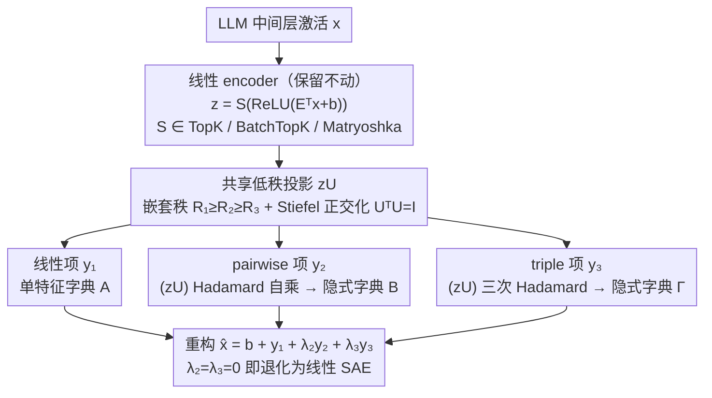

# PolySAE: Modeling Feature Interactions in Sparse Autoencoders via Polynomial Decoding

**会议**: ICML 2026  
**arXiv**: [2602.01322](https://arxiv.org/abs/2602.01322)  
**代码**: https://github.com/pakoromilas/PolySAE (有)  
**领域**: 可解释性 / 机理可解释性 / 稀疏字典学习  
**关键词**: 稀疏自编码器, 特征交互, 多项式解码, 低秩张量分解, 组合性

## 一句话总结
PolySAE 在标准稀疏自编码器（SAE）线性解码器之外，新增基于共享低秩投影的二阶/三阶多项式项，用极小参数代价（GPT-2 small 上 ~3%）显式建模稀疏特征之间的乘法交互，在 4 个 LLM × 3 种 SAE 变体上把探针 F1 平均提升约 8%、类条件分布的 Wasserstein 距离扩大 2–10 倍，并能用学到的交互方向因果引导模型输出对应的组合语义。

## 研究背景与动机

**领域现状**：稀疏自编码器是当前机理可解释性的主流工具。它把神经网络中间层激活 $x$ 解码成大量字典原子的稀疏线性组合 $\hat{x} = b + Dz$，TopK、BatchTopK、Matryoshka 等变体把字典规模推到了百万级特征，被广泛用来揭示 deception、bias 等安全相关概念并实现激活补丁式干预。

**现有痛点**：所有现有 SAE 都建立在"强线性表示假设"之上 —— 特征只能通过加法叠加贡献。这种结构原则上无法区分"组合"和"共现"：当模型输出"Starbucks"相关激活时，线性 SAE 要么得专门分配一个 monolithic 的 Starbucks 特征牺牲原子性，要么用 star 和 coffee 两个特征解释而无法把"星巴克这个特定组合"和"咖啡店里有颗星星"区分开。

**核心矛盾**：原子特征（morpheme、概念基元）和组合特征（"administrators" = stem ⊕ suffix、"kick the bucket"）天然存在层次关系，但线性重构机制把两者强行压到同一字典里。这违背了语言学和认知科学（Smolensky 1990 的张量积变量绑定理论）对组合性的核心要求 —— 用乘法/双线性绑定保持原子性的同时表达复合。

**本文目标**：在 SAE 框架里显式建模特征间的高阶交互，同时 (i) 保留线性 encoder 以维持可解释性，(ii) 避免 $O(d_\text{sae}^2)$/$O(d_\text{sae}^3)$ 的暴力张量积参数量，(iii) 与 TopK / BatchTopK / Matryoshka 等现有变体兼容。

**切入角度**：把解码器写成 $z$ 的三阶 Volterra 展开（或 Π-net 多项式参数化），并把所有高阶交互约束在一个共享的低秩子空间 $U$ 上 —— 不同阶之间的交互一定是"同一组方向"的不同次幂复合，既保证语义一致又控制参数量。

**核心 idea**：用"线性 encoder + 共享低秩 + 正交化多项式 decoder"代替"纯线性 decoder"，让 SAE 在不损失重构质量的前提下表达"乘法组合"。

## 方法详解

### 整体框架
PolySAE 要解决的是"线性 decoder 只能加法叠加、表达不了乘法组合"这件事，做法是把 SAE 的 encoder 原封不动留作线性，只把 decoder 从一阶线性升级成三阶多项式。具体地，输入是预训练 LLM 中间层激活 $x \in \mathbb{R}^d$，encoder 沿用标准 SAE 算出稀疏码 $z = S(\text{ReLU}(E^\top x + b_\text{enc}))$（$S$ 取 TopK / BatchTopK / Matryoshka 之一），而重构改写成 $\hat{x} = b_\text{dec} + y_1 + \lambda_2 y_2 + \lambda_3 y_3$，三项分别是线性项 $y_1 = A z$、pairwise 项 $y_2 = B (z \otimes z)$、triple 项 $y_3 = \Gamma (z \otimes z \otimes z)$，$\lambda_2, \lambda_3$ 是可学习标量。这个写法的妙处在于令 $\lambda_2 = \lambda_3 = 0$ 就严格退回线性 SAE，因此 PolySAE 是现有所有变体的真子集泛化，可以即插即用地挂到 TopK / BatchTopK / Matryoshka 上。真正的难点是朴素的 $B, \Gamma$ 分别要 $O(d_\text{sae}^2)$、$O(d_\text{sae}^3)$ 参数完全不可承受，所以全部高阶项都被约束到一个共享的低秩、正交子空间里，把暴力张量积压成紧凑形式。

### 关键设计

**1. 多项式 decoder + 共享低秩投影：用同一组方向的不同次幂表达高阶交互**

为了在不动线性 encoder 的前提下塞进二阶、三阶交互又不爆参数，PolySAE 先把稀疏码投影到一个 $d_\text{sae} \times R_1$ 的共享子空间 $U$，再在投影后的 $zU$ 上做 Hadamard 自乘逐级构造高阶项：$y_1 = (zU) C^{(1)\top}$、$y_2 = \big((zU_{:,1:R_2}) * (zU_{:,1:R_2})\big) C^{(2)\top}$、$y_3 = \big((zU_{:,1:R_3})^{*3}\big) C^{(3)\top}$，其中 $*$ 是 element-wise 乘、$C^{(k)} \in \mathbb{R}^{d \times R_k}$ 是输出投影。这等价于把 pairwise/triple 字典隐式定义为 $B = C^{(2)} (U_{:,1:R_2} \odot U_{:,1:R_2})^\top$、$\Gamma = C^{(3)} (U_{:,1:R_3} \odot U_{:,1:R_3} \odot U_{:,1:R_3})^\top$（$\odot$ 为 Khatri–Rao 积），代数上完全等价却永远不需要把那个庞大的张量显式 materialize。关键是只用单一 $U$ 而非每阶独立 projector，这就强制所有交互都是"同一组特征方向"的不同复合，保证了不同阶之间的语义一致与可解释性；而 rank $R_k$ 本身就是强归纳偏置——实证发现 $R_2 = R_3 \approx 0.06\text{–}0.11\, R_1$ 已经够用，说明高阶交互天然是低维的。

**2. 嵌套秩 + Stiefel 正交化约束：在低秩之上再压出可辨识的紧凑结构**

低秩之外，PolySAE 进一步施加 $R_1 \ge R_2 \ge R_3$ 的嵌套结构和 $U^\top U = I$ 的正交化来换取 parsimony 和 identifiability。具体取 $R_2 = R_3 = 64$（GPT-2 small 上 $R_1 = d = 768$），用 $U$ 的列子集 $U_{:,1:R_2}$ 构造高阶项，让子空间层层嵌套 $\text{span}(U_{:,1:R_3}) \subset \text{span}(U_{:,1:R_2}) \subset \text{span}(U)$，呼应"低阶应分到更高表达力"的多项式逼近理论，思路与字典学习里的 nested low-rank approximation 一脉相承。同时每步梯度更新后用 QR retraction（positive QR，矫正列号以保证连续性）把 $U$ 投回 Stiefel 流形，强制 $U^\top U = I$ 去掉旋转歧义、避免高阶交互方向冗余重叠。这一步并非锦上添花：消融表里去掉正交化后 F1 掉约 3pp，正是它在零参数代价下回填了 low-rank 造成的损失并反超。

**3. 上下文相关的隐式字典：让一个特征的贡献随谁同时激活而变**

前两步合起来的效果，是把"一个特征对重构的有效贡献"做成上下文相关——它会随当时还有哪些特征一起激活而改变，从而把组合性和原子性分开存储。把重构式展开看：线性项 $A$ 是单特征字典，pairwise 字典 $B$ 的第 $(i,j)$ 列描述 $z_i z_j$ 协激活时如何修正重构，triple 字典 $\Gamma$ 的 $(i,j,k)$ 列描述三者共激活的贡献。于是同一组 $d_\text{sae}$ 个原子特征就能撑起 $\binom{d_\text{sae}}{2} R_2 + \binom{d_\text{sae}}{3} R_3$ 量级的可表达组合，且全部组合都通过那 $R_2, R_3$ 个共享交互方向复用，正好吻合实证观察到的低维交互结构。对比之下标准 SAE 必须为每个复合概念新分配一个原子从而破坏组合性，而 PolySAE 允许 star × coffee → Starbucks 这样的"乘法绑定"却不增加字典大小；与此同时线性 encoder 被完整保留，每个 $z_i$ 仍是 $x$ 的一个清晰投影方向，可视化、聚类、激活补丁照常可用。

### 损失函数 / 训练策略
重构损失沿用 SAELens 默认的 MSE，sparsity 由 $S$ 算子（TopK/BatchTopK/Matryoshka）硬约束，$K = 64$、$d_\text{sae} = 16{,}384$。训练 500M tokens（GPT-2 Small 用 300M），上下文长度 128；GPT-2/Gemma 用 OpenWebText，Pythia 用去版权版 Pile。$U$ 的更新走 QR retraction，$\lambda_2, \lambda_3$ 随网络共同优化。

## 实验关键数据

### 主实验
评测覆盖 4 个 LLM × 3 个 sparsifier，共 12 组配置。在 SAEBench 上同时报 MSE、CE recovery、6 个探针任务（Bias in Bios、AG News、EuroParl、GitHub、Amazon Sentiment、Amazon-15）的 F1 以及类条件分布的 1-Wasserstein 距离（K=1）。

| 模型 | sparsifier | MSE (SAE→Poly) | CE Rec. | Mean F1 (SAE→Poly) | Wasserstein 提升 |
|------|------------|----------------|---------|--------------------|------------------|
| GPT-2 Small | TopK | 0.52 → 0.55 | 0.993 | 67.1 → 77.9 (+10.8) | ~2–4× |
| GPT-2 Small | BatchTopK | 0.53 → 0.54 | 0.993 | 65.7 → 78.0 (+12.3) | ~2–4× |
| GPT-2 Small | Matryoshka | 0.60 → 0.58 | 0.992 | 65.7 → 77.7 (+12.0) | ~2.4× |
| Pythia-410M | TopK | 0.03 → 0.04 | 0.971 | 71.2 → 77.0 (+5.8) | ~3–5× |
| Pythia-1.4B | TopK | 0.23 → 0.23 | 0.973 | 75.9 → 81.9 (+6.0) | ~4–5× |
| Gemma-2-2B | BatchTopK | 1.58 → 1.68 | 0.987 | 64.8 → 69.4 (+4.6) | ~5–10× |

12 个配置全部 CE recovery 偏移 < 0.003，证明 MSE 的微小差异没有引起功能性退化；探针 F1 平均提升 ~8%；类条件 Wasserstein 距离全面 2–10× 放大，说明 F1 提升不是 decision boundary 的偶然，而是几何上更分离的语义结构。

### 消融实验

| GPT-2 Small 配置 | 参数量 | MSE | F1 |
|------------------|--------|-----|----|
| Polynomial + 共享 projector（无低秩、无正交） | 37.7M | 0.58 | 76.0 |
| + 低秩分解（P3） | 13.3M | 0.53 | 75.0 |
| + 正交化（P4，即完整 PolySAE） | 13.3M | 0.55 | 77.9 |

低秩分解砍掉 65% 参数只损失 1pp F1；再加正交化在零参数代价下回填并反超 +2.9pp，说明 P3 负责 tractable、P4 负责 identifiability。

### 关键发现
- 学到的二阶交互强度 $B_{ij}$ 与共现频率 $N_{ij}$ 几乎不相关（$r = 0.06$），而 vanilla SAE 激活协方差与共现的相关性 $r = 0.82$ —— 多项式项捕捉的是组合结构，而非表面统计。
- 用 GPT-4o-mini 在 7 万对采样上打分，12% 的高交互对达到 0.9+ 的可解释性分数；GPT-2 small 上至少新增 8,550 个可解释的二阶组合概念。
- 在 27 个组合概念 × 12 中性 prompt = 324 对上做激活引导（把 $\alpha(d_i + d_j)$ 注入 layer 8 残差流），PolySAE 在 27/27 概念上优于无引导、21/27 优于 vanilla SAE，平均 target token rank 提升 +41.5；与 difference-in-means ground-truth direction 的余弦相似度 0.372 ± 0.093 vs vanilla 0.311 ± 0.158（相对 +19.7%）。
- 语义集中度：从 K=1 扩到 K=5 时 PolySAE 的 F1 增幅普遍小于 vanilla（GPT-2 上差 7–8pp），说明语义信号被压缩进更少的线性特征里，高阶交互吸收了上下文变异。

## 亮点与洞察
- **严格泛化的设计**：$\lambda_2 = \lambda_3 = 0$ 即退化为标准 SAE，使 PolySAE 能"无痛挂"到任何现有 SAE 变体上 —— 这是少数能"即插即用"地扩展 SAE 表达力的方法，落地友好。
- **共享 $U$ 的语义一致性**：所有阶都从同一 $zU$ 出发做 Hadamard 自乘，本质上把高阶交互的语义"锚"在线性特征上 —— 这一招也可以迁移到 bilinear MLP、polynomial network 等任何"想保留低阶可解释、又想加高阶表达"的场景。
- **r = 0.06 vs r = 0.82 的对比极有说服力**：作者用一个简单相关数清晰证伪了"高阶项只是 bigram 统计"的 null hypothesis，是非常优雅的可解释性诊断 —— 同样的相关性测试可用于审计任何号称"建模组合性"的方法。
- **从可解释性回到因果引导**：用 $d_i + d_j$ 注入残差流即可触发"Starbucks / Keystone XL"等组合输出，把字典学习闭环到 model steering，比纯静态可视化更有意义。

## 局限与展望
- 实验最大模型仅 Gemma-2-2B，未在 7B+ 主流开源 LLM 上验证；高阶项是否随模型 scale 进一步增益尚未知。
- 只评测了强制稀疏（TopK 系）变体，未覆盖 Gated / JumpReLU 等软稀疏 SAE。
- $\lambda_2, \lambda_3$ 是全局标量，未做每特征或每层的可调；不同层（attention vs residual）的交互结构差异未单独研究。
- 高阶 dictionary 的总评估只覆盖了 7 万对（约 24% 候选），可解释性比例 12% 是否会随 LLM 规模变化、能否自动筛出"值得人审"的子集，是后续问题。
- Steering 实验仅在 GPT-2 small 上做 27 个概念，组合概念的覆盖广度和负面 side-effect（是否扰动无关概念）有待量化。

## 相关工作与启发
- **vs Bilinear Autoencoder (BAE, Dooms & Gauderis 2025)**：BAE 在输入神经元层面做 pairwise 交互，PolySAE 直接在"已学到的稀疏特征"层面做 2 阶 + 3 阶交互，因此既保留 SAE latent 的可解释性，又显式分配容量给非加性组合。
- **vs Bilinear MLPs (Pearce et al. 2025)**：Pearce 用乘法实现 weight-based interpretability，作用于 MLP 内部；PolySAE 把同一思想搬到字典学习侧，与机理可解释性 pipeline（SAE → circuit）天然衔接。
- **vs Vanilla SAE + variants (TopK / BatchTopK / Matryoshka)**：所有这些都假设线性叠加；PolySAE 是它们的真子集泛化，可作为正交增益叠在任意一种上。
- **vs Tensor Product Variable Binding (Smolensky 1990)**：思想同源（用 multilinear 操作绑定 atom），但显式张量积对 $d_\text{sae} \sim 10^4$ 不可承受；PolySAE 的低秩 + 共享 $U$ 是把这套理论搬到现代 LLM 规模的工程化路径。
- **vs Π-nets / Volterra series**：从可解释性角度重新解释了多项式网络的归纳偏置 —— 不是"多项式更强"，而是"多项式自然给出原子-组合两层字典"。

## 评分
- 新颖性: ⭐⭐⭐⭐⭐ 第一个在 SAE 字典学习侧引入显式高阶交互、且严格退化为现有变体的工作，思路与 SAE 主流"加层数/加宽度"截然不同。
- 实验充分度: ⭐⭐⭐⭐ 4 LLM × 3 sparsifier × 6 探针任务 + 消融 + 共现相关性 + 激活引导，覆盖几何 / 探针 / 因果三层证据；唯一短板是模型规模止于 2B。
- 写作质量: ⭐⭐⭐⭐⭐ 4 条设计原则一一对应到架构选择，公式推导和"隐式字典"展开非常清晰，Starbucks 例子贯穿始终极易记。
- 价值: ⭐⭐⭐⭐⭐ 给整个 SAE 生态提供了一个可即插即用的正交增益，且把"组合性"这个语言学/认知科学的老命题以可量化的方式带回 LLM 可解释性议程。

<!-- RELATED:START -->

## 相关论文

- [\[ICML 2026\] On the Relationship Between Activation Outliers and Feature Death in Sparse Autoencoders](on_the_relationship_between_activation_outliers_and_feature_death_in_sparse_auto.md)
- [\[ICML 2026\] Sparse Autoencoders are Topic Models](sparse_autoencoders_are_topic_models.md)
- [\[AAAI 2026\] SparseRM: A Lightweight Preference Modeling with Sparse Autoencoder](../../AAAI2026/interpretability/sparserm_a_lightweight_preference_modeling_with_sparse_autoencoder.md)
- [\[ICLR 2026\] Toward Faithful Retrieval-Augmented Generation with Sparse Autoencoders](../../ICLR2026/interpretability/toward_faithful_retrieval-augmented_generation_with_sparse_autoencoders.md)
- [\[NeurIPS 2025\] A is for Absorption: Studying Feature Splitting and Absorption in Sparse Autoencoders](../../NeurIPS2025/interpretability/a_is_for_absorption_studying_feature_splitting_and_absorption_in_sparse_autoenco.md)

<!-- RELATED:END -->
