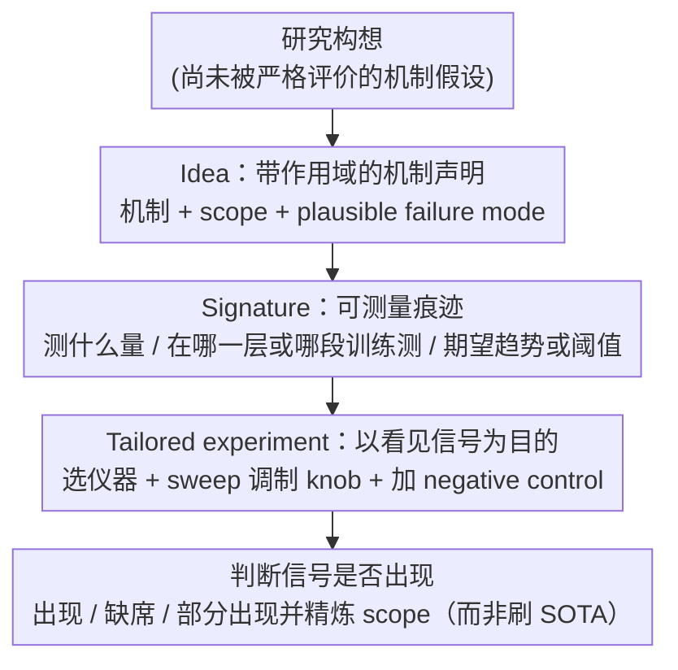

# Position: Ideas Should be the Center of Machine Learning Research

**会议**: ICML 2026  
**arXiv**: [2605.15253](https://arxiv.org/abs/2605.15253)  
**代码**: 无  
**领域**: 立场论文 / ML 研究方法论 / 科学哲学  
**关键词**: Ideas First, 信号 (signature), 定制化实验, 基准迷思, 计算公平  

## 一句话总结
作者提出"Ideas First"立场：把"想法 → 可观察信号 → 定制化实验"作为机器学习研究的核心评价单位，反对把刷榜数字或理想化定理本身当作目的，从而既弥合理论—实践鸿沟，又降低小算力研究者的参与门槛。

## 研究背景与动机

**领域现状**：当前 ML 研究分裂为两种主流模式 —— A 模式（Benchmark-driven Engineering）以单一指标定义贡献，靠扩大模型、改数据、调架构来刷榜；B 模式（Idealized Theory）在无限宽度、无穷小步长、可分数据等高度理想化设定下证明定理。两者都产出了真实进展（AlexNet/ResNet/CLIP/GPT-3 vs NTK/margin bound/benign overfitting），但都越来越成为"门槛"而非"工具"。

**现有痛点**：(1) **Benchmark myopia** —— 一个数字提升常常无法归因到机制，多个改动相互抵消时结论不可读；(2) **Transfer gap** —— 理想化定理几乎不给出可观察的预测，理论变成"事后解释"而非"事前测量指南"；(3) **Non-cumulative findings** —— 探索性消融不锚定假设，结果无法在后续工作中复用；(4) **Complexity premium** —— review 把"复杂 ≈ 严谨"，简单但锋利的想法反而被认为"不够深入"；(5) **Resource asymmetry** —— SOTA 隐含的算力门槛把没有大集群的研究者排除在外（"compute divide" / "Red AI"）。

**核心矛盾**：科学价值的真正载体是 *idea*（关于学习系统如何工作的假设），而当前体系把价值的代理（benchmark 分数 / 抽象定理）当作了价值本身，导致评审同时压制了"机制说明"和"边缘群体"。

**本文目标**：(i) 定义一个把抽象 idea 翻译成可证伪经验测量的框架；(ii) 论证以 idea 为中心的评价既科学也公平；(iii) 给作者和审稿人具体的"field guide"。

**切入角度**：借鉴物理学和生物学中的"假设驱动"范式 —— 不问 "what works?" 也不问 "what must be true under idealization?"，而是补上中间那个被忽视的问题："如果这个机制假设是对的，我们应该在真实模型上看到什么？"

**核心 idea**：把研究的中心从"系统/定理"换成"想法 → 信号 → 定制化实验"这条三段链 —— benchmark 和定理被降格为测试工具，而非评价目的。

## 方法详解

### 整体框架

这是一篇 position paper，作者的"方法"是提出一个以想法为中心的研究框架（Ideas First），并把它落到一条可操作的三段链上：$\text{idea} \rightarrow \text{signature} \rightarrow \text{tailored experiment}$ —— 从"假设"出发，先翻译成"在复杂模型中应该看到的可测量痕迹"，再设计专门用来寻找或证伪这个痕迹的实验。在这个视角下 benchmark 不再是"颁奖台"而是"显微镜"、定理不再是"判决书"而是"望远镜"，它们的合法性都来自能否帮某个 idea 暴露或被推翻。整条链的输入是一个尚未被严格评价的研究构想，中间产物是明确写出的可观察信号集合以及专门指向该信号的实验与控制，输出则是"信号是否出现"的清晰判断（出现、缺席、或部分出现并提示新的边界），而不是"我比 SOTA 高了 X%"。

### 关键设计

**1. Idea：带作用域的机制声明 (scope-bearing claim)**

这一步要把"模糊的直觉"凝练成一段可被未来证伪的科学陈述，明确"在什么设定下我相信这件事、在什么设定下我承认它可能失效"。作者要求一个合格的 idea 必须满足三条：用一两句话讲清楚机制 (mechanism)、给出 scope（架构、数据规模、训练阶段或理论假设的范围）、至少列一个 plausible failure mode；它通常先在简化设定（单层注意力 / 无限宽 / 合成数据）里成形，因为那里才能做受控分析，其价值在于概念性和预测性而非能直接打多少分，论文用 NTK、隐式 max-margin 偏置、Mixup 三个真实例子示范这种"声明 + 作用域"的写法。之所以强调 scope 和 failure mode，是因为当前评审常默认"没定理 = 没想法"或"没大模型 = 没想法"，作者认为这是把"载体"误当成了"内容"；自带作用域的写法能同时挡掉"slogan 式"的空想（论文 Avoid: *letting the idea be defined only via a specific experiment, benchmark gain, or theorem statement*）和"有高维定理却不知道它在真实模型里意味着什么"这两类问题。

**2. Signature：把抽象机制翻译成可测量痕迹**

在简化设定里成立的 idea 若要迁到现代复杂模型上还"算数"，必须先约定它会以什么形态出现 —— 几何特征、训练动力学趋势、因果响应、不变性、阈值或特征错误模式，signature 就是 idea 与实验之间的接口语言。一个好的 signature 要回答三件事：测什么量（margin 分布？某层余弦相似度？沿插值路径的 logit 曲线？）、在哪里测（哪一层 / 哪个训练阶段 / 哪段 scale）、期望看到什么趋势或阈值（通常单调？在某个宽度后趋势变弱？）。作者强调真实系统"嘈杂、异质"，因此 signature 须以"in expectation / 粗粒度趋势"评估、允许 bounded exception，判定标准是"预测的形状在合理聚合后可见"而非"每个点都符合"；Section 4 给出三例：NTK 的 signature 是早期训练的预测/损失轨迹在大宽度下贴合线性化模型，max-margin 的 signature 是训练误差归零后 penultimate-layer 归一化 margin 仍单调增长且方向对齐 SVM 解，Mixup 的 signature 是 logit 沿插值系数 $\lambda$ 近似线性、label noise 下记忆下降。设这道接口的意义在于：直接拿"better generalization"这种笼统口号衡量 idea 是没法证伪的，强制作者在写作阶段就把 idea 钉死成一个"要去看的形状"，既给后续实验靶子，也让别人能复现/挑战这个信号 —— 这正是把"探索性消融"转化为 hypothesis-driven test、解决 non-cumulative findings 的关键。

**3. Tailored experiment：以"看见信号"为目的的实验设计**

实验的成功标准被显式地从"刷点"换成"清晰看到（或在合适控制下确认缺席）那个预测好的 pattern"。作者给出一个五步流程：把 signature 定义成可分辨的统计量或可视化；选能暴露它的"仪器"（测量、修补 ablation、反事实）；把测量放在 idea 预测信号最强的位置（特定层 / 训练窗口 / scale 区段）；sweep idea 声称会调制信号的那个 knob，并加入 idea 声称"不会有效果"的 negative control；最后报告定性趋势、阈值以及用于精炼作用域的失败案例。论文第 6 节用"Topic Inertia in LLMs"做了一个 hypothetical case study —— 从单层 unified-KQ attention 的简化分析推出"prompt 越长，生成与 prompt 的语义相似度趋势上升"，再在 LLaMA-2 / GPT-NeoX-20B / MPT-7B 上沿 10–200 tokens 扫长度，并用 RNN 作 negative control（无 attention → 不应出现 signature），结果信号在所有 attention 模型上可见、在 RNN 上缺席；第 6.1 节还预演两类 reviewer 反驳并给出防御性回应：对"为什么不上 GPT-5.1 / LongBench？"答以"当信号在 200 tokens 已清晰可分辨时，放大实验只增加算力门槛而不增加机制洞察"，对"为什么趋势会抖动而非严格单调？"答以"把 signature 当成数学律是误解，真实数据有噪声，关键是 negative control 排除了通用 artifact"。这一步是整个框架对 complexity premium 和 resource asymmetry 最直接的回击：当评价标准换成"机制是否可见"，简单但锋利的实验就自动获得合法性，小模型 / 小数据 / 小算力的工作不再因"规模不够"被退稿，同时也鼓励作者主动报告失败与边界（refine scope），这正是 cumulative science 的基础。

作为配套，第 5 节"Field Guide"给出作者侧（Specifying the idea / Defining signatures / Designing tailored experiments）和审稿侧（Evaluating the idea / signatures / experiments）的"Aim / Avoid"对照清单：审稿人应判断 idea 的清晰度与作用域、signature 是否可测、实验是否对准 signature，而不是默认要求更大模型、更多 benchmark 或更全的定理。

## 实验关键数据

position paper 没有量化结果，但作者通过三类"案例 + 反案例"来支撑其框架的可操作性。下面用两个表格把这些证据组织起来。

### 主"实验"：现有研究是否能被 Ideas First 框架重述？

| 案例 | Idea（简化设定下） | Signature（在复杂模型应看到的） | Tailored Experiment | 来源 |
|------|-------------------|--------------------------------|---------------------|------|
| NTK 线性化训练 | 无限宽 + 平方损失下，GD ≡ 在初始化处冻结的 NTK 上做核回归 | 早期训练中，网络的预测/损失轨迹紧贴 NTK-at-init 线性化模型；随宽度增加贴合度提升，随训练推进失效 | 在 CIFAR 上对 CNN/ResNet/WRN 比较"全训练 vs 线性化预测"在不同宽度/epoch 下的对齐度 | Jacot+2018 / Lee+2019 |
| 隐式 max-margin 偏置 | 可分数据 + 指数尾损失下，GD 让权重方向收敛到 hard-margin SVM；同质网络类似 | 训练误差归零后，penultimate-layer 归一化 margin 继续单调上升，分类器方向对齐 SVM 解 | 在 MNIST/CIFAR 上用 MLP/CNN 跟踪 interpolation 之后的归一化 margin 与 SVM 对齐度 | Soudry+2018 / Lyu+Li 2020 |
| Mixup（启发式） | 简化设定下决策区域沿样本插值线段被"拉直"，logit 随混合系数平滑变化 | 沿路径 $x_\lambda = \lambda x_i + (1-\lambda) x_j$，logit 关于 $\lambda$ 近似线性；label noise 下记忆减弱、样本间梯度更平滑 | 在真实视觉/语音数据上扫 $\lambda$、加入 corrupted labels 做 stress test，报告 interpolation linearity + 抗记忆 | Zhang+2018 |

### "消融"：本框架解决了哪些标准模式的痛点？

| 标准模式痛点 | 标准模式症状 | Ideas First 的处置 | 在 case study 中的体现 |
|--------------|--------------|-------------------|------------------------|
| Benchmark myopia (Mode A) | 多改动同时进、单一数字无法归因 | 把评价基准从分数差换成"signature 是否可见 / 被证伪" | Topic Inertia 用相似度趋势做唯一主结果，不报 leaderboard |
| Transfer gap (Mode B) | 理想化定理给不出可测量预测 | 强制 idea 必须翻译成 signature 才进入实验 | 单层 unified-KQ attention 的结论被翻成"prompt 越长，相似度趋势↑" |
| Non-cumulative findings | 探索性消融不锚定假设 | 实验设计直接对准 signature + 必带 negative control | RNN baseline 充当无 attention 的 negative control |
| Complexity premium | "复杂 ≈ 严谨"的评审偏见 | 鼓励"最小但能呈现 signature"的实验 | 200 tokens 已足够分辨信号，不必追到 GPT-5.1 |
| Resource asymmetry | 算力门槛排除小团体 | 明确允许 modest scale 的清晰实验 | 全部用开源权重（LLaMA-2 / GPT-NeoX / MPT-7B） |

### 关键发现

- 框架的"可操作性"主要来自 **signature 是 idea 和 experiment 之间的强制性接口**：没有 signature 的 idea 落不到地，没有 signature 锚点的实验则退化为漫无目的的 ablation —— 作者反复强调"unit of explanation and value is signatures, not ranks"。
- Topic Inertia case study 的最大示范价值不在结果本身，而在 **6.1 节预演的两类反驳和回应** —— 它把"为什么不上更大模型 / 更全 metric"这种最常见的拒稿理由解释成 *complexity premium* 的具体表现，并给出"signature 在 200 tokens 已可分辨"和"signature 不是数学律"两条原则化反击。
- 三个 illustrative example（NTK / max-margin / Mixup）都已经是被广泛接受的工作，作者通过 *回溯性地* 把它们重写成 "idea → signature → tailored experiment" 的三段式，论证 Ideas First **不是激进新规范，而是把那些"好工作其实早就这么做"的范式显性化、可教授化**。
- 最值得注意的负面边界：框架对"signature 是否被无意识地调到符合预期"这一风险，给出的解药是 *negative controls + 预先声明的 scope/failure mode*；作者承认这比"严格 benchmark"更难标准化，是 Section 8 中明确列出的反驳意见之一。

## 亮点与洞察

- 把"signature"作为 idea 和 experiment 的强制接口，是这篇 position 最锋利的设计 —— 它一刀切掉了"空喊一个直觉就当成贡献"和"堆完一堆消融再回头编故事"两种通病，强迫研究者在写下假设的同时承诺"我准备让别人来看哪个量"。
- 把"complexity premium"和"resource asymmetry"明确写进认识论而非只写进伦理学，是非常有力的一招 —— 作者论证"小算力实验之所以正当，不是出于公平的让步，而是因为隔离机制时它本就更有证据力"，这让 frugal AI 从"道德口号"变成"方法学要求"。
- 第 6.1 节的"预演 reviewer 反驳 + 给出原则化回应"非常可复用 —— 任何想在小算力下做机制研究的作者都可以照着这个模板，把"为什么不上更大模型 / 为什么不刷更多 benchmark"的常见质疑提前内化成 scope 论证，而不是被动应付。

## 局限与展望

- 作者自承（Section 8）：(i) targeted experiment 比 broad benchmark 更易被"无意识 tuning"以符合预期，框架对此只能用 negative control 和 pre-registered scope 来缓解，缺乏制度化保障；(ii) 该立场不会取代理论或基准，只在"理想化定理"和"benchmark 驱动"之间补一个中间层；(iii) 在以工程为主导的 ML 子领域（如生产部署），"signature 是否可见"的判定标准可能让位于"系统是否好用"。
- 自己的补充：(i) Field Guide 里"Aim / Avoid"清单虽然清晰，但缺乏"signature 强弱"的量化或半结构化评估口径，落到具体审稿场景仍高度依赖审稿人个人判断，容易出现"以新瓶装旧酒"的现象；(ii) Topic Inertia 仅作为 *hypothetical* case study，没有真实的 200-doc 数据集和详细数值表，所以"框架可被照搬"的证据更多是修辞性的；(iii) 论文未讨论"signature 之间彼此竞争"时如何裁定 —— 当一个 idea 预测了多个 signature 且部分出现部分缺席，作用域是否就应该被改写？这个判定准则在框架里仍是空白。
- 具体改进思路：可以配套一份"signature card"模板（类似 model card / dataset datasheet），让作者结构化披露"测什么量、在哪测、期望趋势、negative control、已知失败 regime"，把当前"软性号召"变成"硬性披露"，从而把审稿不一致性显著压低。

## 相关工作与启发

- **vs Lipton & Steinhardt (2018) / Dehghani et al. (2021)（benchmark 批判流派）**：他们记录了 benchmark lottery、复杂度幻觉等问题，本文不止于"指出问题"，而是给出一个 *正向替代物*（idea → signature → tailored experiment）—— 这是本文相对该流派最大的区别。
- **vs Baraniuk et al. (2020) / Drori et al. (2022)（Science of Deep Learning 流派）**：他们主张用更严格的科学方法研究深度网络，本文在方法学上更进一步，把"science"具体落到了 signature 这个接口，并把"何为足够的实验"显式与 scope 绑定，避免该流派常被指责的"还是在玩 toy model"。
- **vs Strubell et al. (2019) / Ahmed & Wahed (2020)（Green AI / Compute Divide 流派）**：他们从伦理和环境角度反对 Red AI，本文进一步把"小算力实验"嵌入认识论，让 frugal AI 不仅"应当被允许"，更"在某些机制问题上是更优证据形式"。
- **启发**：(i) 写自己的论文时，可以在 Intro 末尾显式补一段 "signatures we will look for" 用以替代传统的 "contributions" 列表；(ii) 做 ablation 之前先问"这个 ablation 对应哪个 idea 的哪个 signature 的 negative control"，凡是答不上来的 ablation 都可以砍掉；(iii) 在 review 别人论文时，可把"作者是否声明了 scope 和 failure mode"作为第一道筛子。

## 评分
- 新颖性: ⭐⭐⭐⭐ 单看每个组件（批判 benchmark、提倡 hypothesis-driven、关注算力公平）都不新，但把"signature"作为接口语言并配上案例 + 防御性预演，是一次完整且有操作性的整合。
- 实验充分度: ⭐⭐⭐ 作为 position paper 已用三个真实历史案例（NTK/max-margin/Mixup）+ 一个 hypothetical case study（Topic Inertia）展示框架可落地，但缺真实的小规模复现数据让示范更硬。
- 写作质量: ⭐⭐⭐⭐⭐ 结构清晰（critique → framework → examples → field guide → case study → discussion → alternative views），把"Alternative Views"独立成节并诚实回应反方立场，对一篇立场论文是非常可贵的修辞自律。
- 价值: ⭐⭐⭐⭐ 对正在做小算力机制研究、被 review 反复以"规模不够"打回的研究者，本文几乎可以直接当作 rebuttal 模板；对资深 PI 和 program chair，则提供了一份可被引用的、把"frugal AI"嵌入审稿规范的具体路线图。

<!-- RELATED:START -->

## 相关论文

- [\[ICML 2026\] Position: Zeroth-Order Optimization in Deep Learning Is Underexplored, Not Underpowered](position_zeroth-order_optimization_in_deep_learning_is_underexplored_not_underpo.md)
- [\[ICLR 2026\] When Machine Learning Gets Personal: Evaluating Prediction and Explanation](../../ICLR2026/interpretability/when_machine_learning_gets_personal_evaluating_prediction_and_explanation.md)
- [\[ICML 2025\] Rethinking Explainable Machine Learning as Applied Statistics](../../ICML2025/interpretability/rethinking_explainable_machine_learning_as_applied_statistics.md)
- [\[ICML 2026\] Position: Let's Develop Data Probes to Fundamentally Understand How Data Affects LLM Performance](position_lets_develop_data_probes_to_fundamentally_understand_how_data_affects_l.md)
- [\[ICML 2026\] Learning Coherent Representations: A Topological Approach to Interpretability](learning_coherent_representations_a_topological_approach_to_interpretability.md)

<!-- RELATED:END -->
