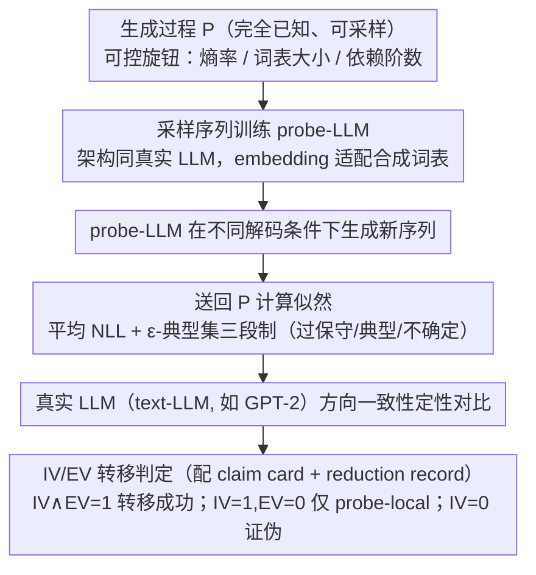

# Position: Let's Develop Data Probes to Fundamentally Understand How Data Affects LLM Performance

**会议**: ICML 2026  
**arXiv**: [2605.18801](https://arxiv.org/abs/2605.18801)  
**代码**: 无（position paper，仅给出 GPT-2 + Markov 链的示例性实验）  
**领域**: 可解释性 / LLM 数据科学 / 信息论分析  
**关键词**: 数据探针, 典型集, 马尔可夫链, 可证伪转移, 位置论文

## 一句话总结
作者主张：与其继续用大规模真实语料反复试错，不如设计一类"数据探针"——从**完全已知**的随机过程采样出的合成序列，用它们去训练/微调 LLM 并把模型生成结果**送回已知分布**做似然分析，从而把"哪种数据让模型学会什么"这个问题从经验启发式上升为可证伪的科学命题。

## 研究背景与动机

**领域现状**：当今 LLM 训练数据动辄数万亿 token，数据筛选、配比、curriculum 等环节都依赖大公司在真实语料上反复跑实验得到的经验启发式（如 DataComp-LM、FineWeb、DeepSeek 等的过滤管线）。

**现有痛点**：这类研究有三个硬伤——(1) 计算成本极高，只有少数大组织玩得起；(2) 真实语料的真实分布**未知**，因此无法计算任何序列的真实似然，也就无法判断模型生成是"过保守"还是"过发散"；(3) benchmark 评估只能告诉你模型行不行，回答不了**为什么**某类数据让模型表现好/坏。

**核心矛盾**：理论侧（Makkuva、Rajaraman 等用简化 Markov/Transformer 分析）和实践侧（在真实数据上调参）之间存在断层——理论结论太抽象套不到 LLM，实践结论太碎只能 case-by-case。两边都缺一个**统一的、可控的、可计算似然的实验介质**。

**本文目标**：提供一种方法论框架，使研究者能(a)精确控制数据分布属性（熵率、词表、依赖结构），(b)在已知分布下计算生成序列的似然，(c)把可证伪的"声明（claim）"从探针空间转移到真实 LLM 空间。

**切入角度**：与其想办法刻画真实数据，不如**反过来**——既然真实分布学不到，那就主动构造一个**完全已知**的分布，把它当作"参考系"。这一灵感可追溯到 Shannon 1948 年的论断："足够复杂的随机过程可以充分表示一个离散源"。

**核心 idea**：把**数据本身**当作一个有显式概率定义的形式对象——数据探针 $\Pi=(\mathcal{P},\mathcal{M},\mathcal{H},\mathcal{F})$（生成过程、度量、声明、证伪规则）——并配套一套 IV/EV 双层验证协议，让"数据 → LLM 行为"的研究像物理实验一样可控、可复现、可证伪。

## 方法详解

### 整体框架

这是一篇 position paper，主张把"数据"当作一个有显式概率定义的形式对象来研究——核心论证是：与其在分布未知的真实语料上反复试错，不如主动构造一个**完全已知**的生成过程当参考系，由它驱动整套"数据探针"方法论。具体 pipeline 分四步：先设计一个带理论解释的生成过程 $\mathcal{P}$ 及可控旋钮（熵率、词表大小、依赖阶数等），从中采样训练/测试序列去训练架构与真实 LLM 同款、仅把 embedding 适配到合成词表的 **probe-LLM**；再让 probe-LLM 在不同解码条件下生成新序列、**送回 $\mathcal{P}$ 计算似然**，对照可计算的诊断指标（平均 NLL、典型集归属）；最后在真实 LLM（text-LLM，如 GPT-2）上做方向一致性的定性对比。整条链路的输入是研究者预先声明的因果假设（claim card），输出是一张转移判定表：内部有效性 IV(h) × 外部有效性 EV(h)，两者皆为 1 才算"转移成功"，IV=1 且 EV=0 则结论只在探针空间局部成立，IV=0 则声明直接被证伪。

### 关键设计（核心论点）

**1. 数据探针应被形式化为带四条准入准则的元组：**

论文主张把"数据"从模糊的语料对象升级为一个可形式化的元组 $\Pi=(\mathcal{P},\mathcal{M},\mathcal{H},\mathcal{F})$，并强制研究者满足四条准则才算合格的探针：$\mathcal{P}$ 必须是完全已知且可采样的生成过程（C1）；$\mathcal{P}$ 上必须暴露可解释的干预旋钮，如熵率、词表大小、依赖阶数（C2）；所有诊断指标 $\mathcal{M}$ 必须可计算（C3，例如平均 NLL $-\log p(x^n)/n$ 正是因为 $p$ 已知才算得出）；每个声明 $h\in\mathcal{H}$ 必须配套预先声明的证伪条件 $\mathcal{F}$（C4）。论文还在 Table 3 用 C1–C4 把现有六类工作（数据多样性、数据筛选、迁移/ICL、鲁棒性、信息论、机制可解释性）逐一打分，指出每条线最缺哪条准则。之所以要立这份契约，是因为现有"用合成数据研究 LLM"的工作（如 Allen-Zhu 的 Physics of LLMs、Makkuva 的 Markov 分析）难以互相累积，根本原因就是缺少统一的"什么算合格探针"的标准——四条准则把这件事从"研究风格"变成了可审计的方法论。

**2. 最简探针可由熵率约束的 Markov 链 + 典型集来构造和解读：**

作为最简示例，论文把开放语料的诸多复杂性"还原"为一条带目标熵率 $H$ 的稳态 Markov 链。由于直接构造熵率恰为 $H$ 的链很困难，作者改用拒绝采样——随机生成大量转移矩阵，挑熵率最接近 $H$ 的那条作为 $\mathcal{P}$；采出的序列在线喂给 GPT-2 small（probe-LLM），其 embedding 层重塑到状态空间大小 $M=128$，训练侧沿用标准 next-token 交叉熵、测试集从同一条链独立采样以避免污染，因此数据可任意扩大规模而无需人工管理。理论侧借信息论中的 $\varepsilon$-典型集 $A_\varepsilon^{(n)}=\{x^n: H-\varepsilon\le -\log p(x^n)/n \le H+\varepsilon\}$ 给出三段制解读：平均 NLL 低于下界即"过保守"（重复退化），落在带内即"典型"，高于上界即"不确定"（脱离训练分布）。选 Markov 链是因为它熵率有解析表达、$p(x^n)$ 可逐 token 累乘算出、长度还能任意外推——这让作者得以验证一个非平凡现象：训练损失虽等价于 $T=1$ 采样，但当模型从 1 个起始 token 外推到 128 token 时，平均 NLL 分布整体偏离了 ground-truth Markov 链，正是"LLM 生成长内容时退化"在合成域的对应物。

**3. 跨越探针空间到真实空间必须走可证伪的 IV/EV 双层转移协议：**

论文坚持从"探针空间发现某现象"到"真实 LLM 上也成立"的跨越必须结构化、可证伪，而非叙事性类比。为此每张实验表都配一张 *Claim Card*，写明声明、干预、探针诊断、真实侧对应、预先声明的失败条件与当前转移状态；同时强制 **reduction record**——逐行列出"为得到这个探针，我从真实场景移除了什么因素、保留了哪些不变量、预期方向是什么、什么条件会推翻"。最终判定 $\mathrm{Accept}(h)=1 \iff \mathrm{IV}(h)=1 \land \mathrm{EV}(h)=1$，只有 IV=1 而 EV=0 时结论被显式标为"probe-local"。这正是把方法论从"我们用合成数据看到了 X"升级为"我们预先声明：若 X 不成立则证伪 Y"的关键；作者特别强调 bottom-up（从理论出发设计探针）和 top-down（从真实失败案例还原为探针）两条入口共用同一套协议，避免合成数据研究滑向"为合成而合成"。

## 实验关键数据

实验只是"概念验证"，目的不是刷点，而是展示方法论能否**复现**真实 LLM 已知的退化/不确定行为。

### 主实验：温度干预下的探针 vs 真实 LLM 行为对照

| 解码方式 | probe-LLM 平均 NLL | 探针侧诊断 | text-LLM (GPT-2) 真实文本行为 | 方向一致？ |
|---------|-------------------|------------|------------------------------|-----------|
| Greedy ($T{=}0$) | 0.694 | 过保守区（低于典型集下界） | 重复退化（"a new field of research that has been around for a while"循环） | 一致 |
| 采样 $T{=}1.0$ | 0.866 | 典型集内 | 通顺、与 prompt 相关 | 一致 |
| 采样 $T{=}1.3$ | 0.979 | 典型集内 | 略发散但仍可读 | 一致 |
| 采样 $T{=}1.5$ | 1.406 | 不确定区（高于典型集上界） | 脱离 prompt、信息无关 | 一致 |

> 解读：仅靠熵率 $H=1$ bit/token、词表 $M=128$ 的最简 Markov 探针 + GPT-2 small，就在探针侧**重现**了真实 LLM 在不同温度下的 over-conservative → typical → uncertain 三段式退化，并且 NLL 这一**可计算量**与真实侧的**质量描述**方向严格一致。

### 消融 / 分析：与现有研究的准则对照表

| 研究主题（代表工作） | C1 已知过程 | C2 可控旋钮 | C3 可计算诊断 | C4 预先证伪 | 探针方法的补位 |
|---------------------|------------|------------|--------------|------------|---------------|
| 数据多样性/充分性（Makkuva 2025, Rajaraman 2024） | ✓ | 部分 | ✓ | ✗ | 加干预对比网格 + 预先注册失败规则 |
| 数据筛选/curation（Wettig 2024, Penedo 2024） | ✗ | 部分 | ✓ | ✗ | 引入已知过程生成器 + 转移判定 |
| 迁移/ICL（Von Oswald 2023, Edelman 2024） | 部分 | ✓ | ✓ | ✗ | 把分布漂移映射到源过程假设 |
| 鲁棒性/对抗（Sainz 2023, Shu&Yu 2024） | ✗ | 部分 | ✓ | ✗ | 显式扰动强度 + 证伪阈值 |
| 信息论理解（Zekri 2024） | ✓ | 部分 | ✓ | ✗ | 标准化干预旋钮 |
| 机制可解释性（Singh 2024, Räuker 2023） | ✗ | 部分 | 部分 | ✗ | 已知结构家族 + 数据→机制的因果归因 |

### 关键发现
- **训练损失 = $T{=}1$ 采样**这件事**仅在单步上成立**：当让 probe-LLM 从 1 个 token 自回归生成 127 个 token 时，平均 NLL 分布显著**高于** Markov ground-truth（即生成的序列比真实分布更可预测），这正是"LLM 长序列生成不如人"的合成域对应物。这个发现的价值在于：在真实数据上你**永远无法**做出这种对比，因为真实分布不可计算。
- $T{=}1.25$ 时分布出现**双峰**——大部分序列比 ground-truth 更可预测，少部分异常高 NLL，恰对应"LLM 平时偏保守、偶尔幻觉"的实践经验。
- 典型集三段制（over-conservative / typical / uncertain）作为**可证伪诊断**比"重复退化"等描述性术语更可操作：你可以预先声明"温度升高应使 regime mass 从下界向上界单调迁移"，并明确写出反例条件。

## 亮点与洞察
- **把 reduction record 当一等公民**：要求每个探针实验都附一张"我从真实场景拿掉了什么、保留了什么"的表，这一招直接戳中合成数据研究的死穴——以往大家都默认"合成简化"的合理性，本文要求**逐项写下来并附上反例**。这个思路可迁移到任何"在简化模型上做研究"的领域（如 toy RL benchmark、小型扩散模型）。
- **NLL 之所以宝贵，是因为分布已知**：这是全文最容易被忽略的洞察——典型集分析在真实语料上做不了不是因为数学难，而是因为你**根本算不出** $p(x^n)$。让出表达力换来一个可计算的真实分布，是 position 的灵魂。
- **bottom-up 和 top-down 两条路径共用一套协议**这个设计很优雅，避免了合成数据研究典型的"我设计了一个 toy → 它表现出现象 X → 我宣称大模型也有 X"的滑坡。

## 局限与展望
- 作者自己承认 Markov 链只是入门级演示，远不能覆盖语义、语用、世界知识等真实语言的核心维度——这也是 Alternative Views 一节反驳的主要靶点。
- 当前示例的 EV（真实侧验证）只做了**定性**对齐，没有形式化的统计转移检验；论文把这条留作未来工作的开放问题。
- 词表大小仅 128、状态空间过小，与真实 LLM 50k+ 词表的尺度差距巨大；按方法论自身的标准，需要在 reduction record 中显式声明"假设词表尺度不影响典型集三段制"，但本文未做。
- 一个未明说的潜在风险：**预先注册证伪条件**虽然提升了方法论严谨度，但也可能反过来鼓励选择性报告——只挑那些 IV 容易过的声明去写 claim card。如何防止 p-hacking-on-probes 是后续要警惕的。
- 改进方向：作者列出了 PCFG 探针（层次化文法 + 可控树深/分支因子）、多语言/多模态探针、"创造性"探针（用另一个随机过程对基础探针做变换）等延伸——本质上是希望把当前的"一维熵率"扩展为"多维数据特性谱"。

## 相关工作与启发
- **vs Physics of LLMs（Allen-Zhu 等）**：两者都用合成数据研究 LLM，但 Physics of LLMs 的合成数据通常是**手工设计**针对特定问题（如知识存储、推理结构），缺乏统一的概率定义，难以做信息论分析；本文要求显式分布 + 可计算似然，理论钩子更深。
- **vs 简化 Transformer 理论分析（Makkuva 2025, Rajaraman 2024, Zekri 2024）**：这些工作给出了 Markov 数据下 Transformer 学习行为的渐近结果，但用的是**简化架构**且无 IV/EV 转移协议，结论难以挂回真实 LLM；本文用真实 GPT-2 + 转移判定补上了这个缺口。
- **vs 数据筛选实践（Wettig 2024, Penedo 2024 等 FineWeb 路线）**：实践派提供了"什么数据有用"的经验启发式，本文提供了**为什么**有用的可证伪框架——两者互补而非竞争。
- **vs 机制可解释性（Singh 2024, Räuker 2023）**：机制可解释性回答"模型内部怎么运算"，本文回答"什么数据导致这种运算被学到"；前者是模型侧的逆向工程，后者是数据侧的可控正向实验，组合起来可形成"数据特性 → 内部机制 → 外部行为"的完整因果链。
- **启发**：对自己的工作而言，凡是用 toy / 合成 setting 研究大模型现象的论文，都应当强制配 reduction record + 预先声明的证伪条件——这能显著降低读者对"toy 是否站得住"的质疑成本，也能帮自己看清结论的真实适用边界。

## 评分
- 新颖性: ⭐⭐⭐⭐ 把"数据探针"从零散实践提升为带四准则 + IV/EV 协议的方法论是真正的范式贡献，但单看技术元素（Markov 探针、典型集分析）多数都不是首次。
- 实验充分度: ⭐⭐⭐ 作为 position paper 只给出 GPT-2 small + 单条 Markov 链的演示，足以说明方法论可行但远谈不上充分；真正的实证负担留给了社区。
- 写作质量: ⭐⭐⭐⭐ 结构清晰、Claim Card 和 reduction record 的范例直接可被后续工作复用，Table 3 对现有研究的诊断尤其有价值。
- 价值: ⭐⭐⭐⭐ 如果社区真的接受 C1–C4 + IV/EV 协议，这套契约将显著提高"合成数据研究 LLM"赛道的可累积性；即便不全盘接受，reduction record 这条建议也值得任何做受控实验的研究者借鉴。

<!-- RELATED:START -->

## 相关论文

- [\[ICML 2026\] GEM: Geometric Entropy Mixing for Optimal LLM Data Curation](gem_geometric_entropy_mixing_for_optimal_llm_data_curation.md)
- [\[ICML 2026\] MiniMax Learning of Interpretable Factored Stochastic Policies from Conjoint Data, with Uncertainty Quantification](minimax_learning_of_interpretable_factored_stochastic_policies_from_conjoint_dat.md)
- [\[AAAI 2026\] Data Whitening Improves Sparse Autoencoder Learning](../../AAAI2026/interpretability/data_whitening_improves_sparse_autoencoder_learning.md)
- [\[ACL 2026\] The Impact of Off-Policy Training Data on Probe Generalisation](../../ACL2026/interpretability/the_impact_of_off-policy_training_data_on_probe_generalisation.md)
- [\[ACL 2026\] Evian: Towards Explainable Visual Instruction-tuning Data Auditing](../../ACL2026/interpretability/evian_towards_explainable_visual_instruction-tuning_data_auditing.md)

<!-- RELATED:END -->
