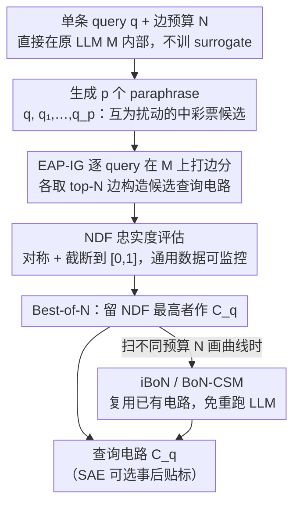

# Query Circuits: Explaining How Language Models Answer User Prompts

**会议**: ICML 2026  
**arXiv**: [2509.24808](https://arxiv.org/abs/2509.24808)  
**代码**: https://tony10101105.github.io/query-circuit/ (项目页)  
**领域**: 可解释性 / 机制可解释性 / 电路发现  
**关键词**: 查询电路, 机制可解释性, 电路发现, BoN 采样, 归一化偏差忠实度

## 一句话总结
本文提出 **查询电路 (query circuit) 发现** 任务——直接在原 LLM 内部追踪解释"模型为何对某个具体输入产生该输出"的稀疏子网络，并配套提出更稳健的忠实度指标 NDF 和 Best-of-N 采样算法，使得 MMLU 上仅占模型 1.3% 边的电路即可恢复约 60% 的单题行为。

## 研究背景与动机

**领域现状**：机制可解释性的主流路径是 **电路发现 (circuit discovery)**——把 Transformer 表示为节点（MLP / attention head）和边（residual rewrite）构成的有向图，找出实现某一能力的稀疏子图。代表工作包括 ACDC、EAP、EAP-IG 等，主要研究 IOI、greater-than 等"玩具"能力电路 ($C_c$)。

**现有痛点**：能力电路只解释"模型如何实现某类算法技能"（全局解释），无法回答"模型为何对这一条用户输入给出这个答案"（局部解释）。现有面向 instance 的方案如 Circuit Tracing 又必须依托 SAE / cross-layer transcoder (CLT) 等 **surrogate 模型**——而 surrogate 重构 LLM 激活并不忠实，训练代价昂贵，且 surrogate 上发现的电路是定义在 CLT 而非原模型上的，未必对应真实计算机制。

**核心矛盾**：忠实度（in-place 解释）与可分析性（稀疏性 / 可读性）之间存在张力——直接在 LLM 内部找单 query 电路时，能力电路那一套打分公式会同时遭遇 (1) 梯度噪声，(2) 忽略边之间的组合效应；常用评价指标 NFS 又在通用数据集（MMLU）上出现 $>1$ 或 $<0$ 的剧烈漂移，根本无法监控发现进度。

**本文目标**：(i) 形式化 in-place、instance-level 的 query circuit 发现任务；(ii) 设计在通用数据上稳定的电路忠实度评价指标；(iii) 设计能在单 query 上找到 *稀疏且忠实* 电路的发现算法。

**切入角度**：作者在 IOI 上观察到一个反直觉现象——原 query $q$ 上 EAP-IG 找不到忠实电路，但其 **paraphrase** 上找到的电路却能高度恢复 $q$ 的行为。这把电路发现重新诠释为 **"中彩票" (lottery ticket)** 问题：原 query 与若干改写得到的边打分矩阵 $\{S, S_1,\dots,S_p\}$ 互为扰动，其中某一张就是"winning ticket"。

**核心 idea**：用 **采样 + 选最优 (Best-of-N)** 在 paraphrase 集合里挑出最忠实的查询电路，并用对称、有界、对 $L(M(q'))\neq 0$ 不敏感的 **NDF** 替代 NFS 进行评估。

## 方法详解

### 整体框架

要解决的是"模型为何对 *这一条* 用户输入给出这个答案"——一个无需训练任何 surrogate、直接在原 LLM $M$ 内部追踪的 instance-level 电路发现问题。给定一条 query $q$ 和边预算 $N$，方法把它转成一个"中彩票"式的采样选优：先把 $q$ 连同它的若干改写各自打一遍边重要性分，各构造一张候选电路，再在 $M$ 上正向评估忠实度、留下最好的那一张作为 $q$ 的查询电路 $C_q$。整套流程的两块基础设施分别是稳定可监控的忠实度指标 NDF 和负责"采样选优"的 BoN 家族算法。

### 关键设计

**1. 查询电路任务：把 instance 解释从 surrogate 拉回原模型**

机制可解释性此前是二分的——能力电路（ACDC/EAP-IG）在数据集上平均归因后给出"模型如何实现某类技能"的全局解释，而面向单条输入的解释只能依托 SAE/CLT 这类 surrogate，但 surrogate 重构激活并不忠实、训练昂贵，且电路定义在 CLT 而非原模型上，未必对应真实计算。本文形式化的查询电路任务直接面向这道裂缝：对任意自然 query $q$ 和边预算 $N$，在原 LLM 的边集 $E$ 里找一个稀疏子集 $E_q \subset E$，使得只保留 $E_q$ 时模型在 *单条 query* 上的行为被最大程度恢复。与能力电路最本质的区别是 **不再跨样本平均**——边重要性按 IE 公式 $a_e = L(M(q\mid \mathrm{do}(e\leftarrow e'))) - L(M(q))$ 在单 query 上估计，其中 $q'$ 是删去 $q$ 关键事实/语言线索后的 corrupted query。整条电路始终定义在原 LLM 上，SAE 只在事后给节点贴自然语言标签、**不参与电路构造**，因此摆脱了对 surrogate 忠实性的前提依赖，让医疗、自动驾驶这类高风险场景里"该模型为何对这条输入这么答"第一次有了可审计的电路级回答。

**2. NDF 忠实度指标：把通用数据集上的电路评估做成能用的**

直接在原 query 上找电路时，常用的 NFS 指标会在 MMLU 这类通用数据上剧烈漂移——表 1 三条 Marketing 样本 NFS 给出 $2.15/1.32/-1.57$ 这种 $>1$ 或 $<0$ 的无法解读值，"边预算从小到大扫一条曲线"几乎不可能监控。NDF 用两点改造解决这个病：定义 $\mathrm{NDF}(C_q) = 1 - \min\!\big(\big|\tfrac{L(M(q)) - L(C_q(q))}{L(M(q)) - L(M(q'))}\big|, 1\big)$，把"电路输出相对 $M(q)$ 的偏离"用 $M$ 在原/腐败 query 间的性能差作归一化。其一是 **围绕 $L(M(q))$ 对称**，电路超出或不及 $M$ 都同等扣分，堵住 NFS 在 $C_q(q) > M(q)$ 时虚高到 $>1$ 的漏洞；其二是 **截断到 $[0,1]$**，避免 $M$ 自身性能差很小（$L(M(q))\approx L(M(q'))$）或 $L(M(q'))\neq 0$（如 MCQ 位置偏差）时 NFS 爆炸成 $\pm$ 几倍。它派生自 MIB benchmark 的 integrated circuit-model distance (CMD)，把"方法层面的累计距离"下放成"单电路层面的忠实度"。换上 NDF 后，前述三条样本读数变成可判读的 $0.00/0.68/0.00$，曲线随之变成单调可视化。

**3. Best-of-N 采样及其零开销加速变体：把"打分粗糙"问题换成"采样选优"**

作者在 IOI 上发现一个反直觉现象——原 query $q$ 上 EAP-IG 找不到忠实电路，但 $q$ 的 **paraphrase** 上找到的电路却能高度恢复 $q$ 的行为，于是把电路发现重诠释为"中彩票"：原 query 与改写得到的边打分矩阵 $\{S, S_1,\dots,S_p\}$ 互为扰动，其中某张是 winning ticket。**BoN** 据此把 $q$ 与 $p$ 个 paraphrase 各构造一张候选电路（实验 $p=9$），只保留 NDF 最高者作 $C_q$。为支持"不同 $N$ 扫一条 Pareto 曲线"而无需重跑 LLM，**iBoN** 在已有 $k$ 张 BoN 电路（按规模升序 $\{E_1,\dots,E_k\}$）上，对新预算 $N$ 取最近的较小电路 $E_i$、再从较大的 $E_j$ 补入未包含的高分边凑齐 $N$ 条；**BoN-CSM** 进一步维护一对得分/层级矩阵 $(S, T)$，按 $E_1,E_2,\dots$ 顺序记下每条边首次出现的得分与所属电路 index，构造新电路时先按 $T$（小电路的边优先）、再按 $S$（高分优先）选前 $N$ 条。这套设计之所以有效，是因为瓶颈根本不在单边 IE 的精度——直接对 $q$ 跑 EAP-IG 在 MMLU Astronomy 上要 $\sim 100\text{k}$ 边（25.9%）才超过随机基线，把 IG 步数 $m$ 提到 20、40 也救不回来，问题出在边之间的组合效应；而 BoN 把"达到 NDF$=0.6$ 所需边数"从 $\sim 200\text{k}$（51.7%）压到 $\sim 5\text{k}$（1.3%），iBoN/BoN-CSM 在显著加速的同时仍远胜 baseline，说明 paraphrase 采样确实捕到了共享的关键边而非巧合中奖。

> 所有边打分用 EAP-IG（$m=20$）的积分梯度近似 $a_e \approx (e - e')^\top \tfrac{1}{m}\sum_{k=1}^m \nabla_e M(z' + \tfrac{k}{m}(z-z'))$，构造电路用贪心选前 $N$ 大，全程不训练任何参数。

## 实验关键数据

### 主实验

目标 LLM：IOI 用 GPT-2 Small（32,491 边），其余任务用 Llama-3.2-1B-Instruct（386,713 边）。基线为 (i) 单 query EAP-IG，(ii) 原 query + paraphrase 上 $a_e$ 平均。指标为 NDF，在数据集上平均。

| 数据集 | 边预算 / 占比 | Single Query (EAP-IG) | BoN (本文) | 备注 |
|--------|--------------|----------------------|-----------|------|
| MMLU (Marketing/Astronomy 等 9 类平均) | 5k / 1.3% | ≪ 0.6 | ≈ 0.6 | 单 query 需 ~200k (51.7%) 边才能达到 0.6 |
| IOI | 1k / 3.1% | < 0.5 (per query) | 显著高于 baseline | 能力电路在同等预算 ≈ 0.65 |
| Arithmetic 加 / 乘、ARC Challenge | 多档 | 长期低于 BoN | 优于 baseline 一个量级的边效率 | iBoN / BoN-CSM 介于两者之间但远胜 baseline |

### 消融实验

| 配置 | 关键指标 | 说明 |
|------|---------|------|
| BoN, $p=9$ | 最高 NDF | 默认配置 |
| BoN, $p$ 从 1 增至 9 | NDF 单调上升、收益递减 | 图 7：paraphrase 越多越好但后续 paraphrase 多为冗余信息 |
| Averaging baseline | 不如 Single Query | 平均会压低"只对原 query 关键"的边 |
| iBoN | 略低于 BoN，远高于 baseline | 通过两条已有电路插值，无需额外 LLM 前向 |
| BoN-CSM | 略低于 BoN，远高于 baseline | 维护 $(S,T)$ 矩阵按"小电路优先 + 高分优先"重排 |
| 增大 IG 步数 $m$ | 无显著提升 | 验证瓶颈在组合效应而非单边 IE 精度 |
| Gender Bias 数据集 SAE 消融（32 样本，最佳 vs 最差电路） | Logit 绝对偏差降低：Best 0.810 ± 0.581，Worst 0.234 ± 0.278（$p<0.0001$，Rosenthal's $r=0.787$） | NDF 高的电路其 SAE 特征消融能更显著降低性别偏差，说明 NDF 真正反映"可操作的机制忠实度" |

### 关键发现

- **稀疏性 + 忠实度可以共存**：MMLU 上仅 1.3% 的边即可恢复 ~60% 单题行为，把现有"输入相关激活稀疏性"的发现推进到 *电路稀疏性*。
- **存在共享子电路**：IOI 上随机抽 query 的多个 BoN 候选电路与能力电路在 $N=500$ 时有 66 条公共边（图 8 UpSet plot），而单独依赖原 query 会漏掉 23 条关键边，反驳"BoN 是随机蒙对"的假设。
- **paraphrase 是 winning ticket 的来源**：原 query 上 EAP-IG 失败时，IOI 数据集的 paraphrase 几乎总能产生忠实电路，得分矩阵 $S_i$ 与 $S$ 共享粗模式但具体边排序差异巨大。
- **NDF 高的电路更可操作**：把 NDF 最高 vs 最低电路中的性别相关 SAE 特征置零，bias 降幅在 4 种 metric × scale 组合下均显著高于最差电路，效果量 $r \in [0.737, 0.836]$。

## 亮点与洞察

- **"中彩票"视角下的电路发现**：把"找忠实电路"从"打分要更准"重构为"打分本来就只能粗糙分关键/无关，应当多采样选最优"，跳出了"调 IG 步数 / 改 attribution 公式"的死路。
- **NDF 把通用数据集上的电路发现真正可监控**：之前 NFS 的不稳定让"边预算扫一遍画曲线"近乎不可能；对称 + 有界这两个看似简单的改造，把电路评估这条基础设施做到能用。
- **in-place 与 SAE 解耦**：电路本身只定义在原 LLM 边上，SAE 仅作可选的"事后语义贴标"；这意味着 surrogate 模型的可读性收益可以叠加，但 surrogate 训练失败 / 不忠实不会污染电路本身的解释力——这一拆分对部署阶段的可审计性意义很大。
- **可迁移的技巧**：BoN + paraphrase 这一范式可扩展到 attribution patching 之外的任何 attribution 噪声场景（如 vision model 的 input-dependent feature 分析），iBoN / BoN-CSM 的"已有电路重利用"机制本质是把电路发现 *缓存化*，对在线监控类应用尤其友好。

## 局限与展望

- **只测了小规模 LLM**：GPT-2 Small (124M) 与 Llama-3.2-1B-Instruct，未验证到 7B+ 量级；边数随模型规模二次/线性增长后，BoN 的 $p+1$ 次前向开销和电路评估的边遍历成本是否仍可承受需进一步实验。
- **依赖 paraphrase 质量**：MMLU/ARC 用 GPT-4o 改写，对题干较短或语义敏感（如逻辑题）的 query 可能产生语义漂移；IOI 直接用其他数据集样本作为 paraphrase 也是一种特定结构利用，不一定可推广。
- **解释力评估仍间接**：60% NDF 听起来还原度不低，但 NDF 量化的是"输出 logit 差异"层面的忠实度，与"是否符合人类对推理过程的预期"之间存在 gap；可操作性那一节虽然用 bias reduction 做了 proxy 验证，但仅限 50 → 32 个 Gender Bias 样本。
- **"corrupted query" 的构造仍需手工/经验**：附录 A 中不同题型有不同的 $q'$ 构造规则，缺乏统一原则，影响 IE 公式 (1) 在跨数据集上的可比性。
- **改进方向**：(i) 自动化 $q'$ 构造（如基于 token-level 因果干预）；(ii) 把 BoN 与 surrogate-based Circuit Tracing 互补结合——CLT 给细粒度表征，BoN 给 in-place 验证；(iii) 在 RAG / agent loop 等多步推理 query 上探索电路如何随时间演化。

## 相关工作与启发

- **vs ACDC / EAP / EAP-IG（能力电路）**: 它们在数据集 $D$ 上平均 IE 找 *全局* 算法电路（IOI、GT），本文不平均，专注 *单条 query*；本文借用 EAP-IG 做边打分，但把"如何选边"换成 BoN 采样，规避了单 query 上 IE 公式被梯度噪声 / 组合效应主导的问题。
- **vs Circuit Tracing (Ameisen et al., 2025)**: 都是 instance-level 解释，但 Circuit Tracing 的节点 / 边定义在 CLT 上，依赖 surrogate 忠实性；本文电路定义在原 LLM 上，SAE 可选不必须；两者互补——CLT 给细粒度可读性，query circuit 给可移植 + 真实性。
- **vs SAE / CLT 输入相关特征分析 (Chen et al., 2024; Ghandeharioun et al., 2024)**: 那些工作给 *特征* 层级的 input-dependent 解释，本文给 *电路结构* 层级的解释，并且把"输入相关稀疏性"从激活推广到电路边。
- **vs MIB benchmark (Mueller et al., 2025)**: MIB 提出 integrated CMD 评估发现方法整体，本文派生出 NDF 评估单电路忠实度，两者在尺度上互补。
- **启发**: "把电路发现看成中彩票 → 采样 paraphrase 选最优"这一思路可迁移到任何 attribution 不稳定的可解释性任务，比如 vision 模型中 query-dependent 的 channel 重要性、agent loop 中 step-level 的关键 token 检索，等等。

## 评分
- 新颖性: ⭐⭐⭐⭐☆ 把 instance-level 电路从 surrogate 拉回原 LLM，并用 BoN + paraphrase 这一极简手段绕开 attribution patching 的根本噪声，思路清晰且填补 in-place instance 电路这一空白。
- 实验充分度: ⭐⭐⭐⭐☆ IOI / 加 / 乘 / MMLU 9 类 / ARC + paraphrase 数 / IG step / Gender Bias SAE 消融配置较完整；不足在仅测到 1B 规模、paraphrase 数量上限 9。
- 写作质量: ⭐⭐⭐⭐⭐ 概念定义、动机推导（lottery ticket 隐喻）、challenge → solution 的逻辑链非常清楚，图 1 / 图 5 / 图 8 都精准对应论点。
- 价值: ⭐⭐⭐⭐☆ NDF 作为通用数据集电路评估的基础设施可被广泛复用；BoN 的"采样 + 选最优"思路是可解释性社区随手即用的工具。

<!-- RELATED:START -->

## 相关论文

- [\[ICML 2026\] Circuit Fingerprints: How Answer Tokens Encode Their Geometrical Path](circuit_fingerprints_how_answer_tokens_encode_their_geometrical_path.md)
- [\[ICML 2026\] How Language Models Process Negation](how_language_models_process_negation.md)
- [\[ICML 2026\] Certified Circuits: Stability Guarantees for Mechanistic Circuits](certified_circuits_stability_guarantees_for_mechanistic_circuits.md)
- [\[ICLR 2026\] Provably Explaining Neural Additive Models](../../ICLR2026/interpretability/provably_explaining_neural_additive_models.md)
- [\[ACL 2025\] Reasoning Circuits in Language Models: A Mechanistic Interpretation of Syllogistic Inference](../../ACL2025/interpretability/reasoning_circuits_in_language_models_a_mechanistic_interpretation_of_syllogisti.md)

<!-- RELATED:END -->
