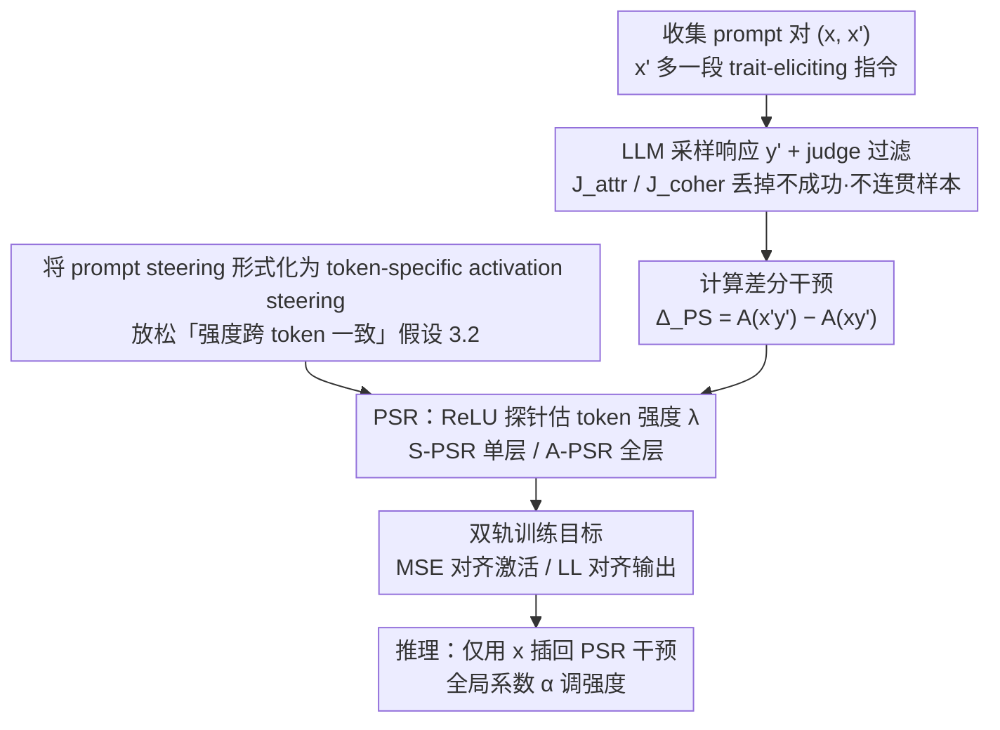

# Steer Like the LLM: Activation Steering that Mimics Prompting

**会议**: ICML 2026  
**arXiv**: [2605.03907](https://arxiv.org/abs/2605.03907)  
**代码**: <https://github.com/Nokia-Bell-Labs/steer-like-the-llm>  
**领域**: 机制可解释性 / LLM 对齐 / 激活引导  
**关键词**: activation steering, prompt steering, token-specific 系数, ReLU probe, PSR

## 一句话总结
本文把 "prompt steering"重新解释为 LLM 自己实现的一种 activation steering, 然后用一个**逐 token 的 ReLU 探针**来蒸馏 prompt 注入的激活差, 训练出 PSR (Prompt Steering Replacement) 模块, 既能在三个 steering 基准上超过现有激活引导方法 (CAA, ReFT-R1, Stolfo 等), 又在 AxBench 与人格引导上和 prompting 打成平甚至反超。

## 研究背景与动机

**领域现状**: 控制 LLM 行为有两条主路: (1) prompting / in-context examples; (2) activation steering——在某一层残差流上加一个固定向量 $\alpha\mathbf z_{attr}$。后者有 "轻量、对 prompt injection 鲁棒、可解释"的吸引力, 是 mech-interp 圈的明星方向。

**现有痛点**: 即便有 ActAdd, CAA, ITI, ReFT-R1 这一长串方法, 激活引导**仍然系统性弱于 prompting** (Wu 等多次复测); 论文给的两张图更直接——把 prompt 注入造成的真实激活差 $\Delta_{PS}$ 画出来, 会发现它**在不同 token 上强度差几个数量级**: 某些 token 几乎不动, 某些 token 被狠狠改写。而所有主流激活引导方法要么用同一个常向量打所有 token, 要么只在最后一个 token 打, 这与 LLM 自己实现的 steering 机制 (即 prompting) 完全不像。

**核心矛盾**: "想用一个常量 $\alpha\mathbf z$ 复制 prompting 行为"这个隐含假设站不住——prompting 本质是 **token-specific** 的非均匀干预, 用常量必然顾此失彼 (要么 oversteering, 要么不够)。

**本文目标**: (a) 显式形式化 "prompting 就是一种 (黑盒) activation steering"; (b) 用尽量简单的可解释模型蒸馏出 prompt 注入的差分激活; (c) 把 token-specific 系数作为一阶必要条件, 设计可学习的 PSR; (d) 在保持高 coherence 的前提下系统打赢 baseline。

**切入角度**: 既然 prompt steering 的 "groundtruth 干预" $\Delta_{PS}=\mathbf A^{prompt}-\mathbf A^{base}$ 可以**直接算出来**, 那就把它当 supervised target, 用 MSE 把激活引导模块训成它的 imitator。

**核心 idea**: 把 prompt steering 写成 $\mathbf A_{y_i'|PS}=\mathbf A_{y_i'}+\alpha\,\lambda(\mathbf A_{y_i'};\theta_{attr})\mathbf z_{attr}$, 其中 $\lambda$ 是一个**从激活本身解码出 token-level 强度**的 ReLU 探针; 训练目标 = 与 prompt-steered 激活的 MSE, 这就是 PSR。

## 方法详解

### 整体框架
训练流水线: (i) 给定属性 $attr$, 收集 prompt 对 $(x,x')$, 其中 $x'$ 比 $x$ 多一段 trait-eliciting 指令; (ii) 用 LLM 在 $x'$ 上采样响应 $y'$, 用 LLM judge $J_{attr}$ 与 coherence judge $J_{coher}$ 过滤掉不成功 / 不连贯的样本; (iii) 计算 $\mathbf A_{y_i'|PS}=\mathrm{LLM}(x'y')$ 与 $\mathbf A_{y_i'}=\mathrm{LLM}(xy')$, 差值就是干预 $\Delta_{PS}$; (iv) 训练 PSR 模块 (单层 / 全层版本) 让其激活逼近 $\mathbf A_{y_i'|PS}$。推理: 仅用原 prompt $x$, 把 PSR 干预插回 forward, 全局系数 $\alpha$ 作为强度旋钮。

### 关键设计

**1. 将 prompt steering 形式化为 token-specific activation steering：把"加指令"翻译成可监督的逐 token 干预**

激活引导长期默认"用一个常向量 $\alpha\mathbf z$ 就能复制 prompting 的效果", 但没人验证过这个隐含假设。本文先把 prompt 注入的真实激活效果写成逐层逐 token 的差分 $\mathbf A_{l,y_i'|PS}=\mathbf A_{l,y_i'}+\Delta_{PS}(x'y'_{\le i},xy'_{\le i})$ (Eq. 3), 并区分**累积版本** $\Delta_{PS_{acc}}$ (相对完全无 steering 的 baseline, 对应单层 PSR) 与**局部版本** $\Delta_{PS_{loc}}$ (相对前一层已被 steered 的 baseline, 对应全层 PSR)。在此之上提出两条最小假设——假设 3.1 (干预沿单一方向 $\mathbf z_{attr}$) + 假设 3.2 (强度跨 token 一致), 二者合起来正好退化成现有的常量 steering (Eq. 2)。作者用 Llama-3.2-3B 的 sycophancy 数据画图证明假设 3.2 与现实不符: prompt 在不同 token 上的强度差几个数量级, 某些 token 几乎不动、某些被狠狠改写, 于是**只保留 3.1、把 3.2 放松**成"强度可从激活解码得出"(假设 3.2a)。这套形式化是后续所有方法的脚手架, 它直接告诉你想 mimick prompt, 至少得让强度系数 $\lambda$ 随 token 变化。

**2. PSR 架构：用 ReLU 探针逐 token 估计 steering 强度**

既然假设 3.2a 说强度该随 token 变, 就需要一个能从激活本身读出强度的模块来替代恒定的 $\alpha$。PSR 用一个单层带 ReLU 的探针 $\lambda(\mathbf A_{l,y_i'};\theta_{attr,l})=\mathrm{ReLU}(\mathbf A_{l,y_i'}\cdot\mathbf w_{attr,l}+b_{attr,l})$ (Eq. 8), 把干预定义为 $\mathbf A_{l,y_i'|AS}=\mathbf A_{l,y_i'}+\alpha\lambda(\cdot)\mathbf z_{attr,l}$ (Eq. 7)。它有两个变体: **S-PSR** 只在单层介入、对应 $\Delta_{PS_{acc}}$, **A-PSR** 在所有层同时介入、对应 $\Delta_{PS_{loc}}$。选 ReLU 而非 sigmoid 是为了显式允许某些 token 拿到"零干预"——这正对应图 2 里"大量 token 几乎不被 prompt 改动"的真实现象。探针之所以读 $\mathbf A_{l,y_i'}$ 本身, 是因为 prompt 的影响只能通过 self-attention 进入当前 token 的隐状态, 所以"该不该 steer 这个 token"原则上可由该 token 自己的激活恢复出来, 这就是假设 3.2a 的物理直觉。

**3. 训练目标：MSE 对齐激活与 LL 对齐输出的双轨**

PSR 要学得像 prompt, 有两条互补的监督信号。**MSE 目标** $\mathcal L_{MSE}=\sum_l\|\mathbf A_{l,y_i'|AS}-\mathbf A_{l,y_i'|PS}\|^2$ 严格 mimick prompt 注入的中间激活, 训练数据是过滤后的成功 prompt-steered 三元组 $(x,x',y')$, 训练时令 $\alpha=J_{attr}\in[0,1]$ 当 soft label、推理时 $\alpha$ 自由调; **LL 目标** $-\log p_{AS}(y'|x)$ 只在乎最终输出对齐属性、不要求中间激活相像。两者各有适用场景: MSE 信号最丰富, 但前提是假设 3.1/3.2a 在该层成立; LL 在 IFEval 这类需要复杂格式控制的任务上反而更强, 因为 rank-1 干预无法完整复制 prompt 的全部机制。此外加一个 $\lambda$ 正则 $\mathcal L_{reg}=\max(0,1-\sum_i\lambda_i)$ 防止 ReLU 全死, 负样本 ($J_{attr}<0.5$) 则通过 bias 项 $b_{m,l}=-0.5$ 转成负 $\alpha$, 自动学到"该属性不应该出现时 LLM 默认怎样"。

### 损失函数 / 训练策略
- 关键超参: 全局系数 $\alpha$ 在推理时调成 binary search 找到目标 coherence 80; A-PSR 在所有层联合优化, 单层 MSE 还顺便看下游层 MSE 以避免噪声传播; 训练只用 positive 成功样本即可 (用 negative 时配合 bias 偏移)。
- 数据筛: $J_{coher}<0.5$ 整条丢, 正样本 $J_{attr}<0.5$ 也丢——保证 PSR 学的是 "成功 prompt steering"的行为。

## 实验关键数据

### 主实验

**Persona Vectors** (人格 steering, 5 traits × 3 LLM): trait alignment at coherence 80 (TA@C80) 与 prompt-coherence-aligned (TA@Cp), 越高越好。

| 方法 (Qwen2.5-7B) | TA@C80 | TA@Cp |
|---|---|---|
| S-Const$_{DiM\|R}$ (CAA 类) | 74.8 | 34.8 |
| S-Const$_{MSE\|QR}$ | 71.6 | 48.8 |
| **S-PSR$_{MSE\|QR}$** | **83.3** | **60.9** |
| A-Const$_{MSE\|QR}$ | 96.1 | 83.6 |
| **A-PSR$_{MSE\|QR}$** | **96.8** | **83.9** |
| prompt (上限参考) | – | 71.6 |

A-PSR$_{MSE}$ 在所有 3 个 LLM 上的 TA@Cp 都**超过 prompting**, 是首次稳定反超的激活引导方法。

**IFEval (格式 / 多语言 instruction following)**: 报告 IF Acc 与 Coherence。

| 方法 (Gemma-2-9b-it) | IF Acc | Coher |
|---|---|---|
| no steering | 11.4 | 96.6 |
| Stolfo et al. 2025 | 30.8 | 96.1 |
| S-PSR$_{LL}$ | 66.1 | 95.5 |
| **A-PSR$_{LL}$** | **71.9** | 82.3 |
| prompt | 85.7 | 94.8 |
| **S-PSR$_{LL}$+prompt** | **93.1** | 94.6 |

rank-1 PSR 单独干不过 prompt, 但与 prompt 叠加可以再涨 7-10 个点。

**AxBench (500 SAE concepts, Gemma-2)**: harmonic mean of concept / fluency / relevance, 满分 2.0。

| 方法 | 2B-L20 | 9B-L20 |
|---|---|---|
| ReFT-r1 (rank-1) | 0.509 | 0.630 |
| Φ_SV (Wu 25b) | 0.606 | 0.892 |
| **S-PSR$_{LL}$ (rank-1)** | **0.618** | 0.667 |
| LoReFT-RePS (高 rank) | 0.805 | 0.757 |
| HyperSteer | 0.742 | 1.091 |
| **A-PSR$_{MSE}$** | **0.871** | **1.120** |
| prompt | 0.731 | 1.075 |

A-PSR$_{MSE}$ 在两个 subset 上都拿了 **SOTA**, 同时超过 prompting + LoRA。

### 消融实验

| 配置 | 关键指标变化 | 说明 |
|------|----------|------|
| Const vs PSR (单层) | TA@Cp +10\~20 | token-specific 系数贡献最大 |
| MSE vs LL (rank-1 PSR) | persona 上 MSE 更优, IFEval 上 LL 更优 | MSE 要求假设 3.1/3.2a 成立, IFEval 部分格式指令不满足 |
| 单层 → 全层 (A-PSR) | TA@Cp +25\~40 | 多层联合干预近乎完整模仿 prompt |
| 去掉 $\lambda$ 正则 (AxBench) | 涨点 | AxBench 干预较弱, 正则反而限制 |

### 关键发现
- **Figure 3** 给了个有趣的副产品: A-PSR$_{MSE}$ 的累计干预与真实 $\Delta_{PS_{acc}}$ 的 relative RMSE 从 layer 10 开始**比 "等价 prompt 之间的 RMSE"还低**——说明 PSR 比 "另一个表达相同意思的 prompt"更忠实地复刻了原 prompt 的内部机制。
- 单层 Const 在干预层 RMSE > 1 (比不 steer 还远), 但在后续层 RMSE 又掉回 < 1, 说明模型自己会**纠偏**到默认行为, 这解释了为什么常量 steering 表面看起来 "还行"——其实是模型在帮它擦屁股。
- IFEval 上 rank-1 干预不够, 暗示 prompt 注入对 "答日语 + 三段式"这类组合指令本质需要 rank > 1, 未来工作的明确方向。

## 亮点与洞察
- **观点转换非常优雅**: "prompting = LLM 自己实现的 activation steering", 一句话把 mech-interp 和 prompt engineering 接通, 训练目标顺理成章变成 distillation——逻辑清晰且实验闭环。
- **ReLU 探针 + token-level 系数**是可迁移到所有 "sparse 注入"场景的设计: 例如 SAE feature steering, 安全护栏激活, hard concept editing。
- 实验诚实: 没有藏 IFEval 单独打不过 prompt 的事实, 而是把 PSR+prompt 作为现实部署组合给了完整曲线。
- **可解释性副产品**: PSR 的 $\lambda$ 输出可直接可视化 "模型在哪个 token 上被 prompt 改动最多", 是一个开箱即用的 prompt 行为定位工具。

## 局限与展望
- 假设 3.1 (单一方向) 对部分属性显然不成立, 论文也承认有的 trait 是多方向的, 需要扩展到低秩 ($r>1$) 干预——这恰好是 LoReFT 的入口。
- IFEval 上 rank-1 不够大, MSE 训不动, 论文承认这是天花板。
- 训练成本: 每个 trait 都要 1k 条 prompt-steered 三元组 + LLM judge, 对长 trait 列表 (如 AxBench 500 concept) 仍然贵; 是否能用 SAE feature 直接当 $\mathbf z_{attr}$ 起步是值得探索的方向。
- "对抗鲁棒性"——既然 PSR 把 prompt steering 蒸馏成可学习模块, prompt injection 攻击能否反向利用 PSR 探针的弱点反而成为新风险面? 文中没讨论。

## 相关工作与启发
- **vs ActAdd / CAA / ITI**: 全部用常量 $\alpha\mathbf z$, 假设 3.2 不放松, 因此先天受限于 "token 间均匀干预"; PSR 用 ReLU 探针放开。
- **vs ReFT-R1 (Wu 2025a)**: ReFT-R1 也用 LL 训练低秩干预, 但仍是 token-uniform; PSR 的 Const$_{LL}$ 大致就是 ReFT-R1 的退化版, PSR$_{LL}$ 通过加 $\lambda(\cdot)$ 系统性涨点。
- **vs Stolfo et al. 2025**: Stolfo 提出 per-token coefficient 但目标是 "让 $\mathbf z$ 在每个 token 上 projection 均匀", 与本文目标 (mimick 实际 prompt 注入) 方向相反, 论文实验对它有直接超越。
- **vs HyperSteer (Sun 2025)**: HyperSteer 用 hypernetwork 从 base prompt + steering instruction 生成干预; A-PSR$_{MSE}$ 在 AxBench 上比它高出 0.03-0.13 个点, 而且模型更可解释。

## 评分
- 新颖性: ⭐⭐⭐⭐ "prompting = self-implemented activation steering"的形式化 + token-specific ReLU 探针, 是有理论支撑的清晰创新点。
- 实验充分度: ⭐⭐⭐⭐ 3 个 benchmark × 多 LLM × 多 baseline, ablation 充分, faithfulness 分析有意思。
- 写作质量: ⭐⭐⭐⭐⭐ 假设 3.1/3.2/3.2a 的递进叙述非常清楚, S-PSR / A-PSR 的角色分工解释得很好。
- 价值: ⭐⭐⭐⭐ 对所有做激活引导 / 模型行为控制的团队都是值得复现的基线, 公开了代码与训练流程。

<!-- RELATED:START -->

## 相关论文

- [\[ICML 2026\] CorrSteer: Generation-Time LLM Steering via Correlated Sparse Autoencoder Features](corrsteer_generation-time_llm_steering_via_correlated_sparse_autoencoder_feature.md)
- [\[NeurIPS 2025\] CBMAS: Cognitive Behavioral Modeling via Activation Steering](../../NeurIPS2025/interpretability/cbmas_cognitive_behavioral_modeling_via_activation_steering.md)
- [\[ICML 2025\] To Steer or Not to Steer? Mechanistic Error Reduction with Abstention for Language Models](../../ICML2025/interpretability/to_steer_or_not_to_steer_mechanistic_error_reduction_with_abstention_for_languag.md)
- [\[ICML 2026\] Do Activation Verbalization Methods Convey Privileged Information?](do_activation_verbalization_methods_convey_privileged_information.md)
- [\[ICML 2026\] On the Relationship Between Activation Outliers and Feature Death in Sparse Autoencoders](on_the_relationship_between_activation_outliers_and_feature_death_in_sparse_auto.md)

<!-- RELATED:END -->
