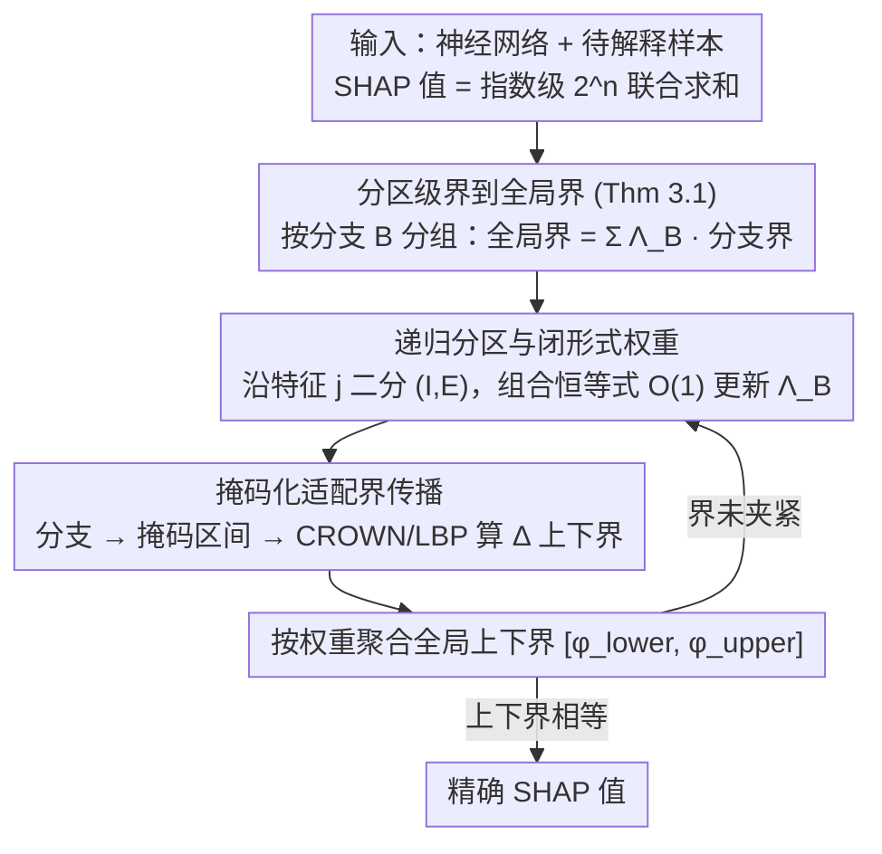

# Verified SHAP: 神经网络精确 Shapley 值的可证明界

**会议**: ICML 2026  
**arXiv**: [2605.24084](https://arxiv.org/abs/2605.24084)  
**代码**: https://github.com/sen-uni-kn/verishap  
**领域**: 可解释性 / 神经网络验证  
**关键词**: SHAP, 可解释性, 神经网络验证, 分支定界, 可证明界

## 一句话总结
VERISHAP 通过组合分支定界与神经网络验证技术，首次为神经网络 SHAP 值计算提供可证明的界限——并能扩展到比现有精确方法大几个数量级的特征搜索空间。

## 研究背景与动机

**领域现状**：SHAP 是最广泛使用的特征归因方法，对树模型和线性模型可高效计算精确值，而神经网络上的精确计算面临指数复杂性。

**现有痛点**：神经网络上 SHAP 值计算导致特征子集上指数级搜索空间（$2^n$ 种联合），现有方法只能提供统计近似（KernelSHAP、DeepSHAP）。这些方法两个根本局限——（1）在高度非线性模型下精度不足；（2）缺乏原则性评估框架（无法获得"真值"验证）。

**核心矛盾**：精确 SHAP 计算的 #P-hard 性质与实际可解释性需求之间矛盾——研究者无法用精确值验证近似方法的质量。

**本文目标**：（1）扩展精确 SHAP 计算的可行规模；（2）在任意精度下提供可证明界限；（3）建立评估 SHAP 近似方法的"真值"基准。

**切入角度**：神经网络验证领域（分支定界、界传播如 CROWN）能用于计算复杂函数性质，但此前未应用于 SHAP。SHAP 值边际贡献 $\Delta_i(S)$ 在特征空间分区内可近似为线性，与分段线性 ReLU 网络结构恰好吻合。

**核心 idea**：用分支定界将 SHAP 计算转化为区间优化问题——递归分区特征集，在每分区内用神经网络验证的界传播技术为边际贡献计算上下界，最终恢复精确值。

## 方法详解

### 整体框架

VERISHAP 要解决的核心难题是：神经网络上的精确 SHAP 计算需要遍历 $2^n$ 种特征联合，规模一大就指数爆炸。它的破局思路是把"枚举所有联合求精确值"转写成一个区间优化问题——不再逐个联合计算，而是把特征集递归切成若干分区（分支），在每个分区内用神经网络验证的界传播技术直接算出边际贡献的上下界，再按 Shapley 权重把这些分区级的界聚合成整个 SHAP 值的上下界；当某个分区还太松导致界不够紧时就继续细分，直到上下界相等、精确值被"夹"了出来。整套流程因此具备 anytime 性质：早停就拿到一对可证明的界，跑到底就恢复精确值。

### 关键设计

**1. 分区级界到全局界：把指数求和拆成分支求和**

直接对付 $2^n$ 项求和是不现实的，所以第一步要把"全局 SHAP 值"和"分区里能算的局部量"接起来。Theorem 3.1 给出了这座桥：SHAP 定义为 $\varphi_i = \sum_{S \in S_i} \lambda(|S|) \Delta_i(S)$，把其中的特征子集按分支 $B_k$ 分组后，只要在每个分支内拿到边际贡献的一对界 $\Delta_{i,B}^{lower} \leq \Delta_i(S) \leq \Delta_{i,B}^{upper}$，就能推出全局界 $\sum_{B} \Lambda_B \Delta_{i,B}^{lower} \leq \varphi_i \leq \sum_{B} \Lambda_B \Delta_{i,B}^{upper}$。这样一来，指数级的逐联合求和被替换成分支数量级的求和，每个分支只需算一对界即可，是后续所有效率收益的理论起点。

**2. 递归分区与闭形式权重：用组合恒等式做常数时间更新**

分区要能反复细化才有用，而细化时最怕的是每个新分支都重新算一遍 Shapley 组合权重。VERISHAP 用 $(I, E)$（已固定包含的特征集 $I$、已固定排除的特征集 $E$）刻画一个分支，记 $r = |I|$、$s = |I| + |E|$，该分支的聚合权重有闭形式 $\Lambda_B = \binom{s}{r}^{-1} (s+1)^{-1}$。当沿某个未固定特征 $j$ 把分支一分为二时，子分支的权重不必重算，而是用组合恒等式从父分支递推：包含该特征的子分支 $\Lambda_{B'} = \frac{r+1}{s+2} \Lambda_B$，排除的子分支 $\Lambda_{B''} = \frac{s+1-r}{s+2} \Lambda_B$。递归细分因此每步只是常数时间的权重更新，分区树可以放心地深下去。

**3. 掩码化适配界传播：把离散子集喂给连续域的验证器**

SHAP 的特征子集本质是离散组合对象，而 CROWN 这类界传播（LBP）工具是为连续输入区间设计的，两者天然不兼容。VERISHAP 用一个二进制掩码 $m \in \{0,1\}^n$ 来表示特征子集 $S$，并把边际贡献写成 $\Delta_i(m) = v(m^{+i}) - v(m)$；于是一个分支 $(I,E)$ 恰好对应一个掩码区间 $[\underline{m}, \bar{m}] \subseteq [0,1]^n$，被固定的特征取 0 或 1、未固定的特征张成 $[0,1]$ 自由维。把这个区间交给 LBP（如 CROWN），就能直接算出该分支的 $[\Delta_{i,B}^{lower}, \Delta_{i,B}^{upper}]$。这一步是整套方法能跑起来的关键——它把离散组合优化（SHAP）翻译成连续凸优化（神经网络验证），让对抗鲁棒性领域成熟的界传播器无缝接管 SHAP 的界计算。

## 实验关键数据

### 主实验

| 数据集 | 特征数 $n$ | 联合数 | EXACTSHAP (s) | VERISHAP 精确 (s) | 提升 |
|--------|-----------|--------|---------------|--------------------|---------|
| Obesity | 17 | $2^{17} > 10^4$ | 4 | 18 | ✓ 可行 |
| German | 20 | $2^{20} > 10^6$ | 9 | 16 | ✓ 可行 |
| Mushroom | 22 | $2^{22} > 10^6$ | – (OOM) | 17 | **无可比** |
| Default | 23 | $2^{23} > 10^6$ | – (OOM) | 127 | **无可比** |
| Auto | 25 | $2^{25} \approx 3 \times 10^7$ | – (OOM) | 81 | **无可比** |
| Sonar | 60 | $2^{60} > 10^{18}$ | – | 13 (10% HR) | **大幅扩展** |

### MNIST CNN 收敛

| 迭代数 | 运行时 (s) | 关键指标 |
|------|-----------|---------|
| t=1 | 1s | 界宽度 > 200% 网络输出 |
| t=121 (25% HR) | 25s | 界宽度收缩至 25% |
| t=278 (10% HR) | 29s | 清晰显示图像区域重要性 |
| t=512 精确 | 34s | 上下界相等，恢复精确值 |

### 关键发现
- VERISHAP 对 $n \geq 22$ 表格数据扩展精确计算 1-2 个数量级。
- 在 $n=60$ 特征 Sonar 数据上从 OOM 降至 13s 的界计算。
- CROWN-IBP 检测到值函数跨多联合时的常数性（Theorem 3.5 应用）避免穷举 $2^{64}$ 个联合。
- 界在前几十轮迭代后已具可用性——10% 相对误差下浮现归因模式。
- 分割策略消融：SMEARS > SmartBranching > StrongBranching > InOrder。

## 亮点与洞察
- **验证到解释的范式转移**：首次将神经网络验证工具系统引入 SHAP 计算，展现 adversarial robustness 与可解释性两个领域的深层联系。
- **理论-实践的裂隙**：Theorem 3.5 证明分段线性网络在充分分区后可退化为常数函数查询，规避组合爆炸。
- **可证明界作为中间产品**：生成的界序列在精确值前数十轮迭代即具实用性，为时间-精度权衡提供原则性方案。
- **评估框架的反转**：首次能在 20-25 特征真实表格数据获得精确值，反过来评估 KernelSHAP 和 TreeMSR。

## 局限与展望
- 高维瓶颈——$n > 25$ 时精确计算仍需 > 100s；图像 RGB 像素仍不实用。
- 值函数 tractability 依赖——若界过松，递归会探索指数多分支。
- 背景分布的隐含假设——不同背景选择会影响验证器的界紧性。
- 改进：集成更强神经网络验证算法；研究特征聚合理论；适配其他归因方法（IG、DeepLIFT）。

## 相关工作与启发
- **vs ExactSHAP**：枚举所有 $2^{n-1}$ 联合，神经网络易 OOM；VERISHAP 通过分支定界+界传播规避穷举。
- **vs KernelSHAP/DeepSHAP**：MC 采样近似无精度保证；VERISHAP 提供"真值基准"和上界。
- **启发链**：神经网络验证从对抗健壮性演进到通用界传播，本文反向流动到解释领域。

## 评分
- 新颖性: ⭐⭐⭐⭐⭐  首次用验证技术系统求解 SHAP，范式创新与技术创新兼有。
- 实验充分度: ⭐⭐⭐⭐  表格全面 + 消融完整 + MNIST 可视化；高维图像实验缺失。
- 写作质量: ⭐⭐⭐⭐  数学严谨，算法伪代码清晰；分割策略小节过短。
- 价值: ⭐⭐⭐⭐⭐  既有理论突破又有实践价值，对可解释 AI 与形式化验证融合意义深远。

<!-- RELATED:START -->

## 相关论文

- [\[ICML 2026\] ShaplEIG: Bayesian Experimental Design for Shapley Value Estimation](shapleig_bayesian_experimental_design_for_shapley_value_estimation.md)
- [\[NeurIPS 2025\] SHAP Values via Sparse Fourier Representation](../../NeurIPS2025/interpretability/shap_values_via_sparse_fourier_representation.md)
- [\[ICML 2025\] DeltaSHAP: Explaining Prediction Evolutions in Online Patient Monitoring with Shapley Values](../../ICML2025/interpretability/deltashap_explaining_prediction_evolutions_in_online_patient_monitoring_with_sha.md)
- [\[ICML 2026\] From Rashomon Theory to PRAXIS: Efficient Decision Tree Rashomon Sets](from_rashomon_theory_to_praxis_efficient_decision_tree_rashomon_sets.md)
- [\[ICML 2026\] Interpretable Self-Supervised Learning via Representer Landmarks and Nyström Approximation](interpretable_self-supervised_learning_via_representer_landmarks_and_nyström_app.md)

<!-- RELATED:END -->
