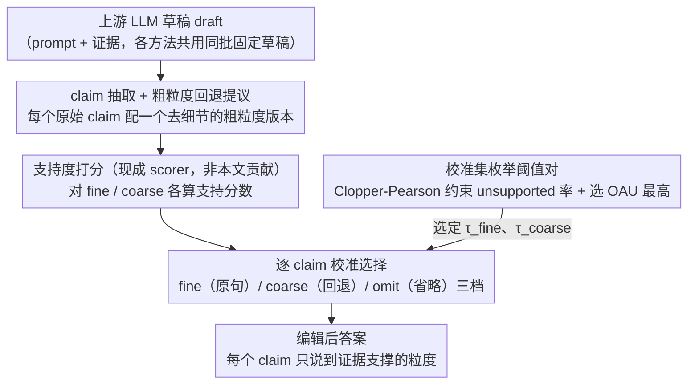

# Answer Only as Precisely as Justified: Calibrated Claim-Level Specificity Control for Agentic Systems

**会议**: ICML 2026  
**arXiv**: [2604.17487](https://arxiv.org/abs/2604.17487)  
**代码**: 未在缓存正文中提供  
**领域**: LLM Agent / 不确定性校准  
**关键词**: claim 级事实校验、特异性控制、校准选择、过度承诺、长文本事实性  

## 一句话总结
这篇论文把 agentic 系统里的“说得过细但证据不够”建模为 claim 级过度承诺问题，并提出 calibrated CSS：对每个原子 claim 在精确表述、粗粒度回退和省略之间做校准选择，在 LongFact 全量实验中将 OAU 从无后处理的 0.8460 提升到 0.9130，同时保留 0.9381 的特异性。

## 研究背景与动机
**领域现状**：现代 LLM agent 往往不是一次性生成一句答案，而是检索证据、调用工具、汇总多个事实，再把结果交给用户或下游模块。这样的输出天然是由许多 claim 组成的：有些 claim 证据很强，有些只在大方向上成立，还有些具体细节并没有被证据支持。

**现有痛点**：传统的 answer-level 不确定性处理太粗。若把整个回答拒答，系统会丢掉许多其实有用、被支持的内容；若原样回答，系统又可能把日期、数字、实体关系等细节说得过于确定。长文本事实性研究已经说明，一个回答内部常常混合着正确和错误内容，因此只给整段回答一个置信度并不能指导系统应该保留哪些信息。

**核心矛盾**：可靠性和信息量之间的矛盾不只体现在“答或不答”，更体现在“以多精确的语义粒度回答”。一个 claim 的粗粒度版本可能被证据支持，但原始细粒度版本不被支持；删除整个 claim 太保守，保留原句又会过度承诺。

**本文目标**：作者希望构造一个黑盒后处理层，不重新训练上游模型，也不改 retrieval stack，而是在固定草稿上逐 claim 决定最合适的语义精度。它要做到三件事：识别原始 claim，生成可用的粗粒度 backoff，再用校准规则选择 fine、coarse 或 omit。

**切入角度**：论文的关键观察是，不确定性可以被表达为局部语义回退，而不是模糊措辞或全局拒答。例如证据只支持“协议在日内瓦签署”，不支持“某一年签署”，系统应回退到前者，而不是整句删除或保留错误年份。

**核心 idea**：用校准后的 claim 级选择器，在“原始精确 claim / 粗粒度 claim / 省略”三档之间选择证据允许的最高精度，从而让 agentic 系统只说到证据足以支撑的粒度。

## 方法详解
论文提出的 CSS（compositional selective specificity）可以理解成一个放在生成器之后的语义精度控制器。输入是 prompt、可用证据和上游 LLM 生成的 draft answer；输出不是一个重新生成的回答，而是对 draft 内部每个 claim 的局部编辑结果。

这个设计的重点不是训练一个新 verifier，而是把已有 support score 变成可部署的选择策略。support estimator 本身由语言模型式支持判断与轻量 lexical/entity 特征组合而成，并且在一次运行中固定；论文真正贡献的是如何使用这些 noisy score 来选择 claim 的输出粒度。

### 整体框架
整体流程分为四步。

第一步是 draft generation：上游语言模型基于 prompt 和证据生成初始答案。所有对比策略都基于同一批固定草稿，因此实验比较的是后处理选择策略，而不是不同生成器之间的差异。

第二步是 claim extraction and backoff proposal：系统把草稿拆成原子 claim $c_1, \ldots, c_m$。对每个原始 claim $c_i$，系统再生成一个粗粒度版本 $\tilde{c}_i$，目标是保留中心含义，同时去掉可能不被证据支持的细节。

第三步是 support scoring：对 fine claim 和 coarse claim 分别估计支持分数 $s_i^{\mathrm{fine}}$ 与 $s_i^{\mathrm{coarse}}$。离线评估时还有二元支持标签 $y_i^{\mathrm{fine}}$、$y_i^{\mathrm{coarse}}$，但这些标签只用于打分和 oracle 上界，不提供给可部署选择器。

第四步是 claimwise selection：选择器对每个 claim 采取 $\pi_i \in \{\mathrm{fine}, \mathrm{coarse}, \mathrm{omit}\}$。如果 fine 分数过阈值，保留原始 claim；如果 fine 不过但 coarse 过阈值，输出粗粒度版本；如果两者都不通过，则省略该 claim。

### 关键设计
**1. 三档语义特异性阶梯：在「答/不答」之外多开两档语义粒度**

传统不确定性处理只在「保留整段」和「整段拒答」之间二选一——拒答会丢掉大量本来被支持的有用内容，原样保留又会把日期、数字、实体关系等不被证据支撑的细节说得过于确定。CSS 把每个 claim 的输出空间细化成三档：fine 是原始细粒度 claim，coarse 是去掉不稳定细节后的改写（局部降精度而非删除），omit 才是彻底不输出。三档的价值用特异性权重刻画：$w(\mathrm{omit})=0$、$w(\mathrm{coarse})=\gamma$、$w(\mathrm{fine})=1$（实验取 $\gamma=0.6$）。这比「保留/删除」二元动作更贴合真实错误形态——很多 claim 并非完全无效，只是原句说得太具体；coarse backoff 让系统在守不住细粒度时退一步，保留住被证据支持的核心含义。

**2. 过度承诺感知的评估目标 OAU：把「有用地保留」和「错误地过度承诺」放进同一把尺子**

如果只看 support precision，系统大可靠「大量删除/拒答」刷出虚高分数；如果只看 specificity retention，又会纵容它保留未被支持的细节。论文用 OAU（over-commitment-aware utility）把两种倾向放进同一个目标：对被支持的特异性给正奖励、对「输出了却不被支持」的 claim 给负惩罚，形式上近似为每个 claim 的 $w(\pi_i)y_i^{\mathrm{sel}} - e_i(1-y_i^{\mathrm{sel}})$ 取平均（论文同时报告 support precision、specificity retention、supported specificity 作为侧面指标）。关键在于 OAU 不只是评估指标，它还是下一步校准阈值时被最大化的目标，因此直接定义了「什么样的逐 claim 选择策略才算好」。

**3. Clopper-Pearson 约束下的校准阈值选择：用置信上界把 noisy 分数变成可部署阈值**

support score 本身是 noisy 的，且分布会随数据集、模型、run 漂移，手工固定阈值要么太保守、要么压不住风险。CSS 改在 held-out 校准集上枚举阈值对 $(\tau_{\mathrm{fine}}, \tau_{\mathrm{coarse}})$：对每一对，统计校准集里 unsupported emitted claims 数 $k$ 与 emitted claims 数 $n$，算单侧 Clopper-Pearson 上置信界，只保留满足 $\mathrm{CPUpper}(k,n;\delta) \leq \alpha$ 的阈值对（实验 $\alpha=0.10$、$\delta=0.05$），再在这些合法阈值对里选校准 OAU 最高者。这样选择器既把 unsupported emission 的风险压在预算内，又能自动移动到 utility 更高的 operating point。论文也谨慎说明：同一校准集既用于筛阈值又用于最大化 OAU，因此这只是 conservative calibration rule，不是端到端的分布无关 conformal 保证。

### 损失函数 / 训练策略
CSS 不是端到端训练方法，因此没有传统意义上的训练损失。它的“训练/选择”主要发生在两个层面：一是 support scorer 在每个 run 内 fit 一次并固定，二是 calibrated CSS 在校准 split 上选择阈值对。全量 LongFact 实验采用 five-fold out-of-fold evaluation：每个 prompt 在 held-out fold 上评估，scorer fitting 和 threshold calibration 在其余 folds 上完成。

论文也强调，这个校准步骤不是完整的 conformal guarantee。因为同一校准 split 同时用于筛选阈值对和最大化 OAU，作者把它称为 conservative calibration rule，而不是端到端分布无关保证。

## 实验关键数据

### 主实验
主实验使用 LongFact 全量 2,280 个 prompts，共抽取 11,705 个 claims。所有方法都在同一批 GPT-5.4 固定草稿上比较，指标按 claimwise protocol 计算，而不是 LongFact 官方 SAFE/F1@K leaderboard 指标。

| 数据集 / 运行 | 策略 | 样本数 | 输出 claims / 总 claims | Support precision | Specificity retention | Supported specificity | OAU |
|---------------|------|--------|--------------------------|-------------------|------------------------|-----------------------|-----|
| LongFact full / GPT-5.4 | No CSS | 2280 | 11705 / 11705 | 0.9230 | 1.0000 | 0.9230 | 0.8460 |
| LongFact full / GPT-5.4 | Whole abstain | 2280 | 7365 / 11705 | 0.9825 | 0.6292 | 0.6182 | 0.6072 |
| LongFact full / GPT-5.4 | Claim-drop | 2280 | 10823 / 11705 | 0.9877 | 0.9246 | 0.9133 | 0.9019 |
| LongFact full / GPT-5.4 | Uncalibrated CSS | 2280 | 10948 / 11705 | 0.9934 | 0.8633 | 0.8583 | 0.8521 |
| LongFact full / GPT-5.4 | Calibrated CSS | 2280 | 11085 / 11705 | 0.9865 | 0.9381 | 0.9258 | 0.9130 |
| LongFact full / GPT-5.4 | Oracle CSS | 2280 | 11056 / 11705 | 1.0000 | 0.9359 | 0.9359 | 0.9359 |

这个表的核心结论是，calibrated CSS 并不是单纯追求最高 precision。它相较 no CSS 把 support precision 从 0.9230 提到 0.9865，OAU 从 0.8460 提到 0.9130；相较 uncalibrated CSS，它牺牲很小的 precision，但把 specificity retention 从 0.8633 提到 0.9381，因此最终 OAU 高出 0.0609。

### 消融实验
论文的关键消融是固定阈值 CSS 与校准 CSS 的比较，并在 LongFact pilot 和 HotpotQA pilot 上复现。每个 pilot 使用 200 个样本，划分为 30 fit、30 calibration、140 test。

| 数据集 / 模型 | 策略 | 测试样本数 | claims | Support precision | Specificity retention | Supported specificity | OAU |
|---------------|------|------------|--------|-------------------|------------------------|-----------------------|-----|
| LongFact pilot / GPT-5.4 | Uncalibrated CSS | 140 | 721 / 757 | 0.9958 | 0.5900 | 0.5876 | 0.5836 |
| LongFact pilot / GPT-5.4 | Calibrated CSS | 140 | 724 / 757 | 0.9931 | 0.9411 | 0.9355 | 0.9289 |
| HotpotQA pilot / GPT-5.4 | Uncalibrated CSS | 140 | 409 / 470 | 0.9829 | 0.6209 | 0.6111 | 0.5962 |
| HotpotQA pilot / GPT-5.4 | Calibrated CSS | 140 | 429 / 470 | 0.9790 | 0.9000 | 0.8809 | 0.8617 |
| HotpotQA pilot / Claude Sonnet 4.6 | Uncalibrated CSS | 140 | 622 / 648 | 0.9936 | 0.7191 | 0.7142 | 0.7080 |
| HotpotQA pilot / Claude Sonnet 4.6 | Calibrated CSS | 140 | 628 / 648 | 0.9904 | 0.9475 | 0.9395 | 0.9302 |

### 关键发现
- 固定阈值 CSS 在多个 pilot 上都表现为“极安全但太保守”：precision 接近 0.99，但 specificity retention 明显偏低，LongFact pilot 只有 0.5900，HotpotQA GPT-5.4 pilot 只有 0.6209。
- 校准的收益主要来自选择 operating point，而不是更换 verifier。三个 pilot 中，calibrated CSS 都只损失 0.0027 到 0.0039 左右的 precision，却大幅提升 retention 和 OAU。
- Claim-drop 是很强的 baseline，但它没有 coarse backoff，只能删除未过阈值的 fine claim。calibrated CSS 在 LongFact full 上超过 claim-drop，说明“局部降精度”比“删除细节”能保留更多有用信息。
- Oracle CSS 的 full-run OAU 为 0.9359，而 calibrated CSS 为 0.9130，两者差距存在但不大。这说明当前选择层已经捕捉到多数可用收益，后续提升更可能来自更强的 claim extraction、backoff generation 和 support estimation。

## 亮点与洞察
- 论文把“幻觉”问题重新拆成“过度承诺”问题，这个视角很实用。很多 agent 输出不是完全错，而是在证据不足时给了过细的日期、数字或关系；CSS 正好针对这种灰区。
- coarse backoff 是比 abstention 更适合 agentic pipeline 的不确定性接口。它不是简单说“我不知道”，而是把系统知道到什么程度显式写出来，下游模块可以据此决定是否重检索、升级 verifier 或交给人工。
- OAU 的设计避免了“高 precision 但没内容”的虚假胜利。whole-answer abstention 和 uncalibrated CSS 都能让错误更少，但只有 calibrated CSS 在保留有用 specificity 的同时保持高 support precision。
- 这篇论文最有迁移价值的地方是“把不确定性转成局部编辑策略”。类似思路可以用于代码生成里的 uncertain API detail 回退、医学报告里的诊断等级控制，或多跳问答中对时间、地点、实体关系的粒度控制。

## 局限与展望
- LongFact 全量实验使用的是作者定义的 claimwise protocol，而不是官方 SAFE/F1@K 流水线。因此这些数字适合说明 claim-level 后处理效果，不应直接与 LongFact leaderboard 分数混读。
- HotpotQA 和 LongFact pilot 都只有 200 个样本，其中 test 为 140 个样本。它们能说明校准趋势，但还不足以覆盖更复杂的检索失败、工具调用失败和多轮 agent 交互。
- Oracle CSS 只是上界，不是可部署方法。实际系统仍会继承 claim extraction、coarse backoff 生成和 support estimation 的错误；如果 backoff 本身改写失真，选择器再校准也无法保证语义正确。
- 校准规则目前不是完整的分布无关保证。论文使用 Clopper-Pearson 上界约束 unsupported emission，但同一校准集还用于选择最高 OAU 阈值，因此后续需要更严格的 finite-sample validity layer。
- 当前方法主要处理固定草稿的后处理，尚未研究持续监控或 sequential agent 场景。真实 agent 可能会根据被降级的 claim 重新检索、再次调用工具或调整任务计划，这会引入新的反馈回路。

## 相关工作与启发
- **vs selective prediction / conformal prediction**: 传统选择性预测多是接受或拒绝整个样本，conformal prediction 给出分布无关的不确定性集合；本文借鉴其风险控制思想，但控制对象变成了回答内部每个 claim 的语义粒度。
- **vs FActScore / LongFact**: FActScore 和 LongFact 关注长文本输出中 atomic facts 的事实性评估；CSS 则进一步问“如果某个事实不完全支持，应该如何编辑输出”，从评估走向可执行的控制层。
- **vs SelfCheckGPT / Chain-of-Verification**: 这些方法强调后验验证与减少幻觉，通常输出 verifier 判断或改写提示；本文把 verifier score 明确接到 fine/coarse/omit 的决策上，形成更结构化的输出策略。
- **vs Conformal Linguistic Calibration / Selective Abstraction**: 这些工作同样关注在事实性和特异性之间折中；本文更强调 agentic deployment，把输出看成可供下游审计、升级和重检索的 claim-level uncertainty interface。

## 评分
- 新颖性: ⭐⭐⭐⭐☆ 将过度承诺明确建模为 claim 级特异性控制，并把 coarse backoff 与校准选择结合，问题定义很清晰。
- 实验充分度: ⭐⭐⭐⭐☆ LongFact 全量 2,280 prompts 加多个 pilot 支撑主要结论，但 pilot 规模较小，且评估协议不是官方 SAFE/F1@K。
- 写作质量: ⭐⭐⭐⭐☆ 论文结构清楚，指标和 baseline 解释到位，尤其把 deployable selector 与 oracle ceiling 区分得比较谨慎。
- 价值: ⭐⭐⭐⭐⭐ 对实际 agent 系统很有启发，因为它提供了比拒答更细、比原样回答更安全的可靠性接口。

<!-- RELATED:START -->

## 相关论文

- [\[ICML 2026\] AgentXRay: White-Boxing Agentic Systems via Workflow Reconstruction](agentxray_white-boxing_agentic_systems_via_workflow_reconstruction.md)
- [\[ICML 2026\] OTora: A Unified Red Teaming Framework for Reasoning-Level Denial-of-Service in LLM Agents](otora_a_unified_red_teaming_framework_for_reasoning-level_denial-of-service_in_l.md)
- [\[ACL 2026\] Rethinking Reasoning-Intensive Retrieval: Evaluating and Advancing Retrievers in Agentic Search Systems](../../ACL2026/llm_agent/rethinking_reasoning-intensive_retrieval_evaluating_and_advancing_retrievers_in_.md)
- [\[AAAI 2026\] With Great Capabilities Come Great Responsibilities: Introducing the Agentic Risk & Capability Framework for Governing Agentic AI Systems](../../AAAI2026/llm_agent/with_great_capabilities_come_great_responsibilities_introducing_the_agentic_risk.md)
- [\[AAAI 2026\] Reflection-Driven Control for Trustworthy Code Agents](../../AAAI2026/llm_agent/reflection-driven_control_for_trustworthy_code_agents.md)

<!-- RELATED:END -->
