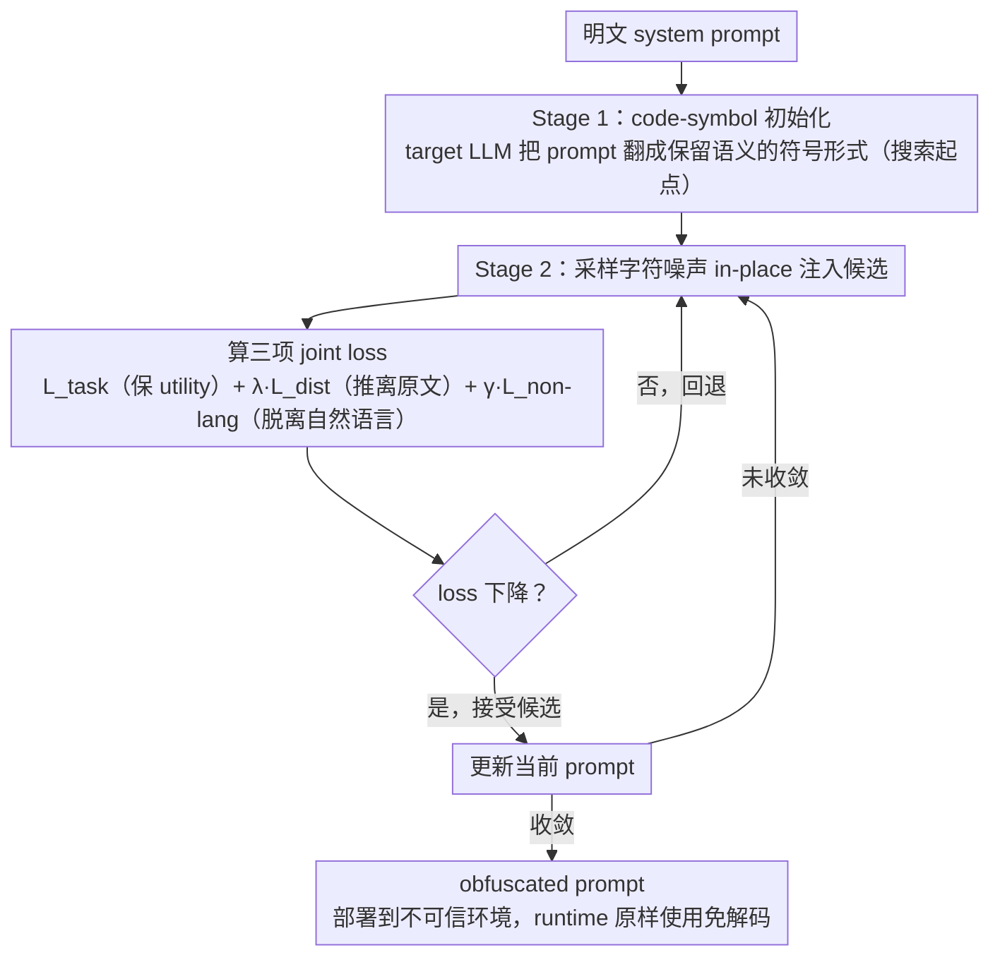

# PragLocker: Protecting Agent Intellectual Property in Untrusted Deployments via Non-Portable Prompts

**会议**: ICML 2026  
**arXiv**: [2605.05974](https://arxiv.org/abs/2605.05974)  
**代码**: 无  
**领域**: Agent 安全 / Prompt 保护 / LLM IP 防护  
**关键词**: prompt 混淆、agent IP、non-portability、black-box 优化、随机搜索

## 一句话总结
PragLocker 用 "代码符号初始化 + 黑盒目标模型反馈下的噪声注入" 两阶段策略，把 agent system prompt 编码成一段只能在 target LLM 上 work、迁移到其它任意 LLM 都会失效的 obfuscated text，从而在 prompt 被部署侧窃取时让攻击者无法在自己的 LLM 上复用。

## 研究背景与动机
**领域现状**：Cursor / Manus / Zapier 等商业 LLM Agent 的核心 IP 是 system prompt——同样调用 GPT-4o，不同 prompt 设计造就完全不同的产品体验，所以 prompt 是 agent 公司投入大量专家迭代的高价值资产。

**现有痛点**：Agent 经常部署在用户设备、第三方云、多租户基础设施上，恶意终端用户或云内部人员可以直接 dump 出 prompt，然后拿去任何更强的 LLM 上复刻甚至超越原 Agent。现有方案——prompt watermarking（事后验证）、加密（runtime 必须解密回明文送 API）、emoji obfuscation（其它 LLM 也能解码）、Pape 等的 representation-space obfuscation（需要白盒访问，但 GPT/Gemini 是黑盒）——都无法同时满足 proactivity / runtime / usability / non-portability 四个要求。

**核心矛盾**：要构造一个 "在 target LLM 上保持 utility、在其它 LLM 上失效" 的 prompt，本质要求该 prompt 既能保留原 prompt 的语义，又要 over-fit 到 target 模型特有的 loss landscape 几何，且只能用 API 级别的输入输出 + log-prob 反馈来构造。

**本文目标**：(1) 形式化 prompt 保护的四项需求 C1-C4；(2) 给出存在性证明保证理论可行；(3) 设计纯黑盒、API-only 的优化算法构造这种 prompt；(4) 在多模型 / 多 agent / 多任务上验证 portability 损失与 utility 保持。

**切入角度**：作者从 transformer attention 的 "attention dilution" 性质入手——网络对部分 token 的扰动不敏感，所以理论上存在一个 ε-球 stability region $S_{\bm{x}}$ 让 utility 不变；同时不同模型的 stability region 几何形状不同，使得 target-specific perturbation 不太可能落在其它模型的 region 内。

**核心 idea**：把 prompt obfuscation 当作 "gradient-free discrete optimization over target-LLM-specific loss landscape"，用 random search 在 utility / obfuscation / non-portability 三目标 joint loss 下搜索 prompt token 序列。

## 方法详解

### 整体框架
PragLocker 要把一段明文 system prompt 改造成「只在 target LLM 上 work、搬到别的 LLM 就废」的 obfuscated 文本，且全程只能用 API（黑盒、仅拿到输出和 log-prob）。它分两阶段：阶段一先让 target LLM 把明文 prompt $\bm{x}$ 翻成保留语义的 code-symbol 形式 $\tilde{\bm{x}}_0$，作为搜索起点；阶段二用 random search 反复往里注入字符级噪声，每一步用「任务 + 距离 + 非语言」三项 joint loss 判断是接受还是回退，最终得到的 $\tilde{\bm{x}}$ 直接部署到不可信环境，runtime 原样使用、不需要任何解码还原。

### 关键设计

**1. 理论根基：functional equivalence + stability region，把「prompt 可混淆」从经验说法变成存在性定理**

position paper 式地宣称「prompt 可以被混淆」很容易被批成 ad hoc，所以作者先给一个几何上的存在性证明。他们把 functional equivalence 定义为：扰动后的 embedding $\tilde{\bm{h}}$ 与原 embedding $\bm{h}$ 在任意 query $\bm{q}_i$ 下产生相同的 greedy decoding 就算等价；再定义 correct-class margin $m(\tilde{\bm{h}}, \bm{q}_i, y_i) = f(\tilde{\bm{h}}, \bm{q}_i)_{y_i} - \max_{k \neq y_i} f(\tilde{\bm{h}}, \bm{q}_i)_k$。只要 margin $> 0$，就一定存在一个 ε-球 $B_\epsilon(\bm{h})$ 让球内所有点都保持 functional equivalence，这个球就是 utility 不变的「stability region」$S_{\bm{x}}$。证明的关键利用了 transformer 的 attention dilution——网络对低 attention 的 token 扰动不敏感，所以只扰动 $k$ 个这样的 token，累计 embedding shift $\|\Delta\bm{h}\| \le \sum_{j} \|\bm{\delta}_j\|$ 能压在 ε 内保持 utility，而离散 prompt 距离 $d(\tilde{\bm{x}}, \bm{x})$ 又随 $k$ 增大到足够混淆。non-portability 则来自「manifold mismatch」：高维空间里模型 $\theta$ 的 $S_{\bm{x}}(\theta)$ 和另一模型 $\theta'$ 的 $S_{\bm{x}}(\theta')$ 几乎不相交，所以对 target 调好的扰动落不进别人的 stability region，这就给后面的工程方法提供了「为什么搬不走」的几何解释。

**2. Stage 1 — code-symbol 初始化：让 target LLM 自己生成起点，把 random search 放进 stability region 内部**

如果直接从空白随机搜索，几乎不可能命中一个还能保持 utility 的 prompt——搜索空间太大、stability region 太稀疏。所以这一步让 target LLM 把原 prompt 翻成「代码 + 符号」形式的 $\tilde{\bm{x}}_0$：表达从自然语言挪到更紧凑、但 target 仍能读懂的符号表示，语义和 utility 都保住。因为是 target LLM 自己生成的，这个 warm start 天然带 target 偏向，相当于一次 target-conditioned 的预混淆；同时符号化引入了冗余，给阶段二留出可以塞噪声的空间。本质上它把随机搜索的起点直接放进了 $S_{\bm{x}}$ 内部，大幅缩小后续要搜的有效范围。

**3. Stage 2 — random-search 噪声注入 + 三项 joint loss：用无梯度搜索把 prompt 推出自然语言分布**

黑盒下没有梯度，只能采样 + 过滤。每一步从噪声集合（通常是 printable 字符）采样 $\bm{n}_t$ in-place 注入当前 prompt $\tilde{\bm{x}}_t$ 得到候选 $\tilde{\bm{x}}'_{t+1}$，看 loss 降了就接受、否则回退——这就是经典的 gradient-free discrete 优化（random search，Rastrigin 1963，近年也用于 jailbreak suffix）。关键在三项联合目标各管一个需求：

$$\mathcal{L} = \mathcal{L}_{\text{task}} + \lambda \mathcal{L}_{\text{dist}} + \gamma \mathcal{L}_{\text{non-lang}}$$

其中 $\mathcal{L}_{\text{task}} = -\log p(\bm{y}|\bm{q}, \tilde{\bm{x}})$ 保 utility（管 C3），$\mathcal{L}_{\text{dist}} = -\log \sigma(\mathrm{Dist}(\tilde{\bm{x}}, \bm{x}))$ 用 Levenshtein 距离把结果推离原文（管 C2），$\mathcal{L}_{\text{non-lang}} = -H(\tilde{\bm{x}})$ 通过最小化字符 Shannon 熵让 prompt 远离自然语言分布。最后这项是整个方法的命门：自然语言本身就是高度 portable 的（任何 LLM 都读得懂），所以只要把 prompt 推成「看起来像随机 token salad、却仍能在 target 上触发正确行为」的形式，它就同时丢掉了跨模型可读性（C2、C4）——等价于在 target 的 loss landscape 上找到一个只有它认得的「模型条件触发器」。

### 损失函数 / 训练策略
训练就是 Algorithm 1 的贪心 random search：每步采一个 mini-batch $(\bm{q}_t, \bm{y}_t)$ 和噪声 $\bm{n}_t$，比较注入前后的总 loss，降了就接受、否则保留旧 prompt。全程无梯度、无白盒，只依赖 target LLM API 返回的 log-prob 和文本输出。

## 实验关键数据

### 主实验
portability 衡量：为某个 target LLM 优化好 prompt，然后把它原样搬到其它 LLM 上跑，看任务性能（如 LessonL agent + HumanEval/MBPP）：

| Agent / Task | Target LLM | 原 prompt → GPT-4o | 原 prompt → Gemini2 | PragLocker → GPT-4o | PragLocker → Gemini2 |
|------|------|------|------|------|------|
| LessonL / HumanEval | Gemini 2 | 93.90 | - | 0.61 | - |
| LessonL / HumanEval | DeepSeek | 93.90 | 98.78 | 0.61 | 2.44 |
| LessonL / MBPP | Gemini 2 | 91.89 | - | 0.51 | - |
| LessonL / MBPP | DeepSeek | 91.89 | 97.33 | 0.62 | （近 0） |

PragLocker 把跨模型迁移性能压到接近 0，原 prompt 的跨模型表现往往超过 90，protection 极其显著。

### 消融实验
论文给了两个 ablation 变体——PragLocker_tune（只做 task loss tuning 不注入 non-lang 噪声）、PragLocker_code（只做代码符号初始化不做噪声优化）：

| 配置 | 跨模型迁移性能 | 说明 |
|------|------|------|
| 原 prompt | 93-99 | 完全可移植 |
| PragLocker_code（只 init） | 85-95 | 代码化降低少量 portability，仍可用 |
| PragLocker_tune（只 task tune） | 80-93 | 仅 task loss 不足以阻断跨模型迁移 |
| **PragLocker（完整）** | 0-3 | 三项 loss 联合 + random search 后 portability 趋于 0 |

### 关键发现
- non-language loss 是 non-portability 的关键贡献者：单纯 task tuning 或代码化都不能显著降低跨模型迁移，必须把 prompt 推到自然语言分布之外才能 fail 在其它 LLM 上。
- 即便是同模型不同精度（FP16 vs 4-bit 量化版本），PragLocker 的 obfuscated prompt 也几乎不迁移，说明 stability region 对模型权重数值精度都敏感——这是 "manifold mismatch" 几何假设的强经验证据。
- target LLM 自己也无法解释 obfuscated prompt 的语义（即无法 deobfuscate 回原文），说明它退化成 "model-conditioned trigger"，不再保留 recoverable text-level information，提升了对 adaptive 攻击的鲁棒性。

## 亮点与洞察
- 把 prompt IP 保护建模为 "gradient-free discrete optimization" 是个非常贴切的 framing——既不能用梯度（黑盒），也不能用 fluent generation（要 non-language），random search + 三项 joint loss 恰好覆盖了这些约束。
- non-language entropy regularizer 是论文最具迁移价值的 trick：任何想阻断 "语义跨模型迁移" 的场景都可以借用——只要让中间表示偏离自然语言分布，跨模型可读性就崩溃。
- 用 target LLM 自己做代码符号初始化是 elegant 的 warm start——本质把搜索起点放到 target-specific manifold 内部，大幅缩小 random search 的有效搜索空间。
- 存在性定理通过 attention dilution 和高维稀疏给出几何解释，给以前 "经验有效但理论缺失" 的 prompt obfuscation 工作补上了理论基础，可以被其它 prompt 攻击/防御研究借鉴。

## 局限与展望
- 假设 attacker 不能访问大量 query-output pair 训练自己的 deobfuscator，但商业部署中 attacker 可能持续 farm 数据，长期 attack 风险未充分讨论。
- 三项 loss 的 $\lambda, \gamma$ 权重需要手调，不同 agent / task 可能需要重新搜索。
- random search 在长 prompt 上收敛慢，且 acceptance rate 可能很低，缺少与 evolution strategies / GCG 等替代优化器的对比。
- non-portability 主要在 GPT-4o / Gemini 2 / DeepSeek 三个 model family 上验证，对未见过的 closed-source 模型（如 Claude）或同 family 微小 fine-tune 的鲁棒性还不清楚。
- 该方法间接增加了 token 数量，可能提升 API 调用成本和 latency，论文未给量化。

## 相关工作与启发
- **vs prompt watermarking（PromptCARE / PromptCOS）**：watermark 只能事后追责，不阻止滥用；PragLocker 是主动防御，让窃取后无法复用。
- **vs encryption-based（K8s secrets / TEE）**：加密只能保护 at rest，runtime 必须解回明文送 black-box LLM API；PragLocker 直接让 runtime 的 prompt 就是 obfuscated 形式。
- **vs EmojiPrompt / Pape 的 representation obfuscation**：emoji 仍可被其它 LLM 解码，representation 方法需要白盒；PragLocker 兼顾纯黑盒 + non-portability + utility。
- **vs GCG 类 jailbreak suffix 优化**：技术上同为 gradient-free discrete optimization，但 PragLocker 是防御视角，objective 包含 non-portability 而非 attack success rate。

## 评分
- 新颖性: ⭐⭐⭐⭐⭐ 首次系统化提出 agent prompt 的 IP 保护需求并给出 "non-portable obfuscation" 方案，理论 + 工程都新。
- 实验充分度: ⭐⭐⭐⭐ 多 agent / 多任务 / 多 model family 覆盖，含 adaptive attack 评估。
- 写作质量: ⭐⭐⭐⭐ 需求拆分 + 存在性证明 + 算法描述 + ablation 一气呵成。
- 价值: ⭐⭐⭐⭐⭐ 直击商业 LLM Agent 部署的核心 IP 痛点，方法即插即用。

<!-- RELATED:START -->

## 相关论文

- [\[ICML 2026\] Skill-Pro: Learning Reusable Skills from Experience via Non-Parametric PPO for LLM Agents](skill-pro_learning_reusable_skills_from_experience_via_non-parametric_ppo_for_ll.md)
- [\[ICML 2026\] Weasel: 通过重要性-多样性数据选择实现 Web Agent 的域外泛化](weasel_out-of-domain_generalization_for_web_agents_via_importance-diversity_data.md)
- [\[ICML 2026\] Agent JIT Compilation for Latency-Optimizing Web Agent Planning and Scheduling](agent_jit_compilation_for_latency-optimizing_web_agent_planning_and_scheduling.md)
- [\[ICML 2026\] MCP-Persona: 用环境模拟评估 LLM agent 在真实个人化应用上的能力](mcp-persona_benchmarking_llm_agents_on_real-world_personal_applications_via_envi.md)
- [\[ICML 2026\] A Minimal Agent for Automated Theorem Proving](a_minimal_agent_for_automated_theorem_proving.md)

<!-- RELATED:END -->
